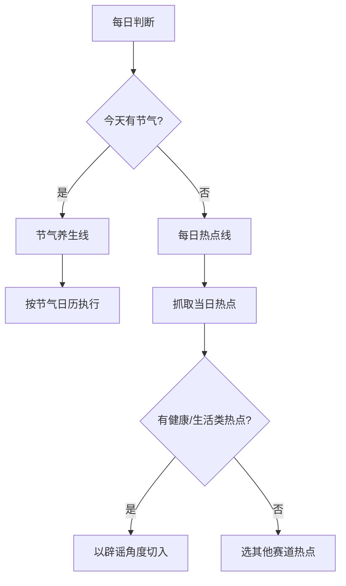

# 选题策略

> 「反生活」账号的选题方法论 — 节气线 + 热点线双轨制

---

## 双线策略



## A. 节气线

### 使用时机
- 节气当天及前后1天
- 每个节气出1篇相关辟谣/养生内容

### 选题公式
```
节气时令特点 × 常见误区3-5个 × 毒舌辟谣
```

### 示例
> **谷雨** → 谷雨要"祛湿"？这5个祛湿方法坑了多少人

### 注意事项
- ⚠️ **不能天天用节气**，容易审美疲劳
- 每次节气内容角度要换，避免同质化

## B. 热点线

### 使用时机
- 非节气日
- 有优质热点事件时

### 选材来源
| 来源 | 可用性 | 说明 |
|------|:------:|------|
| 百度热搜 | ✅ | 可用，抓取健康/生活类话题 |
| 微博热搜 | ⚠️ | 需登录 |
| 小红书热门 | ⚠️ | IP风控，MCP可尝试 |
| tophub聚合 | ❌ | IP验证码 |

### 选题标准
1. **有争论性** — 存在"大家都这么认为但其实是错的"的认知偏差
2. **有科学依据** — 能找到论文/数据/官方资料支撑
3. **普通人关心** — 和日常生活强相关
4. **可毒舌** — 适合用吐槽/调侃的语气表达
5. **独一无二** — 和小红书已有内容有明显差异

## 选题检查清单

```
□ 与已发布内容不重复（去重检查）
□ 有明确的辟谣/纠错价值
□ 可配图（至少有AI生图的空间）
□ 话题热度能满足出稿标准
□ 「反生活」人设匹配度 > 80%
```

## 节日/节气日历

| 月份 | 节气 | 热点方向 |
|:----:|------|---------|
| 4月 | 清明、谷雨 | 春季养生误区 |
| 5月 | 立夏、小满、五一 | 夏季防晒/饮食辟谣 |
| 6月 | 芒种、夏至、端午 | 消暑误区 |
