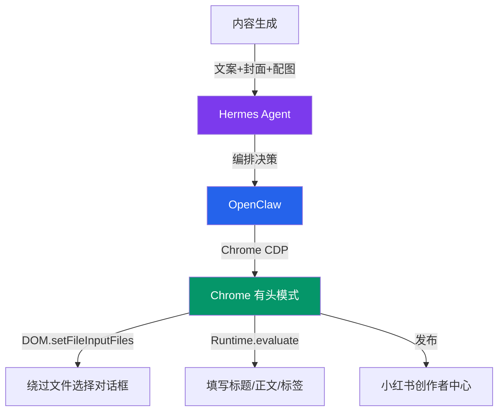

# CDP全自动发布方案

> Chrome DevTools Protocol 实现小红书全自动发布，绕过 macOS 文件对话框

---

## 方案架构

## 核心原理

- **Chrome CDP**：通过 `--remote-debugging-port=9222` 启动 Chrome
- **CDP 接口**：用 `DOM.setFileInputFiles` 绕过 macOS 文件选择对话框
- **无自动化指纹**：有头模式 + 真实用户环境，不被检测
- **发布流程**：打开 chrome://inspect → 连接已有 Chrome 标签页 → 注入 JS 操作

## 关键技术决策

| 决策 | 方案 | 原因 |
|------|------|------|
| 发布模式 | 真实Chrome + CDP | 绕过detection |
| 文件上传 | DOM.setFileInputFiles | 绕过系统对话框 |
| 文本输入 | Runtime.evaluate注入JS | 绕过peekaboo type超时问题 |
| 检测规避 | 有头模式+随机延迟 | 无自动化指纹 |

## 完整发布流程

1. 启动/连接到已有 Chrome 实例（9222端口）
2. 打开小红书创作者中心（已登录状态）
3. 选择上传图片 → CDP注入文件
4. 填写标题、正文、标签
5. 点击发布按钮
6. 验证发布成功

## 踩坑记录

### 🐛 文件选择对话框
macOS 原生文件选择对话框无法用 peekaboo/AppleScript 自动化操作，必须用 CDP 的 `DOM.setFileInputFiles` 绕过

### 🐛 标签页爆炸
JS语法错误会导致打开新标签页，需要增加错误处理和标签页管理

### 🐛 AppleScript 超时
`tell Google Chrome` 会在某些版本永久超时，建议用 `open -a` 替代启动

## 参考技能

详见技能 `xiaohongshu-cdp-publish`（Hermes 技能库）
