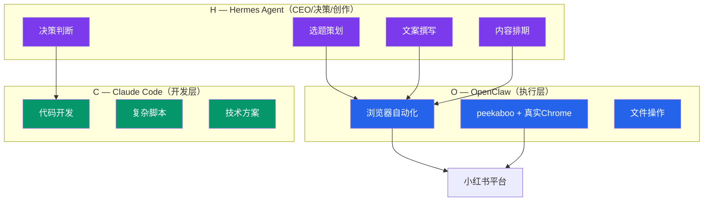

# HOC三层架构

> Hermes + OpenClaw + Claude Code 分工协作架构

---

## 架构图

## 各层职责

| 层级 | 角色 | 模型 | 职责 |
|:----:|:----:|:----:|------|
| **H** | Hermes | Kimi/GLM | 决策/创作/编排 — 选题、文案、排期 |
| **O** | OpenClaw | DeepSeek | 执行 — 浏览器操作、文件处理 |
| **C** | Claude Code | Claude | 开发 — 代码、脚本、技术方案 |

## 任务分级

| 复杂度 | 耗时 | 处理层 | 示例 |
|:------:|:----:|:------:|------|
| 简单 | 秒级 | Hermes 内置工具 | 选题判断、文案审核 |
| 中等 | 十秒级 | OpenClaw | 内容发布、图片上传 |
| 复杂 | 分钟级 | Claude Code | 技术方案编写、CDP脚本开发 |

## 原则

- **统一入口**：所有任务从一个对话入口发起，不分拆独立对话
- **按需委派**：简单任务Hermes自己做，复杂任务委派下层
- **逐层闭环**：每层完成自己的任务后返回结果给上层
