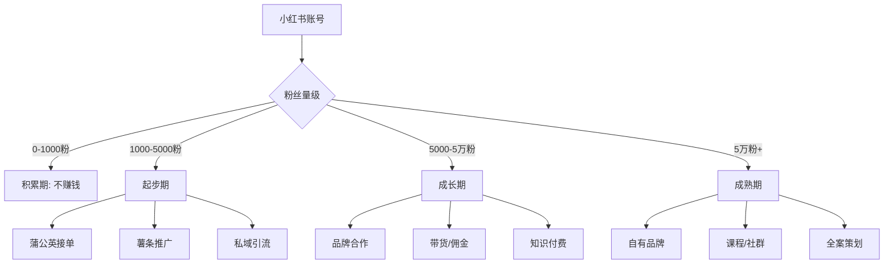

# 📕 Day1: 小红书变现全攻略

> **核心：小红书到底怎么赚钱？每个阶段做什么？**
> 来源：行业报告+实战案例整合

---

## 一、小红书变现全景图



---

## 二、小红书6大变现模式

### 1️⃣ 蒲公英平台接广（最低门槛：1000粉）

| 项目 | 说明 |
|------|------|
| **门槛** | 1000粉即可开通 |
| **收入** | 千粉号：200-500元/条 |
| **平台抽成** | 10% |
| **优点** | 最省事的变现方式 |
| **缺点** | 伤粉、内容不自由 |

### 2️⃣ 带货/佣金（门槛：0粉可开）

| 项目 | 说明 |
|------|------|
| **方式** | 笔记挂商品链接/直播带货 |
| **佣金** | 5%-30%不等 |
| **适合** | 测评/好物推荐/知识类 |
| **关键** | 选品>话术>流量 |

### 3️⃣ 知识付费（高利润）

| 形式 | 单价 | 转化率 | 适合赛道 |
|:----:|:----:|::----:|---------|
| 课程 | 99-999 | 1-3% | 技能/教育 |
| 咨询 | 200-500/次 | 3-5% | 垂直专家 |
| 社群 | 99-299/月 | 5-10% | 持续服务 |

### 4️⃣ 私域引流到微信

```
小红书 → 个人主页留微信/私信引导
  → 微信好友/社群
    → 朋友圈成交/社群转化/1v1咨询
```

**引流方式**：
- 简介放邮箱/公众号
- 私信用"图片发微信号"
- 直播时口播

### 5️⃣ 自有品牌/产品

- 0成本：电子书/模板/工具包
- 低成本：贴牌/代发
- 高投入：自己开发产品

### 6️⃣ 矩阵号代运营

| 模式 | 收入 | 规模 |
|:----:|:----:|:----:|
| 单号代运营 | 3000-8000/月 | 1-5个号 |
| 批量代运营 | 1-3万/月 | 5-20个号 |
| 培训孵化 | 5000-2万/人 | 小班课 |

---

## 三、「反生活」的变现路径设计

### 当前阶段：0-1000粉（积累期）
**目标：快速冲到1000粉开通蒲公英**

| 阶段 | 粉丝 | 策略 | 预期时间 |
|:----:|:----:|------|:--------:|
| 冷启动 | 0-500 | 每周3-5篇，测选题方向 | 2-4周 |
| 起步 | 500-1000 | 固定爆款公式，批量输出 | 2-3周 |
| 变现入口 | 1000+ | 开通蒲公英+挂商品链接 | ✅ 完成 |

### 1000粉后的变现路径

```
第一阶段（1000-5000粉）
├── 蒲公英接单：每条300-500元（每月2-4条）
├── 带货佣金：辟谣相关好物（检测试纸/健康产品）
└── 预估月收入：1000-3000元

第二阶段（5000-5万粉）
├── 品牌合作：5000-1.5万/条
├── 社群付费：99元/月（"反生活避坑指南"）
├── 1v1咨询：200元/次（生活谣言鉴别）
└── 预估月收入：5000-2万

第三阶段（5万粉+）
├── 课程：199元《辟谣内容创作课》
├── 矩阵号：3-5个号并行
├── 自有产品：检测工具包/健康手册
└── 预估月收入：2-5万
```

---

## 四、关键认知：流量 > 接广

### 重要性排序
```
流量（粉丝/曝光） >>>>> 接广告

因为：
1. 有流量，变现方式任选
2. 接广太早会限流、伤粉
3. 1000粉接一条200元 vs 1万粉接一条2000元
4. 流量可以复制到公众号/抖音/私域
```

### 老黄的执行原则
> **前1000粉只做内容，不想变现**
> 先验证内容公式，再考虑收钱

---

## 五、实操策略：反生活3个月变现路线

### Month 1：测试期
| 周次 | 目标 | 动作 |
|:----:|------|------|
| W1 | 验证选题方向 | 发5篇不同选题，看数据 |
| W2 | 锁定爆款公式 | 淘汰差选题，强化好选题 |
| W3 | 稳定输出 | 每周3-5篇，找节奏 |
| W4 | 冲到500粉 | 持续输出，优化封面 |

### Month 2：成长期
| 周次 | 目标 | 动作 |
|:----:|------|------|
| W5-6 | 500-1000粉 | 固定公式批量输出 |
| W7 | 开通蒲公英 | 1000粉里程碑 |
| W8 | 尝试1条商单 | 选口碑好的品牌 |

### Month 3：变现期
| 周次 | 目标 |
|:----:|------|
| W9-10 | 接2-3条商单 + 测试带货 |
| W11-12 | 私域引流 + 社群内测 |

---

## 六、行动清单（今天就能做的3件事）

```
□ 1. 确认「反生活」1000粉后的变现优先级
   建议：蒲公英接单 > 带货佣金 > 私域引流
   
□ 2. 准备"合作报价单"模板
   粉丝1000-5000: 200-500元/条
   粉丝5000-1万: 500-1500元/条
   
□ 3. 在内容中有意识地埋变现钩子
   例：辟谣某产品 → "大家别乱买，等我出测评"
```

---

> **关联**：[账号定位与赛道分析](../01-运营体系/账号定位与赛道分析.md) · [自媒体运营入门](自媒体运营入门.md)
