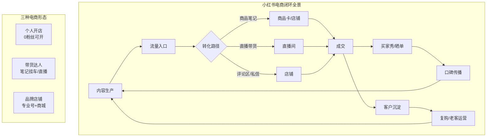
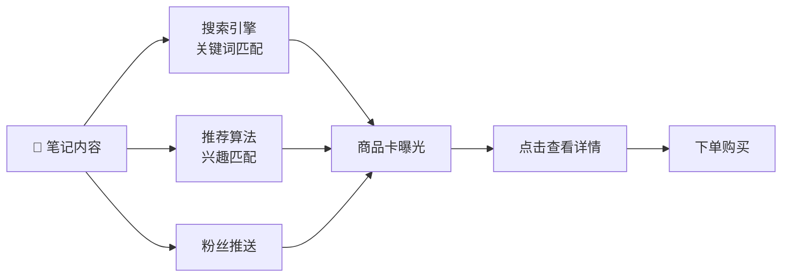
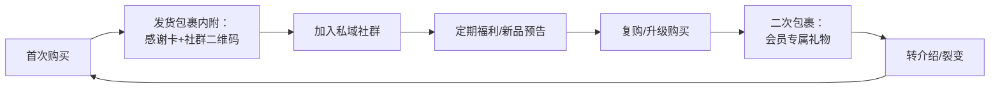
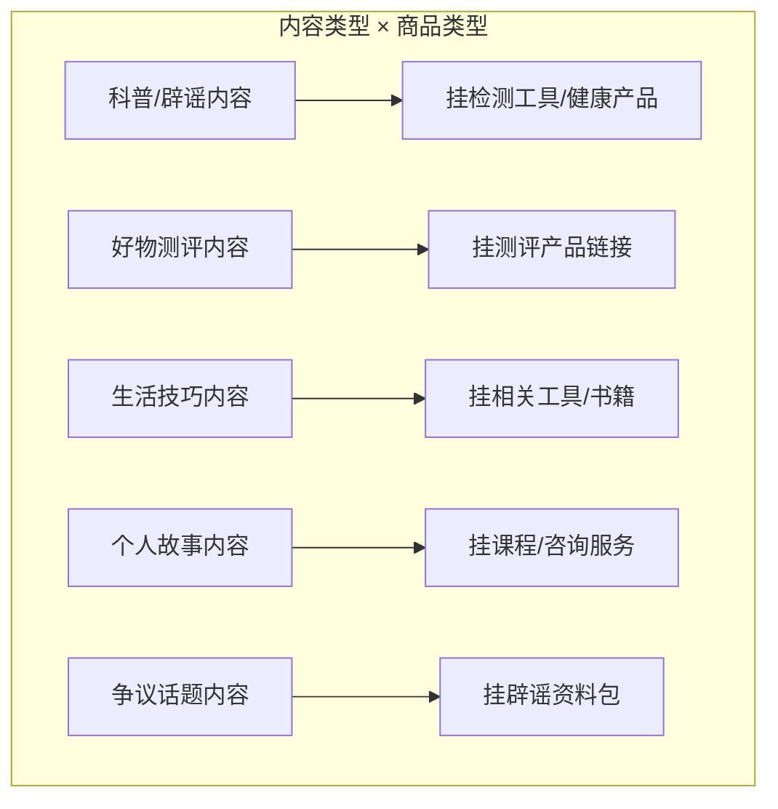

# 📕 Day11: 小红书电商闭环

> **核心：在小红书生态内完成「种草→购买→复购→口碑传播」全链路，不依赖外站引流也能月入过万**
> 来源：小红书官方电商白皮书 + 头部店铺实战案例 + 行业拆解

---

## 一、一句话总结

**小红书电商闭环 = 笔记种草 + 商品笔记/直播带货 + 店铺转化 + 私域沉淀 → 在自己的鱼塘里养鱼，不流出平台。**

核心逻辑是：**内容即货架，流量即销量**。小红书已经从"种草平台"进化到"种草+拔草一体化平台"，用户在小红书看到好物，直接下单，不需要跳转到淘宝/京东。

---

## 二、核心框架



---

## 三、小红书电商的3种形态

### 3.1 个人开店（小红书小商店）

| 项目 | 说明 |
|------|------|
| **门槛** | 0粉丝可开，实名认证即可 |
| **费用** | 保证金1000元（可退） |
| **适合** | 自己有货/代发/手工/知识产品 |
| **优势** | 不需要跳转，闭环内完成交易 |
| **适合反生活** | ✅ 知识产品（辟谣指南/避坑清单/检测工具包） |

**开店流程**：
```
小红书APP → 我 → 创作中心 → 开店 → 选择店铺类型
  → 个人店（最简单，身份证即可）
    → 设置店铺名/头像/简介
      → 上传商品（图文/视频）
        → 开通后即可在笔记中挂商品链接
```

### 3.2 带货达人（无货源模式）

| 项目 | 说明 |
|------|------|
| **门槛** | 0粉可开通「好物推荐」 |
| **模式** | 在选品中心挑选商品，挂链接赚佣金 |
| **佣金** | 5%-30% |
| **适合** | 测评类/好物分享/知识类博主 |
| **关键** | 选品能力 > 话术 > 粉丝量 |

**选品原则**：
```
高佣金 ❌ → 但不一定好卖
高转化 ❌ → 不一定适合你
高匹配 ✅ → 跟账号内容强相关 → 转化最高

反生活选品建议：
├── 生活检测类：甲醛检测仪、水质检测笔（佣金10-15%）
├── 健康科普相关：维生素、益生菌（佣金15-25%）
├── 家电测评：空气炸锅、除螨仪（佣金5-10%，客单价高）
└── 书籍/课程：辟谣类书籍、思维训练（佣金15-30%）
```

### 3.3 品牌店铺（专业号+商城）

| 项目 | 说明 |
|------|------|
| **门槛** | 需要营业执照 |
| **费用** | 保证金5000-20000元 |
| **适合** | 自有品牌/代加工 |
| **适合反生活** | 中期考虑，自创"反生活"周边产品 |

---

## 四、商品笔记：小红书电商的核心引擎

### 4.1 什么是商品笔记？

在普通笔记中**挂商品链接**，用户看到内容后可以直接点击购买。这是小红书电商的**最低门槛、最大流量**的成交方式。

### 4.2 商品笔记的流量逻辑



**关键数据指标**：
| 指标 | 及格线 | 优秀线 | 顶尖 |
|:----:|:------:|:------:|:----:|
| 点击率（笔记→商品卡） | 3% | 5-8% | 15%+ |
| 转化率（商品卡→购买） | 1% | 3-5% | 10%+ |
| 单笔记GMV | 100元 | 500-1000元 | 5000元+ |
| 笔记生命周期 | 7天 | 30天 | 90天+ |

### 4.3 爆款商品笔记的5个要素

```
1️⃣ 标题 = 痛点 + 解决方案
   ❌ "推荐一个好用的除螨仪"
   ✅ "我家狗掉毛严重，试了10款除螨仪，只有这款真的有用"
   
2️⃣ 封面 = 效果对比 / 使用场景
   ❌ 产品白底图
   ✅ 使用前后对比 / 真实场景图
   
3️⃣ 内容 = 真实体验 + 数据支撑
   ❌ "这个产品很好"（空洞）
   ✅ 使用过程记录 + 测试数据 + 真实感受
   
4️⃣ 价格锚点 = 原价vs现价
   ❌ "只要99元"
   ✅ "原价299，现在做活动只要99，省了200块"
   
5️⃣ 购买理由 = 限时/限量/独家优惠
   ❌ "快去买"
   ✅ "只有500份，卖完恢复原价"
```

### 4.4 反生活商品笔记模板

```markdown
【标题模板】
「反生活辟谣」网传XX能治病？我买了XX来实测，结果……
「辟谣测评」XXX到底是不是智商税？花500元买了3款来做实验
「避坑指南」装修除甲醛的3个大坑，我买了5款仪器实测

【内容结构】
钩子（第1句）→ 痛点描述 → 测评过程 → 数据结果 → 购买建议 → 商品链接

【图片要求】
封面：实验结果对比图（震撼、明显）
图2：产品/工具全家福
图3：实验过程记录
图4：结果特写
图5：数据汇总
```

---

## 五、直播带货：小红书电商的加速器

### 5.1 小红书直播的特点

| 对比项 | 抖音直播 | 小红书直播 |
|:------:|:--------:|:----------:|
| 用户心智 | 冲动消费 | 信任消费 |
| 节奏 | 快（3-5分钟过品） | 慢（10-15分钟深讲解） |
| 话术 | "321上链接" | "我来给你们分析一下优缺点" |
| 客单价 | 50-150元 | 150-500元 |
| 转化逻辑 | 价格驱动 | 内容/信任驱动 |

### 5.2 小红书直播间人货场

**人（主播）**：
- 不要求颜值，要求专业度
- 反生活账号：以"辟谣博主"身份带货，**信任感天然高**
- 话术风格：理性、可信、带一点幽默

**货（选品）**：
```
直播间的选品搭配原则：
├── 引流品（10%）: 9.9-29.9元，拉停留时间
├── 主推品（30%）: 59-199元，利润品
├── 利润品（40%）: 199-499元，主要利润来源
└── 形象品（20%）: 500元+，拉高账号调性

反生活直播间选品建议：
├── 引流品：辟谣手册PDF 9.9元
├── 主推品：检测工具包 89元
├── 利润品：家庭安全检测套装 199元
└── 形象品：健康管理课程 499元
```

**场（直播间环境）**：
- 背景：简洁+专业感（书架/实验台/白色背景）
- 设备：手机+补光灯即可起步
- 时间：晚上8-10点（用户活跃高峰）

### 5.3 反生活直播框架

```
【直播主题】这些生活谣言，99%的人都信了
【直播时长】60-90分钟

0-5分钟 ｜ 暖场+本次主题预告
5-15分钟 ｜ 拆解第一个谣言+推荐解决产品（引流品）
15-30分钟 ｜ 拆解第二个谣言+推荐检测工具（主推品）
30-45分钟 ｜ 互动问答
45-60分钟 ｜ 拆解第三个谣言+推荐套装（利润品）
60-75分钟 ｜ 总结+限时优惠
75-90分钟 ｜ 自由问答+聊天天
```

---

## 六、店铺运营：让客人反复来买

### 6.1 店铺装修3要素

| 要素 | 要求 | 反生活示例 |
|:----:|------|-----------|
| **店铺名** | 好记+体现价值 | 「反生活实验室」 |
| **店铺头图** | 品牌感+信任感 | 实验室风格的logo+标语"让谣言无所遁形" |
| **商品分类** | 清晰好找 | 检测工具/辟谣课程/健康书籍/推荐好物 |

### 6.2 商品详情页核心

```
【商品标题】
含关键词+卖点+价格锚点
例："家庭甲醛检测仪家用空气质量测试仪 除醛必备 原价299限时99"

【商品主图】
第1张：全局效果图
第2张：产品细节
第3张：使用场景
第4张：数据/效果展示

【商品描述】
痛点 → 解决方案 → 产品亮点 → 使用方法 → 售后保障

【买家评价管理】
✅ 主动邀请买家晒图（返现3-5元）
✅ 差评48小时内回复解决
✅ 好评置顶+回复感谢
```

### 6.3 复购体系



**复购率提升手段**：
| 手段 | 效果 | 成本 |
|:----:|:----:|:----:|
| 包裹卡（入群领福利） | 引流到私域，复购率提升30% | 0.5元/张 |
| 会员积分体系 | 复购率提升20% | 积分成本 |
| 限时回购优惠 | 复购率提升15% | 优惠让利 |
| 新品优先通知 | 复购率提升10% | 0成本 |

---

## 七、小红书电商的核心运营策略

### 7.1 选品决定生死

**选品5大标准**：
```
✅ 内容匹配度：跟你账号内容强相关
✅ 毛利空间：至少50%以上（留出广告费+优惠空间）
✅ 复购率：越高越好（耗材>耐用品）
✅ 客单价：100-300元最合适（决策成本低）
✅ 物流体验：能发快递，破损率低
```

### 7.2 内容-商品对应关系



### 7.3 流量策略

| 阶段 | 策略 | 投入 | 预期效果 |
|:----:|:----:|:----:|:--------:|
| **冷启动** | 每天1条商品笔记+自然流量 | 0元 | 7天出首单 |
| **增长期** | 每日2条+薯条投流测试 | 50-100元/天 | 单量翻3倍 |
| **爆发期** | 直播+投流+笔记矩阵 | 200-500元/天 | 月GMV破万 |
| **成熟期** | 精细化运营+复购体系 | 500-1000元/天 | 月GMV破5万 |

### 7.4 薯条投流技巧

```
投流对象：只投「商品笔记」
投流目标：选择「商品点击」而非「笔记点赞」
投流人群：
  ├── 反生活现有粉丝（老客转化高）
  ├── 相似账号粉丝（精准人群）
  └── 兴趣标签：科普/辟谣/健康/生活技巧

预算分配：
  第1天：50元测试素材
  第2天：效果好追加100元，不好换素材
  第3天：效果稳定追加200-500元
  单条笔记投流上限：不超过笔记自然GMV的30%
```

---

## 八、变现路径：反生活电商闭环路线图

### 阶段一：冷启动（当前-第1个月）

| 目标 | 动作 | 投入 |
|:----:|------|:----:|
| ✅ 开通小红书店铺 | 0粉开通小商店，交1000保证金 | 1000元（可退） |
| ✅ 上架3-5个商品 | 辟谣PDF/工具/推荐好物 | 0-200元 |
| ✅ 发布10条商品笔记 | 每天1条带商品链接的笔记 | 0元 |
| ✅ 出首单 | 测试选品和内容方向 | 0元 |

**预估收入**：0-500元（主要是测试，不追求量）

### 阶段二：增长期（第2-3个月）

| 目标 | 动作 | 投入 |
|:----:|------|:----:|
| ✅ 每日1-2条商品笔记 | 稳定内容输出 | 0元 |
| ✅ 薯条投流测试 | 每周投3-5条，每条50元 | 600-1000元/月 |
| ✅ 开始准备直播 | 每周1场直播测试 | 0元 |
| ✅ 店铺评分≥4.8 | 做好售后+客服 | 0元 |

**预估收入**：2000-5000元/月

### 阶段三：爆发期（第4-6个月）

| 目标 | 动作 | 投入 |
|:----:|------|:----:|
| ✅ 每周3场直播 | 固定直播时间 | 0元 |
| ✅ 矩阵号铺量 | 2-3个号同步发 | 0元 |
| ✅ 投流预算加到500元/天 | 放大爆款 | 500元/天 |
| ✅ 私域社群搭建 | 包裹卡引流 | 100元/月 |

**预估收入**：1-3万/月

### 阶段四：成熟期（第7-12个月）

| 目标 | 动作 | 投入 |
|:----:|------|:----:|
| ✅ 自有品牌产品 | 定制"反生活"品牌产品 | 5000-20000元 |
| ✅ 直播常态化（每天1场） | 固定直播团队 | 人力成本 |
| ✅ 多平台同步 | 抖音+视频号也开店铺 | 各平台保证金 |
| ✅ 会员体系 | 年费会员+专属福利 | 运营成本 |

**预估收入**：3-10万/月

---

## 九、常见坑与避坑指南

### ❌ 坑1：内容不像广告，但用户不知道能买

**表现**：笔记写得很专业，但没人知道有商品链接
**解决**：在标题/正文自然带出购物引导词
```
✅ "我买了这3款回来测，链接在下面👇"
✅ "需要的直接点左下角，库存不多"
```

### ❌ 坑2：选品跟内容不匹配

**表现**：科普生活谣言的主播在卖美妆
**解决**：选品必须跟内容方向强相关
```
反生活 ✅：检测工具、科普书籍、健康产品
反生活 ❌：美妆、服饰、零食（除非测评）
```

### ❌ 坑3：急着赚钱，内容质量下降

**表现**：为带货而带货，笔记变成硬广
**解决**：80%的笔记仍然是纯内容（不带货），20%才挂商品
```
比例建议：每5条笔记中4条纯内容+1条商品笔记
```

### ❌ 坑4：忽视售后

**表现**：发货慢、不回复消息、差评不处理
**解决**：专人负责客服，48小时内发货，差评12小时内回复
```
小红书的流量分配会参考店铺评分
评分<4.5 → 流量断崖式下跌
评分≥4.8 → 有额外流量扶持
```

---

## 十、行动清单（今天就能做的3件事）

```markdown
□ 1. 开通小红书小商店
   操作路径：小红书APP → 我 → 创作中心 → 开店
   准备材料：身份证正反面 + 手持身份证照片
   保证金：1000元（可随时退还）
   预计耗时：15分钟

□ 2. 上架第1个商品
   建议：做一个「反生活辟谣指南PDF合集」
   定价：9.9-19.9元（成交门槛低）
   商品图：用Canva做封面
   发1条商品笔记测试转化

□ 3. 制定本月商品笔记发布计划
   每周至少发布3条商品笔记
   其中1条投50元薯条测试数据
   记录每条的点击率、转化率、GMV
   月底复盘：哪个选品表现最好 → 下月加大投入
```

---

## 十一、关键数据指标看板

| 指标 | 当前值 | 本周目标 | 本月目标 |
|:----:|:------:|:--------:|:--------:|
| 店铺商品数 | 0 | 3-5个 | 10-15个 |
| 商品笔记数 | 0 | 7条 | 30条 |
| 商品笔记点击率 | - | ≥3% | ≥5% |
| 转化率 | - | ≥1% | ≥3% |
| 月GMV | 0 | 100元 | 2000元 |
| 店铺评分 | - | ≥新店默认 | ≥4.8 |
| 月订单量 | 0 | 5单 | 50单 |
| 复购率 | - | - | ≥10% |

---

> **关联笔记**：[小红书变现全攻略](Day1-小红书变现全攻略.md) · [公众号运营与变现](Day2-公众号运营与变现.md) · [账号定位与赛道分析](../01-运营体系/账号定位与赛道分析.md) · [闲鱼+小红书联动变现闭环](Day9-闲鱼小红书联动变现闭环.md)
>
> **适用于「反生活」**：✅ 内容即货架模式最适合辟谣/科普赛道，信任感天然高于泛娱乐博主，转化率预期更高
