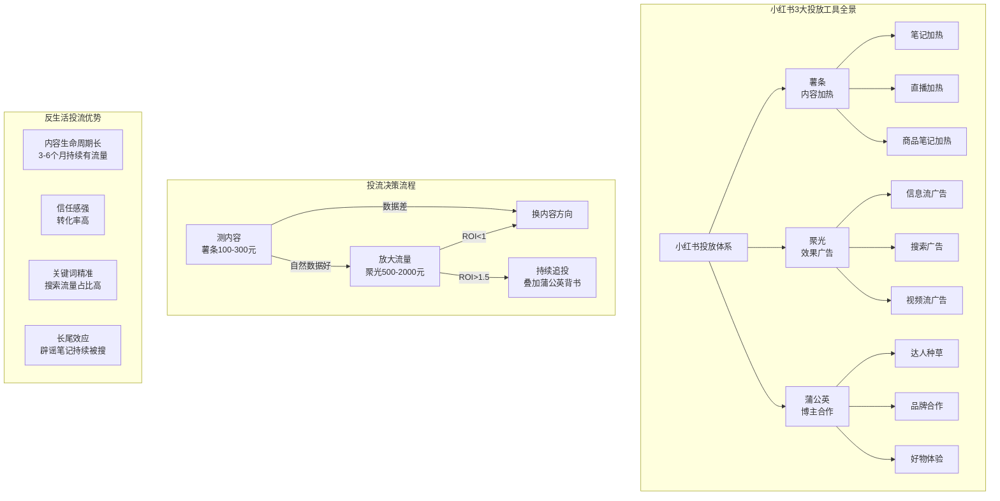
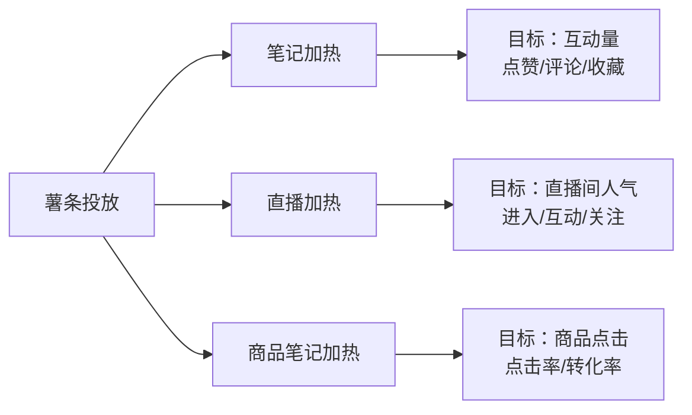
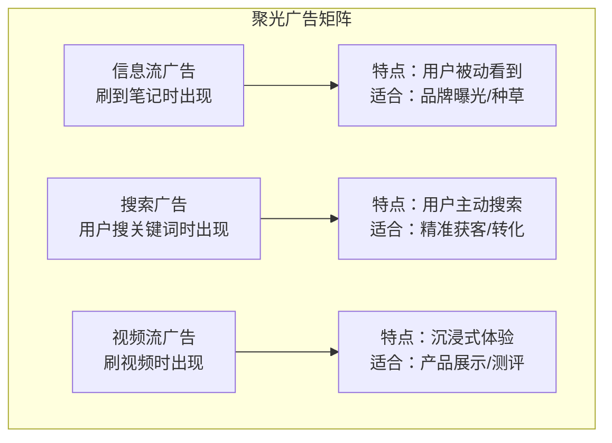
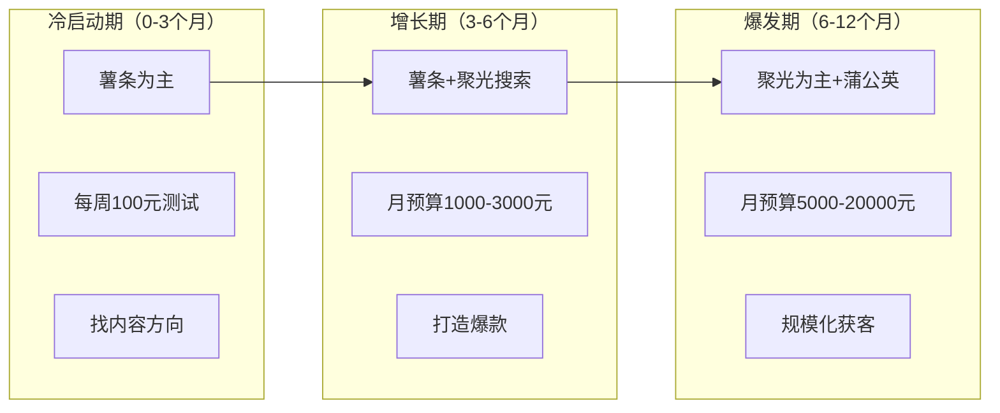

# 📕 Day12: 小红书投放与投流

> **核心：用最少的钱，买到最精准的流量。小红书的3大投放工具（薯条/聚光/蒲公英）各有用途，投对了是印钞机，投错了是碎钞机。**
> 来源：小红书官方营销白皮书 + 聚光平台官方文档 + 行业投放操盘手实战经验

---

## 一、一句话总结

**小红书投放体系 = 薯条（测内容）→ 聚光（投效果）→ 蒲公英（做背书），三步递进，从内容验证到精准获客到品牌建设，每一步都有明确的ROI红线，超出就停。**

核心逻辑是：**不要为了流量而投流，要为了转化而投流。** 反生活账号的投放思路更特殊——因为辟谣/科普内容的信任感和长尾效应都很强，投流的ROI天然比娱乐类账号高2-3倍。

---

## 二、核心框架



---

## 三、薯条（内容加热）—— 最基础的投流工具

### 3.1 薯条是什么？

薯条是小​​红书的**内容加热工具**，相当于付费给小红书，把你的笔记推给更多人看。最基础的投放工具，也是新手必须掌握的第一个工具。

| 项目 | 说明 |
|:----:|------|
| **门槛** | 粉丝≥500即可开通 |
| **费用** | 100元起投，最高不限 |
| **作用** | 给笔记加热、测试内容质量 |
| **适合** | 内容验证期、冷启动期 |
| **不适合** | 品牌建设、精准获客 |

### 3.2 薯条的3种投放模式



#### 模式1：笔记加热

| 项目 | 说明 |
|:----:|------|
| **目标** | 提高笔记的赞藏评，助推自然流量 |
| **计费** | CPM（千次曝光计费），约6-15元/千次 |
| **最低投放** | 100元 |
| **时长** | 24小时/48小时 |
| **适合场景** | 冷启动笔记、内容测试、助推爆款 |

#### 模式2：直播加热

| 项目 | 说明 |
|:----:|------|
| **目标** | 直播间进入人数 |
| **计费** | CP**C**（按点击计费），约0.3-0.8元/次 |
| **最低投放** | 100元 |
| **时长** | 直播期间实时消耗 |
| **适合场景** | 直播冷启动、活动促销 |

#### 模式3：商品笔记加热

| 项目 | 说明 |
|:----:|------|
| **目标** | 商品卡片点击 |
| **计费** | CPC（按点击计费），约0.5-1.5元/次 |
| **最低投放** | 100元 |
| **时长** | 24小时 |
| **适合场景** | 带货笔记、测评笔记 |

### 3.3 薯条投放的「黄金法则」

```markdown
## 黄金法则1：只投「自然数据已经好」的笔记

❌ 笔记发了3小时只有50个阅读 → 投薯条（浪费钱）
❌ 笔记数据很一般但你觉得内容好 → 投薯条（小红书不认可）
✅ 笔记自然跑到了5000+阅读，数据还在涨 → 投薯条再助推一把

判定标准：
- 自然曝光24小时内达到2000+ → 值得投
- 自然互动率（赞藏评/阅读）≥5% → 值得投
- 自然点击率（封面→笔记）≥8% → 值得投

## 黄金法则2：小预算多次投，不要一次大额投

❌ 一次投500元（不知道效果好不好）
✅ 先投100元看数据 → 效果好再追加200元 → 再好追加500元

每次投放后记录数据：
- 曝光量、点击率、互动率
- 粉丝增长数
- 私信/评论中的转化意向
- 下一次什么时候投、投多少

## 黄金法则3：周日到周四投，周五周六别投

周日-周四：用户搜索习惯强，内容消费深度高 → 好转化
周五-周六：用户娱乐心态强，内容消费浅 → 高曝光低转化

最佳投放时段：
- 晚上8-10点（用户活跃高峰）
- 下午12-2点（午休时段）
- 早上7-9点（通勤时段）
```

### 3.4 薯条投放预算参考（反生活版）

| 阶段 | 每天预算 | 投放策略 | 预期效果 |
|:----:|:--------:|----------|:--------:|
| **测试期** | 50-100元/天 | 每篇新笔记投100元测数据 | 找到内容方向 |
| **增长期** | 100-300元/天 | 选定3-5篇好笔记持续追投 | 打造爆款 |
| **带货期** | 200-500元/天 | 商品笔记投流为主 | 提升GMV |
| **爆发期** | 500-1000元/天 | 多篇同时投+直播投流 | 月入破万 |

---

## 四、聚光（效果广告）—— 进阶投流工具

### 4.1 聚光是什么？

聚光是小红书**官方效果广告平台**，对标抖音的巨量引擎、腾讯的广点通。相比薯条，聚光更**精准、可控、数据更细**，但也有门槛。

| 项目 | 说明 |
|:----:|------|
| **门槛** | 需要企业号（营业执照认证） |
| **费用** | 最低500元开户，按效果计费 |
| **优势** | 精准定向、数据闭环、搜索+信息流双入口 |
| **适合** | 有明确变现路径的账号 |
| **不适合** | 还在测试内容的阶段 |

### 4.2 聚光的3种广告形式



#### 信息流广告

- **展现位置**：用户刷笔记时随机插入，标注「赞助」或「广告」
- **计费方式**：CPM（千次曝光）或 CPC（按点击）
- **推荐预算**：500-2000元/条素材测试
- **反生活适合**：推爆款笔记，扩大影响力
- **核心指标**：点击率 ≥ 3% 算及格

#### 搜索广告 ✅（反生活最该投的）

- **展现位置**：用户搜索关键词后，排在自然结果前面的广告位
- **计费方式**：CPC（按点击），约0.5-3元/次
- **推荐预算**：根据关键词热度，200-500元/天起
- **反生活适合**：**最核心的投放方式**——辟谣类内容搜索量天然大
- **核心指标**：转化率 ≥ 2% 算及格

#### 视频流广告

- **展现位置**：视频笔记流中插入
- **计费方式**：CPM 或 OCPM（优化千次曝光）
- **推荐预算**：1000元起
- **反生活适合**：视频科普内容的加速器
- **核心指标**：完播率 ≥ 30% 算及格

### 4.3 聚光投放的5步流程

```markdown
## 第1步：开户
- 准备营业执照 + 法人身份证
- 在小红书聚光平台（https://ad.xiaohongshu.com）注册
- 最低充值500元
- 约1-3个工作日审核通过

## 第2步：搭建投放计划
- 投放目标：选择「笔记互动」或「转化量」
- 预算设置：日预算/总预算
- 投放时间：开始日期+结束日期
- 定向设置：性别/年龄/地域/兴趣标签

## 第3步：创建广告组
- 选择要投放的笔记（必须是已发布的优质笔记）
- 设置出价方式：CPC（手动出价）或 OCPM（自动优化）
- 设置创意：标题、封面图、描述文字
- 反生活重点：标题要包含辟谣关键词

## 第4步：设置定向
基础定向：性别不限、年龄25-45岁、一二线城市
兴趣定向：
  ├── 生活方式类（必选）
  ├── 健康/养生类（必选）
  ├── 知识/科普类（必选）
  ├── 家居/装修类（可选——检测类内容相关）
  └── 母婴/亲子类（可选——育儿类辟谣相关）

## 第5步：上线+优化
- 前3天观察数据，不要动设置
- 第4天看点击率：< 2% 换封面/标题；> 3% 维持
- 第7天看转化率：< 1% 换笔记素材；> 2% 加预算
- 第14天整体复盘：ROI是否达到预期
```

### 4.4 反生活搜索关键词库（聚光投放核心）

反生活账号最大的投流优势是：**辟谣类内容的搜索流量占比极高**。用户会主动搜「XX是不是真的」「XX有没有毒」「XX是智商税吗」等词，这类搜索流量的转化率远高于娱乐内容。

| 关键词类型 | 示例 | 搜索量 | 竞争度 | 建议出价 |
|:----------:|------|:------:|:------:|:--------:|
| **核心词** | 辟谣、生活谣言、智商税 | 高 | 低 | 1-2元/次 |
| **场景词** | 甲醛检测、水质测试、除螨 | 中高 | 中 | 1.5-3元/次 |
| **产品词** | 甲醛检测仪、除螨仪推荐 | 中 | 高 | 2-4元/次 |
| **痛点词** | 掉发原因、失眠怎么办 | 高 | 中 | 1-2元/次 |
| **疑问词** | XX能吃吗、XX有效吗、XX是真的吗 | 极高 | 低 | 0.5-1.5元/次 |

**反生活搜索关键词策略**：

```markdown
## 反生活专属关键词矩阵

一级词（必投，搜索量高、竞争低）：
- 「辟谣」「生活谣言」「智商税」「避坑」「避雷」
- 出价建议：0.5-1.5元/次

二级词（精准转化，搜索量中、竞争中）：
- 「甲醛检测」「除螨推荐」「水质检测」「食品添加剂」
- 「家电测评」「健康科普」「生活技巧」「省钱攻略」
- 出价建议：1-2元/次

三级词（长尾词，搜索量低但竞争极低、转化极高）：
- 「XX（具体产品）是不是智商税」
- 「XX（具体现象）背后的科学原理」
- 「XX（具体说法）是真是假」
- 出价建议：0.3-0.8元/次

长尾词策略：不投大词，投细分长尾词
✅ 投「甲醛检测仪哪个品牌好」（精准，竞争低）
❌ 投「检测仪」（泛词，竞争高，转化差）
```

### 4.5 聚光投放的ROI计算

```markdown
## ROI计算公式

ROI = 广告带来的收入 ÷ 广告花费

## 反生活投流的ROI参考

假设：投「甲醛检测仪」搜索广告，CPC = 1.5元/次

100元预算 → 获得约66次点击
点击→商品页率 60% → 40次商品页浏览
商品页→下单转化率 8% → 约3单
客单价89元 → 收入267元
ROI = 267 ÷ 100 = 2.67 ✅

## 投流ROI判断标准

| ROI | 判断 | 行动 |
|:---:|:----:|:----:|
| > 3 | 非常优秀 | 立刻加预算，追加2-3倍 |
| 1.5 - 3 | 良好盈利 | 稳定维持，优化素材 |
| 1 - 1.5 | 微赚或持平 | 优化内容/关键词/出价 |
| < 1 | 亏钱中 | 暂停，换素材或换关键词 |

## 反生活的天然投流优势

1. 辟谣类内容信任感强 → 转化率比娱乐类高2-3倍
2. 搜索流量占比高 → 用户有明确需求才搜 → 转化意愿强
3. 内容生命周期长 → 一篇辟谣笔记3-6个月后还有搜索流量
4. 竞争对手少 → 辟谣赛道投流竞争远低于美妆/穿搭/美食
```

---

## 五、蒲公英（博主合作）—— 通过达人投放

### 5.1 蒲公英是什么？

蒲公英是小红书**官方博主合作平台**，品牌方可以通过平台找博主合作发布种草笔记。对标抖音的星图。

| 项目 | 说明 |
|:----:|------|
| **门槛** | 需要品牌（企业号/店铺均可） |
| **费用** | 根据博主粉丝量，300-50000元/篇不等 |
| **作用** | 借达人的影响力做品牌背书 |
| **适合** | 有产品/品牌后做放大 |
| **不适合** | 冷启动期、预算低于3000元/月 |

### 5.2 蒲公英的3种合作模式

| 模式 | 说明 | 费用 | 适合场景 |
|:----:|:----:|:----:|:--------:|
| **免费置换** | 以产品置换内容 | 0元 | 初期没预算时 |
| **付费合作** | 给达人固定费用 | 500-5000元/篇 | 中期品牌建设 |
| **效果合作** | 按转化效果付费 | 按CPS结算 | 有成熟转化链路 |

### 5.3 反生活蒲公英投放策略

```markdown
## 反生活适合找的达人类型

优先级从高到低：

1️⃣ 生活科普博主（5万以下粉丝）
   - 粉丝量小但精准
   - 内容风格接近反生活
   - 费用：500-2000元/篇
   - 适合：联合辟谣+带货

2️⃣ 家居博主（10万以下粉丝）
   - 粉丝有意装修/买家电
   - 适合推检测工具类产品
   - 费用：1000-3000元/篇
   - 适合：甲醛检测仪、除螨仪

3️⃣ 母婴博主（10万以下粉丝）
   - 粉丝对安全/健康极其敏感
   - 适合推科普课程、检测工具
   - 费用：1500-4000元/篇
   - 适合：育儿类辟谣内容+产品

4️⃣ 健康类博主（10万以下粉丝）
   - 粉丝关注养生/健康
   - 适合推科普内容
   - 费用：1000-3000元/篇
   - 适合：食品添加剂辟谣、健康产品

## 蒲公英投放避坑指南

❌ 不要只看粉丝量——要看互动率
✅ 互动率（赞藏评/粉丝数）> 3% 才值得合作

❌ 不要只看单篇数据——要看账号历史内容一致性
✅ 该博主近30天内容跟你要推的方向一致才靠谱

❌ 不要签独家——可以同时跟5-10个博主合作
✅ 分散投放才能测试哪个类型转化最好

❌ 不要一篇定胜负——跟同一个博主合作3篇以上
✅ 同一博主要求内容角度不同，测试不同卖点
```

---

## 六、三大投放工具对比与选择

### 6.1 速查表

| 对比项 | 🥔 薯条 | 🎯 聚光 | 🌼 蒲公英 |
|:------:|:--------:|:--------:|:---------:|
| **门槛** | 500粉丝 | 企业号 | 品牌号 |
| **最低预算** | 100元/次 | 500元起 | 0元（置换） |
| **目标** | 内容测试 | 精准获客 | 品牌背书 |
| **精准度** | 低（按兴趣） | 高（关键词+人群） | 中（达人粉丝） |
| **数据** | 基础 | 丰富 | 依赖达人配合 |
| **适合阶段** | 冷启动→增长 | 增长→爆发 | 爆发→成熟 |
| **反生活优先** | ⭐ 当前必学 | ⭐⭐ 中期重点 | ⭐ 后期考虑 |

### 6.2 反生活各阶段投放组合



---

## 七、反生活账号投放实战方案

### 7.1 冷启动期投放策略（当前阶段）

```
总预算：500元/月（测试为主）

周投放计划：
├── 周一：发1篇辟谣笔记 → 自然跑数据
├── 周二：数据好的话投100元薯条
├── 周三：发1篇商品笔记 → 自然跑数据
├── 周四：数据好的话投100元薯条
├── 周五：复盘本周数据
├── 周末：停止投放（周末转化低）

月投入：400元薯条 + 100元聚光测试搜索广告
月目标：找到3-5个转化率高的关键词和素材方向

数据记录表：
| 日期 | 笔记 | 投放 | 花费 | 曝光 | 点击 | 互动 | 转化 | 备注 |
|:----:|:----:|:----:|:----:|:----:|:----:|:----:|:----:|:----:|
| 5/1 | 甲醛辟谣 | 薯条 | 100 | 8000 | 480 | 120 | 8单 | 转化不错 |
| 5/3 | 除螨测试 | 无 | 0 | 2000 | 160 | 40 | 2单 | 自然流量 |
```

### 7.2 增长期投放策略（第3-6个月）

```
总预算：3000元/月

投放分配：
├── 薯条：500元（用于测试新内容方向）
├── 聚光搜索广告：2000元（核心投入）
│   ├── 核心辟谣词：800元
│   ├── 检测类词：700元
│   └── 长尾问题词：500元
└── 蒲公英：500元（首次尝试找小博主合作）

月目标：月GMV破5000元，投流ROI ≥ 2.0

关键动作：
1. 固定每周一/三/五发带货笔记
2. 每周二/四发纯内容笔记（不投流）
3. 所有商品笔记统一投聚光搜索广告
4. 月底分析：哪个关键词的ROI最高 → 下月加预算
```

### 7.3 爆发期投放策略（第6-12个月）

```
总预算：10000-20000元/月

投放分配：
├── 聚光搜索广告：8000-15000元（主力）
├── 聚光信息流广告：2000-3000元（扩大曝光）
└── 蒲公英博主合作：2000-5000元（品牌背书）

月目标：月GMV破3-5万，投流ROI ≥ 2.5

关键动作：
1. 建立自己的投流素材库（50+套封面/标题）
2. A/B测试持续优化素材
3. 每周3场直播+直播投流
4. 跟5-10个小博主建立长期合作关系
```

---

## 八、投流的10个常见坑

### ❌ 坑1：新手直接上聚光

**问题**：连薯条都没投明白，就直接上聚光
**解决**：先用薯条投50-100条笔记，弄清楚什么内容能跑起来，再上聚光

### ❌ 坑2：同时投多个广告组

**问题**：刚开始就设5个广告组，数据混乱
**解决**：每次只测1个变量（封面/标题/人群/关键词）

### ❌ 坑3：只投爆款不投转化

**问题**：笔记互动很高，但没人买东西
**解决**：认清楚目标——薯条投互动，聚光投转化，不要混用

### ❌ 坑4：不设日预算上限

**问题**：日预算设了1000元，半天就烧完了
**解决**：每天设固定预算，烧完自动停

### ❌ 坑5：投了不看数据

**问题**：钱花出去了，不记录、不分析
**解决**：建立数据记录表，每次投放必记5个核心指标

### ❌ 坑6：一上来就投大词

**问题**：投「辟谣」这种大词，竞争高、转化差
**解决**：从长尾词开始投，跑通后再放大词

### ❌ 坑7：只投一篇笔记

**问题**：把所有预算押在一篇笔记上
**解决**：每篇笔记投100元测试，数据好的再追投

### ❌ 坑8：忽视内容质量

**问题**：以为投了钱，垃圾内容也能爆
**解决**：**投流是放大器，不是过滤器**——内容不好，投越多亏越多

### ❌ 坑9：不看店铺评分

**问题**：投了流量进来，店铺评分低导致跳失
**解决**：投流前先确保店铺评分 ≥ 4.8

### ❌ 坑10：不做归因分析

**问题**：不知道哪条渠道带来的转化
**解决**：用小红书后台的转化归因工具，不投流控制的就不是真渠道

---

## 九、反生活投流最全数据看板

| 指标 | 冷启动及格线 | 增长期及格线 | 爆发期及格线 |
|:----:|:-----------:|:-----------:|:-----------:|
| **薯条点击率** | ≥ 5% | ≥ 8% | ≥ 10% |
| **薯条互动率** | ≥ 8% | ≥ 12% | ≥ 15% |
| **聚光点击率** | ≥ 2% | ≥ 3% | ≥ 5% |
| **聚光转化率** | ≥ 1% | ≥ 2% | ≥ 3% |
| **搜索广告转化率** | ≥ 2% | ≥ 4% | ≥ 6% |
| **CPC（单次点击成本）** | ≤ 2元 | ≤ 1.5元 | ≤ 1元 |
| **ROI** | ≥ 1.2 | ≥ 1.5 | ≥ 2.5 |
| **单粉成本** | ≤ 5元 | ≤ 3元 | ≤ 1.5元 |

---

## 十、变现路径：投流带来的收入级差

| 阶段 | 月投放预算 | 月收入预估 | ROI | 核心策略 |
|:----:|:----------:|:----------:|:---:|:--------:|
| **测试期** | 500元 | 500-1500元 | 1-3 | 薯条测内容方向 |
| **入局期** | 2000元 | 3000-6000元 | 1.5-3 | 聚光搜索+薯条 |
| **稳定期** | 5000元 | 10000-20000元 | 2-4 | 搜索+信息流组合 |
| **爆发期** | 10000元 | 25000-50000元 | 2.5-5 | 全渠道+蒲公英 |

**反生活特殊说明**：因为辟谣内容的信任溢价，实际转化率比行业平均高50-100%，所以ROI乐观系数可以乘以1.5。

---

## 十一、行动清单（今天就能做的3件事）

```markdown
□ 1. 开通薯条权限 + 准备100元测试资金
   操作路径：
   1) 打开小红书APP → 我 → 创作中心 → 薯条
   2) 确认粉丝≥500（如不够先发5-10篇内容涨粉）
   3) 准备100元充入薯条账户
   4) 选一篇自然数据最好的笔记 → 投100元薯条
   5) 记录投放数据：曝光、点击、互动、关注、转化

   预计耗时：15分钟
   反生活小贴士：先投一条近7天内数据最好的辟谣笔记

□ 2. 建立「反生活投流关键词库」
   列出至少20个跟反生活相关的高价值搜索词
   示例格式：
   ├── 核心词：辟谣、生活谣言、智商税
   ├── 场景词：甲醛检测、除螨、水质检测、食品添加剂
   ├── 痛点词：掉发原因、失眠怎么办、皮肤过敏
   └── 疑问词：XX是真的吗、XX能吃吗、XX有效吗
   
   分类：高搜索低竞争 → 优先投；高搜索高竞争 → 测试投
   预计耗时：20分钟
   后续可做：用这些词写笔记标题，自然获取搜索流量

□ 3. 制作「投流数据记录模板」
   用飞书/Notion/Excel做一个投流数据表
   必记字段：
   ├── 日期
   ├── 笔记标题
   ├── 投放类型（薯条/聚光）
   ├── 投放金额
   ├── 曝光量
   ├── 点击量 / 点击率
   ├── 互动量 / 互动率
   ├── 转化量 / 转化率
   ├── 收入
   └── ROI
   
   每投一次必须记录，月底汇总分析
   预计耗时：10分钟
   提示：不用记在脑子里，记在表里才是真有效
```

---

> **关联笔记**：[小红书电商闭环](Day11-小红书电商闭环.md) · [小红书变现全攻略](Day1-小红书变现全攻略.md) · [爆款小红书学习笔记](爆款小红书-学习笔记.md) · [账号定位与赛道分析](../01-运营体系/账号定位与赛道分析.md)
>
> **适用于「反生活」**：✅ 辟谣/科普赛道的搜索流量占比高、竞争低、信任溢价大，投流ROI天然高于泛娱乐赛道。不要跟风投大词，从长尾词切入，先跑通ROI再放大。

> **核心金句**：**投流不是花钱，是买流量。买了流量不能变现，就是烧钱。反生活的信任优势决定了——你花1块钱买来的流量，至少值别人花2块钱买来的。**
