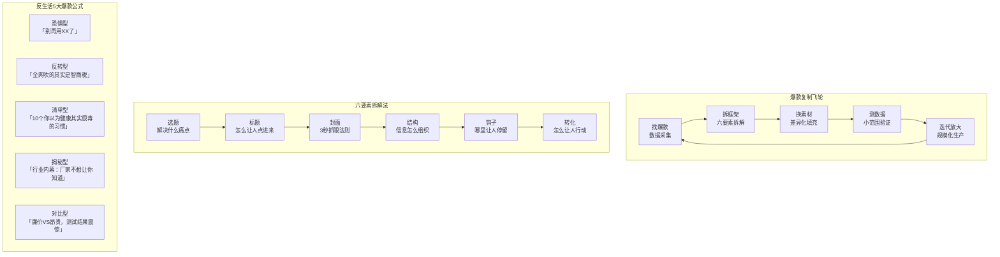
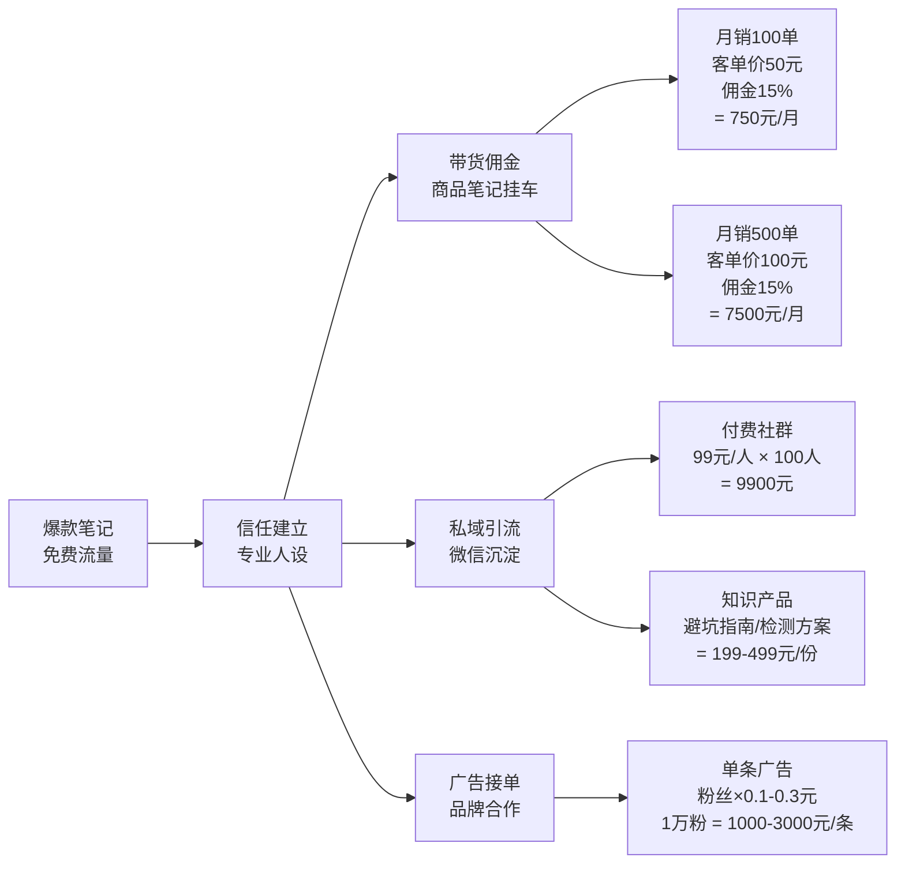

# 📕 Day13: 小红书爆款复制方法论

> **核心：爆款不是撞大运，而是可拆解、可复制、可批量生产的系统工程。找到已经验证的爆款公式，替换素材和角度，就能持续产出高流量内容。**
> 来源：小红书头部MCN内部方法论 + 《爆款小红书》二次提炼 + 100+爆款笔记拆解实战

---

## 一、一句话总结

**小红书爆款复制方法论 = 找爆款（数据采集）→ 拆框架（六要素拆解）→ 换素材（差异化填充）→ 测数据（小范围验证）→ 迭代放大（规模化生产）。**

核心逻辑是：**太阳底下无新事，爆款都是旧元素的新组合。** 反生活账号的爆款更是如此——生活谣言、智商税、健康误区这些选题永远不会枯竭，关键是用已经被验证过的「内容容器」去装载新的「素材弹药」。

> 💡 **关键认知**：复制爆款不是抄袭，而是学习「已经被算法和用户双重验证过的内容结构」。就像学书法要临帖、学做菜要跟师傅——先模仿，再超越。

---

## 二、核心框架



---

## 三、可落地方法

### 3.1 找爆款：建立你的爆款素材库（免费版）

不需要付费工具，用小红书的搜索功能就能找到80%的爆款。

#### 方法1：关键词搜索法

```markdown
## 步骤

1. 在小红书搜索框输入你的核心关键词
   - 反生活核心词：辟谣、智商税、生活误区、健康谣言
   - 细分词：甲醛、除螨、食品添加剂、睡眠、掉发

2. 点击「最热」排序（不是「最新」）

3. 筛选条件：
   - 点赞 ≥ 1000（小爆款）
   - 点赞 ≥ 5000（大爆款）
   - 发布时间 ≤ 90天（保证算法时效性）

4. 收集前20篇笔记的：
   - 标题（原样复制）
   - 封面特点（截图保存）
   - 点赞/收藏/评论数
   - 发布时间
   - 账号粉丝量（低粉爆款更有参考价值）
```

#### 方法2：低粉爆款法（重点！）

**低粉爆款 = 内容本身好，不是账号粉丝多带来的流量。** 这种最值得复制。

```markdown
## 判断标准

✅ 粉丝 < 5000，但单篇点赞 > 1000
✅ 粉丝 < 1万，但单篇点赞 > 5000
✅ 评论数 > 点赞数的10%（高互动 = 高转化潜力）
✅ 收藏数 > 点赞数的50%（干货价值高）

❌ 粉丝 10万+，点赞 2000（这只是正常数据，不算爆款）
❌ 明星/大V的笔记（粉丝基数大，参考意义小）
```

#### 方法3：对标账号追踪法

```markdown
## 找对标账号的3个维度

1. 同赛道头部（学习的上限）
   - 搜索「辟谣」「智商税」，看粉丝Top10的账号
   - 记录他们的爆款选题和更新频率

2. 同赛道腰部（学习的重点）
   - 粉丝1-5万，近期有明显涨粉的账号
   - 这种账号的打法你更有可能复制

3. 跨赛道类比（差异化灵感）
   - 美妆赛道的「成分党」科普形式 → 反生活可用
   - 美食赛道的「测评对比」形式 → 反生活可用
   - 家居赛道的「避坑指南」形式 → 反生活可用
```

### 3.2 拆框架：六要素拆解模板

找到爆款后，不要光看热闹，要逐字逐句拆解。下面给出反生活专属拆解模板：

```markdown
## 爆款拆解表（每篇爆款填一张）

| 要素 | 拆解内容 | 反生活适配 |
|:----:|----------|:----------:|
| **选题** | 这篇解决了什么痛点？ | 是健康焦虑？省钱需求？还是安全恐惧？ |
| **标题** | 用了什么关键词？数字？情绪词？ | 哪些词可以替换到反生活场景？ |
| **封面** | 几张图？什么配色？文字排版？ | 反生活用「对比图」「检测报告」「震惊表情」 |
| **结构** | 开头怎么抓人？中间怎么展开？结尾怎么收？ | 科普类用「痛点→揭秘→方案→号召」 |
| **钩子** | 哪个地方让你想继续看？ | 数据冲击？反常识？个人故事？ |
| **转化** | 怎么引导点赞/收藏/评论/关注？ | 反生活用「转发给家人」「收藏避坑」 |

## 实战案例拆解

**原文爆款**：「别再买这种鸡蛋了！超市员工从来不买，很多人还天天吃」
- 点赞 8.2万 | 收藏 3.1万 | 评论 2100

| 要素 | 拆解 |
|:----:|------|
| 选题 | 食品安全焦虑（鸡蛋 = 天天吃 = 人人相关） |
| 标题 | 「别再买」= 恐惧唤醒 + 「超市员工从来不买」= 权威背书 + 「很多人还天天吃」= 反常识 |
| 封面 | 左图：普通鸡蛋特写（带问题标识） 右图：超市员工背影（神秘感） |
| 结构 | ① 抛问题（你买的是这种鸡蛋吗？）→ ② 揭秘（为什么不好）→ ③ 解决方案（怎么挑）→ ④ 互动（你家里买过吗？） |
| 钩子 | 第3秒：「超市员工从来不买」→ 用户想知道为什么 |
| 转化 | 结尾：「赶紧转发给家里人」「收藏起来下次去超市对着买」 |

**反生活改编版**：
「别再买这种甲醛检测仪了！检测机构从来不用，很多人还天天测」
- 结构完全复制，素材替换为反生活领域
```

### 3.3 换素材：反生活5大爆款公式

这是今天最核心的产出——**可以直接套用的内容模板**。

#### 公式1：恐惧型爆款

```markdown
## 模板
「别再用/买/吃XX了！[权威身份]从来不[用/买/吃]，很多人还天天[用/买/吃]」

## 原理
- 恐惧唤醒（别再用）→ 注意力
- 权威背书（[权威身份]）→ 信任感
- 反常识（很多人还天天）→ 好奇心

## 反生活适配案例
- 「别再买这种除螨仪了！实验室检测过，根本杀不死螨虫」
- 「别再喝这种瓶装水了！水质检测员从来不买，很多人还天天喝」
- 「别再用这种保鲜膜了！食品工程师家里从来不用」

## 关键替换词库
- 权威身份：实验室/检测员/工程师/医生/营养师/内部员工
- 动作：用/买/吃/喝/放/贴/喷
- 产品：除螨仪/甲醛仪/保鲜膜/洗洁精/牙膏/洗发水
```

#### 公式2：反转型爆款

```markdown
## 模板
「全网都在吹的XX，我劝你别买！测完才发现是智商税」

## 原理
- 从众压力（全网都在吹）→ 制造对立感
- 反转预期（我劝你别买）→ 违背直觉
- 实证支撑（测完才发现）→ 可信度

## 反生活适配案例
- 「全网都在吹的XX甲醛检测仪，我劝你别买！拆机后发现是玩具」
- 「博主都在推荐的XX除螨喷雾，测完才发现是智商税」
- 「销量10万+的XX净水壶，拆开滤芯我沉默了」

## 关键替换词库
- 热度描述：全网都在吹/销量10万+/博主都在推荐/网红爆款
- 反转动作：我劝你别买/千万别碰/拆完我沉默了/测完我后悔了
- 证据类型：拆机/实测/送检/对比/暗访
```

#### 公式3：清单型爆款

```markdown
## 模板
「[数字]个你以为[正面]其实很[负面]的[场景]，第[数字]个很多人中招」

## 原理
- 数字锚定（[数字]个）→ 明确预期
- 反常识（以为好其实很坏）→ 好奇心
- 悬念（第X个很多人中招）→ 看完动力

## 反生活适配案例
- 「10个你以为健康其实很毒的生活习惯，第7个90%的人每天都在做」
- 「8种你以为干净其实很脏的厨房用品，第3个我家里就有」
- 「12个超市购物陷阱，导购永远不会告诉你，第5个最常中招」

## 关键替换词库
- 场景：生活习惯/厨房用品/超市购物/家居清洁/育儿方式
- 正面词：健康/干净/安全/营养/天然/有机
- 负面词：毒/脏/有害/致癌/智商税/陷阱
```

#### 公式4：揭秘型爆款

```markdown
## 模板
「[行业]内幕：[群体]不想让你知道的[数字]个真相，看完能省[数字]钱」

## 原理
- 内幕感（内幕/真相）→ 信息差诱惑
- 利益承诺（能省钱）→ 实用价值
- 群体对立（商家/厂家不想让你知道）→ 阵营感

## 反生活适配案例
- 「甲醛治理行业内幕：商家不想让你知道的5个真相，看完能省3000」
- 「净水器销售套路：导购永远不会告诉你的3个秘密」
- 「食品添加剂真相：厂家不想让你知道的10个事实」

## 关键替换词库
- 行业：甲醛治理/净水器/食品添加剂/护肤品/保健品
- 群体：商家/厂家/导购/销售/网红/博主
- 利益：省钱/避坑/保命/少交智商税
```

#### 公式5：对比型爆款

```markdown
## 模板
「[价格A]的XX VS [价格B]的XX，[测试方法]后我震惊了，结果居然是...」

## 原理
- 价格锚定（便宜VS贵）→ 认知冲突
- 测试过程（实测/送检）→ 可信度
- 悬念结尾（结果居然是）→ 完播率

## 反生活适配案例
- 「50元的甲醛仪 VS 500元的甲醛仪，同时测同一个房间，结果我震惊了」
- 「9.9元的洗洁精 VS 99元的洗洁精，成分对比后发现智商税」
- 「网红除螨仪 VS 医院除螨方案，实测后我沉默了」

## 关键替换词库
- 价格对比：9.9 VS 99 / 50 VS 500 / 平价 VS 大牌
- 测试方法：实测/送检/拆机/成分对比/盲测
- 情绪词：震惊了/沉默了/后悔了/没想到/颠覆认知
```

### 3.4 测数据：小步快跑验证法

复制不是一次就能成功的，需要测试迭代。

```markdown
## 测试流程

第1轮：同一公式，换3个不同选题
- 例：恐惧型公式 → 分别做「鸡蛋」「洗洁精」「保鲜膜」3篇
- 每篇间隔2天发布
- 看哪篇数据最好 → 说明这个选题方向用户更关心

第2轮：同一选题，换2个不同封面
- 例：「鸡蛋」选题 → A封面用超市实拍，B封面用检测报告截图
- 同时段发布（控制变量）
- 看哪个封面点击率更高

第3轮：最优组合，小预算投流验证
- 用薯条投100元测试
- 点击率 ≥ 8% → 加大投入
- 点击率 < 5% → 换标题或封面再测

## 数据判断标准

| 指标 | 及格线 | 优秀线 | 行动 |
|:----:|:------:|:------:|:----:|
| 点击率 | 5% | 10%+ | < 5% 换封面/标题 |
| 互动率 | 3% | 8%+ | < 3% 换选题/钩子 |
| 收藏率 | 10% | 25%+ | < 10% 加强干货密度 |
| 评论率 | 1% | 3%+ | < 1% 增加互动引导 |
```

### 3.5 迭代放大：从1篇到100篇的系统

```markdown
## 爆款内容生产线

1. 建立「爆款选题池」（每周更新）
   - 收集30个已验证的爆款标题
   - 分类：恐惧型10个 / 反转型10个 / 清单型10个

2. 建立「素材弹药库」（持续积累）
   - 检测报告截图
   - 产品对比实拍图
   - 权威数据/论文/新闻
   - 用户真实反馈/评论截图

3. 建立「封面模板库」（3-5套固定模板）
   - 模板A：左右对比图（廉价VS昂贵）
   - 模板B：检测报告+红圈标注
   - 模板C：人物表情+大字标题
   - 模板D：清单数字+物品平铺

4. 固定产出节奏
   - 每周一：收集上周新爆款，更新选题池
   - 每周二/四：发布「恐惧型/反转型」内容
   - 每周三/五：发布「清单型/揭秘型」内容
   - 每周六：数据复盘，确定下周重点方向
   - 每周日：批量拍摄/制作下周内容

5. 爆款复用策略
   - 一篇点赞过万的笔记，用同样结构做3个变体
   - 例：「10个健康误区」爆了 → 继续出「10个厨房误区」「10个育儿误区」「10个睡眠误区」
   - 同一选题换形式：图文爆了 → 做成视频版；视频爆了 → 做成图文合集
```

---

## 四、变现路径

爆款复制的最终目的不是流量，是赚钱。以下是反生活账号的变现地图：



### 4.1 单篇爆款的流量价值计算

```markdown
## 以一篇点赞1万的反生活笔记为例

流量分层：
- 点赞1万 ≈ 阅读10-15万（互动率约8-10%）
- 收藏3000 ≈ 精准用户（有长期价值）
- 评论500 ≈ 高意向用户（可能转化）

变现转化（保守估算）：
- 商品笔记挂车：点击率3% → 4500人进店 → 转化率2% → 90单 → 客单价80元 → 佣金12% → 收入 864元
- 私域引流：评论500中10%加微信 → 50人 → 20%购买知识产品 → 10人 × 199元 = 1990元
- 广告价值：1万赞笔记 ≈ 账号价值提升，后续广告报价+500元/条

单篇爆款总价值：864 + 1990 + 长期品牌增值 ≈ 3000-5000元
```

### 4.2 从偶发爆款到稳定变现

```markdown
## 阶段1：测试期（1-3个月）
- 目标：找到3-5个可复制爆款公式
- 产出：每周3-4篇，不求每篇爆，只求验证结构
- 收入：0-1000元/月（主要靠带货佣金）

## 阶段2：增长期（3-6个月）
- 目标：爆款率稳定在20%（每5篇爆1篇）
- 产出：每周5-7篇，有固定的内容生产线
- 收入：3000-8000元/月（带货+私域+少量广告）

## 阶段3：爆发期（6-12个月）
- 目标：矩阵化生产，多账号/多平台分发
- 产出：每周10+篇，有助理/兼职帮忙
- 收入：1-3万/月（全渠道变现）
```

### 4.3 反生活爆款的独特变现优势

```markdown
1. 高信任度 = 高转化率
   - 辟谣/科普内容天然建立专业人设
   - 用户信任你的推荐 → 带货转化率是美妆类的2-3倍

2. 长尾流量 = 持续收益
   - 一篇「甲醛辟谣」笔记，3个月后还有人搜索
   - 对比：娱乐类笔记3天后就没人看了
   - 结果：同样投入，反生活内容变现周期更长

3. 搜索流量 = 精准获客
   - 用户主动搜「甲醛仪是不是智商税」→ 看到你的笔记 → 直接下单
   - 搜索流量的转化率是推荐流量的3-5倍

4. 低竞争度 = 低成本获客
   - 辟谣赛道博主数量远少于美妆/穿搭
   - 同样投100元薯条，反生活能买到的流量是美妆的2倍
```

---

## 五、行动清单（今天就能做的3件事）

### ✅ 第一件事：建立你的「爆款素材库」（30分钟）

```markdown
1. 打开小红书，搜索「辟谣」「智商税」「生活误区」
2. 选择「最热」排序，筛选「近半年」
3. 找到10篇「低粉爆款」（粉丝<1万，点赞>5000）
4. 用下面模板记录：

| 序号 | 标题 | 点赞 | 收藏 | 评论 | 账号粉丝 | 公式类型 |
|:----:|------|:----:|:----:|:----:|:--------:|:--------:|
| 1 | | | | | | |
| 2 | | | | | | |
| ... | | | | | | |

5. 分类统计：恐惧型几个？反转型几个？清单型几个？
6. 找出占比最高的公式 → 这就是你接下来主攻的方向
```

### ✅ 第二件事：拆解1篇+复制1篇（60分钟）

```markdown
1. 从素材库选1篇你最想复制的爆款
2. 用「六要素拆解表」逐条分析（15分钟）
3. 保留结构，替换素材：
   - 原标题：「别再买这种鸡蛋了...」
   - 新标题：「别再买这种甲醛检测仪了...」
   - 原结构：痛点→揭秘→方案→号召
   - 新结构：完全复制，只换内容
4. 制作封面（用醒图/美图秀秀，模仿原封面版式）
5. 发布，记录数据，48小时后复盘
```

### ✅ 第三件事：设置「数据追踪表」（15分钟）

```markdown
## 爆款复制追踪表（每周更新）

| 日期 | 公式类型 | 标题 | 阅读 | 点赞 | 收藏 | 评论 | 点击率 | 判断 | 下一步 |
|:----:|:--------:|------|:----:|:----:|:----:|:----:|:------:|:----:|--------|
| 5/4 | 恐惧型 | | | | | | | 待观察 | |
| 5/6 | 反转型 | | | | | | | 待观察 | |
| 5/8 | 清单型 | | | | | | | 待观察 | |

记录规则：
- 每发一篇立即填标题和日期
- 48小时后填阅读/点赞/收藏/评论
- 第3天判断：及格/优秀/不及格
- 每周日统一复盘，决定下周方向
```

---

## 六、常见误区与避坑指南

```markdown
### ❌ 误区1：复制 = 抄袭原文
✅ 正确：复制的是「结构」，不是「文字」。就像用同一个菜谱，但用不同的食材。

### ❌ 误区2：只复制形式，不复制内核
✅ 正确：爆款的核心是「解决了用户的某个痛点」。如果你的复制没有解决同样的痛点，换再多皮也不爆。

### ❌ 误区3：一篇没爆就放弃
✅ 正确：爆款率是概率问题。测试10个方向，爆2个就是成功。关键是快速测试、快速迭代。

### ❌ 误区4：什么火就抄什么
✅ 正确：要抄「跟你同赛道、同阶段」的爆款。10万粉美妆博主的爆款，对1000粉的反生活账号没有参考价值。

### ❌ 误区5：只复制别人，不迭代自己
✅ 正确：自己的爆款是最好的模板。一篇爆了，立刻用同样结构出3篇变体，把偶然变成必然。
```

---

> **关联笔记**：[小红书电商闭环](Day11-小红书电商闭环.md) · [小红书投放与投流](Day12-小红书投放与投流.md) · [爆款小红书学习笔记](爆款小红书-学习笔记.md) · [文案公式](../02-内容方法论/文案公式.md) · [选题策略](../02-内容方法论/选题策略.md)
