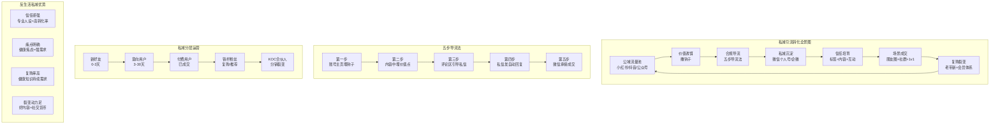
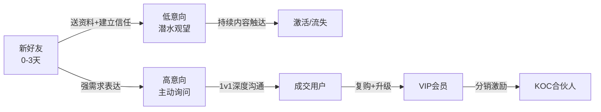
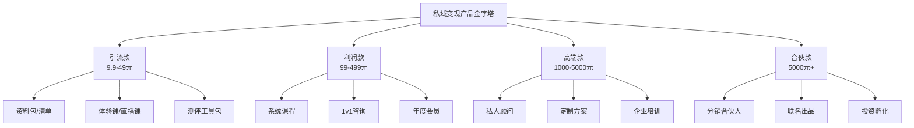

# 📕 Day14: 私域引流转化

> **核心：公域是战场，私域是粮仓。所有平台的流量都不是你的，只有微信里的好友才是资产。把小红书、抖音、公众号的"过客"变成微信里的"熟客"，从一次性曝光变成终身价值，这才是自媒体赚钱的本质护城河。**
> 来源：《私域流量》黄生 + 小红书引流实战方法论 + 微信私域成交体系 + 行业操盘手经验

---

## 一、一句话总结

**私域引流转化 = 公域撒钩子（价值诱饵）→ 合规导微信（五步导流法）→ 分层养信任（标签+内容+互动）→ 场景化成交（朋友圈+社群+1v1）→ 复购裂变（老带新+会员体系）。**

核心逻辑是：**在公域做内容获取信任，在私域做关系完成变现。** 反生活账号的私域转化天然有优势——辟谣内容建立的"专业可信"人设，是用户愿意加微信、愿意付费的最强信任货币。一个愿意为了"健康真相"加你的人，转化率比普通娱乐粉丝高5-10倍。

> 💡 **关键认知**：不要觉得"引流到微信"是灰色操作。平台禁止的是"硬导流"（直接留微信号），但不禁止"价值吸引"（用户主动找你）。合规引流的本质，是让用户觉得"不加你微信就亏了"。

---

## 二、核心框架



---

## 三、可落地方法

### 3.1 价值诱饵设计：让用户主动加你的理由

引流的核心不是"怎么留微信号"，而是"用户为什么愿意加你"。价值诱饵（Lead Magnet）是私域引流的发动机。

#### 反生活账号的6大高转化诱饵

| 诱饵类型 | 具体示例 | 适用场景 | 转化率 |
|:---:|:---|:---|:---:|
| **资料包** | 《100个生活谣言真相清单》《家居安全自查手册》 | 笔记末尾引导 | 8-15% |
| **测评工具** | 「甲醛检测仪选购对比表」「除螨产品红黑榜」 | 评论区互动 | 10-20% |
| **诊断服务** | 「发你家装修照片，我帮你排查3个安全隐患」 | 私信引导 | 15-25% |
| **避坑指南** | 《双11智商税黑名单》《618不买清单》 | 热点节点 | 12-18% |
| **会员社群** | 「健康生活真相群，每天辟谣一条」 | 主页简介 | 5-10% |
| **1v1咨询** | 「前50名免费答疑」 | 高客单价产品 | 20-30% |

> 🔑 **诱饵设计原则**：
> 1. **即时价值**：用户拿到手就能用，不要承诺"长期服务"
> 2. **低门槛**：不需要付出太多，一键领取
> 3. **强关联**：诱饵必须跟你的内容主题100%相关
> 4. **可感知**：标题要具体，"避坑指南"不如"10个你正在用的致癌物清单"

---

### 3.2 五步导流法：从公域到私域的安全通道

平台对直接导流有严格限制，但"用户主动索要"是被允许的。关键是设计好用户"主动找你"的路径。

#### 第一步：账号主页埋钩子

```markdown
## 主页设计公式

头像：真人出镜 > 漫画形象 > 品牌logo
昵称：领域+身份，如「反生活实验室-老黄」「辟谣君-健康生活」
简介：3行式结构
  第1行：你是谁 + 提供什么价值
    → 「专注揭穿生活谣言，守护家人健康」
  第2行：你的诱饵（最关键！）
    → 「领《100个生活谣言真相清单》→ 戳收藏夹」
  第3行：差异化标签
    → 「不做焦虑贩卖机，只做科学传声筒」

背景图：可以软植入，放二维码（需用谐音/变形规避审核）
```

#### 第二步：内容中埋价值点

```markdown
## 笔记内的3种软植入方法

方法1：资料预告法
  「这篇讲不完，我整理了完整版《XX清单》，
   需要的朋友评论区扣1」

方法2：故事引导法
  「上周有个粉丝私信问我XX问题，我发现很多人都有这个误区。
   如果你也想知道答案，可以进我主页看置顶」

方法3：工具/表格法
  「我把所有对比数据整理成了一张表，
   放在评论区置顶了，大家自取」
   → 置顶评论引导私信领取

❌ 禁止：直接写"加我微信XXX"
✅ 合规："需要完整版的朋友，私信我'清单'两个字"
```

#### 第三步：评论区引导私信

评论区是引流最安全、最高效的场所。因为评论互动本身就是平台鼓励的行为。

```markdown
## 评论区引流话术模板

模板1（资料型）：
  用户A："这个太有用了，能发我一份吗？"
  你回复："私信你了~ 大家需要的话私信我'XX'，我一起发"

模板2（答疑型）：
  用户B："我家也有这个问题怎么办？"
  你回复："具体情况可以私信我，我帮你看看"

模板3（群聊型）：
  用户C："有这种群吗？想加入"
  你回复："有的，私信我'进群'，我拉你"

⚠️ 注意事项：
- 不要每条评论都回复"加我微信"，会被判定营销号
- 回复要自然，像朋友聊天
- 可以置顶一条评论，写明领取方式
```

#### 第四步：私信自动回复

私信是引流的最后一道关卡，也是最容易被封的地方。必须做到"自动化+合规化"。

```markdown
## 私信回复策略

小红书设置 → 创作中心 → 私信管理 → 设置自动回复

自动回复文案（示例）：
  「你好呀！感谢关注~ 
   需要《100个生活谣言真相清单》的朋友，
   可以+V：XXXX（备注：小红书）
   我发给你，平时有问题也可以随时问我」

⚠️ 防封技巧：
1. 微信号用谐音：微芯、V、WX、/X
2. 不要连续发同样的微信号给多人
3. 每天主动私信人数控制在20以内
4. 发送微信号时加一句个性化内容
5. 用图片代替文字发微信号（更难被检测）
```

#### 第五步：微信承接与首单成交

用户加到微信后，前3分钟的响应决定了80%的转化率。

```markdown
## 新好友SOP（标准操作流程）

第1分钟：自动通过 + 发送欢迎语
  「嗨！我是老黄，反生活实验室的主理人~
   这是你要的《100个生活谣言真相清单》：[文件]
   另外送你一份《家居安全自查表》，平时自查用得上」

第2步：打标签（必须做！）
  标签体系：
    来源：小红书/抖音/公众号
    兴趣：甲醛/食品安全/睡眠/母婴
    意向：高/中/低
    阶段：新好友/已领取/已咨询/已付费

第3步：3天后跟进
  「清单看了吗？有没有哪个谣言是你之前一直信的？😂
   可以发我你关心的话题，我优先安排辟谣~」

第4步：7天后价值输出
  发一条朋友圈@相关人群，或私发一条干货
  「看你之前关注甲醛问题，这个刚出的检测报告你可能需要」
```

---

### 3.3 私域分层运营：不同用户不同策略

不是所有好友都一样重要。用RFM模型（最近消费、消费频率、消费金额）把用户分层，投精力到高价值用户上。



| 层级 | 占比 | 策略 | 动作 |
|:---:|:---:|:---|:---|
| **新好友** | 100% | 送诱饵+快速响应 | 自动回复+标签+3天后跟进 |
| **意向用户** | 30% | 深度互动+需求挖掘 | 1v1答疑、朋友圈互动、社群话题 |
| **成交用户** | 10% | 满意度+复购引导 | 售后跟进、会员权益、新品优先体验 |
| **铁杆粉丝** | 3% | 情感连接+共创 | 私人群、线下活动、产品共创 |
| **KOC合伙人** | 1% | 分销裂变+深度合作 | 专属佣金、联合出品、资源互换 |

> 💡 **帕累托法则**：80%的精力服务20%的高价值用户，1%的KOC能带来30%的新增流量。

---

### 3.4 朋友圈成交系统：不刷屏也能卖货

朋友圈是私域成交的主战场。但不是发广告，而是发"让人想靠近你的生活"。

```markdown
## 朋友圈内容配比（黄金比例）

60% 价值输出（建立专业人设）
  - 行业洞察："今天看到一份检测报告，XX产品的甲醛超标了3倍"
  - 实用技巧："分享一个检测床垫甲醛的土方法，亲测有效"
  - 用户反馈："收到粉丝的感谢，说用了我的方法避免了XX"

20% 生活展示（建立真实信任）
  - 日常：工作场景、读书、运动
  - 故事：为什么做反生活账号、踩过的坑
  - 情绪：真实的喜怒哀乐，不要完美人设

15% 产品/服务（软性种草）
  - 场景化："今天给VIP会员做了专属答疑，发现大家都有这个误区"
  - 案例化："这个学员用了3个月，家里的空气质量完全变了"
  - 限量感："本月只接10个1v1咨询，还剩3个名额"

5% 互动激活（提升活跃）
  - 提问："你们家最担心的是什么安全问题？"
  - 投票："下期想看甲醛还是食品安全？"
  - 福利："评论区抽3个人送检测套装"
```

> 🚫 **朋友圈禁忌**：
> - 连续发3条以上广告
> - 只有转账截图没有其他内容
> - 复制粘贴别人的文案
> - 一天发超过8条

---

### 3.5 社群运营：从"流量池"到"信任共同体"

社群是私域的高阶形态，也是变现效率最高的场景之一。

```markdown
## 反生活账号社群设计

群名：「反生活实验室-VIP真相群」

入群门槛（3选一）：
  - 购买过任意产品/服务
  - 邀请3位好友关注公众号
  - 付费9.9元（过滤广告党）

群规（3句话）：
  1. 本群每天分享1条辟谣干货
  2. 欢迎提问，老黄会统一答疑
  3. 禁止广告，违者飞机票

每日运营SOP：
  早8:00：「早安真相」—— 1条辟谣卡片
  午12:00：「今日话题」—— 引发讨论的问题
  晚20:00：「老黄答疑」—— 统一回复当天问题
  不定期：群内专属福利、新品内测、抽奖

变现节点：
  - 周中：干货输出，建立信任
  - 周末：产品推荐，限时优惠
  - 月末：会员招募，年费优惠
```

---

## 四、变现路径

### 4.1 私域变现产品矩阵



### 4.2 收入测算：一个5000人私域的价值

| 变现环节 | 转化率 | 客单价 | 月收入 |
|:---:|:---:|:---:|:---:|
| 引流产品（资料包/体验课） | 5% | 29元 | 5000×5%×29 = **7,250元** |
| 利润产品（系统课/会员） | 2% | 299元 | 5000×2%×299 = **29,900元** |
| 高端产品（1v1顾问） | 0.5% | 1999元 | 5000×0.5%×1999 = **49,975元** |
| 分销佣金（推荐返点） | 10%参与×20%返点 | 平均200元 | 500×20%×200 = **20,000元** |
| **合计** | - | - | **≈ 107,000元/月** |

> 📊 **关键数据**：
> - 小红书→微信的导流率：1-3%（优质内容可达5%）
> - 微信好友→付费转化率：2-5%（高信任账号可达8%）
> - 私域用户LTV（终身价值）：平均是公域粉丝的10-20倍
> - 维护5000人私域的精力 ≈ 运营5万粉丝公域账号的1/3

### 4.3 反生活账号的专属变现路径

```markdown
## 老黄的私域变现路线图（6个月）

阶段1（1-2月）：基建期
  - 目标：引流1000人到微信
  - 动作：每篇笔记埋诱饵、评论区引导、自动回复设置
  - 收入：0-3000元（资料包销售）

阶段2（3-4月）：成交期
  - 目标：建立信任体系，推出首款产品
  - 动作：朋友圈日更、社群运营、1v1答疑
  - 收入：5000-15000元（课程+咨询）

阶段3（5-6月）：放大期
  - 目标：口碑裂变，建立分销体系
  - 动作：KOC招募、合伙人计划、多平台联动
  - 收入：20000-50000元（会员+分销+高端服务）
```

---

## 五、行动清单

### 今天就能做的3件事

- [ ] **1. 设计你的价值诱饵（30分钟）**
  - 基于你已有的内容，整理一份《反生活XX清单》或《XX避坑指南》
  - 要求：5-10页PDF，干货密度高，标题吸睛
  - 保存到网盘或微信收藏，随时可以发给用户

- [ ] **2. 优化账号主页（15分钟）**
  - 检查小红书主页简介，确保有明确的"为什么要关注我"+"能得到什么"
  - 在简介中植入诱饵领取方式（不要直接写微信）
  - 设置自动回复，测试私信流程是否顺畅

- [ ] **3. 设计新好友SOP（45分钟）**
  - 写一段欢迎语（100字以内，包含诱饵交付+个人标签+下一步动作）
  - 建立微信标签体系（至少5个标签：来源/兴趣/意向/阶段/备注）
  - 设置3天后跟进话术、7天后价值输出内容

### 本周必做（进阶）

- [ ] 在下一篇笔记中埋入诱饵，测试导流率
- [ ] 整理10条朋友圈内容，覆盖价值/生活/产品/互动4类
- [ ] 设计一个9.9元引流产品，测试成交链路

---

## 关联笔记

- [[Day13-小红书爆款复制方法论]] — 用爆款内容获取公域流量
- [[Day11-小红书电商闭环]] — 小红书站内成交体系
- [[Day5-知识付费变现模型]] — 私域产品设计与定价策略
- [[Day9-闲鱼小红书联动变现闭环]] — 多平台流量协同
- [[Day8-闲鱼引流与复购]] — 闲鱼到私域的引流技巧

---

> 💬 **老黄专属提醒**：
> 私域不是"加个微信发广告"，而是"建立长期信任关系"。反生活账号的核心资产是"专业可信"的人设，这个人在私域里越真实、越有用，用户就越愿意付费。记住：**先给价值，再谈成交；先做朋友，再做生意。**
