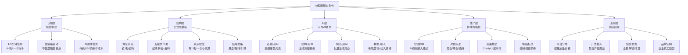
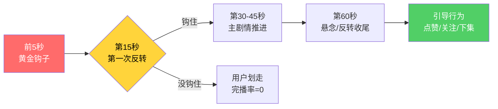

# Day15: AI短剧脚本创作

> 📅 学习日期：2026-07-04
> 🔗 关联笔记：[[00-目录]] | 上一篇：[[Day14-AI生图与视频工具]] | 下一篇：[[Day16-AI短剧制作全流程]]

---

## 1. 一句话总结

**AI短剧脚本创作 = 「爆款公式（钩子头×逆袭体×爽点节奏）」+「AI辅助三阶段（选题→结构→填充）」+「AI短剧特有约束（6-8秒感官阈值×4:3竖屏×TTS语音限制）」——不是让AI替你写，而是让AI把你的创意密度放大10倍。**

---

## 2. 核心框架

### 2.1 AI短剧脚本创作全景图



### 2.2 AI短剧 vs 真人短剧 核心差异

| 维度 | 真人短剧 | AI短剧 | AI的优势倍数 |
|------|---------|--------|------------|
| **制作成本** | 5-20万/集 | 1000-5000元/集 | 1/50-1/100 |
| **制作周期** | 7-14天/集 | 1-2天/集 | 5-10倍快 |
| **演员风险** | 塌房/片酬/档期 | 无 | ∞ |
| **场景限制** | 实景/棚拍 | 任何场景 | 不受限 |
| **人物一致性** | 天然一致 | 需额外控制 | 需技术处理 |
| **情感表现力** | 极强 | 目前弱于真人 | 需文本补偿 |
| **批量生产能力** | 极低 | 极高 | 月产50+集 |

> ⚠️ 关键洞察：AI短剧的弱点（情感表现力）必须靠脚本质量来弥补——**脚本越强，AI翻车的容忍度越高**。所以脚本创作是AI短剧最值得投入能力的环节。

### 2.3 爆款AI短剧脚本的「5-15-60」法则



---

## 3. 可落地方法

### 3.1 AI短剧脚本创作的完整工作流

**【反生活可直接用】AI短剧批量脚本工作流**

总共3小时产出1个完整脚本（含5-10集大纲 + 1集完整脚本 + 配套提示词）。

#### 阶段一：选题（30分钟）

**步骤① — 用AI做爆款选题挖掘**

Prompt模板（直接复制到Claude/GPT）：

```
你现在是短剧选题分析师。请按以下结构帮我分析：
1. 热门短剧品类：列出当前最火的5个短剧品类（霸总/逆袭/重生/穿越/甜宠）
2. 针对以下反生活好物选品，推荐最适合做短剧的3个品类：
   - {填入反生活近期在卖的产品}
3. 每个品类给出1个30字以内的核心故事线
4. 标注为什么这个品类适合该产品植入
```

**步骤② — 做竞品参考**

去小红书/抖音搜索「AI短剧」「AI原创短剧」，收集：
- 播放量>100万的AI短剧标题
- 前3秒的钩子话术
- 评论区高频关键词
- 记录到选题池中

**步骤③ — 确定今日选题标准**

| 筛选条件 | 合格线 | 说明 |
|---------|-------|------|
| 搜索热度 | 抖音话题播放>1亿 | 验证赛道上行 |
| AI短剧数量 | 同品类<50个 | 避免红海竞争 |
| 产品植入可能 | 至少3个自然植入点 | 与反生活选品匹配 |
| 制作复杂度 | 单场景≤3次切换 | 降低AI生成难度 |

#### 阶段二：写结构（45分钟）

**【反生活可直接用】AI短剧脚本模板**

**黄金开头模板（前5-8秒）：**

```
模板A - 悬念型
[画面：特写-关键物品/表情] + [旁白：一句话抛出异常]
例：「你知道吗？这把按摩仪只卖199，但它的电机和5000块的国际大牌是同一家工厂。」

模板B - 冲突型
[画面：人物冲突场景] + [对白：直接对峙]
例：「老公，这枕头3000块！」「等等，我手里这个只要299，用料一样。」

模板C - 反差型
[画面：普通人做某事] + [旁白：意想不到的结果]
例：「辞职做自媒体第60天，我终于...（停顿）赚了50万。不是卖课，是卖这个。」
```

**五段式结构模板（1集完整脚本约60-120秒）：**

| 段落 | 时长 | 内容 | 情绪曲线 | AI生成要点 |
|------|------|------|---------|-----------|
| 钩子 | 0-8秒 | 抛出异常/冲突，瞬间锁定注意力 | ↗️ 立刻上升 | 画面描述要极简，2个关键元素即可 |
| 背景 | 8-20秒 | 简要交代人物/处境 | ♾️ 平缓介绍 | TTS语速要快，配轻快BGM |
| 发展 | 20-40秒 | 事情推进，不断铺垫 | ↗️ 逐步上升 | 重点在对话节奏，每2句一个信息点 |
| 反转 | 40-55秒 | 意外转折，情绪爆发点 | ⬆️⬆️ 最高点 | 画面要戏剧化，AI生图用夸张风格 |
| 收尾 | 55-60秒 | 悬念/反转/互动引导 | ⬇️→↗️ 收尾再钩 | 最后一帧留白或文字引导 |

#### 阶段三：AI填充生成（45分钟）

**步骤① — 用AI批量生成对白**

Prompt模板（输出可直接用于ComfyUI/可灵）：

```
请为以下短剧脚本生成完整的对白和旁白：

短剧类型：{霸总/逆袭/重生/穿越}
核心故事线：{一句话概括}
风格：{搞笑/感人/热血/悬疑}

输出格式要求（每个镜头一行）：
| 镜号 | 时长 | 画面描述（AI生图Prompt） | 旁白/对白 | 情绪/语气说明 |

输出3-5个镜头，格式用表格。画面描述控制在20字以内，使用英文关键词。
```

**步骤② — 对白优化（针对AI TTS）**

| TTS类型 | 优点 | 缺点 | 脚本适配策略 |
|---------|------|------|------------|
| Edge TTS | 免费，语音自然 | 可选音色少 | 长段落用 |
| Fish Audio | 音色多样 | 需付费 | 角色区分用 |
| MiniMax TTS | 情感表现力强 | 字数限制 | 高潮段落用 |

> ⚠️ AI TTS痛点和应对：AI合成语音在情感爆发段落表现力不足。对策：在脚本中把高潮段落设计成「旁白讲解+画面冲击」而非「角色对白」，用视觉弥补语音的不足。

**步骤③ — 画面描述转AI视频Prompt**

AI视频工具（可灵/即梦/Sora/Runway等）的Prompt规则：
- 短句（<15个单词），避免复杂从句
- 避免抽象概念，用具体视觉元素
- 标注镜头运动（推/拉/摇/移）
- 固定风格关键词形成IP一致性

#### 阶段四：精修（60分钟）

**【反生活可直接用】精修检查清单**

```
☐ 前3秒是否能让人停下来？→ 重新录开头旁白
☐ 每15秒是否有小爽点？→ 缺乏则插入一句反转或彩蛋
☐ AI画面是否有穿帮？→ 标记重生成或后期裁切
☐ TTS语气是否匹配情绪？→ 高潮段落换真人配音
☐ 产品植入是否自然？→ 至少2处软性露出
☐ 结尾是否有互动引导？→ 关注/评论/下集悬念
```

### 3.2 反生活专属AI短剧选题建议

基于「反生活好物」的产品线，推荐以下短剧选题：

| 产品线 | 推荐类型 | 核心故事线 | 植入方式 |
|-------|---------|-----------|---------|
| 颈椎按摩仪 | 职场逆袭 | 社畜靠一个按摩仪逆袭成CEO | 办公场景自然使用 |
| 护眼仪 | 重生文 | 重生后靠护眼避免近视逆转人生 | 主角学习/工作场景 |
| 颈椎枕 | 穿越古代 | 现代枕头穿越古代被当成神器 | 古装对比式植入 |
| 智能暖宫宝 | 霸道总裁 | 霸总送上暖宫宝的甜宠桥段 | 浪漫送礼场景 |
| 醒酒片/护肝 | 创业故事 | 创业大佬的秘密武器 | 酒局社交场景 |

### 3.3 批量脚本生产SOP

**【反生活可直接用】一周产量计划**

| 时间 | 任务 | 产出 | 预计耗时 |
|------|------|------|---------|
| 周一上午 | 选题+看数据 | 5个选题方向 | 1h |
| 周一下午 | 写结构+AI生成 | 2集脚本 | 2h |
| 周二 | AI视频生成 | 1集成片 | 4h（含渲染排队） |
| 周三 | 同上 | 1集成片 | 4h |
| 周四 | 配音+剪辑 | 1集成片 | 2h |
| 周五 | 发布+复盘 | 本周3集发布+下周规划 | 1h |
| **总计** | | **周产3集** | **14h** |

> 💡 一个成熟的AI短剧创作者（熟练后），**周产5-7集**，月产20-30集。目前市场处于蓝海期，供给远低于需求，先发优势明显。

---

## 4. 变现路径

### 4.1 AI短剧变现模式对比

| 模式 | 平台 | 收益方式 | 门槛 | 月收入预估 | 推荐指数 |
|------|------|---------|:----:|:---------:|:-------:|
| 抖音短剧创作激励 | 抖音 | 按播放量给补贴 | 低 | 3000-20000 | ★★★★★ |
| 快手星芒短剧 | 快手 | 保底+分成 | 中 | 5000-30000 | ★★★★☆ |
| 小红书短剧激励 | 小红书 | 流量扶持+商单 | 低 | 2000-10000 | ★★★★☆ |
| 短剧平台入驻（河马/微视等） | 专用平台 | 版权费+分成 | 中 | 5000-50000 | ★★★☆☆ |
| 品牌定制短剧 | 企业直单 | 一口价 | 高 | 20000-100000/单 | ★★★☆☆ |
| 私域付费解锁 | 微信/社群 | 全集付费 | 低 | 1000-5000 | ★★☆☆☆ |

### 4.2 推荐路径：「反生活好物」AI短剧变现组合

**【反生活可直接用】三级变现路线**

**第一级（第1-2月）：跑通内容，养账号**

- 目标：发布20+集AI短剧，积累1万粉丝
- 渠道：抖音（主）+小红书（辅）
- 收益：平台激励补贴约3000-8000元/月
- 重点：验证哪些选题方向的数据好

**第二级（第3-4月）：植入产品，引流变现**

- 在产品号上做短剧，自然植入反生活好物
- 剧情和产品高度结合，比如「霸道总裁用颈椎按摩仪」
- 评论区挂购物车链接
- 收益：产品销售额*佣金，预估5000-20000元/月

**第三级（第5-6月）：品牌定制，升级模式**

- 积累案例后，接品牌方定制短剧（比如颈椎按摩仪品牌想找AI短剧创作者代工）
- 单集报价：2000-5000元
- 同时把短剧分发到多个平台赚多重收益
- 收益：定制费+平台补贴+带货，预估15000-50000元/月

### 4.3 收入计算示例（保守估计）

| 项目 | 抖音激励 | 小红书激励 | 带货佣金 | 品牌定制 | 总计 |
|------|:-------:|:---------:|:-------:|:-------:|:----:|
| 月产20集 | ✓ 基础激励 | ✓ 流量扶持 | ✓ 植入5次 | ✓ 2单/月 | |
| 月收入 | 5000 | 2000 | 5000 | 8000 | **20000** |
| 投入时间 | 14h/周×4 | | | | **56h/月** |
| 时薪 | | | | | **357元/h** |

> 对比：AI短剧脚本创作的时薪（357元/h）远高于普通自媒体创作的时薪（50-100元/h），是AI为创作者带来的最大红利。

---

## 5. 行动清单

### ✅ 行动①：搭建AI短剧选题池（30分钟完成）

**操作步骤：**
1. 打开抖音搜索「AI短剧」，筛选近7天播放量>50万的视频
2. 记录前10个视频的：标题、前3秒内容、点赞数、评论区高频词
3. 用以下Prompt让AI分析这些选题的共同特征：
   ```
   请分析以下10个AI短剧爆款的共同特征：
   {粘贴标题和核心钩子}
   输出：①共同的爽点类型 ②最有效的开头模式 ③建议我们的第一个选题
   ```
4. 将分析结果和3个选题方向记录到 `~/反生活/AI短剧选题池.md`

**产出：** 3个已确认的选题方向 + 竞品分析报告

### ✅ 行动②：写出第一个AI短剧脚本（1.5小时完成）

**操作步骤：**
1. 选择行动①中排名第一的选题
2. 用本笔记第3节「黄金开头模板」写出3个版本的开头
3. 选最好的开头，用「五段式结构」写出完整脚本（60-120秒，8-12个镜头）
4. 用AI填充对白和画面描述
5. 用「精修检查清单」过一遍，修改明显问题

**产出：** 1个完整可用的AI短剧脚本（含分镜表、对白、画面Prompt）

### ✅ 行动③：试做一条AI短剧并发布（2小时完成）

**操作步骤：**
1. 用行动②的脚本，在ComfyUI/可灵/即梦中生成画面
2. 用Edge TTS或Fish Audio生成旁白
3. 用剪映或CapCut做简单剪辑拼接
4. 抖音发布，标题带上：#AI短剧 #短剧创作
5. 记录发布后的24小时数据：播放量、完播率、点赞

**产出：** 1条已发布的AI短剧 + 首日数据存档
**预期结果：** 第一条不追求爆款，重点跑通「脚本→AI生成→发布→数据反馈」的完整闭环

---

> **💡 核心建议：不要等学完「全流程」再做，先写3个脚本存着。AI短剧目前最大的瓶颈不是工具，而是脚本质量。谁能批量输出好脚本，谁就能在这波红海中抢到最多的流量。**
