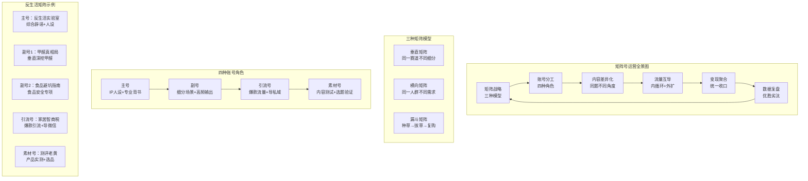
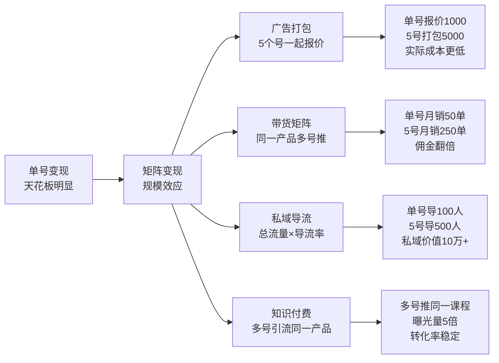

# 📕 Day15: 小红书矩阵号运营

> **核心：矩阵不是多开几个号刷量，而是用「账号分工+内容差异化+流量互导」构建规模化内容生产体系。一个号月入3000是天花板，五个号月入3000才是地板——矩阵的本质是用组织化打法对抗平台算法的随机性，把偶然爆款变成必然产出。**
> 来源：小红书MCN内部矩阵打法 + 多账号运营实战手册 + 平台算法逻辑反推

---

## 一、一句话总结

**小红书矩阵号运营 = 矩阵定位（垂直/横向/漏斗三种模型）→ 账号分工（主号+副号+引流号+素材号）→ 内容差异化（同主题换角度，避免内部竞争）→ 流量互导（矩阵内循环+公域外扩）→ 变现聚合（统一收口，放大收益）。**

核心逻辑是：**把「一个账号All in所有功能」变成「多个账号各专其职」，让每个账号轻装上阵、专攻一个场景，整体形成覆盖用户全旅程的内容网络。** 反生活账号做矩阵有天然优势——辟谣话题极其丰富，从甲醛到食品安全到母婴用品到睡眠健康，一个号根本做不完，矩阵化是必然选择。

> 💡 **关键认知**：平台算法对单账号有「流量天花板」（同一领域持续输出会被限流），但矩阵账号之间互不影响。5个号各发3篇，总曝光是一个号发15篇的2-3倍。矩阵是突破单账号流量瓶颈的唯一解。

---

## 二、核心框架



---

## 三、可落地方法

### 3.1 三种矩阵模型：选适合你阶段的打法

不是所有矩阵都一样。根据你的资源和目标，选择最合适的模型。

#### 模型1：垂直矩阵（新手首选）

```markdown
## 定义
同一赛道，切不同细分话题，各账号之间互补不竞争。

## 反生活垂直矩阵示例
- 主号：「反生活实验室」→ 综合辟谣，建立专业人设
- 子号1：「甲醛真相局」→ 只讲甲醛相关（检测、治理、产品）
- 子号2：「食品避坑指南」→ 只讲食品安全（添加剂、标签、选购）
- 子号3：「睡眠真相」→ 只讲睡眠健康（枕头、床垫、助眠产品）
- 子号4：「母婴智商税」→ 只讲母婴用品（奶粉、尿布、玩具）

## 优势
✅ 内容方向清晰，每个号都能做到领域深耕
✅ 用户画像精准，转化率极高
✅ 搜索流量占比高（用户搜「甲醛」→ 找到你的垂直号）
✅ 最容易复制，找到一套SOP可以批量产出

## 劣势
⚠️ 需要持续产出各细分领域的专业内容
⚠️ 单个号的受众面较窄，天花板有限

## 适用阶段
- 个人运营：1-3个号，自己或加1个兼职
- 团队运营：5-10个号，每个号有专人负责
```

#### 模型2：横向矩阵（进阶打法）

```markdown
## 定义
同一目标人群，覆盖其不同需求场景，把一个人"吃干榨净"。

## 反生活横向矩阵示例
目标人群：25-35岁都市女性，关注健康生活
- 号A：「反生活实验室」→ 辟谣科普（专业人设）
- 号B：「老黄的家居清单」→ 好物推荐（带货变现）
- 号C：「健康生活家」→ 生活方式（日常种草）
- 号D：「省钱小能手」→ 省钱攻略（价格敏感型用户）

## 优势
✅ 同一批内容素材可以改编成不同形式，利用率极高
✅ 用户可能在A号认识你，在B号成交，在C号复购
✅ 品牌合作时可以打包出售，报价更高

## 劣势
⚠️ 需要理解用户的「全生命周期需求」
⚠️ 账号之间风格差异大，对个人运营者来说切换成本高

## 适用阶段
- 已有1个成功账号，想放大收益
- 有团队支持，能分工运营不同定位
```

#### 模型3：漏斗矩阵（变现导向）

```markdown
## 定义
按用户决策路径设计账号分工：种草→对比→拔草→复购。

## 反生活漏斗矩阵示例
- 上层（种草）：「生活小常识」→ 泛科普，大量流量，不讲产品
- 中层（对比）：「测评老黄」→ 产品实测，建立信任，软性种草
- 下层（拔草）：「老黄的家居清单」→ 明确带货，挂车链接
- 底层（复购）：私域微信 → 会员社群，长期复购

## 优势
✅ 流量利用效率最高，每个环节都在筛选高意向用户
✅ 上层号不怕限流（不挂车），可以疯狂做流量
✅ 变现路径清晰，每个号只负责一个转化环节

## 劣势
⚠️ 需要设计好「账号间导流」的话术和路径
⚠️ 上层号到下层号的转化率需要持续优化

## 适用阶段
- 有明确的变现产品（课程/社群/咨询服务）
- 已有私域承接能力
```

> 🔑 **老黄建议**：从「垂直矩阵」起步，先做到3个号跑通闭环，再考虑横向或漏斗矩阵。不要贪多，1个号月入3000，3个号就是9000，足够证明模式可行性。

---

### 3.2 账号分工：四种角色的具体职责

```markdown
## 角色1：主号（IP号）—— 1个
职责：建立专业人设，输出深度内容，承接品牌合作
更新频率：每周2-3篇
内容类型：深度科普、行业洞察、个人故事
变现方式：广告接单、知识付费、品牌背书
关键指标：粉丝质量 > 粉丝数量

## 角色2：副号（垂类号）—— 2-3个
职责：覆盖细分话题，获取搜索流量，测试新选题
更新频率：每周3-5篇
内容类型：清单类、测评类、避坑类
变现方式：带货佣金、引流私域
关键指标：搜索流量占比 > 50%

## 角色3：引流号（流量号）—— 1-2个
职责：追热点、做爆款、大批量获取泛流量
更新频率：每天1-2篇
内容类型：争议话题、反常识内容、情绪共鸣
变现方式：为主号/副号导流、评论区引流微信
关键指标：单篇曝光量、导流转化率

## 角色4：素材号（测试号）—— 1个
职责：测试新选题、新封面、新话术，为主力号探路
更新频率：每天1-3篇
内容类型：各种实验性内容
变现方式：基本不变现，纯测试
关键指标：点击率、互动率、收藏率
```

---

### 3.3 内容差异化：同主题换角度，避免内部竞争

矩阵最怕的是「自己打自己」——两个号发同样的内容，算法只会推一个。

```markdown
## 差异化四维度

### 维度1：角度差异
同一选题，不同切入角度：
- 号A（恐惧型）：「这种洗洁精千万别用了！检出致癌物」
- 号B（科普型）：「洗洁精成分解析：哪些安全哪些避雷」
- 号C（对比型）：「9.9元洗洁精 VS 99元洗洁精，成分居然一样」
- 号D（清单型）：「2024年洗洁精红黑榜，这5款别买」

### 维度2：形式差异
同一内容，不同呈现形式：
- 图文笔记（信息密度高，适合搜索）
- 短视频（完播率高，适合推荐流）
- 图文合集（收藏率高，适合干货）
- 直播切片（真实感强，适合信任建立）

### 维度3：人群差异
同一产品，针对不同人群：
- 母婴号：「有娃家庭必看：婴儿洗洁精怎么选」
- 租房号：「租房党省钱：洗洁精平替方案」
- 高端号：「中产家庭升级：天然洗洁精值得吗」

### 维度4：场景差异
同一痛点，不同使用场景：
- 厨房场景：「洗碗不净？可能是洗洁精用错了」
- 健康场景：「洗洁精残留危害有多大？实验数据告诉你」
- 省钱场景：「洗洁精稀释比例做对了，一年省200」
```

> 💡 **实操技巧**：建立「选题池共享机制」。所有账号的选题统一放在一个表格里，标注「角度+形式+目标人群」，发之前检查是否有重叠。

---

### 3.4 流量互导：矩阵内部的「血液循环」

矩阵的价值不在于号多，而在于号与号之间的流量协同。

```markdown
## 内部导流四法

### 方法1：评论区互动法（最自然）
- 号A发笔记，号B在评论区提问：「那XX产品呢？」
- 号A回复：「这个我另一篇有详细测评，看我主页」
- 用户点进号B主页 → 发现更多内容 → 关注

### 方法2：合集引流法（最安全）
- 号A做合集「辟谣系列」，其中一篇提到「具体选购指南看我收藏夹」
- 收藏夹里放号B的相关笔记链接
- 用户顺着合集找到号B

### 方法3：@提及法（适合强关联内容）
- 号A发：「关于甲醛检测仪的详细数据，@测评老黄 有完整报告」
- 用户点击@账号 → 跳转到号B主页
- ⚠️ 注意：不要每条都@，会被判定营销号

### 方法4：私信推荐法（转化率最高）
- 用户私信号A问某个问题
- 号A回复：「这个话题我专门有个号在讲，你可以关注 @XX」
- 用户主动关注 → 精准度极高
```

---

### 3.5 矩阵内容生产SOP：一个人也能管3个号

```markdown
## 周一：选题日（2小时）
- 浏览各号上周数据，确定本周重点方向
- 从选题池分配选题给各账号
- 确保3个号的角度不重复

## 周二：制作日（3小时）
- 批量拍摄/制作素材（同一批素材改编成3个版本）
- 例：测了1款甲醛仪 → 
  - 号A做「拆机测评」（深度版）
  - 号B做「对比横评」（清单版）
  - 号C做「避雷提醒」（恐惧版）

## 周三-周五：发布日（每天30分钟）
- 按排期表发布（错开时间，不要同时发）
- 发布后10分钟：小号互动（点赞+评论）
- 发布后2小时：回复评论区

## 周六：数据复盘（1小时）
- 统计各号本周数据
- 找出表现最好的选题和形式
- 更新选题池，标记高潜力方向

## 周日：休息/学习
- 刷竞品账号，收集新选题
- 学习平台新功能/新政策
```

---

## 四、变现路径

### 4.1 矩阵变现的乘数效应



### 4.2 反生活矩阵变现测算

```markdown
## 场景：3个垂直号矩阵（个人运营）

号A：「反生活实验室」（主号）
- 粉丝：2万
- 内容：深度科普+人设
- 收入：广告接单 1500元/月 + 知识产品 2000元/月

号B：「甲醛真相局」（垂类号）
- 粉丝：8000
- 内容：甲醛检测/治理/产品
- 收入：带货佣金 2000元/月 + 私域导流 50人/月

号C：「食品避坑指南」（垂类号）
- 粉丝：5000
- 内容：食品安全+选购
- 收入：带货佣金 1500元/月 + 私域导流 30人/月

矩阵总收入：1500 + 2000 + 2000 + 1500 = 7000元/月
私域增量：80人/月 × 6个月 = 480人
私域变现：480人 × 5%转化率 × 200元客单价 = 4800元/月

合计：7000 + 4800 = 11800元/月

> 📊 对比：如果只做号A一个号，收入天花板约 5000元/月。
> 矩阵化后收入翻倍，且私域资产在持续累积。
```

### 4.3 矩阵运营的成本与风险

```markdown
## 成本结构（3个号/月）
- 手机设备：二手iPhone，约 500元/台（一次性）
- 电话卡：3张，约 100元/月
- 内容制作：自己产出不花钱，如需兼职约 1000元/月
- 投流测试：薯条投放约 300元/月
- 总计：约 1400元/月

## 风险控制
⚠️ 设备风险：一机一号，不要用分身/多开软件
⚠️ 网络风险：每个号用不同网络（WiFi/流量分开）
⚠️ 内容风险：矩阵号之间不要互相搬运，必须差异化
⚠️ 账号风险：新号前1个月不要任何导流动作，养号为主
⚠️ 平台风险：矩阵是平台默许但不喜欢的事，低调运营
```

---

## 五、行动清单（今天就能做的3件事）

### ✅ 第一件事：确定你的矩阵模型（20分钟）

```markdown
1. 回顾你目前的账号定位和内容方向
2. 从三种模型中选择一种：
   - 如果你内容方向多但一个人做 → 选「垂直矩阵」，切2个细分号
   - 如果你已有稳定粉丝想变现 → 选「漏斗矩阵」，加1个引流号+1个带货号
   - 如果你有团队支持 → 选「横向矩阵」，覆盖用户全需求
3. 画出你的矩阵结构图（纸笔即可）：
   - 主号叫什么？做什么？
   - 子号1叫什么？切哪个细分？
   - 子号2叫什么？怎么差异化？
```

### ✅ 第二件事：注册并养新号（30分钟）

```markdown
1. 准备1台备用手机（二手iPhone 8以上即可）
2. 办理1张新电话卡（或先用家人副卡）
3. 注册新小红书账号：
   - 昵称：与主号关联但独立（如主号叫「反生活实验室」，新号叫「甲醛真相局」）
   - 头像：统一风格但不同画面
   - 简介：明确细分定位 + 价值承诺
4. 养号7天（关键！）：
   - 每天刷30分钟同领域内容
   - 点赞、收藏、评论（像真实用户）
   - 不要发任何内容，不要改资料
   - 不要连WiFi（用流量，与主号区分）
```

### ✅ 第三件事：建立「矩阵选题池」（40分钟）

```markdown
1. 打开Excel/飞书文档，建一个表格
2. 列标题：选题 | 主号角度 | 子号A角度 | 子号B角度 | 状态 | 数据
3. 从你已经做过的选题中，挑3个数据最好的：
   - 为每个选题设计2个不同角度的版本
   - 例：选题「甲醛仪测评」
     - 主号：「拆机测评：300元甲醛仪内部结构解析」
     - 子号A：「5款甲醛仪横评：哪款最值得买」
     - 子号B：「别买这种甲醛仪！检出数据偏差50%」
4. 把表格保存在云端，每次发内容前先查表
5. 每周更新一次，标记已发和待发的选题
```

---

## 六、常见误区与避坑指南

```markdown
### ❌ 误区1：矩阵 = 同一内容发5个号
✅ 正确：矩阵的核心是「差异化」，同样的内容发多个号会被判定搬运，全部限流。

### ❌ 误区2：一上来就开10个号
✅ 正确：先跑通1个号，再复制到第2个、第3个。3个号跑稳了再考虑扩容。

### ❌ 误区3：矩阵号之间互相点赞评论
✅ 正确：小号可以给大号互动，但不要太频繁（每天不超过2条），且评论要有实质内容。

### ❌ 误区4：用同一台手机切换多个号
✅ 正确：一机一号是最安全的。如果条件有限，至少做到「WiFi/流量区分+不同时间段登录」。

### ❌ 误区5：新号一注册就发广告
✅ 正确：新号前1个月只发干货，不要挂车、不要留微信、不要做营销。先让平台认定你是「优质创作者」。
```

---

> **关联笔记**：[Day13-小红书爆款复制方法论](Day13-小红书爆款复制方法论.md) · [Day14-私域引流转化](Day14-私域引流转化.md) · [Day11-小红书电商闭环](Day11-小红书电商闭环.md) · [Day12-小红书投放与投流](Day12-小红书投放与投流.md) · [Day1-小红书变现全攻略](Day1-小红书变现全攻略.md) · [选题策略](../02-内容方法论/选题策略.md)
