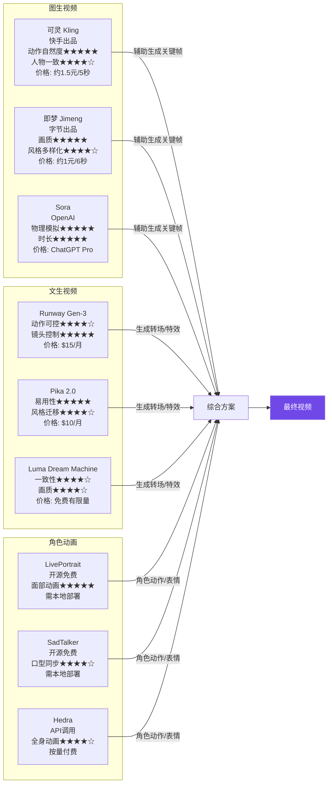
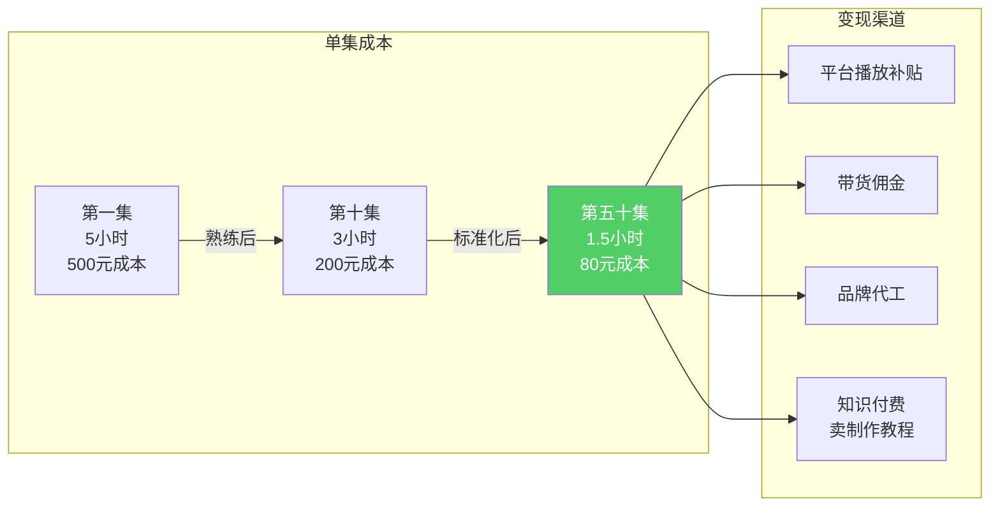

# Day16: AI短剧制作全流程

> 📅 学习日期：2026-07-05
> 🔗 关联笔记：[[00-目录]] | 上一篇：[[Day15-AI短剧脚本创作]] | 下一篇：[[Day17-AI短剧分发与变现]]

---

## 1. 一句话总结

**AI短剧制作全流程 = 「脚本分镜化 → AI视频生成（画面×角色×动作）」+「AI配音配乐 × 智能后期合成」+「成片质检四关卡」——从一行字到一条1-3分钟竖屏短剧的完整流水线，核心在于把脚本「翻译」成AI能理解的视觉语言，而非让AI替你创作。**

---

## 2. 核心框架

### 2.1 AI短剧制作全景图

```mermaid
graph TB
    A[AI短剧制作全流程] --> B[输入层<br/>脚本解析]
    A --> C[画面层<br/>AI视频生成]
    A --> D[音频层<br/>配音配乐]
    A --> E[合成层<br/>后期剪辑]
    A --> F[质检层<br/>成片把关]

    B --> B1[脚本→分镜表<br/>镜头分解]
    B --> B2[角色库定义<br/>形象一致性]
    B --> B3[场景规划<br/>背景/道具/氛围]
    B --> B4[提示词编写<br/>画面Prompt工程]

    C --> C1[图生视频<br/>可灵/即梦/Sora]
    C --> C2[文生视频<br/>Runway/Pika]
    C --> C3[角色动画<br/>LivePortrait/SadTalker]
    C --> C4[镜头组装<br/>关键帧衔接]

    D --> D1[AI配音<br/>Edge/Fish/MiniMax]
    D --> D2[背景音乐<br/>Suno/AudioCraft]
    D --> D3[音效生成<br/>ElevenLabs SFX]
    D --> D4[音频混音<br/>语速/音量/对齐]

    E --> E1[时间线拼接<br/>镜头顺序]
    E --> E2[字幕生成<br/>自动识别+样式]
    E --> E3[节奏调整<br/>卡点/变速/转场]
    E --> E4[成品导出<br/>格式/分辨率/压缩]

    F --> F1[一致性检查<br/>角色/场景/风格]
    F --> F2[流畅度检查<br/>动作/过渡/口型]
    F --> F3[清晰度检查<br/>画质/噪点/分辨率]
    F --> F4[合规性检查<br/>内容/版权/广告法]

    style A fill:#7048e8,color:#fff
    style B fill:#4263eb,color:#fff
    style C fill:#0ca678,color:#fff
    style D fill:#f59f00,color:#000
    style E fill:#e64980,color:#fff
    style F fill:#868e96,color:#fff
```



### 2.2 AI视频工具矩阵对比



### 2.3 AI短剧制作的「三种模式」选择

| 模式 | 制作路径 | 成本/集 | 质量 | 适合场景 | 推荐指数 |
|------|---------|:-------:|:----:|---------|:-------:|
| **🎯 图生视频模式** | 先AI生图→再图生视频 | 500-1500元 | ★★★★☆ | 主推方案，质量最高 | ★★★★★ |
| **⚡ 文生视频模式** | 直接文字→视频 | 200-500元 | ★★★☆☆ | 快速出片、测试选题 | ★★★★☆ |
| **🎭 角色驱动模式** | 固定角色图+驱动动画 | 800-2000元 | ★★★★☆ | 连续剧情、角色稳定 | ★★★★☆ |

> **核心判断：图生视频模式是目前AI短剧制作的最佳方案。** 先用MidJourney/Stable Diffusion生成关键帧画面（保证画质和构图），再用可灵/即梦转成动态视频（保证动作自然度），最后用LivePortrait做角色表情。三种工具的黄金组合。

---

## 3. 可落地方法

### 3.1 AI短剧制作的完整工作流（4小时出片）

**【反生活可直接用】从脚本到成片的操作手册**

#### 阶段一：脚本→分镜表（30分钟）

收到上一步的脚本后，第一步是「分镜化」——把文字脚本拆成一个个镜头。

**分镜表模板（直接复制）：**

```markdown
## 分镜表 —— 《{剧名}》第X集

| 镜号 | 时长 | 镜头类型 | 画面描述 | 旁白/对白 | 情绪 | 视频生成方案 |
|:----:|:----:|:---------|:---------|:---------|:----|:------------|
| 1 | 0-6s | 中景-推 | [描述] | [台词] | 紧张 | 可灵图生视频 |
| 2 | 6-12s | 特写 | [描述] | [台词] | 好奇 | 即梦图生视频 |
| 3 | 12-20s | 全景-摇 | [描述] | 旁白 | 平静 | 可灵图生视频 |
```

**关键原则：**
- 每段视频长度控制在5-8秒，这是AI视频生成的最佳时长
- 一个完整短剧（60-90秒）= 10-15个镜头
- 镜头变更频次 = 情感节奏，高潮段落镜头切换更快

#### 阶段二：AI生图+图生视频（2小时）

这是最耗时也最核心的环节。

**步骤① — 用ComfyUI/MidJourney生成关键帧（40分钟）**

提示词模板（反生活好物方向）：

```
类型：产品评测/开箱场景
风格：竖屏9:16，电商质感，明亮光线，产品出镜
角色：30岁职场女性，干练，自然表情
背景：简约家居/办公环境，暖色调
情绪：好奇→惊喜→满意
禁止：文字遮挡主体，过暗，模糊
```

针对反生活选品，推荐以下场景模板：

| 产品 | 推荐场景 | 构图建议 | 色彩风格 |
|------|---------|---------|---------|
| 颈椎按摩仪 | 办公室工位/书房 | 中景，人物侧对镜头 | 暖色调+绿植 |
| 护眼仪 | 夜晚卧室/睡前 | 特写，人物闭眼 | 蓝紫色调+暖光 |
| 颈椎枕 | 卧室床/沙发 | 侧躺特写，产品突出 | 柔光暖色调 |
| 智能暖宫宝 | 客厅沙发/沙发 | 人物半躺，手捂产品 | 暖橘色+毛毯 |
| 护肝片/醒酒片 | 聚餐后/饭桌 | 近景，产品+手部动作 | 自然光+冷色调 |

**步骤② — 用可灵/即梦做图生视频（60分钟）**

每张图片生成5-6秒视频。操作要点：

| 工具 | 推荐场景 | 参数要点 | 排队时间 |
|------|---------|---------|:--------:|
| **可灵Kling 1.6** | 人物动作、表情变化（首选） | 运动幅度选「中等」，负面提示词+blurry+deformed+bad anatomy | 3-8分钟/次 |
| **即梦Jimeng 2.0** | 产品展示、场景转场 | End Frame模式打开，保证首尾帧衔接 | 2-5分钟/次 |
| **ComfyUI（本地）** | 批量生成、风格统一（高阶） | 工作流用AnimateDiff+IP-Adapter | 视显卡性能 |

**⚠️ 图生视频的核心技巧：**

```
1. 人物一致性是最大痛点 → 用IP-Adapter或参考图模式锁定风格
2. 运动幅度可控 → 宁可小动作多帧，不要大动作崩坏
3. 尽量避免「关节运动」→ 手指、走路、转身最容易崩
4. 先测2-3秒预览 → 确认效果再生成完整时长
5. 保留所有生成素材 → 失败的片段可以卡点剪辑救回来
```

**步骤③ — 角色表情+口型同步（20分钟）**

对于需要说话的镜头，额外处理口型同步。

```
推荐工具链（开源免费）：
1. 导出可灵/即梦生成的人物画面（人物静止或小幅度动的镜头）
2. 用LivePortrait对口型：python inference.py --driven_audio audio.wav --source_image face.jpg
3. 用SadTalker备选：python inference.py --driven_audio audio.wav --source_image face.jpg --still

处理时间：约2-3分钟/段口型视频
设备要求：NVIDIA GPU 8GB+（M芯片Mac可以用CPU跑，约慢3倍）
```

#### 阶段三：AI配音配乐（30分钟）

**步骤① — AI配音生成（15分钟）**

| 工具 | 音色 | 费用 | 推荐场景 |
|------|------|:----:|---------|
| Edge TTS | 多语言，自然 | 免费 | 旁白叙述（首选） |
| Fish Audio | 200+音色，情感丰富 | 免费额度 | 角色对白（首选） |
| MiniMax TTS | 情感表现力极强 | 付费 | 高潮对白、情绪爆发 |
| ElevenLabs | 电影级品质 | $5/月起 | 高品质要求 |

**旁白配音Prompt模板（直接复制）：**

```python
# Edge TTS 命令行调用
edge-tts --voice zh-CN-XiaoxiaoNeural --text "旁白文本" --write-media output.mp3
# 音色推荐：Xiaoxiao（知性女声）、Yunxi（阳光男声）、Xiaomo（情感女声）

# Fish Audio API调用
curl -X POST "https://api.fish.audio/v1/tts" \
  -H "Authorization: Bearer YOUR_API_KEY" \
  -H "Content-Type: application/json" \
  -d '{"text": "对白文本", "reference_id": "音色ID", "emotion": "happy"}'
```

**音色配对策略（推荐）：**

| 角色类型 | 推荐音色 | 工具 | 语速 |
|---------|---------|------|:----:|
| 女主播/主角 | 温暖女声（Xiaoxiao/Xiaomo） | Edge TTS | 1.0x |
| 霸道总裁/男角色 | 沉稳男声（Yunxi/Yunjian） | Edge TTS | 0.9x |
| 搞笑/夸张角色 | 俏皮音色 | Fish Audio | 1.2x |
| 旁白/解说 | 中速女声 | Edge TTS | 1.1x |
| 老人/特色角色 | 特色音色 | Fish Audio | 0.8x |

**步骤② — 背景音乐生成（10分钟）**

```bash
# Suno API 生成BGM模板
prompt = "短剧背景音乐, 轻快节奏, 竖屏短视频配乐, 4秒循环, 无歌词"
# 或使用AudioCraft本地生成
python -m audiocraft.generate --model musicgen-melody --prompt "upbeat short drama background music" --duration 8
```

**BGM推荐风格：**
- 悬疑/反转段落 → 紧张感弦乐+低音鼓
- 感人/温情段落 → 钢琴独奏+轻音垫
- 搞笑/轻松段落 → 尤克里里+口哨
- 产品展示段落 → 摩登电子+清脆音效
- 高潮/反转 → 重低音+管弦爆发

**步骤③ — 音频混音（5分钟）**

用剪映或Audacity将三段音频混合：
1. 旁白（主音轨，人声保持清晰，音量-3dB至-6dB）
2. BGM（背景垫音，音量-15dB至-20dB）
3. 音效（点缀，视情况而定）

#### 阶段四：后期剪辑合成（45分钟）

**【反生活可直接用】剪映操作指南**

```markdown
## 剪映合成标准流程

### 第一步：导入素材
- 视频片段：按分镜表顺序导入
- 音频：配音→BGM→音效（三个独立轨）
- 素材文件夹命名：{剧名}_第X集/01-视频/02-音频/03-素材

### 第二步：粗剪
1. 视频片段拖到时间线，按分镜顺序排列
2. 每段视频保留最佳部分，去掉头尾各0.5秒（AI视频首尾帧不稳定）
3. 用「切画中画」做转场→被切掉的部分用BGM填

### 第三步：精剪
1. 匹配旁白和画面：选中片段→右键「自动掐头去尾」
2. 节奏卡点：将BGM的鼓点标记为关键帧，拖动视频对齐
3. 变速调整：慢放（0.8-1.2倍速）让口型匹配音频
4. 过渡效果：片段之间用「闪白」或「交叉溶解」，时长0.3秒

### 第四步：字幕
1. 文本→智能字幕→自动识别
2. 样式：白底黑字半透明，字号35-45，竖屏居中偏下
3. 关键帧文字（例如价格/折扣信息）：手动加文字动画

### 第五步：输出设置
- 分辨率：1080×1920（竖屏）
- 帧率：30fps
- 码率：8-15Mbps（兼顾清晰度和上传速度）
- 格式：H.264 MP4
- 文件名：{剧名}_第X集_{日期}.mp4
```

### 3.2 反生活专属：好物短剧制作SOP

**【反生活可直接用】最佳制作路径**

基于反生活好物的特点，推荐以下「最小可行流程」：

```
时间分配（总耗时约3.5小时/集）：
├─ 分镜化 — 30分钟
├─ AI生图 — 40分钟（可灵/即梦选择高质量模式）
├─ 图生视频 — 60分钟（同时可以生成配音）
├─ 配音配乐 — 30分钟（与视频生成并行）
├─ 口型同步 — 20分钟（如有对白）
├─ 剪辑合成 — 45分钟
└─ 质检导出 — 15分钟
```

**并行化策略（反生活可以做）：**

```mermaid
gantt
    title AI短剧制作并行时间线
    dateFormat  X
    axisFormat  %M分
    
    section 阶段一
    分镜化          :a1, 0, 30m
    
    section 阶段二（与音频并行）
    AI生图          :b1, 30, 40m
    图生视频         :b2, 70, 60m
    口型同步         :b3, 130, 20m
    
    section 阶段三（与画面并行）
    配音生成         :c1, 70, 15m
    BGM生成          :c2, 85, 10m
    音频混音         :c3, 95, 5m
    
    section 阶段四
    剪辑合成         :d1, 150, 45m
    质检导出         :d2, 195, 15m
```



**实际耗时：如果充分利用并行，可以在3小时内完成一集成片。**

### 3.3 常见翻车场景及应对

**【反生活避坑指南】AI短剧制作十大翻车场景**

| 翻车场景 | 表现 | 原因 | 解决方案 |
|---------|------|:----|:---------|
| ① **人物变脸** | 同一个人在不同镜头中长相不同 | AI对角色理解不一致 | 固定参考图+IP-Adapter+人设卡片 |
| ② **肢体变形** | 手指6根、胳膊弯曲不自然 | AI对关节结构理解弱 | 避免手部特写，用中景+遮挡 |
| ③ **穿帮物品** | 背景出现不明物体 | 提示词不够精确 | 负面提示词加-hard+impossible+extra limbs |
| ④ **口型不对** | 配音和嘴型不同步 | TTS和口型分离 | 用LivePortrait/SadTalker修复 |
| ⑤ **背景闪烁** | 同一场景不同镜头背景变化 | 没有锁定场景参考 | 共用一张背景参考图 |
| ⑥ **运动卡顿** | 人物移动时画面抖动 | 运动幅度设置过大 | 改「小幅度运动」+多次分段 |
| ⑦ **画质劣化** | 放大看有噪点/模糊 | AI生成分辨率不够 | 先用SD放大，再输入图生视频 |
| ⑧ **情绪脱离** | 配音悲情但角色在笑 | AIGC多模态不联动 | 在提示词中标注情绪关键词 |
| ⑨ **文本穿帮** | 画面中出现乱码文字 | AI幻觉 | 关键帧检查文字，有则PS覆盖 |
| ⑩ **切镜不连贯** | 上一个镜头是白天下一个晚上 | 没有做分镜一致性管理 | 建立「场景卡片」统一光源/时间 |

### 3.4 反生活AI短剧制作清单

**每天开干前过一遍：**

```markdown
## 今日AI短剧制作Checklist

### ☐ 素材准备
□ 脚本已分镜化（10-15个镜头）
□ 旁白/对白已录音或TTS生成
□ 参考角色图已准备（1-2张）
□ 场景参考图已准备（1-2张）

### ☐ AI视频生成
□ 关键帧生图完成（用ComfyUI/MJ）
□ 图生视频完成（可灵/即梦）
□ 角色口型已同步（LivePortrait）
□ 所有素材命名规范、文件夹整理

### ☐ 音频制作
□ 配音已生成且情绪正确
□ BGM已选定或生成
□ 音效已添加
□ 三轨音量平衡

### ☐ 剪辑合成
□ 粗剪完成（按分镜顺序）
□ 精剪完成（节奏匹配+过渡）
□ 字幕已添加（同步+样式）
□ 封面图已制作

### ☐ 最终质检
□ 全片看一遍，无明显穿帮
□ 人声清晰，BGM不压人声
□ 字幕无错别字，时间码对齐
□ 格式正确（1080×1920, 30fps）
□ 文件大小合理（1-3分钟≈50-150MB）
□ 删除生成临时文件
```

---

## 4. 变现路径

### 4.1 AI短剧制作的核心变现逻辑

AI短剧制作的变现，核心不在于「做内容」，而在于 **「建立制作流水线后的规模化生产」** ——一旦你把脚本到成片的流程跑通，每增加一集的边际成本直线下降。



### 4.2 变现模式详解

#### 模式一：内容补贴（短期收入）

| 平台 | 政策 | 门槛 | 预估收入（月） |
|------|------|:----:|:------------:|
| 抖音短剧创作激励 | 每万次播放约5-30元 | ≥1万播放/集 | 2000-10000 |
| 小红书视频激励 | 流量扶持+商单对接 | ≥1000粉 | 1000-5000 |
| 快手星芒短剧 | 保底500-2000元/部+分成 | 有完整成片 | 3000-15000 |
| 腾讯微视短剧计划 | 保底+分成 | 有制作能力 | 5000-20000 |

#### 模式二：带货变现（核心收入）

**将AI短剧做成「好物剧情」，自然植入产品。** 这是反生活最应该走的路径。

| 植入方式 | 示例 | 转化率预期 | 单条视频预估收益 |
|---------|------|:---------:|:---------------:|
| 剧情自然使用 | 女主办公室用按摩仪缓解颈椎痛 | 3-5% | 100-500元 |
| 产品评测段落 | 短剧中插入15秒对比测试 | 5-8% | 200-800元 |
| 购买链接挂载 | 评论区/视频下方购物车 | — | 按佣金比例 |
| 福利引导 | "评论区抽奖送同款"引导互动 | 8-12%（互动率） | 间接转化 |

#### 模式三：品牌定制代工（高客单价）

当制作能力被验证后，**接品牌方的AI短剧代工单**：

| 服务项目 | 交付物 | 定价 | 制作周期 |
|---------|-------|:----:|:--------:|
| AI短剧脚本代写 | 10集脚本（含分镜） | 2000-5000元 | 3天 |
| AI短剧全流程制作 | 5集成片（含配音+剪辑） | 8000-20000元 | 7天 |
| AI短剧代运营 | 月产20集+发布+数据复盘 | 15000-30000元/月 | 30天 |

**目标客户画像：**
- 电商品牌（颈椎按摩仪、护眼仪等品牌方）
- 本地生活商家（餐饮、美容等）
- 知识付费博主（需要短剧引流）
- 品牌代运营公司（外包制作需求）

#### 模式四：知识付费/AI短剧教学（长尾收入）

把制作流程录制成教程，卖课程：

| 产品 | 定价 | 目标人群 | 预估销量 |
|------|:----:|---------|:--------:|
| AI短剧制作电子书 | 39-69元 | 想做AI短剧的新手 | 500-2000份 |
| 《从0到1做AI短剧》视频课 | 199-499元 | 想系统学习的创作者 | 200-1000份 |
| AI短剧制作私教班 | 1999-4999元 | 追求快速入场的机构 | 20-50人 |

### 4.3 反生活专属变现路线图

| 阶段 | 时间 | 目标 | 月收入预估 | 关键动作 |
|:----:|:----:|:----|:---------:|:---------|
| 🟢 打基础 | 第1-2周 | 跑通完整流程，发布5集 | 0-500元 | 按本笔记SOP做5集不同风格短剧 |
| 🟡 冲流量 | 第3-4周 | 找到爆款公式，日更1集 | 2000-8000元 | 大量测试选题，数据驱动优化 |
| 🟠 建矩阵 | 第2-3月 | 3个账号同时更新 | 8000-20000元 | 建立标准化SOP，月产60集 |
| 🔴 扩变现 | 第4-6月 | 接品牌+卖课 | 20000-50000元 | 用数据背书承接品牌订单 |

> **核心建议：先跑通10集，成本控制在500元/集以内，然后开始接单。AI短剧代工的毛利率可以达到70-80%**，远高于带货的佣金模式。

---

## 5. 行动清单

### ✅ 行动①：搭建本地AI短剧制作环境（30分钟完成）

**操作步骤：**

1. **注册AI视频工具账号：**
   - 可灵AI（kling.kuaishou.com）→ 注册+领取免费额度
   - 即梦（jimeng.jianying.com）→ 注册+每日免费生成
   - LivePortrait（GitHub开源）→ 如有GPU就本地部署

2. **创建项目文件夹结构：**

```bash
mkdir -p ~/反生活/AI短剧制作/{脚本库,角色库,场景库,素材库,成片库,工具链}
mkdir -p ~/反生活/AI短剧制作/角色库/{主角,配角,群演}
mkdir -p ~/反生活/AI短剧制作/场景库/{办公室,卧室,客厅,户外,古装}
mkdir -p ~/反生活/AI短剧制作/素材库/{BGM,音效,字体,模板}
```

3. **建立角色人设卡片：**

```markdown
## 角色卡片 — 职场女主「小慧」

### 基础信息
- 年龄：28岁
- 职业：互联网产品经理
- 性格：独立、干练、偶尔犯懒
- 痛点：久坐颈椎疼、熬夜护眼

### 视觉参考
- 参考图路径：~/反生活/AI短剧制作/角色库/主角/xiaohui_ref.png
- 关键词：Chinese female, 28 years old, short bob hair, professional attire, light makeup, bright workspace, soft smile
- 服装：白色衬衫+蓝色西装外套

### 场景亲和力
- 适合植入：颈椎按摩仪、护眼仪、颈椎枕
- 最适合剧情：职场逆袭、职场日常
- 目标观众：25-35岁职场女性（反生活核心客群）
```

**产出：** 可灵/即梦账号已就绪 + 本地文件夹已搭建 + 至少1个角色卡片已创建

### ✅ 行动②：用本笔记SOP完成第一集AI短剧（3-4小时完成）

**操作步骤：**

1. 拿出Day15已经写好的第一个脚本，在30分钟内完成分镜表
2. 用角色卡片生成关键帧图片（40分钟，批量生成10-15张）
3. 用可灵图生视频模式生成5-6秒每段（1小时，排队时可同时做配音）
4. 用Edge TTS生成配音（15分钟，与上一步并行）
5. 用LivePortrait处理对白镜头（20分钟，如需要）
6. 剪映合成+字幕+导出（45分钟）
7. 用质检清单自查（15分钟）

**产出：** 第一条完整的AI短剧成片（60-90秒），可直接发布
**文件命名：** `{剧名}_第01集_20260705.mp4`

### ✅ 行动③：建立「制作SOP文档」并做第一次复盘（20分钟完成）

**操作步骤：**

1. 记录本次制作各环节的实际耗时：
```markdown
## 第一集制作复盘

| 环节 | 计划耗时 | 实际耗时 | 问题 | 优化方案 |
|------|:-------:|:-------:|:----|:--------|
| 分镜化 | 30min | XXmin | | |
| AI生图 | 40min | XXmin | | |
| 图生视频 | 60min | XXmin | | |
| 配音配乐 | 30min | XXmin | | |
| 口型同步 | 20min | XXmin | | |
| 剪辑合成 | 45min | XXmin | | |
| 其他 | — | XXmin | | |
| **总计** | **3h15min** | **XXmin** | | |
```

2. 记录翻车次数和修复方案（每个翻车环节都是未来降本的机会）
3. 把SOP中的耗时数据更新，作为下一集的时间预算依据

**产出：** 第一集制作复盘报告 + 优化后的SOP
**预期成果：** 第二集的制作时间可以缩短20-30%

---

> **💡 关键洞察：AI短剧制作的最大瓶颈不是技术，而是「批量一致性」——让每集看起来像同一个人做的。解决的办法就是建立「角色库+场景库+风格库」，每次做新剧集时先Reuse再Generate。反生活如果把这一步做到位，别人还在单集摸索时，你已经在跑流水线了。**
