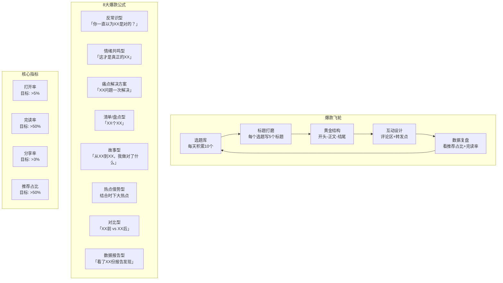
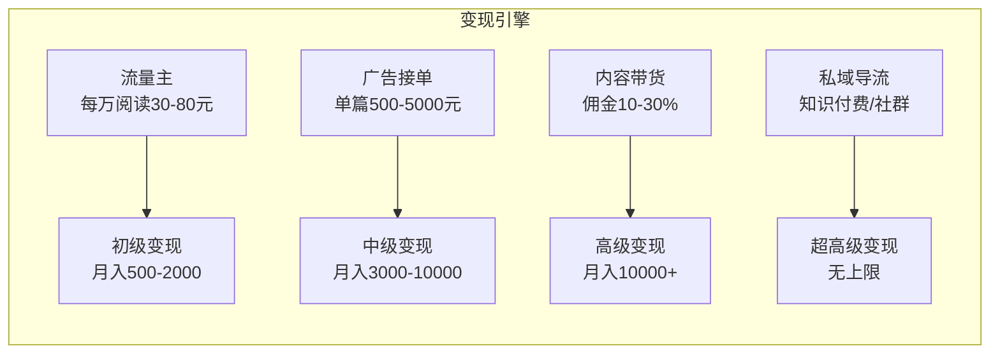

# 📕 Day16: 公众号爆款文章公式

> **核心：公众号爆款不是靠文笔，而是靠「选题命中率 × 标题点击率 × 结构完读率 × 互动裂变率」四个因子的乘积。10w+文章背后，是已经被反反复复验证过的8大爆款公式和一套可复用的流水线生产流程。**
> 来源：公众号头部号主拆解 + 10w+文章结构分析 + 新媒体写作经典方法论 + 微信算法逻辑反推

---

## 一、一句话总结

**公众号爆款文章公式 = 高共鸣选题（情感/认知/利益三锚点）→ 杀手级标题（4U原则/5大标题钩子）→ 黄金结构（开头3秒定生死+滑梯式推进+金句收尾）→ 互动裂变设计（评论区引导/转发诱饵/社交货币）。**

核心逻辑是：**公众号不是"写文章"，是"做产品"——标题是包装，内容是产品力，转发是裂变引擎。一篇10w+ = 30%选题功力 + 30%标题功力 + 30%结构功力 + 10%运气。前90%可以通过刻意练习掌握。**

> 💡 **关键认知**：公众号改版后，推荐流量已经占比40%+。这意味着即使你没有粉丝，只要文章质量够好，照样能被推荐到10w+。这完全改变了公众号的冷启动逻辑。

---

## 二、核心框架

### 2.1 爆款文章生产飞轮



### 2.2 核心概念：4X因子模型

```
10w+ = @选题 × @标题 × @内容 × @裂变

@选题 = 共鸣度 + 时效性 + 搜索量
@标题 = 好奇心 + 利益点 + 情绪值
@内容 = 开头吸引力 × 中间完读率 × 结尾转发力
@裂变 = 社交货币 + 身份认同 + 实用价值
```

**任何一个因子为0，整体就是0。** 选题再好，标题平平无奇→没人点；标题再吸睛，内容水→没人看完；内容再好，没有转发点→没有社交裂变。

---

## 三、可落地方法

### 3.1 选题：爆款选题的三个锚点

爆款选题必须至少击中以下一个锚点：

| 锚点 | 用户心理 | 示例标题 |
|:----:|---------|---------|
| 💰 **利益锚** | 看完有用 | 「这10个生活用品千万别买，全是智商税」 |
| ❤️ **情感锚** | 说到心里了 | 「30岁以后，我终于学会了说不」 |
| 🧠 **认知锚** | 颠覆认知 | 「央视辟谣：隔夜水真的能喝」 |

**选题来源清单：**
1. **微信搜一搜** → 搜索你的领域关键词 → 看"最多阅读"和"最新" → 记录高阅读文章标题
2. **看一看精选** → 你的领域相关文章 → 记录10w+文章的选题角度
3. **知乎热榜** → 同一个话题 → 看高赞回答 → 转换成公众号标题
4. **小红书搜索** → 搜索你的领域 → 看爆款笔记标题 → 改写成公众号标题
5. **抖音评论区** → 热门视频的评论区 → 找高赞评论 → 那可能就是选题
6. **朋友圈** → 朋友在转什么 → 为什么转发 → 提炼传播点

> **反生活专用选题池：** 微信搜一搜搜"辟谣""甲醛""智商税""致癌""你家还在用" → 每个关键词都能找到几十篇10w+文章 — 这就是你的选题数据库

### 3.2 标题：5大爆款标题公式

```
公式一：数字+利益点
「这5样厨房用品，致癌物超标10倍，赶紧扔！」

公式二：反常识+问句
「用了20年的洗发方式，竟然是错的？」

公式三：痛点+解决方案
「孩子反复咳嗽总不好，问题可能不在肺」

公式四：恐惧+身份标签
「30岁以后还在熬夜？你的肝在求救」

公式五：清单+悬念
「医生打死也不买的10种家电，你家有几样？」
```

**标题自检清单：**
- ✅ 读者会在3秒内知道"这文章跟我有什么关系"？
- ✅ 读者会产生"什么？真的假的？"的疑问？
- ✅ 标题里包含一个"情绪词"（震惊/后悔/庆幸/意外）？
- ✅ 去掉标题里的修饰词，核心信息还在吗？
- ✅ 这个标题发到朋友圈，别人会点开吗？

### 3.3 结构：黄金三步走

#### 开头（前200字决定生死）

```
【公式】场景代入 + 痛点共鸣 + 悬念勾子 + 利益承诺
```

**万能开头模板：**
```
你是不是也遇到过这样的问题：[场景描写]
每次遇到我都特别[情绪词]，直到有一天我发现...
今天这篇文章，希望能帮你[利益承诺]
```

**案例（反生活风格）：**
```
你家有没有这样的东西——买的时候觉得"真好用"，用一段时间感觉"不太对"，但又说不上来哪里不对？
我前两天刷到一个视频，看完直接把我整破防了...
今天这篇文章，我把市面上最常见的5个生活智商税扒了个底朝天。建议先收藏再看。
```

#### 中间（滑梯式推进，让人停不下来）

**五大推进结构：**

| 结构 | 适用场景 | 案例 |
|:----:|---------|------|
| **清单式** | 盘点/科普类 |「5个...」「10个...」 |
| **故事式** | 情感/经验类 |「我的发小确诊后，我做了3个决定」 |
| **对比式** | 辟谣/撕逼类 |「专家说的 vs 实际查证的」 |
| **层层递进** | 深度分析类 |「从现象→原因→解决方案」 |
| **反转结构** | 热门话题类 |「你以为A，其实B，最后发现C」 |

**避坑指南：**
- ❌ 一段不要超过300字（手机屏幕3屏）
- ❌ 不要写"首先其次再次"（太像工作报告）
- ✅ 每800字设置一个"钩子"（"看到这里你可能会问..."）
- ✅ 多用"你"而不是"大家"（对话感）
- ✅ 适当分段+加粗+emoji点缀（视觉节奏）

#### 结尾（决定转发量）

结尾的三大目标：**收藏、转发、关注**

**万能结尾模板：**
```
【总结金句】
[一句能让人记住的话]

【行动号召】
如果你觉得有用，转发给家人朋友
关注我，回复XX获取XX

【互动钩子】
评论区聊一聊：你有踩过类似的坑吗？
```

> 💡 **反生活结尾范本：** 
> "说句扎心的，这些坑90%的家庭都踩过。你家里有没有类似的东西？评论区说说，我帮你鉴别是不是智商税。
> 觉得有用的话，转发给家里那位——TA可能还在用呢😂"

---

## 四、变现路径

### 4.1 公众号变现4大引擎



### 4.2 各阶段收入预估

| 阶段 | 粉丝数 | 月阅读量 | 月收入预估 | 主要收入来源 |
|:----:|:-----:|:--------:|:---------:|:-----------|
| 冷启动 | <1000 | <1万 | 0-500元 | 流量主开通门槛500粉 |
| 起步期 | 1000-5000 | 1-5万 | 500-2000元 | 流量主+小广告 |
| 增长期 | 5000-2万 | 5-20万 | 2000-8000元 | 广告+带货 |
| 爆发期 | 2万-10万 | 20-100万 | 8000-3万 | 广告主约+带货+合作 |
| 头部 | 10万+ | 100万+ | 3-20万+ | 品牌+课程+社群+咨询 |

### 4.3 反生活公众号变现路径

```
第1-2个月（0-1000粉）
→ 开流量主（500粉门槛）
→ 月入：100-300元
→ 重点：内容积累，不急着变现

第3-6个月（1000-5000粉）
→ 流量主 + 小广告（小红书知识店铺/课程）
→ 月入：500-2000元
→ 重点：公众号反哺小红书，建立品牌

第6-12个月（5000-2万粉）
→ 广告主 + 带货（生活日用/家居好物/书）
→ 月入：3000-8000元
→ 重点：开辟第二收入曲线

12个月+（2万-10万粉）
→ 品牌合作 + 知识付费（辟谣课程/付费社群）
→ 月入：8000-3万
→ 重点：私域沉淀，更高价值转化
```

---

## 五、行动清单

### 🎯 今天就能做的3件事

**1. 建立你的"爆款选题库"**
- 打开微信→搜一搜 → 输入"辟谣""智商税""致癌""甲醛"等关键词
- 找到最近1个月阅读量最高的10篇文章
- 把它们的标题、选题角度、前200字开头复制到Notion/飞书文档
- ⏱ 耗时：30分钟

**2. 用"黄金三步法"改写一篇旧文**
- 找到反生活之前发过的一篇小红书的爆款笔记
- 用公众号的格式重新写一遍：①场景代入开头 ②清单式结构 ③金句+互动结尾
- 自测：标题能让自己想点开吗？开头能让自己想看完吗？
- ⏱ 耗时：1小时

**3. 完成一篇文章的标题测试**
- 从选题库里挑1个选题
- 用"5大标题公式"写5个不同的标题
- 发给3个朋友问：哪个标题你最想点开？
- 选票数最高的那个作为最终标题
- ⏱ 耗时：20分钟

---

## 六、关联笔记

- [[Day2-公众号运营与变现]] — 公众号基础玩法和变现模式
- [[Day13-小红书爆款复制方法论]] — 爆款拆解的底层逻辑（跨平台通用）
- [[Day3-抖音短视频运营]] — 抖音爆款逻辑与公众号的对比
- [[Day15-小红书矩阵号运营]] — 内容矩阵思维，同样适用于公众号多号运营
- [[文案训练手册-学习笔记]] — 文案写作底层技巧

---

> **记住：爆款 ≠ 靠运气。**
> 你看到的每一篇10w+，背后都有它必然的爆款基因。
> 找出这个基因，拆解它，复制它，你就掌握了公众号赚钱的密码。
> 
> **下一篇10w+，可能就是你写的。**
