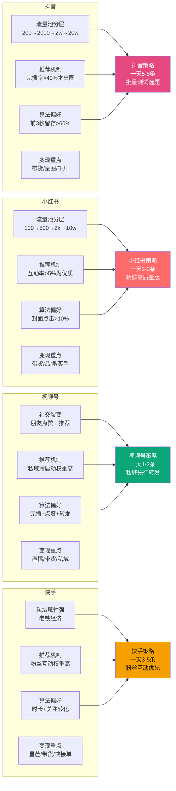
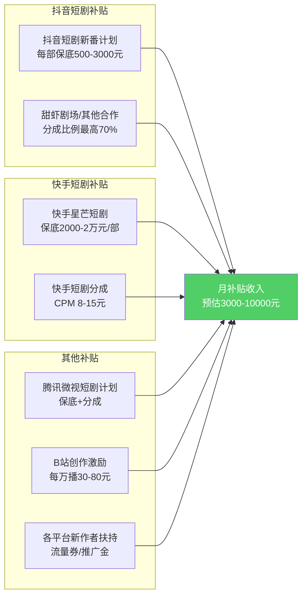

# Day17: AI短剧分发与变现

> 📅 学习日期：2026-07-07
> 🔗 关联笔记：[[00-目录]] | 上一篇：[[Day16-AI短剧制作全流程]] | 下一篇：[[Day18-多平台变现矩阵]]

---

## 1. 一句话总结

**AI短剧分发与变现 = 「多平台矩阵式分发（抖音×小红书×视频号×快手×B站）」+「五条变现路径（补贴×带货×商单×知识付费×私域）」+「数据驱动的内容迭代飞轮」——核心不是做一条爆款，而是建立「批量生产→多平台分发→数据反馈→选优迭代」的工业化流水线，让每集的边际成本趋近于零、边际收益持续放大。**

---

## 2. 核心框架

### 2.1 AI短剧分发变现全景图

```mermaid
graph TB
    A[AI短剧分发与变现] --> B[分发层<br/>多平台矩阵]
    A --> C[运营层<br/>增长飞轮]
    A --> D[变现层<br/>五条路径]
    A --> E[数据层<br/>决策引擎]
    A --> F[规模化层<br/>工业流水线]

    B --> B1[抖音<br/>最大池子<br/>流量天花板高]
    B --> B2[快手<br/>短剧原生平台<br/>星芒计划]
    B --> B3[小红书<br/>女性向+带货<br/>高转化]
    B --> B4[视频号<br/>私域反哺<br/>微信生态]
    B --> B5[B站<br/>中长尾内容<br/>高粘性]
    B --> B6[海外TikTok<br/>东南亚蓝海<br/>高CPM]

    C --> C1[日更节奏<br/>多账号矩阵]
    C --> C2[互动运营<br/>评论区引导]
    C --> C3[系列化连载<br/>追更粘性]
    C --> C4[跨平台联动<br/>互相导流]

    D --> D1[平台补贴<br/>播放量分成]
    D --> D2[带货佣金<br/>好物植入]
    D --> D3[品牌商单<br/>定制代工]
    D --> D4[知识付费<br/>卖制作教程]
    D --> D5[私域变现<br/>社群+复购]

    E --> E1[完播率分析<br/>黄金3秒测试]
    E --> E2[转化漏斗<br/>曝光→点击→转化]
    E --> E3[A/B测试<br/>同一内容不同版本]
    E --> E4[选题热榜<br/>实时捕捉热点]

    F --> F1[批量生产SOP<br/>3小时/集]
    F --> F2[模板化分镜<br/>场景复制]
    F --> F3[自动化工具链<br/>API批量处理]
    F --> F4[内容资产库<br/>复用率提升]

    style A fill:#7048e8,color:#fff
    style B fill:#4263eb,color:#fff
    style C fill:#0ca678,color:#fff
    style D fill:#f59f00,color:#000
    style E fill:#e64980,color:#fff
    style F fill:#845ef7,color:#fff
```



### 2.2 各平台分发策略深度对比



### 2.3 五大平台分发参数横向对比

| 维度 | 🎵 抖音 | 📕 小红书 | 📺 视频号 | 🎬 快手 | 🅱️ B站 |
|:----|:-------:|:--------:|:---------:|:-------:|:------:|
| **日活用户** | 8亿+ | 3亿+ | 5亿+ | 4亿+ | 1亿+ |
| **核心用户** | 全年龄段 | 一二线女性 | 三四线+中老年 | 下沉市场 | Z世代 |
| **内容时长** | 15-60秒最佳 | 30-90秒最佳 | 30-60秒最佳 | 30-90秒最佳 | 3-10分钟 |
| **推荐入口** | 推荐Feed | 发现页+搜索 | 朋友+推荐 | 发现+关注 | 首页+搜索 |
| **短剧扶持** | 短剧专项激励 | 无明确短剧计划 | 短剧频道 | 星芒短剧计划 | 无专项 |
| **带货成熟度** | ★★★★★ | ★★★★☆ | ★★★☆☆ | ★★★★☆ | ★★☆☆☆ |
| **对AI内容态度** | ⚠️ 需标注AI | ✅ 接受度较高 | ✅ 无限制 | ✅ 接受度高 | ⚠️ 需标注AI |
| **最佳发布时间** | 12:00/18:00/21:00 | 8:00/12:00/20:00 | 7:00/12:00/19:00 | 12:00/17:00/20:00 | 12:00/18:00/21:00 |
| **CPM广告收入** | 15-30元 | 20-40元 | 10-20元 | 10-25元 | 15-35元 |

### 2.4 AI短剧分发节奏策略

```
【反生活推荐】一天分发节奏：

晨间 7:00-8:00
  ├─ 视频号发布第1条（通勤流量高峰）
  └─ 抖音发布第1条（上班族通勤期）

午间 12:00-13:00
  ├─ 抖音发布第2条（午休流量高峰）
  └─ 小红书发布第1条（午间刷手机）

傍晚 17:00-18:00
  ├─ 抖音发布第3条（下班前流量）
  └─ 快手发布第1条（下班时间）

晚间 20:00-21:00
  ├─ 小红书发布第2条（晚间黄金时段）
  ├─ 抖音发布第4条（晚高峰）
  └─ 视频号发布第2条（晚间刷视频）

睡前 22:00-23:00
  └─ 抖音发布第5条（夜猫子流量）
```

---

## 3. 可落地方法

### 3.1 多平台分发标准操作流程

**【反生活可直接用】一集短剧如何同步发5个平台**

#### 第一步：内容二次编辑（30分钟/集）

不同平台对内容的要求不同，不能一刀切地「一键发布」。

```markdown
## 平台适配修改对照表

### 抖音版（15-60秒）
- 剪辑方式：保留最精彩段落，前3秒必高能
- 字幕：大号醒目（字号40-50），加关键词放大
- 封面：高对比度+大字标题（「结局太意外了！」）
- 配乐：热门BGM（抖音热歌榜TOP50）
- 结尾：引导关注+评论区留互动话题

### 小红书版（30-90秒）
- 剪辑方式：保留完整剧情，节奏稍缓
- 字幕：精致文艺（字号28-35），半透明
- 封面：干净美感+3-5字标题
- 配乐：轻柔BGM或原声
- 标题：必须写15-20字文案+关键词堆叠
- 标签：#AI短剧 #好物推荐 #剧情 等

### 视频号版（30-60秒）
- 剪辑方式：强社交属性，结尾加「转发给朋友看」
- 字幕：清晰大号（字号40），便于中老年观看
- 封面：暖色调家庭感
- 配乐：情感向BGM
- 文案：引导转发（「发给那个TA」「99%的人都猜错了」）

### 快手版（30-90秒）
- 剪辑方式：节奏更快，情绪更强烈
- 字幕：简洁醒目，字号35+
- 封面：强对比色+大表情/夸张标题
- 配乐：DJ版/快节奏
- 文案：口语化称呼（「老铁们」「姐妹们」）

### B站版（1-3分钟）
- 剪辑方式：保留完整剧情+幕后/彩蛋
- 字幕：正常尺寸（字号28），干净
- 封面：ACG风格/二次元感
- 配乐：根据B站热榜风格调整
- 文案：长篇文案+分P（可做系列合集）
```

#### 第二步：多账号矩阵管理

```bash
# 推荐的多账号管理方案

# 方案一：原生App + 手机分身（每台手机可同时操作2-3个账号）
# 适用：手机多的情况下最稳定
所需设备：3台二手iPhone/安卓 → 管理6-9个账号

# 方案二：浏览器多开 + 定时发布工具
# 适用：批量管理
工具：创作者后台自带的「定时发布」功能
      → 抖音：巨量百应/创作服务平台
      → 小红书：创作者中心
      → 视频号：视频号助手
      → 快手：创作者中心

# 方案三：第三方发布工具（付费）
# 适用：全面矩阵管理
推荐工具：蒲公英（微视）、新片场、快剪辑
核心功能：一键分发多平台、批量定时发布、数据看板
费用：200-500元/月
```

#### 第三步：跨平台差异化策略

同一个内容，在不同平台要有「不同包装」：

| 内容 | 抖音标题 | 小红书标题 | 视频号标题 |
|:----|:---------|:----------|:----------|
| 反转剧情 | 「最后一秒惊了！」 | 「这个反转我看了三遍」 | 「99%的人都猜错了结局」 |
| 好物推荐 | 「用了它同事以为我整容了」 | 「后悔没早知道的居家神器」 | 「这玩意儿媳妇儿用了直夸」 |
| 情感剧情 | 「看完想哭」 | 「原来爱是这样的」 | 「转给你在乎的那个人」 |
| 搞笑短剧 | 「笑到肚子疼」 | 「绝了，笑出腹肌」 | 「兄弟们都笑了」 |

### 3.2 数据驱动的选题优化

**【反生活可直接用】用数据迭代出爆款**

#### 数据监控看板

每次发布后24小时内监控以下指标：

```markdown
## 单集数据监控看板

| 指标 | 抖音达标基准 | 小红书达标基准 | 视频号达标基准 | 说明 |
|:----|:-----------:|:-------------:|:-------------:|:----|
| **完播率** | >30% | >25% | >35% | 低于此值→前3秒不够吸引 |
| **点赞率** | >3% | >5% | >2% | 低于此值→内容不够有价值 |
| **评论区** | >50条/万播 | >80条/万播 | >30条/万播 | 低于→引导话题不足 |
| **转发率** | >1% | >2% | >3% | 低于→社交传播性差 |
| **主页转化** | >0.5% | >0.8% | >0.3% | 低于→账号吸引力不足 |

#### 选题淘汰机制

```
┌──────────────┐    完播率<30%     ┌──────────┐
│  测试选题    │ ──────────────→ │  取消/改  │
│  (发3-5条)   │                  │  换方向   │
└──────┬───────┘                  └──────────┘
        │ 完播率>30%
        ↓
┌──────────────┐    互动率<5%     ┌────────────┐
│  选题验证    │ ──────────────→ │  优化包装  │
│  (发5-10条)  │                  │  改标题/封面 │
└──────┬───────┘                  └────────────┘
        │ 互动率>5%
        ↓
┌──────────────┐  单条播放<5万    ┌────────────┐
│  爆款测试    │ ──────────────→ │  加大投放  │
│  (发10-20条) │                  │  投DOU+/薯条 │
└──────┬───────┘                  └────────────┘
        │ 单条播放>5万
        ↓
┌──────────────┐
│  爆款复制    │ → 同类型批量生产
│  (批量放大)  │ → 换场景/换角色/换台词
└──────────────┘
```

> **选品+选题联合测试法：** 同一个产品，用3种不同剧情风格测试，每种发3条，看哪类剧情转化率最高，然后集中生产该方向。**反生活现在的SKU至少能测试15-20种剧情方向。**

### 3.3 系列化连载策略

AI短剧最适合的运营策略是 **「连续剧+独立爆款」双轨并行**：

#### 连续剧策略

```markdown
## AI短剧连载运营SOP

### 连载架构
- 一季：8-12集，每集60-90秒
- 更新节奏：每周3集（一三六或二四日）
- 每集结尾留「钩子」→ 引导追更
- 第1集免费→后期引导关注追更

### 追更设计技巧
1. 每集结尾文字：「下集更精彩，关注不迷路」
2. 评论区置顶：「想看第X集的扣1，过百明天加更」
3. 评论区抽奖：「评论剧情预测，抽送同款产品」
4. 下一集预告：在评论区发15秒下集预告

### 反生活适用连载题材
- 「职场小慧系列」：颈椎按摩仪×办公室场景（每集解决一种不适）
- 「改造逆袭系列」：从土到潮只用护眼仪/美容仪
- 「家庭婆媳系列」：窝囊老公买好物哄岳母
- 「穿越系列」：古代人穿越到现代，被养生好物震惊
```

#### 独立爆款策略

```markdown
## AI短剧独立爆款运营SOP

### 爆款结构
- 单集完整故事，60-120秒
- 强反转/强情绪/强共鸣
- 结尾高潮直接结束，不留悬念
- 植入产品作为「剧情关键道具」

### 选题来源
1. 抖音热点宝 → 实时捕捉热门梗
2. 小红书热搜 → 女性向话题
3. 微博热搜 → 社会热点
4. 知乎热榜 → 争议性话题
5. 朋友圈 → 身边真实共鸣
```

### 3.4 反生活专属AI短剧分发作战图

```mermaid
gantt
    title 反生活AI短剧周分发节奏
    dateFormat  HH:mm
    axisFormat  %H:%M
    
    section 周一 生产日
    批量生成素材(5集分镜)       :a1, 08:00, 120m
    AI视频生成(并行5集)          :a2, 10:00, 150m
    配音配乐混音                 :a3, 10:00, 90m
    剪辑合成(并行剪辑2集)       :a4, 12:30, 120m
    
    section 周二 发布日A
    抖音发布3条                 :b1, 08:00, 30m
    小红书发布2条               :b2, 12:00, 20m
    视频号发布1条               :b3, 19:00, 10m
    快手发布2条                 :b4, 17:00, 20m
    
    section 周三 发布日B
    抖音发布3条                 :c1, 08:00, 30m
    小红书发布2条               :c2, 12:00, 20m
    B站发布1条合集              :c3, 20:00, 15m
    
    section 周四 复盘日
    数据看板汇总(24h数据)       :d1, 10:00, 30m
    淘汰低效选题                 :d2, 10:30, 30m
    优化爆款方向                 :d3, 11:00, 60m
    
    section 周五 发布日C
    抖音发布4条(周末冲刺)       :e1, 08:00, 30m
    小红书发布2条               :e2, 12:00, 20m
    快手发布3条                 :e3, 17:00, 20m
    视频号发布2条               :e4, 19:00, 15m
```



---

## 4. 变现路径

### 4.1 五条变现路径详解

#### 路径一：平台补贴（稳定基本盘）



**核心技巧：** 同一个短剧系列，在多个平台同时申请补贴计划。只要质量过关，一部短剧可以拿到2-3个平台的双份补贴。

#### 路径二：带货佣金（核心收入）

AI短剧天然适合带货——剧情中使用产品比硬广转化率高3-5倍。

**反生活现有选品 × AI短剧创意矩阵：**

| 产品 | 创意切入点 | 剧情类型 | 预估转化率 | 单集收入（uv价值） |
|:----|:----------|:--------|:---------:|:---------------:|
| 颈椎按摩仪 | 白领加班颈椎疼→同事推荐→瞬间舒服 | 职场逆袭 | 5-8% | 200-600元 |
| 护眼仪 | 熬夜追剧/做图眼睛酸→护眼仪→天亮满血复活 | 生活技巧 | 4-7% | 150-500元 |
| 颈椎枕 | 失眠女主→换个枕头→秒睡 | 生活技巧 | 5-9% | 180-550元 |
| 智能暖宫宝 | 经期腹痛→男友送暖宫宝→感动 | 情感剧情 | 6-10% | 200-700元 |
| 护肤品/美容仪 | 黄脸婆→用产品→变美→老公看呆 | 逆袭/情感 | 5-8% | 300-800元 |
| 肩颈贴/膏药 | 长辈腰腿痛→儿女送膏贴→暖心 | 亲情/温暖 | 4-7% | 100-400元 |
| 助眠产品 | 失眠焦虑→助眠好物→睡到天亮 | 生活技巧 | 5-8% | 150-500元 |
| 养生壶/养生茶 | 办公室养生→同事都来蹭 | 职场日常 | 3-6% | 80-300元 |

> **核心公式：1条爆款带货AI短剧 → 5000-30000元佣金收入**

#### 路径三：品牌商单代工（高客单价）

当AI短剧能力被验证后，接品牌定制单：

| 服务档次 | 交付标准 | 定价 | 制作周期 | 利润 |
|:--------|:---------|:----:|:--------:|:----:|
| **基础包** | 5集AI短剧（60秒/集）+脚本+配音+字幕 | 8000-12000元 | 5天 | 5000-8000元 |
| **标准包** | 10集AI短剧（90秒/集）+分镜+配音+配乐+平台发布 | 15000-25000元 | 10天 | 10000-18000元 |
| **尊享包** | 20集AI短剧系列+角色IP设计+全平台分发+数据报告 | 30000-50000元 | 20天 | 20000-35000元 |

**目标客户：**
- 电商品牌方（颈椎按摩仪品牌、养生保健品等）
- 本地生活商家（美容院、养生馆、健身房）
- 知识付费博主（需要短剧引流到课程）
- MCN机构（外包制作需求）

**获客渠道：**
1. 在你的AI短剧号上留合作联系方式
2. 猪八戒/一品威客上接单
3. 主动私信品牌方的运营号
4. 在小红书发「AI短剧制作案例」引流

#### 路径四：知识付费（长尾收入）

把AI短剧制作方法论产品化：

```
课程产品线：

📕 《从0到1做AI短剧》电子书
   定价：49元
   内容：AI短剧全流程操作手册+20个可直接用的模板
   预估销量：200-1000份/月
   预估收入：10000-50000元/月

🎬 《AI短剧实操训练营》视频课程
   定价：299元
   内容：10节录播课+5个实战作业+社群答疑
   预估销量：100-500份/月
   预估收入：30000-150000元/月

🏆 《AI短剧陪跑私教班》
   定价：2999元
   内容：1对1指导+每周直播答疑+作品批改
   预估销量：20-50人/月
   预估收入：60000-150000元/月
```

#### 路径五：私域变现（复利增长）

AI短剧 → 引流到私域 → 社群运营 → 复购/高客单：

**私域引流路径：**
```
AI短剧（抖音/小红书/视频号）
   ↓ 评论区引导
关注主页 → 看到微信号/公众号
   ↓
加微信/进社群
   ↓
免费领取「AI短剧制作指南」/「反生活好物清单」
   ↓
社群日常运营（每日短剧推荐+好物分享）
   ↓
转化：社群团购/小程序/朋友圈
```

**私域变现方式：**
- 社群团购：每周固定团购日，佣金收入
- 朋友圈广告：每天1-3条AI短剧+好物推荐
- 会员体系：月卡99元/季卡249元/年卡899元
- 代理分销：让群友帮你分销，分润20-30%

### 4.2 收入预估模型

| 阶段 | 时间 | 日更量 | 账号数 | 月收入范围 | 主要收入来源 |
|:----:|:----:|:-----:|:------:|:---------:|:-----------|
| 🟢 试探期 | 第1-2周 | 3-5条 | 1-2个 | 0-1000元 | 平台补贴 |
| 🟡 起量期 | 第3-6周 | 8-10条 | 3-5个 | 5000-15000元 | 补贴+带货 |
| 🟠 爆发期 | 第7-12周 | 15-20条 | 5-10个 | 15000-50000元 | 带货+品牌商单 |
| 🔴 成熟期 | 第13周+ | 20-30条 | 10-20个 | 50000-200000+元 | 带货+商单+课程+私域 |

### 4.3 反生活专属变现路线图

```
【反生活2026下半年AI短剧变现路线】

7月（打基础）
  ├─ 跑通3个平台（抖音+小红书+视频号）
  ├─ 生产20集AI短剧（5个产品×4种风格）
  ├─ 建立基础数据分析习惯
  └─ 目标：月入3000-5000元

8月（冲量期）
  ├─ 5个账号矩阵（2×抖音+2×小红书+1×视频号）
  ├─ 找到2-3个爆款风格方向
  ├─ 开始接第一单品牌代工
  └─ 目标：月入15000-30000元

9月（扩张期）
  ├─ 10个账号矩阵运营
  ├─ 日更20条+的工业化生产
  ├─ 上线AI短剧制作课程
  └─ 目标：月入30000-80000元

Q4（稳定期）
  ├─ 建立团队（2-3人文案+剪辑助理）
  ├─ 品牌代工搭建稳定渠道
  ├─ 私域社群1000+人
  └─ 目标：月入50000-150000元
```

---

## 5. 行动清单

### ✅ 行动①：今天注册并开通3个平台的创作者中心

**操作步骤：**

1. **抖音创作者服务平台**
   ```bash
   网址：creator.douyin.com
   注册流程：
   1. 用已有抖音号登录
   2. 完善创作者信息（领域选「短剧」或「好物推荐」）
   3. 开通「橱窗带货」功能（实名认证+1000粉或企业号）
   4. 绑定商品橱窗→精选联盟→选择对应产品挂载
   ```

2. **小红书创作者中心**
   ```bash
   网址：creator.xiaohongshu.com
   注册流程：
   1. 用已有小红书号登录
   2. 申请「视频号」身份（需要≥500粉或发布≥10条视频）
   3. 开通「商品笔记」功能（实名认证）
   4. 绑定小红书店铺或选品中心
   ```

3. **视频号创作者助手**
   ```bash
   入口：微信→发现→视频号→右上角小人→创作者中心
   操作：
   1. 实名认证
   2. 开通「带货」功能
   3. 绑定小商店或第三方平台
   ```

### ✅ 行动②：批量生产5条不同风格AI短剧做A/B测试

**操作步骤：**

1. **从反生活现有选品中挑3个产品**（建议：颈椎按摩仪、护眼仪、暖宫宝）
2. **为每个产品写2种剧情脚本**（比如：办公室逆袭型×家庭温情型）
3. **用Day15/Day16的方法制作3-5条样片**
4. **同一时间发布到抖音，测试哪个风格完播率最高**
5. **选出最佳风格，下个生产周期集中产出**

> **参考：** [[Day15-AI短剧脚本创作]] 中的爆款公式 + [[Day16-AI短剧制作全流程]] 中的SOP

### ✅ 行动③：搭建AI短剧数据监控看板

**操作步骤：**

1. **创建数据汇总表格：**

```bash
# 用飞书/Notion/Excel 创建以下表格
路径：~/Desktop/Projects/h-social.github.io/docs/06-学习笔记/assets/数据监控模板.md
```

2. **表格字段（每次发布后30分钟填写）：**

```markdown
## AI短剧数据监控看板（模板）

| 日期 | 平台 | 剧名 | 类型 | 播放 | 完播率 | 点赞 | 评论 | 收藏 | 转发 | 带货点击 | 成交 | 收入 |
|:----:|:----:|:----:|:----:|:----:|:-----:|:----:|:----:|:----:|:----:|:-------:|:----:|:----:|
| 07-07 | 抖音 | 职场小慧01 | 按摩仪 | 个 | % | 个 | 个 | 个 | 个 | 个 | 单 | 元 |
```

3. **数据查看入口：**
   - 抖音：创作者服务平台 → 数据概览 → 作品数据
   - 小红书：创作者中心 → 数据中心 → 笔记分析
   - 视频号：视频号助手 → 数据中心 → 视频数据

4. **每周复盘重点：**
   - 哪个平台的完播率最高 → 重点投入
   - 哪种剧情类型的互动率最高 → 批量生产
   - 哪个产品的转化率最高 → 加大选品采购
   - 哪个标题/封面点击率最高 → 形成标题库

---

> 📌 **总结：AI短剧的分发核心是「批量化生产+多平台矩阵+数据驱动迭代」。不做爆款赌博者，做工业化生产者。**
>
> 📌 **一句话送给老黄：每天发10条AI短剧，不如每天认真分析10条数据。真正赚到钱的不是做得最快的人，而是数据闭环跑得最快的人。**
