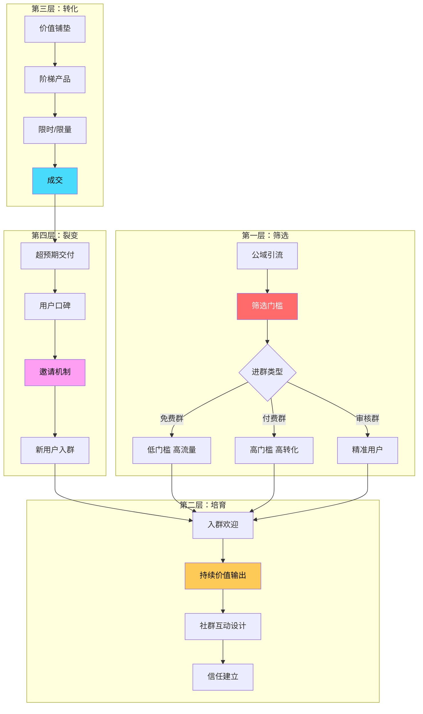
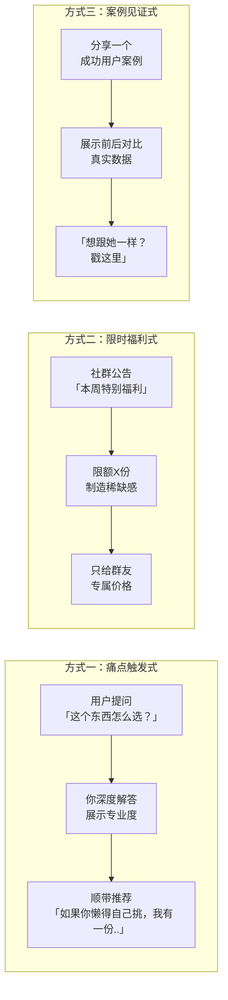
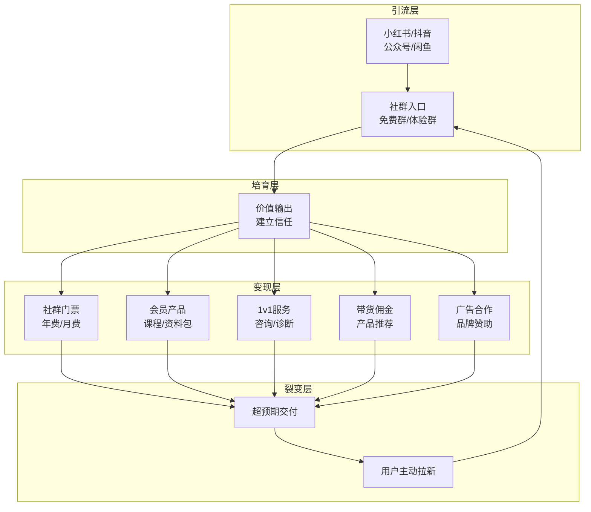

# 📕 Day17: 私域社群运营

> **核心：私域社群不是「拉个群发广告」，而是一套「筛选→培育→转化→复购→裂变」的自动化系统。一个运营得当的社群，用户LTV（生命周期价值）是公域流量的10-50倍。社群运营的本质不是「管理群」，而是「经营人际关系」。**
> 来源：私域运营经典方法论 + 社群SOP拆解 + 头部社群案例研究 + 微信生态实战经验

---

## 一、一句话总结

**私域社群运营 = 精准筛选进群门槛 × 价值内容持续输出 × 社群温度陪伴感 × 阶梯式转化设计 × 用户自发裂变机制。核心逻辑不是「把货卖给更多人」，而是「让一群人因为信任你而持续购买 + 帮你拉新」。**

> 💡 **关键认知转变**：社群不是你的「免费广告群」——如果用户进群后感受到的只有广告和促销，这个群3天内就会变成「死群」。真正的社群价值在于：**让用户感觉到「这个群让我赚到了/学到了/认识了值得的人」，然后自然而然地愿意付费支持你。**

私域社群相比公域（小红书/抖音/公众号）的三大不可替代优势：
1. **触达免费**：不用被平台抽成，不用买流量，一条群公告就能触达所有人
2. **关系更深**：社群里的互动是双向的，用户不只是「粉丝」，是「圈友」
3. **抗风险**：平台可以封号、限流、降权，但社群在微信里，谁也拿不走

---

## 二、核心框架

### 2.1 社群运营全景模型



### 2.2 社群生命周期管理：5个阶段

```
阶段1：冷启动（第1-7天）
├── 目标：让用户觉得「进对群了」
├── 关键动作：高密度价值输出 + 破冰互动
├── 核心指标：入群3日内活跃率 > 60%
└── 风险：前3天没动静 → 群永久沉寂

阶段2：活跃期（第8-30天）
├── 目标：形成社群自身的内容节奏
├── 关键动作：固定栏目（早安/晚课/每周分享）
├── 核心指标：周活跃率 > 30%
└── 风险：不固定节奏 → 用户失去期待感

阶段3：转化期（第31-60天）
├── 目标：开始变现，但不伤害社群体验
├── 关键动作：限时福利/会员专享/阶梯产品
├── 核心指标：转化率 > 5%
└── 风险：过早/过于频繁推销 → 用户流失

阶段4：复购期（第61天+）
├── 目标：提高LTV，让用户持续付费
├── 关键动作：会员体系 + 专属权益 + 个性化服务
├── 核心指标：复购率 > 30%
└── 风险：没有新价值 → 用户审美疲劳

阶段5：裂变期（贯穿始终）
├── 目标：用户主动拉人进群
├── 关键动作：邀请奖励 + 阶梯福利 + 用户见证
├── 核心指标：裂变系数 > 1.2（每1人带来1.2个新人）
└── 风险：裂变门槛太低 → 群质量下降
```

### 2.3 社群运营的「1334」法则

```
1个核心：价值先行，成交在后
  └── 先给用户10倍于门票的价值，再考虑收钱

3个角色：群主 + 活跃分子 + 围观群众
  ├── 群主（你）：内容输出者 + 氛围营造者 + 秩序维护者
  ├── 活跃分子（核心用户）：帮你互动、回答新人问题
  └── 围观群众（大多数）：潜水看内容，偶尔参与

3个阶段：拉新 → 促活 → 转化
  ├── 拉新靠钩子（干货/资料/课程）
  ├── 促活靠节奏（固定栏目/互动活动）
  └── 转化靠信任（价值铺垫够多再开口）

4个维度：内容 × 互动 × 服务 × 仪式感
  ├── 内容：干货分享 + 案例分析 + 资源推荐
  ├── 互动：问答 + 投票 + 打卡 + 话题讨论
  ├── 服务：答疑 + 1v1咨询 + 资源对接
  └── 仪式感：入群欢迎 + 每周总结 + 专属福利日
```

---

## 三、可落地方法

### 3.1 从0到1建群：3种社群模式选择

#### 模式A：免费干货群（最快起量）
| 维度 | 说明 |
|:----:|------|
| **进群门槛** | 关注公众号/加了微信即可 |
| **群人数** | 目标200-500人 |
| **变现逻辑** | 群内提供持续干货 → 建立起专业信任 → 推付费产品 |
| **适合** | 冷启动阶段、反生活类内容账号 |
| **优势** | 进群无压力，引流速度快 |
| **劣势** | 用户质量参差，转化需要较长的培育周期 |

**操作示例（反生活版）：**
```
进群海报文案：
「🚫 你家这些东西可能正在伤害你！
我把市面上常见的100个生活智商税整理成了清单
进群免费领《家庭避坑指南》PDF」

进群后第1周内容节奏：
Day 1：发PDF + 自我介绍 + 群规
Day 2：分享一个最常见的「生活谣言」（配图）
Day 3：提问互动「你家里有什么让你怀疑的东西？」
Day 4：深度揭秘一个行业黑幕
Day 5：周末福利——免费帮鉴定3个产品
Day 6：群里精选问答整理
Day 7：下周预告 + 邀请朋友
```

#### 模式B：付费社群（高价值高转化）
| 维度 | 说明 |
|:----:|------|
| **进群门槛** | 付费入群（9.9-99元起步） |
| **群人数** | 目标50-200人 |
| **变现逻辑** | 门票收入 + 群内会员产品 + 1v1服务 |
| **适合** | 已有一定粉丝基础、有明确专业领域 |
| **劣势** | 起量慢，需要持续高价值输出 |

**定价策略：**
- **体验价 9.9-19.9元**：门槛极低，用来筛出「愿意付费的用户」
- **入门价 49-99元**：月卡/季卡，包含固定内容+答疑
- **年费价 399-999元**：年卡，包含所有权益+1v1咨询
- **阶梯涨价**：每满50人涨价一次，制造紧迫感

#### 模式C：审核制社群（最精准）
| 维度 | 说明 |
|:----:|------|
| **进群门槛** | 填写表格 + 回答几个筛选问题 |
| **群人数** | 目标100-300人 |
| **变现逻辑** | 质量高→口碑好→自传播→自然转化 |
| **适合** | 细分领域、精准用户群体 |

### 3.2 社群内容SOP（标准运营流程）

#### 每日节奏模板

```
🌅 08:00 早安分享
内容：一条行业干货/认知升级/今日话题
示例：「早安！今天聊一个话题：为什么99%的除甲醛方法都是智商税？
原因其实很简单…（200字干货）
你怎么看？评论区说说👇」

☀️ 12:00 午间互动
内容：问答/投票/晒图
示例：「午饭时间，做了一个小投票：
你家买过哪种『买完就后悔』的家电？
A. 面包机  B. 跑步机  C. 酸奶机  D. 其他」
→ 投票结果在晚上总结公布

🌙 20:00 晚间深度
内容：干货长文/案例拆解/避坑指南（500-800字）
示例：「深度揭秘：市面上爆火的『空气净化器』到底有没有用？
我花了一周时间研究+实测，结论可能跟你想的不一样…」
→ 最后加一句引导：「觉得有用点个赞，让更多人看到」

🎁 不定期福利
内容：限时资料/专属优惠/抽奖
示例：「感谢大家这一周的陪伴，我整理了一份《家庭必备避坑清单》
评论区回复『想要』，免费发你」
```

#### 每周节奏模板

```
周一：行业干货（专业知识输出）
周二：案例分析（拆解一个真实案例）
周三：话题讨论（互动+收集用户需求）
周四：答疑专场（自由提问+你回答）
周五：周末福利（资料包/优惠/抽奖）
周六：用户分享（邀请用户分享经验）
周日：一周总结（精华汇总+下周预告）
```

### 3.3 社群转化设计：不招人烦的成交节奏

**黄金比例：90%价值 + 10%营销**

500人的群，每周最多推1-2次产品。其余时间全部是价值输出。

#### 转化前必须完成的3个铺垫

1. **价值铺垫**：至少连续输出7天高质量内容，让用户觉得「这个群主真有两把刷子」
2. **信任铺垫**：至少回答20个以上用户的问题，展示你的专业和真诚
3. **需求铺垫**：通过互动收集用户痛点，对症下药推产品

#### 3种温和转化方式



**反生活社群转化话术示例：**
```
💡 很多朋友私信问我：「XX产品到底能不能买？」
说实话，我测了十几款，真正靠谱的不到3款。
我整理了一份《10大热门生活用品实测红黑榜》
——哪些该买、哪些千万别碰，全在里面了。
💰 这份资料单独买要29.9元
🎁 作为群友福利，今天限量20份，免费领
👉 回复「红黑榜」即可获取
⬆️ 仅限今天，明天恢复原价
```

### 3.4 社群防死群：6个保活技巧

| 技巧 | 操作 | 效果 |
|:----:|------|:----:|
| **固定时间** | 每天同一时间发内容 | 养成用户期待感 |
| **制造期待** | 「明晚8点，我要分享一个重磅内容」 | 提升打开率 |
| **@关键用户** | 点名活跃用户参与互动 | 给核心用户存在感 |
| **红包互动** | 不定时发红包，抢到的人回答一个问题 | 低成本激活 |
| **精华沉淀** | 每周把群聊精华整理成文档 | 让新用户看到价值 |
| **王炸内容** | 每周一个「付费级」干货 | 让用户觉得「这个群太值了」 |

### 3.5 社群用户分层运营

不要把500人的群当500个人管——用户天然分三类：

| 用户类型 | 占比 | 特征 | 运营策略 |
|:--------:|:----:|------|:--------:|
| **KOL型** | 5-10% | 高频互动、主动分享、有影响力 | 私聊维护、给特权、邀请当管理员 |
| **参与型** | 20-30% | 偶尔说话、参与活动、点赞 | 点名互动、给专属福利 |
| **潜水型** | 60-70% | 从不说话、只看内容 | 价值驱动，用干货打动他们 |

**核心策略：服务好KOL型用户，带动参与型用户，用价值内容打动潜水型用户。**

---

## 四、变现路径

### 4.1 私域社群变现全景图



### 4.2 各阶段收入模型

| 阶段 | 群规模 | 变现模式 | 月收入预估 |
|:----:|:------:|:--------:|:---------:|
| 冷启动 | 免费群100-300人 | 暂无变现，积累信任 | 0元 |
| 培育期 | 免费群300-1000人 | 资料包/低客单价课程（9.9-49元） | 500-3000元 |
| 转化期 | 付费群50-200人 | 社群年费（99-399元）+ 中客单价产品 | 3000-15000元 |
| 成熟期 | 付费群200-500人 + 多群 | 年费+高阶课程+1v1+品牌合作 | 1万-5万+ |

### 4.3 反生活社群变现路线图

```
第1-2个月：积累期（免费群）
├── 目标群规模：200人
├── 引流方式：小红书/公众号/抖音 → 加微信 → 拉群
├── 内容策略：每天输出生活避坑干货
├── 变现：0元（全投入建立信任）
└── 关键动作：收集用户需求，为后续产品做准备

第3-4个月：验证期（付费体验群）
├── 目标群规模：付费体验群50人
├── 收费：9.9元/月（门槛极低，筛选意愿付费用户）
├── 权益：每日干货 + 每周答疑 + 专属资料
├── 月收入：约500元（50人×9.9元）
└── 关键动作：打磨内容质量，收集用户反馈

第5-6个月：增长期（正式付费社群）
├── 目标群规模：年费会员100人
├── 收费：199元/年
├── 权益：每日干货 + 每周答疑 + 产品红黑榜 + 专属优惠
├── 月收入：约3300元（100人×199元÷6个月平均）
└── 关键动作：开始裂变，老会员邀请新会员给分成

第7-12个月：爆发期（多收入矩阵）
├── 社群年费：300人×199元 = 约5.97万/年（月均约5000元）
├── 高阶课程：「家庭避坑指南」课程 199元 × 50人/月 = 约1万/月
├── 1v1咨询：199元/次 × 20次/月 = 约4000元/月
├── 带货佣金：推荐靠谱产品 × 佣金10-20% = 约2000元/月
├── 品牌合作：家居/母婴品牌投放 = 约3000-5000元/月
├── 总计月收入：约2.4万-3.1万/月
└── 年收入预估：28万-37万/年
```

### 4.4 收入结构健康度评价

```
优秀社群收入结构（健康）：
├── 复购收入（年费续费）：40% ← 你的基本盘
├── 增量收入（新会员+课程）：30% ← 增长的引擎
├── 增值收入（1v1+咨询）：20% ← 高利润
└── 外部收入（品牌合作+带货）：10% ← 锦上添花

危险社群收入结构（不健康）：
├── 广告收入：80% ← 平台政策一改就完
├── 无续费：0% ← 用户买完就走
└── 无裂变：0% ← 全靠自己引流
```

> ⚠️ **关键认知**：社群的终极目标不是「做大群」，而是「做深关系」。一个500人的高活跃付费群，比5000人的死群值钱10倍。不要追求数量，追求质量。

---

## 五、行动清单

### 🎯 今天就能做的3件事

**1. 设计你的「社群引流诱饵」**
- 从反生活已有内容中，选一个你最拿手的领域（比如「常见生活智商税」/「甲醛避坑」/「产品红黑榜」）
- 制作一份高价值PDF/资料包（至少10页，内容要干货满满）
- 写一句引流文案：「进群免费领《XXX避坑指南》」
- 把这份资料作为加微信+拉群的「诱饵」
- ⏱ 耗时：1-2小时

**2. 写一份「社群7天内容排期表」**
- 打开飞书/Notion，新建一个表格
- 横轴：Day1-Day7
- 纵轴：早安内容 / 午间互动 / 晚间深度 / 福利
- 把每一天要发的内容标题和核心观点写进去
- 要求：每天至少让用户获得1个「值回票价」的信息
- ⏱ 耗时：45分钟

**3. 找到你的「前10个种子用户」**
- 打开你的微信，翻一遍通讯录
- 找出10个最有可能进群的人（关注你、经常互动、对你的领域感兴趣）
- 私聊：「最近我在做一个《XXX》社群，每天分享XXX干货，免费进群体验7天，感兴趣吗？」
- 如果这10个人都不感兴趣 → 说明你的社群定位需要调整
- 如果反应热烈 → 恭喜，你已经验证了社群需求
- ⏱ 耗时：30分钟

### 🎯 本周能做的3件事

**4. 建立社群素材库**
- 飞书文档建3个文件夹：① 每日干货模板 ② 互动话题库（至少30个）③ 转化话术库
- 每天往里面填充5条，一周就有100+条内容素材
- 有了素材库，你每天运营社群只需要10分钟

**5. 设计社群SOP手册**
- 一份社群运营标准操作流程文档
- 包含：入群欢迎语 / 每日发什么 / 每周发什么 / 用户常见问题回复模板
- 这个SOP未来可以复制给矩阵号的社群运营

**6. 设计「阶梯产品」体系**
- 入门级：免费资料包（引流品）
- 进阶级：付费社群（利润品）
- 高客单：1v1咨询服务（高端品）
- 三个产品形成递进关系，让用户自然而然地升级消费

---

## 六、关联笔记

- [[Day14-私域引流转化]] — 私域引流的「撒钩子」方法论，是社群的上游
- [[Day15-小红书矩阵号运营]] — 矩阵号流量可以集中导入同一个社群
- [[Day12-小红书投放与投流]] — 付费流量如何导入社群
- [[Day2-公众号运营与变现]] — 公众号也是社群引流的重要渠道
- [[Day5-知识付费变现模型]] — 社群本身就是知识付费的一种形态
- [[Day16-公众号爆款文章公式]] — 社群内容同样可以复用公众号的爆款逻辑

---

> **记住：社群不是一个「群」，是一家「微型公司」。**
> 
> 你需要做的是：
> 1. 做好产品（内容价值）
> 2. 管好团队（KOL型用户）
> 3. 服务好客户（所有群友）
> 4. 收好钱（变现转化）
> 5. 做好增长（用户裂变）
>
> 当你把社群当成一家公司来运营的时候，你的收入天花板就不是「卖货赚差价」，而是「建立资产，持续分红」。
>
> **反生活的第一个社群，就从今天开始酝酿吧！**
