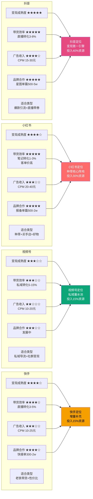

# Day18: 多平台变现矩阵

> 📅 学习日期：2026-07-08
> 🔗 关联笔记：[[00-目录]] | 上一篇：[[Day17-AI短剧分发与变现]] | 下一篇：[[Day19-用户心理与行为设计]]

---

## 1. 一句话总结

**多平台变现矩阵 = 「5大平台×4种变现模式的网格化布局」+「两条腿走路（平台广告收入+自有电商带货）」+「分层运营策略（内容层→流量层→转化层→复购层）」——核心不是在一个平台上赚最多的钱，而是让每个平台的流量都流向能产生最高LTV的转化路径，形成「内容引流 × 平台变现 × 私域沉淀」的三角飞轮。**

---

## 2. 核心框架

### 2.1 多平台变现矩阵全景图

```mermaid
graph TB
    A[多平台变现矩阵] --> B[变现模式层<br/>4种赚钱方式]
    A --> C[平台布局层<br/>5大平台分工]
    A --> D[运营决策层<br/>利润驱动]
    A --> E[流量流转层<br/>漏斗设计]
    A --> F[数据度量层<br/>关键指标]

    B --> B1[广告收入<br/>平台补贴+流量分成<br/>稳定基本盘]
    B --> B2[电商带货<br/>直播+橱窗+笔记<br/>核心收入]
    B --> B3[知识付费<br/>课程+咨询+社群<br/>高毛利]
    B --> B4[品牌合作<br/>商单+定制+代言<br/>高客单价]

    C --> C1[抖音<br/>主攻带货+直播<br/>最强变现引擎]
    C --> C2[小红书<br/>主攻种草+买手<br/>最高转化率平台]
    C --> C3[视频号<br/>主攻私域导流<br/>最低获客成本]
    C --> C4[快手<br/>主攻下沉市场<br/>最稳老铁带货]
    C --> C5[B站/公众号<br/>主攻长尾内容<br/>高粘性粉丝池]

    D --> D1[利润公式<br/>收入-成本-时间<br/>做减法:砍掉低效平台]
    D --> D2[取舍原则<br/>80%资源投20%高ROI平台<br/>剩余20%做探索]
    D --> D3[阶段策略<br/>起步期做加法<br/>成熟期做减法]

    E --> E1[公域引流<br/>内容爆款获取新用户]
    E --> E2[私域沉淀<br/>微信体系养长期关系]
    E --> E3[复购转化<br/>社群+朋友圈+私聊]
    E --> E4[裂变传播<br/>老带新降低获客成本]

    F --> F1[GMV<br/>总成交额]
    F --> F2[转化率<br/>流量→成交效率]
    F --> F3[客单价<br/>单次交易金额]
    F --> F4[复购率<br/>客户生命周期]
    F --> F5[获客成本CAC<br/>获取一个客户的成本]

    style A fill:#e64980,color:#fff
    style B fill:#4263eb,color:#fff
    style C fill:#0ca678,color:#fff
    style D fill:#f59f00,color:#000
    style E fill:#7048e8,color:#fff
    style F fill:#e8590c,color:#fff
```



### 2.2 平台变现能力横向对比



### 2.3 变现矩阵的流量流转逻辑

单平台变现的天花板是有限的——抖音再强，老黄的粉丝也就那么多。**真正的多平台变现矩阵，是把A平台的流量引导到B平台做转化，再沉淀到C平台做复购。**

```
                      ┌─────────────────┐
                      │  公域内容生产    │
                      │  (抖音/小红书/    │
                      │   视频号/快手)   │
                      └────────┬────────┘
                               │ 爆款内容带来自然流量
                               ↓
            ┌──────────────────┼──────────────────┐
            ↓                  ↓                  ↓
    ┌───────────────┐  ┌───────────────┐  ┌───────────────┐
    │  抖音变现池    │  │ 小红书变现池   │  │ 视频号变现池   │
    │               │  │               │  │               │
    │ 直播带货      │  │ 商品笔记      │  │ 直播带货       │
    │ 橱窗/精选联盟  │  │ 买手店        │  │ 小商店         │
    │ 星图商单      │  │ 品牌合作      │  │ 视频号带货     │
    └───────┬───────┘  └───────┬───────┘  └───────┬───────┘
            │                  │                  │
            │       ┌──────────┴──────────┐       │
            └──────→   私域沉淀池(微信)    ←──────┘
                     │                    │
                     │  社群 × 朋友圈    │
                     │  × 公众号 × 私聊  │
                     └────────┬──────────┘
                              │ 最高LTV路径
                              ↓
                     ┌──────────────────┐
                     │   复购转化闭环    │
                     │                  │
                     │ 社群团购(周)     │
                     │ 限时秒杀(月)     │
                     │ 会员体系(年)     │
                     │ 裂变拉新(持续)   │
                     └──────────────────┘
```

> 💡 **核心洞察：公域赚的是「流量钱」（一次性），私域赚的是「关系钱」（复购×终身价值）。多平台变现矩阵 = 用多个公域平台持续获取新客，引流到私域做高复购。**

---

## 3. 可落地方法

### 3.1 抖音变现矩阵搭建（主战场）

**【反生活可直接用】抖音变现三板斧**

#### 板斧一：短视频带货（最低门槛）

这是老黄最容易上手的——不需要开直播，不需要真人出镜，直接发挂车视频。

```markdown
## 抖音短视频带货操作SOP

### 第一步：开通橱窗（预计30分钟）
- 条件：实名认证 + 1000粉丝（或企业号无需粉丝）
- 路径：抖音App → 我 → 右上角三横 → 创作者中心 → 商品橱窗
- 注意：如果粉丝不够，先发企业号认证（600元/年，省去粉丝门槛）

### 第二步：选品上架（预计20分钟）
- 路径：创作者中心 → 商品橱窗 → 选品广场/精选联盟
- 反生活的好物类型直接搜索品类名找佣金高的品
- 优先选：佣金≥20% + 好评率≥95% + 价格适中(30-200元)

### 第三步：发挂车视频
- 发视频时勾选「添加商品」
- 视频内容直接关联产品使用场景
- 【关键】评论区首条置顶：「点左下角看同款👆」
```

#### 板斧二：抖音直播带货（进阶）

```markdown
## 抖音直播带货入门SOP

### 最低配置方案
- 设备：1台手机（后置摄像头清晰即可）
- 场景：家里/办公室整洁一角
- 时间：避开大主播时段，选早7-9点或晚22-0点
- 时长：每次至少1小时

### 反生活适合的直播形式
1. **好物测评型**：拿产品边用边讲感受（护眼仪、按摩仪实测）
   - 话术：「老铁们看这个力度，真的超舒服」
   - 痛点刺中：「你是不是也颈椎酸痛？来，试试这个」
   
2. **答疑解惑型**：回答用户关于养生/好物的提问
   - 话术：「姐妹们，久坐导致的颈椎问题怎么缓解？」
   - 互动：「觉得颈椎不舒服的扣1」
   
3. **福利秒杀型**：限时折扣促单
   - 话术：「今天直播间前10名下单送XX」
   - 节奏：每15分钟1个秒杀品

### 直播流量获取
- 开播前发1条短视频预热（挂直播预约）
- 开播后持续发短视频引流直播间
- 投「直播加热」DOU+（每场100-500元测试）
```

#### 板斧三：千川投流（进阶+）

> ⚠️ 建议直播稳定出单后再开千川，先不要烧钱

```markdown
## 千川投流入门
- 最低预算：300元/天起（新手建议100元/天测试）
- 目标人群：25-45岁女性、养生/家居/美妆兴趣标签
- 出价方式：控成本投放（OCPM）
- 预期ROI：1:2~1:5（每花100元至少赚200元）
```

### 3.2 小红书变现矩阵搭建（种草高地）

**【反生活可直接用】小红书变现三板斧**

#### 板斧一：商品笔记（基础盘）

```markdown
## 小红书商品笔记操作SOP

### 开通商品笔记
- 路径：小红书App → 我 → 左上角三横 → 创作中心 → 商品合作
- 条件：实名认证（个人号即可）
- 选品方式：小红书选品中心/蒲公英平台

### 笔记爆款公式
标题：痛点场景 + 产品名称 + 效果承诺（15-20字）
  示例：「办公党福音！这款颈椎按摩仪我逢人安利」
  示例：「熬夜党的后悔药，护眼仪用了一周效果惊艳」

正文结构：
  开头（1-2句）：制造共鸣场景
  「你是不是也每天对着电脑8小时，脖子酸到不行？」
  
  中间（3-5段）：产品使用体验 + 真实感受
  「入手了这款XX按摩仪，用了3天的感受——」
  「第一，力度刚刚好，不会太疼也不会没感觉」
  「第二，续航很给力，充一次电用一周」
  
  结尾（1-2句）：总结 + 行动引导
  「总之，颈椎不好的姐妹真的可以试试」
  「链接在左下角，现在还有优惠」
  
图片/视频要求：
  - 封面：干净质感，产品+使用场景
  - 3-6张图片：产品外观/使用过程/对比效果
  - 视频：15-30秒使用展示

### 发布时间：8:00/12:00/20:00
### 发布频率：每天1-2篇（稳定更新才有流量）
```

#### 板斧二：买手合作（进阶）

```markdown
## 小红书买手合作
- 性质：品牌方通过平台邀请你合作推广他们的产品
- 门槛：粉丝≥1000 + 持续发优质内容
- 收入：单篇报价500-5000元（取决于粉丝数和互动率）
- 反生活优势：你的好物内容天然适合买手合作
```

### 3.3 视频号+私域联动变现

**【反生活可直接用】视频号——私域的最强引流管道**

```markdown
## 视频号+私域联动变现SOP

### 第一步：视频号日常运营
- 每天发1条（同步抖音内容，略作调整）
- 标题语气：更温暖、更接地气
  - 「这玩意儿媳妇儿用了直夸好」
  - 「老黄亲测，这东西值不值你们自己看」
- 重点在评论区引导加微信
  - 置顶评论：「想知道在哪里买？加我微信XXX」
  - 或者：「回复'好物清单'，我私发给你」

### 第二步：微信群沉淀
- 视频号 → 公众号/企微 → 拉群
- 群名：「老黄的好物推荐群」
- 群规：每天最多发3条推荐，禁止广告
- 群活动：每周五晚8点限时团购

### 第三步：朋友圈与私聊转化
- 每天2-3条朋友圈，不要刷屏
  - 早8点：早安+好物小知识
  - 中午12点：好物推荐（配视频号视频）
  - 晚9点：买家秀/客户反馈
- 私聊：不主动推销，回复咨询时自然推荐
```

### 3.4 各平台变现资源配置表

| 平台 | 建议投入精力 | 变现模式 | 新人月收入预估 | 半年后月收入预估 | 建议每周产量 |
|:----:|:----------:|:--------:|:-------------:|:--------------:|:----------:|
| **抖音** | 40% | 带货+直播+星图 | 500-3000元 | 5000-30000元 | 7-14条视频+2场直播 |
| **小红书** | 30% | 商品笔记+买手 | 200-2000元 | 3000-15000元 | 7-10篇笔记 |
| **视频号** | 15% | 带货+私域导流 | 100-1000元 | 2000-8000元 | 5-7条视频 |
| **快手** | 15% | 带货+快接单 | 100-1000元 | 2000-8000元 | 5-7条视频 |
| **公众号/B站** | 可选 | 广告+知识付费 | 0-500元 | 1000-5000元 | 2-3篇文章 |

### 3.5 反生活专属「一句话变现策略」

> **对反生活来说，最优配置 = 抖音（40%）做爆款带货 + 小红书（30%）做好物种草 + 视频号（15%）导流私域 + 快手（15%）做增量补充**

| 产品类型 | 首选平台 | 次选平台 | 变现形式 | 价格区间 |
|:--------|:--------:|:--------:|:--------|:--------:|
| 颈椎按摩仪 | 抖音直播 | 小红书笔记 | 直播演示+剧情带货 | 79-199元 |
| 护眼仪 | 小红书笔记 | 抖音短视频 | 使用教程+素人推荐 | 69-169元 |
| 颈椎枕/睡眠枕 | 视频号私域 | 抖音短视频 | 社群团购+体验分享 | 49-129元 |
| 暖宫宝/养生好物 | 小红书笔记 | 抖音直播 | 女性向内容+情感切入 | 39-99元 |
| 护肤/美容器 | 抖音直播 | 小红书笔记 | 直播间演示+素人变化 | 99-399元 |
| 肩颈贴/膏药 | 抖音短视频 | 快手 | 长辈痛点+孝心经济 | 29-79元 |

---

## 4. 变现路径

### 4.1 四层变现模式详解

#### 模式一：广告收入（保底收入） ★★★★☆

**平台给的"基本工资"，不需要你卖任何东西。**

| 平台 | 补贴/分成形式 | 预估收入 | 门槛 |
|:----|:-------------|:--------:|:----:|
| 抖音 | 中视频计划/创作者激励 | 500-3000元/月 | 1万播放/条 |
| 小红书 | 视频号流量分成 | 200-2000元/月 | 持续更新 |
| 视频号 | 创作者分成计划 | 100-1000元/月 | 1000粉 |
| 快手 | 创作激励 | 200-1500元/月 | 持续更新 |
| B站 | 创作激励 | 100-800元/月 | 1000粉 |

**总收入预估：1000-8000元/月（纯平台补贴，不含任何带货）**

> 收入靠补贴养不活自己，但这是「底线收入」——即使带货做得不好，每天发内容至少能赚到饭钱。

#### 模式二：电商带货（核心收入） ★★★★★

**这就是反生活的主战场——好物种草+佣金变现。这才是真正的赚钱路径。**

| 模式 | 收入计算 | 反生活月收入预估 | 适合阶段 |
|:----|:---------|:--------------:|:--------:|
| 抖音橱窗带货 | 佣金20-50% × 月成交额 | 3000-30000元 | 入门必做 |
| 抖音直播带货 | 佣金20-50% × 直播成交额 | 5000-50000元 | 进阶 |
| 小红书商品笔记 | 佣金20-30% × 笔记成交额 | 2000-15000元 | 入门必做 |
| 视频号带货 | 佣金15-30% × 成交额 | 1000-8000元 | 稳定期 |
| 快手带货 | 佣金20-40% × 成交额 | 2000-10000元 | 增量 |

**总收入预估：10000-100000+元/月（核心收入来源）**

#### 模式三：知识付费（高毛利） ★★★★☆

**把你会的东西打包卖出去。适合粉丝破万后开始。**

| 产品 | 定价 | 内容 | 月销估计 | 月收入 |
|:----|:----:|:-----|:--------:|:-----:|
| 《好物选品从0到1》电子书 | 29元 | 选品方法论+供应商清单 | 100-500份 | 3000-15000元 |
| 《自媒体变现实操手册》 | 49元 | 6大平台变现SOP | 50-300份 | 2500-15000元 |
| 好物带货训练营 | 299元 | 录播课+社群+作业批改 | 30-100人 | 9000-30000元 |
| 1对1咨询 | 499元/小时 | 诊断账号+定制方案 | 10-30单/月 | 5000-15000元 |

**总收入预估：20000-75000元/月（慢慢积累，是长尾收入）**

#### 模式四：品牌合作（高客单价） ★★★☆☆

**品牌方找你做推广。需要账号有一定粉丝量（3000-1万粉）后才能接到。**

| 合作类型 | 报价参考 | 客户类型 | 接单频率 |
|:--------|:--------:|:--------|:--------:|
| 抖音星图单篇 | 500-5000元 | 家居/养生品牌 | 1-3单/月 |
| 小红书报备笔记 | 500-3000元 | 美妆/好物品牌 | 1-3单/月 |
| 品牌短片代制 | 1000-5000元/条 | 电商品牌 | 2-5单/月 |
| 产品置换（换品不换钱） | 免费产品 | 新品牌 | 3-10单/月 |

**总收入预估：2000-20000元/月（账号成熟后稳定收入）**

### 4.2 变现矩阵收入模型

| 阶段 | 月收入 | 收入构成 | 主要动作 |
|:----:|:-----:|:---------|:---------|
| **🟢 破冰期** | 0-3000元 | 平台补贴70%+偶尔带货30% | 每天发文，跑通各平台 |
| （第1-4周） | | | 重点：先发100条内容 |
| **🟡 起量期** | 3000-15000元 | 带货60%+补贴30%+品牌10% | 开直播，加橱窗 |
| （第5-12周） | | | 重点：找到爆款方向 |
| **🟠 爆发期** | 15000-50000元 | 带货50%+直播30%+品牌15%+课程5% | 矩阵号运营 |
| （第3-6月） | | | 重点：批量复制爆款 |
| **🔴 成熟期** | 50000-150000+元 | 带货40%+直播20%+品牌20%+课程15%+私域5% | 私域沉淀+品牌溢价 |
| （第7-12月） | | | 重点：建立品牌认知 |

### 4.3 【反生活可直接用】推荐变现组合

基于反生活的产品类型（好物推荐/养生好物），推荐按以下顺序渐进：

```markdown
## 反生活变现路线图

### 第1个月：打基础
- ✅ 抖音：开通橱窗，日更1条挂车视频
- ✅ 小红书：日更1条商品笔记
- ✅ 视频号：日更1条同步内容
- ✅ 快手：日更1条（可选）
- 目标：月入1000-3000元（平台补贴+偶尔带货）

### 第2个月：找感觉
- ✅ 抖音：日更2条，每周开2场直播
- ✅ 小红书：日更2篇，加入选品中心
- ✅ 视频号：评论区引导加私域
- ✅ 找到1-2个爆款方向
- 目标：月入5000-15000元

### 第3个月：复制放大
- ✅ 抖音：日更3条+2场直播，矩阵号起步
- ✅ 小红书：日更2-3篇，开买手合作
- ✅ 视频号：私域群运营启动
- ✅ 快手：正式运营
- 目标：月入15000-40000元

### 第4-6个月：全面开花
- ✅ 各平台矩阵号运营（2-3个号）
- ✅ 直播常态化（每周4-6场）
- ✅ 私域群500+人
- ✅ 考虑上线知识付费产品
- 目标：月入40000-80000元
```

---

## 5. 行动清单

### ✅ 行动①：今天开通抖音+小红书+视频号的带货功能（2小时完成）

**操作步骤：**

1. **抖音开通橱窗**
   - 打开抖音 → 我 → 右上角三横 → 创作者中心 → 商品橱窗
   - 按提示完成实名认证
   - 进入「选品广场」搜索「颈椎按摩仪」「护眼仪」等，把反生活现有好物加入橱窗

2. **小红书开通商品笔记**
   - 打开小红书 → 我 → 左上角三横 → 创作中心 → 商品合作
   - 按提示完成实名认证
   - 搜索相关品类，添加感兴趣的产品到选品库

3. **视频号开通带货**
   - 微信 → 发现 → 视频号 → 右上角小人 → 创作者中心 → 带货
   - 绑定微信小商店或第三方选品平台

**产出：** 三大平台的带货功能开通截图/确认

### ✅ 行动②：在抖音发布第1条挂车视频+小红书发第1篇商品笔记（3小时完成）

**操作步骤：**

1. **选题**：选反生活最好卖的一个产品（推荐：颈椎按摩仪）
2. **写脚本**（30分钟）
   - 15秒短视频：展示使用场景+痛点+效果
   - 「你是不是也每天对着电脑脖子酸？试试这个——」
3. **拍摄/剪辑**（1小时）
   - 用手机拍产品使用过程
   - 剪映剪辑：15-30秒，加字幕+BGM
4. **发布**（30分钟）
   - 抖音发挂车视频：标题+@抖音小助手+#好物推荐
   - 小红书发商品笔记：标题+正文+标签+挂商品链接

**产出：** 抖音1条挂车视频 + 小红书1篇商品笔记

### ✅ 行动③：制作「反生活各平台内容排期表」（1小时完成）

**操作步骤：**

1. **创建表格**（建议用飞书/Notion/Excel）

```markdown
## 反生活多平台内容排期表（模板）

| 周次 | 周一 | 周二 | 周三 | 周四 | 周五 | 周六 | 周日 |
|:----:|:----:|:----:|:----:|:----:|:----:|:----:|:----:|
| **抖音** | 视频1 | 视频2 | 视频3 | 视频4 | 视频5 | 视频6 | 视频7 |
| | | | | | 直播 | | 直播 |
| **小红书** | 笔记1 | 笔记2 | 笔记3 | | 笔记4 | 笔记5 | |
| **视频号** | | 视频1 | | 视频2 | | 视频3 | |
| **快手** | 视频1 | | 视频2 | | 视频3 | | |
```

2. **产品分配**：按每周7天分配不同产品（如周一按摩仪、周二护眼仪、周三暖宫宝……）

3. **内容类型分配**：
   - 周一三五六：产品使用场景展示
   - 周二四：用户评价/买家秀
   - 周日：综合推荐/合集

**产出：** 下周完整的内容排期表

---

> 📌 **总结：多平台变现矩阵的核心不是做更多内容，而是让每一份内容发挥最大商业价值。做10条不赚钱的内容，不如做1条挂车+种草+导流都做到位的爆款。**
>
> 📌 **一句话送给老黄：别想着一天赚10000元，先做到每条内容至少赚10块钱。当你能稳定做到后者的100倍时，前者自然就实现了。**
