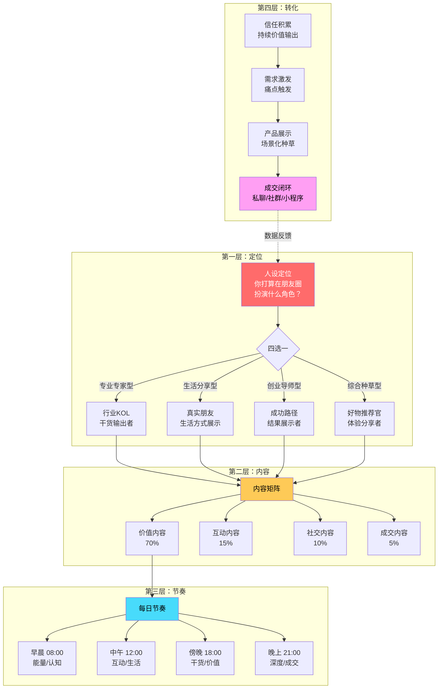
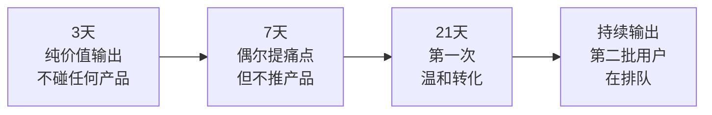
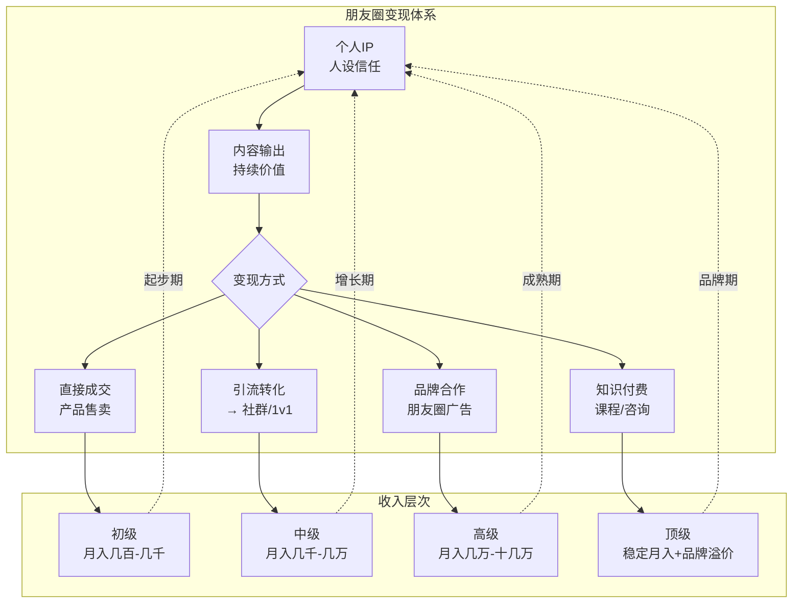

# 📕 Day18: 朋友圈营销

> **核心：朋友圈不是「广告墙」，是你最好的「个人电视台」。每天刷朋友圈的人，比你想象的更关注你。一个经营得当的朋友圈 = 一个24小时不打烊的展示柜台 + 一条随时可触达的深度信任通道。朋友圈转化的核心不是「发广告」，而是「用内容构建人设，用人设驱动成交」。**
> 来源：微信私域成交体系 + 朋友圈营销经典方法论 + 头部微商/知识IP朋友圈拆解 + 朋友圈成交心理学

---

## 一、一句话总结

**朋友圈营销 = 人设定位 × 内容节奏 × 信任阶梯 × 成交设计 × 数据迭代。不是「发得越多卖得越多」，而是「每条内容都在为信任账户存钱，偶尔取一次钱进行变现」。**

反生活账号做朋友圈有天生的优势——辟谣类内容的「专业感」和「利他感」，天然适合朋友圈这种半熟人社交场景。

> 💡 **核心认知转变**：发朋友圈不是在「打扰」别人，而是在「筛选」人。你发的每条内容都在筛选同频的人，让对的人留下来、不喜欢的人离开——这反而是好事，因为朋友圈的商业价值不在于人多，而在于「留下来的都是精准用户」。

朋友圈和[[Day17-私域社群运营]]的关系：
- **朋友圈 = 一对多广播**（你发声，所有人听）—— 覆盖面广，但互动深度有限
- **社群 = 双向互动场**（一群人一起交流）—— 互动深，但运营成本高
- **最佳组合**：朋友圈拉新 → 社群沉淀 → 朋友圈+社群联合转化

---

## 二、核心框架

### 2.1 朋友圈营销全景模型



### 2.2 朋友圈的「3331」内容法则

```
3分干货：让用户觉得「关注你很有价值」
├── 行业洞察（对反生活来说是「生活真相/辟谣」）
├── 实用技巧（「3秒鉴别XX好坏」）
├── 深度思考（对某个现象的独特见解）
└── 目的：建立「专业」标签，用户有相关问题第一个想到你

3分生活：让用户觉得「你是个真实的人」
├── 日常生活（吃饭/运动/出行）
├── 个人感悟（不装逼的真实感受）
├── 工作花絮（做内容/拍视频的幕后）
└── 目的：拉近距离，建立「喜欢」的标签

3分互动：让用户参与进来
├── 提问式（「你觉得呢？评论区说说」）
├── 投票式（「A还是B？帮我选」）
├── 福利式（「评论区抽3个人送XXX」）
└── 目的：提升互动率，点赞评论越多→权重越高→被更多人看到

1分成交：精准设计转化
├── 产品展示（场景化说明，不要硬广）
├── 用户反馈（真实聊天截图/买家秀）
├── 限时优惠（制造紧迫感）
└── 目的：把信任转化成收入
```

> ⚠️ **黄金比例不是死规定**：日常保持这个比例，但到了促销日（618/双11/你的大促），成交内容可以临时提升到30-40%，活动结束后恢复。

### 2.3 朋友圈人设定位——反生活优先选「专业专家型」

反生活账号天然适合这个定位。你不需要假装专家，因为你每天都在做「辟谣」和「揭秘」——这本身就是专家行为。

**人设核心标签：**
```
🔖 主标签：「生活真相调查员」
└── 用户认知：「这个人揭露生活智商税，专业靠谱」

🔖 副标签1：「踩坑经验分享者」
└── 用户认知：「他也犯过错，更真实可信」

🔖 副标签2：「实用好物推荐官」
└── 用户认知：「他推荐的东西我敢买」
```

**人设不崩的3个原则：**
1. **言行一致**：朋友圈说的和视频/笔记里说的要一致，不要割裂
2. **始终如一**：不要今天装专家、明天发搞怪，保持稳定调性
3. **适度展露弱点**：偶尔暴露自己的不足（比如某次产品选错了），反而更真实可信

---

## 三、可落地方法

### 3.1 反生活朋友圈内容生产线

#### 每日4条内容模板

| 时间段 | 类型 | 内容方向 | 示例（反生活版） |
|:------:|:----:|:---------|:----------------|
| **08:00 早安** | 认知/能量 | 一条生活真相/认知升级（100-200字） | 「早安！很多人问：无糖饮料真的健康吗？答案可能让你意外…（后附干货）」 |
| **12:00 午间** | 互动/生活 | 提问/投票/生活碎片 | 「午饭时间闲聊：你家老人最让你头疼的「养生谣言」是什么？👇」 |
| **18:00 干货** | 价值输出 | 深度辟谣/产品揭秘（200-300字 + 配图） | 「号称99%除菌的XX洗衣液，实际效果到底如何？我测了…」 |
| **21:00 晚间** | 成交/深度 | 产品推荐/用户反馈/限时福利 | 「上个月推荐的那个XX产品，今天品牌方给了专属优惠，仅限朋友圈…」 |

#### 每周内容排期表

```mermaid
graph LR
    subgraph "周一：开局"
        A1[早安<br/>本周主题预告] --> A2[午间<br/>话题投票] --> A3[干货<br/>行业深度] --> A4[晚间<br/>产品种草]
    end
    subgraph "周二：价值"
        B1[早安<br/>认知金句] --> B2[午间<br/>生活碎片] --> B3[干货<br/>避坑指南] --> B4[晚间<br/>用户反馈截图]
    end
    subgraph "周三：互动"
        C1[早安<br/>观点分享] --> C2[午间<br/>提问互动] --> C3[干货<br/>案例拆解] --> C4[晚间<br/>福利预告]
    end
    subgraph "周四：深度"
        D1[早安<br/>思维模型] --> D2[午间<br/>幕后花絮] --> D3[干货<br/>深度揭秘] --> D4[晚间<br/>限时优惠]
    end
    subgraph "周五：转化"
        E1[早安<br/>周末预告] --> E2[午间<br/>话题讨论] --> E3[干货<br/>本周精华] --> E4[晚间<br/>周末福利]
    end
    subgraph "周末：轻松"
        F1[早安<br/>轻松话题] --> F2[午间<br/>生活分享] --> F3[周末<br/>好书/好物] --> F4[晚间<br/>下周预告]
    end
```



### 3.2 朋友圈内容创作的「四有原则」

每条内容发之前，问自己4个问题（至少满足2个才能发）：

| 原则 | 说明 | 反生活例子 |
|:----:|------|:----------:|
| **有用** | 用户看完有收获 | 「这3种常见食品添加剂，其实无害反而有益」 |
| **有趣** | 用户看完会心一笑 | 「今天是实验翻车现场：某某网红清洁剂，我试了，结果…」 |
| **有情绪** | 用户看完有共鸣 | 「每次看到亲戚在群里转发养生谣言，我就…（懂的都懂）」 |
| **有悬念** | 用户想看后续 | 「明天我要曝光一个行业内幕，99%的人都不知道」 |

> 反面教材：不要发「今天天气真好」（无价值）、「新到的货，要的私聊」（硬广感太强）、「转发这条锦鲤」（破坏人设）

### 3.3 朋友圈成交话术体系

#### 转化前必须完成的「3-7-21」铺垫



**3天原则**：加好友后的前3天，只发干货，不发任何广告。让用户第一时间看到你的价值。

**7天铺垫**：通过7-14天的朋友圈持续输出，建立「这个人在XX领域是专家」的认知。

**21天转化**：至少21天后，才进行第一次成交。这时候你的信任账户已经有余额可以取了。

#### 4种朋友圈成交文案模板

**模板1：痛点激发型（最基础也最有效）**

```
你有没有遇到过这种情况：
买了一个号称「XXX」的产品，结果屁用没有？
前几天我又踩坑了，具体是…
（附上深度分析）
其实要解决这个问题，关键不在于买什么，而在于…
（引出你的解决方案/产品）
```

**模板2：用户见证型（利用社会认同）**

```
昨天一位粉丝私信我：
「老师，按你说的试了一下，真的不一样！」
（附上聊天截图）
其实不是我厉害，是这个方法本身就有效
（引出产品/服务）
想了解的私我，还剩5个名额
```

**模板3：限时限量型（制造紧迫感）**

```
⏰ 仅限今晚12点前
本来不想发这个的，但品牌方说只给到今晚
（产品介绍 + 原来价格）
现在朋友圈专属价：XXX
（附购买链接/二维码）
仅限20份，抢完恢复原价
```

**模板4：故事引入型（软植入，转化率最高）**

```
前几天回老家，看到我妈又在…
（讲一个和父母的日常故事）
我突然意识到：原来我们这一代人，和父母最大的代沟在这里…
（引申到你的领域/产品/服务）
我做了一个东西，专门解决这个问题…
（最后才带到产品）
```

### 3.4 朋友圈运营的「4要4不要」

| ✅ 要做的 | ❌ 不要做的 |
|:----------|:------------|
| **要有固定时间**：每天固定时段发文，养成用户习惯 | **不要刷屏**：一天超过5条会被屏蔽，连续发也是大忌 |
| **要有互动感**：评论区回复每条留言，点赞用户朋友圈 | **不要只发广告**：朋友圈不是宣传单，是个人生活场 |
| **要有点赞评论**：主动点赞好友内容，先付出再索取 | **不要做群发狗**：群发广告是最快被拉黑的方式 |
| **要有真人感**：偶尔发语音条/视频/直播预告 | **不要装逼过度**：朋友圈不是完美人设展览馆 |

### 3.5 朋友圈「分层可见」技巧

不是所有内容都需要所有人都看到：

| 标签 | 人群 | 可见内容 |
|:----:|:----:|:---------|
| **A组：潜在客户** | 加了好友但没互动过的人 | 主要看干货+生活+少量产品 |
| **B组：意向客户** | 咨询过/在群里互动过的人 | 全量内容（包括深度成交） |
| **C组：付费客户** | 已经付过钱的用户 | 所有内容+会员专属福利 |
| **D组：同行/无关** | 同行/不感兴趣的人 | 仅展示生活+干货，屏蔽成交内容 |

> **操作路径**：微信→通讯录→标签→新建标签 → 发朋友圈时点击「谁可以看」选择标签

---

## 四、变现路径

### 4.1 朋友圈变现全景图



### 4.2 反生活朋友圈收入模型

| 阶段 | 好友数 | 每日条数 | 转化策略 | 月收入预估 |
|:----:|:------:|:--------:|:---------|:----------:|
| **冷启动** | 200-500人 | 2-3条/天 | 纯价值输出，不卖货 | 0元 |
| **培育期** | 500-1000人 | 3-4条/天 | 开始温和种草，偶尔推品 | 500-3000元 |
| **转化期** | 1000-3000人 | 4-5条/天 | 固定成交节奏，每周2-3次推品 | 3000-1万 |
| **成熟期** | 3000-5000人 | 5条/天 | 多产品线+品牌合作 | 1万-5万 |

### 4.3 反生活朋友圈的5条变现路径

**路径1：好物推荐（带货佣金）**
```
操作：朋友圈推荐生活/家居/健康类产品 → 挂返佣链接或自建链接
收入：每单佣金10-30%，月推20款产品×卖出50单×平均佣金30元 = 3000元
门槛：需要有稳定的朋友圈流量和信任基础
```

**路径2：自营产品**
```
操作：基于反生活人设，打造自有品牌产品
示例：推荐「家庭安全检测工具包」/ 「生活避坑产品套装」
收入：利润率50-70%，月卖100套×50元利润 = 5000元
门槛：需要找供应链/代工厂
```

**路径3：知识付费（课程/咨询）**
```
操作：朋友圈引流 → 社群/1v1 → 付费课程/咨询
示例：「7天生活避坑训练营」99元 × 月招30人 = 2970元
      「1v1产品诊断」199元/次 × 月20次 = 3980元
门槛：需要系统化输出课程内容
```

**路径4：品牌合作（朋友圈广告）**
```
操作：品牌方付费 → 你在朋友圈发布产品体验/推荐
价格：500好友约500-1000元/条，1000好友约1000-3000元/条
门槛：需要一定好友量和朋友圈互动率
```

**路径5：多级漏斗（最高利润组合）**
```
朋友圈 → 免费社群 → 付费社群 → 高价咨询/课程

每条朋友圈都在为这个漏斗服务：
├── 30%的内容用于吸引新用户关注
├── 30%的内容用于把关注者引流到免费社群
├── 30%的内容用于塑造价值促进付费转化
└── 10%的内容用于高客单价产品的成交
```

### 4.4 朋友圈成交数据关键指标

| 指标 | 健康范围 | 计算公式 | 说明 |
|:----:|:--------:|:---------|:----|
| **点赞率** | >3% | 点赞数 ÷ 好友数 | 内容受欢迎程度 |
| **评论率** | >0.5% | 评论数 ÷ 好友数 | 互动深度 |
| **私信转化率** | >1% | 主动私信人数 ÷ 好友数 | 强意向比例 |
| **成交转化率** | >0.3% | 成交人数 ÷ 好友数 | 直接变现效率 |
| **屏蔽率** | <1%/月 | 每月被屏蔽人数 ÷ 好友数 | 内容质量 |

> 💡 **数据迭代方法**：每周统计一次朋友圈数据，哪个类型的内容互动率最高 → 下周就多发这个类型。不要自己猜用户喜欢什么，让数据告诉你。

---

## 五、行动清单

### 🎯 今天就能做的3件事

**1. 设计你的朋友圈「3天开胃菜」**
- 打开手机备忘录，写下3条你的「首发朋友圈」
- 要求：展示专业度（让我知道你是谁）+ 利他性（让我觉得有用）+ 有互动引导（让我想评论）
- 示例：👇 反生活可直接用的3条
  ```
  Day1：「报个身份：我是XXX，专注做生活真相揭秘一年了，帮100+家庭避过坑。
  以后每天早上分享一条生活冷知识，保证你刷到我至少能省一笔钱 📉」
  
  Day2：「刚看到一个数据，惊呆了：市面上一半的「竹炭包除甲醛」是智商税。
  想知道为什么？评论区扣1，我单独跟你说 👇」
  
  Day3：「昨晚做梦都在想选题，突然想到一个问题：
  你家有没有买过那种「买完就后悔」的生活小家电？
  评论区说说，点赞最高的我下期专门讲 🤝」
  ```
- ⏱ 耗时：30分钟

**2. 给你的微信好友打标签**
- 打开微信 → 通讯录 → 标签 → 新建标签
- 至少打上这3个标签：① 「潜在客户」（至少50人）② 「活跃粉丝」（点赞过你的人）③ 「付费用户」（买过你东西的人）
- 每条朋友圈发布时，选择对应的可见范围
- ⏱ 耗时：20分钟

**3. 发一条「有钩子的朋友圈」**
- 今天就用上面的模板，发一条你能写的、最值得发的内容
- 必须包含一个「钩子」：引导用户评论/点赞/私信
- 反生活可直接用的钩子示例：
  ```
  🔥 说个事：我整理了《2024年10大生活智商税清单》
  评论区扣「我要」免费发你
  仅限今天私信我的前30个人 👇
  
  #生活避坑 #智商税 #反生活
  ```
- ⏱ 耗时：10分钟

### 🎯 本周能做的3件事

**4. 建立朋友圈素材库**
- 在飞书文档建1个「朋友圈素材库」
- 分4个文件夹：① 早安认知库（30条）② 干货内容库（30条）③ 互动话题库（20条）④ 成交文案库（10条）
- 每天花15分钟往里面填3条，一周日发4条完全不愁

**5. 朋友圈「3天-7天-21天」转化SOP**
- 给新加好友设计一个3天自动触达的内容序列
- Day1-3只发干货（建立信任）
- Day4-7开始展示产品（但不推、只展示）
- Day8+开始尝试第一次成交
- 把这个SOP写进你的私域运营手册

**6. 分析你朋友圈的「高互动时刻」**
- 翻看你最近一周的朋友圈
- 找出互动率最高的3条 → 分析共同点
- 找出互动率最低的3条 → 分析问题
- 用这个结论优化你下周的内容策略

---

## 六、关联笔记

- [[Day14-私域引流转化]] — 朋友圈是私域引流的「接收端」，公域来的用户首先要看你的朋友圈
- [[Day17-私域社群运营]] — 朋友圈和社群是私域的两大核心阵地，朋友圈做广播，社群做深度
- [[Day15-小红书矩阵号运营]] — 矩阵号的流量最终都要导入到朋友圈和社群
- [[Day5-知识付费变现模型]] — 朋友圈是知识付费产品的核心展示和成交渠道
- [[Day16-公众号爆款文章公式]] — 朋友圈的短内容同样可以复用文章的爆款逻辑
- [[Day13-小红书爆款复制方法论]] — 找到朋友圈的「爆款内容」→ 拆解 → 复制 → 迭代

---

> **记住：朋友圈不是广告牌，是你最好的「个人电视台」。**
>
> 在反生活这个赛道上，你的朋友圈优势太明显了：
> 1. **内容天生有价值**：生活辟谣信息，每条都有用
> 2. **人设天然可信**：揭秘者身份，比营销号可信10倍
> 3. **转化自然顺滑**：揭秘 → 推荐好物 → 成交，逻辑通顺
> 4. **内容库无限大**：一个辟谣话题可以拆成10条朋友圈
>
> **今天就开始运营你的朋友圈。不需要等到「准备充分」，现在发第一条，明天发第二条，一周后你就会发现：原来「最赚钱的渠道」一直躺在你的微信里。**
