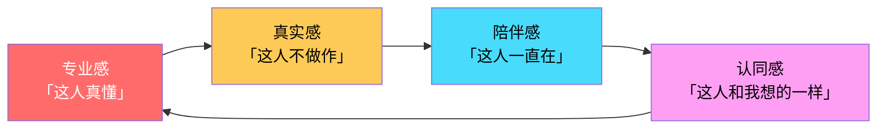
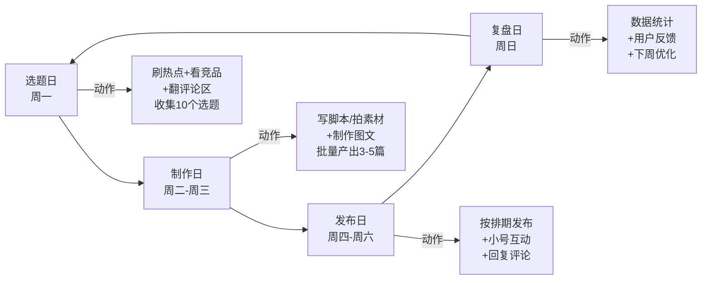
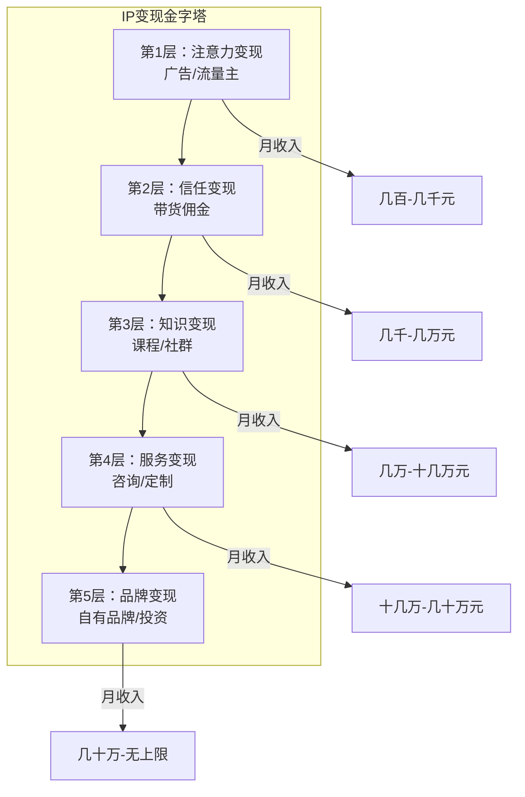

# 📕 Day19: 个人IP打造

> **核心：个人IP不是「当网红」，而是「成为一个在特定领域被持续信任的人」。在信息过载的时代，用户不缺内容，缺的是「值得信任的声音」。一个成功的IP = 清晰的定位 × 差异化的内容 × 真实的信任 × 闭环的变现。IP是你所有自媒体业务的「底层操作系统」——有了IP，卖什么都顺；没有IP，做什么都苦。**
> 来源：《1000个铁粉》方法论 + 个人品牌打造经典模型 + 头部知识IP拆解 + 反生活账号IP化实战经验

---

## 一、一句话总结

**个人IP打造 = 精准定位（你是谁+你帮谁解决什么问题） × 差异化内容（持续输出独特观点） × 信任资产（让用户觉得「这个人靠谱」） × 商业闭环（把信任转化为收入）。IP的本质不是「被更多人看见」，而是「被对的人记住并信任」。**

反生活账号做IP有天生的优势——「揭秘者」身份自带信任感和专业感，用户天然会把「说真话」和「这个人靠谱」划等号。你不需要表演，你只需要持续做你已经在做的事：揭露生活真相、帮用户避坑。

> 💡 **核心认知转变**：不要追求「粉丝数量」，要追求「信任浓度」。1000个愿意为你付费的铁粉，远胜于10万个只看不买的围观者。凯文·凯利的「1000个铁粉理论」在自媒体时代依然成立：如果你有1000个愿意每年为你付100元的铁粉，你一年就有10万收入。

个人IP和[[Day15-小红书矩阵号运营]]、[[Day17-私域社群运营]]、[[Day18-朋友圈营销]]的关系：
- **个人IP = 内核**（你是谁、你代表什么价值观）
- **矩阵号 = 触手**（让更多人看到你）
- **社群 = 关系场**（深度连接铁粉）
- **朋友圈 = 日常面**（持续展示真实人设）
- **没有IP，矩阵只是号海战术；有了IP，矩阵才是放大器。**

---

## 二、核心框架

### 2.1 个人IP打造全景模型

```mermaid
graph TD
    subgraph "第一层：定位"
        A1[你是谁？<br/>能力圈+兴趣点+价值观] --> A2[你帮谁？<br/>目标人群画像]
        A2 --> A3[解决什么问题？<br/>核心痛点+独特解法]
        A3 --> A4[凭什么信你？<br/>信任状+差异化标签]
    end

    subgraph "第二层：内容"
        B1[内容金字塔] --> B2[日常内容<br/>40%]<br/>保持存在感
        B1 --> B3[干货内容<br/>30%]<br/>建立专业度
        B1 --> B4[故事内容<br/>20%]<br/>塑造真实感
        B1 --> B5[产品内容<br/>10%]<br/>自然种草
    end

    subgraph "第三层：信任"
        C1[信任飞轮] --> C2[专业感<br/>持续输出高质量内容]
        C2 --> C3[真实感<br/>展示不完美的一面]
        C3 --> C4[陪伴感<br/>长期在场不消失]
        C4 --> C5[认同感<br/>价值观共鸣]
        C5 --> C2
    end

    subgraph "第四层：变现"
        D1[变现漏斗] --> D2[免费内容<br/>吸引关注]
        D2 --> D3[低价产品<br/>筛选铁粉<br/>9.9-99元]
        D3 --> D4[中价产品<br/>深度交付<br/>199-999元]
        D4 --> D5[高价产品<br/>1v1服务<br/>1000元+]
    end

    A4 --> B1
    B5 --> C1
    C5 --> D1
    D5 -.->|口碑传播| A2

    style A1 fill:#ff6b6b,color:#fff
    style B1 fill:#feca57,color:#000
    style C1 fill:#48dbfb,color:#000
    style D5 fill:#ff9ff3,color:#000
```

### 2.2 IP定位三维模型

IP定位不是拍脑袋想出来的，是三个圈的交集：

```
         🔵 能力圈（你会什么）
        /    \
       /   ⚪  \
      /  IP    \
     /  定位    \
    /            \
   🔴 兴趣点      🟢 市场需求
  （你爱什么）   （用户愿意为什么付费）
```

**反生活账号的三维定位示例：**

| 维度 | 老黄（反生活） | 说明 |
|:----:|:-------------|:----|
| **能力圈** | 生活产品测评、数据分析、谣言溯源 | 每天都在做的事 |
| **兴趣点** | 帮普通人避坑、揭穿营销骗局 | 做这件事让你有成就感 |
| **市场需求** | 25-45岁都市家庭，对生活品质有要求但怕被坑 | 愿意为好内容和好产品付费 |
| **交集定位** | 「家庭生活避坑专家」 | 不是「测评博主」，是「帮家庭省钱的顾问」 |

> ⚠️ **定位误区**：不要定位成「什么都能做」——「生活百科全书」等于没有定位。要切一个足够细、足够痛的点。反生活的定位可以是「都市家庭生活智商税克星」，而不是「什么都讲的生活博主」。

### 2.3 IP内容金字塔

IP的内容不是随便发，要按金字塔结构配比：

```
        ▲
       /  \
      / 10%\     产品内容（成交）
     /--------\
    /   20%    \   故事内容（情感连接）
   /------------\
  /     30%      \  干货内容（专业建立）
 /----------------\
/       40%        \ 日常内容（存在感+亲近感）
--------------------
```

**反生活内容金字塔示例：**

| 层级 | 占比 | 内容类型 | 示例 |
|:----:|:----:|:---------|:-----|
| **日常层** | 40% | 生活碎片、幕后花絮、个人感悟 | 「今天测了8款洗衣液，手都泡皱了😂」 |
| **干货层** | 30% | 深度测评、避坑指南、选购攻略 | 「甲醛仪选购：这3个参数决定99%的效果」 |
| **故事层** | 20% | 用户故事、自己的踩坑经历、成长历程 | 「我花3万买教训，总结出这份避坑清单」 |
| **产品层** | 10% | 产品推荐、服务介绍、成交引导 | 「这款是我测了20款后唯一推荐的」 |

### 2.4 IP信任飞轮

IP的信任不是一天建立的，是四个齿轮持续转动：



---

## 三、可落地方法

### 3.1 IP定位画布（7个问题定终身）

拿出纸笔，认真回答这7个问题。回答完，你的IP定位就清晰了：

| 问题 | 你的答案 | 反生活示例（老黄版） |
|:----:|:---------|:-------------------|
| 1. 你最擅长解决什么问题？ | ________ | 「帮普通家庭识别生活用品智商税」 |
| 2. 你的目标用户是谁？具体画像？ | ________ | 「25-45岁一二线城市家庭，注重生活品质，怕被营销话术忽悠」 |
| 3. 用户现在的痛点是什么？ | ________ | 「想买好东西但不知道信谁，每次买都怕被坑」 |
| 4. 你的独特解法是什么？（和别人不一样在哪） | ________ | 「用数据说话+真实测评+不拿品牌方钱，只说真话」 |
| 5. 你的信任状是什么？（凭什么信你） | ________ | 「已测评500+产品，帮10万+家庭避过坑，不接广告只说真话」 |
| 6. 你的核心价值观是什么？（你代表什么） | ________ | 「真实 > 流量，用户利益 > 商业利益」 |
| 7. 你希望3年后，别人怎么介绍你？ | ________ | 「那个专门揭露生活智商税的老黄，买啥前都先看看他怎么说」 |

> 💡 **实操建议**：这7个问题不要自己闷头想，去问你现有的粉丝/朋友：「你觉得我是做什么的？你会怎么跟别人介绍我？」用户的答案往往和你想的不一样。

### 3.2 反生活IP定位直接可用版

如果你现在就要确定自己的IP定位，直接套这个模板：

```
我是 [名字/昵称]，一个 [身份标签]，
专门帮 [目标人群] [解决什么问题]。
我的方法是 [独特解法]，
我和别人不一样的地方在于 [差异化标签]。
你可以通过 [平台] 找到我。
```

**老黄可直接用的定位文案：**

```
我是老黄，一个「生活智商税克星」，
专门帮25-45岁都市家庭识别生活用品陷阱、避开营销套路。
我的方法是「真实测评+数据说话+不接广告」，
我和别人不一样的地方在于——我说真话，哪怕得罪品牌方。
你可以在小红书/公众号/抖音搜「反生活实验室」找到我。
```

**把这个定位文案放在：**
- 所有平台的简介/签名
- 微信好友申请的自动回复
- 社群入群欢迎语
- 商业合作的第一句自我介绍

### 3.3 IP内容生产SOP

IP不是灵感驱动，是系统驱动。建立内容生产线：



**反生活IP的内容选题库（直接可用）：**

| 选题类型 | 示例 | 更新频率 |
|:---------|:-----|:--------:|
| **热点跟进** | 某品牌爆雷/某产品翻车 → 第一时间跟进 | 实时 |
| **季节刚需** | 夏季防晒测评/冬季取暖器测评 | 每季1-2篇 |
| **品类深挖** | 「洗洁精」系列：成分解析→选购指南→红黑榜→平替方案 | 每月1个品类 |
| **用户答疑** | 评论区高频问题整理成专题 | 每周1篇 |
| **实验测评** | 真实购买+实测+数据记录 | 每月2-3篇 |
| **避坑清单** | 「10大智商税」「买前必看」系列 | 每月1篇 |

### 3.4 人设一致性检查清单

IP最怕的是「人设崩塌」。每次发内容前，对照这个清单：

| 检查项 | ✅ 标准 | ❌ 反面示例 |
|:-------|:--------|:------------|
| **语言风格** | 稳定统一（老黄是「说人话+偶尔吐槽」） | 今天专业术语满篇，明天全是大白话 |
| **价值观** | 始终一致（真实>流量，用户>商业） | 昨天说「不接广告」，今天发软广 |
| **视觉风格** | 统一色调/字体/排版 | 今天用红色封面，明天用蓝色，后天用黑色 |
| **立场** | 对同一类问题态度一致 | 上个月说「某成分无害」，这个月又说「某成分有害」 |
| **更新频率** | 稳定在场，不突然消失 | 连更7天后消失1个月 |
| **真实度** | 敢于展示不足和失败 | 永远只展示成功，从不谈踩过的坑 |

### 3.5 IP视觉锤设计

视觉锤是IP的「脸面」，让用户一眼认出你：

**反生活IP视觉锤建议：**

| 元素 | 设计方向 | 示例 |
|:----:|:---------|:-----|
| **头像** | 真人出镜 > 卡通形象 > 品牌logo | 老黄真人照片，或设计一个「实验室研究员」卡通形象 |
| **主色调** | 1个主色+1个辅色 | 主色：警示红（#FF4444）+ 辅色：信任蓝（#2196F3） |
| **封面模板** | 统一模板，只换内容 | 左上角固定logo + 中间大字标题 + 底部标签栏 |
| **固定元素** | 每个内容都出现的视觉符号 | 开头/结尾固定slogan：「反生活，不反科学」 |
| **字体风格** | 统一1-2种字体 | 标题用粗体黑体，正文用清晰易读的无衬线体 |

---

## 四、变现路径

### 4.1 IP变现的5个层级

IP变现不是上来就卖课，是金字塔式的信任递进：



| 层级 | 变现方式 | 前提条件 | 反生活示例 | 收入预估 |
|:----:|:---------|:---------|:-----------|:--------:|
| **L1** | 平台广告/流量主 | 有稳定流量 | 小红书蒲公英接单、公众号流量主 | 几百-几千/月 |
| **L2** | 带货佣金 | 有信任基础 | 测评后挂好物链接 | 几千-几万/月 |
| **L3** | 知识产品 | 有系统方法论 | 《家庭避坑指南》课程、付费社群 | 几万-十几万/月 |
| **L4** | 咨询服务 | 有成功案例 | 1v1产品选购咨询、全屋避坑方案 | 十几万-几十万/月 |
| **L5** | 自有品牌 | 有供应链资源 | 「反生活实验室」自有品牌产品 | 几十万+/月 |

### 4.2 反生活IP变现路线图

```
第1-3个月：定位期
├── 目标：完成IP定位，稳定输出内容
├── 内容策略：每周3-5篇，建立专业人设
├── 变现：L1（广告接单）
└── 月收入预估：0-2000元

第4-6个月：信任期
├── 目标：积累1000个铁粉
├── 内容策略：加入故事内容，展示真实人设
├── 变现：L1 + L2（带货佣金）
└── 月收入预估：2000-8000元

第7-12个月：变现期
├── 目标：推出第一个知识产品
├── 内容策略：内容金字塔完整运行
├── 变现：L1 + L2 + L3（课程/社群）
└── 月收入预估：8000-3万

第13-24个月：放大期
├── 目标：矩阵化+团队化
├── 内容策略：多平台分发，一鱼多吃
├── 变现：L1-L4全打通
└── 月收入预估：3万-10万
```

### 4.3 IP变现收入结构健康度

```
健康的IP收入结构：
├── 被动收入（广告+流量主+自动带货）：30% ← 基本盘，躺着也有
├── 产品收入（课程+社群+资料）：40% ← 核心利润
├── 服务收入（咨询+定制）：20% ← 高利润，但耗时
└── 品牌收入（自有品牌+投资）：10% ← 长期资产

不健康的IP收入结构：
├── 广告收入：80% ← 平台一改政策就完
├── 无知识产品：0% ← 没有复利效应
└── 无自有品牌：0% ← 永远在帮别人打工
```

---

## 五、行动清单

### 🎯 今天就能做的3件事

**1. 填写「IP定位画布」（30分钟）**
- 拿出纸笔或打开文档，认真回答上面的7个问题
- 不要追求完美，先写第一版，后面可以迭代
- 写完后，把定位浓缩成一句话：「我是______，帮______解决______问题」
- 反生活可直接用的模板：
  ```
  我是老黄，一个生活智商税克星，
  帮25-45岁都市家庭识别生活用品陷阱、避开营销套路。
  ```
- ⏱ 耗时：30分钟

**2. 统一所有平台的「门面」（20分钟）**
- 打开你所有的自媒体平台（小红书/公众号/抖音/微信）
- 检查并统一以下元素：
  - 昵称：是否一致或有关联？（建议主号统一叫「反生活实验室」）
  - 头像：是否统一？（建议用同一张真人照片或同一个卡通形象）
  - 简介：是否体现定位？（用上面的一句话定位）
  - 背景图/封面：是否风格一致？
- ⏱ 耗时：20分钟

**3. 发一条「IP宣言」内容（20分钟）**
- 今天就在你的主平台发一条内容，正式宣告你的IP定位
- 模板：
  ```
  标题：正式介绍一下我自己
  内容：
  很多人问我：你是做什么的？为什么做这些测评？
  今天正式回答一下：
  我是老黄，一个「生活智商税克星」。
  我做这件事是因为______（你的初心/故事）。
  我的原则是______（你的价值观）。
  我会持续分享______（你的内容承诺）。
  如果你也讨厌被营销套路忽悠，欢迎关��我。
  ```
- ⏱ 耗时：20分钟

### 🎯 本周能做的3件事

**4. 建立「IP内容资产库」**
- 在飞书/Notion建一个文档，命名为「反生活IP内容库」
- 分4个文件夹：① 日常内容模板（20条）② 干货选题库（50个）③ 故事素材库（10个自己的经历）④ 产品推荐清单（20款你真心推荐的产品）
- 以后每次发内容，都从库里挑，不用临时想

**5. 设计你的「IP视觉锤」**
- 确定主色调（建议反生活用「警示红+信任蓝」）
- 设计封面模板（可以用Canva/稿定设计，做一个后复制）
- 确定固定开场白和结束语（如：开头「反生活，不反科学」，结尾「关注老黄，买东西前先看测评」）

**6. 找到你的「第一个铁粉」并深度交流**
- 翻看评论区/私信，找到那个互动最多、最认可你的用户
- 私聊TA，问3个问题：「你是怎么关注到我的？」「你最喜欢我的哪条内容？」「你还希望我讲什么？」
- 这个对话的收获，比你埋头写10篇内容都有价值

---

## 六、关联笔记

- [[Day15-小红书矩阵号运营]] — 矩阵号是IP的放大器，先有IP内核，再用矩阵扩散
- [[Day17-私域社群运营]] — 社群是IP与铁粉深度连接的最佳场所
- [[Day18-朋友圈营销]] — 朋友圈是IP日常展示的「私人电视台」
- [[Day5-知识付费变现模型]] — IP是知识付费产品的信任基础
- [[Day14-私域引流转化]] — 公域到私域的引流，本质是把「粉丝」变成「信任你的人」
- [[Day1-小红书变现全攻略]] — IP是变现的前提，没有IP的变现是低效的
- [[Day16-公众号爆款文章公式]] — 公众号文章是IP专业度的重要展示窗口
- [[Day13-小红书爆款复制方法论]] — 爆款内容加速IP认知，但IP本身需要持续沉淀

---

> **记住：个人IP不是「包装出来的完美人设」，而是「持续做真实自己的自然结果」。**
>
> 在反生活这个赛道上，你的IP优势太明显了：
> 1. **定位天然清晰**：「揭露生活真相」本身就是一个强记忆点
> 2. **信任成本极低**：说真话的人，用户天然愿意信任
> 3. **内容护城河深**：你的测评数据、实验过程，别人抄不走
> 4. **变现逻辑顺畅**：揭秘 → 建立信任 → 推荐好物 → 成交，一气呵成
>
> **不要等「准备好了」再开始打造IP。你的第一条内容、第一个粉丝、第一次互动，都是IP的一部分。从今天开始，有意识地经营你的个人品牌——3个月后回头看，你会感谢今天的自己。**
