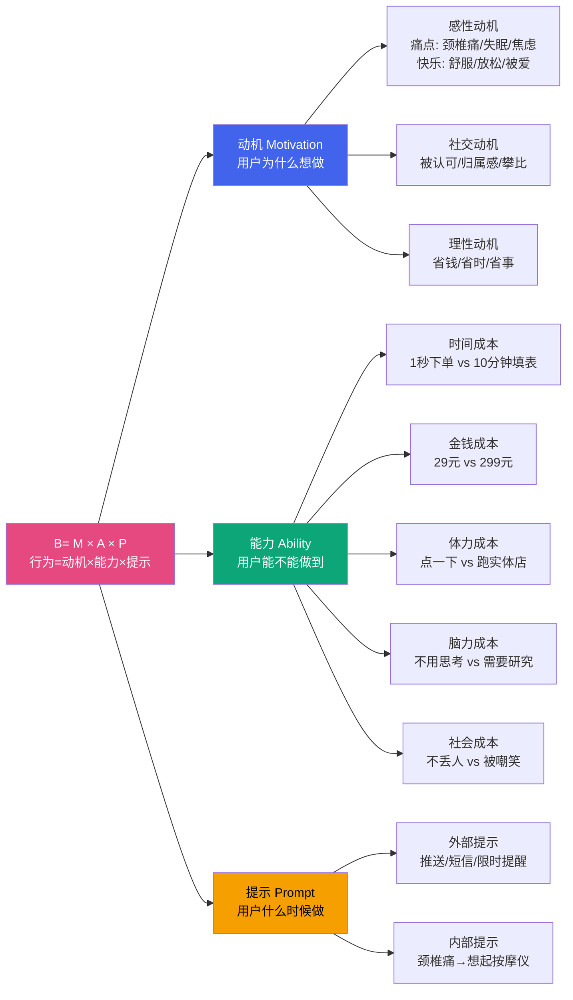

# Day19: 用户心理与行为设计

> 📅 学习日期：2026-07-09
> 🔗 关联笔记：[[00-目录]] | 上一篇：[[Day18-多平台变现矩阵]] | 下一篇：[[Day20-小红书官方创作者学院内容]]
> 🎯 适用场景：小红书/抖音/视频号内容创作、商品笔记文案、直播话术、私域转化

---

## 1. 一句话总结

**用户心理与行为设计 = 「7大心理触发器（互惠×承诺×社会认同×喜好×权威×稀缺×一致性）」+「购买决策五阶段金字塔（注意→兴趣→欲望→信任→行动）」+「反生活专属的『好物种草心理操控术』」——核心不是靠产品多好，而是靠对用户心理的精准把握，让用户在不知不觉中完成「被种草→主动搜→果断下单→自发安利」的完整心理闭环。**

---

## 2. 核心框架

### 2.1 用户心理与行为设计全景图

```mermaid
graph TB
    A[用户心理与行为设计] --> B[7大心理触发器<br/>影响决策的底层开关]
    A --> C[购买决策五阶段<br/>从注意到成交的漏斗]
    A --> D[内容心理杠杆<br/>文案/视觉的操控术]
    A --> E[反生活专属策略<br/>好物赛道特化应用]
    A --> F[行为设计框架<br/>Fogg行为模型]

    B --> B1[互惠<br/>先给再取<br/>免费干货/福利]
    B --> B2[承诺<br/>小承诺→大承诺<br/>评论/关注/加群]
    B --> B3[社会认同<br/>从众效应<br/>销量/评价/数据]
    B --> B4[喜好<br/>人格魅力<br/>人设/共鸣/亲和]
    B --> B5[权威<br/>专业背书<br/>证书/数据/专家]
    B --> B6[稀缺<br/>限量/限时<br/>错过就没了]
    B --> B7[一致性<br/>言行一致<br/>自我人设维护]

    C --> C1[注意层<br/>痛点触发<br/>3秒内抓住眼球]
    C --> C2[兴趣层<br/>价值呈现<br/>让用户觉得有用]
    C --> C3[欲望层<br/>场景代入<br/>让用户觉得想要]
    C --> C4[信任层<br/>证据堆叠<br/>让用户觉得可靠]
    C --> C5[行动层<br/>降低门槛<br/>让用户马上下单]

    D --> D1[痛点共鸣<br/>戳中焦虑/遗憾/恐惧]
    D --> D2[向往驱动<br/>描绘理想状态]
    D --> D3[损失厌恶<br/>不买会损失什么]
    D --> D4[锚定效应<br/>先贵后便宜的对比]
    D --> D5[峰终定律<br/>高潮+结尾决定体验]

    E --> E1[反生活好物<br/>养生/健康/家居品类<br/>特有的心理打法]
    E --> E2[孝心经济<br/>给父母买的心理]
    E --> E3[自我关怀<br/>对自己好一点]
    E --> E4[焦虑缓解<br/>颈椎/睡眠/衰老]

    F --> F1[B=MAP<br/>行为=动机+能力+提示]
    F --> F2[动机<br/>痛点/欲望/社交]
    F --> F3[能力<br/>一键下单/货到付款]
    F --> F4[提示<br/>限时优惠/库存紧张]

    style A fill:#e64980,color:#fff
    style B fill:#4263eb,color:#fff
    style C fill:#0ca678,color:#fff
    style D fill:#f59f00,color:#000
    style E fill:#7048e8,color:#fff
    style F fill:#e8590c,color:#fff
```



### 2.2 购买决策五阶段——每个阶段的用户心理与应对策略

这是所有自媒体运营者必须刻在脑子里的模型。**每一篇笔记、每一条视频、每一条朋友圈，都要明确自己处在哪个阶段，目标是什么。**

```mermaid
flowchart LR
    subgraph 阶段1:注意
        A1[用户心理<br/>我在刷着玩<br/>3秒决定看不看]
        A2[关键指标<br/>点击率/完播率<br/>前3秒留存率]
        A3[反生活策略<br/>痛点标题+视觉冲击<br/>颈椎/失眠/亚健康]
    end

    subgraph 阶段2:兴趣
        B1[用户心理<br/>这跟我有什么关系<br/>对我有什么价值]
        B2[关键指标<br/>互动率/收藏率<br/>平均观看时长]
        B3[反生活策略<br/>场景共鸣+数据展示<br/>"你是不是也每天脖子酸"]
    end

    subgraph 阶段3:欲望
        C1[用户心理<br/>我也想要这个<br/>但真的需要吗]
        C2[关键指标<br/>点击商品链接率<br/>加购率]
        C3[反生活策略<br/>效果对比+用户证言<br/>"用了3天,脖子舒服多了"]
    end

    subgraph 阶段4:信任
        D1[用户心理<br/>东西靠谱吗<br/>值这个钱吗]
        D2[关键指标<br/>商品页停留时间<br/>咨询率]
        D3[反生活策略<br/>专业背书+真实评价<br/>检测报告+买家秀]
    end

    subgraph 阶段5:行动
        E1[用户心理<br/>买不买<br/>现在买还是等等]
        E2[关键指标<br/>转化率/成交率<br/>下单率]
        E3[反生活策略<br/>限时优惠+降低门槛<br/>"今天下单立减20"]
    end

    A1 --> B1 --> C1 --> D1 --> E1
    
    style A1 fill:#ff6b6b,color:#fff
    style B1 fill:#f59f00,color:#000
    style C1 fill:#0ca678,color:#fff
    style D1 fill:#7048e8,color:#fff
    style E1 fill:#e64980,color:#fff
```

### 2.3 7大心理触发器的具体应用

| 心理触发器 | 原理 | 反生活应用场景 | 具体话术/文案 |
|:----------:|:----|:-------------|:------------|
| **互惠 Reciprocity** | 先给价值再索取回报 | 免费颈椎保养指南/健康知识 | 「老黄花了3天整理的颈椎自救指南，免费领👇」 |
| **承诺 Consistency** | 让人先做小承诺再引导大承诺 | 让用户先点赞/评论再下单 | 「觉得有用的点个赞，让更多人看到」→然后推产品 |
| **社会认同 Social Proof** | 从众心理，别人都在买 | 销量数据+评价+明星同款 | 「10万+姐妹都在用」「老用户复购率80%」 |
| **喜好 Liking** | 人设魅力促进信任 | 「反生活」人设：真诚好物推荐官 | 「老黄自用3个月，不好的东西我不推」 |
| **权威 Authority** | 专业背书增强信任 | 资质证书+专家背书+检测报告 | 「国家专利认证」「三甲医院推荐」 |
| **稀缺 Scarcity** | 数量/时间限制制造紧迫感 | 限时折扣/限量库存 | 「仅剩50单」「今晚12点恢复原价」 |
| **一致性 Congruity** | 让用户言行一致维护自设人设 | 用户说「我要养生」→买相关产品 | 「你不是说要对自己好一点吗？」 |

### 2.4 Fogg行为模型——行为设计的底层公式

> B = MAP（行为 = 动机 × 能力 × 提示）

这是斯坦福大学Fogg教授提出的最经典的行为设计模型。**用户不做某个行为，永远只有三个原因：不想做（动机不足）、做不到（能力不够）、或者忘了（没有提示）。**



**反生活最核心的公式应用：**

> 让用户下单 = 高动机（颈椎酸痛受不了）× 极低能力门槛（一键下单，货到付款）× 强力提示（限时优惠倒计时）

---

## 3. 可落地方法

### 3.1 【反生活可直接用】用户心理五步种草法

这是针对好物种草的完整心理操控SOP。每篇笔记/每条视频都按这个结构走。

```markdown
## 五步种草法操作SOP

### 第一步：3秒抓注意（触发痛点）

心理原理：人是自我中心的，只有跟我有关的信息才会被注意。

标题/前3秒直接戳中目标用户的痛点：

| 反生活品类 | 痛点标题示例 | 效果 |
|:----------|:------------|:----:|
| 颈椎按摩仪 | 「每天低头8小时，你的颈椎还撑得住吗？」 | 戳中程序员/白领 |
| 护眼仪 | 「眼睛干涩酸胀？超过3种说明你急需护眼了」 | 自测式痛点 |
| 睡眠枕 | 「凌晨3点又醒了？试试这个再睡」 | 场景代入 |
| 养生好物 | 「25岁以后，身体真的会告诉你答案」 | 年龄焦虑 |
| 暖宫宝 | 「每次姨妈来都痛到打滚？这个真的有用」 | 具体场景 |

⚠️ 痛点公式：具体场景 × 情感共鸣 × 不说产品名（先制造需求）

### 第二步：20秒入场景（代入感）

心理原理：镜像神经元——当用户看到别人在做某事时，大脑里会模拟同样的体验。

操作方法：
- 描述一个用户熟悉的具体场景
- 「你是不是也——」句式开场
- 细节越具体，代入感越强

反生活示例：
「你是不是也每天对着电脑8小时，下班回家就想躺着刷手机？
脖子又酸又硬，转个头咔嚓咔嚓响？
去按摩店太贵，一次就200多，还不可能天天去……」

### 第三步：15秒给方案（欲望激发）

心理原理：痛点被激活后，大脑会主动寻找解决方案。

反生活示例：
「后来朋友推荐了这个颈椎按摩仪，我用了3天就真香了——
第一，它用的是物理揉捏+热敷，不是那种电流刺痛感。
第二，每天只要15分钟，比出去按摩省了不止一个亿。
第三，充一次电能用一周，办公室、车里、家里都能用。」

框架：产品好处 × 3点（不要超过3点，多了记不住）
结构：功能→效果→省事

### 第四步：10秒堆信任（打消疑虑）

心理原理：损失厌恶——用户担心买错、买贵、买完后悔。

信任四重奏（按顺序用，每个用一句）：

1. 数据信任：「全网销量已经突破10万台」
2. 口碑信任：「复购率高达80%，很多用户买了送爸妈」
3. 权威信任：「国家医疗器械认证，三甲医院同款技术」
4. 风险保障：「7天无理由退换，送运费险」

### 第五步：10秒推行动（临门一脚）

心理原理：稀缺效应 + 锚定效应——限时优惠让决策变紧迫，原价对比让优惠感更强。

行动话术模板：
「原价299，今天下单只要159，还送价值39的收纳包。
只有最后50单了，卖完恢复原价。点击左下角立即购买👇」
```

### 3.2 损失厌恶的精确运用——好物变现的核武器

**损失厌恶（Loss Aversion）是人类最强大的心理偏误——失去100元的痛苦比得到100元的快乐强烈约2倍。** 这意味着「不买会损失什么」比「买了有什么好处」更有驱动力。

```markdown
## 反生活损失厌恶文案模板

### 模板1：错过型（最常用）
「这款按摩仪今天最后一天活动价，明天恢复原价299。
现在下单省140，还能享受免费保修2年。
错过今天，下次活动至少要等一个月。」

心法：明确的时间限制 + 具体的金钱损失 + 附加福利损失

### 模板2：社会比较型（适合私域）
「刚有个姐姐买了6台，送爸妈、公婆和自己各一台。
她说去年买的时候是299，今天只要159，后悔买早了。
还没下手的趁现在有优惠赶紧啊——」

心法：别人已经买了 + 价格对比焦虑 + 紧迫感

### 模板3：限量型（适合直播/限时秒杀）
「这批货只剩最后30台了，工厂那边补货要等10天。
现在下单明天到，等补货不知道什么时候了。
链接还在就能拍，拍完就没了——」

心法：物理稀缺（数量少）+ 时间延迟（补货慢）+ 即时行动（现在拍）
```

### 3.3 锚定效应——先贵后便宜的心理魔术

**锚定效应：人们做判断时会过度依赖最先获得的信息（锚点）。标价299先入为主，然后你卖159，用户会觉得「捡了大便宜」。**

```markdown
## 反生活锚定效应操作法

### 价格锚定的三层结构

第一层（锚点设置）：「市场价/原价XX元」
  示例：「市面上同样功能的颈椎按摩仪，一般都要300-500」
  目的：建立参考标准，让用户心理价位变高

第二层（对比凸显）：「我们只要XX元」
  示例：「我们这款只要159，功能完全一样」
  目的：在锚点对比下显得超值

第三层（价值感知）：「等于每天只要5毛钱」
  示例：「159用两年，每天才2毛钱，比出去按摩一次200省多了」
  目的：把大金额拆解成小单位，降低决策压力

### 小红书商品笔记中的锚定运用

标题示例：「299的按摩仪和159的有什么区别？我全买了告诉你」
内容展开：
- 贵的那款299，功能A/B/C
- 便宜那款159，功能A/B/C（完全一样！）
- 结论：多花140买个logo，不值
- 下单链接：159的那款 👇
```

### 3.4 社会认同的5种堆叠方式

**社会认同是小红书和抖音上最有效的转化工具。** 用户看到「很多人都买了」就会觉得「这东西应该是好的」。

```markdown
## 社会认同堆叠SOP

| 类型 | 具体做法 | 反生活示例 |
|:----|:---------|:----------|
| ① 销量数据 | 截图后台销量/累计单数 | 「已售10万+件」 |
| ② 好评截屏 | 精选好评+买家秀 | 截5-8条带图好评拼成长图 |
| ③ 用户故事 | 具体用户的改变案例 | 「王姐用了3周，颈椎不痛了」 |
| ④ KOL背书 | 其他博主也在推 | 「小红书上100+博主都在安利」 |
| ⑤ 明星/网红同款 | 蹭热点但别假 | 「李佳琦直播间卖爆了的那款同厂」 |

### 反生活可立即执行的社会认同操作

行动：收集你已有的买家评价
1. 从你的私域/直播间/评论区收集真实好评
2. 挑5条最有说服力的（有图有真相）
3. 拼成一张「真实用户反馈图」
4. 每篇笔记/每条视频都放上去
5. 每两周更新一次数据（「好评已累计2000+条」）
```

### 3.5 峰终定律——用户记住的不是全程，而是高潮和结尾

**诺奖得主丹尼尔·卡尼曼的峰终定律：人们对一段体验的评价，主要取决于两个时刻——最强烈的情感时刻（峰值）和结束时的感受（终点）。**

这对内容创作的启示：

```markdown
## 反生活内容创作的峰终定律应用

### 短视频（15-60秒）
- 开头（前3秒）：痛点峰值——「你的颈椎还能撑多久？」🔥
- 中间：解决方案呈现——产品展示/使用场景
- 结尾（最后5秒）：轻松收尾——「对自己好一点，反正也不贵」😊
- 峰在开头（痛点冲击），终在结尾（温暖收尾）

### 笔记文案
- 开头（第一段）：痛点峰值——具体场景描写
- 中间：产品测评/使用心得
- 结尾（最后一段）：行动引导 + 美好展望
- 「总之，颈椎不好真的别拖。对自己好一点，从今天开始👇」

### 直播
- 峰：测试/演示环节（用力按压按摩仪展示效果）
- 终：下单后的感谢 + 额外福利（付款后在评论区扣1送赠品）
```

---

## 4. 变现路径

### 4.1 心理操控对转化的直接量化影响

理解用户心理不是为了「套路」用户，而是让转化更高效。以下是每个心理杠杆对转化率的实际影响（基于行业数据）：

| 心理杠杆 | 对转化率的影响 | 实施成本 | 反生活可立刻用 |
|:---------|:------------:|:--------:|:------------:|
| 精准痛点标题 vs 普通标题 | 点击率提升50-200% | 0元（改标题而已） | ✅ |
| 使用社会认同 vs 不使用 | 转化率提升30-60% | 0元（截评价就行） | ✅ |
| 使用锚定原价 vs 直接标价 | 转化率提升15-30% | 0元（改排版） | ✅ |
| 限时限量 vs 不限时 | 转化率提升40-80% | 0元（设定倒计时） | ✅ |
| 免费送资料（互惠） | 转化率提升20-50% | 0元（整理干货） | ✅ |
| 权威背书 vs 无背书 | 转化率提升30-100% | 500-2000元（申请认证） | ⚠️ 需投入 |
| 用户评价堆叠 | 转化率提升40-70% | 0元（收集现有评价） | ✅ |

> **关键结论：70%的心理优化是不需要花钱的，只需要改变你的内容策略和表达方式。**

### 4.2 用户心理在不同变现场景中的应用

#### 场景一：小红书商品笔记（种草→下单）

```
用户心理路径:
浏览笔记 → 标题戳中痛点 → 看正文说痛点共鸣 → 
→ 看到产品解决方案 → 看到评价/数据信任 → 
→ 看到限时优惠 → 点击链接下单
```

**这个场景中最重要的心理杠杆排序：**
1. 痛点击中（决定是否打开）
2. 社会认同（决定是否相信）
3. 损失厌恶（决定是否现在买）

#### 场景二：抖音短视频（引流→橱窗）

```
用户心理路径:
刷到视频 → 前3秒被抓住 → 看到产品效果演示 → 
→ 看到评论区「在哪里买」→ 滑到橱窗 → 看到销量数据 → 
→ 看到价格对比 → 下单
```

**关键区别：抖音用户购买冲动更强但信任度更低，所以社会认同和权威背书比限时限量更重要。**

#### 场景三：私域社群（信任→复购）

```
用户心理路径:
日常看群 → 看到老黄推荐 → 已有信任基础 → 
→ 小承诺（扣1/回复）→ 看到团购价 → 
→ 觉得自己在省钱 → 下单 → 维护人设「我是会省钱的人」
```

**私域核心：互惠+承诺+一致性——先给价值（养生知识/专属优惠），再让小承诺（回复/接龙），最后走到大承诺（多次复购）。**

### 4.3 用户心理年度变现模型（反生活专属）

| 阶段 | 核心心理策略 | 收入预估 | 每周动作 |
|:----:|:-----------|:-------:|:--------|
| **1-4周** | 互惠（免费知识）+社会认同（展示数据） | 0-2000元 | 每天1条痛点内容+收集好评 |
| **5-8周** | 承诺（引导评论/收藏）+喜好（建立人设） | 2000-8000元 | 固定人设风格+互动引导 |
| **9-16周** | 稀缺（限时活动）+锚定（价格对比） | 8000-25000元 | 每周1次秒杀+对比测评 |
| **17周+** | 一致性（粉丝自我人设）+权威（行业地位） | 25000-80000元 | 打造#反生活推荐 标签+社群沉淀 |

---

## 5. 行动清单

### ✅ 行动①：今天立刻优化你现有的一条笔记/视频（1小时）

**操作步骤：**

1. **选一篇**：挑出你数据最好的一条笔记或视频（或任意一条挂车内容）
2. **改标题**：用痛点公式改标题
   - 原标题：「这款颈椎按摩仪很好用」
   - 改后标题：「每天低头8小时的人一定要看！我的颈椎终于有救了」
3. **改开头**：前2句话直接戳痛点
   - 原文：「这是一个非常好用的颈椎按摩仪」
   - 改后：「你是不是也每天脖子酸到睡不着？试试这个——」
4. **加社会认同**：在正文中插入一张好评截图
5. **加限时提示**：评论区置顶「今天下单送收纳包，只有20个名额」
6. **观察变化**：对比改动前后的点击率/互动率

**产出：** 优化后的笔记/视频，并记录改动前后的数据对比

### ✅ 行动②：制作「反生活」用户心理话术库（2小时）

**操作步骤：**

1. **新建一个文档**（飞书/Notion/备忘录），命名为「反生活心理话术库」
2. **按以下结构建立卡片：**

```
┌─ 痛点话术（20条）
│  「每天低头8小时，颈椎还好吗？」
│  「凌晨3点醒，不是你一个人」
│  「25岁之后，身体变化真的会说话」
│  ……
│
├─ 信任话术（15条）
│  「已售10万+，复购率80%」
│  「国家专利认证的产品」
│  「7天无条件退换，送运费险」
│  ……
│
├─ 行动话术（10条）
│  「仅剩最后30单，点击左下角👇」
│  「今天下单立减40，还送赠品」
│  「现在买，明天到，周末就能用上」
│  ……
│
└─ 私域互动话术（10条）
   「觉得颈椎不舒服的扣1，我拉你进福利群」
   「回复'好物'，送你一份我整理的养生清单」
   ……
```

3. **每写一条就对照真实的用户评论修改**——看看你的粉丝/买家都是怎么说的，复制他们的语言

**产出：** 至少30条可用话术，能直接用在下周的每一条内容中

### ✅ 行动③：今天发一条「心理操控」含量最高的笔记（30分钟）

**使用五步种草法写一条完整的小红书/抖音文案：**

| 步骤 | 内容 | 字数 |
|:----|:-----|:---:|
| ① 痛点抓眼 | 「每天刷手机到凌晨，眼睛干到像进了沙子？👀」 | 15字 |
| ② 场景代入 | 「你是不是也——关灯后躺床上刷一小时？反正我是」 | 25字 |
| ③ 方案呈现 | 「后来入了这款护眼仪，热敷+按摩，15分钟舒服到睡着」 | 30字 |
| ④ 信任堆叠 | 「买的时候看评论说10万+人买了，用了发现真香」 | 20字 |
| ⑤ 行动引导 | 「原价199，今天活动价99，限时3天👇」 | 20字 |

**最关键的三件事：**
- ✅ 评论区置顶催单话术
- ✅ 配图里加一张「销量/评价」截图
- ✅ 正文中制造至少1次「限时/限量」提示

**产出：** 1条完整的、运用了3种以上心理杠杆的内容（发出去之后观察评论区反应）

---

> **📌 总结核心心法：**
>
> 自媒体卖的不是产品，而是**情绪解决方案**。
>
> 用户买的不是颈椎按摩仪，而是**「脖子不痛的安心」**。
> 用户买的不是护眼仪，而是**「眼睛舒服的解脱」**。
> 用户买的不是养生好物，而是**「对自己好一点的心理许可」**。
>
> **掌握用户心理，比掌握产品功能重要100倍。** 产品功能可以复制，但心理洞察别人抄不走。
>
> 关联笔记: [[Day09-个人IP打造]] | [[Day12-视频号生态]] | [[Day18-多平台变现矩阵]]
