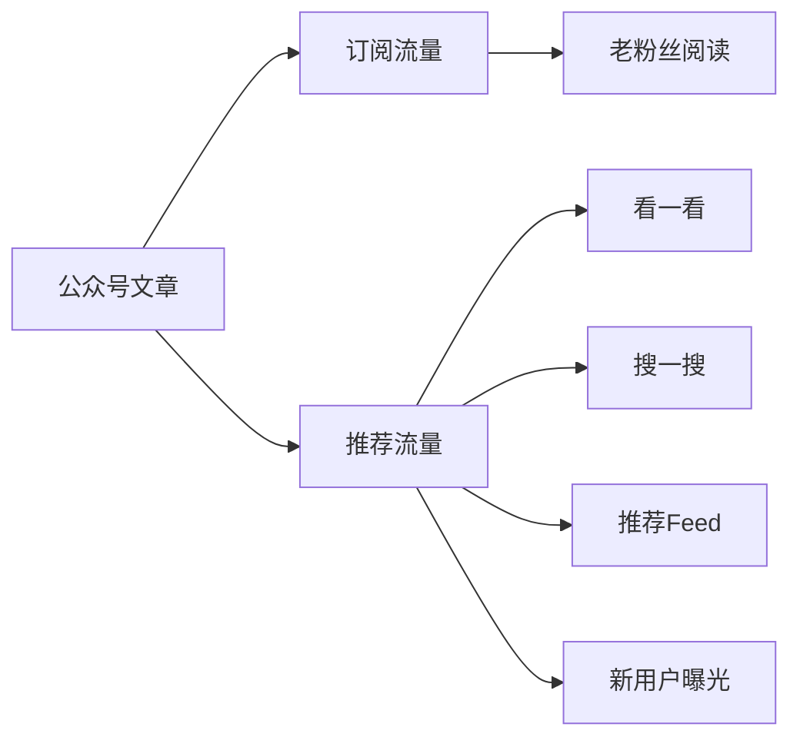

# 📕 Day2: 公众号运营与变现

> **核心：2026年做公众号还有机会吗？怎么赚钱？**
> 来源：行业报告 + 头部号主拆解

---

## 一、公众号还有机会吗？

### 数据事实
- 微信月活 **13亿+**
- 公众号日活 **3-4亿**
- 2024-2025年公众号改版后，**推荐流量占比提升到40%+**
- 小绿书（图文模式）**流量红利期**

### 结论
> **公众号没有死，只是玩法变了**
> 旧玩法（订阅=私域）：❌ 难做
> 新玩法（推荐+搜一搜）：✅ 有机会

---

## 二、2026年公众号的新玩法

### 2.1 推荐流量（微信版"小红书"）

公众号现在有**两种流量来源**：



### 2.2 小绿书（图文模式）

- 和小红书一样，发图片+短文字
- 推荐机制和小红书相似
- **和小红书内容一鱼多吃**
- 流量获取成本远低于小红书

### 2.3 搜一搜SEO

公众号文章可以被微信搜索收录
- 长尾关键词布局
- 持续输出能积累"搜索资产"
- 一篇文章发出去，半年后还在被搜索

---

## 三、公众号变现模式

### 模式1：流量主（最低门槛）

| 项目 | 说明 |
|------|------|
| **门槛** | 500粉即可开通 |
| **收入** | 1-3元/千次阅读 |
| **月入** | 1万阅读≈ 30-100元 |
| **适合** | 起步期保底 |

### 模式2：接广告（主流）

| 报价参考 | 阅读量 | 报价 |
|:--------:|:------:|:----:|
| 小号 | 500-2000 | 200-500元 |
| 中号 | 2000-1万 | 1000-5000元 |
| 大号 | 1万+ | 5000-2万元 |

### 模式3：付费阅读/赞赏

- 单篇付费：1-10元
- 适合深度内容（行业分析/独家信息）
- 赞赏：靠人设和情感连接

### 模式4：电商带货

- 公众号文章直接挂商品卡片
- 返佣5-30%
- 适合种草、测评类内容

### 模式5：私域承接（终极变现）

```
公众号 → 引导加微信
  → 私域社群/朋友圈
    → 高客单价成交（课程/咨询/产品）
```

---

## 四、反生活×公众号联动策略

### 为什么老黄要做公众号？

| 维度 | 小红书 | 公众号 |
|:----:|--------|--------|
| 内容形态 | 图文 | 图文/长文 |
| 流量机制 | 推荐 | 推荐+订阅+搜索 |
| 变现门槛 | 1000粉 | 500粉 |
| 内容生命周期 | 3-7天 | 6个月+ |
| 私域引流 | ⚠️ 严 | ✅ 松 |

### 联动方案

```
小红书（引流+品牌）
  ↓ 简介留公众号
公众号（沉淀+搜索流量）
  ↓ 文章挂微信
私域（成交+高客单）
```

### 内容复用策略
```
小红书辟谣笔记（500字）
  → 扩展为公众号长文（2000字）
  → 加入更多数据来源和详细分析
  → 搜一搜SEO优化
```

---

## 五、起步计划

### 第一周：开通+定位
```
□ 开通公众号（同名「反生活」）
□ 设计视觉风格
□ 写3篇试水
□ 看推荐流量效果
```

### 第二周：内容节奏
```
□ 每周2-3篇，和小红书同步
□ 测试小绿书模式
□ 布局搜一搜关键词
```

### 第三周：引流启动
```
□ 小红书简介加公众号
□ 每篇小红书结尾引导关注公众号
□ 第一篇公众号破500阅读
```

---

## 六、行动清单

```
□ 1. 开通「反生活」同名公众号
□ 2. 把今天学的爆款小红书内容转为公众号长文
□ 3. 在反生活小红书简介加"全网同名"
```

---

> **关联**：[Day1-小红书变现全攻略](Day1-小红书变现全攻略.md) · [自媒体运营入门](自媒体运营入门.md)
