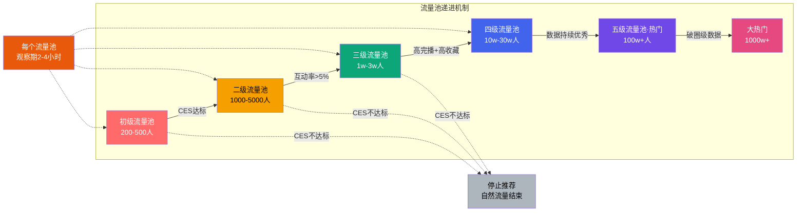
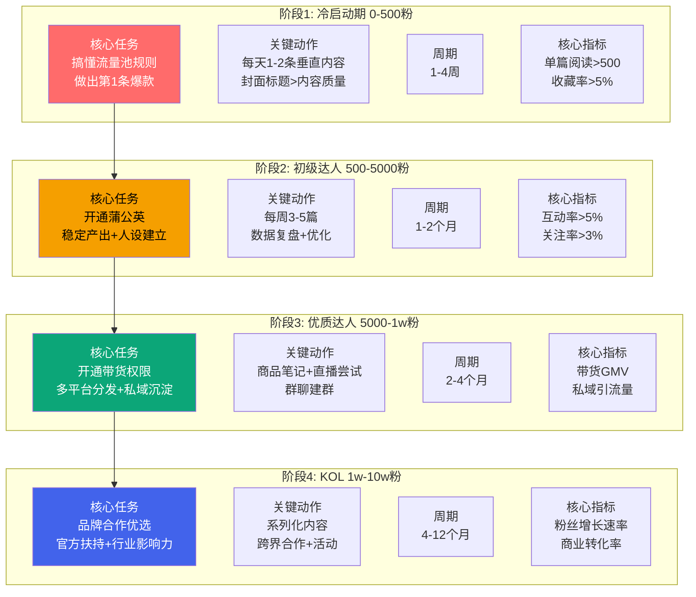

# Day20: 小红书官方创作者学院内容

> 📅 学习日期：2026-07-11
> 🔗 关联笔记：[[00-目录]] | 上一篇：[[Day19-用户心理与行为设计]] | 下一篇：[[Day21-私域引流转化]]
> 🎯 适用场景：反生活养生好物账号运营、小红书内容合规、账号冷启动、流量突破、搜索SEO优化
> 📚 学习来源：小红书创作者学院官方指导 + 平台规则文档 + 行业实践总结

---

## 1. 一句话总结

**小红书官方创作者学院 = 「CES评分驱动的流量池递进算法（收藏>评论>转发>点赞）」+「三审制内容审核体系（机器→AI→人工）」+「创作者成长四阶段（冷启动→蒲公英→带货→KOL）」+「养生类目特有合规红线」——在小红书，决定你能不能火的核心不是运气，而是你是否真正理解了平台的底层规则、流量分配机制和创作者的「官方期望」，尤其是养生好物这条赛道，踩线比好内容更致命。**

---

## 2. 核心框架

### 2.1 小红书创作者体系全景图

```mermaid
graph TB
    A[小红书创作者核心体系] --> B[流量底层算法<br/>CES评分模型]
    A --> C[内容审核规则<br/>三审制+违禁清单]
    A --> D[创作者成长路径<br/>从0到10w粉的阶梯]
    A --> E[变现方式矩阵<br/>五大变现通道]
    A --> F[内容创作规范<br/>官方对好内容的定义]
    A --> G[SEO优化体系<br/>搜索流量的密码]
    A --> H[养生类目特规<br/>反生活专属红线]

    B --> B1[CES评分权重<br/>收藏>评论>转发>点赞]
    B --> B2[流量池递进<br/>200人→1000w+阶梯]
    B --> B3[双通道推荐<br/>匹配推荐+社交推荐+搜索推荐]
    B --> B4[关键行为信号<br/>完播率>停留时长>点击率>互动率]

    C --> C1[三审制流程<br/>机器秒级→AI分钟级→人工小时级]
    C --> C2[严格违禁行为<br/>医疗类/营销类/安全类/社区规范类]
    C --> C3[养生类红线<br/>禁治疗/禁功效对比/禁处方推荐]

    D --> D1[冷启动期 0-500粉<br/>内容质量破流量池]
    D --> D2[初级达人 500-5000粉<br/>蒲公英门槛/接商单]
    D --> D3[优质达人 1w-10w粉<br/>带货权限/直播开通]
    D --> D4[KOL 10w+粉<br/>官方扶持/活动邀请]

    E --> E1[蒲公英品牌合作<br/>500粉门槛/抽成10%]
    E --> E2[商品笔记带货<br/>1000粉门槛/佣金5-30%]
    E --> E3[直播带货<br/>5000-1w粉门槛]
    E --> E4[知识付费<br/>专栏/课程/咨询]
    E --> E5[小红书店铺<br/>0粉可开店/自有品牌]

    F --> F1[5大好内容标准<br/>真实/有用/审美/原创/互动]
    F --> F2[封面3:4黄金比例<br/>文字30字以内/统一风格]
    F --> F3[视频15-60秒最佳<br/>前3秒黄金决定/必加字幕]

    G --> G1[标题策略<br/>关键词前置+数字+情绪+人群]
    G --> G2[标签策略<br/>大标签+中标签+长尾标签]
    G --> G3[正文SEO<br/>首段自然融入核心关键词]

    H --> H1[绝对禁止<br/>治疗宣称/功效对比/处方推荐]
    H --> H2[允许操作<br/>经验分享/好物推荐/生活方式]
    H --> H3[合规话术<br/>'亲测'/'个人习惯'/'日常调理']

    style A fill:#ff2442,color:#fff
    style B fill:#4263eb,color:#fff
    style C fill:#e64980,color:#fff
    style D fill:#0ca678,color:#fff
    style E fill:#f59f00,color:#000
    style F fill:#7048e8,color:#fff
    style G fill:#1098ad,color:#fff
    style H fill:#e8590c,color:#fff
```



### 2.2 CES评分模型——小红书的「内容审判引擎」

**CES（Community Engagement Score）** 是小红书推荐算法的核心。每一篇笔记发布后，系统会给它一个小范围的初始曝光（约200-500人），根据这批用户的互动行为数据计算评分，决定是否推入更大的流量池。



**CES评分权重排序（从高到低）：**

| 排名 | 行为 | 权重原因 | 反生活转化策略 |
|:----:|:----|:--------|:-------------|
| 🥇 | **收藏** | 代表「有用」「值得反复看」，最高价值信号 | 多写清单型/攻略型内容（「5个养生好物清单」→收藏率天然高） |
| 🥈 | **评论** | 代表「引发讨论」和「社交互动」 | 结尾设互动题（「你也有颈椎问题吗？评论区说说」） |
| 🥉 | **转发/分享** | 代表「社交传播价值」 | 生产「适合转发给朋友」的内容（「转给那个天天熬夜的闺蜜」） |
| 4 | **点赞** | 门槛最低，信号最弱 | 价值最低，不要特意追求点赞量 |
| 5 | **完播率/完读率** | 用户是否完整看完内容 | 视频15-60秒最佳，笔记分段+小标题提升完读 |
| 6 | **停留时长** | 用户在页面的停留时间 | 正文信息密度够高，让用户慢慢看（不是快速划过） |
| 7 | **点击率(CTR)** | 封面+标题的吸引力 | 封面决定进入率，标题决定点击率 |
| 8 | **关注率** | 看完后关注作者的比例 | 账号垂直度+人设吸引力决定 |

> **核心结论：如果你想在小红书上火，请忘掉「点赞数」这个指标。收藏和评论才是你真正的KPI。**

### 2.3 三审制——每一篇笔记都在过安检

小红书的内容审核是所有平台中最严格的之一，采用了**机器初审→AI复审→人工终审**的三层机制：

```
┌─────────────────────────────────────────────────┐
│                 机器审核（秒级）                    │
│  OCR文字识别 + 图像识别 + 敏感模型检测              │
│  识别：违禁词/水印/色情/暴力/广告/竞品平台标识      │
│  结果：通过 / 拦截 / 转人工                       │
├─────────────────────────────────────────────────┤
│                   AI审核（分钟级）                   │
│  语义理解 + 违禁词库匹配 + 敏感话题识别              │
│  识别：虚假宣传/医疗话题/恶意营销/虚假人设            │
│  结果：通过 / 低质降权 / 人工仲裁                   │
├─────────────────────────────────────────────────┤
│                  人工终审（小时级）                   │
│  仅针对争议内容/举报内容/高流量内容的抽查             │
│  结果：通过 / 限流 / 下架 / 禁言 / 封号              │
└─────────────────────────────────────────────────┘
```

**养生账号特别审查重点（AI会特别关注）：**
- 含「治疗」「治愈」「根治」等医疗词汇 → 直接拦截
- 含「医生推荐」「临床证明」等权威背书（未提供资质） → 虚假宣传
- 含「前后对比」图（尤其是皮肤、减肥、体态） → 易被判定为医疗广告
- 保健品功效宣称（未标注「本品不能代替药物」） → 违规

### 2.4 创作者成长四阶段——从0到10万粉的阶梯



**每个阶段的核心目标和达成标准：**

| 阶段 | 粉丝范围 | 核心KPI | 时间预估 | 重点动作 | 反生活当前阶段 |
|:----:|:--------:|:-------:|:--------:|:--------|:------------:|
| 冷启动期 | 0-500 | 单篇阅读>500 | 1-4周 | 内容垂直+封面优化 | ⬆️ **这里就是你们现在的位置** |
| 初级达人 | 500-5000 | 互动率>5% | 1-2个月 | 稳定更新+人设建立 | 目标 |
| 优质达人 | 5000-1w | 带货GMV | 2-4个月 | 商品笔记+私域 | 下一站 |
| KOL | 1w-10w | 粉丝增长 | 4-12个月 | 系列化+品牌合作 | 远景 |

---

## 3. 可落地方法

### 3.1 【反生活可直接用】小红书SEO优化SOP

**2024-2025年小红书最大的变化：搜索流量占比暴增，部分账号搜索流量占40-60%。** 这意味着，你发了一条3个月前的笔记，只要关键词命中用户搜索，仍然能持续获得流量。**SEO是长尾流量的免费自动提款机。**

```markdown
## 反生活养生账号SEO完整SOP

### 第一步：标题关键词布局（决定搜索命中率）

核心公式：人群关键词 + 痛点/需求关键词 + 数字/情绪词

反生活-好物类标题模板库：

| 品类 | 标题模板 | 命中关键词 |
|:----|:--------|:----------|
| 颈椎按摩仪 | 「打工人颈椎自救指南｜办公室随时能用的3个神器」 | 打工人、颈椎、办公室 |
| 养生茶 | 「每天喝一杯=敷10张面膜？这5款养生茶亲测有效」 | 养生茶、亲测、素颜 |
| 助眠好物 | 「失眠党快进来！我的助眠好物Top5」 | 失眠、助眠、好物推荐 |
| 护眼仪 | 「程序员护眼好物｜眼睛干涩酸胀的亲测解决方案」 | 程序员、护眼、眼睛干涩 |
| 保暖/暖宫 | 「痛经女孩看这里！冬天必备的5个暖身神器」 | 痛经、女孩、暖身 |

规则：
1. 核心关键词放在标题前15字以内
2. 包含至少1个人群标签（打工人、学生党、宝妈、程序员）
3. 包含数字（3个神器、5款、Top5）
4. 包含情绪词（救星、亲测、绝了、后悔没早买）

### 第二步：正文首段SEO（决定排名）

正文前50字必须自然融入2-3个核心关键词。

❌ 错误写法：
「今天给大家推荐一款很好用的颈椎按摩仪，我自己用了3个月了。」

✅ 正确写法：
「作为一个每天对着电脑8小时的打工人，颈椎问题真是我的噩梦。试了3个月的颈椎按摩仪，今天分享我的真实体验——」

### 第三步：标签分层策略（决定推荐路径）

| 标签层级 | 数量 | 作用 | 反生活示例 |
|:--------|:---:|:----|:----------|
| 🏷️ 大标签（赛道定位） | 1-2个 | 给系统确定你的内容赛道 | #养生 #好物推荐 |
| 🏷️ 中标签（细分领域） | 3-5个 | 精准匹配兴趣用户 | #打工人养生 #颈椎护理 #办公室好物 |
| 🏷️ 长尾标签（搜索） | 2-3个 | 捕获长尾搜索流量 | #办公室养生壶 #90后养生 #颈椎按摩仪推荐 |

总数量：5-8个，不要超过10个（多了系统认为你在泛铺）
```

### 3.2 【反生活可直接用】养生日内容审核自查清单

**养生好物是小红书审核最严格的类目之一。** 如果你的笔记流量突然暴跌，90%是因为触碰了审核红线。每次发笔记前，必须做完以下自查：

```markdown
##  每日笔记发布前自查清单

###  绝对禁止（踩到直接下架/限流）
- [ ] 没有使用「治疗」「治愈」「根治」「特效」等词汇
- [ ] 没有宣称「医生推荐」「三甲医院推荐」（无资质证明的情况下）
- [ ] 没有发布「调理前后」对比图
- [ ] 没有推荐处方药或保健品功效宣传
- [ ] 没有其他平台水印（抖音/微信/淘宝logo）

### ⚠️ 可能被限流（需要替换措辞）
- [ ] 如果用「亲测有效」而不是「产品有效」
- [ ] 如果用「我的习惯」而不是「应该怎么做」
- [ ] 如果用「辅助调理」而不是「治疗缓解」
- [ ] 如果用「个人体验分享」而不是「科普教程」
- [ ] 保健品内容是否标注了「本品不能代替药物」

### ✅ 合规加分项
- [ ] 正文开头是个人经历/体验分享（人设感）
- [ ] 关键词以「推荐」「分享」「测评」收尾
- [ ] 配图是自己实拍（不是网图/产品精修图）
- [ ] 评论互动引导是评价类问题（不是引导到站外）
```

### 3.3 【反生活可直接用】流量池突破三步法

如果你的笔记卡在200-500曝光上不去，这是最有效的突破方法：

```markdown
## 突破初级流量池的三步法

### 第一步：复盘你的封面+标题（决定点击率）

封面是流量池递进的「门票」。系统给了你200个曝光，只有封面够好才能拿到点击数据，才有进入下一级的资格。

反生活封面自查：
- [ ] 封面是不是3:4竖版？（1080×1440px）
- [ ] 封面上有没有文字？（纯产品图点击率很低）
- [ ] 文字是不是30字以内、大号、醒目？
- [ ] 封面风格和你的账号统一吗？
- [ ] 封面和标题是不是一致？（不要标题党）

### 第二步：优化前3秒/前2段（决定完播率）

用户看到内容后，前3秒决定要不要看完。对于视频，黄金3秒决定95%的完播率。

反生活视频开头模板：

「你是不是也——（痛点场景描述）」 ✅
「今天给大家推荐一个好东西」 ❌（太普通）
「你知道吗？90%的打工人都有这个问题」（悬念式） ✅
「姐妹们我真的后悔没有早点买这个」（情绪式） ✅

反生活笔记开头模板：

「作为一个每天低头8小时的老颈椎病患者……」 ✅（痛点共鸣）
「今天给大家分享3个让我生活质量提升的好物」 ✅（清单悬念）
「这个……怎么说呢，我用了3个月才敢来分享」 ✅（真实感）

### 第三步：引导收藏+评论（决定CES评分）

收藏和评论是CES评分权重最高的两个行为。你的内容必须在「有用性」和「互动性」两个维度上做足功夫。

提升收藏率的5个方法：

1. 清单体笔记（「5个xxx」「Top3 xxx」）→ 用户天然想收藏备用
2. 攻略型笔记（「手把手教你xxx」）→ 用户不想以后找不到
3. 对比型笔记（「A vs B到底选哪个」）→ 用户收藏了以后参考
4. 知识型笔记（「养生必备的5个常识」）→ 收藏当知识库
5. 避坑型笔记（「千万别踩这5个坑」）→ 收藏警醒自己

提升评论率的4个方法：

1. 结尾设置互动题：「你也有xxx问题吗？评论区聊聊」
2. 开放式提问：「你们觉得哪个更好？评论区告诉我」
3. 选择题式互动：「A款便宜但功能少，B款贵但功能全，你选哪个？」
4. 投票式互动：「觉得有用的扣1，觉得没用的扣2」
```
### 3.4 小红书2024-2025年最新趋势与反生活应对策略

```markdown
## 五大趋势与应对策略

### 趋势一：搜索流量爆发（最大机会）
- 小红书正成为「生活百科搜索引擎」
- 部分博主搜索流量已占总流量40-60%
- 一篇3个月前的笔记，只要关键词匹配，还在给你带流量

✅ 反生活应对：每一篇笔记都做SEO优化
- 标题含关键词（见上方的标题模板库）
- 正文首段自然融入关键词
- 标签按「大-中-长尾」三层布局

### 趋势二：视频比图文权重更高
- 视频笔记获得更高的基础流量权重
- 15-60秒短视频完播率最优
- 竖屏9:16，1080p以上

✅ 反生活应对：图文+视频双发
- 每条好物推荐做成15-30秒短视频
- 视频封面+标题=图文笔记封面+标题
- 视频开头前3秒直接痛点开场

### 趋势三：AI生成内容管控收紧
- 平台开始标注AI生成内容
- 纯AI内容可能被限流
- 鼓励「真人真实」内容

✅ 反生活应对：
- AI只辅助写作结构，最终内容必须人工润色+真人语气
- 配图必须自己实拍（不用AI生图）
- 保持「真人出镜」人设

### 趋势四：店铺自播成为风向
- 小红书鼓励商家自己开播
- 减少纯达人依赖
- 直播带货门槛降低

✅ 反生活应对：
- 有条件可以试试直播
- 「反生活」人设做直播天然有信任基础
- 先从每周1次15分钟快闪直播开始

### 趋势五：「买手」生态崛起
- 小红书定位从「种草」转向「买手制电商」
- 优质买手（而非营销号）获得更多流量倾斜
- 真诚推荐 > 硬广转化

✅ 反生活应对：
- 强化「买手」人设：我是认真用过的才推荐
- 每一篇带货笔记必须是真实使用体验
- 建立「反生活精选」的个人好物标签
```

---

## 4. 变现路径

### 4.1 小红书五大变现通道详解

```mermaid
graph TB
    A[小红书变现矩阵] --> B[蒲公英品牌合作<br/>500粉可开通]
    A --> C[商品笔记带货<br/>1000粉可开通]
    A --> D[直播带货<br/>5k-1w粉可开通]
    A --> E[知识付费<br/>专栏/课程]
    A --> F[小红书店铺<br/>0粉可开店]

    B --> B1[操作：报名品牌任务<br/>平台抽成约10%]
    B --> B2[收入：500-5000元/条<br/>看粉丝量+互动率]
    B --> B3[条件：标注'品牌合作'标签<br/>笔记保留至少3个月]

    C --> C1[操作：笔记中嵌入商品链接<br/>小红书商城/淘宝外链]
    C --> C2[收入：佣金5-30%<br/>养生好物一般8-15%]
    C --> C3[条件：1000粉以上<br/>内容需为真实体验]

    D --> D1[操作：开直播带商品<br/>带货讲解+限时优惠]
    D --> D2[收入：500-5000元/场<br/>看场观+转化率]
    D --> D3[条件：5000粉以上<br/>需通过带货资质审核]

    E --> E1[操作：发布付费专栏/课程<br/>如'养生入门7天课']
    E --> E2[收入：99-299元/人<br/>知识含量决定定价]
    E --> E3[条件：粉丝信任度高<br/>内容专业性强]

    F --> F1[操作：开通个人店铺<br/>上传自有产品]
    F --> F2[收入：利润率最高<br/>自营产品成本可控]
    F --> F3[条件：个体户/企业资质<br/>0粉可开店]

    style A fill:#ff2442,color:#fff
    style B fill:#4263eb,color:#fff
    style C fill:#0ca678,color:#fff
    style D fill:#f59f00,color:#000
    style E fill:#7048e8,color:#fff
    style F fill:#e64980,color:#fff
```



### 4.2 反生活的变现阶段路径规划

根据小红书官方创作者学院的成长路径，反生活账号的变现应该按阶段稳步推进：

| 阶段 | 粉丝 | 变现方式 | 月收入预估 | 核心动作 |
|:----:|:----:|:--------|:---------:|:--------|
| **阶段A** | 0-500 | 暂无 | 0元 | 全力冲500粉→开通蒲公英 |
| **阶段B** | 500-1000 | 蒲公英品牌合作 | 500-3000元 | 接养生类品牌商单（按摩仪/助眠产品/养生茶） |
| **阶段C** | 1000-5000 | 蒲公英+商品笔记 | 2000-8000元 | 好物种草笔记带佣金链接 |
| **阶段D** | 5000-1w | 商品笔记+直播+私域 | 5000-20000元 | 直播带货+私域复购 |
| **阶段E** | 1w+ | 全通道变现 | 20000+元 | 品牌长期合作+自有店铺 |

### 4.3 养生好物类目的佣金与收入预估

| 品类 | 佣金比例 | 客单价 | 单笔佣金 | 需要卖多少单到月入1万 |
|:----|:-------:|:-----:|:-------:|:------------------:|
| 颈椎按摩仪 | 8-15% | 99-299元 | 8-45元 | 220-1250单 |
| 养生茶/花茶 | 10-20% | 29-69元 | 3-14元 | 714-3333单 |
| 助眠枕头/眼罩 | 10-15% | 59-199元 | 6-30元 | 333-1667单 |
| 养生壶/小家电 | 5-10% | 69-199元 | 3-20元 | 500-3333单 |
| 护肤品/身体护理 | 15-30% | 49-299元 | 7-90元 | 111-1429单 |

> **核心观点：养生好物不是高佣金品类，但客单价中等的养生好物（99-299元）是转化率最高的区间。** 加上蒲公英商单的收入，变现路径是很完整的。

### 4.4 小红书变现场景的「官方合规要点」

**⚠️ 以下每条都是审核雷区，踩了不仅拿不到钱，可能连号都没了：**

1. **蒲公英商单必须标注「品牌合作」** → 未标注会被判定为私下接单，限流+扣信用分
2. **商品笔记必须真实体验** → 没收钱硬夸会被判定虚假宣传
3. **禁止在内容中留微信/QQ/手机号** → 通过小红书群聊引流可以（官方工具）
4. **禁止诱导互动（「转发送xxx」「点赞截图领奖」）** → 判为刷量行为
5. **养生类带货必须有「个人体验」口吻** → 不能像一个营销号

---

## 5. 行动清单

### ✅ 行动①：对现有笔记做一次「审核安全自查」+「SEO优化」（2小时）

**现在马上做的事——检查你发过的每一条笔记，找出可能被限流的原因。**

```
操作步骤：

1. 打开小红书后台 → 查看最近30天的笔记数据
2. 对每篇笔记做以下检查：

   【安全自查】
   □ 有没有出现「治疗」「治愈」「根治」等词？→ 有则删掉，改为「亲测有效」「个人经验」
   □ 有没有「前后对比」图？→ 有则隐藏，未来不要再发
   □ 有没有提到具体品牌名但没有标注商业合作？→ 注意后续补标
   □ 文案是否是「你应该」的口吻（教育式）？→ 改为「我的经验是」的口吻

   【SEO优化】
   □ 标题有没有核心关键词？→ 没有则加
   □ 正文前50字有没有自然融入关键词？→ 没有则调整
   □ 标签是不是按「大-中-长尾」三层布局？→ 不是则重设
   □ 封面图上有没有文字？→ 没有则换有文字的封面

3. 优先修改：数据最好但流量突然断崖的笔记（说明被限流了）
4. 产出：至少优化3篇笔记的标题+封面+正文开头+标签
```

### ✅ 行动②：建立「反生活」小红书爆款标题库（1小时）

```
收集30条经过验证的高点击率标题模板：

第一步：在搜索框搜你的品类关键词
  搜索「颈椎按摩仪」「养生茶」「助眠好物」
  看排在搜索结果前10位的笔记，记录它们的标题格式

第二步：提取结构
  例：「打工人必看！办公室3分钟颈椎放松法」
  → 结构：人群标签 + 惊叹号 + 场景 + 数字 + 方法

第三步：套用到你的品类
  养生类：适合人群 + 痛点 + 数字 + 方法
  好物类：人群 + 数字 + 品类 + 亲测/测评

第四步：做A/B测试
  2篇内容相似的笔记用不同标题发布
  对比48小时内的点击率
  留下点击率高的公式

产出：30条标题公式卡片（飞书/备忘录），每天发笔记时挑一个用
```

### ✅ 行动③：制定账号的「流量突破30天计划」（30分钟）

```markdown
## 反生活小红书30天突破500粉计划

### 每周策略

| 周次 | 目标 | 内容数量 | 内容类型 | 核心优化点 |
|:---:|:----|:-------:|:--------|:---------|
| 第1周 | 找到爆款公式 | 12篇 | 清单体攻略型 | 测试不同封面+标题组合 |
| 第2周 | 提升互动率 | 10篇 | 互动问答型 | 结尾必加互动引导 |
| 第3周 | 突破流量池 | 8篇+2条视频 | 视频+图文混合 | 视频测试前3秒黄金开头 |
| 第4周 | 冲刺500粉 | 10篇 | 好物种草+经验分享 | 优化SEO+标签精准度 |

### 每天必做

☐ 发1篇笔记（图文或视频）
☐ 回复所有评论（<30分钟内）
☐ 刷同类博主的爆款内容，记录可借鉴的点
☐ 检查自己昨天那篇的数据（点击率/完播率/收藏率）
☐ 收集用户评论中的真实痛点语言

### 每周必做

☐ 复盘本周数据（哪篇数据好？好在哪里？）
☐ 优化封面风格（统一调色/字体/构图）
☐ 淘汰数据差的标题公式
☐ 新增3条标题模板到话术库

### 目标指标

☐ 单篇阅读量突破1000+
☐ 收藏率>5%
☐ 互动率>5%
☐ 30天涨粉500+
```

---

> **📌 总结核心心法：**
>
> 小红书官方创作者学院教给创作者最重要的事情就是——**不要和平台规则对抗，而是要理解规则、利用规则、成为规则喜欢的内容创作者。**
>
> 平台想要的从来不是「营销号」，而是**真实、有用、审美好的内容**。反生活账号的养生好物定位，本身就在小红书的「鼓励赛道」里。
>
> **你的优势：**
> - 养生好物符合小红书「生活方式」平台调性 ✅
> - 真实体验分享是平台最鼓励的内容形式 ✅
> - 好物推荐本身就是小红书的原生变现模式 ✅
>
> **你的风险：**
> - 养生类目审核严格，踩线即限流 ⚠️
> - 竞争激烈，封面+标题必须卷到极致 ⚠️
> - AI生成内容被限制，真人实拍是刚需 ⚠️
>
> **最重要的三件事：吃得透审核规则 > 做得好封面标题 > 优化得了SEO关键词。**
>
> 关联笔记: [[Day01-小红书电商闭环]] | [[Day02-小红书投放与投流]] | [[Day03-爆款复制方法论]] | [[Day05-小红书矩阵号运营]] | [[Day12-视频号生态]] | [[Day19-用户心理与行为设计]]
