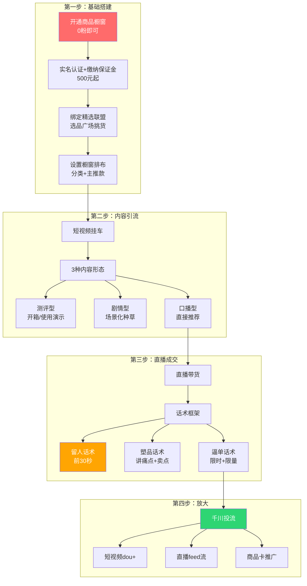
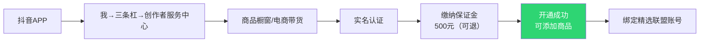
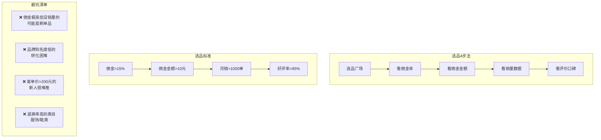
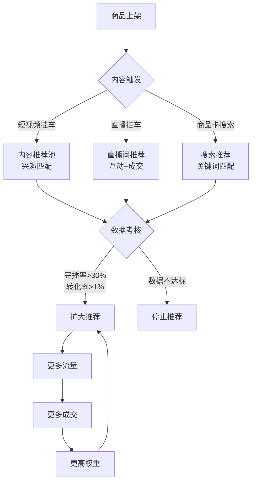
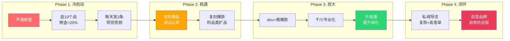
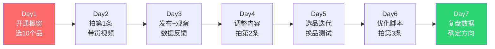

# 📕 Day20: 抖音带货与橱窗

> **核心：抖音带货的本质不是「卖货」，而是「用内容制造购买冲动」。橱窗是你的线上货架，短视频是你的推销员，直播是你的成交场。三者的组合 = 持续稳定的带货收入。抖音最大的优势是——0粉就能开通商品橱窗，这是目前所有平台里带货门槛最低的。**
> 来源：抖音电商官方规则 + 头部带货博主拆解 + 行业报告 + 千川投流实战方法论

---

## 一、一句话总结

**抖音带货 = 商品橱窗（货架） × 短视频挂车（引流） × 直播转化（成交） × 选品策略（利润）。2025-2026年，抖音电商GMV已突破万亿规模，短视频带货和直播带货是普通人最容易切入的赛道。不一定要露脸、不一定要口才，只要会「展示产品+制造需求」，就能赚钱。**

反生活账号做抖音带货有独特优势——「揭秘型」内容天然适合带货。比如：「这5个智商税厨房神器，第3个你家一定有」→ 挂一个真正好用的厨房工具。用户已经信任你了，你推什么他们就买什么。

> 💡 **关键认知转变**：不要把抖音带货当成「卖东西」，要当成「帮用户做决策」。用户在抖音上买东西，买的不是商品本身，而是「被说服的感觉」。谁的故事讲得好、谁的产品展示做得好，用户就信谁。

本章和[[Day3-抖音短视频运营]]（抖音基础认知）、[[Day12-小红书投放与投流]]（投流思维可复用）、[[Day11-小红书电商闭环]]（电商闭环思维）、[[Day1-小红书变现全攻略]]（变现思维）紧密关联。

---

## 二、核心框架

### 2.1 抖音带货全景模型



### 2.2 抖音带货的4种模式对比

| 模式 | 门槛 | 适合谁 | 收入天花板 | 投入时间 |
|:----:|:----:|:------:|:----------:|:--------:|
| **橱窗自然流** | 0粉/500押金 | 所有人起步 | 月入3000-1万 | 每天1-2h |
| **短视频带货** | 1000粉+ | 会做内容的人 | 月入5000-5万 | 每天2-3h |
| **直播带货** | 1000粉+ | 能说会道的人 | 月入1万-50万+ | 每天4-8h |
| **千川投流** | 资金+选品 | 有电商经验的人 | 月入5万-100万+ | 每天2h运营 |

> 老黄起步建议：先从「橱窗自然流+短视频挂车」开始，等有稳定收入后再考虑直播或投流。

### 2.3 橱窗开通流程



**最新规则（2025-2026）：**
- ✅ 0粉丝即可开通商品橱窗（以前要1000粉）
- ✅ 保证金：个人500元，企业2000元（可退）
- ✅ 实名认证+身份证
- ✅ 一个抖音号只能开一个橱窗
- ❌ 违规记录/账号状态异常无法开通

### 2.4 精选联盟选品逻辑



---

## 三、可落地方法

### 3.1 短视频挂车带货（这是老黄首选的模式）

**为什么首选短视频带货？**
- 一个爆款视频可以持续出单3-30天
- 不用露脸（适合反生活账号调性）
- 不用每天直播（时间自由）
- 一次制作，持续收益

#### 3.1.1 3种短视频带货内容模板

**模板1：测评揭秘型** ⭐最适合反生活

```
【开头】「你绝对不知道，这个XX行业的大坑...」
【中段】揭秘行业内幕/智商税 → 引出好产品
【结尾】「只有这个XX，我测过是真的好用」
【挂车】挂对应商品
```

*案例：揭露某类产品的智商税 → 推荐真正好用的替代品*

**模板2：场景痛点型**

```
【开头】「如果你也XX，这个一定要看...」
【中段】展示问题场景 → 拿出产品 → 解决问题
【结尾】「用了它之后，我再也没有XX过」
【挂车】挂产品
```

**模板3：对比测评型**

```
【开头】「同样是XX，价格差10倍，区别到底在哪？」
【中段】多款产品对比（通过镜头展示）
【结尾】「预算XX就买A，想省钱就买B」
【挂车】挂推荐的那款
```

#### 3.1.2 反生活账号专属带货内容矩阵

反生活账号的「揭秘」人设非常适合以下带货方向：

| 方向 | 内容策略 | 参考品类 | 预计佣金 |
|:----:|----------|----------|:--------:|
| **避坑指南** | 「这5个XX千万别买，第3个是智商税」 | 家居/数码/美妆 | 15-30% |
| **行业内幕** | 「XX行业的秘密，从业者不会告诉你」 | 食品/护肤品 | 20-40% |
| **平替推荐** | 「大牌平替，价格只要1/10」 | 百货/零食/日用品 | 20-50% |
| **省钱攻略** | 「这样买XX，省下一半钱」 | 生活用品/工具 | 15-25% |
| **生活技巧** | 「XX的1个神用法，解决大问题」 | 清洁/厨房/收纳 | 20-35% |

#### 3.1.3 短视频带货拍摄SOP

```
【准备工作】（30分钟）
□ 确定要推的产品（精选联盟选品）
□ 写脚本（200-300字，20-40秒）
□ 准备产品实物/素材

【拍摄要点】
□ 手机竖屏（9:16）
□ 前3秒必须有钩子
□ 产品展示要清晰（特写镜头）
□ 真人口播or画外音
□ 背景干净，光线充足

【发布设置】
□ 标题：痛点+解决方案
□ 话题：#好物推荐 #必买清单 #抖音带货
□ 标签：@抖音小助手
□ 挂车：关联商品（1-3个）
□ 封面：大字标题+产品图
```

### 3.2 直播带货入门（进阶）

如果短视频带货跑通了，可以尝试直播带货：

**0基础起步流程：**

1. **准备期（1周）**
   - 确定类目（跟短视频保持一致）
   - 选5-10个核心品
   - 写好话术脚本
   - 布置直播间（手机+环形灯+背景）

2. **冷启动期（1-2周）**
   - 每天固定时间开播（建议晚8-10点）
   - 前30分钟自然流（不要投流）
   - 发短视频预热引流
   - 目标：直播间同时在线>10人

3. **话术框架**

```
【开场留人】「欢迎新进来的宝子们，今天直播间给大家准备了XX福利...」
【产品塑品】「这款XX，原价XX，今天直播间只要XX，为什么呢？因为...」
【痛点挖需】「你是不是也遇到过这样的情况...这款产品就是来解决这个问题的」
【逼单成交】「只剩最后X单了，拍完就没有了...3、2、1上链接」
```

### 3.3 千川投流入门（放大）

**什么时候开始投流？**
- 自然流稳定出单（日销售额>500元）
- 有至少3个爆款短视频
- 确定了选品方向

**新手投流策略：**

| 阶段 | 预算 | 目标 | 投放方式 |
|:----:|:----:|:----:|:--------:|
| 测试期 | 100元/天 | 测素材/测人群 | 短视频dou+ |
| 放量期 | 300-500元/天 | 放大ROI | 千川专业版 |
| 稳定期 | 500-2000元/天 | 维持ROI>2 | 智能投放 |

> ⚠️ **新手警告**：不要一上来就烧千川！先把自然流跑通，花真金白银买的经验太贵了。

### 3.4 抖音电商的流量分发机制



**带货视频的核心指标：**
- **商品点击率 > 5%**（挂了车多少人会点）
- **点击转化率 > 3%**（点击了有多少人会买）
- **佣金GMV > 100元/万播放**（每万播放的带货产出）
- **退货率 < 20%**（退货多说明选品或描述有问题）

---

## 四、变现路径

### 4.1 抖音带货收入模型

**收入 = 播放量 × 商品点击率 × 转化率 × 客单价 × 佣金率**

举例一个爆款视频的收益估算：

| 指标 | 保守 | 正常 | 优秀 |
|:----:|:----:|:----:|:----:|
| 视频播放量 | 1万 | 10万 | 100万 |
| 商品点击率 | 3% | 5% | 8% |
| 点击人数 | 300 | 5000 | 80000 |
| 转化率 | 2% | 3% | 5% |
| 成交单数 | 6单 | 150单 | 4000单 |
| 客单价 | 50元 | 80元 | 100元 |
| 佣金率 | 20% | 25% | 30% |
| **佣金收入** | **60元** | **3000元** | **12万元** |

> 一个爆款视频的收益远高于一条广告报价。这也是为什么做带货比做广告接单更值得投入。

### 4.2 反生活账号变现路线图



**各阶段时间预期：**
| 阶段 | 时间 | 日收入 | 月收入 |
|:----:|:----:|:------:|:------:|
| Phase 1: 冷启动 | 第1-2周 | 0-10元 | 0-300元 |
| Phase 2: 跑通 | 第3-6周 | 30-100元 | 1000-3000元 |
| Phase 3: 放大 | 第7-12周 | 100-500元 | 3000-15000元 |
| Phase 4: 闭环 | 第13周+ | 500-2000元 | 1.5万-6万元 |

### 4.3 高佣金品类推荐（2025-2026）

| 品类 | 平均佣金率 | 退货率 | 难度 | 适合反生活吗？ |
|:----:|:----------:|:------:|:----:|:--------------:|
| **家居百货** | 20-35% | 低 | ⭐ | ✅ 避坑类内容天然匹配 |
| **厨房用品** | 25-40% | 低 | ⭐ | ✅ 智商税揭秘超适合 |
| **个护美妆** | 20-50% | 中 | ⭐⭐ | ✅ 成分党/揭秘党 |
| **数码配件** | 15-30% | 低 | ⭐ | ✅ 测评对比型 |
| **零食食品** | 15-25% | 低 | ⭐ | ⚠️ 需要展示吃播 |
| **母婴用品** | 20-35% | 中 | ⭐⭐ | ❌ 人设不匹配 |
| **服饰鞋包** | 20-40% | 高(30-50%) | ⭐⭐⭐ | ❌ 退货率高，新手慎入 |
| **虚拟课程** | 50-70% | 极低 | ⭐ | ✅ 知识付费可结合 |

> **老黄首推**：家居百货（避坑类）+ 厨房用品（智商税揭秘）+ 个护美妆（行业揭秘）

### 4.4 带货收入 vs 广告收入的对比

| 维度 | 广告接单 | 带货佣金 |
|:----:|:--------:|:--------:|
| 门槛 | 1000粉起，难接到单 | 0粉可开橱窗 |
| 稳定性 | 看广告主脸色，不稳定 | 上架即卖，持续出单 |
| 天花板 | 每条500-2000元 | 月入5万+ |
| 内容自由度 | 广告主要求多 | 自己选品自己说 |
| 复利效应 | 无 | 爆款视频持续出单 |
| 适合谁 | 大V/垂直博主 | 所有人 |

> **结论**：对于反生活这类「揭秘型」账号，带货的收入天花板远高于接广告，而且内容更自然、不受品牌方约束。

---

## 五、行动清单

### ✅ 今天就能做的3件事

**第1件事：开通抖音商品橱窗**
- [ ] 打开抖音 → 我 → 右上角三条杠 → 创作者服务中心
- [ ] 找到「商品橱窗」/「电商带货」→ 点击开通
- [ ] 完成实名认证 + 缴纳500元保证金
- [ ] 绑定精选联盟账号（同一手机号注册）

**第2件事：精选联盟选品**
- [ ] 进入抖音 → 商品橱窗 → 选品广场
- [ ] 按类目筛选：家居百货/厨房用品
- [ ] 筛选条件：佣金>20% + 月销>1000 + 好评率>95%
- [ ] 至少选10个品加入橱窗
- [ ] 确定3个「主推品」（你准备做视频推荐的产品）
- [ ] 购买样品（或者用产品官网素材）

**第3件事：发布第一条带货视频**
- [ ] 选一个反生活方向上有「揭秘」价值的产品
- [ ] 写脚本框架：痛点（3秒）→ 揭秘（10秒）→ 推荐产品（10秒）→ 行动号召（5秒）
- [ ] 拍摄或剪辑（不需露脸，画外音+产品演示即可）
- [ ] 发布时勾选「添加商品」
- [ ] 标题带关键词：好物推荐/避坑/智商税/平替

### 📅 第一周执行计划



### 📌 进阶路径

**当橱窗带货稳定出单后：**
1. **开通抖音小店**（自己开店卖货，利润更高）
2. **抖音联盟**（帮别人带货→自己开店→招人帮卖）
3. **千川投流**（付费放大，ROI>2就稳赚）
4. **直播带货**（从录播到直播，转化率翻3倍）
5. **私域回流**（抖音成交→引流微信→复购→高客单）
6. **矩阵多号**（一个号跑通→复制到3-5个号）

### 🚫 新手常见坑

| 坑 | 说明 | 正确做法 |
|:--:|------|----------|
| ❌ 选品太偏 | 小众产品没人买 | 选大众高频消费品 |
| ❌ 佣金太低 | 低于10%不赚钱 | 至少选20%佣金以上的 |
| ❌ 纯搬运 | 盗用别人视频 | 自己拍/自己解说 |
| ❌ 急功近利 | 第一条就想爆 | 保持日更，3周内出结果 |
| ❌ 忽略封面 | 白板封面没人点 | 大字标题+产品图 |
| ❌ 不分主次 | 同时推太多品 | 每期推1-2个核心品 |
| ❌ 价格过高 | >200元转化差 | 新手先做50-100元价位 |
| ❌ 不作售后 | 用户问不管 | 耐心回复，积累信任 |

---

> **关联笔记**：[[Day3-抖音短视频运营]] · [[Day11-小红书电商闭环]] · [[Day12-小红书投放与投流]] · [[Day19-个人IP打造]] · [[Day13-小红书爆款复制方法论]]
>
> **下次学习**：Day21 - 抖音本地生活（团购/探店/同城流量）
