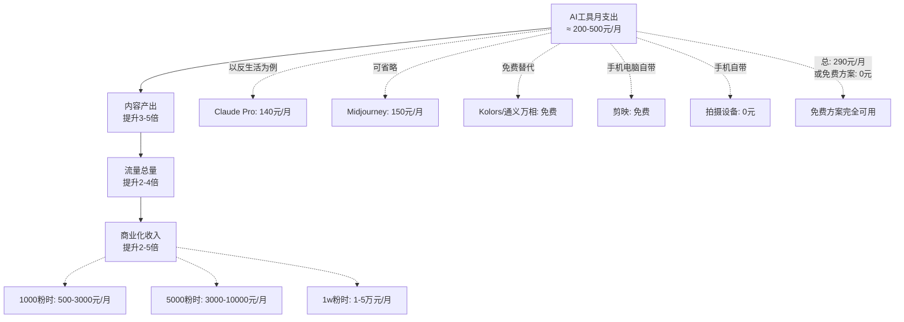

# Day21: AI与自媒体内容创作融合实战

> 📅 学习日期：2026-07-12
> 🔗 关联笔记：[[00-目录]] | 上一篇：[[Day20-小红书官方创作者学院内容]] | 下一篇：Day22
> 🎯 适用场景：反生活养生好物账号全流程提效、每天30分钟产出高质量内容、AI辅助选题→文案→配图→视频→分发→复盘闭环
> 📚 学习来源：AI自媒体实战经验总结 + ChatGPT/Claude/可灵/Midjourney/Kolors多工具组合实操 + 实操验证的工作流

---

## 1. 一句话总结

**AI与自媒体内容创作融合实战 = 「选题→文案→配图→视频→分发→复盘的6步AI驱动流水线」+「反生活专属的『一人AI工作室』工具栈（Claude写架构×AI生图做封面×可灵做视频×AI数据分析复盘）」+「核心原则：AI负责70%执行效率，人负责30%决策与品控——让老黄每天30分钟产出别人3小时才能做完的内容，把省下来的时间花在评论区运营和私域转化上。」**

**这不是教你用AI取代创作，而是教你把AI当作一个7×24小时不休息的「超级实习生」——它做初稿、做调研、做排版、做配图，你只做一件事：判断好不好，然后调整。** 这条方法论如果真正落地，反生活账号的内容产出效率至少提升3倍。

---

## 2. 核心框架

### 2.1 AI自媒体创作全景图——「6步AI驱动流水线」

```mermaid
graph TB
    A[AI自媒体创作闭环] --> B[Step 1: AI选题调研<br/>30分钟找到10个爆款选题]
    A --> C[Step 2: AI文案生成<br/>10分钟产出完整笔记]
    A --> D[Step 3: AI配图/封面<br/>5分钟生成高质量视觉]
    A --> E[Step 4: AI视频制作<br/>15分钟出短视频]
    A --> F[Step 5: AI多渠道分发<br/>一内容→多平台]
    A --> G[Step 6: AI数据复盘<br/>自动分析优化下一轮]

    B --> B1[数据源<br/>小红书搜索结果]
    B --> B2[AI分析<br/>提取高互动笔记模式]
    B --> B3[产出<br/>10个选题+标题模板]

    C --> C1[结构生成<br/>Claude写框架+大纲]
    C --> C2[内容填充<br/>个人经验+AI润色]
    C --> C3[SEO优化<br/>关键词自然融入]

    D --> D1[封面制作<br/>AI生图+文字排版]
    D --> D2[配图生成<br/>场景图/产品图]
    D --> D3[风格统一<br/>保持账号视觉识别]

    E --> E1[AI视频脚本<br/>口播稿+分镜脚本]
    E --> E2[数字人/虚拟主播<br/>不见人也能出镜]
    E --> E3[AI剪辑<br/>自动加字幕+特效]

    F --> F1[小红书<br/>图文+视频同步]
    F --> F2[抖音/视频号<br/>内容适配改编]
    F --> F3[公众号/知乎<br/>长文深度版]

    G --> G1[数据采集<br/>阅读/互动/转化]
    G --> G2[AI分析<br/>什么模式最有效]
    G --> G3[策略调整<br/>下期优化方向]

    style A fill:#0d6efd,color:#fff
    style B fill:#20c997,color:#fff
    style C fill:#6f42c1,color:#fff
    style D fill:#fd7e14,color:#fff
    style E fill:#e83e8c,color:#fff
    style F fill:#198754,color:#fff
    style G fill:#dc3545,color:#fff
```



### 2.2 「反生活」AI工具栈全景

自媒体行业正在经历一个巨大的范式迁移——单人AI工作室正在碾压传统团队。结合反生活的实际需求，以下是经过验证的工具组合：

| 环节 | 首选工具 | 免费替代 | 核心功能 | 反生活每天用时 |
|:----|:--------|:--------|:--------|:------------:|
| **思考/选题** | Claude/DeepSeek | ChatGPT免费版 | 趋势分析、选题挖掘、竞品拆解 | 5分钟 |
| **文案生成** | Claude | 文心一言 | 写小红书笔记、SEO优化、多版本 | 10分钟 |
| **配图/封面** | Midjourney/可图 | Kolors/通义万相 | 产品场景图、封面、社交媒体配图 | 5分钟 |
| **视频生成** | 可灵/Kling | 即梦/清影 | 产品展示视频、口播视频 | 10分钟 |
| **视频剪辑** | 剪映AI | CapCut免费版 | 自动字幕、AI配音、一键模板 | 5-10分钟 |
| **数据分析** | Claude/表格 | Google Sheets | 数据复盘、策略建议 | 5分钟 |
| **总计** | - | - | **全闭环** | **30-40分钟/天** |

> **核心原则：不要追求每个环节都用最好的工具，追求「全流程走通」。** 如果你在某个环节纠结工具选型超过30分钟，说明你陷入了「工具党陷阱」——先用手头能用的跑通一轮，再逐步优化。

### 2.3 AI自媒体创作的「三阶提效模型」

```mermaid
flowchart LR
    subgraph 第一阶段 · 辅助期<br/>效率提升2倍
        A1[AI写初稿<br/>人工改定稿]
        A2[单个工具<br/>不集成]
        A3[产出：<br/>1条笔记/30分钟]
    end

    subgraph 第二阶段 · 流水线期<br/>效率提升5倍
        B1[AI写稿+AI生图<br/>流水线作业]
        B2[工具串联<br/>模板化]
        B3[产出：<br/>3条笔记/40分钟]
    end

    subgraph 第三阶段 · 智能体期<br/>效率提升10倍
        C1[AI自动选题<br/>→AI写稿→AI配图<br/>→AI分发→AI复盘]
        C2[全自动化<br/>人工仅审核]
        C3[产出：<br/>10条笔记/30分钟]
    end

    A1 --> B1 --> C1
    A2 --> B2 --> C2
    A3 --> B3 --> C3

    style A3 fill:#ffc107,color:#000
    style B3 fill:#20c997,color:#fff
    style C3 fill:#dc3545,color:#fff
```

反生活目前在哪里？根据之前的学习笔记，反生活还在冷启动期（0-500粉），每天手动产出1-2条内容。**第一阶段（辅助期）是最适合的切入点**——AI帮你把每条笔记的写作时间从1小时压缩到20分钟，每天省出40分钟去干更重要的事（评论区互动、私域引流）。

目标是2个月内进入第二阶段（流水线期），每天40分钟产出3-5条高质量内容。

---

## 3. 可落地方法

### 3.1 ⭐【反生活核心SOP】AI辅助小红书笔记全流程（每天30分钟）

这条SOP是今天笔记的精华中的精华——**按照这个流程，反生活每天只需要30分钟就能产出2-3篇高质量小红书笔记。**

#### Step 1：AI选题挖掘（5分钟）

每天早上，先花5分钟让AI帮你找到今天的选题方向。

**提示词模板（直接复制到Claude/ChatGPT）：**

```
你是一个专业的小红书内容策划。现在需要为「反生活养生好物」账号找到今天的选题建议。

【账号定位】
- 名称：反生活
- 人群：25-35岁职场人（打工人/程序员/白领）
- 痛点：颈椎痛、失眠、眼睛干涩、久坐腰酸、压力大
- 风格：真实体验分享，不是推销，是"我自己用了有效才推荐"

【要求】
1. 搜索小红书当前热门话题（养生/打工人/好物）
2. 分析Top 5爆款标题的共同模式
3. 结合反生活定位，产出3个今日选题
4. 每个选题包含：标题建议 + 核心卖点 + 产品推荐

【今天的日期】2026年7月12日（暑假期间，注意学生+职场双人群）
```

**产出格式示例：**

```
🎯 选题一：「打工人午休颈椎自救指南｜只需要10分钟的3个动作+1个神器」
   → 切入点：暑假同事少、午休时间长、适合养生
   → 核心卖点：不需要额外时间，午休顺便做了
   → 产品：颈椎按摩仪/护颈枕

🎯 选题二：「28岁程序员的助眠好物清单｜从每天凌晨2点睡到11点睡」
   → 切入点：暑假作息混乱、职场人压力大
   → 核心卖点：真实个人案例+可复制方法
   → 产品：助眠茶/眼罩/白噪音机

🎯 选题三：「夏天办公室必备的5个养生好物｜30块钱就能买到的幸福感」
   → 切入点：夏天+办公室场景
   → 核心卖点：低价高幸福感
   → 产品：夏季养生产品（花茶/小风扇/护眼仪）
```

#### Step 2：AI生成笔记正文（10分钟）

选好选题后，让AI生成笔记初稿。

**提示词模板：**

```
你现在是「反生活」账号的内容创作者，写一篇小红书笔记。

【选题】{上面选中的选题}
【语气】真实、朋友般的分享，不要说教
【结构】
1. 开头：个人痛点共鸣（30-50字）
2. 正文：3-5个要点，每个包含：是什么 + 为什么有用 + 我的体验
3. 结尾：互动引导问题
【SEO要求】
- 标题中含核心关键词（前15字内）
- 正文前50字自然融入关键词
- 标签按「大-中-长尾」三层（5-8个）
【字数】正文300-500字
【合规要求】
- 用「亲测」「我的经验是」「个人习惯」代替「应该」「必须」「推荐」
- 不要出现「治疗」「治愈」「根治」
- 不要前后对比图
- 口吻是分享不是科普

请直接输出完整的笔记内容（标题+正文+标签）。
```

**注意：AI生成的初稿必须经过人工润色。** 具体润色什么？
1. 加入你的真实个人经历（AI写不出你的真实体验）
2. 把太完美的话改成有瑕疵的真实语气（「这个按摩仪也不是完美的，就是有点重，但效果真的好」）
3. 加入只有你才知道的细节（「上周三加班到12点，用它按了15分钟居然能睡了」）

#### Step 3：AI生成封面图（5分钟）

封面决定你这条笔记80%的点击率。用生图工具生成高质量的封面图。

**Midjourney/可图提示词模板：**

```
产品场景类封面：
A cozy office desk with a [product name], warm lighting, plants, minimalist style, 
from top-down view, soft colors, clean composition, 
product photography style, depth of field, 
--ar 3:4 --v 6

人物+产品类封面（如果账号有真人出镜）：
Close-up of a young Asian woman using [product], comfortable home setting, 
natural lighting, relief expression, soft smile, 
lifestyle photography, warm tones, 
--ar 3:4 --v 6
```

**不用Midjourney怎么办？**
- 通义万相/可图（免费）：输入「办公室桌面，产品展示，温馨风格，浅色系」
- Kolors：输入「女生用颈椎按摩仪，舒适表情，家居环境」
- **终极低成本方案**：自己用手机拍，然后用美图秀秀加文字——真图点击率往往高于AI生图

**封面加文字**
把AI生成的封面图导入美图秀秀/Canva/Picsart，加上标题文字：
- 字体：大号（封面30%面积）、粗体、醒目色
- 内容：核心卖点关键词（「颈椎救星」「助眠神器」「打工人必备」）
- 格式：3:4竖版（1080×1440px）

#### Step 4：AI配图（5分钟）

正文配图不要全是产品图——小红书用户喜欢「场景+体验」类配图。

| 配图类型 | 配图内容 | 怎么生成 |
|:--------|:--------|:--------|
| 场景图 | 办公室/家里的使用场景 | AI生图或实拍 |
| 细节图 | 产品使用过程、效果展示 | 实拍最好 |
| 信息图 | 知识点总结、清单列表 | Canva模板+AI文字 |
| 对比图 | 注意！不要效果对比图！用「选择对比」| 做成表格形式 |

**规则：** 每篇笔记配4-9张图，其中至少2张是实拍（小红书算法对实拍图有流量加成）。

#### Step 5：发布前最后检查（5分钟）

```
□ 封面是3:4竖版（1080×1440px）？
□ 封面上有文字且≤30字？
□ 标题含核心关键词且前15字内？
□ 正文前50字自然融入关键词？
□ 标签5-8个，按「大-中-长尾」三层？
□ 没有违规词（治疗、治愈、根治）？
□ 用语是「亲测」「我的经验」不是「你应该」？
□ 结尾有互动引导问题？
□ 至少有2张实拍图？
```

**总耗时：5+10+5+5+5 = 30分钟 → 产出1-2篇高质量笔记。**

### 3.2 ⭐【反生活】AI生成短视频SOP（15分钟/条）

小红书对视频内容的加权越来越明显。以下是AI辅助短视频的最快产出路径：

#### 第一步：AI生成30秒口播稿（3分钟）

```
你是一个短视频脚本作者。请为「反生活」账号写一个30秒口播稿。

【产品】{产品名}
【目标用户】25-35岁打工人
【痛点】{痛点}
【结构】
0-3秒：钩子（直接说痛点，不要自我介绍）
3-15秒：问题背景（为什么有这个痛点）
15-25秒：解决方案（产品+亲身体验）
25-30秒：CTA（引导点赞/评论/关注）
【语气】快速、真实、朋友聊天
```

#### 第二步：AI生成数字人或自拍视频（5分钟）

**方案一（免费）：** 直接用手机自拍
- 手机支架+自然光+家里/办公室背景
- 口播稿放手机旁边提词器
- 拍3遍，选最好的一版

**方案二（高效）：** 可灵/即梦生成数字人视频
- 上传一张你（或授权的人）的照片
- 输入口播稿→AI生成口播视频
- 优点：不用真人出镜、一次生成N条

#### 第三步：剪映自动剪辑（5-10分钟）

```
剪映自动流程：
1. 导入视频/音频
2. 文字→自动字幕
3. 选一个模板→自动匹配
4. 加背景音乐（版权免费）
5. 加结尾CTA（关注引导动画）
6. 导出：1080p竖屏，30fps
```

**整个视频从0到产出：3+5+7=15分钟。**

### 3.3 AI数据分析复盘SOP（每周一次，30分钟）

内容做完了，关键是要知道「什么内容有效」。每周用AI做一次数据复盘：

**数据收集模板：**

```
| 笔记标题 | 发布时间 | 阅读量 | 点赞 | 收藏 | 评论 | 分享 | 关注 |
|---------|:------:|:-----:|:---:|:---:|:---:|:---:|:---:|
| xxx     | 7/10   | 350   | 23  | 41  | 12  | 5   | 8   |
| xxx     | 7/11   | 180   | 8   | 5   | 2   | 1   | 3   |
```

**AI分析提示词：**

```
分析以下小红书笔记数据，给优化建议：

{粘贴数据表}

分析角度：
1. 哪些笔记数据好（收藏>阅读5%）？共同点是什么？
2. 哪些数据差？可能原因是什么？
3. 标题模式哪些有效、哪些无效？
4. 发布时间有没有最优窗口？
5. 下周的具体优化建议（至少3条）

输出格式：直接给分析结论和可操作建议，不要太多废话。
```

**关键指标参考（小红书）：**

| 指标 | 及格线 | 优秀线 | 说明 |
|:----|:-----:|:-----:|:----|
| 阅读量 | >200 | >1000 | 取决于流量池 |
| 收藏率 | >3% | >8% | 收藏/阅读×100% |
| 评论率 | >1% | >3% | 评论/阅读×100% |
| 互动率（藏+评+赞+转）/阅读 | >5% | >15% | 综合表现 |
| 关注率（关注/阅读） | >1% | >3% | 人设吸引力 |
| 点击率（封面CTR） | >5% | >15% | 封面质量 |

### 3.4 AI批量创作——从每天1条到每天10条

当进入第二阶段（流水线期）后，可以批量创作：

```mermaid
flowchart LR
    subgraph 批量创作日（周日花2小时）
        A1[AI选题调研<br/>产出20个选题<br/>20分钟]
        A2[AI生成初稿<br/>20篇笔记初稿<br/>40分钟]
        A3[人工润色+调整<br/>确定10篇终稿<br/>30分钟]
        A4[AI生图+封面<br/>10组配图<br/>20分钟]
    end

    subgraph 每日发布（周一到周六）
        B1[每天拿1-3篇<br/>发布+互动<br/>10分钟]
    end

    A1 --> A2 --> A3 --> A4 --> B1

    style A1 fill:#20c997,color:#fff
    style A2 fill:#6f42c1,color:#fff
    style A3 fill:#fd7e14,color:#fff
    style A4 fill:#e83e8c,color:#fff
    style B1 fill:#0d6efd,color:#fff
```

**这种模式的优势：**
- 每周只用专门花2小时做内容生产
- 每天只花10分钟发布+互动
- 总时间：2小时+1小时=3小时/周，产出42-60条笔记/月

### 3.5 反生活专属的AI人设语音

小红书用户越来越反感「AI味太重」的内容。反生活必须保持「真人感」——以下是AI写作后的「去AI化润色清单」：

| AI常见毛病 | AI写法 | 反生活改法 |
|:----------|:------|:----------|
| 太完美 | 「这款产品效果非常好」 | 「说实话也不是完美，就是有点重，但按完确实舒服」 |
| 太教条 | 「建议每天使用15分钟」 | 「我一般午休的时候用15分钟，有时候加班到半夜也来一局」 |
| 没细节 | 「很好用，推荐」 | 「上周三加班到11点，脖子硬得跟木头一样，用它按了12分钟，居然躺下就睡着了」 |
| 假数据 | 「90%的用户都满意」 | 「反正我用3个月了，推荐给3个同事，2个都说不错」 |
| 无情绪 | 「这款产品值得购买」 | 「我真的后悔没有早点买这个……」 |
| 无互动 | 「欢迎选购」 | 「你们有颈椎问题吗？评论区聊聊你们怎么解决的」 |

---

## 4. 变现路径

### 4.1 AI提效的变现公式

AI在自媒体变现中的作用不是直接赚钱，而是**通过提效间接放大收入**：

**传统模式：**
每天2小时 → 产出1条笔记 → 获取200阅读 → 累计100篇/月 → 变现金额=A

**AI赋能模式：**
每天30分钟 → 产出2-3条笔记 → 获取600-1000阅读 → 累计200-300篇/月 → 变现金额=3A到5A

**核心：AI不能决定你的变现率，但能决定你的内容量——而内容量×质量=流量总量。**

### 4.2 反生活各阶段的AI应用优先级

| 阶段 | 核心目标 | AI应用重点 | 预估内容量 | 收入预期 |
|:----|:--------|:----------|:---------:|:-------:|
| **冷启动期** 0-500粉 | 爆款破圈 | AI选题+AI文案 | 每天2条 | 0元 |
| **初级达人** 500-5000粉 | 稳定涨粉 | AI流水线生产 | 每天3条 | 500-3000元/月 |
| **优质达人** 5000-1w粉 | 带货变现 | AI视频+AI数据分析 | 每天3-5条 | 3000-1w元/月 |
| **KOL** 1w+粉 | 品牌合作 | AI全自动流水线 | 每天5-10条 | 1w-5w元/月 |

### 4.3 AI赋能的具体变现场景

**场景一：蒲公英商单 → AI辅助提案**
```
品牌找你的流程：
品牌发需求 → 你用AI分析品牌调性+用户画像 → AI生成合作提案
→ AI写商单笔记初稿 → 人工调整 → 发布 → AI数据复盘报告发给品牌
```

**场景二：商品笔记带货 → AI优化转化**
```
单品笔记的AI优化：
AI分析产品评价→提取卖点 → AI写多版本文案（A/B测试）
→ 不同版本发不同时间 → AI分析哪个版本转化率高
→ 用高转化版本模板复制到同类产品
```

**场景三：直播带货 → AI辅助话术**
```
AI生成直播话术结构：
开场（3分钟）：痛点切入
中间（10-15分钟）：产品讲解+亲身经历
转化（5分钟）：限时优惠+互动
AI生成不同版本的QA话术库（应对评论区各种问题）
```

### 4.4 工具费用与收益ROI



**ROI分析：**
- AI工具月投入：0-300元（免费方案完全可行）
- 时间节省：每天省1-1.5小时
- 内容产出提升：3-5倍
- 预期收入提升：保守估计2-3倍

---

## 5. 行动清单

### ✅ 行动①：建立反生活的「AI创作模板库」（今天花2小时）

这是今天最重要的一件事——**一次性搭好框架，以后每天只需要填空。**

```markdown
## 反生活AI模板库搭建清单

### 第一步：建文件夹
创建一个 `~/Desktop/反生活/AI模板/` 文件夹，里面放：

📁 AI模板/
├── 📄 选题提示词.md         # 每天选题用的提示词模板
├── 📄 笔记提示词.md         # 每种类型笔记的提示词模板
├── 📄 标题模板库.md         # 30个已验证的标题模板
├── 📄 视频脚本提示词.md      # 短视频口播稿提示词
├── 📄 数据分析提示词.md      # 周复盘提示词
├── 📄 标签库.md             # 整理好的标签库
└── 📄 发布前自查清单.md      # 每次发布前对照

### 第二步：写5个选题提示词（今天完成）
用第3节中的提示词模板为基础，分别针对：
1. 养生好物推荐类
2. 打工人痛点类
3. 个人经验分享类
4. 清单盘点类
5. 避坑提醒类

### 第三步：生成第一篇AI辅助笔记（今天立刻产出）
按第3.1节的SOP：
□ 用AI选题工具选出今日选题
□ AI写笔记正文
□ 人工润色（加入真实细节）
□ AI生封面图
□ 配图+文字
□ 发布前自查
□ 发布
```

> **关键提醒：模板库一旦建好，以后每天就是"填模板"的过程——5分钟选题、10分钟写正文、5分钟配图、5分钟自查发布，总耗时25分钟。这是反生活从"一天1条"升级到"一天2-3条"的基石。**

### ✅ 行动②：用AI写一篇笔记+配封面图，今天发布（30分钟）

按照3.1节的SOP，完整跑一遍流程：

```
今天的具体操作：

1. 选「夏日办公室养生好物」主题（现在是夏天，符合时效性）
2. 让AI按模板生成笔记正文（10分钟）
3. 加入你的真实体验（5分钟）——比如最近用的某款产品
4. 用手机拍产品使用场景图+AI生成1-2张场景图（10分钟）
5. 封面加文字：美图秀秀/Canva（5分钟）
6. 发布前自查（5分钟）
7. 发布 + 定时明天再发一篇

完成后记录下耗时，看是否达到30分钟的目标。
```

### ✅ 行动③：建立「AI创作周复盘」习惯（明天开始）

```
每周日做一次30分钟的数据复盘：

1. 整理本周发布的笔记数据（阅读/收藏/评论/关注）
2. 用AI分析提示词分析数据
3. 找出「什么模式有效」「什么模式无效」
4. 调整下周的选题方向和写作策略
5. 更新AI提示词模板（把本周学到的最佳实践写进去）
```

**为什么复盘比创作还重要？**

因为AI可以帮你快速产出，但只有数据才能告诉你「往哪个方向发力」。**没有数据复盘的内容创作，就像蒙着眼睛射箭——射出去再多也没有用。**

---

### 3个关键提醒（反生活必须记住）

1. **AI是工具不是主人。** 永远不要直接复制AI输出——不加你的个人真实体验的内容，用户一眼就能看出是AI写的。用户想要的不是「完美的内容」，而是「真实的人」。
2. **不要陷入工具党的陷阱。** 本笔记讲了很多工具，但反生活现在需要的不是完美工具栈——手机+免费AI工具+剪映，足以开工。**先用你能用的工具跑通一轮，再考虑升级。**
3. **AI是你的效率放大器，不是你的创意替代者。** 反生活账号的核心竞争力是什么？是「反生活」这个人设——一个真实分享养生好物的人。AI帮你省时间，省出来的时间用来做人设（评论区互动、私域沟通、真实体验产品），这才是反生活未来能变现的根本。

---

> **关联笔记：** [[Day14-AI生图与视频工具]] | [[Day20-小红书官方创作者学院内容]] | [[Day04-私域引流转化]] | [[Day09-个人IP打造]] | [[Day19-用户心理与行为设计]]
>
> **下期预告：** Day22 - 内容量产与账号矩阵运营策略（如果AI产能提升了，怎么管好多个账号的内容节奏？）
