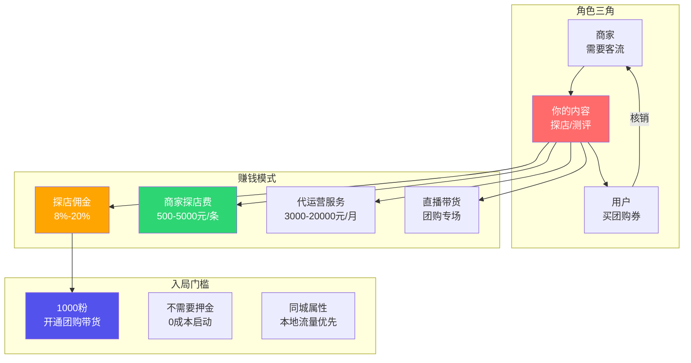
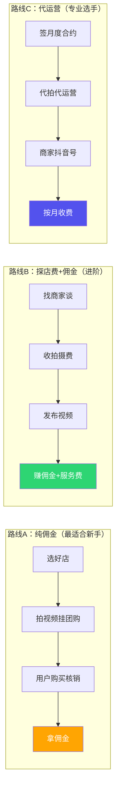
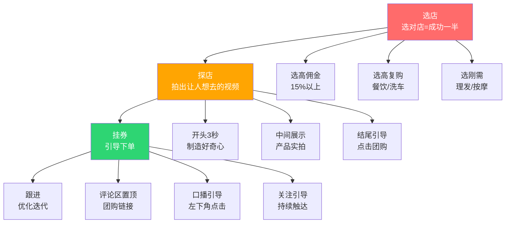

# 📕 Day21: 抖音本地生活

> **核心：抖音本地生活 = 用短视频/直播把线下实体店的团购券卖给同城用户。本质是「内容版大众点评 + 短视频版美团」。商家需要流量，用户需要优惠，你需要佣金——三方共赢。不需要货源、不需要发货、不需要售后，是最适合「轻资产副业」的变现模型之一。**
> 来源：抖音生活服务官方规则 + 头部探店博主拆解 + 本地生活行业报告 + 2025-2026年最新政策分析

---

## 一、一句话总结

**抖音本地生活的赚钱逻辑极其简单：你拍视频推荐一家餐厅/理发店/洗车店，用户通过你的视频链接买了这家店的优惠团购券，你就拿佣金（通常8%-20%）。没有货源压力、没有售后烦恼、不用发货——只需要会拍视频、会选店、会引导用户下单。**

2024-2025年抖音本地生活GMV突破7000亿，目标是2026年超越美团。抖音用「内容」重新定义本地生活——不是用户搜店，而是内容推店。这对普通人来说是巨大的机会窗口。

> 💡 **反生活账号做本地生活的独特优势**：反生活的内容本身就是「避坑+种草」——探店天然契合。拍「这5家网红店吃了就后悔 vs 这3家老店才是真的好吃」，既有流量又能挂团购，内容即带货。

本章和[[Day3-抖音短视频运营]]（短视频基础）、[[Day20-抖音带货与橱窗]]（带货底层逻辑）、[[Day1-小红书变现全攻略]]（变现思维）紧密关联。

---

## 二、核心框架

### 2.1 抖音本地生活变现全景



### 2.2 三条赚钱路线图



### 2.3 核心运营模型：四步成交法



---

## 三、可落地方法

### 3.1 第一步：开通团购带货权限

抖音本地生活的团购带货门槛非常低：

1. **1000粉丝** → 打开「我」→「创作者服务中心」→「团购带货」→ 申请开通
2. 如果还没1000粉 → 先做爆款内容涨粉（参考[[Day3-抖音短视频运营]]的爆款公式）
3. 开通后 → 在「团购达人广场」选品，挑选同城的商家团购
4. 拍视频时选择「添加团购组件」→ 用户看到就能直接下单

> ⚠️ **注意**：抖音本地生活目前重点在一二线城市覆盖最好，三四线也在快速铺开。如果你在三四线，反而是蓝海——竞争少、商家配合度高、开口容易。

### 3.2 第二步：选品策略（选对店赚到钱）

选店比拍片重要100倍。即使是同样的拍摄水平，选不同的店收入可以差10倍。

**新手选店优先级排序：**

| 优先级 | 店铺类型 | 佣金率 | 核销率 | 推荐理由 |
|:------:|---------|:-----:|:-----:|---------|
| ⭐⭐⭐⭐⭐ | 连锁餐饮（火锅/奶茶） | 8%-12% | 30%-50% | 品牌自带流量，用户信任度高 |
| ⭐⭐⭐⭐ | 本地老店（面馆/小吃） | 15%-25% | 20%-35% | 佣金高，容易出爆款 |
| ⭐⭐⭐ | 休闲娱乐（按摩/KTV） | 15%-30% | 15%-25% | 佣金极高，但核销稍低 |
| ⭐⭐⭐ | 美容美发 | 20%-40% | 10%-20% | 佣金最高，但需要精准粉丝 |
| ⭐⭐ | 亲子/教育 | 10%-20% | 5%-15% | 需要特定粉丝群体 |

**选店实操清单：**
1. 打开抖音 → 「同城」→ 看看哪些店正在投广告（说明预算充足）
2. 在「团购达人广场」筛选「高佣金」+「高销量」的团购
3. 去大众点评看评分——4分以下不推荐，4.5分以上优先
4. 看评论——评论里有差评的，反而是反生活账号的好素材（对比测评）
5. 同一个商圈选3-5家同品类店 → 做横向测评

### 3.3 第三步：爆款探店视频公式

**公式一：「反差型」探店（最适合反生活账号）**

```
开头：这家店评分4.9分，我吃了第5口就想骂人...
中间：上菜→吃→真实反应（难吃的做表情，好吃的真吃）
结尾：总结推荐/不推荐 + 挂团购链接
```

**公式二：「榜单型」探店**

```
开头：永康路这5家店，只有第3家值得排队1小时
中间：逐一展示+快速点评+打分
结尾：TOP1推荐 + 挂团购链接 + 关注领完整榜单
```

**公式三：「避坑型」探店**

```
开头：XX商圈10家网红店，我帮你踩了9个坑
中间：踩坑展示（生肉、难吃、贵）vs 推荐展示（好吃、便宜）
结尾：唯一推荐 + 团购链接
```

**视频拍摄的黄金法则：**
- **前3秒必须抓人**：用疑问句或者反常识开头
- **中间15-20秒**：展示产品的重点画面，不要超过3个要点
- **最后5秒**：直接说「左下角团购比店里便宜XX块」
- **字幕必须加**：不看字幕听不懂的，直接划走
- **背景音乐**：用抖音热歌，但音量要低于人声

### 3.4 第四步：引导成交的技巧

挂团购不是挂上去就完事，需要主动引导：

1. **视频内口播**：说「左下角团购只要XX块，比店里便宜一半」
2. **评论区置顶**：发布后自己在评论区写「团购链接在我主页/左下角」，置顶
3. **评论区互动**：回复「怎么买」「在哪」时，直接回复团购口令
4. **引导关注**：说「我每周都帮大家踩坑，关注我不吃亏」
5. **发布时机**：餐饮类 → 周三/周四发（用户周末前做决策）；休闲类 → 周末发

### 3.5 进阶：反向谈商家

当你粉丝到5000-10000粉，可以主动找商家谈合作：

**谈判话术模板：**
```
老板你好，我是做抖音探店的XX，目前在XX城市有1万同城粉丝。
我每条视频平均播放量2-3万，之前推的XX店带来了XX个团购订单。
我想帮你拍一条探店视频，看看能不能合作：
方案A：免费拍摄，团购佣金我拿X%（纯佣金模式）
方案B：300元拍摄费 + 佣金对半分
方案C：800元一条，不含佣金（适合预算足的店）
```

**商家痛点切入点：**
- 「你店的团购券挂上去了没人买对吗？我来帮你带货」
- 「我拍的视频每条都有几千播放，等于免费帮你打广告」
- 「同城粉丝进的店，复购率很高的」

### 3.6 反生活账号探店案例

我来给你设计一个反生活账号做本地生活的具体案例：

**选题**：《永康路这5家网红店，我踩雷4家，只有1家值得吃》

**开头画面**：手持相机走在永康路上，「今天带你们探店5家网红店——别轻易信点评软件」
（反生活的核心：揭露真相，建立信任）

**中间结构**：
- 店1：盲目跟风点招牌菜 → 难吃 → 价格贵
- 店2：装修好看但食物一般 → 不值得排队
- 店3：OK但不如XX家 → 有更好的选择
- 店4：踩雷 → 彻底翻车 → 别去
- 店5：真好吃 → 价格实惠 → 强烈推荐 → 挂团购

**结尾**：「以上纯个人真实体验。关注我，每周帮你避坑几家店，省下的钱够你吃顿好的。」
评论区置顶：「唯一推荐那家店的团购链接在这里👇（链接）」

💡 **这个内容的爆款逻辑**：前90%都在踩雷（制造悬念和共鸣），最后10%给推荐（建立权威和转化）。用户看完会觉得你真实、可信，你推荐的店他们更愿意去。

---

## 四、变现路径

### 4.1 各阶段收入预期

| 阶段 | 粉丝量 | 投入时间 | 预计月收入 | 赚钱来源 |
|:---:|:-----:|:--------:|:---------:|---------|
| 新手期 | 0-5000粉 | 每天1-2小时 | 0-500元 | 纯佣金，1-2条视频/周 |
| 成长期 | 5000-2万粉 | 每天2-3小时 | 1000-5000元 | 佣金+偶尔探店费 |
| 成熟期 | 2万-10万粉 | 每天3-4小时 | 5000-20000元 | 佣金+探店费+小代运营 |
| 专业期 | 10万粉+ | 全职 | 2万-10万+ | 佣金+广告费+代运营+培训 |

### 4.2 赚钱模式详解

**模式一：纯佣金（基础收入）**
- 无需谈判，拍视频挂团购即可
- 一条爆款视频（50万播放）佣金可达1000-5000元
- 持续3-6个月都有进账（团购有效期长）
- **年化：普通玩家月入3000-8000元**

**模式二：探店费（进阶收入）**
- 粉丝5000+就可以尝试
- 小餐饮：200-500元/条
- 中高端：500-2000元/条
- 连锁品牌：2000-5000元/条
- **年化：月均探店费5000-15000元**

**模式三：代运营（核心收入）**
- 帮商家代运营抖音号，发探店内容
- 基础包（月发4条）：3000-5000元/月
- 标准包（周发2条）：5000-10000元/月
- 旗舰包（日发1条）：10000-20000元/月
- 同时服务3-5家店 → **月入过万很稳**
- **年化：代运营月入1.5万-5万元**

**模式四：直播团购（爆发收入）**
- 直播探店或团购专场
- 一小时直播佣金可达500-2000元
- 结合福袋+限时优惠提升转化
- **年化：直播月入3000-15000元**

### 4.3 和反生活账号的结合

反生活账号做本地生活，是**天作之合**：

1. **内容调性完全一致**：反生活=避坑+揭秘，探店=测评+推荐
2. **信任度是杀手锏**：你之前辟谣的粉丝，会对你的推荐更信任
3. **变现路径最短**：小红书种草→闲鱼卖货（复杂）；抖音探店→团购下单（直接）
4. **低成本试错**：拍一条视频不需要成本，没流量也不亏

**建议路线图：**
- 前1-2周：免费拍3-5家店（选佣金高的），熟悉流程
- 第3-4周：出1条爆款（至少5万播放），用数据去谈探店费
- 第2个月：同时服务2-3家店的代运营
- 第3个月：稳定月入5000+，可以考虑加开直播

---

## 五、行动清单

### 🚀 今天能做的3件事

**① 开通团购带货（15分钟）**
- 打开抖音 → 我 → 三条杠 → 创作者服务中心 → 团购带货
- 如果没到1000粉，先发3条同城内容快速涨粉
- 到了1000粉就申请开通

**② 选3家店准备探店（30分钟）**
- 打开抖音同城页，看看哪些餐饮店在做广告
- 去团购达人广场，筛选「高佣金+高销量」
- 去大众点评看评分，选3-5家4.5分以上的
- 在评论区/大众点评看看用户的真实评论，找选题灵感

**③ 拍第一条探店视频（1-2小时）**
- 选一家店，买一份团购套餐
- 用上述「反差型」公式拍一条15-30秒的视频
- 前3秒用「XX商圈最火的店，吃完我觉得……」开头
- 发视频时挂团购组件 + 定位店铺
- 评论区置顶：「左下角团购比店里便宜XX元」

### 关键成功指标（KPI）

| 指标 | 合格 | 良好 | 优秀 |
|:---:|:---:|:---:|:---:|
| 视频播放量 | 1000+ | 10000+ | 50000+ |
| 团购点击率 | 1% | 3% | 5%+ |
| 团购核销率 | 20% | 35% | 50%+ |
| 佣金/条视频 | 0-50元 | 50-500元 | 500-5000元 |

**记住**：本地生活是「复利生意」——你拍的每条探店视频，只要团购券不过期，就持续有人下单。一条爆款视频吃3-6个月的佣金，很常见。

### 💡 给老黄的特别建议

1. **反生活账号的风格做本地生活，比传统探店博主有优势**——用户看腻了「哇好好吃啊」的假探店，你真实说「这个不行」「那个踩雷」，反而建立信任
2. **先从自己常去的店开始**——你本来就熟悉的地方，拍出来的内容比硬探店更自然
3. **不要贪多**：第一个月专注于3-5家店，每店拍2-3条不同角度的视频
4. **重视同城标签**：发布时一定要定位店铺+带同城话题（#上海探店 #上海美食）
5. **利用闲鱼客户资源**：你有闲鱼客户，他们都是同城的——在发货时附一张「关注我抖音看本地探店」的卡片，流量直接导过来

---

> **📌 关联阅读**：[[Day3-抖音短视频运营]] | [[Day20-抖音带货与橱窗]] | [[Day11-小红书电商闭环]] | [[Day1-小红书变现全攻略]] | [[Day14-私域引流转化]] | [[Day10-闲鱼低买高卖赚钱逻辑]]
>
> **下一篇预告**：Day22 - 视频号生态——腾讯系的私域红利，微信12亿用户的视频带货机会
