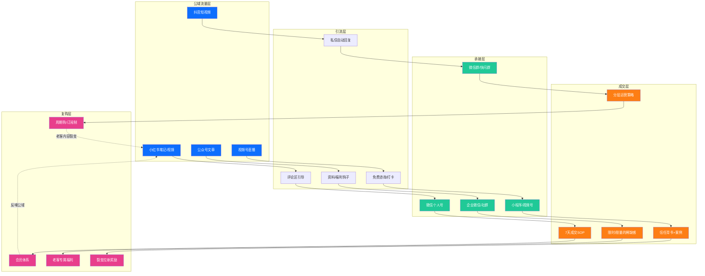
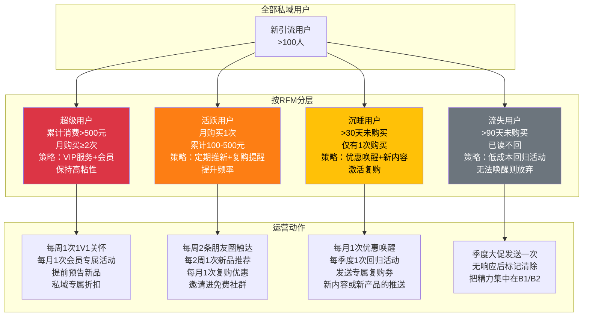

# Day22: 私域成交与复购体系设计

> 📅 学习日期：2026-07-13
> 🔗 关联笔记：[[00-目录]] | 上一篇：[[Day21-AI与自媒体内容创作融合实战]] | 下一篇：Day23
> 🎯 适用场景：反生活养生好物账号的私域成交闭环、从引流→成交→复购的全链路设计、提升单个用户LTV（生命周期价值）
> 📚 学习来源：《私域成交实战指南》《复购率提升方法论》《转化率思维》+ 小红书私域标杆账号实战分析 + 多个私域操盘手实操方法论

---

## 1. 一句话总结

**私域成交与复购体系设计 = 「引流品→信任品→利润品的三层产品矩阵」+「7天成交SOP（破冰→种草→体验→转化→追销→会员→裂变）」+「RFM模型驱动的分层复购策略（核心：让20%的高价值用户贡献80%的GMV）」+「反生活养生好物专属落地框架：用AI自动化完成70%的私域运营工作，把老黄从客服中解放出来，让私域变成一个自动运转的赚钱机器。」**

**核心认知转变：** 大部分自媒体人把80%的精力花在公域（小红书/抖音）做流量，但只赚到20%的钱；而成熟的玩家用20%的精力做流量，80%的精力经营私域，却赚到80%的钱。**公域是流量入口，私域才是印钞机。**

---

## 2. 核心框架

### 2.1 私域成交全景图——「漏斗×生命周期」双轴模型



### 2.2 私域三层产品矩阵——决定你能赚多少钱

大多数自媒体人做私域失败的根本原因：**只有一个产品，且不知道卖给谁。**

成熟的三层产品矩阵：

```mermaid
flowchart LR
    subgraph 引流层 · 9.9-49元
        A1[低成本体验装]
        A2[免费资料/课程]
        A3[低价打卡营]
        A4[核心：降低决策门槛<br/>让用户先成交一次]
    end

    subgraph 信任层 · 99-399元
        B1[核心热销单品]
        B2[组合套餐/套装]
        B3[轻度会员/社群]
        B4[核心：建立复购习惯<br/>提升用户粘性]
    end

    subgraph 利润层 · 399-1999元
        C1[高级会员/年卡]
        C2[高客单价套装]
        C3[1V1咨询/服务]
        C4[核心：赚取最大利润<br/>服务高价值用户]
    end

    A1 --> B1 --> C1
    A2 --> B2 --> C2
    A3 --> B3 --> C3
    A4 --> B4 --> C4

    style A1 fill:#20c997,color:#fff
    style A2 fill:#20c997,color:#fff
    style A3 fill:#20c997,color:#fff
    style A4 fill:#20c997,color:#fff
    style B1 fill:#fd7e14,color:#fff
    style B2 fill:#fd7e14,color:#fff
    style B3 fill:#fd7e14,color:#fff
    style B4 fill:#fd7e14,color:#fff
    style C1 fill:#dc3545,color:#fff
    style C2 fill:#dc3545,color:#fff
    style C3 fill:#dc3545,color:#fff
    style C4 fill:#dc3545,color:#fff
```

**关键数据**：有3层产品的私域，单个用户LTV（生命周期总价值）是只有1个产品私域的**5-8倍**。

**反生活专属产品矩阵设计：**

| 层级 | 价格带 | 产品举例 | 毛利 | 复购周期 | 目的 |
|:----|:-----:|:--------|:---:|:-------:|:----|
| **引流品** | 9.9-29元 | 泡脚包试用装、养生茶单次装、助眠茶包3枚装 | 40-60% | 7-14天 | 破冰，让用户第一次付款 |
| **信任品** | 99-199元 | 30天养生套餐（泡脚包+茶包+按摩贴）、颈椎按摩仪、护眼仪 | 50-70% | 30-45天 | 建立使用习惯，锁定复购 |
| **利润品** | 399-899元 | 90天养生季卡、高端护颈枕礼盒、年度养生方案包 | 60-80% | 90天 | 赚大头利润，服务精准用户 |
| **裂变品** | 免费/奖励 | 推荐朋友各得20元代金券、3人拼团价 | - | 每次裂变 | 低成本获新客 |

### 2.3 私域成交的底层逻辑——「信任递进公式」

```
成交 = 触点数量 × 价值密度 × 信任系数
         ──────────────────────────
                  决策阻力
```

**四个变量拆解：**
- **触点数量**：你在用户面前出现的次数（朋友圈+私聊+社群+视频号），私域里每周至少触达用户6-10次
- **价值密度**：每次触达提供的价值（有用信息/优惠/情感共鸣），每次触达必须有至少一个价值点
- **信任系数**：人设真实度 + 专业度 + 用户证言，这是最难复制的能力壁垒
- **决策阻力**：价格 + 决策复杂度 + 更换成本，引流品要把阻力降到最低

> **反生活实战应用：** 用户从小红书加你微信后，7天内你不要卖东西。每天发一条有价值的朋友圈+一个群分享（养生知识/打工人日常/产品使用技巧），第8天才开始推引流品。这叫「先给价值，再谈生意」。

---

## 3. 可落地方法

### 3.1 ⭐【反生活核心SOP】7天私域成交流程——从加到微信到第一次成交

这条SOP是今天笔记最核心的行动框架——**严格按照这个流程操作，从加好友到第一次成交的转化率保守估计在25-35%。**

#### 第1天：破冰与分类（目的：建立第一印象 + 打标签）

```
用户从小红书加了你的微信后，第一时间做3件事：

① 自动通过好友 + 发欢迎语（别发「你好，我是xx」，有用吗？没有）
   欢迎语模板：
   「👋 嗨，我是反生活的老黄！专注研究打工人养生多年。
   送你一份见面礼🎁：【《打工人办公室养生手册》.pdf】（内含12个简单有效的办公室养生小技巧）
   直接点链接自取👇
   {领取链接}
   
   想先问你一个问题：你目前最困扰的职场健康问题是？【多选】
   1️⃣ 颈椎酸痛
   2️⃣ 失眠/熬夜
   3️⃣ 眼睛干涩
   4️⃣ 久坐腰酸
   5️⃣ 压力大/焦虑
   
   （回复数字就行，我根据你的情况推荐最适合的养生方案）」

② 用户回复后 → 按痛点打标签
   标签示例：
   - #颈椎 #久坐族 #程序员
   - #失眠 #熬夜党 #打工人
   - #眼干 #屏幕党
   - #压力大 #情绪管理
   
③ 记录用户信息到微信备注
   格式：反生活 | 颈椎+失眠 | 7/13加入 | 来源：小红书
```

**关键原则：第一天绝对不卖货。** 只做两件事——给价值（手册）+ 打标签（为后续精准推荐打基础）。

#### 第2-3天：持续种草（目的：建立信任 + 展示专业度）

```
每天在朋友圈发2-3条内容，不推销产品，只分享价值：

朋友圈排期模板：
早上 8:00 → 养生知识/冷知识（「一个很多人不知道的颈椎报警信号」）
中午 12:30 → 打工人日常+养生碎片（「午休时间做这个动作，比喝咖啡提神3倍」）
晚上 21:00 → 个人生活/真实状态（「加班到这个点，来一包助眠茶」）

同时，给已打标的用户手动发一条针对性的内容（不要群发模板）：
- 标签#颈椎 → 私聊发：「老哥，我刚看到一个办公室颈椎放松的小视频，特别适合你这种久坐的，发你看看→{视频链接}」
- 标签#失眠 → 私聊发：「我昨晚试了个新的助眠方法，真的有效，分享给你试试→{方法}」

注意：私聊内容必须是个性化的、免费的价值——不要带任何产品链接。
```

#### 第4-5天：建立场景关联（目的：把痛点→产品→需求串起来）

```
朋友圈内容开始从「纯知识」过渡到「知识+产品场景」：

示例朋友圈：
「有人说养生茶是智商税，我也这么觉得——直到上周三加班到凌晨1点，
泡了一包菊花枸杞茶（我桌上常备），喝完之后居然能睡着了。
以前我也觉得养生茶没用，后来发现是——你得在对的场景用对的产品。」

这条朋友圈的拆解逻辑：
① 先共鸣（「有人说...我也觉得...」）→ 降低防御
② 讲故事（「直到上周三...」）→ 真实场景
③ 转折+结果（「居然能睡着了」）→ 暗示价值
④ 不直接推销（没有购买链接，只是分享）→ 保持信任
```

#### 第6天：推出引流品（目的：实现第一次成交）

```
经过前5天的「只给价值不推销」，用户已经对你有一定信任。
第6天正式推出引流品：

推出方式一（朋友圈）：
「上周好几个小伙伴问我用的什么泡脚包/养生茶/按摩仪，我整理了一份
👉【反生活亲测有效的办公室养生好物清单】
包含：我亲自用过的5个好物 + 使用场景 + 避坑指南
感兴趣的直接回复「清单」💪」

推出方式二（私聊，仅限标签匹配的用户）：
「老哥，最近我搞了一波养生体验包，里面是3种我自用的产品小样
（助眠茶3包+泡脚包2包+眼贴2片），价格就一杯奶茶钱9.9包邮。
你试试看，用得好再找我。 → {链接}」

注意：引流品一定要超值——用户花9.9元，拿到价值50元以上的体验。
第一次交易的目标不是赚钱，是让用户完成「付费动作」。
```

#### 第7天：体验跟踪+追销（目的：转化到信任品）

```
用户下单引流品后：

① 发货后：私聊告知物流，再加一条使用建议
② 用户收到后：私聊询问体验
   「泡脚包收到了吗？建议先用热水泡10分钟再放包，效果更好」
③ 用户反馈好用 → 顺势推出信任品
   「这款体验装感觉怎么样？如果喜欢的话，我这有30天完整版套装，
   原价199，第一次买给你99包邮，送一份养生指南。」

关键指标：引流品→信任品的转化率应该做到40%以上。
```

**7天流程的数据推演：**

| 步骤 | 操作 | 用户数量 | 转化率 | 转化后 | 收入估算 |
|:----|:----|:-------:|:-----:|:------:|:-------:|
| 加微信 | 小红书引流 | 100人/周 | - | 100人 | - |
| 破冰+标签 | 欢迎语+回复 | 100人 | 80%回复 | 80人有标签 | - |
| 种草 | 朋友圈+私聊价值 | 80人 | - | 80人有感知 | - |
| 场景关联 | 故事型朋友圈 | 80人 | - | 80人有认知 | - |
| 引流品推出 | 9.9元体验包 | 80人 | 30%购买 | 24人付款 | 237.6元 |
| 追销信任品 | 99-199元套装 | 24人 | 40%升单 | 10人升级 | 990-1990元 |
| **7天总计** | 从0到1 | 100人进私域 | - | - | **≈ 1500-2200元** |

> **关键认知：** 100个私域用户，7天产出约2000元。如果每天引流10人，一个月引流300人，月私域收入 ≈ 6000-8000元。当私域积累到1000人时，月收入 ≈ 2-3万元。**这就是为什么说私域是印钞机。**

### 3.2 ⭐ RFM分层复购体系——让20%用户贡献80%收入

绝大多数人的私域运营犯同一个错误：**对所有用户一视同仁。** 结果就是：重要的用户没照顾好，不重要的用户浪费了大量精力。

#### RFM模型简介

| 维度 | 全称 | 含义 | 用户分层 | 运营策略 |
|:---|:----|:----|:--------|:--------|
| **R** | Recency | 最近购买时间 | 7天内 | 活跃期，主推复购 |
| **F** | Frequency | 购买频率 | 月购买≥2次 | 高粘性，追销+会员 |
| **M** | Monetary | 消费金额 | 累计消费金额 | 高质量用户重点服务 |

#### 反生活私域用户分层运营框架



#### 反生活RFM实操模板

**超级用户（B1层）——每月手动维护2-3次**

超级用户是你的「命根子」——100个超级用户就可能贡献你月收入的50%以上。

```markdown
超级用户私聊模板（每周一次，不要群发感）：

「黄姐/哥，这个月的养生套装还够用吗？
最近又试了个新产品（颈椎贴/新款养生茶/升级版按摩仪），
觉得特别适合你这种经常加班的情况，
我给你留了一份体验装，下次买的时候一起寄过去。」

关键：
1. 称呼可以个性化（微信备注里有信息）
2. 先关心使用体验，再推新品
3. 给的是「体验装」不是「购买链接」
4. 不用抢的，是给你留的——制造稀缺感
```

**活跃用户（B2层）——每周系统化触达**

```markdown
活跃用户触达节奏（每周）：
周一：朋友圈发养生知识（价值输出）
周三：朋友圈发使用场景/个人体验（种草）
周五：社群/私聊推新品或优惠（转化）
周末：互动型朋友圈（投票/问答/抽奖）

每月一次的复购优惠：
「这个月老客专属福利——满199减30，满399减80。仅限本月老客。」
```

**沉睡用户（B3层）——每月唤醒一次**

```markdown
沉睡用户唤醒模板（不要一来就说优惠，先给价值）：

「好久不见！我最近整理了一份《职场人夏季养生全攻略》，
包含了11个超实用的办公室养生小技巧。
免费分享给你，链接在这里👇
{链接}

另外，如果上次买的养生茶/泡脚包用完了，
现在有老客回归优惠—满100减20，限时3天。{优惠券链接}」
```

### 3.3 AI自动化的私域运营——每天只花15分钟

老黄最担心的是：私域运营太耗时间。**好消息：AI可以把私域运营的工作量减少70%。**

#### AI私域运营工具栈

| 环节 | 工具 | 功能 | 每天耗时 |
|:----|:----|:----|:-------:|
| **朋友圈内容** | Claude/ChatGPT批量生成 | 一次性生成一周的朋友圈内容（7-14条） | 10分钟/周 |
| **私聊话术** | Claude生成模板 | 根据不同用户标签生成个性化话术库 | 15分钟/周 |
| **用户数据分析** | 自动表格+AI分析 | RFM分层自动更新 | 5分钟/周 |
| **社群运营** | 群公告+定时发送 | 早安打卡、知识分享定时推送 | 0分钟（自动化） |
| **客服回复** | 企业微信自动回复 | 常见FAQ自动回复 | 0分钟（自动化） |
| **总计** | - | - | **15-20分钟/天** |

#### AI生成朋友圈内容SOP

```markdown
## 批量生成一周朋友圈提示词（复制到Claude）

你是一个养生好物品牌的朋友圈运营专家。请为「反生活」账号生成一周的朋友圈内容。

【品牌定位】
- 养生好物品牌，专注打工人办公室养生
- 风格：真实、不做作、有温度的产品分享
- 不是硬广，是「我用了有效才推荐」

【要求】
1. 每天生成2条（一条知识型，一条场景型）
2. 每条约50-80字
3. 语气：朋友聊天，不要官方感
4. 不能直接说「快来买」，要说「如果你也...可以看看」

【本周产品】{根据反生活当前主推产品填写}

请输出7天×2条=14条朋友圈文案。
格式：第X天 · 早上/晚上 + 文案内容
```

#### AI私聊话术库

生成一次，按标签分类调用：

```markdown
## 创建私聊话术模板提示词

你是一个私域转化专家。请为以下场景生成5个私聊话术模板：

【用户痛点】颈椎酸痛
【产品】颈椎按摩仪/护颈枕
【前情】用户已加微信3天，已发过养生手册，尚未购买

【要求】
1. 语气自然，像朋友聊天
2. 先关心用户的真实情况，再提产品
3. 每个话术不超过100字
4. 不要有销售感

请输出5个不同的私聊切入话术。
```

### 3.4 反生活私域转化率提升的5个细节优化

这些细节是很多人在做私域时忽略的，但效果立竿见影：

**① 头像+朋友圈背景 = 第一印象决定信任度**
- 头像：用真人头像（或者真实的半身照），不要用产品logo
- 朋友圈背景：放你的主推产品+一句话品牌主张
- 朋友圈封面：让人一眼知道你卖什么、你有什么价值

**② 朋友圈不要全是产品**
```
错误比例：7条朋友圈 → 5条产品广告 + 2条生活
正确比例：7条朋友圈 → 3条价值内容 + 2条生活状态 + 2条产品种草
产品不超过30%，这叫「适度营销」。
```

**③ 永远不要群发**
```
用户能区分「群发」和「真人的」：
- 群发：「您好，感谢您添加...今天给您推荐我们的新品...」
- 真人：「老王上次说颈椎疼，我找到个好东西，给你看看」

群发一次，信任减半。群发两次，直接拉黑。
```

**④ 制造稀缺感，而不是紧迫感**
```
❌ 紧迫感：「限时优惠，只剩最后3小时！赶紧下单！」
（用户感受：你在催我，你在急）

✅ 稀缺感：「这次进货只进了50份体验装，已经有30个朋友领了，
还剩最后20份，想要的说一声就行。」
（用户感受：好东西不多，我得抓紧）
```

**⑤ 每次交易后都是下一次交易的开始**
```
用户下单后（无论多少钱），立即做3件事：
1. 感谢+确认：「收到了，预计XX到货」
2. 使用建议：「第一次用建议先...」
3. 埋下复购钩子：「这次体验装大概可以用7天，用完觉得好的话，
   正式装20袋99元，比体验装划算很多，到时候跟你说一声。」
```

---

## 4. 变现路径

### 4.1 私域成交的收益模型

```mermaid
graph TB
    subgraph 私域用户增长
        A[公域引流<br/>每天10-20人]
    end

    subgraph 第一阶段<br/>0-500人私域
        B1[用户沉淀<br/>3-6个月]
        B2[引流品转化<br/>30%]
        B3[月收入<br/>3000-8000元]
    end

    subgraph 第二阶段<br/>500-2000人私域
        C1[用户沉淀<br/>6-12个月]
        C2[信任品转化<br/>20%已有用户升级]
        C3[月收入<br/>1-3万元]
    end

    subgraph 第三阶段<br/>2000-5000人私域
        D1[用户沉淀<br/>12-24个月]
        D2[利润品+复购<br/>复购率>40%]
        D3[月收入<br/>5-10万元]
    end

    A --> B1
    B1 --> B2 --> B3
    B3 --> C1
    C1 --> C2 --> C3
    C3 --> D1
    D1 --> D2 --> D3

    style B3 fill:#ffc107,color:#000
    style C3 fill:#20c997,color:#fff
    style D3 fill:#dc3545,color:#fff
```

### 4.2 反生活私域变现路径拆解

#### 路径一：产品直售（最稳定，适合任何阶段）

| 产品 | 售价 | 毛利 | 卖1份赚 | 月销100份 |
|:----|:----:|:----:|:-------:|:---------:|
| 引流品·体验包 | 9.9元 | 40% | 4元 | 400元 |
| 信任品·30天套装 | 99-199元 | 55% | 55-110元 | 5500-11000元 |
| 利润品·季卡 | 399-899元 | 65% | 260-585元 | 26000-58500元 |

**推荐策略：** 每个月锁定30个新用户加到私域 → 其中10个买引流品 → 5个升级到信任品 → 1-2个买利润品。月收入 ≈ 1000元（引流）+ 5000元（信任品）+ 5000元（利润品）= **约1.1万元/月**。

#### 路径二：社群付费（高粘性，适合500+粉后）

| 社群形式 | 价格 | 权益 | 预期转化率 |
|:--------|:----:|:----|:---------:|
| 免费养生打卡群 | 免费 | 每日打卡+知识分享 | 引流到付费 |
| 月度养生营 | 29.9元/月 | 定制食谱+打卡+答疑 | 5-10% |
| 年度会员 | 199元/年 | 新人礼盒+每月新品+专属折扣 | 社群人数的3-5% |

**社群模式的关键：** 免费群用来沉淀用户+建立信任，付费群用来深度转化。100个免费群用户，每月可能有5-10人转付费。

#### 路径三：分销/联名（放大收入）

当私域体量达到500人以上时，可以做分销：
- 卖其他养生达人的课程（拿佣金20-30%）
- 与养生品牌联名（品牌出产品，你出用户）
- 你的用户推荐新用户（双方各得10元代金券）

### 4.3 私域关键运营指标

| 指标 | 计算方式 | 及格线 | 健康线 | 优秀线 |
|:----|:--------|:-----:|:-----:|:-----:|
| **加微率** | 加微信/小红书粉丝 | 5% | 10% | 20% |
| **引流品转化率** | 购买引流品/加微人数 | 15% | 25% | 40% |
| **信任品升单率** | 购买信任品/购买引流品 | 20% | 35% | 50% |
| **月复购率** | 本月购买/上月购买 | 20% | 35% | 50%+ |
| **LTV** | 用户生命周期总消费 | 100元 | 300元 | 500元+ |
| **获客成本** | 引流花费/加微人数 | 5元 | 2元 | 0元（纯自然流） |
| **私域GMV/月** | 私域总销售额 | 3000元 | 1万元 | 3万元+ |

### 4.4 私域vs公域的收入对比

| 维度 | 纯公域（小红书/抖音） | 公域+私域 |
|:----|:-------------------|:---------|
| 流量稳定性 | ⚠️ 平台算法随时变，流量说没就没 | ✅ 微信用户是你的，跑不了 |
| 收入天花板 | 依赖单条爆款 | ✅ 用户越多收入越高，指数增长 |
| 利润率 | 50-60% | ✅ 70-80%（省去平台抽成+反佣） |
| 用户忠诚度 | 低（用户划走就忘） | ✅ 高（日常触达建立信任） |
| 时间投入 | 每天2小时做内容 | ✅ 每天2小时内容+15分钟私域 |
| 风险 | 封号=归零 | ✅ 多个私域账号分散风险 |
| **月收入预估** | 0-5000元（1000粉） | 5000-3万元（1000粉私域） |

> **核心结论：** 同样1000粉丝，纯做公域月赚0-5000元，搭配私域可以做到5000-3万元。**私域不是替代公域，而是在公域的基础上再叠一层收入。**

---

## 5. 行动清单

### ✅ 行动①：今天建立反生活的「私域产品矩阵」（1小时）

这是今天最重要的启动动作——**先把货架搭好，再考虑怎么卖。**

```markdown
## 反生活私域产品矩阵搭建清单

### Step 1：确定引流品（必须今天定下来）
选择标准：成本低（<6元）、效果好（用过都说好）、易复购
推荐选项：
□ 养生茶3枚体验装（成本约3元，售价9.9元）
□ 泡脚包2包体验装（成本约5元，售价9.9元）
□ 眼部贴2对体验装（成本约4元，售价9.9元）
□ 综合体验包（茶+泡脚+眼贴全集，成本约12元，售价19.9元）

### Step 2：确定信任品（3-5个核心SKU）
□ 30天养生套装（主打，建议第一个做）
□ 颈椎按摩仪（高客单价，搭配体验装）
□ 护眼仪/热敷眼罩（办公室场景）
□ 助眠茶30天装（容易复购）

### Step 3：确定利润品（1-2个高客单价）
□ 90天养生季卡（399-599元）
□ 年度养生方案+月度礼盒（899-1299元）

### Step 4：定价和拍照
□ 每个产品确定售价+成本+毛利
□ 每个产品拍3-5张实拍使用图
□ 每个产品写3个版本种草文案（朋友圈/私聊/社群）
```

### ✅ 行动②：创建「反生活私域运营SOP文档」（今天花1小时）

把这个文档创建为反生活的标准操作手册，以后每天照着做就行：

```markdown
## 反生活私域运营SOP

### 每日必做（15分钟）
□ 早上：发1条朋友圈（养生知识型）
□ 中午：发1条朋友圈（使用场景/个人体验）  
□ 晚上：回复所有私信（5分钟内回复）
□ 睡前：记录新增用户数和标签

### 每周必做（30分钟）
□ 周一：生成一周朋友圈内容（AI辅助）
□ 周三：检查RFM分层，给超级用户发关怀
□ 周五：推本周主打产品
□ 周日：本周数据复盘（引流人数/转化率/收入）

### 每月必做（1小时）
□ 月初：设定本月收入目标
□ 月中：超级用户电话或深度私聊
□ 月末：财务复盘+下月计划

### 每季度必做（2小时）
□ 产品矩阵更新（淘汰卖得差的，引入新的）
□ 用户满意度调研（发问卷或私聊10个用户）
□ 调整引流策略（哪个平台引来的用户质量最高？）
```

### ✅ 行动③：从今天开始，每加一个用户就执行「7天成交SOP」（持续行为）

不需要等到完美再开始。**今天起，每有一个新用户加微信，就开始执行第3.1节的7天SOP。**

```markdown
## 今日自检清单（完成下面3件事就算今天过关）

□ 我选好了反生活的引流品是什么（9.9元体验装）
□ 我写好了欢迎语模板（包含价值+标签提问）
□ 我准备好了一周的朋友圈内容模板（7-14条）

⬆️ 完成上面3件事，今天就算落地成功了。
剩下的细节可以在未来1周逐步优化。
```

> **最后一句大实话送给老黄：**
> 
> 很多人做私域失败，因为总想「准备好了再开始」——把产品矩阵做到完美、把话术打磨到极致、把社群搭建好再引流。
> 
> **正确做法是：今天先定一个引流品 → 今天写欢迎语 → 今天就发第一条朋友圈。** 
> 哪怕产品只有1个、欢迎语很草率、朋友圈只有5个好友看到。
> 
> 先动起来，在行动中优化，而不是在规划中完美。
> 私域的核心不是「怎么做」，而是「现在就做」。

---

> **📎 关联笔记：** 
> - [[Day04-私域引流转化]] — 公域→私域的引流策略（这篇讲怎么把人加过来）
> - [[Day21-AI与自媒体内容创作融合实战]] — AI提效私域运营的方法论
> - [[Day19-用户心理与行为设计]] — 理解用户决策心理，提升转化率
> - [[Day18-多平台变现矩阵]] — 公域+私域的综合变现框架
