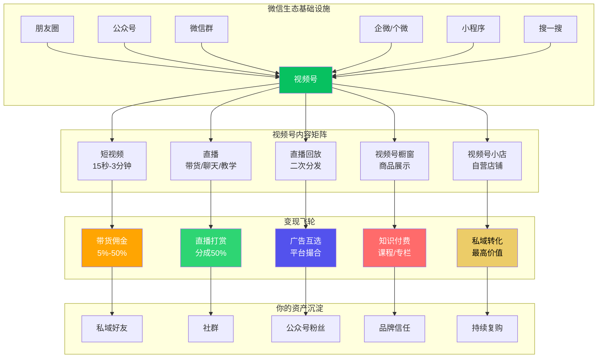
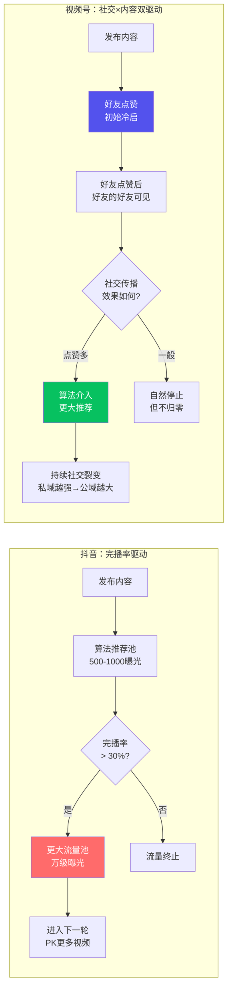
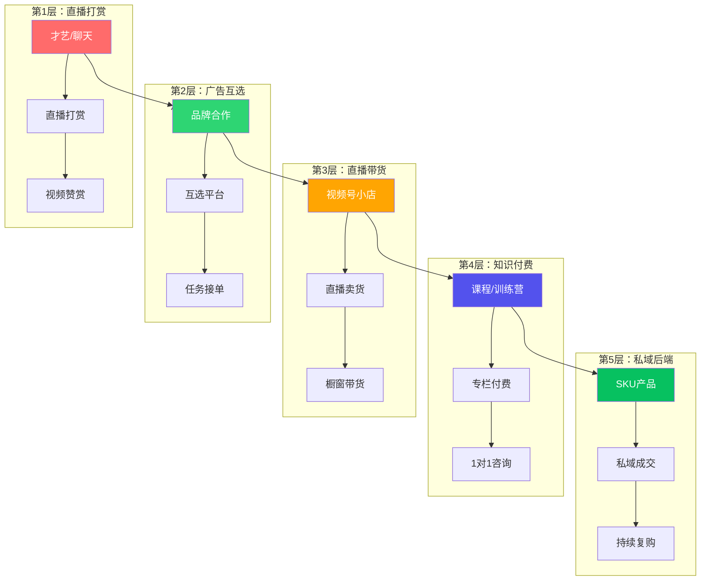

# 📕 Day22: 视频号生态

> **核心：视频号不是"第三个短视频平台"——它是微信生态的「内容连接器」。抖音做"杀时间"，视频号做"连接关系"。视频号的本质是「社交推荐×内容推荐」的双引擎分发，私域流量天花板最高、公域流量还在膨胀期。对普通人来说，这是2025-2026年最大的结构性红利：拼的不是内容多专业，而是「怎么把微信关系链用起来」。**
> 来源：微信公开课PRO 2024-2025 + 视频号创作者生态白皮书 + 头部视频号玩家案例拆解 + 微信生态行业报告

---

## 一、一句话总结

**视频号是微信生态腹地的「内容高速公路」。它不是抖音的竞争对手，而是微信基础设施的升级——让10亿微信用户不用跳出App就能刷视频、买东西、看直播、建信任。对创作者来说：视频号的独特价值不是"做爆款"，而是"做信任资产"——视频号内容=你的信任货币，可以反复被微信好友推荐，沉淀到私域，最后在朋友圈和微信群成交。**

2024年视频号GMV突破3500亿，2025年目标是6000亿+。最核心的数据：**视频号订单的70%来自社交分享（好友点赞、群转发、朋友圈），只有30%来自算法推荐**——这和抖音完全相反。这意味着：不需要拍出"全民爆款"，只需要让1000个对的人看到并信任你，就能赚到钱。

> 💡 **反生活账号的视频号机遇**："反生活"在公众号/小红书已经积累了内容资产——天然适合在视频号做"真人出镜版避坑指南"。而且视频号粉丝可以直接导流到企微/个人微信，私域转化效率远超小红书和抖音。

本章和[[Day1-小红书变现全攻略]]（多平台变现思维）、[[Day3-抖音短视频运营]]（短视频底层逻辑对比）、[[Day16-公众号爆款文章公式]]（公众号与视频号联动）、[[Day15-小红书矩阵号运营]]（矩阵运营）、[[Day14-私域引流转化]]（私域承接）紧密关联。

---

## 二、核心框架

### 2.1 视频号生态全景：微信里的"内容枢纽"



### 2.2 视频号算法 vs 抖音算法——本质区别



**关键差异表：**

| 维度 | 抖音 | 视频号 |
|------|------|--------|
| 推荐核心 | 内容兴趣（标签+行为） | 社交关系（好友点赞权重极高） |
| 冷启动 | 靠算法随机分配 | 靠私域（群/朋友圈转发） |
| 内容寿命 | 1-3天，极短 | 7-30天，长尾长 |
| 用户关系 | 粉-主单向 | 好友互动+粉-主双向 |
| 私域引流 | 严打，容易被封 | 完全开放，微信生态内随便导 |
| 变现门槛 | 1000粉开橱窗 | 0粉可开直播/带货 |
| 推荐最大化 | 内容质量 | 内容质量 × 私域势能 |

### 2.3 视频号变现金字塔：5层收入结构



---

## 三、可落地方法

### 3.1 视频号内容定位三板斧

视频号用户画像（2025年数据）：**35-55岁占比超过60%，一二线城市+下沉市场并重，女性用户偏多，消费能力强。** 和抖音的年轻用户形成鲜明互补。

**适合视频号的内容类型（按流量潜力排序）：**

1. **知识/观点类**（最适合"反生活"）—— 避坑指南、省钱技巧、消费决策
   - 例：「这5样东西千万别在直播间买」「装修公司不会告诉你的10个坑」
   - 视频号上这种内容转发率极高，因为「帮朋友避坑」是社交货币

2. **情感/正能量类** —— 鸡汤、金句、人生感悟
   - 视频号中年用户最爱，转发率极高

3. **生活方式** —— 美食、旅行、家居、穿搭
   - 颜值+实用=高赞

4. **行业干货** —— 创业、投资、商业分析
   - 视频号知识类内容比抖音流量大3-5倍

5. **直播带货** —— 直接卖货（适合有货源）

### 3.2 "反生活"视频号冷启动方案（7天计划）

**前提：公众号/小红书已有内容积累，视频号从0开始**

| 天数 | 动作 | 具体操作 | 预期效果 |
|:----:|------|---------|:--------:|
| Day1 | 开通+装修 | 注册视频号、设置头像/简介（导流到公众号）、发布第一条"自我介绍" | 基础搭建 |
| Day2 | 私域冷启 | 把视频转发到所有微信群+朋友圈，@好友点赞 | 获得初始社交推荐 |
| Day3 | 第一条干货 | 把[[Day16-公众号爆款文章公式\|公众号爆款文章]]改成口播版，60秒短视频 | 评估内容匹配度 |
| Day4 | 直播试水 | 晚上8-10点，不卖货先聊天，主题"消费避坑答疑" | 建立信任 |
| Day5 | 内容密度 | 连发3条，早中晚各一条，看哪条数据好 | 摸清受众偏好 |
| Day6 | 矩阵互推 | 找3-5个同量级视频号互赞互评 | 社交推荐加速 |
| Day7 | 复盘+定调 | 分析7天数据，确定2个最有效的内容方向 | 确定主攻方向 |

### 3.3 视频号内容制作4大心法

**心法1：封面要「功利」**

抖音封面要"好奇"（勾起兴趣），视频号封面要"有用"（觉得有价值才点）。
- ✅ 好封面：「月薪5000也能用的理财方法」「买羽绒服前必看的3个参数」
- ❌ 差封面：「我震惊了」「看完这个视频我哭了」

**心法2：前3秒要「走心」**

视频号用户比抖音用户耐心更低——抖音刷到内容看3秒决定走不走，视频号看1秒。
- 开头直接说「这条内容能帮你省XX元」「我今天要说一个大多数人不愿意说的真相」
- 避免废话开场，避免慢节奏铺垫

**心法3：中间要有「干货密度」**

视频号用户是来「学东西/避坑」的，不是来「打发时间」的。
- 每15秒至少给一个「有用信息」
- 多用数字、列表、对比——「第1点...第2点...第3点...」

**心法4：结尾一定要「引导互动」**

视频号算法中，**评论权重 > 点赞 > 转发 > 收藏**
- 结尾问问题：「你觉得呢？评论区告诉我」「你遇到过这种情况吗？」
- 或用选择题诱导评论：「A方案还是B方案？我选A，你呢？」

### 3.4 视频号直播启动方案

视频号直播是**变现效率最高的形式**，但也是最难的。建议从"轻直播"开始：

**阶段一：聊天型直播（0-500粉）**
- 每周2-3次，每次30-60分钟
- 主题：分享类（"我做反生活账号3个月的10个关键发现"）
- 目的：积累直播时长+建立信任
- 不需要卖货，不需要复杂设备，手机+耳机就够了

**阶段二：答疑型直播（500-2000粉）**
- 每周1-2次，每次60分钟
- 主题：集中在"消费避坑"领域
- 穿插引导关注视频号和公众号

**阶段三：带货型直播（2000粉+）**
- 选品策略：选高佣金（20%+）、低客单价（50-200元）、高复购的商品
- 推荐品类：日用百货、食品、图书绘本、家居小物
- 反生活特有选品：「省钱好物」「避坑替代品」

---

## 四、变现路径

### 4.1 视频号的6种变现方式（从易到难）

| 方式 | 门槛 | 月收入范围 | 适合人群 | 难度 |
|:----:|:----:|:---------:|:--------:|:----:|
| 直播打赏 | 0粉可开播 | 0-3000元 | 才艺/聊天类 | ⭐ |
| 视频赞赏 | 无门槛 | 0-500元 | 任何创作者 | ⭐ |
| 广告互选 | 1000粉+内容优质 | 3000-2万 | 有一定粉丝基础 | ⭐⭐ |
| 橱窗带货 | 0粉可开通 | 1000-1万 | 会选品的创作者 | ⭐⭐ |
| 视频号小店 | 0粉可开 | 5000-5万 | 有货源/供应链 | ⭐⭐⭐ |
| 知识付费 | 有专业能力 | 1万-10万+ | 专家/老师/教练 | ⭐⭐⭐ |

### 4.2 "反生活"专属变现路线图

```
第1个月：打地基
├── 视频号同步小红书/公众号内容（一鱼多吃）
├── 每周3条短视频（内容改口播版）
├── 目标：500粉 + 搞清楚什么内容有流量
└── 预估收入：0元

第2个月：建信任
├── 每周2次聊天直播（主题：消费避坑）
├── 视频号粉丝导流到公众号+企微
├── 目标：2000粉 + 核心受众画像清晰
└── 预估收入：0-500元（打赏）

第3个月：试变现
├── 开通橱窗，挂1-2款高佣商品测试转化
├── 每月1次带货直播（小规模）
├── 目标：5000粉 + 找到转化率>3%的品
└── 预估收入：2000-5000元

第4-6个月：规模化
├── 每周1次固定带货直播
├── 品牌合作（互选广告）
├── 开始做自己的知识付费产品
├── 目标：1万粉 + 稳定月入过万
└── 预估收入：8000-2万/月
```

### 4.3 视频号 vs 抖音：该选哪个？

| 如果你 | 建议优先做 |
|--------|:---------:|
| 已经有私域基础（微信群/好友多） | **视频号** |
| 内容能力强、擅长做精致内容 | **抖音** |
| 想沉淀长期信任、做高客单价 | **视频号** |
| 想做快消品/冲动消费型带货 | **抖音** |
| 想导流到微信成交 | **视频号**（完全合规） |
| 想快速起量、靠算法推爆 | **抖音** |

**最佳策略：内容发抖音，信任建视频号。** 抖音做曝光和引流，视频号做转化和沉淀。

---

## 五、行动清单

### ✅ 今天就能做的3件事

**1. 🎬 注册并装修视频号**
   - 打开微信→发现→视频号→右上角人像→创建视频号
   - 头像：用反生活公众号的头像或你的真人头像
   - 简介模板：「消费避坑指南｜省钱干货｜反生活创始人｜关注我少花冤枉钱💰」
   - 关联公众号（设置里绑定）

**2. 📹 发布第一条视频号内容**
   - 不用重新拍！把[[Day16-公众号爆款文章公式|之前的一篇公众号爆款文章]]改口播版
   - 拍60秒以内，手机竖屏，自然光
   - 内容结构：1秒痛点+30秒干货+10秒引导关注
   - 发布后立刻转发到：朋友圈+3个微信群+好友私发（求点赞）

**3. 📊 研究对标账号**
   - 搜索3个视频号上做得好的"避坑/省钱/消费类"账号
   - 分析：他们的内容形式、点赞量、评论区互动、变现模式
   - 记录到笔记中，作为后续内容参考

### 🔄 本周额外任务

- 每天至少发1条视频号，连续7天
- 每条视频都转发到至少5个微信群
- 周末开一次30分钟的直播试水（不用卖货，就聊天答疑）

---

> **视频号不是"赌爆款"的地方，是"种信任"的地方。你今天拍的每一条内容，都在为明天的转化积蓄信任资产。做视频号的核心心态：不急、不燥、坚持发、持续播、私域接。**
