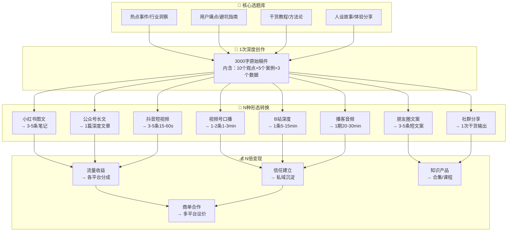
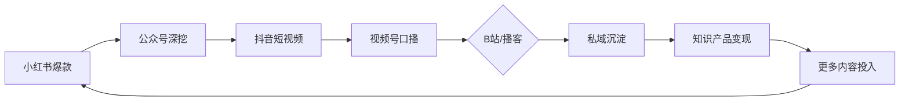
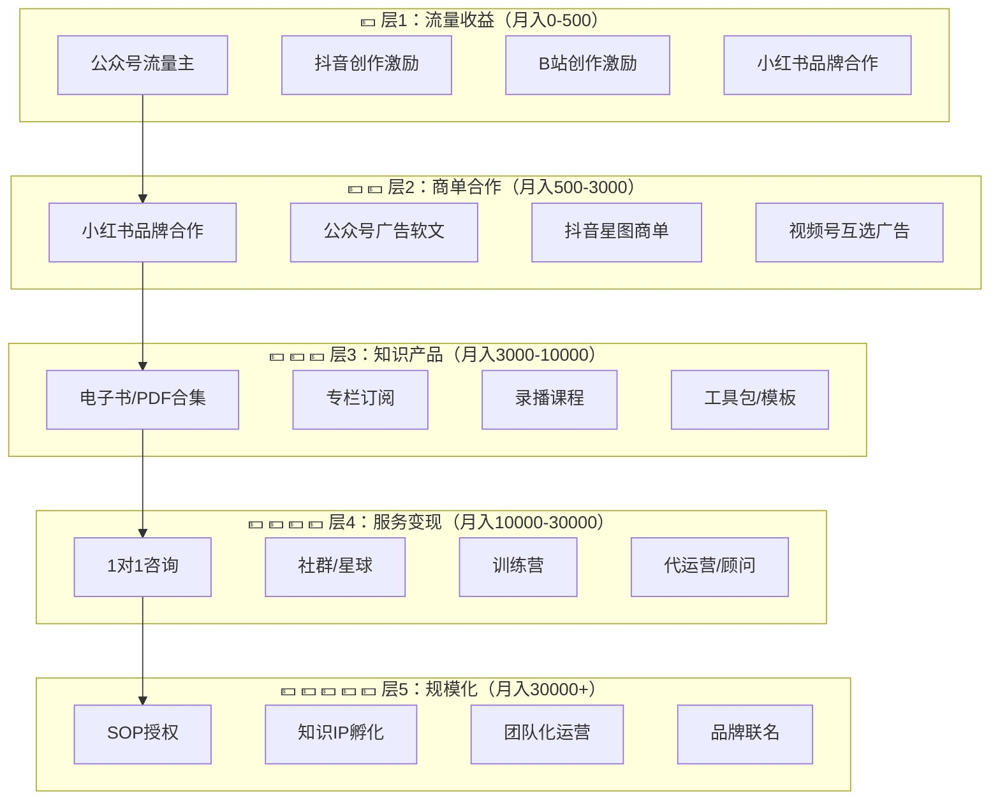

# 📕 Day23: 多平台内容复用

> **核心：内容复用的本质是「一份内容生产成本，撬动N个平台收益」。不用每次从零创作——一次深度创作，多形态分发，全平台收割。做自媒体的最大陷阱是「每个平台都重新造轮子」，高手和新手的区别不在于内容质量，而在于「内容复用率」。反生活的模式已验证：一篇避坑指南→小红书图文→公众号长文→抖音短视频→视频号口播→B站深度→播客→私域合集——7个形态，1个素材，N倍收益。**
> 来源：行业实战调研 + 多平台创作者经验整合 + 头部账号拆解

---

## 一、一句话总结

**多平台内容复用（Content Repurposing）不是「一鱼多吃」的偷懒，而是「把内容资产化」的核心能力。一个选题，根据每个平台的算法偏好、用户习惯、内容形态，做「1次深度创作+N次形态转换」，实现：50%的创作精力投入，200%的内容产出，300%的流量覆盖。**

反生活目前的情况非常典型：一篇公众号好文章阅读量只有几百，但如果拆成10条小红书避坑笔记+5条抖音短视频+1个视频号口播，每条内容触达不同的人群，总阅读量可以放大10-20倍。关键认知：**内容不仅是「文章」，而是「信息单元的组合」**——不同平台只是切割和重组方式不同。

> 💡 **老黄的铁律**：任何值得花2小时写的内容，都值得花额外30分钟做跨平台改造。不改造就是浪费素材。

本章和[[Day1-小红书变现全攻略]]（图文平台基础）、[[Day2-公众号运营与变现]]（长文平台）、[[Day3-抖音短视频运营]]（短视频平台）、[[Day22-视频号生态]]（社交推荐平台）、[[Day16-公众号爆款文章公式]]（内容结构）、[[Day15-小红书矩阵号运营]]（矩阵思维）紧密关联。

---

## 二、核心框架

### 2.1 内容复用全景：信息单元的「变形金刚」



### 2.2 四大核心模型

#### 模型一：「冰山模型」资源最低消耗

> **1次深潜 → N次浮出水面**

核心思想：把80%的精力花在选题和素材采集上（冰山水下部分），然后快速产出多个平台版本（冰山水上部分）。

```
创作精力分配：
┌────────────────────────────────────────────────┐
│  选题研究 40%  ← 一次做好，N次受益              │
│  (素材收集、框架设计、核心观点提炼)              │
├────────────────────────────────────────────────┤
│  主稿件创作 30%  ← 3000字原始稿件，最完整版     │
│  (含所有数据、案例、金句、细节)                  │
├────────────────────────────────────────────────┤
│  跨平台改造 20%  ← 每个平台15-30分钟           │
│  (调整格式、标题、开头钩子、段落节奏)            │
├────────────────────────────────────────────────┤
│  发布与互动 10%  ← 同步发布，定时互动           │
│  (评论回复、数据复盘)                           │
└────────────────────────────────────────────────┘

结果：1份时间，4-8个平台内容，效率提升3-5倍
```

#### 模型二：「管道模型」流量最大化

> **内容像水一样流经所有管道**

```
选题爆发 → 公众号首发（最完整）→ 小红书拆条（精华摘取）
         → 抖音短视频（超级浓缩）→ 视频号口播（信任背书）
         → B站深度（详细拆解）→ 播客音频（通勤场景）
         → 私域分发（精准触达）→ 朋友圈二次发酵
```

**为什么这个顺序？**

| 顺序 | 平台 | 内容形态 | 目的 |
|:----:|------|---------|------|
| 1 | 公众号 | 3000字完整版 | 建立内容深度，SEO长尾流量 |
| 2 | 小红书 | 3-5条图文 | 碎片化传播，触达女性用户 |
| 3 | 抖音 | 15-60s短视频 | 算法推荐，获取泛流量 |
| 4 | 视频号 | 1-3min口播 | 社交推荐，沉淀信任 |
| 5 | B站 | 5-15min深度 | 品牌建设，长尾搜索 |
| 6 | 播客 | 20-30min音频 | 通勤场景，深度连接 |
| 7 | 私域 | 合集/浓缩 | 直接变现 |

#### 模型三：「钻石模型」价值最大化

> **同一个信息，切出不同面，每个面卖给不同人**

```
         ┌─────────────┐
         │  原始素材    │
         │  (一颗原石)  │
         └──────┬──────┘
                │
    ┌───────────┼───────────┐
    │           │           │
    ▼           ▼           ▼
┌──────┐  ┌──────┐  ┌──────┐
│ 内容  │  │ 人设  │  │ 知识  │
│ 流量  │  │ 信任  │  │ 产品  │
└──────┘  └──────┘  └──────┘
    │           │           │
    ▼           ▼           ▼
 广告分成     私域引流    付费课程
 商单合作     品牌合作    咨询服务
```

**案例：反生活一篇「装修避坑指南」的钻石复用：**
1. **公众号** → 8000字深度文章，SEO搜索「装修避坑」排名前三
2. **小红书** → 6条图文：「装修必踩的10个坑」「最不值得花钱的5样」「最值得投资的3样」
3. **抖音** → 前15s痛点钩子「装修公司不会告诉你的3个秘密」
4. **视频号** → 真人出镜口播，结尾引导关注公众号
5. **播客** → 邀请装修博主对谈，做成「装修避坑特辑」
6. **私域** → 送「装修避坑清单」PDF，引流到社群
7. **知识产品** → 打包成「装修避坑手册」9.9元

#### 模型四：「飞轮模型」持续增长

> **每个平台的内容反向为其他平台输血**



**反生活飞轮示例：**
- 小红书一条避坑笔记火了（1000+赞）
- → 截图发朋友圈：「没想到这么多人踩坑，已写深度版放公众号」
- → 公众号深度文章带来关注和转发
- → 把核心观点录成1分钟抖音口播
- → 视频号发完整版，引导加微信领「避坑清单」
- → 私域用户收到清单，产生信任
- → 推出相关付费内容或服务
- → 收入反哺更多内容创作

### 2.3 各平台内容形态转换速查表

| 原始内容 | 小红书 | 公众号 | 抖音 | 视频号 | B站 | 播客 |
|---------|--------|--------|------|--------|-----|------|
| 3000字深度文 | 分5-8条图文，每条1-2个观点+表情包 | 原版微调 | 3-5个15s视频，每段讲1个干货点 | 1个完整口播3min | 1期深度视频15min | 1期播客20min |
| 教程/方法论 | 步骤拆解图（6宫格） | 图文混排教程 | 1个问题→1个答案 | 讲解+实操演示 | 详细教学视频 | 答疑式访谈 |
| 争议话题 | 投票+评论区引导 | 正反观点辩论 | 开头直接喷制造冲突 | 理性分析+个人立场 | 深度剖析 | 嘉宾对谈 |
| 个人故事 | 情感共鸣型笔记 | 完整叙事文 | 3段式（问题-转折-结果） | 真诚口播 | Vlog式记录 | 故事式讲述 |
| 行业数据 | 信息图+数据海报 | 图文数据报告 | 数据可视化+画外音 | 数据解读+个人观点 | 数据深度分析 | 数据解读讨论 |
| 产品测评 | 产品对比图+使用场景 | 深度评测文 | 开箱+使用体验 | 真人试用+推荐理由 | 详细评测视频 | 好物分享闲聊 |

---

## 三、可落地方法

### 3.1 反生活「一鱼多吃」内容生产线 SOP

> **从0到1建立自己的内容复用流水线**

#### 第一步：建立选题银行（每周30分钟）

```
📋 选题银行模板：
┌──────────────────────────────────────────────┐
│ 选题名称：________________________            │
│ 来源：□热点 □自己经验 □用户反馈 □同行启发    │
│ 目标人群：_________________________           │
│ 核心价值点（3个）：                           │
│   1. ________________________                │
│   2. ________________________                │
│   3. ________________________                │
│ 数据支撑：_________________________           │
│ 金句/亮点：________________________           │
└──────────────────────────────────────────────┘
```

**老黄每周六花30分钟做：**
1. 翻本周所有用户评论/私信——找出提问最多的3个问题
2. 刷同行本周爆款——找出可以「反生活角度」做的3个选题
3. 结合本周经历——找1个自己的案例
4. 填入选题银行，每周至少储备5个选题

#### 第二步：一次深度创作（每次90分钟）

选择1个最好的选题，做「深度稿件」：

```
【反生活·深度稿件模板】

标题：________________________________
（公众号版标题，SEO友好）

🔑 开头钩子（100字内）：
________________________________
（制造身份认同/痛点共鸣）

📌 核心论点（1句话）：
________________________________

📚 正文结构：
一、________________（现象/问题描述）
二、________________（原因/本质分析）
三、________________（解决方案/方法）
四、________________（案例/数据验证）
五、________________（行动号召/导流）

📊 数据/案例（3-5个）：
1. ________________
2. ________________
3. ________________

💡 金句（2-3句）：
1. 「________________」
2. 「________________」
3. 「________________」

🔗 导流设计：
公众号结尾引导语：________________
小红书评论区引导：________________
抖音结尾引导：________________
私域钩子：________________
```

#### 第三步：跨平台改造流水线（每个平台15-30分钟）

##### 改造为小红书图文

```
【反生活·小红书改编 SOP】

规则：每条笔记只讲1个核心知识点
格式：封面（吸睛标题）+ 3-6张图

改造步骤（20分钟）：
1. 从深度稿件中提取5-7个「小知识点」
   → 每个知识点变成1条独立笔记
   
2. 封面标题公式：
   ❌「如何装修避坑」→ 太宽泛
   ✅「装修公司打死不会告诉你的3个坑」→ 有冲突
   ✅「我花了20万买来的装修教训」→ 有故事
   ✅「99%的人第一套房都踩过的坑」→ 有共鸣

3. 每篇正文结构：
   - 第1段：痛点引入（最痛的那个点）
   - 第2段：我的经历/看到的现象
   - 第3段：具体方法/避坑建议
   - 第4段：互动引导（评论区见）

4. 标签策略：
   - 2个大标签（#装修 #装修避坑）
   - 2个中标签（#装修经验 #装修干货）
   - 2个长尾标签（#第一次装修 #装修小白必看）

⚠️ 避坑：
- 不要1条笔记塞太多信息
- 每条笔记必须有至少1个「关注理由」（关注我领XX清单）
- 封面字体要大、颜色要亮
```

##### 改造为抖音短视频

```
【反生活·抖音改编 SOP】

规则：前3秒定生死
格式：15-60s竖屏

改造步骤（15分钟）：
1. 从深度稿件中选1个「最反常识」的观点
   → 开场直接抛出反差
   
2. 开头钩子模板：
   「今天说一个99%的人都不知道的...」
   「你知道为什么XX是错的吗？」
   「别再XX了，XX才是正确的做法」

3. 正文结构（15-60s）：
   0-3s: 钩子+冲突
   3-15s: 抛出问题/反常识
   15-45s: 给出解决方案（2-3个要点）
   45-60s: 行动号召+引导（关注/评论）

4. 字幕要求：
   - 前3s必须有「超级大字幕」强调冲突点
   - 全流程关键信息显示在屏幕上
   - 最后显示关注引导

⚠️ 避坑：
- 不要只是念稿——要有情绪起伏
- 每个视频只讲1个知识点，讲透
- 前3s不要废话，直接上干货
```

##### 改造为视频号口播

```
【反生活·视频号改编 SOP】

规则：更信任感、更深度
格式：1-3min横竖屏均可，真人出镜

改造步骤（20分钟）：
1. 从深度稿件中选1个「有价值+能讲清楚」的主题
   → 视频号内容可以更完整、更真诚
   
2. 口播结构：
   0-15s: 「今天想跟你聊个事」
           （不是「今天教大家」，而是"朋友聊天"的语气）
   15-60s: 问题/故事展开
   60-120s: 核心观点+个人经历
   120-180s: 总结+引导关注/加微信

3. 与抖音的区别：
   - 抖音：快节奏、强冲突、高密度
   - 视频号：慢节奏、真诚感、有温度
   - 反生活可以：「今天在后台看到一个粉丝留言...」

4. 导流设计：
   - 口播中提到：「我把完整清单放在公众号了」
   - 评论区置顶：公众号链接
   - 视频结尾：引导加好友领资料
```

##### 改造为朋友圈/私域

```
【反生活·私域内容 SOP】

规则：朋友圈≠公众号，要更短更私密
格式：100-200字

改造步骤（10分钟）：
1. 从深度稿件提取1个「最有冲击力」的金句/数据/结论
   
2. 朋友圈文案模板：
   「刚写完一篇关于XX的深度文章」
   「原来XXX（反常识结论）」
   「评论区有人说XXX（用户反馈）」
   「花了3天整理了一份XX清单」
   「需要的找我领👇」
   + 文章链接/配图

3. 不同时段的私域分发：
   早上8点：发金句+配图（刷存在感）
   中午12点：发用户反馈截图（社会证明）
   晚上8点：发完整文章/深度内容（干货价值）
```

### 3.2 内容复用工具矩阵

| 工具类型 | 推荐工具 | 用途 | 价格 |
|---------|---------|------|:----:|
| 笔记工具 | Notion/飞书 | 选题银行、内容SOP | 免费 |
| AI辅助 | Claude/ChatGPT | 内容改写、多平台适配 | 月费20$ |
| 设计工具 | Canva/醒图 | 小红书封面/配图 | 免费+ |
| 视频剪辑 | 剪映 | 抖音/视频号短视频 | 免费 |
| 排版工具 | 秀米/135编辑器 | 公众号排版 | 免费+ |
| 音频制作 | 剪映/通义听悟 | 播客生成 | 免费 |
| 批处理 | Python脚本批量 | 多平台同步发布 | 自建 |
| 定时发布 | 新榜/微小宝 | 多平台定时发布 | 月费 |

### 3.3 反生活的「周更 1×7」方案

> **每周花3小时，产出7条内容，覆盖5个平台**

```
┌─────────────────────────────────────────────┐
│ 反生活·一周内容生产日历                        │
├─────────────────────────────────────────────┤
│                                              │
│ 周六 30min: 选题银行（储备5个选题）           │
│                                              │
│ 周日 90min: 深度创作（选择1个选题写3000字）   │
│                                              │
│ 周一 30min: 小红书×3笔记                      │
│ 周二 15min: 抖音×2短视频                      │
│ 周三 20min: 视频号×1口播                      │
│ 周四 10min: 朋友圈×3文案+私域分发              │
│ 周五 15min: 数据复盘+优化下周策略              │
│                                              │
│ 总投入: 3.5小时/周                            │
│ 总产出: 1篇公众号+3条小红书+2条抖音+1条视频号  │
│       +3条朋友圈 = 10条内容                    │
│ 效率提升: 比单独创作节省70%时间               │
│                                              │
└─────────────────────────────────────────────┘
```

---

## 四、变现路径

### 4.1 内容复用的5层变现模型



### 4.2 反生活内容复用的具体变现路径

#### 路径一：内容打包变现（最快起步）

**「反生活·避坑指南」系列电子书**

```
产品线：
┌─────────────────────────────────────────┐
│ 🔥 免费引流品：                          │
│ 「装修避坑入门」「省钱买菜指南」           │
│ → 私域领PDF，引流                       │
├─────────────────────────────────────────┤
│ 💰 低价利润品（9.9-19.9元）：            │
│ 「反生活·避坑指南 Vol.1」                │
│ 「反生活·省钱秘籍」                      │
│ → 10篇精华文章合集+精美排版              │
├─────────────────────────────────────────┤
│ 💎 中价服务品（99-199元）：               │
│ 「反生活·避坑训练营」——5天社群课程        │
│ 「反生活·月度行业研究报告」               │
├─────────────────────────────────────────┤
│ 👑 高价顾问品（999-2999元）：             │
│ 「反生活·个人IP陪跑计划」                │
│ → 1v1咨询+内容指导+避坑建议             │
└─────────────────────────────────────────┘

收入估算（第一步）：
- 免费引流：每天5-10人加好友
- 低价品：10%转化率，每月卖出50份 = 500-1000元
- 中价品：5%转化率，每月卖出10份 = 1000-2000元
- 合计：**月入1500-3000元**
```

#### 路径二：多平台同步变现

```
┌──────────────────────────────────────────────────┐
│ 反生活·多平台收入预测（第3个月起）                   │
├──────────────────────────────────────────────────┤
│                                                   │
│ 平台       收入方式          预估月收入            │
│ ─────      ──────           ────────              │
│ 公众号     流量主+广告        300-800             │
│ 小红书     品牌合作+带货      800-2000            │
│ 抖音       创作激励+星图      500-1500            │
│ 视频号     互选广告+直播      500-1500            │
│ 私域       知识产品+服务      1500-4000           │
│ ─────────────────────────────────                  │
│ 合计预估   |                 **3600-9800元/月**    │
│                                                   │
└──────────────────────────────────────────────────┘

注意：以上估算基于「稳定输出3个月+每篇内容都做跨平台复用」
```

#### 路径三：知识产品矩阵

**核心逻辑：1次创作 → N个产品形态**

```
同一套「避坑指南」内容 → 不同产品形态：

1. 📄 公众号合集 → 电子书（9.9元）
   已发文章整理成PDF，配目录+排版
    
2. 📹 视频教程 → 录播课（99元）
   把文章口播录成10个短视频
   每个3-5分钟
   
3. 👥 社群服务 → 训练营（199元）
   5天社群+每日任务+答疑
   
4. 🧑‍🏫 1v1咨询 → 咨询服务（999元）
   针对具体情况给方案

成本：1次深度创作+分形态改造
收益：4个产品线同时售卖
```

### 4.3 内容复用的ROI计算

```
┌────────────────────────────────────────┐
│ 📊 内容复用 vs. 单独创作的ROI对比       │
├────────────────────────────────────────┤
│                                        │
│ 方法A：每个平台单独创作                 │
│ 投入：公众号3h + 小红书3h + 抖音3h     │
│      + 视频号3h = 12h                    │
│ 产出：4条独立内容                        │
│ 效率：0.33条/小时                       │
│                                        │
│ 方法B：内容复用模式                     │
│ 投入：深度创作1.5h + 改造2h            │
│      = 3.5h                              │
│ 产出：1篇公众号+3条小红书+2条抖音       │
│      +1条视频号 = 7条内容                │
│ 效率：2条/小时                          │
│                                        │
│ ROI提升：6倍 🔥                         │
│                                        │
└────────────────────────────────────────┘
```

---

## 五、行动清单

> ✅ **今天就能做的3件事**

### 🔥 第1件事：建立你的「选题银行」（30分钟）

**打开Notion/飞书/备忘录，创建一个选题银行模板：**

```
📋 我的选题银行

| 序号 | 选题 | 来源 | 优先级 | 状态 |
|:----:|------|:----:|:------:|:----:|
| 1 | 装修公司最怕你知道的3件事 | 自己经验 | ⭐⭐⭐ | 待创作 |
| 2 | 网红家居博主不会告诉你的拍照技巧 | 同行灵感 | ⭐⭐ | 待创作 |
| 3 | 为什么你家装修超预算？ | 用户问题 | ⭐⭐⭐ | 待创作 |
| 4 | ... | | | |
```

**立刻做：**
- 翻你最近的评论/私信，找出3个最多人问的问题
- 刷5篇同行爆款内容，记录可以「反生活角度」做的选题
- 填入选题银行，设定优先级

### 🔥 第2件事：选1篇已有文章做跨平台改造（60分钟）

**从反生活公众号中选1篇阅读量最高的避坑/干货文章，做跨平台改造：**

```
行动清单：
□ 选择1篇已有公众号文章
□ 提取5个「知识点」→ 小红书笔记x3（每个1个知识点）
  - 第1条：核心观点/最大避坑
  - 第2条：具体方法/解决方案
  - 第3条：数据/案例验证
□ 提取1个「开场钩子」→ 抖音短视频x1（15-60s）
  - 前3s：制造冲突/痛点
  - 3-15s：抛出反常识观点
  - 15-60s：1个具体建议
□ 提取1个「深度观点」→ 视频号口播x1（1-3min）
  - 朋友聊天语气
  - 加入个人经历/感受
  - 结尾引导关注/加好友
□ 提取1个「金句/结论」→ 朋友圈文案x3
  - 自己经历→金句→反常识结论→引导看原文
```

**产出：1小时 → 至少5条新内容**

### 🔥 第3件事：设定你的「周更 1×7」生产计划（10分钟）

**建立你自己的周生产日历：**

```
📅 我的内容生产周历：

每周六 30min □ 选题银行（储备下周选题）
每周日 90min □ 深度创作（1篇3000字稿件）
每周一 30min □ 小红书×3条
每周二 20min □ 抖音×2条  
每周三 20min □ 视频号×1条
每周四 15min □ 朋友圈×3条+私域分发
每周五 10min □ 数据复盘

总时间：3.5小时/周
总产出：10+条内容
```

**立刻做（今天）：**
1. 打开日历，设置下周的每周重复提醒
2. 把下周六的「选题银行」设定为第一个任务
3. **就从今天这篇笔记开始**——把它改造为你的第一篇跨平台内容

---

> **最后的话：内容复用的本质不是偷懒，是杠杆。杠杆的一端是你投入的3小时，另一端是10条内容覆盖的10万个潜在用户。内容创作者最贵的成本不是时间，是「从0开始」的启动成本——内容复用就是让这个成本只付一次，用N次。反生活的差异化在于「避坑指南」天然适合做跨平台复用：每个平台都能找到新的角度切这同一个信息。**
