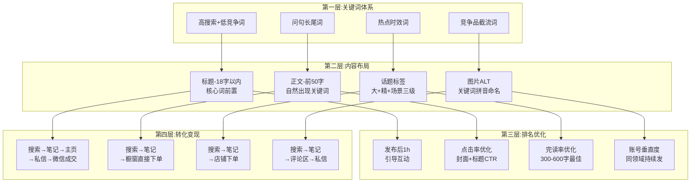
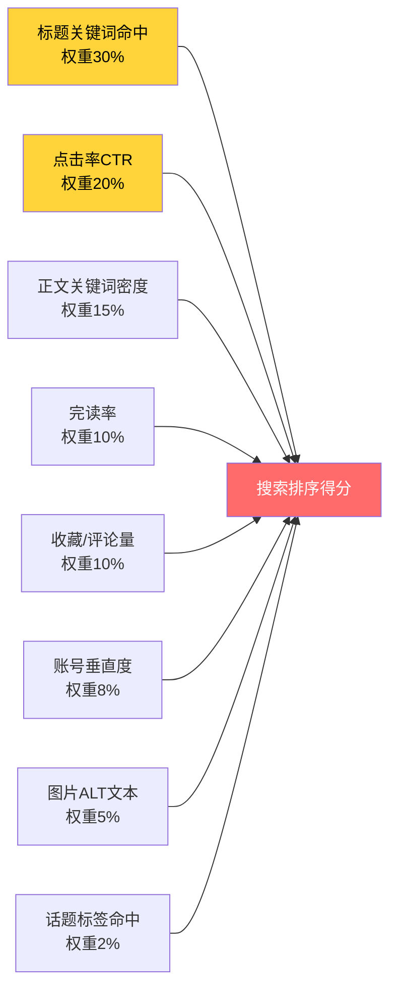
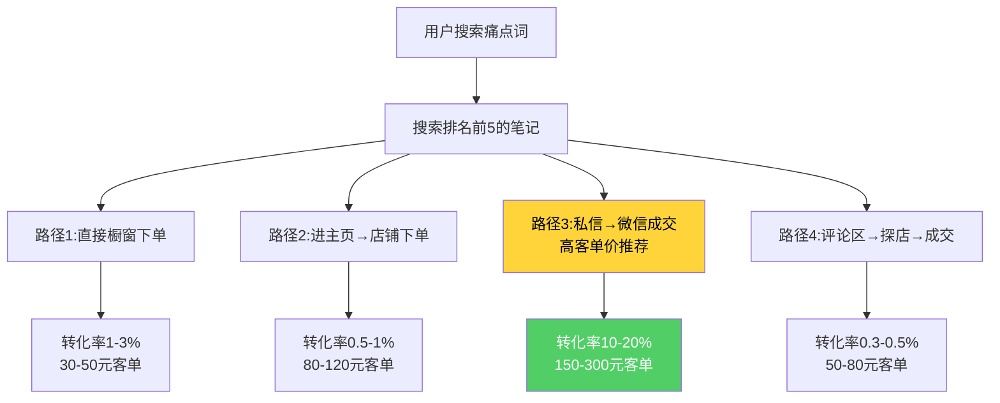

# Day23: 小红书搜索SEO与长尾流量策略

> 📅 学习日期：2026-07-15
> 🔗 关联笔记：[[00-目录]] | 上一篇：[[Day22-私域成交与复购体系设计]] | 下一篇：Day24
> 🎯 适用场景：反生活好物养生账号的搜索流量获取、低成本冷启动、长尾流量矩阵搭建
> 📚 学习来源：小红书创作者学院 × 千瓜数据 × 小红书搜索机制分析 × 聚光后台关键词规划工具 × 多行业SEO操盘手实战方法论

---

## 1. 一句话总结

**小红书搜索SEO = 用「问句式长尾关键词矩阵」×「标题-正文-标签三层关键词布局」×「3-7天搜索权重窗口期内引导互动」捕获用户主动搜索的精准流量，转化率是推荐流量的5-10倍，且流量持续6-12个月不断衰减。对「反生活养生好物」而言，搜索流量是当前阶段最不需要靠运气、最可控、ROI最高的流量来源。**

**核心认知转变：** 大部分博主只关注「推荐流量」——发笔记等着系统推，像买彩票，爆了运气好，不爆就凉。而搜索流量是**"种地逻辑"**——每条笔记像一颗种子，种下一个关键词，一个月后每天给你10-50次精准曝光，一年后还在。360条笔记种下去，第4个月起就是收割期。**推荐流量是浪，搜索流量是井。**

---

## 2. 核心框架

### 2.1 小红书搜索SEO全景图——「关键词→内容→排名→转化」四层体系



### 2.2 搜索排序核心因素权重（基于实操总结）



### 2.3 长尾流量 vs 推荐流量对比

| 对比维度 | 推荐流量 | 搜索流量 | 对反生活的意义 |
|---------|---------|---------|--------------|
| 用户意图 | 被动刷到，无购买意向 | 主动搜索，需求明确 | 搜索来的用户更精准 |
| 流量曲线 | 峰值72h后断崖下跌 | 持续6-12个月平缓衰减 | 一条笔记吃半年 |
| 转化率 | 0.1%-0.5% | 1%-5% | 搜索流量转化高5-10倍 |
| 客单价 | 30-50元 | 60-120元 | 搜索用户愿意花更多 |
| 退货率 | 15-20% | 5-8% | 退货少利润高 |
| 可控性 | 靠运气，不可控 | 靠关键词，可规划 | 搜索是"种地"不是"买彩票" |

---

## 3. 可落地方法

### 3.1 关键词挖掘三板斧

**【反生活可直接用】关键词矩阵构建：**

**第一板斧：小红书搜索框下拉词（挖需求池）**

在搜索框输入养生类核心词，把下拉词全摘下来：

| 核心词 | 下拉词1 | 下拉词2 | 下拉词3（问句式！） |
|--------|---------|---------|-------------------|
| 艾草贴 | 艾草贴测评 | 艾草贴推荐 | **艾草贴去湿气真的有用吗** |
| 泡脚包 | 泡脚包推荐女生 | 泡脚包测评 | **泡脚包真的能去湿气吗** |
| 养生茶 | 养生茶推荐 | 养生茶配方 | **养生茶刮油去湿气是真的吗** |
| 艾灸 | 艾灸调理顺序 | 艾灸入门 | **艾灸可以天天做吗多久见效** |
| 祛湿气 | 祛湿气最快的方法 | 祛湿气好物 | **祛湿气最有效的方法是什么** |

> ⚠️ 优先级顺序：问句式长尾词 > 测评词 > 推荐词 > 品牌词。问句式搜索量中高但竞争极低，且用户购买意图最强。

**第二板斧：竞品评论区挖词（黄金词库）**

找3-5条养生类爆款笔记，翻评论区：
```
用户问："这个泡脚包去湿气效果好吗"
→ 长尾词：泡脚包去湿气效果
→ 产出："泡脚包去湿气效果怎么样？我泡了21天实测"

用户问："艾草贴和艾灸哪个效果好"
→ 长尾词：艾草贴艾灸对比
→ 产出："艾草贴vs艾灸到底选哪个？30天对比体验"
```

> 每条用户提问 = 一个天然搜索词。把这些问句做成你的笔记标题，100%命中搜索。

**第三板斧：聚光后台关键词工具（付费，可借账号看）**

- 打开小红书聚光 → 工具 → 关键词规划工具
- 输入核心词 → 查看月度搜索量、竞争度、出价建议
- 筛选条件：搜索量>1000 + 竞争度"低" + 出价<2元
- 导出Excel ➡️ 筛选出养生类目可用的词

### 3.2 SEO友好笔记结构模板

**【反生活可直接用】5种标题公式 + 正文模板**

**标题公式（优先用公式3-5，因为SEO权重最高）：**

| 公式编号 | 公式 | 示例 | 适用场景 |
|---------|------|------|---------|
| 公式1 | 痛点+解决方案+时间 | "湿气重到崩溃？这个泡脚包我连泡21天，变化惊人" | 产品测评 |
| 公式2 | 合集推荐型 | "打工人必备5款养生好物，第3个绝了" | 多品合集 |
| **公式3** | **问句式（强SEO）** | "艾草贴真的能去湿气吗？我的30天真实体验" | **主力SEO内容** |
| **公式4** | **数据化+效果承诺** | "艾草贴30天实测：去湿气效果到底如何？看数据说话" | **测评类最佳** |
| **公式5** | **悬念+翻转型** | "千万别买这种养生茶，除非你想……（附避坑指南）" | **避坑科普** |
| 公式6 | 身份感+场景型 | "30岁程序员的养生办公桌，全是干货" | 人设建立 |

**正文模板（300-600字，搜索收录最佳区间）：**

```
【模板】

【开篇 50-80字】痛点+关键词前置
"湿气重真的太折磨人了，整天没精神、脸上出油、大便粘马桶。试了好多祛湿方法，最后发现XXX（核心产品）是真的有用。今天说说我用了30天的真实感受。"

【正文 200-400字】分3段，每段含1-2次关键词
"我用的是XXX（产品名/关键词），每天早上贴……（体验描述）坚持了一周……（变化描述）对比了其他XXX……（横向对比）"

【结尾 30-50字】互动引导
"姐妹们还有啥养生产品推荐？评论区聊聊～"
```

### 3.3 关键词布局规则（执行清单）

| 位置 | 规则 | 直接操作 |
|------|------|---------|
| **标题** | 18-22字，核心词靠前，长尾词完整出现 | 例："**艾草贴**去湿气真的有用吗？我帮你试了30天" |
| **正文首段** | 前50字自然出现≥2个目标关键词 | "之前湿气重，试了好多**艾草贴**，今天说**艾草贴去湿气**到底有没有用" |
| **话题标签** | 1个大话题+1个精准话题+1个场景话题 | #艾草贴 #祛湿气好物 #养生女孩日常 |
| **图片文件名** | 拼音+关键词 | 上传前把 `IMG_001.jpg` 改成 `aicaotie-qushi-ceping.jpg` |
| **评论区** | 发布后1h内自评3-5条 | "我用了3周感觉湿气少了……" "搭配泡脚效果更好" |

### 3.4 内容日历：反生活好物搜索SEO专用

| 星期 | 内容类型 | 关键词组 | 发布量 | 操作 |
|------|---------|---------|-------|------|
| 周一 | 测评类 | A组问句式长尾词×2 | 3条 | 核心产品深度测评 |
| 周二 | 教程类 | A组+步骤词 | 3条 | 产品使用教程/顺序 |
| 周三 | 对比类 | 竞品截流词 | 3条 | 产品A vs 产品B对比 |
| 周四 | 热点类 | B组时效词 | 3条 | 节气/季节/社会热点 |
| 周五 | 合集类 | C组转化型问句 | 3条 | 5款好物合集/推荐 |
| 周末 | 故事/人设 | 弱关键词 | 4条 | 个人养生日常/经验 |

> 每天3-4条，矩阵号发布。一个月后笔记积累90+条，覆盖300+个长尾关键词。

### 3.5 搜索优化日/周工作流

**每日（15分钟）：**
1. 创作者中心 → 数据中心 → 搜索分析 → 看前日搜索来源
2. 记录每个关键词的曝光、点击数据
3. 低曝光词 → 记录待优化（次日改标题）
4. 高曝光低点击 → 记录换封面

**每周（1小时）：**
1. 导出搜索关键词报表
2. 标记"曝光高无出单" → 内容不匹配，重写正文
3. 标记"出单好曝光低" → 加大此方向笔记量
4. 更新关键词库：淘汰无效词，新增搜索趋势词

**优化决策树：**
```
搜索曝光<100 → 关键词未命中，换标题和首段
搜索曝光>500但点击<5% → 封面不吸引，换封面图
搜索点击>10%但无互动 → 内容质量差，优化正文
搜索互动好但不出单 → 缺转化路径，加购物车/私信引导
```

---

## 4. 变现路径

### 4.1 搜索流量→成交的4条路径



### 4.2 搜索流量转化漏斗（养生好物赛道）

| 环节 | 转化率(保守) | 以1000次搜索曝光为例 | 月均(100条笔记) |
|------|------------|-------------------|----------------|
| 搜索曝光 | — | 1000次 | 30,000次 |
| 点击进笔记 | 10% | 100人 | 3,000人 |
| 完读(停留>15s) | 50% | 50人 | 1,500人 |
| 进主页 | 8% | 4人 | 120人 |
| 私信/加购 | 15% (进主页后) | 0.6人 | 18人 |
| 成交 | 40% (私信后) | **0.24单** | **7单** |

**数据解读：**
- 1000次搜索曝光 → 约0.24单（看似低，但注意这是某一篇笔记的数据）
- 100条笔记→月搜索曝光30万次→约7单/天
- 客单价80元 × 7单/天 × 30天 = **16,800元/月**（纯搜索流量）

### 4.3 收入推演：反生活好物3个月搜索SEO计划

前提条件：日发3条笔记，产品均价80元，毛利率50%

| 月份 | 累计笔记 | 日搜索UV | 日订单 | 月毛利 |
|------|---------|---------|-------|-------|
| 第1月 | 90条 | 50-80 | 1-3单 | **1,200-3,600元** |
| 第2月 | 210条 | 200-400 | 5-10单 | **6,000-12,000元** |
| 第3月 | 360条 | 800-1500 | 15-30单 | **18,000-36,000元** |
| **稳定期** | 持续更新 | 2000+ | 40-60单 | **4.8万-7.2万/月** |

> **注意**：以上是纯搜索流量预估。搜索流量会间接带动推荐流量（搜索点击后，系统会给笔记打标签，推荐算法会推荐给相似人群），实际收入可能翻倍。

### 4.4 【反生活可直接用】推荐组合

**模式A：搜索引流 + 小红书店铺成交（首选 ★★★★★）**
- 适合：30-80元标准化产品（养生茶包、泡脚包）
- 流程：搜索→笔记→橱窗加购→下单
- 优点：转化路径最短，不需要私信，自动成交

**模式B：搜索引流 + 私信转微信成交（高客单 ★★★★☆）**
- 适合：150元+产品（艾灸礼盒、养生套餐）
- 流程：搜索→笔记→私信→微信→成交
- 优点：客单价高，可复购，可做会员

**推荐组合：80%笔记做模式A（低客单价快速出单建立信任）+ 20%笔记做模式B（高客单利润品）**

---

## 5. 行动清单

### ✅ 行动①：建立反生活好物关键词矩阵清单（1小时完成）

**操作步骤：**
1. 打开小红书搜索框，依次输入：艾草贴、泡脚包、养生茶、艾灸、祛湿气
2. 下拉所有推荐词和联想词，复制到Excel/Notion
3. 筛选出问句式长尾词（"有用吗"、"怎么样"、"推荐"、"对比"），标记为A类
4. 筛选出时效性词（夏季/节气/季节相关），标记为B类
5. 筛选出性价比/对比词（"哪个牌子好"、"vs"、"平价"），标记为C类
6. 最终输出：30个高价值长尾词清单

**产出：** 一个可直接用的「反生活好物·关键词矩阵.xlsx」

### ✅ 行动②：优化现有笔记标题和首段（30分钟完成）

**操作步骤：**
1. 打开账号后台，列出最近30条笔记
2. 逐条检查标题——是否含目标关键词？开头前5个字是否有核心词？
3. 打开每条笔记修改标题（小红书支持改标题，不会限流）
4. 修改正文前50字，加入目标关键词（自然融入，别生硬）
5. 检查话题标签——是否覆盖大话题+精准话题+场景话题？

**改造示例：**
```
原文案标题：
"养生好物分享来咯～"

修改后（SEO优化版）：
"艾草贴去湿气真的有用吗？我帮你试了30天"

原文案首段：
"今天给大家分享我最近买的养生好物"

修改后：
"之前湿气重整天没精神，试了好多艾草贴。今天说说艾草贴去湿气到底有没有用……"
```

**产出：** 30条优化后的笔记标题+首段

### ✅ 行动③：制定下周内容日历并开始执行（1小时完成）

**操作步骤：**
1. 下载上面的内容日历模板填入具体产品名
2. 按周一至周日排好下周的7×3=21条笔记选题
3. 每条笔记分配1个核心长尾关键词
4. 批量写3天的笔记草稿（每天3条，共9条）
5. 第一条笔记发布时，自评3条+转发2个话题

**下周日历速填（示例）：**

| 星期 | 选题 | 关键词 | 产品 |
|------|------|--------|------|
| 周一 | 艾草贴30天测评 | 艾草贴去湿气真的有用吗 | 艾草贴 |
| 周二 | 泡脚包怎么选 | 泡脚包推荐女生 | 泡脚包 |
| 周三 | 泡脚包 vs 足浴盆 | 泡脚包和足浴盆哪个好 | 泡脚包 |
| 周四 | 三伏天养生攻略 | 三伏天怎么祛湿气 | 养生产品 |
| 周五 | 5款夏季养生好物合集 | 夏季养生好物推荐 | 合集 |
| 周六 | 程序员养生办公桌 | 上班族养生必备好物 | 多品 |
| 周日 | 睡不着怎么办？艾草泡脚 | 艾草泡脚失眠有用吗 | 泡脚包 |

**产出：** 21条主题明确的笔记选题清单

---

## 附：关联已有笔记

| 关联笔记 | 关联点 |
|---------|--------|
| [[Day20-小红书官方创作者学院内容]] | 搜索SEO是小红书官方推荐的核心能力之一 |
| [[Day03-爆款复制方法论]] | 搜索SEO笔记+爆款公式=Title优化 |
| [[Day01-小红书电商闭环]] | 搜索→购买完整闭环的"搜索"入口部分 |
| [[Day14-AI生图与视频工具]] | 用AI批量生成SEO笔记图片+封面 |
| [[Day18-多平台变现矩阵]] | 搜索流量是矩阵号的核心流量来源 |
| [[Day13-多平台内容复用]] | 搜索SEO方法论可迁移到抖音/公众号 |

---

> **一句话记住今天的核心：** 推荐流量是浪，今天来明天走；搜索流量是井，今天挖明天还在。反生活好物要做的是——**停火挖井，而不是追浪**。
