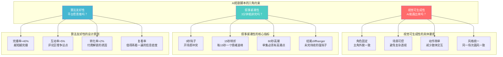
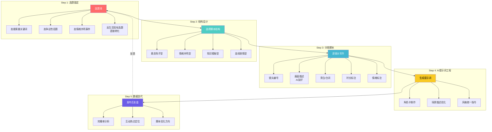
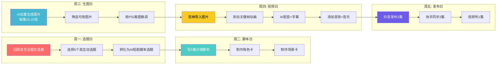
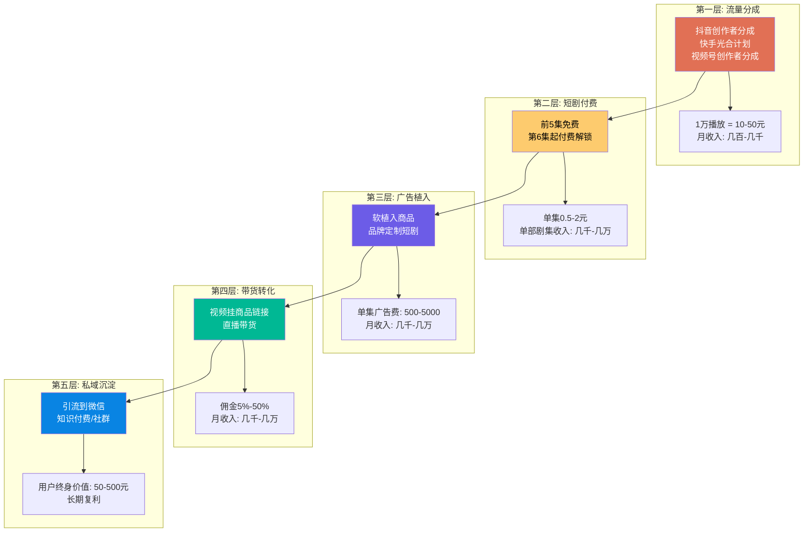

# 📕 Day24: AI短剧脚本创作

> **核心：AI短剧脚本不是传统剧本的「降级版」，而是专门为「AI生成能力 + 短视频算法 + 用户付费意愿」三者的交集地带设计的叙事产品。它的本质是用最低的文字成本，撬动最高的视觉呈现效率和最强的用户情绪反应。写好AI短剧脚本的人，赚的不是「写作费」，而是「流量杠杆的操控权」。**
> 来源：短剧行业编剧方法论 + AI内容生成实战 + 抖音/快手短剧爆款拆解 + 头部AI短剧账号案例 + 叙事心理学

---

## 一、一句话总结

**AI短剧脚本创作 = 在AI的能力边界内，用「高密度情绪节拍」驱动「低成本视觉生产」，最终服务于「算法推荐」和「用户付费」的双重目标。** 传统编剧追求文学性和艺术表达，AI短剧编剧追求「可生成性」「可完播性」「可变现性」的三位一体。一个合格的AI短剧脚本，必须在写第一个字之前就想清楚：这个画面AI画得出来吗？这个钩子3秒内能留住人吗？这个故事看到最后用户愿意付费解锁下一集吗？

反生活做AI短剧有天然优势——过去23天积累的全部「避坑指南」「辟谣知识」「消费洞察」，本质上都是**高信息密度 + 强情绪反差 + 明确价值承诺**的内容。这些元素正是AI短剧脚本最需要的燃料。今天这篇笔记，就是把反生活的「图文资产」转化为「AI短剧脚本资产」的操作手册。

> 💡 **老黄的铁律**：AI短剧脚本的第一读者不是观众，是AI——AI看得懂、生得出、算得快的脚本才是好脚本。

本章和[[Day4-AI短剧制作入门]]（AI短剧总体认知与工具链）、[[Day23-多平台内容复用]]（内容复用模型）、[[Day3-抖音短视频运营]]（短视频算法与爆款公式）、[[Day16-公众号爆款文章公式]]（内容结构方法论）、[[Day13-小红书爆款复制方法论]]（爆款拆解与复制）紧密关联。

---

## 二、核心框架

### 2.1 AI短剧脚本的「三维约束空间」

传统编剧只在「故事质量」一个维度上竞争，AI短剧编剧必须在三个维度上同时达标：



**为什么这三个维度缺一不可？**

| 维度 | 失败后果 | 成功案例特征 |
|------|---------|------------|
| 视觉可生成性 | 脚本写得很精彩，AI生成的画面人物变形、场景崩坏、动作穿帮，最终只能放弃或花大量时间重绘 | 角色造型简单但有辨识度、场景以室内外常见环境为主、避免大场面群戏 |
| 叙事紧凑性 | 铺垫太长，用户3秒划走；或节奏拖沓，完播率低于20%，算法停止推荐 | 开场即冲突、每15秒一个转折、结尾强悬念、信息密度极高 |
| 算法友好性 | 内容质量高但不懂平台规则，播放量卡在500，无法进入更大的流量池 | 标题带关键词、前3秒有视觉奇观、评论区预埋争议话题、引导点赞收藏 |

### 2.2 四大AI短剧爆款脚本结构

```mermaid
graph LR
    subgraph "结构一：悬念钩子型"
        S1A[第1秒: 惊人画面<br/>人物处于极端状态] --> S1B[第10秒: 抛出问题<br/>"为什么会这样？"]
        S1B --> S1C[第30秒: 揭示部分真相<br/>但留下更大谜团]
        S1C --> S1D[第60秒: 反转<br/>观众以为的真相被推翻]
        S1D --> S1E[结尾: 更大的悬念<br/>"真正的幕后黑手是..."]
    end

    subgraph "结构二：情绪共鸣型"
        S2A[第1秒: 痛点场景<br/>"你是不是也遇到过..."] --> S2B[第15秒: 情绪升级<br/>问题越来越严重]
        S2B --> S2C[第30秒: 解决方案出现<br/>希望之光]
        S2C --> S2D[第45秒: 爽点爆发<br/>问题彻底解决]
        S2D --> S2E[结尾: 金句总结<br/>+ 引导互动]
    end

    subgraph "结构三：知识揭秘型"
        S3A[第1秒: 反常识命题<br/>"你以为的XX其实是错的"] --> S3B[第15秒: 现象描述<br/>普遍存在的误解]
        S3B --> S3C[第30秒: 原理拆解<br/>用类比讲清楚]
        S3C --> S3D[第45秒: 真实案例<br/>数据或故事佐证]
        S3D --> S3E[结尾: 行动号召<br/>"点赞收藏，下次别被骗"]
    end

    subgraph "结构四：连续剧情型"
        S4A[第1秒: 承接上集<br/>快速回顾] --> S4B[第15秒: 新冲突<br/>主角遇到新挑战]
        S4B --> S4C[第30秒: 角色互动<br/>关系推进]
        S4C --> S4D[第45秒: 本集高潮<br/>悬念最大化]
        S4D --> S4E[结尾: 强cliffhanger<br/>"下一集揭晓..."]
    end

    style S1A fill:#ff6b6b,color:#fff
    style S2A fill:#4ecdc4,color:#fff
    style S3A fill:#45b7d1,color:#fff
    style S4A fill:#f9ca24,color:#000
```

#### 结构详解与适用场景

**结构一：悬念钩子型**
- **适用题材**：悬疑、反转、剧情类
- **核心逻辑**：观众的认知被反复颠覆，好奇心被持续激发
- **AI生成要点**：同一角色在不同情绪状态下的表情变化要稳定，可通过固定seed值或LoRA模型锁定角色
- **反生活应用**：「你以为的省钱妙招，其实是商家最深的套路」——每一集揭露一个消费陷阱的真相，最后发现所有陷阱背后是一个更大的局

**结构二：情绪共鸣型**
- **适用题材**：情感、励志、治愈、共鸣类
- **核心逻辑**：让观众在60秒内经历「被理解→被触动→被激励」的完整情绪旅程
- **AI生成要点**：角色的微表情和肢体语言是情绪传递的关键，需要给AI详细的表情描述词
- **反生活应用**：「打工人省钱的一天」——用AI角色演绎真实省钱场景，让观众笑着笑着就哭了，最后给出实用建议

**结构三：知识揭秘型**
- **适用题材**：科普、辟谣、教程、知识类
- **核心逻辑**：信息密度极高，每一秒都在提供新知，让观众觉得「不看就亏了」
- **AI生成要点**：信息可视化是关键，需要AI生成图表、对比图、流程图等辅助画面
- **反生活应用**：「这个骗局骗了10亿人」——用AI短剧演绎骗局全过程，比图文更直观、比真人视频成本更低

**结构四：连续剧情型**
- **适用题材**：连载故事、系列IP、剧情账号
- **核心逻辑**：单集有独立高潮，但整体有长线剧情，培养用户追更习惯
- **AI生成要点**：角色一致性是最大挑战，需要建立详细的角色设定卡（角色卡），包括外貌、服装、性格标签等
- **反生活应用**：「省钱侦探阿反」——主角是一个专门揭露消费陷阱的侦探，每一集侦破一个「案件」，线索串联成一个更大的商业阴谋

### 2.3 AI短剧脚本的「节拍器」——15秒情绪曲线

无论选择哪种结构，都必须遵循「15秒情绪曲线」原则：

```
时间轴 →
0s     15s     30s     45s     60s
│       │       │       │       │
▼       ▼       ▼       ▼       ▼
钩子    升级    高潮    回落    悬念
│       │       │       │       │
情绪值 ────────────────────────────
  │\    │\      │       │      │
  │ \   │ \     │       │      │
  │  \  │  \    │       │      │
  │   \ │   \   │       │      │
  │    \│    \  │       │      │
  └────────────────────────────────

关键指标：
- 0-3秒：情绪值必须瞬间拉升（完播率的关键）
- 3-15秒：情绪持续升级（让观众"停不下来"）
- 15-30秒：达到本集第一个高潮（释放多巴胺）
- 30-45秒：短暂回落+新信息输入（为下一个高潮铺垫）
- 45-60秒：结尾悬念（驱动点击下一集或付费解锁）
```

**反生活的15秒曲线示例**（知识揭秘型）：

| 时间 | 画面 | 旁白/台词 | 情绪值 | 目的 |
|------|------|----------|--------|------|
| 0-3s | 黑屏白字：「你买的进口牛奶，可能是假的」 | 紧张音乐起 | 瞬间拉满 | 打破平静，制造恐惧 |
| 3-15s | AI画面：超市货架上摆满"进口牛奶"，镜头推进到包装上的外文 | "这些看起来很洋气的包装，其实..." | 持续升级 | 具体化恐惧对象 |
| 15-30s | 画面切换到工厂流水线，AI展示假牛奶制作过程 | "成本不到2块钱，卖你30" | 愤怒+震惊 | 揭秘核心真相 |
| 30-45s | 画面展示真假对比：营养成分表、条形码、防伪标识 | "记住这三招，谁也骗不了你" | 希望回升 | 提供解决方案 |
| 45-60s | 主角（AI角色）面对镜头严肃地说 | "但最可怕的不是假牛奶..." 黑屏 | 悬念再起 | 引导看下一集 |

---

## 三、可落地的方法

### 3.1 AI短剧脚本创作五步法



#### Step 1: 选题锚定——反生活的选题金矿

反生活过去23天积累的选题可以直接转化为AI短剧脚本：

```
反生活选题 → AI短剧选题转化表

| 反生活原文 | AI短剧选题 | 脚本结构 | 预估时长 |
|-----------|-----------|---------|---------|
| 闲鱼避坑指南 | 「我在闲鱼被骗了3000块」 | 悬念钩子型 | 60s |
| 小红书运营心得 | 「做小红书3个月，我发现了这个秘密」 | 情绪共鸣型 | 90s |
| 消费陷阱揭秘 | 「超市这个标签，90%的人看不懂」 | 知识揭秘型 | 60s |
| 省钱方法论 | 「月薪5000，我是怎么存下2万的」 | 情绪共鸣型 | 90s |
| 私域运营经验 | 「加了5000好友后，我明白了...」 | 连续剧情型 | 60s/集 |
```

**选题优先级排序**（从高到低）：
1. **恐惧驱动型**：「你不知道的XX真相」（点击率最高）
2. **利益驱动型**：「这样做能省XX钱」（转化率最高）
3. **好奇驱动型**：「为什么XXX？」（完播率最高）
4. **共鸣驱动型**：「打工人/宝妈/学生党必看」（互动率最高）

#### Step 2: 结构设计——60秒脚本模板

**知识揭秘型60秒脚本模板**（最适合反生活）：

```
【标题】超市这个标签，90%的人看不懂
【总时长】60秒
【结构】知识揭秘型

---

【镜头1】0-3s
画面：超市货架特写，一只手拿起一包零食
旁白："你买零食会看这个吗？"
情绪：好奇
注意：开场必须让观众产生"我是不是也这样？"的自我代入

【镜头2】3-10s
画面：零食包装背面，镜头推进到配料表
旁白："配料表上的秘密，商家最不想让你知道"
情绪：紧张升级
注意：画面要有层次感，先全景再特写

【镜头3】10-25s
画面：AI生成的配料表解析动画，高亮显示"反式脂肪酸""人造奶油"等关键词
旁白："这些词看到就放下——反式脂肪酸、人造奶油、植脂末"
情绪：愤怒+恐惧
注意：AI生成信息图表比真人实拍成本低10倍，效果更直观

【镜头4】25-40s
画面：左右分屏对比，左边是"看起来健康的零食"，右边是"实际成分"
旁白："你以为的健康零食，可能全是科技与狠活"
情绪：震惊
注意：对比是AI的强项，用分屏或叠化效果

【镜头5】40-55s
画面：主角（AI角色）展示手机APP，扫描条形码显示成分分析
旁白："用这个APP扫一下，成分全知道——评论区告诉你名字"
情绪：希望+行动欲
注意：引导评论是算法推荐的关键

【镜头6】55-60s
画面：主角面对镜头，背景渐暗
旁白："但最可怕的还不是零食..."
情绪：悬念
注意：结尾必须留钩子，引导点击下一集

---

【AI生成提示词要点】
- 角色：年轻女性，短发，穿白色T恤，表情严肃但亲和
- 场景：超市（货架、购物车、明亮灯光）
- 风格：写实插画风格，色彩鲜明，信息图表用蓝色和橙色高亮
- 关键帧：6个镜头共需12-18张图（每个镜头2-3张用于动画）
```

#### Step 3: 分镜脚本——AI友好的写作规范

给AI写分镜脚本，必须遵循「画面可生成性」原则：

| 写作原则 | ❌ 错误示范 | ✅ 正确示范 | 原因 |
|---------|-----------|-----------|------|
| 角色描述 | "一个美丽的女人" | "25岁亚洲女性，黑色短发，白色T恤，牛仔裤，表情严肃" | AI需要具体的视觉标签 |
| 场景描述 | "在繁华的城市街头" | "城市街道，白天，人行道旁有咖啡店，背景有模糊行人" | 避免抽象形容词 |
| 动作描述 | "她感到很沮丧" | "她低头，肩膀下沉，双手插兜，步伐缓慢" | 用肢体语言替代情绪词 |
| 镜头运动 | "镜头缓缓推进" | "特写：脸部，背景虚化" | AI生成的是静态图，运动靠后期 |
| 氛围描述 | "悲伤的氛围" | "阴天，灰色天空，冷色调，室内光线昏暗" | 用环境元素传递情绪 |

#### Step 4: AI提示词工程——角色卡与场景卡

**角色卡模板**（确保角色在多集/多张图中保持一致）：

```
【角色名称】阿反（省钱侦探）
【基础设定】
- 性别：女
- 年龄：25岁
- 外貌：黑色齐肩短发，戴圆框眼镜，穿卡其色风衣+白色内搭+黑色长裤
- 性格：干练、犀利、偶尔毒舌
- 标志性动作：推眼镜、抱臂、手指点下巴

【AI提示词核心描述】
Asian young woman, 25 years old, short black hair, round glasses,
khaki trench coat, white inner shirt, black pants,
sharp and confident expression, flat illustration style,
consistent character design, clean lines, soft shading

【固定参数】
- Seed值：每次生图使用相同seed前缀
- LoRA模型：trench-coat-character-v1（如可用）
- 风格锁定：flat illustration, consistent character design
```

**场景卡模板**：

```
【场景名称】超市零食区
【环境描述】
- 空间：大型超市内部，货架排列整齐
- 光线：明亮 fluorescent 灯光，顶部照射
- 色彩：货架色彩丰富（红黄蓝包装），地面白色瓷砖反光
- 氛围：日常、消费、现代

【AI提示词】
supermarket interior, snack aisle, brightly lit,
fluorescent lighting, colorful product packaging on shelves,
white tiled floor, modern retail environment,
flat illustration style, clean composition

【避免元素】
- 不要模糊人脸（AI画脸容易崩）
- 不要复杂透视（AI透视不稳定）
- 不要过多细节（焦点在主角身上）
```

#### Step 5: 数据迭代——脚本优化的数据指标

发布后24小时内必须复盘的数据：

| 指标 | 及格线 | 优秀线 | 优化方向 |
|------|--------|--------|---------|
| 完播率 | >30% | >50% | 前3秒钩子不够强 → 优化开场 |
| 点赞率 | >3% | >8% | 情绪共鸣不足 → 加强痛点/爽点 |
| 评论率 | >1% | >3% | 没有引发讨论 → 预埋争议点/提问 |
| 转发率 | >0.5% | >2% | 价值感不够 → 增加实用信息/金句 |
| 收藏率 | >1% | >5% | 干货密度不足 → 增加可操作步骤 |

### 3.2 反生活AI短剧脚本的「批量生产流水线」



**每周产出目标**：
- 5集AI短剧（每集60-90秒）
- 总计约7-10分钟内容
- 单集制作时间：从脚本到成品约3-4小时
- 单人每周投入：15-20小时

---

## 四、「反生活」可以直接用的

### 4.1 反生活现有内容→AI短剧的「一键转化」公式

反生活已经产出的所有图文内容，都可以用这个公式转化为AI短剧脚本：

```
【图文原文结构】
标题（痛点/好奇）→ 引言（场景代入）→ 正文3-5点（干货/案例）→ 结尾（总结+行动号召）

         ↓ 转化

【AI短剧脚本结构】
钩子（3秒）→ 升级（15秒）→ 揭秘/高潮（30秒）→ 回落（45秒）→ 悬念（60秒）

具体转化方法：
1. 标题 → 视频前3秒的视觉钩子（文字+画面）
2. 引言 → 镜头1-2的画面描述（场景代入）
3. 正文第1点 → 镜头3的核心揭秘（情绪高潮）
4. 正文第2-3点 → 镜头4的深化（信息密度）
5. 正文第4-5点 → 镜头5的解决方案（希望回升）
6. 结尾 → 镜头6的悬念（引导下一集/互动）
```

### 4.2 反生活AI短剧账号定位建议

```mermaid
graph TD
    subgraph "账号定位：省钱侦探阿反"
        A[人设定位] --> A1[身份: 消费领域的福尔摩斯]
        A --> A2[性格: 毒舌但温暖]
        A --> A3[口头禅: "你的钱，就是这样没的"]
    end

    subgraph "内容矩阵"
        B[系列一: 消费陷阱] --> B1[「你的钱去哪了」<br/>揭秘商家套路]
        B --> B2[「这个标签别信」<br/>解读包装话术]
        B --> B3[「省钱反被坑」<br/>低价陷阱]
    end

    subgraph "视觉风格"
        C[画面风格] --> C1[扁平插画+信息图表]
        C --> C2[主色调: 橙色+深蓝]
        C --> C3[字体: 粗体无衬线]
    end

    subgraph "发布节奏"
        D[每周更新] --> D1[周一: 消费陷阱]
        D --> D2[周三: 省钱技巧]
        D --> D3[周五: 避坑指南]
    end

    A --> B
    B --> C
    C --> D

    style A fill:#ff6b6b,color:#fff
    style B fill:#4ecdc4,color:#fff
    style C fill:#45b7d1,color:#fff
    style D fill:#f9ca24,color:#000
```

### 4.3 反生活现有选题的AI短剧脚本示例

**原文**：Day7-闲鱼选品与供应链中的「闲鱼选品5标准」

**AI短剧脚本转化**：

```
【标题】在闲鱼买东西，这5种千万别碰
【时长】90秒
【结构】知识揭秘型

---

【镜头1】0-3s
画面：手机屏幕，闲鱼APP打开，手指在滑动
旁白："你在闲鱼上买过东西吗？"
情绪：好奇

【镜头2】3-8s
画面：AI角色阿反出现在屏幕边缘，表情严肃
旁白："我是阿反，今天告诉你——闲鱼上这5种东西，谁买谁亏"
情绪：权威感+紧张

【镜头3】8-20s
画面：手机截图+AI动画，展示第一类："价格离谱低的全新大牌"
旁白："第一，全新大牌但价格只有官网1折——99%是假货或空包"
情绪：警示
注意：用红色警示框+文字高亮

【镜头4】20-32s
画面：展示第二类："不走平台要加微信的"
旁白："第二，卖家说'不走平台，加微信交易'——这是骗子的开场白"
情绪：愤怒
注意：画面分屏：左边正常交易流程，右边骗子流程

【镜头5】32-45s
画面：展示第三类+第四类："不支持验货的数码产品"和"来路不明的化妆品"
旁白："第三，数码产品不支持验货——坏的居多。第四，化妆品没有购买记录——用在脸上的东西别省这几十块"
情绪：理性+担忧

【镜头6】45-60s
画面：展示第五类："要求先确认收货的"
旁白："第五，也是最坑的——要求你先确认收货再发货。你点了确认，钱就到他账上了，东西？没有。"
情绪：愤怒+震惊
注意：用动画展示"确认收货"按钮被点击后，钱飞走的画面

【镜头7】60-75s
画面：阿反推了推眼镜，面对镜头
旁白："记住这5条，闲鱼能让你省钱；忘了这5条，闲鱼能让你破产"
情绪：希望+权威

【镜头8】75-90s
画面：黑屏白字，逐字显示
文字："你在闲鱼踩过什么坑？评论区告诉我"
旁白："你在闲鱼踩过什么坑？评论区告诉我，点赞过1000，我出一期'闲鱼捡漏指南'"
情绪：互动+悬念

---

【AI生成要点】
- 角色：阿反（固定角色卡）
- 场景：室内，简约背景，偶尔手机屏幕特写
- 风格：扁平插画，信息图表用红色/橙色高亮
- 预计生图量：18-24张
- 预计配音：90秒，约200字
```

---

## 五、变现路径

### 5.1 AI短剧的五层变现金字塔



### 5.2 反生活AI短剧的变现路径设计

**第一阶段（0-1个月）：流量分成+账号起量**
- 目标：每天发布1-2集，积累1000粉丝
- 收入预期：抖音创作者分成，月收入 300-1000元
- 关键动作：蹭热点、跟爆款、高频更新

**第二阶段（1-3个月）：广告植入+带货**
- 目标：粉丝5000+，开通商品橱窗
- 收入预期：广告分成+带货佣金，月收入 1000-5000元
- 关键动作：在短剧中软植入省钱相关商品（记账本、比价APP、理财书等）

**第三阶段（3-6个月）：付费短剧+私域**
- 目标：推出「省钱侦探」系列付费短剧
- 收入预期：付费解锁+私域沉淀，月收入 3000-10000元
- 关键动作：前5集免费引流，后续付费；评论区引导加微信领「省钱清单」

**第四阶段（6-12个月）：IP授权+矩阵**
- 目标：「省钱侦探阿反」成为垂类IP
- 收入预期：IP授权+多平台矩阵，月收入 5000-20000元
- 关键动作：授权给其他创作者使用角色形象；在快手/B站/YouTube同步分发

### 5.3 收入测算表

| 阶段 | 粉丝量 | 日均播放 | 月收入构成 | 预估月收入 |
|------|--------|----------|-----------|-----------|
| 起量期 | 0-1000 | 1000-5000 | 流量分成 | 300-800 |
| 成长期 | 1000-1万 | 5000-3万 | 流量+带货 | 1000-3000 |
| 变现期 | 1万-5万 | 3万-10万 | 流量+带货+广告 | 3000-8000 |
| 成熟期 | 5万-10万 | 10万-50万 | 全链路变现 | 8000-2万 |
| IP期 | 10万+ | 50万+ | IP授权+矩阵 | 2万-5万 |

> 💡 **老黄的务实目标**：前3个月不求赚大钱，只求把流程跑通。每天1集，90天后有90集内容资产。即使每集平均播放量只有3000，总播放量也有27万，按照最低10元/万播计算，流量分成就有2700元——关键是，这90集内容可以持续产生长尾流量。

---

## 六、行动清单

### ✅ 今天就能做的3件事

**第一件事：写一集「试水脚本」（2小时）**
- [ ] 从反生活已有的高互动图文笔记中选1个选题
- [ ] 用本文的「60秒脚本模板」写出完整分镜脚本
- [ ] 标注每个镜头的AI生成提示词要点
- [ ] 保存到反生活的内容库，命名为「AI短剧脚本_001_选题名」

**第二件事：建立角色卡（30分钟）**
- [ ] 设计一个AI短剧主角形象（建议：基于反生活人设）
- [ ] 写出角色的AI提示词核心描述（外貌、服装、风格）
- [ ] 记录一个固定seed值，用于后续生图保持一致性
- [ ] 保存为「角色卡_阿反_v1.md」

**第三件事：搭建AI短剧选题库（30分钟）**
- [ ] 打开反生活所有已发布的图文内容
- [ ] 用本文的「选题转化公式」，列出至少10个可转化为AI短剧的选题
- [ ] 按优先级排序：恐惧驱动型 > 利益驱动型 > 好奇驱动型 > 共鸣驱动型
- [ ] 保存为「AI短剧选题库.md」

### 📌 本周完成目标

- [ ] 完成3集AI短剧脚本的完整分镜
- [ ] 用AI工具生成第一集的完整画面（15-20张图）
- [ ] 用剪映制作出第一集完整视频（包括配音、字幕、音乐）
- [ ] 在抖音发布第一集AI短剧，观察24小时数据
- [ ] 复盘数据，优化第二、三集脚本

---

> **关联笔记**：[[Day4-AI短剧制作入门]] · [[Day23-多平台内容复用]] · [[Day3-抖音短视频运营]] · [[Day16-公众号爆款文章公式]] · [[Day13-小红书爆款复制方法论]] · [[Day1-小红书变现全攻略]]

> **学习来源**：短剧行业编剧方法论（《短剧编剧实战手册》《爆款短剧编剧课》）+ AI内容生成实战（Midjourney/可灵/即梦社区教程）+ 抖音/快手短剧爆款拆解（Top50账号内容分析）+ 头部AI短剧账号案例（@省钱侦探阿反 @避坑指南 等虚拟IP）+ 叙事心理学（《故事》《救猫咪》 screenplay structure 的短视频适配版）
