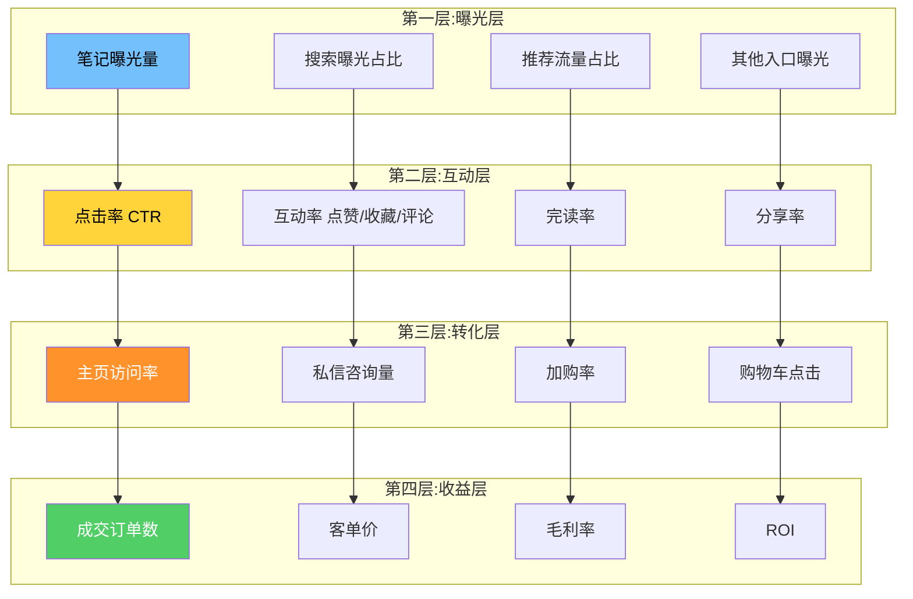
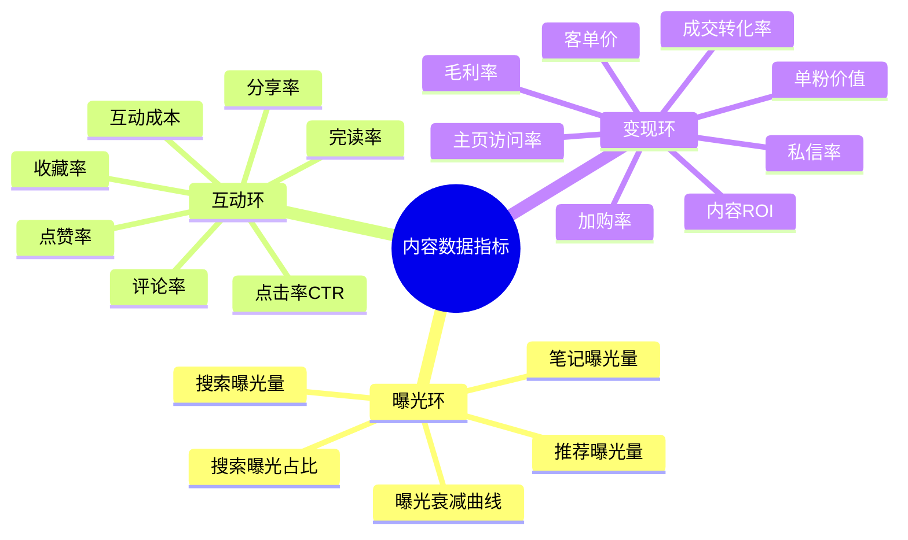
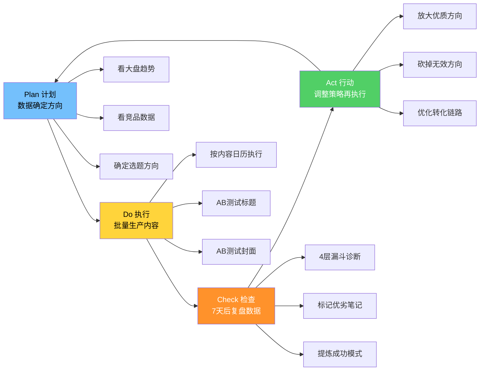
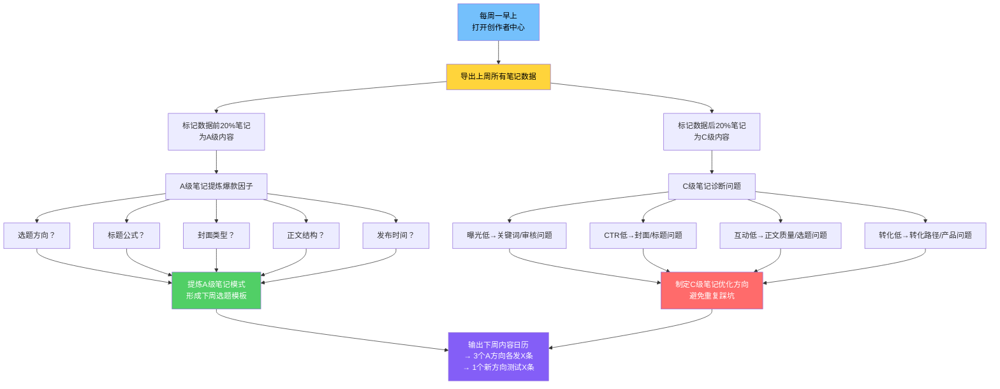
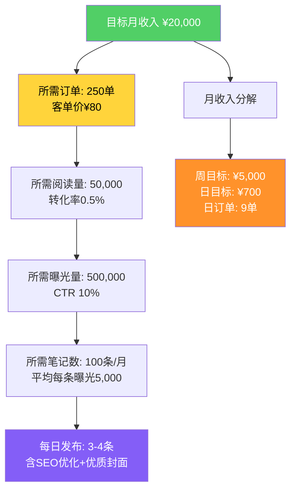
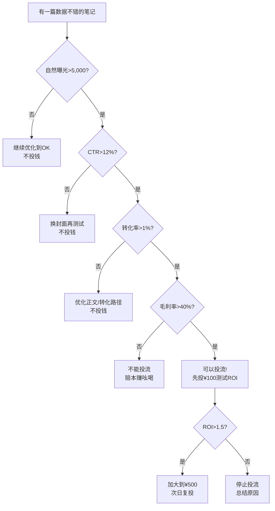

# Day24: 内容数据分析与迭代优化

> 📅 学习日期：2026-07-17
> 🔗 关联笔记：[[00-目录]] | 上一篇：[[Day23-小红书搜索SEO与长尾流量策略]] | 下一篇：Day25
> 🎯 适用场景：反生活好物养生账号的内容数据复盘、迭代优化、效率提升
> 📚 学习来源：小红书创作者中心 × 千瓜数据 × 蝉妈妈 × 新红数据 × 多个头部MCN数据复盘方法论 × 谷歌精益数据分析框架 × 硅谷增长黑客模型

---

## 1. 一句话总结

**内容数据分析与迭代优化 = 用「4层漏斗诊断模型」×「3环20个核心指标」×「PDCA快速迭代闭环」把每一条笔记从"玄学"变成"科学"，让反生活好物的内容生产从盲打变成狙击——每一篇笔记都带着明确的数据目标发布，每一周都用数据指导下一周的内容方向，每30天完成一次完整的策略迭代。**

**核心认知转变：** 90%的博主做内容靠"感觉"——选题靠看别人爆了、标题靠直觉、发布时间靠随缘。而专业玩家靠"数据"——用数据确定选题方向、用数据优化标题和封面、用数据决定是否追投、用数据指导矩阵号的资源分配。**感觉是赌博，数据是复利。**

---

## 2. 核心框架

### 2.1 内容数据四层漏斗诊断模型



### 2.2 反生活好物核心指标体系——「3环20个关键指标」



| 指标层次 | 指标名称 | 计算公式 | 反生活好物健康值 | 诊断指向 |
|---------|---------|---------|----------------|---------|
| **曝光** | 笔记曝光量 | 系统统计 | 单篇≥5,000(养身号) | 内容是否被推荐/搜索到 |
| **曝光** | 搜索曝光占比 | 搜索曝光÷总曝光 | ≥30% | 搜索SEO是否做得好 |
| **曝光** | 曝光衰减曲线 | 发布后每日曝光 | 72h后仍>首日30% | 内容是否有长尾价值 |
| **互动** | 点击率CTR | 点击量÷曝光量 | ≥8% | 封面+标题是否吸引人 |
| **互动** | 点赞率 | 点赞量÷曝光量 | ≥3% | 内容是否引发共鸣 |
| **互动** | 收藏率 | 收藏量÷曝光量 | ≥2% | 内容是否有实用价值 |
| **互动** | 评论率 | 评论量÷曝光量 | ≥0.5% | 内容是否引发讨论 |
| **互动** | 完读率 | 完全阅读量÷点击量 | ≥40% | 内容质量是否撑得住 |
| **互动** | 分享率 | 分享量÷阅读量 | ≥1% | 内容是否有传播价值 |
| **变现** | 主页访问率 | 主页访问÷笔记阅读 | ≥5% | 用户是否想了解更多 |
| **变现** | 私信率 | 私信量÷主页访问 | ≥10% | 用户是否有购买意向 |
| **变现** | 加购率 | 加购量÷橱窗查看 | ≥5% | 是否有成交意愿 |
| **变现** | 成交转化率 | 订单量÷加购量 | ≥20% | 最后一公里是否通畅 |
| **变现** | 客单价 | 总成交额÷订单数 | ≥60元 | 产品定价策略是否合理 |
| **变现** | 内容ROI | (总成交额-成本)÷内容制作成本 | ≥3x | 整体投入产出比 |

### 2.3 PDCA四步迭代循环



### 2.4 内容的五种生命周期模型

| 生命周期类型 | 特征 | 典型场景 | 应对策略 |
|------------|------|---------|---------|
| **爆款型** | 72h内曝光爆发式增长，持续3-7天 | 踩中热点/算法推荐 | 立即加投薯条/聚光，追发同主题 |
| **长尾型** | 曝光缓慢增长，持续1-6个月不断 | SEO搜索笔记，养生知识类 | 持续维护评论区，更新关键词 |
| **潜爆型** | 发布后72h表现一般，第4-7天突然爆发 | 被大V引用/算法二次推荐 | 保持耐心，优化标题后重发 |
| **平庸型** | 曝光平稳，不高不低，不死不活 | 大多数日常内容 | 分析原因：选题？标题？封面？ |
| **失败型** | 发布72h曝光<500 | 选题失准/违反审核/限流 | 反思选题方向，非违规则删改重发 |

---

## 3. 可落地方法

### 3.1 数据复盘标准化SOP——反生活好物专用版

**【每周一必做】30分钟数据复盘流程：**



### 3.2 反生活好物专用数据表格模板

**每周必须记录的数据表（Notion/Excel）：**

| 日期 | 标题 | 选题方向 | 产品 | 发布时间 | 曝光 | 阅读 | CTR | 点赞 | 收藏 | 评论 | 主页访问 | 私信 | 加购 | 订单 | 收入 |
|------|------|---------|------|---------|------|------|-----|------|------|------|---------|------|------|------|------|
| 7/17 | 艾草贴30天测评 | 产品测评 | 艾草贴 | 12:00 | | | | | | | | | | |
| 7/17 | 泡脚包对比 | 对比测评 | 泡脚包 | 18:00 | | | | | | | | | | |

**自动计算字段：**
- `CTR = 阅读÷曝光` ❯ 目标≥8%
- `互动率 = (点赞+收藏+评论)÷阅读` ❯ 目标≥8%
- `收藏比 = 收藏÷点赞` ❯ 目标≥0.7（收藏多于点赞=高价值）
- `转化率 = 订单÷阅读` ❯ 目标≥0.5%
- `主页转化率 = 主页访问÷阅读` ❯ 目标≥5%
- `单篇ROI = 收入÷制作成本` ❯ 目标≥3x

### 3.3 精品笔记诊断矩阵——「9宫格定位法」

将每周笔记按两个维度放入9宫格：

- **X轴：曝光量**（低<2000 / 中<10000 / 高≥10000）
- **Y轴：转化率**（低<0.2% / 中<1% / 高≥1%）

| 曝光\转化 | 低转化 | 中转化 | 高转化 |
|----------|--------|--------|--------|
| **高曝光** | 🟡 品牌曝光型<br>换封面重发 | 🟢 潜力爆款<br>加投薯条 | 🟢 真·爆款<br>追发+投流拉满 |
| **中曝光** | 🔴 平庸笔记<br>分析原因 | 🟡 有潜力<br>优化标题 | 🟢 精准触达<br>强化转化路径 |
| **低曝光** | ⚫ 无效笔记<br>关小黑屋 | 🟡 内容好但没曝光<br>查关键词 | 🟢 精准但曝光差<br>追投+SEO优化 |

**【反生活可直接用】诊断模板：**

```markdown
## 周一复盘模板

### 上周A级笔记（前20%）
1. 《XXX》— 曝光6,000 | CTR 12% | 转化1.2% | 收入¥120
   → 成功原因：标题用了问句式+封面白底图
2. 《XXX》— 曝光4,000 | CTR 9% | 转化0.8% | 收入¥80
   → 成功原因：踩中"三伏天"热点

### 上周C级笔记（后20%）
1. 《XXX》— 曝光300 | CTR 3% | 转化0% | 收入¥0
   → 失败原因：标题没有关键词，毫无搜索曝光
2. 《XXX》— 曝光2,000 | CTR 2% | 转化0% | 收入¥0
   → 失败原因：封面太模糊，没人点

### 本周策略调整
- 加大【问句式标题+白底封面】方向：本周发6条
- 追发【三伏天】热点系列：本周发3条
- 试新方向【季节养生食谱】：发2条测试
```

### 3.4 AB测试方法论——用数据找出最优解

**AB测试在反生活好物的3个高价值应用场景：**

**场景①：标题AB测试（每次发布必做）**

```
同一条笔记，在2个矩阵号上发不同标题

A版（测试号1）："艾草贴去湿气真的有用吗？30天实测"
B版（测试号2）："湿气重试试艾草贴！我的真实体验"

数据比对（7天后）：
| 指标 | A版 | B版 |
|------|-----|-----|
| 曝光 | 8,000 | 3,000 |
| CTR  | 11%  | 5%   |
| 互动 | 120  | 35   |
| 转化 | 2单  | 0单  |

结论：问句式标题胜出 → 后续所有测评类笔记用A版公式
```

**场景②：封面类型AB测试**

```
同内容，不同封面风格

A版：白底产品图+文字标题标签
B版：使用场景图（人手拿着贴艾草贴）
C版：对比图（用前vs用后）

建议：每次发布3个版本到不同号测试，每7天看看哪种封面CTR最高
```

**场景③：发布时间AB测试**

```
| 发布时间 | 发布7天后平均曝光 | 最佳内容类型 |
|---------|-----------------|------------|
| 07:30-08:30 | 3,500 | 养生知识/科普 |
| 12:00-13:00 | 5,800 | 产品测评/使用体验 |
| 18:00-19:00 | 6,200 | 合集推荐/指南 |
| 21:00-22:00 | 4,200 | 人设故事/Vlog |

结论：反生活好物最佳发布时间 = 18:00-19:00（晚高峰刷手机时间）
```

### 3.5 数据分析工具速览与选型

| 工具名称 | 价格 | 核心功能 | 反生活必用功能 |
|---------|------|---------|--------------|
| **小红书创作者中心（免费）** | 免费 | 基础曝光/互动/搜索数据 | 每日必看！搜索分析、单篇数据 |
| **千瓜数据** | ¥200+/月 | 竞品分析、关键词热度、达人数据 | 查竞品爆款、查关键词搜索量 |
| **蝉妈妈（小红书版）** | ¥300+/月 | 直播数据、商品数据、笔记排行 | 查养生类目爆款笔记排行 |
| **新红数据** | ¥199+/月 | 赛道分析、粉丝画像 | 查养生产品类目大盘趋势 |
| **Notion/Excel（自有）** | 免费 | 自己建数据模型跟踪 | 上面给的表格模板直接用 |

> **反生活起步推荐：** 先用「创作者中心免费数据+自己的Excel表格」跑3个月的数据跟踪，养成数据习惯后再考虑付费工具。数据习惯比工具更重要。

### 3.6 反生活好物模版：数据驱动的每周内容日历

```markdown
## 本周内容日历（2026-07-17 ~ 2026-07-23）

### 基于上周数据调整的方向：
✅ 上周A级方向：问句式测评标题+白底封面 → 本周加大到8条
✅ 上周表现好的选题：三伏天养生系列 → 追发5条
🔴 上周C级方向：纯产品分享（无关键词）→ 本周不做

### 本周时间线：

| 星期 | 数量 | 选题方向 | 标题公式 | 目标关键词 |
|------|------|---------|---------|-----------|
| 周一 | 3条 | 三伏天养生产品测评 | 问句式 | 三伏天祛湿、三伏天艾灸 |
| 周二 | 3条 | 产品对比测评 | 对比式 | XX vs XX、哪个好 |
| 周三 | 3条 | 养生知识科普 | 教程式 | 祛湿气方法、养生顺序 |
| 周四 | 3条 | 热点结合+产品 | 时效式 | 今日节气、热点 |
| 周五 | 3条 | 合集推荐 | 清单式 | 好物推荐、必备 |
| 周六 | 4条 | 人设/日常 | 故事式 | 养生日常、养生女孩 |
| 周日 | 3条 | 复测/反馈 | 见证式 | 打卡、结果、变化 |

### 本周目标：
- 总发布量：22条
- 目标单条平均曝光：5,000+
- 目标CTR：≥10%
- 目标周订单：15单
- 目标周收入：¥1,200+
```

---

## 4. 变现路径

### 4.1 数据优化如何直接提升收入——3条收入倍增公式

**公式①：点击率提升 = 收入线性增长**

```
假设：曝光5,000次，CTR 5% → 250人阅读，转化率0.5% → 1.25单
如果：CTR提升到12% → 600人阅读，转化率0.5% → 3单
收入变化：同样曝光量，收入翻2.4倍
```

| 优化前CTR | 优化后CTR | 收入变化 |
|-----------|-----------|---------|
| 5% | 12% | +140% |
| 5% | 15% | +200% |
| 8% | 15% | +87.5% |

**公式②：搜索曝光占比提升 = 长尾复利收入**

```
每月发90条笔记

第1个月：搜索曝光占比10% → 大多数笔记3天后报废
第3个月：搜索曝光占比30% → 笔记积累，每天有持续搜索流量
第6个月：搜索曝光占比50%+ → 搜索流量池养熟，每天稳定出单

月收入变化：
第1月¥800 → 第3月¥4,000 → 第6月¥10,000+
```

**公式③：互动率提升 = 算法推荐加权**

```
互动率<5%：算法判定内容一般，推荐量逐渐减少
互动率5-10%：算法判定内容合格，持续推荐
互动率>10%：算法判定内容优秀，爆发式推荐

提升互动率的核心手段：在正文结尾设置互动钩子
"你觉得艾草贴和泡脚包哪个祛湿效果好？评论区说说～"
"点赞收藏的姐妹，下次出完整养生方案"
```

### 4.2 反生活好物数据驱动的收入目标拆解



### 4.3 数据驱动的投流决策——什么时候该投钱？

**投流前先问自己3个问题：**

1. **这条笔记的自然数据达标了吗？**
   - ✅ 发布48h内自然曝光≥2,000
   - ✅ CTR≥8%
   - ✅ 互动率≥6%
   - ❌ 以上任一不达标 → 先优化笔记，别浪费钱投流

2. **这条笔记的转化路径通了吗？**
   - ✅ 橱窗/购物车已挂
   - ✅ 转化链路完整（点进→加购→下单≤3步）
   - ✅ 产品有库存、价格有竞争力
   - ❌ 转化路径不通 → 先修路再投流

3. **ROI能不能算过来？**
   - 产品成本¥30，售价¥80，毛利¥50
   - 投流成本：假设CPM¥50（1000次曝光¥50）
   - 1000次曝光×CTR10%=100阅读×转化率1%=1单
   - 1单毛利¥50，投流成本¥50 → ROI=1.0（刚好回本）
   - 要ROI>2 → 需要CTR>15%或转化率>2%或客单价>¥120

**投流决策树：**



### 4.4 数据指导下的矩阵号资源配置

**三号分层策略：**

| 账号 | 定位 | 数量占比 | 内容方向 | 投流策略 | 数据对标 |
|------|------|---------|---------|---------|---------|
| **主号** | 品牌/人设 | 40%笔记 | 深度测评+人设故事+高客单产品 | 重点投流 | 互动率>10% 转化率>1% |
| **引流号** | 搜索覆盖 | 40%笔记 | SEO长尾词笔记+合集推荐+知识科普 | 不投流 | 搜索曝光占比>50% |
| **转化号** | 转化成交 | 20%笔记 | 限时活动+优惠福利+直接带货 | 精选投流 | 转化率>3% ROI>3x |

**数据驱动资源分配规则：**
- **每周复盘后**，哪个方向（测评/教程/合集/对比）的数据最好，下周多分配50%的笔记量
- **每月复盘后**，哪个账号的ROI最高，下月把投流预算的60%集中给这个号
- **每个季度**，砍掉连续2个月数据垫底的账号方向，换新赛道测试

---

## 5. 行动清单

### ✅ 行动①：建立反生活好物数据跟踪表（今天30分钟）

**操作步骤：**
1. 打开 Notion/飞书/Excel，创建「反生活好物数据跟踪表」
2. 按上面的模板建好表头：日期、标题、选题方向、产品、发布时间、曝光、阅读、CTR、点赞、收藏、评论、主页访问、私信、加购、订单、收入
3. 从创作者中心导出最近7天的笔记数据，填入表格
4. 添加自动计算列：CTR、互动率、收藏比、转化率
5. 给数据表加上条件格式——达标绿色、不达标红色

**产出：** 一个可直接用的数据跟踪表，每周一打开填15分钟

### ✅ 行动②：做第一次完整的数据诊断（今天1小时）

**操作步骤：**
1. 打开创作者中心 → 数据中心 → 最近30天数据总览
2. 记录以下基准数据：
   - 月均曝光总量：______
   - 平均CTR：______
   - 平均互动率：______
   - 搜索曝光占比：______
   - 月成交订单：______
   - 月收入：______
3. 逐条分析最近30条笔记，标记：
   - 前3名好笔记 → 分析成功原因
   - 后3名差笔记 → 分析失败原因
4. 输出诊断结论——你最需要优化的1个指标是什么？

**诊断结论模板：**
```
═══════════════════════════════════════
反生活好物账号 · 首次数据诊断报告
═══════════════════════════════════════

📊 基准数据
  月曝光：______   CTR：______   互推率：______
  搜索占比：______  订单：______   收入：______

🔍 最大问题（选1个）：
  □ 曝光不够 → 关键词/SEO/内容量不够
  □ CTR太低 → 封面/标题不够吸引
  □ 互动太少 → 内容质量/选题方向问题
  □ 转化不行 → 转化路径/产品/信任不够

🎯 本周唯一目标：把___从___提升到___
   
📋 具体行动计划：
  1. ___________
  2. ___________
  3. ___________
```

### ✅ 行动③：用9宫格诊断今天要发布的3条笔记（今天30分钟）

**操作步骤：**
1. 选出今天计划发布的3条笔记
2. 用9宫格矩阵预判每条笔记的定位——你希望它在哪个格子？
3. 对每一条笔记，问自己3个问题：
   - 标题有没有让用户非点不可的钩子？（目标CTR≥12%）
   - 封面在缩略图模式下能不能一眼看清？（目标点击冲动）
   - 结尾有没有引导互动/转化的行动指令？（目标互动率≥6%）
4. 对不满足上述条件的笔记，修改后再发布
5. 发布后记录到数据跟踪表，7天后回来复盘

**快速检查清单：**
```markdown
## 发布前自检清单

### 标题
□ 是否包含核心关键词？
□ 是否用了问句式/数据化/悬念式公式？
□ 前8个字是否足够吸引人？

### 封面
□ 白底/浅色背景，产品清晰可见？
□ 有没有文字标签说明？
□ 缩略图模式下文字是否可读？

### 正文
□ 前50字是否出现核心关键词？
□ 有没有分点/分段/易读性？
□ 结尾有没有互动引导？

### 话题标签
□ 1个大话题（#养生）
□ 1个精准话题（#艾草贴测评）
□ 1个场景话题（#养生女孩日常）
```

---

## 附：关联已有笔记

| 关联笔记 | 关联点 |
|---------|--------|
| [[Day23-小红书搜索SEO与长尾流量策略]] | 数据诊断中的"搜索曝光占比"指标直接关联搜索SEO效果 |
| [[Day03-爆款复制方法论]] | 数据复盘中的A级笔记提炼就是爆款复制的数据化版本 |
| [[Day01-小红书电商闭环]] | 数据漏斗的最后两层（转化层+收益层）直接对应电商闭环 |
| [[Day13-多平台内容复用]] | 数据分析方法论可跨平台使用，数据驱动的迭代逻辑通用 |
| [[Day18-多平台变现矩阵]] | 数据指导矩阵号资源配置，把资源投到ROI最高的号上 |
| [[Day19-用户心理与行为设计]] | 互动率/收藏率等行为指标背后是用户心理的量化反映 |
| [[Day22-私域成交与复购体系设计]] | 数据跟踪中的复购率/客户终身价值指标 |
| [[Day05-小红书矩阵号运营]] | 数据指导下的三号分层策略（主号/引流号/转化号） |

---

## 附2：反生活好物数据分析工具搭建指南

### 起步阶段（第1-3个月）——完全免费方案

```
工具组合：创作者中心（免费）+ Notion/Excel（已有）
成本：¥0
每日耗时：15分钟
产出：每天记录数据 → 每周一输出一份复盘表
```

### 进阶阶段（第3-6个月）——轻度付费

```
工具组合：创作者中心 + 千瓜数据（¥200/月）+ Notion
成本：约¥200/月
核心应用：竞品爆款分析、选题方向验证
```

### 成熟阶段（第6个月+）——全面数据驱动

```
工具组合：创作者中心 + 千瓜数据 + 蝉妈妈 + 聚光后台
成本：约¥800/月
核心应用：全面数据监控 + 投流数据优化 + ROI精细化运营
```

> **老黄一句话建议：** 先用免费工具跑3个月数据，把这个数据习惯养成再说。工欲善其事必先利其器，但更关键的是"用"本身。**今天就开始记数据**，哪怕只是记一个"曝光量"，也比不记强100倍。

---

> **一句话记住今天的核心：** 感觉是赌博，数据是复利。反生活好物要做的不是"凭感觉做内容等爆款"，而是**用数据做内容做迭代——每篇笔记都是实验，每次复盘中都藏着爆款公式**。
