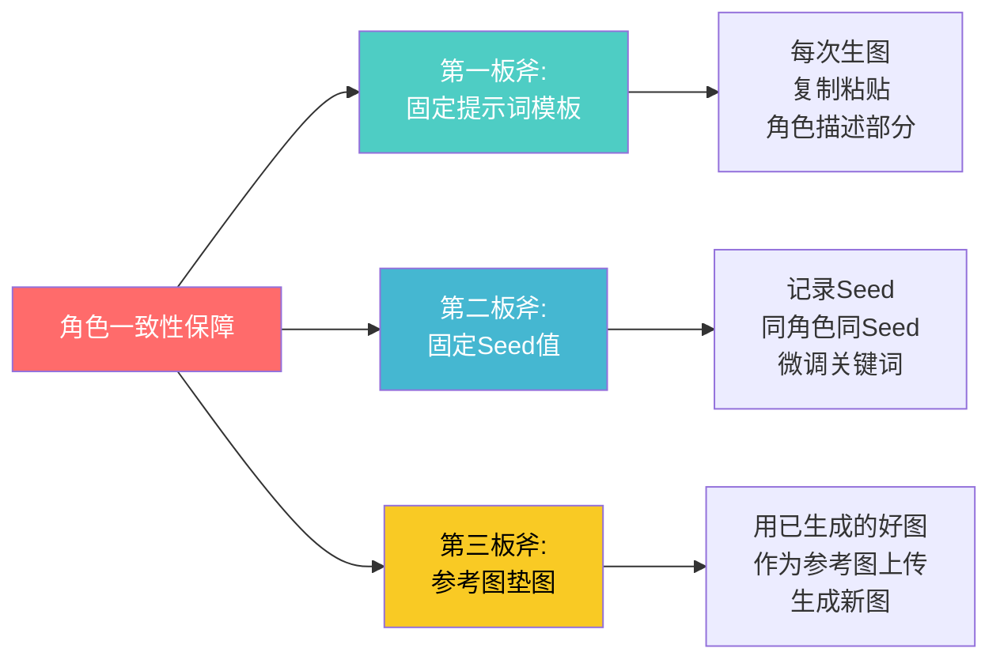
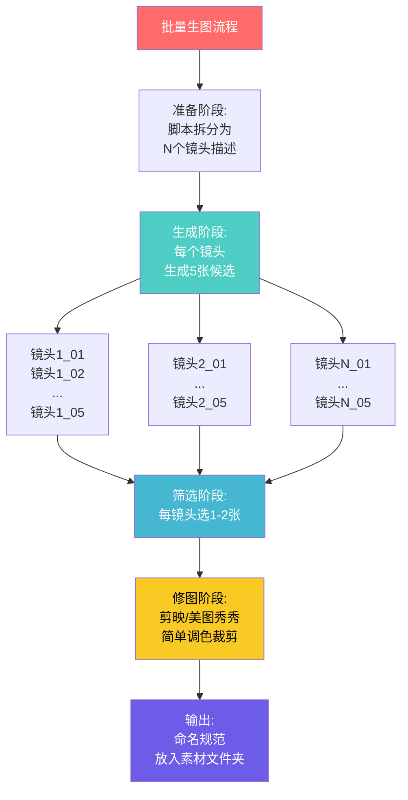
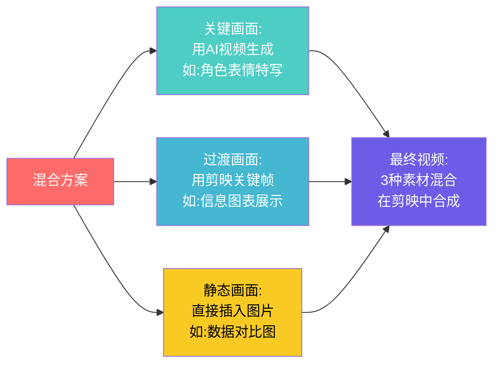
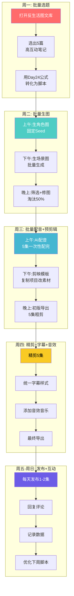
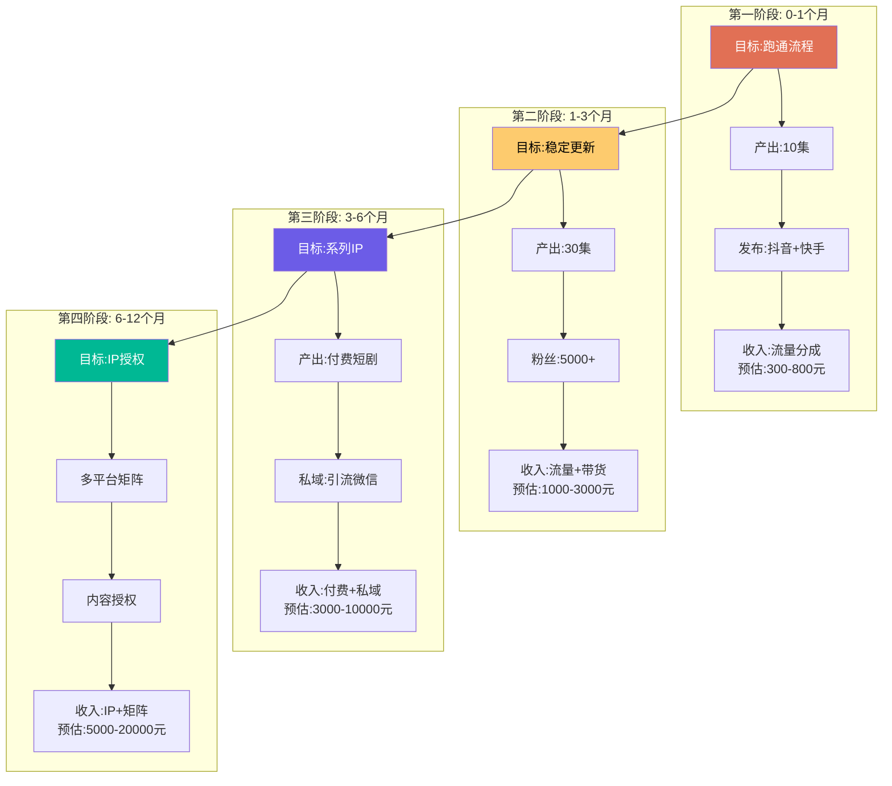

# 📕 Day25: AI短剧制作全流程

> **核心：AI短剧制作不是「创意+灵感」的艺术活动，而是「脚本→生图→动图→配音→剪辑→发布」的标准化流水线作业。掌握这条流水线的人，能用3-4小时把一段文字变成可在抖音/快手/视频号上跑量的成品短剧。反生活的优势在于：内容已经写了24天，缺的只是「把图文变成视频」的工业化能力。今天这篇笔记，就是补齐这块拼图的操作手册。**
> 来源：AI短剧行业制作SOP + 可灵/即梦/剪映官方教程 + 头部AI短剧团队内部流程拆解 + 反生活24天内容资产转化实践

---

## 一、一句话总结

**AI短剧制作全流程 = 在「AI能力边界」内，把「脚本文字」转化为「可发布视频」的标准化生产流水线。** 这条流水线的核心不是创意，而是**可控性**——每个环节都有明确的输入、输出、质量标准和备选方案。传统影视制作依赖导演和摄影师的审美，AI短剧制作依赖的是**流程设计、提示词工程和参数调优**。反生活要做AI短剧，不需要成为导演或编剧，只需要成为这条流水线的「车间主任」：把Day24写好的脚本，按照标准SOP推进，3小时后拿到成品。

> 💡 **老黄的铁律**：AI短剧的质量上限由脚本决定，但质量下限由制作流程决定。脚本再好，生图崩了、配音尬了、剪辑乱了，一样没人看。流程标准化，才能持续产出。

本章和[[Day24-AI短剧脚本创作]]（脚本写作方法论）、[[Day4-AI短剧制作入门]]（工具链与总体认知）、[[Day23-多平台内容复用]]（内容复用模型）、[[Day3-抖音短视频运营]]（短视频算法与爆款公式）紧密关联。

---

## 二、核心框架

### 2.1 AI短剧制作的「六步流水线」

```mermaid
graph TD
    subgraph "Step 1: 脚本锁定"
        S1[输入: 分镜脚本<br/>来自Day24] --> S1A[检查清单:<br/>镜头数≤8<br/>每镜头≤10秒<br/>AI可生成性100%]
        S1A --> S1B[输出: 锁定版脚本<br/>+ 角色卡<br/>+ 场景卡]
    end

    subgraph "Step 2: AI生图"
        S2[输入: 锁定版脚本] --> S2A[角色一致性:<br/>固定seed/LoRA<br/>角色卡严格遵循]
        S2A --> S2B[场景控制:<br/>避免复杂透视<br/>避免多人同框]
        S2B --> S2C[批量生成:<br/>每镜头3-5张<br/>共20-40张]
        S2C --> S2D[筛选:<br/>淘汰率50%<br/>保留可用素材]
        S2D --> S2E[输出: 图片素材库<br/>命名规范:<br/>镜头号_序号_状态]
    end

    subgraph "Step 3: 图片动起来"
        S3[输入: 筛选后的图片] --> S3A[方案A: AI视频生成<br/>可灵/即梦/Pika<br/>图片→3-5秒视频]
        S3A --> S3B[方案B: 剪映关键帧<br/>图片+缩放/平移<br/>模拟镜头运动]
        S3B --> S3C[方案C: 混合方案<br/>关键画面用AI视频<br/>过渡画面用关键帧]
        S3C --> S3D[输出: 视频片段库<br/>每个镜头1-3个片段]
    end

    subgraph "Step 4: 配音"
        S4[输入: 脚本台词] --> S4A[AI配音:<br/>剪映/魔音/配音阁]
        S4A --> S4B[音色选择:<br/>知识类=知性女声<br/>剧情类=情绪饱满]
        S4B --> S4C[节奏控制:<br/>每句之间有0.5s停顿<br/>重点词放慢]
        S4C --> S4D[输出: 音频文件<br/>MP3/WAV格式]
    end

    subgraph "Step 5: 剪辑合成"
        S5[输入: 视频片段+音频] --> S5A[时间轴对齐:<br/>画面与台词匹配]
        S5A --> S5B[添加字幕:<br/>剪映自动识别<br/>调整样式]
        S5B --> S5C[音效音乐:<br/>紧张处+心跳声<br/>揭秘处+叮咚声]
        S5C --> S5D[转场特效:<br/>同一场景用叠化<br/>不同场景用闪白]
        S5D --> S5E[输出: 初版视频<br/>60-90秒]
    end

    subgraph "Step 6: 发布与数据追踪"
        S6[输入: 成品视频] --> S6A[多平台发布:<br/>抖音/快手/视频号]
        S6A --> S6B[标题+标签:<br/>含关键词<br/>#AI短剧 #避坑]
        S6B --> S6C[数据追踪:<br/>24h/48h/7d<br/>完播率/互动率]
        S6C --> S6D[输出: 数据报告<br/>→反馈到Step1]
    end

    S1B --> S2
    S2E --> S3
    S3D --> S4
    S4D --> S5
    S5E --> S6
    S6D -.->|迭代优化| S1

    style S1 fill:#ff6b6b,color:#fff
    style S2 fill:#4ecdc4,color:#fff
    style S3 fill:#45b7d1,color:#fff
    style S4 fill:#f9ca24,color:#000
    style S5 fill:#6c5ce7,color:#fff
    style S6 fill:#00b894,color:#fff
```



**关键认知：这六个步骤环环相扣，前一步的输出是后一步的输入。任何一个环节的质量滑坡，都会在最终成品中被放大。**

| 步骤 | 时间预算 | 质量红线 | 常见问题 |
|------|---------|---------|---------|
| 脚本锁定 | 15分钟 | 角色/场景卡完备 | 边做边改，导致生图反复 |
| AI生图 | 60-90分钟 | 角色一致性100% | 角色崩脸、场景不符 |
| 图片动起来的 | 30-60分钟 | 画面流畅无卡顿 | AI视频生成失败率高 |
| 配音 | 15-30分钟 | 口播清晰、节奏对 | 语速太快、情绪不对 |
| 剪辑合成 | 45-60分钟 | 音画同步、节奏紧凑 | 画面拖泥带水、音效过吵 |
| 发布追踪 | 15分钟 | 标题含关键词、标签完整 | 忽视数据复盘 |

### 2.2 制作流程的「质量控制三角」

```mermaid
graph TD
    subgraph "质量控制三角"
        Q1[角色一致性] --> Q1A[同一个人<br/>每张图都要像]
        Q1 --> Q1B[服装不变<br/>发型不变<br/>配饰不变]

        Q2[风格统一性] --> Q2A[同一场景<br/>色调一致]
        Q2 --> Q2B[所有画面<br/>同一画风]

        Q3[叙事连贯性] --> Q3A[画面顺序<br/>=脚本顺序]
        Q3 --> Q3B[情绪曲线<br/>=脚本设计]
    end

    Q1 -.->|失控| F1[观众出戏<br/>"这人怎么变了？"]
    Q2 -.->|失控| F2[观感廉价<br/>"PPT动画？"]
    Q3 -.->|失控| F3[逻辑断裂<br/>"看不懂在讲啥"]

    style Q1 fill:#ff6b6b,color:#fff
    style Q2 fill:#4ecdc4,color:#fff
    style Q3 fill:#45b7d1,color:#fff
    style F1 fill:#636e72,color:#fff
    style F2 fill:#636e72,color:#fff
    style F3 fill:#636e72,color:#fff
```

**反生活的特殊注意**：知识揭秘型AI短剧对「角色一致性」要求相对较低（因为主角出镜少，信息图表多），但对「风格统一性」要求极高——所有信息图表必须使用同一套配色（反生活的品牌色：橙色+深蓝），否则看起来像拼凑的。

---

## 三、可落地的方法

### 3.1 Step 1: 脚本锁定——「输入检查清单」

在把脚本交给AI之前，必须逐项确认以下清单：

```
□ 角色卡已制作完成（外貌/服装/表情关键词）
□ 场景卡已制作完成（环境/光线/色彩关键词）
□ 每个镜头的「AI可生成性」已评估（避免复杂动作/多人同框/极端透视）
□ 台词总字数已统计（60秒≈150字，90秒≈220字）
□ 情绪曲线已标注（每个镜头的情绪标签：好奇/紧张/愤怒/希望/悬念）
□ 输出文件名已规划（Day25_选题名_镜头号_序号.png）
```

**反生活脚本锁定示例**：

```
【选题】超市这个标签，90%的人看不懂
【总时长】60秒
【风格】扁平插画+信息图表

□ 角色卡：阿反（25岁女性，短发，卡其风衣，已完成）
□ 场景卡：超市零食区（明亮灯光，货架，已完成）
□ 可生成性评估：
  - 镜头1（手部特写）：✅ 简单
  - 镜头2（配料表解析）：✅ 信息图表，AI擅长
  - 镜头3（分屏对比）：⚠️ 需要PS辅助
  - 镜头4（主角面对镜头）：✅ 标准人像
  - 镜头5（悬念结尾）：✅ 黑屏白字
□ 台词字数：148字 ✅
□ 情绪曲线：好奇→紧张→愤怒→希望→悬念 ✅
```

### 3.2 Step 2: AI生图——「反生活生图SOP」

#### 工具选择策略

| 工具 | 优势 | 劣势 | 适用场景 |
|------|------|------|---------|
| **可灵（Kling）** | 中文理解强、国内可用、速度快 | 风格单一、艺术性弱 | 知识类/科普类（首选） |
| **即梦（Dreamina）** | 字节出品、与抖音生态打通 | 免费额度少 | 抖音分发内容 |
| **Midjourney** | 艺术性强、风格多样 | 需翻墙、费用高 | 高品质剧情类 |
| **LiblibAI** | 国产、LoRA丰富 | 生成速度不稳定 | 角色一致性要求高的 |

**反生活推荐组合**：可灵（主力）+ 剪映（辅助修图）

#### 角色一致性保障的「三板斧」



**具体操作**：

1. **固定提示词模板**：
```
【角色核心描述，永远不变】
Asian young woman, 25 years old, short black hair, round glasses,
khaki trench coat, white inner shirt, black pants,
sharp and confident expression

【场景+动作，每次变化】
supermarket snack aisle, holding a product package, looking at camera,
flat illustration style, consistent character design, clean lines, soft shading

【固定后缀，永远不变】
--ar 9:16 --style raw --s 250
```

2. **Seed值管理**：
```
在可灵/即梦中，生成第一张满意的角色图后，记录Seed值。
后续所有同角色的图，都使用这个Seed值+微调描述。
Seed值记录位置：角色卡文件最下方
```

3. **参考图垫图**：
```
生成第一张满意图后，将其作为「参考图」上传。
新提示词只描述「动作和场景变化」，角色外貌由参考图锁定。
这是目前保证角色一致性最有效的方法。
```

#### 批量生图的「工厂化」流程



**时间分配**：
- 5个镜头的短剧，每个镜头生成5张 = 25张图
- 批量生成时间：30-45分钟（可灵同时跑5个任务）
- 筛选时间：15分钟
- 修图时间：15-30分钟（只调亮度/对比度/裁剪，不精修）

### 3.3 Step 3: 让图片动起来——三种方案详解

#### 方案A：AI视频生成（效果最好，成本最高）

**适用工具**：可灵（图生视频）、即梦（视频生成）、Pika、Luma

**操作流程**：
```
1. 在可灵选择「图生视频」
2. 上传单张图片
3. 输入运动描述（Motion Prompt）：
   - "camera slowly zooms in on character's face"
   - "character turns head slightly to the left"
   - "subtle breathing motion"
4. 设置运动幅度：Low（保守）/ Medium（标准）/ High（剧烈）
5. 生成5秒视频片段
6. 下载，放入素材库
```

**成功率提升技巧**：
- 运动描述要**保守**："slight head movement"比"character jumps and dances"成功率高10倍
- 避免**肢体生成**：AI生成手部动作失败率极高，让角色保持静止或微动最安全
- 善用**镜头运动**代替角色运动：推进、拉远、平移，这些由后期完成，不依赖AI

#### 方案B：剪映关键帧（最稳定，零成本）

**操作流程**：
```
1. 剪映导入静态图片
2. 选中图片，添加「关键帧」动画：
   - 缩放：从100%→120%（模拟镜头推进）
   - 位置：从左→右（模拟平移）
   - 不透明度：0%→100%（淡入效果）
3. 设置动画时长：2-5秒
4. 添加「画中画」叠加信息图表
5. 导出视频片段
```

**这是反生活最应该掌握的方案**——知识揭秘型短剧不需要角色大幅度运动，关键帧的缩放+平移+叠化完全够用。

#### 方案C：混合方案（性价比最优）



**反生活推荐**：方案C（混合）
- 主角出镜的关键镜头 → AI视频（5秒）
- 信息图表/数据展示 → 剪映关键帧（3秒）
- 标题/结尾悬念 → 静态图片+字幕（2秒）

### 3.4 Step 4: 配音——「反生活音色选择指南」

| 内容类型 | 推荐音色 | 语速 | 情绪 | 工具 |
|---------|---------|------|------|------|
| 知识揭秘 | 知性女声（如「新闻主播」） | 1.1x | 冷静、权威 | 剪映/魔音工坊 |
| 情绪共鸣 | 温暖女声（如「故事姐姐」） | 1.0x | 柔和、共情 | 配音阁 |
| 悬疑钩子 | 低沉男声（如「纪录片旁白」） | 0.9x | 神秘、紧张 | 魔音工坊 |
| 反生活专属 | 毒舌女声（带点嘲讽感） | 1.15x | 犀利、机智 | 剪映「趣味配音」 |

**剪映AI配音的「反生活参数」**：
```
音色：「解说小帅」或「新闻女声」（根据内容调整）
语速：1.1x（比普通口播稍快，符合短视频节奏）
音量：-3dB（给背景音乐留空间）
停顿：在句号处加0.3s停顿，逗号处加0.1s
重点词：在「骗局」「套路」「千万别」等词前加0.2s停顿
```

### 3.5 Step 5: 剪辑合成——「反生活剪辑模板」

#### 剪映项目设置

```
分辨率：1080×1920（9:16竖屏）
帧率：30fps
背景：黑色（如果画面不满屏）
安全区域：文字不要放在最上方10%和最下方10%（被标题和按钮遮挡）
```

#### 时间轴结构模板

```
【0-3秒】钩子画面
→ 黑屏白字标题（带音效「咚」）
→ 或：主角特写镜头推进

【3-15秒】问题升级
→ 画面1（3秒）+ 画面2（4秒）+ 画面3（5秒）
→ 每画面配1句台词
→ 转场：叠化 0.5秒

【15-30秒】核心揭秘
→ 信息图表画面（AI生成或剪映文字动画）
→ 重点词用橙色高亮
→ 音效：叮咚/叮叮（信息点出现）

【30-45秒】解决方案
→ 对比画面（左/右分屏）
→ 或：主角面对镜头讲解
→ 音乐从紧张转为轻快

【45-55秒】总结+行动号召
→ 金句文字（大字号，占满屏幕）
→ 主角挥手/点赞动作

【55-60秒】悬念结尾
→ 黑屏白字："但最可怕的是..."
→ 或：主角半侧脸，眼神凝重
→ 音乐戛然而止
```

#### 音效音乐「配方」

| 画面类型 | 背景音乐风格 | 音效 |
|---------|------------|------|
| 开场钩子 | 悬疑/紧张（低音铺垫） | 心跳声/咚 |
| 问题展示 | 紧张升级（弦乐） | 警示音/嘀嘀 |
| 核心揭秘 | 节奏暂停→突然爆发 | 叮咚/玻璃碎 |
| 解决方案 | 轻快/治愈（钢琴/吉他） | 清脆叮咚 |
| 结尾悬念 | 戛然而止/低音持续 | 弦乐拖长 |

**反生活推荐BGM来源**：
- 剪映自带「悬疑」分类（免费商用）
- 抖音热门音频（蹭流量，但注意版权）
- YouTube Audio Library（免费，需注明）

### 3.6 Step 6: 发布与数据追踪——「发布后24小时检查清单」

```
发布后0-2小时：
□ 检查视频是否过审
□ 确认标题、标签、封面是否显示正常
□ 自己完整看一遍，检查是否有黑屏/音画不同步

发布后2-6小时：
□ 记录初始播放量（通常500-2000为正常）
□ 观察评论区是否有反馈
□ 回复前10条评论（提升互动率）

发布后6-24小时：
□ 记录完播率（>30%及格，>50%优秀）
□ 记录点赞率（>3%及格，>8%优秀）
□ 记录评论率（>1%及格，>3%优秀）
□ 判断是否追投（完播率>40%可考虑投薯条）

发布后24-48小时：
□ 制作数据复盘表
□ 标记本次制作的问题
□ 优化下一集脚本
```

---

## 四、「反生活」可以直接用的

### 4.1 反生活AI短剧「一键生产SOP」



### 4.2 反生活专属「剪映项目模板」

**为什么要做模板？**

剪映可以保存「项目模板」——把字幕样式、转场效果、音效位置、背景音乐全部预设好。下一集只需要替换画面和台词，30分钟就能出一集。

**反生活模板预设**：
```
【画面尺寸】1080×1920
【字幕样式】
  - 字体：思源黑体 Bold
  - 字号：主字幕80pt，重点词100pt
  - 颜色：白色（带黑色描边）
  - 重点词颜色：#FF6B35（反生活品牌橙）
  - 动画：打字机效果（0.3秒/字）

【转场预设】
  - 镜头间：叠化 0.5秒
  - 场景切换：闪白 0.3秒
  - 结尾悬念：黑屏渐变 1秒

【音效预设】
  - 标题出现：咚（剪映自带）
  - 信息点：叮咚（剪映自带）
  - 警示：嘀嘀（剪映自带）
  - 悬念：弦乐拖长（剪映自带）

【背景音乐轨道】
  - 轨道1：悬疑底音（音量-20dB）
  - 轨道2：情绪音乐（音量-15dB，随画面切换）
```

**模板保存方法**：剪映→文件→另存为模板→命名「反生活AI短剧模板_v1」

### 4.3 反生活内容→AI短剧的「快速转化对照表」

| 反生活图文内容 | 对应的AI短剧画面 | 制作难度 | 预期效果 |
|--------------|----------------|---------|---------|
| 配料表解析 | AI信息图表+高亮动画 | ⭐⭐ | 完播率高 |
| 价格对比 | 分屏对比画面 | ⭐⭐ | 互动率高 |
| 骗局过程 | AI角色演绎+场景切换 | ⭐⭐⭐ | 转发率高 |
| 省钱技巧 | 步骤分解图+主角讲解 | ⭐⭐ | 收藏率高 |
| 产品测评 | 实拍+AI对比图 | ⭐⭐⭐ | 带货转化高 |

---

## 五、变现路径

### 5.1 AI短剧制作的「成本-收益」账本

| 项目 | 传统短剧 | AI短剧（反生活方案） |
|------|---------|-------------------|
| 编剧 | 5000-20000元/集 | 0元（自己写，已有内容） |
| 演员 | 3000-10000元/集 | 0元（AI角色） |
| 场地 | 2000-5000元/集 | 0元（AI场景） |
| 拍摄 | 5000-15000元/集 | 0元 |
| 后期 | 3000-8000元/集 | 0元（自己做） |
| 工具订阅 | - | 200-500元/月 |
| **单集成本** | **18000-58000元** | **≈50元（时间成本折算）** |
| 制作周期 | 3-7天/集 | 3-4小时/集 |

**反生活的核心优势**：内容资产已有（24天笔记），工具成本极低，唯一投入是时间。

### 5.2 反生活AI短剧变现路线图



### 5.3 收入测算（务实版）

| 阶段 | 月产出 | 平均播放 | 月收入构成 | 预估收入 |
|------|--------|---------|-----------|---------|
| 起量期 | 10集 | 2000/集 | 流量分成 | 200-600元 |
| 成长期 | 15集 | 5000/集 | 流量+带货 | 800-2000元 |
| 变现期 | 20集 | 1万/集 | 流量+带货+广告 | 2000-5000元 |
| 成熟期 | 20集 | 5万/集 | 全链路 | 5000-15000元 |

> 💡 **老黄的务实目标**：第1个月不求赚钱，只求做出10集成品、跑通全流程。第2个月开始稳定日更，第3个月看到稳定收入。关键是：不要把AI短剧当「副业项目」，要当「内容资产的生产线」——每多一集，就多一个24小时不停工作的「数字员工」。

---

## 六、行动清单

### ✅ 今天就能做的3件事

**第一件事：下载并熟悉剪映模板功能（1小时）**
- [ ] 下载剪映专业版（电脑端，操作更高效）
- [ ] 新建一个空白项目，按本文3.5节的参数设置好字幕样式
- [ ] 添加转场预设、音效预设、背景音乐轨道
- [ ] 保存为「反生活AI短剧模板_v1」
- [ ] 测试：导入一张图片+一段音频，用模板快速生成10秒样片

**第二件事：在可灵/即梦完成「第一张角色图」（30分钟）**
- [ ] 注册可灵账号（国内手机号即可）
- [ ] 使用本文3.2节的提示词模板，生成阿反的第一张角色图
- [ ] 调整提示词直到满意（记录最终版提示词）
- [ ] 记录Seed值，保存到角色卡
- [ ] 用「参考图垫图」功能，生成同角色的3个不同动作
- [ ] 检查3张图的角色一致性（脸、发型、服装是否一致）

**第三件事：用现有内容制作「第一集试水短剧」（2小时）**
- [ ] 从反生活已发布的笔记中，选1篇最短、最直观的（如「闲鱼5不碰」）
- [ ] 用Day24的60秒脚本模板，写出分镜（6个镜头）
- [ ] 用可灵生成6张关键画面图
- [ ] 用剪映的「关键帧」功能让图片动起来
- [ ] 用剪映AI配音，生成旁白
- [ ] 合成一集60秒完整视频
- [ ] 自己看3遍，记录问题
- [ ] **不发布，只做内部测试**——第一集的目标是验证流程，不是追求爆款

### 📌 本周完成目标

- [ ] 完成3集AI短剧的完整制作（从脚本到成品）
- [ ] 建立「反生活AI短剧素材库」文件夹（角色图/场景图/音效/模板）
- [ ] 确定固定制作时间（建议：每周三下午批量生图，周四批量剪辑）
- [ ] 在抖音注册AI短剧专用账号（或先用现有账号测试）
- [ ] 发布第一集到抖音，观察24小时数据
- [ ] 制作数据复盘表，记录完播率/点赞率/评论率

---

> **关联笔记**：[[Day24-AI短剧脚本创作]] · [[Day4-AI短剧制作入门]] · [[Day23-多平台内容复用]] · [[Day3-抖音短视频运营]] · [[Day13-小红书爆款复制方法论]] · [[Day1-小红书变现全攻略]]

> **学习来源**：可灵/即梦官方制作指南 + 剪映创作者学院 + 头部AI短剧团队制作SOP（@AI短剧工厂 @数字人内容基地）+ 短视频工业化生产方法论（《短视频运营实战》《内容生产线设计》）+ 反生活24天内容资产转化实践
