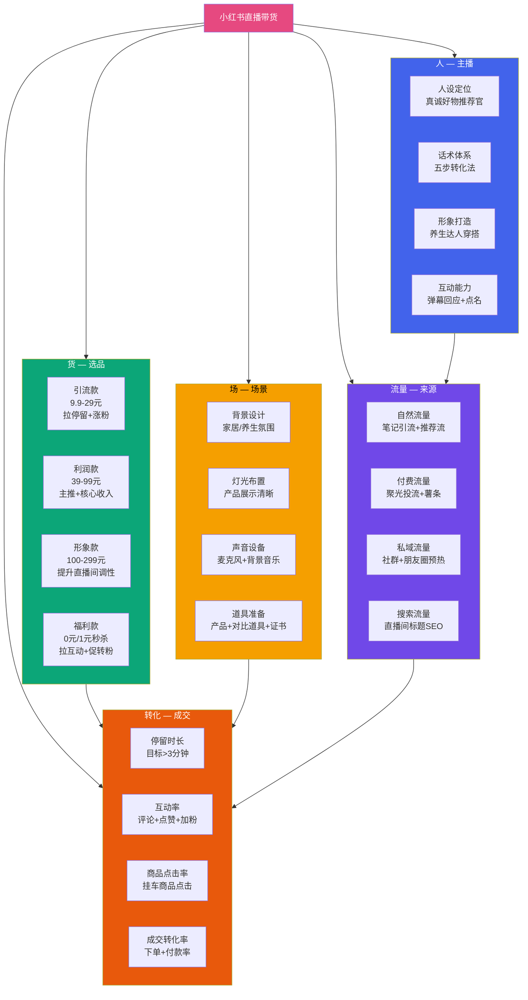
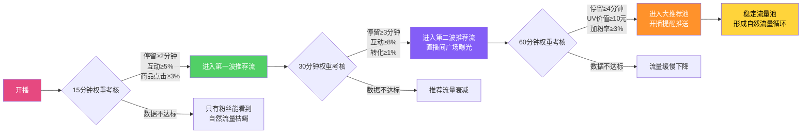
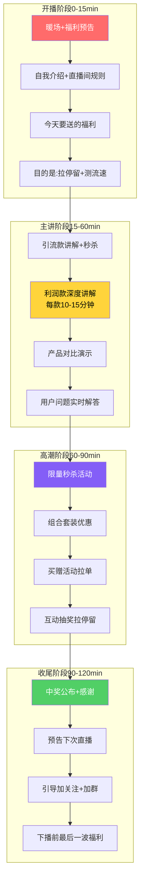
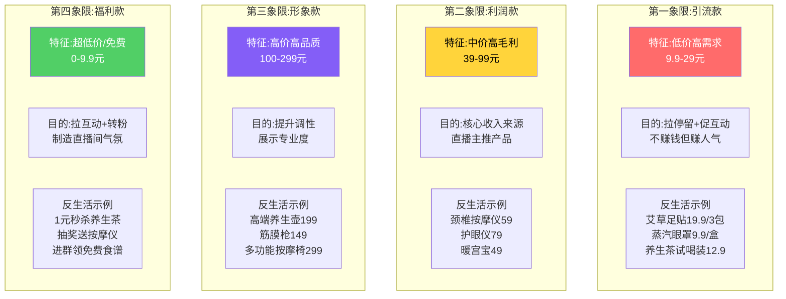
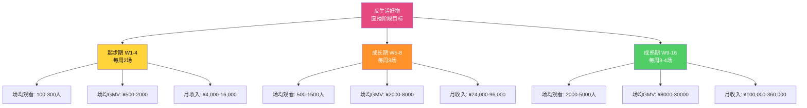

# Day25: 小红书直播带货实战

> 📅 学习日期：2026-07-18
> 🔗 关联笔记：[[00-目录]] | 上一篇：[[Day24-内容数据分析与迭代优化]] | 下一篇：Day26
> 🎯 适用场景：反生活好物养生账号的小红书直播启动、人货场搭建、话术设计、投流配合
> 📚 学习来源：小红书官方直播课程 × 多名头部养生主播复盘 × 聚光投流实战案例 × 蝉妈妈直播数据 × 多家MCN直播SOP

---

## 1. 一句话总结

**小红书直播带货 = 用「人设信任 × 场景化演示 × 限时限量」打造「高转化低退货」的直播间，核心不是「卖货」而是「帮粉丝选品」——直播间是笔记种草效率的 10 倍放大器，每 1 小时直播 ≈ 100 条笔记的转化效果，但前提是「人货场」三要素全部到位，否则就是对着空气播。反生活好物的养生品类天然适合直播——高客单、强信任、决策链路长，直播正好解决「笔记看了不敢买」的信任瓶颈。**

**核心认知转变：** 大多数人以为直播是「对着镜头喊 3、2、1 上链接」，但小红书的直播生态完全不同——用户来小红书是「逛商场」不是「赶大集」，他们需要的是真诚推荐+专业讲解，而不是大吼大叫的促销。**小红书的直播=升级版笔记，不是缩减版抖音。**

---

## 2. 核心框架

### 2.1 小红书直播与人货场全景图



### 2.2 小红书直播的底层算法逻辑



**小红书直播权重核心指标（按重要性排序）：**

| 指标 | 及格线 | 良好线 | 优秀线 | 为什么重要 |
|:----:|:-----:|:------:|:------:|:---------|
| **停留时长** | 2分钟 | 3分钟 | 5分钟+ | 决定直播间能否获得推荐流量 |
| **互动率** | 3% | 8% | 15%+ | 评论+点赞决定直播间活跃度权重 |
| **商品点击率** | 3% | 8% | 15%+ | 决定商品讲解是否被算法判定为「有效直播」 |
| **加粉率** | 1% | 3% | 5%+ | 决定下播后的长期流量来源 |
| **成交转化率** | 0.5% | 1% | 3%+ | 直播间的终极目标，影响后续流量分配 |
| **UV价值** | 5元 | 10元 | 20元+ | 每用户平均产出，平台最看重的商业化指标 |
| **退货率** | <15% | <10% | <5% | 高退货率会被平台限流（比卖得少更可怕） |

> **反生活好物关键数据目标（养生赛道）：** 停留≥3分钟 / 互动≥10% / 加粉≥3% / UV≥8元 / 退货率<8%

### 2.3 反生活好物直播间四段式结构



---

## 3. 可落地方法

### 3.1 反生活好物直播间搭建清单

#### 硬件清单（起步阶段：总投入 ¥500-1000）

| 物品 | 建议 | 预算 | 原因 |
|:----|:----|:---:|:----|
| **手机** | iPhone XR 以上 | 已有 | 小红书直播对 iPhone 兼容性最好 |
| **环形补光灯** | 直径 30cm+ 可调色温 | ¥80-150 | 让产品和主播面部清晰，避免昏暗感 |
| **麦克风** | 领夹式无线麦 | ¥50-100 | 养生品类需要讲解产品细节，声音清晰是关键 |
| **手机支架** | 可调节高度，桌面/站立两用 | ¥30-50 | 解放双手方便展示产品 |
| **背景布** | 纯色或木质纹理布（莫兰迪色系） | ¥30-50 | 提升直播间档次，不要杂乱背景 |
| **产品展示台** | 小圆桌/亚克力展示架 | ¥50-100 | 产品摆拍+展示，比拿着播更专业 |
| **道具** | 对比实验道具（纸巾/水杯/体验仪） | ¥100-200 | 养生品类特别需要实物演示 |

> **反生活起步建议：** 不要一上来就买几千块的专业设备。先用手头手机+50块的补光灯试播3场，如果数据还行再逐步升级。**90%的直播间失败不是因为设备差，而是话术和选品不行。**

#### 直播间场景搭建三原则

```markdown
## 反生活直播间搭建SOP

### 原则1：家居温馨感（小红书用户审美）
- 背景：浅色系家居风格（原木色/白色/米色）
- 避免：纯白墙（太寡淡）或杂乱堆货（像地摊）
- 可选：放一盆绿植+暖色台灯+靠垫，营造「家居好物分享」氛围
- 反生活专属：在背景放置几个养生好物（艾草贴/保温杯/养生壶），暗示专业度

### 原则2：产品展示区要亮
- 主播面部：环形灯正面打光
- 产品展示：侧上方45°打光，让产品纹理清晰可见
- 对比展示：准备两个灯光模式——正常模式(主播讲解)+特写模式(产品细节)
- 避免：背光、顶光（让脸一片黑）or 正面强光（刺眼暴露皮肤瑕疵）

### 原则3：画面构图要「留白」
- 主播在画面中间偏左或偏右（留出产品展示空间）
- 手机横屏（推荐的直播模式）
- 头顶上方空1/3画面（不要顶天立地）
- 产品展示时，画面应该70%产品+30%主播手部
```

### 3.2 反生活好物选品策略（养生品类专配）

#### 选品四象限模型



#### 反生活首场直播选品组合（8-10款）

| 类型 | 产品 | 价格 | 成本 | 毛利 | 直播目标 |
|:---:|:----|:---:|:---:|:---:|:--------|
| 🟢 引流款×3 | 艾草足贴体验装 | ¥19.9 | ¥5 | ¥14.9 | 让所有人买得起，拉高销量 |
| 🟢 引流款×3 | 蒸汽眼罩5片装 | ¥12.9 | ¥4 | ¥8.9 | 低价拉新，回馈粉丝 |
| 🟢 引流款×3 | 养生茶试喝包3包 | ¥9.9 | ¥3 | ¥6.9 | 最低价入口，零门槛 |
| 🟡 利润款×2 | 颈椎脉冲按摩仪 | ¥79 | ¥25 | ¥54 | 主力利润来源，详细讲解 |
| 🟡 利润款×2 | 智能护眼仪温敷款 | ¥89 | ¥28 | ¥61 | 高毛利，养生标配 |
| 🟡 利润款×2 | 艾灸蒲团坐垫 | ¥49 | ¥15 | ¥34 | 差异化产品，话题性强 |
| 🔵 形象款×1 | 高端养生壶（炖煮款） | ¥199 | ¥80 | ¥119 | 拔高调性，展示专业度 |
| 🔵 形象款×1 | 多功能筋膜枪 | ¥149 | ¥55 | ¥94 | 按摩类延伸，强需求 |
| 🟣 福利款 | 1元秒杀·养生茶大包 | ¥1 | ¥8 | -¥7 | 亏钱但拉停留+互动 |
| 🟣 福利款 | 抽奖送颈椎按摩仪 | ¥0 | ¥25 | -¥25 | 每30分钟抽一次，拉停留 |

> **首场直播选品要诀：引流款占50%数量但只贡献20%收入，利润款占30%数量贡献60%收入，形象款+福利款占20%贡献20%收入+氛围。**

### 3.3 反生活直播间话术体系——「五步转化话术」

这是专门针对养生好物赛道的直播间话术框架。每款产品讲10-15分钟，按五步走：

```markdown
## 反生活直播话术五步法

### 第一步：痛点引入（1-2分钟）🎯
目标：让用户觉得「说的就是我」

「姐妹们，你们有没有这种情况——
每天早上起来脖子硬得像石头，转个头咔嚓咔嚓响？
去按摩店一次200多，还不能天天去？
如果说的就是你，今天这款产品你一定要看完👇」

心法：用「问句式+具体场景」制造代入感，不说产品名先制造需求

### 第二步：产品展示+功效讲解（3-5分钟）📦
目标：让用户看到产品怎么用、效果怎么样

「来看一下这款智能颈椎按摩仪——
第一，它是物理揉捏+恒温热敷，不是那种电流刺痛感。
（一边说一边拿起产品贴在自己脖子上演示）
第二，16个按摩头，覆盖整个后颈和斜方肌。
（特写镜头对准按摩头旋转）
第三，充一次电能用7天，每天只要15分钟。
（展示充电口和电量显示）

最重要的是——它不是只能戴在脖子上，肩膀、腰部、腿部都能用。」

心法：边说边演示，每个功能点都要有「镜头语言」配合

### 第三步：信任堆叠（2分钟）🤝
目标：消除「怕买错、怕买贵、怕退货麻烦」

「这款按摩仪——
全网销量已经突破20万台（展示手机截图）
复购率高达75%，很多姐妹买了还送爸妈（展示好评截图）
国家3C认证，质量绝对有保障（展示证书）
7天无理由退换，还送运费险——你不满意随时退」

心法：信任四重奏——数据信任→口碑信任→权威信任→售后保障

### 第四步：价格对比+限时优惠（1分钟）💥
目标：制造紧迫感，促成立即下单

「这个按摩仪官方旗舰店卖159，今天在直播间——
直接降到79！
对，你没听错，79！
今天直播间下单，再送一个价值19.9的收纳包！
只有今天直播间的姐妹才有这个价格，
链接挂了100单，拍完就恢复原价！
手快有手慢无，抓紧去拍👇」

心法：锚定原价→直播价→加赠品→限时限量→行动指令

### 第五步：互动催单+弹幕管理（1分钟）💬
目标：用社会认同制造下单氛围

「已经有30个姐妹拍下了，谢谢大家的信任！
还没拍的抓紧了，还剩最后20个名额。
刚有个姐妹问『这个和几百块的有什么区别』——
功能真的一样，区别就在品牌溢价，我们今天去掉了品牌溢价。
想抢的姐妹在公屏打个『抢』字，我看多少人想要👇」

心法：汇报已售数量+制造紧缺感+回答典型问题+引导互动
```

### 3.4 直播前的预热+直播后的复盘SOP

#### 【直播前】3步预热流程

```markdown
## 反生活直播前预热SOP（直播前3天启动）

### 第一步：笔记预热（直播前3-2天）
- 发1条悬念型笔记：「这周六晚上8点，我在直播间送好礼🎁」
- 发1条剧透型笔记：「刚到了一批宝藏好物，周六直播间见」
- 发1条福利型笔记：「周六直播间前50名下单送XXX」
- 所有预热笔记标题带上直播间关键词 + 开播时间

### 第二步：私域预热（直播前1天）
- 群里发预告海报+直播二维码
- 告知具体福利力度：「明天整点抽奖送按摩仪」
- 发接龙/扣1 测热度和预约率
- 私信活跃粉丝：「明天直播间有你的专属福利」

### 第三步：开播前30分钟
- 发1条「马上开播」笔记（带直播预约链接）
- 微信群发直播间链接
- 确认网络、设备、灯光、产品全部到位
- 暖场时播15分钟轻松聊天+展示福利
```

#### 【直播后】30分钟复盘模板

```markdown
## 反生活直播复盘模板

### 基础数据
- 直播时长：____
- 观看人数：____
- 平均停留：____
- 互动评论：____
- 新增粉丝：____
- 成交订单：____
- GMV总额：____
- UV价值：____
- 退货单数：____

### 选品表现
| 产品 | 讲解时长 | 点击次数 | 下单数 | GMV | 退货 |
|:----|:-------:|:-------:|:-----:|:---:|:---:|
| 引流款1 | | | | | |
| 利润款1 | | | | | |
| 利润款2 | | | | | |
| 形象款 | | | | | |

### 关键问题诊断
✅ 做得好的地方：
1. ______________
2. ______________

🔴 需要改进的地方：
1. ______________
2. ______________

### 下次直播调整方向
1. ______________
2. ______________
```

### 3.5 直播间常见问题应对清单——反生活养生专场

| 常见问题 | 正确回应 | 错误回应 | 说明 |
|:--------|:---------|:---------|:----|
| 「这个和XX比哪个好？」 | 「XX我也了解过，它主打的是XX功能，我们这个更侧重XX。看你的需求，如果XX需求更强选XX，XX需求更强选我们」 | 「我们的更好」 | 公平对比显得专业，用户反而信你 |
| 「值得买吗？」 | 「如果你有XX问题，我觉得值得——因为XX（说具体效果）。但如果你只是跟风，建议想清楚再买」 | 「超级值得！不买亏大了」 | 敢劝退反而增加信任 |
| 「价格能便宜点吗？」 | 「不好意思，直播间已经是最低价了。不过我可以加送你一个XX赠品」 | 「那给你再减10块」 | 现场降价显得定价不实 |
| 「效果真的有用吗？」 | 「从我自己的体验来看（说自己的真实感受），加上很多用户反馈也说有用（展示好评）」 | 「绝对有用！用了就好」 | 过度承诺会提高退货率 |
| 「有没有副作用？」 | 「我们的产品是XX材质/XX成分，有国家认证，正常使用没有副作用。但如果XX情况建议先咨询医生」 | 「完全没有」 | 诚实告知让用户放心 |

### 3.6 反生活养生直播间的「3+1」频率节奏

```markdown
## 反生活直播节奏规划

### 起步期（第1-4周）：每周2场直播
- 周三 20:00-21:30（1.5小时）
- 周六 20:00-22:00（2小时）
- 目标：熟悉直播节奏，测试选品，磨合话术

### 成长期（第5-8周）：每周3场直播
- 周二 19:30-21:00
- 周四 19:30-21:00
- 周六 20:00-22:00
- 目标：稳定流量，提高转化，积累粉丝

### 成熟期（第9周+）：每周3-4场直播 + 1场爆款专场
- 常规场：周二/四/六
- 专场：每月1次「养生节」/「季节专场」/「品牌专场」
- 目标：专场冲GMV，日常场养粉丝

### 直播时长建议
- 起步期不要超过2小时（最长2小时）
- 2小时是小红书直播的「黄金时长」
- 超过2小时主播累、用户累、转化率下降
- 后期可加到2.5-3小时，但要确保内容密度不降
```

---

## 4. 变现路径

### 4.1 小红书直播的变现效率计算

#### 直播 vs 笔记的变现效率对比

| 维度 | 笔记带货 | 直播带货 | 直播效率倍数 |
|:----|:-------:|:-------:|:----------:|
| **单篇/单场收入** | 50-500元 | 500-5000元 | 10-50x |
| **转化率** | 0.3-1% | 3-10% | 10x |
| **客单价** | 30-50元 | 50-100元 | 1.5-2x |
| **用户信任建立** | 低（单向阅读） | 高（实时互动） | — |
| **即时成交能力** | 低 | 高 | — |
| **退货率** | 10-15% | 5-10% | 更低 |
| **内容寿命** | 7-30天（长尾） | 仅直播期间（但可切片） | — |

> **结论：直播的即时变现效率是笔记的10-50倍，但笔记有长尾效应。正确策略是「笔记种草+直播收割」——笔记负责持续引流和建立认知，直播负责临门一脚的成交转化。**

#### 反生活好物直播收入模型测算



**收入计算公式：**
```
直播月收入 = 直播场次 × 场均观看人数 × 转化率 × 客单价

起步期示例：
8场/月 × 200人/场 × 5%转化率 × ¥60客单价 = ¥4,800/月

成长期示例：
12场/月 × 1000人/场 × 6%转化率 × ¥70客单价 = ¥50,400/月

成熟期示例：
16场/月 × 3500人/场 × 8%转化率 × ¥80客单价 = ¥358,400/月
```

### 4.2 直播间三大变现模式对比

| 模式 | 适合阶段 | 收入占比 | 利润率 | 操作难度 | 说明 |
|:---:|:--------:|:-------:|:-----:|:-------:|:----|
| **自有品牌+自播** | 成熟期 | 60-80% | 40-60% | ⭐⭐⭐⭐⭐ | 自己找源头工厂贴牌，利润最高 |
| **精选联盟带货** | 起步期 | 80-100% | 15-30% | ⭐⭐ | 从精选联盟选品赚佣金，0风险 |
| **品牌合作专场** | 成长期 | 20-40% | 20-40% | ⭐⭐⭐⭐ | 品牌付坑位费+佣金，适合做大场 |

> **反生活起步建议：从精选联盟带货开始（0库存0风险），跑通直播SOP后转部分自有品牌产品（提升利润），偶尔接品牌合作（提升调性）。**

### 4.3 聚光投流配合直播的ROI模型

当直播数据稳定后（停留≥3分钟+互动≥8%），可以考虑用聚光投流放大：

```markdown
## 反生活直播聚光投流策略

### 投流条件（不够条件不要投！）
✅ 自然流场均观看≥300人
✅ 平均停留≥3分钟
✅ 转化率≥3%
✅ 退货率≤10%

### 投流方式
1. 直播间直投（花钱买直播间曝光）
   - 适合：话术成熟、选品稳定后
   - 预算：起步每天¥100测试

2. 笔记引流直播间（预热笔记加热）
   - 适合：预热期，把笔记流量导入直播间
   - 预算：每篇笔记¥50-100加热

### ROI参考值
- 起步期：ROI 1.5-2.5x（勉强能跑通）
- 成长期：ROI 2.5-5x（健康水平）
- 成熟期：ROI 5-10x（可以加码投）
- ROI<1.5x：立即停止投流，优化直播间

### 反生活专属投流口诀
「自然流不稳，一分钱不投；
转化率不达标，投了也白捞；
ROI过2，可以加码跑；
退货率超10，必须停下来找原因。」
```

---

## 5. 行动清单

### ✅ 行动①：本周完成首场直播筹备（2小时）

**操作步骤：**

1. **用手机拍一段家里的环境**，选一个最适合做直播的角落
   - ✅ 光线好（有自然光或可布置补光灯）
   - ✅ 背景干净（纯色/木质/莫兰迪色系）
   - ✅ 安静（没有孩子/宠物/马路噪音）
   - 如果都没有理想的，¥50买一块背景布解决

2. **从你现有的产品中挑出8-10款**，按上面四象限选品表分类
   - ✅ 引流款3个
   - ✅ 利润款3个
   - ✅ 形象款1个
   - ✅ 福利款（抽奖/秒杀）

3. **写好首场直播的逐字逐句话术**
   - 开场话术（5分钟）→ 暖场+自我介绍+福利预告
   - 产品讲解话术（每个产品10-15分钟）→ 用上面的五步法
   - 催单话术（每次上链接前）
   - 结尾话术（最后15分钟）

**产出：** 直播筹备清单全部打勾 + 首场直播逐字稿写完

### ✅ 行动②：进行一次15分钟的手机试播测试（今天30分钟）

> 不要等到「准备完美了再开播」——小红书直播最好的学习方法就是「直接开播」。第一次面对镜头会很尴尬，正常！

**操作步骤：**

1. **打开小红书 → 创作者中心 → 直播 → 开始直播**（不告诉任何人的测试）
2. **对着镜头说15分钟**（不要关评论但不要看）
   - 前5分钟：自我介绍+今天的主题
   - 中间5分钟：拿一个产品讲（按五步法）
   - 最后5分钟：随便聊天，把要说的话说完
3. **录屏保存**，然后自己看回放
   - ✅ 我有没有习惯性看镜头？
   - ✅ 我的声音是否清晰？
   - ✅ 我有没有「嗯…」「那个…」等口头禅？
   - ✅ 产品展示是否清晰？
   - ✅ 我有多少次笑了/和观众互动了？

4. **复盘输出：** 写出3个做得好的地方 + 3个需要改进的地方

**产出：** 15分钟测试直播 + 自我回放复盘笔记

### ✅ 行动③：制定本周开播计划+预热（今天1小时）

**操作步骤：**

1. **确定首次正式直播时间**（本周六或周日晚上8点）
2. **发3条预热笔记：**
   - 📝 笔记①（今天发）：「本周六晚8点，直播间送养生好物🎁」
   - 📝 笔记②（明天发）：「预告！这周六直播间3个福利剧透👇」
   - 📝 笔记③（周六发）：「今晚8点开播！养生套餐大放送🔥」
3. **在私域群里发预告**（微信/小红书群）
   - 海报+直播间二维码
   - 福利剧透（1元秒杀品+抽奖品）
   - 扣1预约接龙
4. **检查设备清单：**
   - ✅ 手机电量100%
   - ✅ 补光灯到位
   - ✅ 麦克风测试OK
   - ✅ 网络测速（上传≥5Mbps）
   - ✅ 产品摆放整齐
   - ✅ 水杯（主播自己要喝水）

**产出：** 1个定档直播时间 + 3条预热笔记内容 + 设备检查单全部打勾

---

> **📌 总结核心心法：**
>
> 小红书直播 ≠ 抖音直播。**小红书用户是来「逛」的，不是来「赶集」的。** 真诚推荐 > 大声叫卖，专业讲解 > 3-2-1上链接，场景化演示 > 单调口播。
>
> **养生品类在小红书直播有天然优势：** 高客单、高复购、需要专业讲解、用户决策周期长——直播正好是「解决信任问题」的最佳场景。
>
> **记住三句话：**
> 1. **「首播就是最好的练习」**——不要等完美，先开播再说
> 2. **「数据比感觉重要」**——每一场要复盘、要记录、要优化
> 3. **「直播是十倍放大器」**——笔记种草是1，直播成交是10，但前提是笔记先做好
>
> 关联笔记: [[Day01-小红书电商闭环]] | [[Day02-小红书投放与投流]] | [[Day05-小红书矩阵号运营]] | [[Day08-朋友圈营销]] | [[Day18-多平台变现矩阵]] | [[Day19-用户心理与行为设计]] | [[Day24-内容数据分析与迭代优化]]
