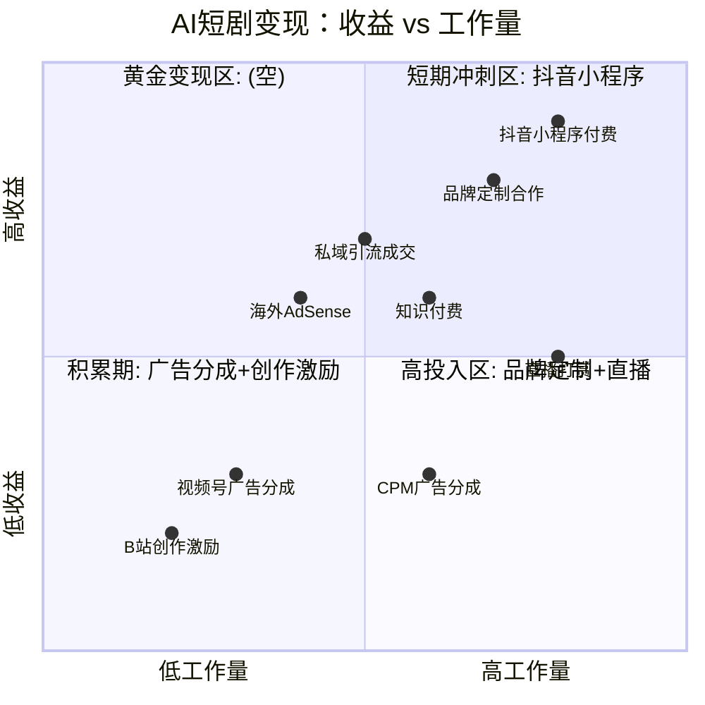
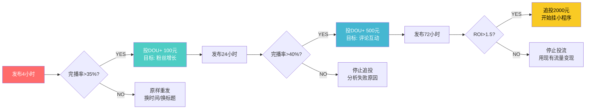
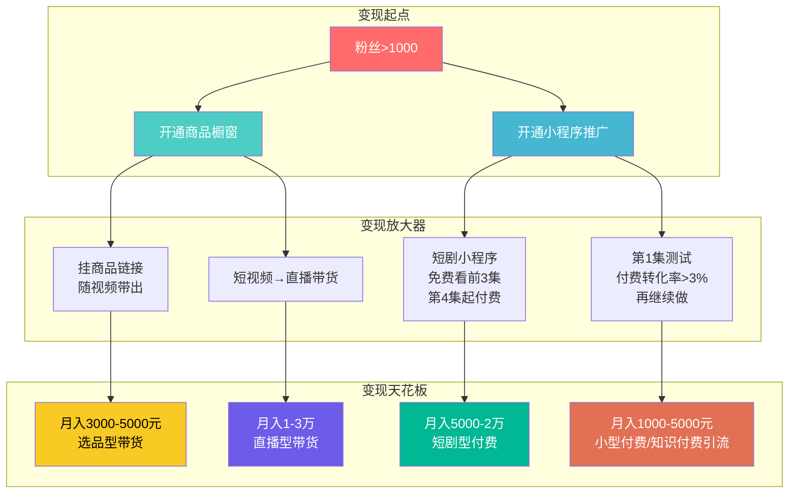
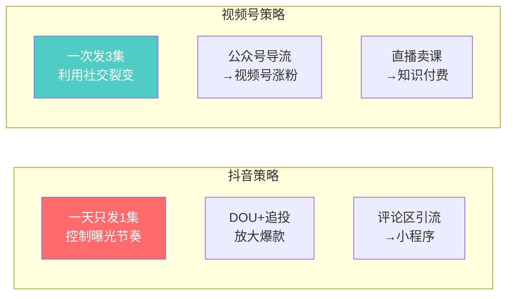
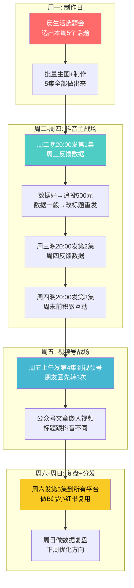
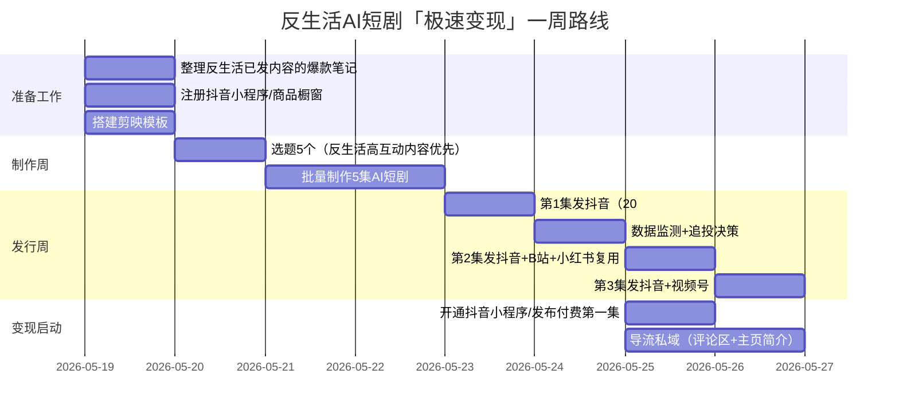
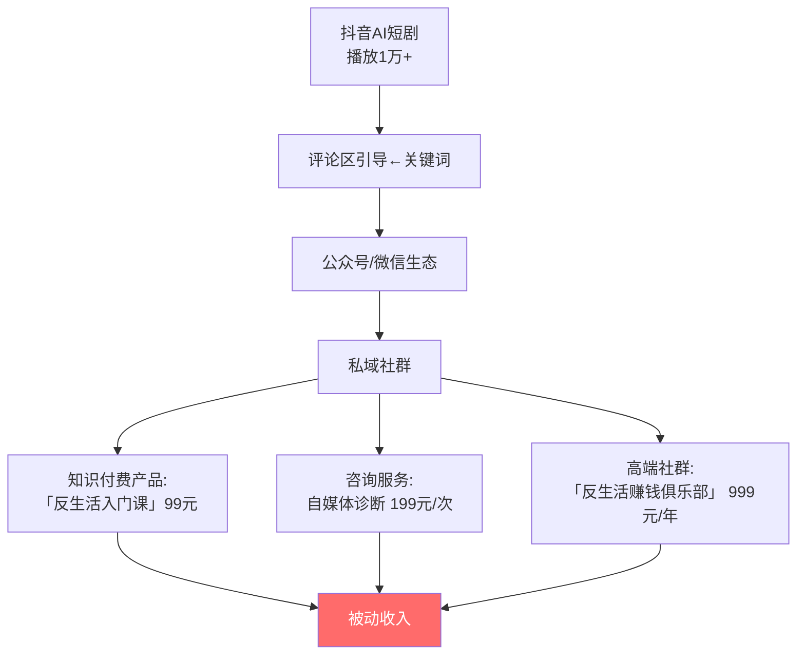

# 📕 Day26: AI短剧分发与变现

> **核心：AI短剧的终局不是「制作」，而是「分发与变现」。你可以在3小时内做出一集AI短剧，但如果没人看、没人买单，这就是一场技术自嗨。AI短剧的分发逻辑和传统短视频完全不同——你需要同时搞定平台算法推荐（获取免费流量）、私域分发（沉淀资产）、C端付费（直接变现）、B端授权（放大杠杆）四条路径。反生活有内容、有脚本、有制作能力，今天缺的就是「把做好的短剧变成现金」的分发与变现系统。**
> 来源：抖音/快手短剧创作者实战经验 + 短剧行业报告 + 腾讯微短剧分账制度 + 抖音小程序变现拆解 + 头部AI短剧账号运营复盘

---

## 一、一句话总结

**AI短剧变现 = 选对平台(70%) + 设计付费节点(20%) + 数据驱动迭代(10%)。** 做得再好，发错了平台等于白做。每个平台的用户画像、推荐机制、变现玩法都不一样——抖音适合靠CPM广告+小程序变现，快手靠直播打赏+私域成交，视频号靠微信生态闭环+广告分成，B站靠创作激励+知识付费，小红书靠品牌合作+带货。**反生活不需要每个平台都做，而是选1-2个主战场做到极致，其他平台做内容复用的「捡钱」动作。**

> 💡 **老黄的铁律**：AI短剧60%的竞争力在制作前（选题和脚本），30%在分发策略（什么时候发、怎么发、怎么追投），只有10%在制作本身。但大多数AI短剧创作者90%的时间花在制作上。

本章和[[Day25-AI短剧制作全流程]]（制作流水线）、[[Day24-AI短剧脚本创作]]（脚本设计）、[[Day23-多平台内容复用]]（内容复用策略）、[[Day3-抖音短视频运营]]（算法与推荐）、[[Day22-视频号生态]]（微信生态）、[[Day20-抖音带货与橱窗]]（电商变现）、[[Day12-小红书投放与投流]]（付费投流）紧密关联。

---

## 二、核心框架

### 2.1 AI短剧「分发变现」全景图

```mermaid
graph TD
    subgraph "制作端"
        A[AI短剧成品<br/>Day24+Day25产出] --> A1[封面设计<br/>标题文案<br/>关键词标签]
    end

    subgraph "分发端"
        A1 --> B1[抖音/抖音极速版<br/>→算法推荐+小程序]
        A1 --> B2[快手/快手极速版<br/>→公域+私域]
        A1 --> B3[视频号/微信生态<br/>→社交裂变+公众号]
        A1 --> B4[小红书<br/>→内容种草+引流私域]
        A1 --> B5[B站<br/>→长尾流量+创作激励]
        A1 --> B6[海外平台<br/>→YouTube/TikTok/Reels]
    end

    subgraph "变现端"
        B1 --> C1[抖音端变现:<br/>小程序付费解锁<br/>CPM广告分成<br/>橱窗带货<br/>知识付费引导]
        B2 --> C2[快手端变现:<br/>直播打赏<br/>私域引流成交<br/>磁力金牛投流]
        B3 --> C3[视频号变现:<br/>广告分成(互选)<br/>公众号导流<br/>小程序带货<br/>企业微信沉淀]
        B4 --> C4[小红书变现:<br/>品牌合作<br/>薯条投流引私域<br/>商品笔记]
        B5 --> C5[B站变现:<br/>创作激励<br/>花火商单<br/>知识付费]
        B6 --> C6[海外变现:<br/>YouTube AdSense<br/>TikTok Creator Fund]
    end

    subgraph "数据回流"
        C1 --> D[数据看板<br/>完播率/付费率/ROI]
        C2 --> D
        C3 --> D
        C4 --> D
        C5 --> D
        C6 --> D
        D --> A
    end

    style A fill:#ff6b6b,color:#fff
    style B1 fill:#4ecdc4,color:#fff
    style B2 fill:#45b7d1,color:#fff
    style B3 fill:#f9ca24,color:#000
    style B4 fill:#6c5ce7,color:#fff
    style B5 fill:#00b894,color:#fff
    style B6 fill:#e17055,color:#fff
    style D fill:#636e72,color:#fff
```

### 2.2 五大平台分发策略对比

| 维度 | 抖音 | 快手 | 视频号 | 小红书 | B站 |
|------|------|------|--------|-------|-----|
| **用户画像** | 18-45岁，全年龄段 | 三线以下，老铁文化 | 35+，微信用户 | 18-35岁女性为主 | 18-30岁Z世代 |
| **内容偏好** | 快节奏、强情绪、娱乐性 | 真实感、接地气、互动强 | 知识性、共鸣型、权威感 | 精致、种草、审美在线 | 深度、知识性、趣味性 |
| **AI短剧适合度** | ⭐⭐⭐⭐⭐ | ⭐⭐⭐⭐ | ⭐⭐⭐⭐ | ⭐⭐⭐ | ⭐⭐⭐ |
| **算法推荐效率** | 极高，24h内决定生死 | 高，但流量池较小 | 中，依赖社交裂变 | 中，长尾效应强 | 低，但长尾极强 |
| **最佳时长** | 60-120秒 | 45-90秒 | 2-5分钟 | 30-60秒 | 3-10分钟 |
| **变现天花板** | 极高（百万级/月） | 高（十万级/月） | 中（万级/月） | 中（万级/月） | 中（万级/月） |
| **新手友好度** | ⭐⭐⭐ | ⭐⭐⭐⭐ | ⭐⭐⭐⭐⭐ | ⭐⭐⭐⭐ | ⭐⭐⭐ |

**反生活主战场选择**：**抖音（主）+ 视频号（辅）**。理由：
- 抖音流量最大、算法最成熟、AI短剧已有成功案例
- 视频号与反生活现有的公众号/私域生态天然打通
- 小红书留作「品牌合作」变现渠道，专注精致版内容
- B站做长尾内容复用（不费额外精力）

### 2.3 变现路径的全景坐标系



**关键发现**：抖音小程序付费（右上角高收益中等工作量）和私域引流成交（中等收益中等工作量）是AI短剧创作者最值得投入的两条路径。CPM广告分成虽然轻松但收益太低，只能作为基础打底。

---

## 三、可落地的方法

### 3.1 抖音分发——「冷启动→爆款→变现」三步法

#### Step 1: 冷启动期（前10集）

**目标**：让算法给流量 → 找到你的内容模型 → 积累初始粉丝

**发放策略**：

```
【发布时间】
知识揭秘型AI短剧 → 晚上19:00-21:00（下班高峰，信息接受度高）
悬疑故事型AI短剧 → 晚上22:00-00:00（夜深头脑活跃，完播率高）
轻喜剧型AI短剧 → 中午12:00-13:00（午休放松，分享意愿高）

⚠️ 不是所有时间都发！固定时间每天发1集，让算法记住你的活跃时间。

【反生活建议】每晚20:00发布，因为反生活的内容属于「知识揭秘」类型，
需要用户保持一定的注意力集中度。
```

**标题公式（3选1）**：

| 类型 | 公式 | 示例 |
|------|------|------|
| 悬念型 | 千万不要+动词+名词 | 「千万不要这样查配料表，90%的人做错了」 |
| 反常识型 | 原来+震惊事实 | 「原来超市的「特价」标签有暗语」 |
| 对比型 | 别人XX我XX | 「别人用AI做短剧亏钱，我用AI做短剧月入3万」 |

**标签策略**：
第一梯队标签：`#AI短剧 #AI视频 #人工智能`
第二梯队标签：`#知识科普 #避坑指南 #生活妙招`
第三梯队标签：`#反生活 （品牌标签，持续积累）`

**冷启动期数据对标**：

```
✅ 合格：前10集，均播5000+，总涨粉500+
✅ 良好：前10集中有1集破5万，总涨粉2000+
✅ 优秀：前10集中有1集破10万，总涨粉5000+

数据不够好？不要放弃，换标题换封面再发一次！抖音允许删除重发。
```

#### Step 2: 起量期（第11-30集）

**目标**：放大爆款 → 追投DOU+ → 建立稳定流量池

**爆款信号**（24小时内）：

```
完播率 > 40%   ← 最核心指标，直接进入更大流量池
点赞率 > 5%     ← 不错
评论率 > 1%     ← 有讨论价值
转发率 > 0.5%   ← 有社交价值
```

**检测到爆款信号后立即行动**：



**追投的「三条红线」**：
1. **完播率不到35%不投**——投了也是浪费，说明内容本身有问题
2. **一次性不要超过500元**——小步快跑验证，不要赌
3. **ROI低于1直接停**——不恋战，果断止损

#### Step 3: 变现期（第30集以后）

**抖音AI短剧变现路线图**：



### 3.2 视频号分发——「微信生态闭环策略」

视频号是反生活**必须拿下的第二战场**，因为它的变现逻辑和抖音完全不同——抖音是你帮平台留人，平台分你流量；视频号是你把微信用户变成你私域的人，然后持续变现。

#### 视频号与反生活的「天然优势」

```
反生活已有关注者 → 公众号粉丝
公众号文章 → 嵌入视频号视频
视频号视频 → 引流到公众号 → 私域社群 → 付费

这叫做「微信生态三角」，一旦跑通，用户资产可重复变现。
```

#### 视频号分发操作手册

| 动作 | 操作 | 频率 |
|------|------|------|
| 视频号发布 | 把做好的AI短剧直接发到视频号 | 每天1集 |
| 公众号嵌入 | 在公众号文章头部嵌入视频号视频 | 每周3-5篇 |
| 朋友圈转发 | 发布后立即转到朋友圈+社群 | 每天发布时 |
| 公众号互选广告 | 粉丝>500后开通流量主，视频号视频自动插广告 | 自动 |
| 视频号直播 | 每周1次直播答疑，顺势卖课/卖货 | 每周1次 |

**视频号与抖音的发帖差异**：



**关键动作**：视频号的算法权重中，「朋友点赞」的权重极高。发布后，立刻让合伙人、社群成员、朋友帮忙点赞和分享到朋友圈。前10个「朋友点赞」能让你的视频号视频获得初始流量。

### 3.3 小红书分发——「精致版复用策略」

小红书不适合直接发AI短剧（用户对AI内容的接受度低于抖音），但适合发**AI短剧的衍生内容**：

| 小红书内容类型 | 做法 | 目的 |
|--------------|------|------|
| AI短剧「幕后花絮」 | 截取AI短剧中的精美画面+制作过程 | 展示专业度，吸引品牌合作 |
| AI短剧「精华截图」 | 把短剧中最有信息量的画面做成图文笔记 | 蹭小红书图文流量，引流到私域 |
| 「AI工具测评」 | 展示你用AI做短剧的工具链 | 建立「AI专家」人设 |
| 「避坑系列」 | 把反生活的核心内容做成小红书图文 | 配合抖音视频同步发布 |

**反生活小红书策略**：不要把AI短剧原样发到小红书。**小红书的正确用法是「做品牌」→ 吸引品牌合作 → 接商单**。所以发的内容要精致、有价值、展示你的审美和专业度。

### 3.4 B站分发——「长尾流量策略」

B站的推荐机制和其他平台完全不同——它不像抖音那样「24小时定生死」，而是一个**长期流量池**。一集AI短剧在B站发布后，可能在3个月后才被推荐。

**B站发行策略**：

```
【内容策略】
→ 原样发布AI短剧（不需要重新剪辑）
→ 标题严谨，不用夸张震惊体（B站用户反感营销号）
→ 视频描述：写上「本文由AI辅助制作」——B站用户比较吃这套

【和抖音的联动】
→ 在描述区注明「该内容首发于抖音@反生活」
→ 在抖音的评论区留言「B站也有整集版本哦」
→ 互相引流，不要互相封杀

【收益预期】
1000播放 ≈ 1-3元（创作激励）
低，但这是「被动的钱」——发布一次，吃3年流量。
```

### 3.5 海外分发——「降维打击策略」

国内AI短剧竞争已经很激烈了，但**海外市场的AI短剧还是蓝海**。

| 平台 | 操作难度 | 变现效率 | 投入产出比 | 反生活建议 |
|------|---------|---------|-----------|----------|
| YouTube Shorts | ⭐⭐ | ⭐⭐⭐⭐ | 中等 | 内容不需要重新拍，加英文字幕即可 |
| TikTok | ⭐ | ⭐⭐⭐ | 较高 | 需要本地化（配英文字幕+ID音乐） |
| Instagram Reels | ⭐⭐ | ⭐⭐⭐ | 较高 | 需要符合欧美审美，知识型内容可行 |

**海外分发的最小成本方案**：

```
1. 用剪映/通义千问批量生成英文字幕（每个视频5分钟）
2. 在YouTube建立频道，每天上传1集
3. 标题用英文翻译现有中文标题
4. 前3个月只上传，不关注数据
5. 3个月后分析数据，专注播放量高的内容类型

因为海外创作者的AI短剧内容更少，你只要把中文AI短剧
配英文字幕发过去，竞争就比国内小很多。
```


---

## 四、「反生活」可以直接用的

### 4.1 反生活AI短剧「发布日历模板」



### 4.2 反生活AI短剧「变现路径选择树」

```
你做出了第一集AI短剧
↓
问：你的粉丝数 > 1000?
├── NO → 先涨粉！
│   ├── 方法1：每天前5条评论认真回复（提升互动率）
│   ├── 方法2：在标题中加「关注我，每天教你一个避坑技巧」
│   └── 方法3：做3集完全免费的长篇内容（展示价值）
│
└── YES → 可以变现了
    ├── 路径A：卖货型变现（推荐反生活首选）
    │   ├── 橱窗挂：和视频内容相关的商品
    │   │   ├── 案例：超市避坑视频 → 挂「健康零食」× 3件
    │   │   └── 收益：一单5-30元佣金
    │   └── 优化：让用户「既学到知识又能买到好东西」
    │
    ├── 路径B：短剧付费型变现（需要持续输出）
    │   ├── 场景：前3集免费、第4集付费（小程序）
    │   └── 要求：每集之间必须留「悬念钩子」
    │
    ├── 路径C：私域引流型变现（反生活最擅长）
    │   ├── 在屏幕角落/评论区引导到公众号
    │   ├── 公众号输出深度内容→社群→知识付费
    │   └── 是目前反生活最快的变现路径
    │
    └── 路径D：品牌合作型变现（需要一定粉丝基础）
        ├── 粉丝 > 5000可接品牌
        ├── 一条商单500-5000元（根据粉丝数）
        └── 特点是稳定，但天花板不高
```

**反生活最优路线**：**路径B（短剧付费）+ 路径C（私域引流）**，两条线同时跑：
- 抖音靠短剧小程序变现（被动收入）
- 视频号/公众号做私域引流（主动收入）
- 两条腿走路，不把鸡蛋放一个篮子里

### 4.3 反生活「数据看板模板」

给老板做一个最简单的数据追踪表（每周更新一次）：

| 指标 | 抖音 | 视频号 | 小红书 | B站 | 合计 |
|------|------|--------|--------|-----|------|
| **总视频数** | — | — | — | — | — |
| **总播放量** | — | — | — | — | — |
| **平均完播率** | — | — | — | — | — |
| **总点赞数** | — | — | — | — | — |
| **总评论数** | — | — | — | — | — |
| **总涨粉数** | — | — | — | — | — |
| **变现收入** | — | — | — | — | **这是最重要的！** |

**关键指标解释**：
- **完播率 > 40%**：内容OK，可以投流放大
- **完播率 < 20%**：重新设计脚本（钩子不够强/节奏太慢）
- **互动率 > 5%**：评论区有价值（适合引导私域）
- **转粉率 > 2%**：账号有辨识度/人设感强

### 4.4 一周内实现「从制作到变现」的极速路线



---

## 五、变现路径

### 5.1 四大变现渠道详细拆解

#### 渠道A：抖音小程序付费解锁 🚀

**操作流程**：
```mermaid
graph TD
    A[在抖音搜索「短剧小程序」] --> B[申请加入小程序平台<br/>如：番茄小说、抖音小说]
    B --> C[把AI短剧上传到小程序<br/>设置免费集数(3集)]
    C --> D[在抖音视频中挂载<br/>小程序链接]
    D --> E[用户免费看完3集<br/>第4集起付费解锁]
    E --> F[小程序按分账比例<br/>结算给你(通常50-70%)]

    style E fill:#ff6b6b,color:#fff
    style F fill:#4ecdc4,color:#fff
```

**收益测算**：

| 数据指标 | 保守估计 | 正常水平 | 优秀水平 |
|---------|---------|---------|---------|
| 每日总播放 | 5000 | 20000 | 100000 |
| 点击小程序比例 | 5% | 10% | 20% |
| 付费转化率 | 3% | 5% | 10% |
| 单集付费金额 | 1元 | 3元 | 6元 |
| **日收入** | **7.5元** | **300元** | **12000元** |
| **月收入** | **225元** | **9000元** | **36万元** |

**⚠️ 注意**：AI短剧在抖音小程序付费还处于早期阶段，付费转化率远低于真人短剧。**反生活的真实预期**：第一个月月入500-2000元已经很不错了。但随着AI短剧质量提升+用户接受度提高，6个月内达到月入5000-10000元是完全可能的。

#### 渠道B：CPM广告分成 🏦

**适用平台**：抖音（中视频伙伴计划）、视频号（互选广告）、B站（创作激励）

| 平台 | 收益规则 | 1000播放收益 | 月入5000所需播放量 |
|------|---------|-------------|------------------|
| 抖音中视频计划 | 播放量 + 完播率 | 2-8元 | 62.5万 |
| 视频号互选广告 | 粉丝数 + 互动率 | 广告主按粉丝数报价 | 粉丝5000+ |
| B站创作激励 | 播放量 + 点赞率 | 1-3元 | 166万 |

**结论**：CPM分成是「基础打底」，不是主要收入来源。反生活应该把CPM分成当作**每周的零花钱**，而不是主要目标。

#### 渠道C：私域引流成交 💰

**这是反生活的核心优势变现路径**——利用AI短剧在抖音获取流量，引流到微信/公众号，然后通过知识付费/社群/课程变现。



**引流话术示例**：
```
评论区引导：「回复「工具包」领取AI短剧制作全流程」
→ 用户在公众号回复「工具包」
→ 自动发送：工具包下载链接 + 小程序二维码
→ 用户扫码进社群
→ 社群内持续输出价值 → 推出付费产品
```

**收益测算**：
```
假设抖音AI短剧日播放1万次
→ 评论区引导到公众号的转化率 ≈ 0.5%（50人）
→ 公众号→添加私人微信 ≈ 50%（25人）
→ 微信→付费用户 ≈ 10%（2.5人）
→ 客单价99元
→ 日收入 ≈ 247元
→ 月收入 ≈ 7400元
```

#### 渠道D：品牌合作 🤝

**当粉丝量达到5000-10000时，可以接品牌合作**。

| 粉丝量级 | 单条合作费用 | 合作品牌类型 | 合作形式 |
|---------|------------|------------|---------|
| 5000-1万 | 300-800元 | 本地生活、小品牌 | 软植入、口播推荐 |
| 1-5万 | 800-3000元 | 国货品牌、知识付费 | 专属定制 |
| 5-20万 | 3000-10000元 | 大品牌、平台方 | 全案合作 |

**反生活的品牌合作策略**：不在短时间内频繁接商单（容易掉粉），每月接1-2条高品质商单即可。选择与「反生活」调性一致的品牌（健康食品、生活方式、知识产品）。

### 5.2 3个月变现路线图

| 时间段 | 目标 | 动作 | 预期收入 |
|--------|------|------|---------|
| **第1个月** | 完成冷启动 | 发布30集AI短剧（抖音+视频号）<br/>完成公众号引流闭环<br/>积累1000粉丝 | 0-500元 |
| **第2个月** | 跑通一条变现路径 | 小程序付费或私域引流<br/>至少有一条路径稳定出单 | 500-3000元 |
| **第3个月** | 放大+优化 | 追投爆款内容<br/>建立品牌合作<br/>多平台分发降本增效 | 3000-10000元 |

**反生活的「3个月」目标**：月入3000元 → 覆盖日常成本 → 全力投入 → 滚动放大

---

## 六、行动清单

> **今天就能做的3件事：**

### ✅ 动作1：选择主战场并注册变现工具（30分钟）

1. 在抖音搜索「巨量百应」注册商品橱窗（需要>1000粉丝）
2. 如果粉丝不够，在抖音搜索「短剧小程序」了解接入条件
3. 在视频号开通「创作者中心」，设置好微信号和公众号绑定

**优先级**：先去注册，哪怕今天不发货，先把菜板架好。

### ✅ 动作2：制作发布模板（20分钟）

1. 在剪映/备忘录里建立「反生活AI短剧发布清单」：
   - [ ] 标题写了吗？（3种公式选1种）
   - [ ] 封面做好了？（纯色底+大字+信息点）
   - [ ] 标签加了吗？（#AI短剧 #避坑指南 #反生活）
   - [ ] 评论区引导词写了吗？（「听劝，一定要看最后3秒」或「回复XX领工具包」）
   - [ ] 发布到几个平台？（至少2个）

2. 把这个清单做成剪映贴纸/手机备忘录，每次发布前逐项打钩

### ✅ 动作3：数据复盘与分享（10分钟）

1. 从反生活已经发布的图文笔记中，选出**阅读量最高/互动率最高的3篇**
2. 把这些内容列为「AI短剧首批选题」
3. 用Day24的脚本公式，为其中一篇写出**AI短剧脚本框架**
4. 输出到Day25的制作流程中

**完成这3件事，你明天就能发布第一集AI短剧了。**

---

> **关联笔记**：[[Day25-AI短剧制作全流程]] → 看完怎么分发、今天去做
> **下一章预告**：[[Day27-多平台变现矩阵]] → AI短剧做完+发完后，怎么让所有平台的钱进同一个口袋

**反生活的赚钱哲学**：内容永远是你的根。AI短剧只是叶子。根扎得深（内容好），叶子长出来才能看到太阳（流量大）。不要为了做AI短剧而做，永远问自己：「这一集能让用户看完骂一句『原来如此』，然后心甘情愿关注我吗？」
