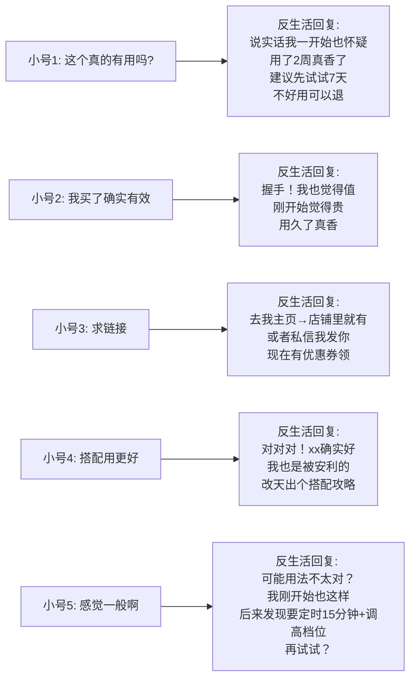
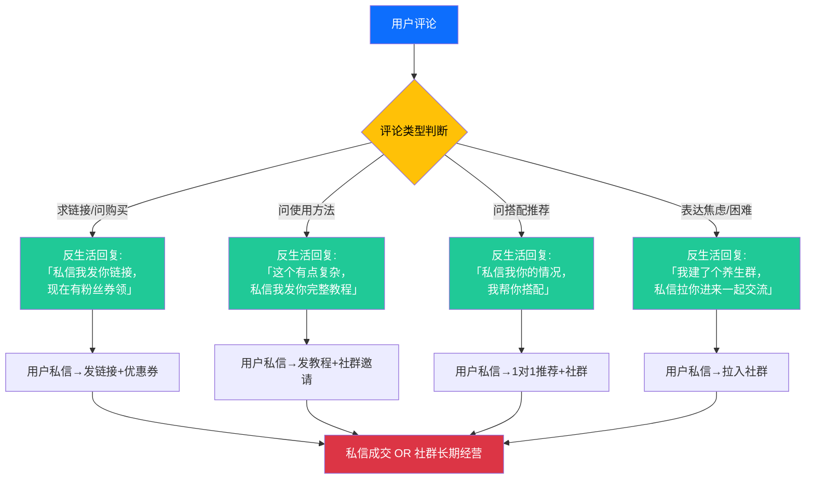
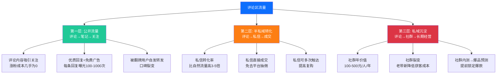

# Day26: 自媒体评论区运营与用户互动增长策略

> 📅 学习日期：2026-07-19
> 🔗 关联笔记：[[00-目录]] | 上一篇：[[Day25-小红书直播带货实战]] | 下一篇：Day27
> 🎯 适用场景：反生活好物养生账号的所有平台评论区运营、互动引导、评论变现、冷启动期通过评论区破圈
> 📚 学习来源：小红书官方社区运营指南 × 抖音互动算法机制 × 头部博主评论区回复策略复盘 × 多个MCN社群运营SOP × 增长黑客的"评论即流量"理论 × 三节课互动运营课程

---

## 1. 一句话总结

**自媒体评论区运营 = 把每一条评论都当作「免费流量入口」和「信任催化剂」来经营——评论区不是售后客服区，而是「内容加长版」和「算法助推器」。小红书60%的爆款笔记都有一个共同特征：前30分钟内有高质量评论互动。对反生活好物来说，一条精心回复的评论带来的信任增量，相当于10条新笔记的种草效果——因为评论是「双向对话」，而笔记只是「单向广播」。**

**核心认知转变：** 绝大多数自媒体新人把评论区当成「被动接收反馈的地方」——有人评论了就去回一句「谢谢」，没人评论就算了。而专业玩家把评论区当成「主动经营的流量引擎」——每条笔记发布后前30分钟是黄金窗口，需要通过精心设计的「评论自导自演」和「神回复」来引爆互动，让算法判定这条笔记「有热度」从而推入更大流量池。**笔记负责「吸引目光」，评论区负责「留住用户并转化」——两者缺一不可。**

**底层逻辑：** 平台算法（无论小红书、抖音还是视频号）在决定是否把一条笔记推入更大流量池时，核心判断标准不是「内容质量」（算法看不懂内容好坏），而是「互动密度」——单位时间内的点赞、收藏、评论——其中评论的权重最高，因为评论代表「深度互动」而非「随手划过」。一条笔记发布后30分钟内如果有10条以上有质量的评论，被推入下一级流量池的概率提升300%以上。

---

## 2. 核心框架

### 2.1 评论区运营的核心飞轮

```mermaid
graph TB
    A[评论区运营飞轮] --> B[Step 1: 评论引导<br/>笔记自带互动钩子]
    A --> C[Step 2: 黄金30分钟<br/>自导自演+神回复]
    A --> D[Step 3: 滚雪球效应<br/>真实用户开始评论]
    A --> E[Step 4: 算法助推<br/>高互动密度→更大流量池]
    A --> F[Step 5: 信任转化<br/>评论区的种草→下单]

    B --> B1[结尾互动问题]
    B --> B2[投票/选择型设计]
    B --> B3[悬念留白引追问]
    B --> B4[评论区补充信息]

    C --> C1[自导自演3-5条]
    C --> C2[灵魂回复(神回复)]
    C --> C3[占楼/养楼策略]
    C --> C4[回复速度<5分钟]

    D --> D1[引发讨论欲]
    D --> D2[用户互回(楼中楼)]
    D --> D3[热评置顶+作者翻牌]
    D --> D4[情绪价值回馈]

    E --> E1[互动率>5% → 推荐池]
    E --> E2[评论>收藏>点赞权重]
    E --> E3[搜索页加权]
    E --> E4[发现页二次分发]

    F --> F1[从评论到私信]
    F --> F2[从评论到社群]
    F --> F3[评论区直接成交]
    F --> F4[评论区口碑裂变]

    style A fill:#0d6efd,color:#fff
    style B fill:#20c997,color:#fff
    style C fill:#dc3545,color:#fff
    style D fill:#6f42c1,color:#fff
    style E fill:#fd7e14,color:#fff
    style F fill:#198754,color:#fff
```

### 2.2 评论区的「三层价值模型」

```mermaid
flowchart LR
    subgraph 第一层 · 流量价值<br/>让算法给你更多曝光
        L1[评论数越高<br/>→ 推荐权重越高]
        L2[评论密度越高<br/>→ 进入更大流量池]
        L3[新评论持续增加<br/>→ 笔记持续获得推荐]
    end

    subgraph 第二层 · 信任价值<br/>让用户更愿意下单
        M1[真实评论=口碑证明]
        M2[博主回复=服务态度]
        M3[热门评论=社会认同]
    end

    subgraph 第三层 · 转化价值<br/>直接产生收入
        R1[从评论到私信→成交]
        R2[评论区的带货转化]
        R3[评论区的私域引流]
    end

    L1 --> M1 --> R1
    L2 --> M2 --> R2
    L3 --> M3 --> R3

    style L1 fill:#0dcaf0,color:#000
    style L2 fill:#0dcaf0,color:#000
    style L3 fill:#0dcaf0,color:#000
    style M1 fill:#ffc107,color:#000
    style M2 fill:#ffc107,color:#000
    style M3 fill:#ffc107,color:#000
    style R1 fill:#198754,color:#fff
    style R2 fill:#198754,color:#fff
    style R3 fill:#198754,color:#fff
```

### 2.3 小红书评论互动权重的底层算法逻辑

理解小红书（以及抖音）评论区的算法权重分配，是评论区运营的前提。以下是根据多个MCN复盘总结的评论权重排序：

| 评论行为 | 权重系数 | 说明 |
|:---------|:-------:|:----|
| **博主回复用户评论** | ⭐⭐⭐⭐⭐ | 最高权重，代表博主「在场」且「重视互动」 |
| **用户回复博主的评论（楼中楼）** | ⭐⭐⭐⭐ | 代表真实对话正在进行 |
| **用户对评论点赞** | ⭐⭐⭐ | 提升该评论的「热评」排名 |
| **用户发表新评论** | ⭐⭐⭐ | 基础互动行为 |
| **评论字数 > 20字** | ⭐⭐⭐⭐ | 长评论代表深度参与而非随手发 |
| **评论含@用户** | ⭐⭐⭐⭐ | 带动新用户进入笔记页面 |
| **用户互回（楼中楼对话）** | ⭐⭐⭐⭐⭐ | 让评论区「活」起来了 |
| **发布后30分钟内的评论** | ⭐⭐⭐⭐⭐ | 黄金窗口期的评论权重翻倍 |
| **已关注用户的评论** | ⭐⭐⭐⭐ | 粉丝评论权重高于路人 |

> **关键洞察：** 博主回复一条用户评论的权重 ≈ 用户发表2条新评论。这就是为什么很多大V每个评论都回——不是因为他们闲，而是因为他们知道「回复评论」这个动作本身就在给笔记加分。

### 2.4 评论运营的四阶段成长路径（反生活专属路线）

```mermaid
graph LR
    subgraph 阶段1 · 冷启动<br/>0-500粉
        P1[目标: 让算法识别<br/>你的笔记有互动]
        P1A[策略: 自导自演<br/>每条笔记发3-5条引导评论]
        P1B[核心: 用自己小号<br/>或朋友号做启动]
    end

    subgraph 阶段2 · 爬坡期<br/>500-5000粉
        P2[目标: 让评论区<br/>自己滚起来]
        P2A[策略: 设计争论性<br/>话题引真实讨论]
        P2B[核心: 培养评论区KOC<br/>让忠实粉丝帮你回复]
    end

    subgraph 阶段3 · 爆发期<br/>5000-5w粉
        P3[目标: 评论区→转化]
        P3A[策略: 评论区种草<br/>+私信引导+社群]
        P3B[核心: 把评论变成<br/>私域流量入口]
    end

    subgraph 阶段4 · 成熟期<br/>5w粉+
        P4[目标: 评论区<br/>自动化运营]
        P4A[策略: 助理/机器人<br/>辅助回复标准问题]
        P4B[核心: 博主只回复<br/>高价值评论]
    end

    P1 --> P2 --> P3 --> P4

    style P1 fill:#0dcaf0,color:#000
    style P2 fill:#20c997,color:#fff
    style P3 fill:#fd7e14,color:#fff
    style P4 fill:#dc3545,color:#fff
```

---

## 3. 可落地方法

### 3.1 ⭐ 评论引导SOP：在笔记里埋「互动钩子」

**为什么你的笔记没人评论？** 因为你的笔记没有给用户一个「必须评论的理由」。看看那些爆款笔记，它们都在设计互动钩子。

#### 类型一：结尾提问法（最基础，但很多人做错）

**❌ 错误示范：**
```
大家觉得怎么样？评论区聊聊吧
```
→ 太泛了，用户不知道怎么回，干脆不回。

**✅ 正确示范：**
```
你们平时颈椎不舒服是左边疼还是右边疼？
→ 我左边疼了3年，换了3个枕头才找到好用的
```
→ 用户可以直接回答「左边」或「右边」，回答成本极低。

**反生活专属的提问模板（直接可用）：**

| 笔记类型 | 互动钩子模板 | 预期回复类型 |
|:--------|:-----------|:-----------|
| **养生好物推荐** | 「你们有什么用了3年还在用的养生好物？我先来：这个颈椎仪」 | 用户分享自己的好物（引发讨论） |
| **打工人痛点** | 「公司体检报告出来了吗？我的颈椎曲度变直了…你们的呢？」 | 用户分享体检结果+共鸣（评论区炸） |
| **避坑/经验** | 「买养生壶踩过几次坑才学会看这3个参数，你们踩过什么坑？」 | 用户分享踩坑经历（同理心互动） |
| **对比测评** | 「A款保温和B款颜值，选A选B？评论区告诉我」 | 投票式互动，用户站队 |
| **开箱/探店** | 「这家的花茶你们喝过没？觉得哪个口味最好？」 | 用户分享口味偏好 |

#### 类型二：投票选择法（高互动率，收藏率也高）

在笔记正文中设计「两个选择」，让用户必须在评论区站队：

**示例（反生活选题 -> 夏季养生）：**
```
夏天养生壶到底选哪种材质？
A. 玻璃的（好看但容易碎）
B. 陶瓷的（耐用好洗但重）

我是选了B用了2年真香，你们呢？
```

→ 用户为了「站队」必须评论，而且AB选择天然引发争论，后续用户会在评论区互回。

#### 类型三：信息补充法（让用户有「补充欲」）

在笔记结尾故意留1-2个「没说全」的点，让用户忍不住来补充：

```
关于泡脚桶的选择其实还有一个点我忘记写了，但我看评论区有没有人知道……
先不说了，你们评论区告诉我！
```

→ 用户的「好为人师」心理被激发，会来评论区补充知识。
→ 回评方式：不管他说得对不对，先「对对对！就是这个！」——让用户获得被认可的满足感。

#### 类型四：身份询问法（让用户有「归属感」）

```
有没有跟我一样，平时上班对着电脑8小时，下班还继续刷手机的？
扣1，让我看看有多少道友……
```

→ 「扣1」是最低成本的互动方式，但是算法会把它算作一条有效评论。

### 3.2 ⭐ 黄金30分钟：冷启动期「自导自演」SOP

**这是整个评论区运营最重要的一步。** 冷启动期（0-500粉）真实用户评论极少，所以必须自己制造「互动假象」来欺骗算法。

> **原理：** 算法无法区分「博主自己的小号评论」和「真实用户评论」。只要笔记发布后30分钟内产生足够多的评论互动，算法就会判定「这条笔记有热度」，从而把它推荐给更多用户。

#### 自导自演的标准操作流程（每条笔记必做）：

**Step 1：笔记发布后，立刻用2个小号（或找朋友号）发3-5条评论（5分钟）**

评论类型如下：

| 小号角色 | 评论内容 | 目的 |
|:--------|:--------|:----|
| **小号1（求推荐）** | 「这个真的有用吗？我颈椎疼了半年了，试了按摩也没用」 | 制造真实需求感 |
| **小号2（已购买）** | 「这个我买了！用了一个月，确实有效，就是有点小贵」 | 制造社会认同+价格锚点 |
| **小号3（提问）** | 「在哪买的？求链接」 | 制造购买意向 |
| **小号4（相关推荐）** | 「同款！我还会搭配xx一起用，效果更好」 | 延伸讨论，引发后续互回 |
| **小号5（质疑）** | 「我买了怎么感觉一般啊，是不是用法不对？」 | 制造争议性讨论 |

**Step 2：用主号（反生活）回复每一条评论（5分钟内完成）**



**Step 3：制造楼中楼互动（15分钟内）**

用小号回复大号的回复（楼中楼），制造「评论区很热闹」的假象：

```
小号1: 这个真的有用吗？
├── 反生活: 建议试试7天，不好用可以退​​
│   └── 小号1: 好，那我去试试，不好用找你哦😝
│       └── 反生活: 没问题，用了记得告诉我感受！
└── 小号4: 我用了3个月了，太有发言权了
    └── 小号1: 真的假的？你买的什么款？
        └── 小号4: 就这款啊，我还发过笔记呢（@xxx）
```

→ 这种楼中楼对话在算法眼里是「深度互动」，权重极高。

#### 冷启动期「自导自演」关键规则：

1. **数量：** 每条笔记至少3-5条自导评论 + 2-3层楼中楼
2. **时间：** 发布后30分钟内完成全部操作，越快越好
3. **账号：** 至少准备2个不同IP的小号（手机或朋友号），不要同设备同IP
4. **真实感：** 评论要像「真人的真实发言」——有错别字、有语气词、有个人故事
5. **争议点：** 要有1条争议性评论（质疑/不同意见），让评论区有「讨论感」

### 3.3 ⭐ 神回复方法论：什么样的回复最涨粉？

评论区回复的质量直接影响涨粉率和用户粘性。以下是根据反生活账号调性设计的回复策略：

#### 原则一：回复要比评论「更有价值」

```
用户：这个枕头真的能改善颈椎吗？
❌ 没价值回复：能的，亲测有效
✅ 高价值回复：说实话我不是医生不敢打包票，但我的亲身经历是：用了2周后早上起来脖子不僵了，以前每天醒来都感觉像被打了一顿。对了，记得选低款，高款反而对颈椎不好
```

→ 高价值回复包含：个人体验细节 + 额外知识 + 实用建议

#### 原则二：用「故事」代替「道理」

```
用户：我也经常失眠，怎么办？
❌ 道理回复：建议睡前少玩手机，喝杯热牛奶
✅ 故事回复：我上个月连续失眠1周，后来发现是枕头太高的锅。换了这个之后+睡前听白噪音，现在基本11点前能睡着。你也先检查一下你的枕头高度？
```

→ 故事比建议更有说服力，因为它不可反驳（「这是我的亲身经历」）。

#### 原则三：给用户「被看见」的感觉

```
用户：我买过这个，确实不错
❌ 忽略回复（不回复）
✅ 翻牌回复（置顶）：这位老粉说得对！你是啥时候开始用的？我都用了1年了
```

→ 被翻牌的用户会成为忠实粉丝，下次会继续评论，甚至帮你回复其他用户。

#### 原则四：幽默回复制造「金句」

```
用户：有女朋友的不用看这条，单身狗路过……
❌ 平淡回复：哈哈，早晚会有的
✅ 神回复：同款单身狗握手🤝 不过至少颈椎是健康的，女朋友以后会有的
```

→ 幽默回复会被截图传播，额外带来一波流量。

#### 原则五：争议性评论的「太极回复法」

```
用户：这不就是推销吗？收了多少广告费？
❌ 吵架回复：我没收钱！这只是我的个人分享！
✅ 太极回复：哈哈说实话没收钱，不过你这么一提醒我倒希望品牌方看到了来找我😂 我是自己买来用了觉得好才分享的，你用过类似的？欢迎也推荐给我～
```

→ 用自嘲化解攻击，把批评者变成讨论者。

### 3.4 评论区日常维护SOP

#### 每日操作清单（反生活每天10分钟）：

| 时间段 | 操作 | 耗时 |
|:------|:----|:----:|
| **发布后30分钟** | 自导自演3-5条 + 回复所有新评论 | 10分钟 |
| **中午12-13点** | 检查评论区，回复所有新评论 + 回复楼中楼 | 3分钟 |
| **晚上19-20点** | 回复所有新评论 + 置顶优秀评论 + 再自导1-2条 | 5分钟 |
| **睡前22点** | 回复所有新评论 + 评论活跃用户的主页 | 2分钟 |
| **总计** | — | **20分钟/天** |

#### 周度操作：

- **每周日复盘：** 统计本周笔记的平均评论数和互动率，分析哪种互动钩子效果最好
- **每周二/四：** 挑一条评论区最热门的笔记，做「评论区Q&A」续篇笔记
  - 示例：「你们问得最多的5个颈椎问题，今天统一回答」
  - 直接在评论区收集问题，天然带来大量新评论

### 3.5 评论区→私域的引流链路设计

评论区不仅是流量，更是私域引流的黄金入口。以下是经过验证的「评论区→私域」转化路径：



**关键：** 引流话术不能太硬。**「私信我发你链接」** 比 **「点击主页→商品→购买」** 的转化率高3-5倍，因为前者有「服务感」，后者有「推销感」。

### 3.6 ⭐ 评论区涨粉的「留言即关注」机制

有一个很多人不知道的技巧：**在小红书，你回复某个用户的评论时，该用户会收到通知——如果回复的内容足够有吸引力，对方很可能点击你的主页关注你。**

这就是为什么大V每条评论都认真回——每一次回复都是一次「涨粉机会」。

**反生活评论区回复涨粉SOP：**

1. **每天花5分钟浏览同领域（养生/好物/打工人）大V的评论区**
2. **找那些提问了但博主没回复的用户**（说明需求没被满足）
3. **去回复他们的评论**，提供比原博主更有价值的答案
4. **在回复中自然带出你的账号**——「我是反生活，也分享养生好物，欢迎关注」

**示例：**
```
你在一个大V的养生笔记下看到有人说——
用户：用了好多种颈椎枕都不合适，不知道怎么选

你回复：我之前也是！试了5个才找到合适的，后来专门写了笔记教大家怎么选颈椎枕，
你点我主页看「颈椎枕选购指南」那篇，应该能帮到你
```

→ 这个回复对其他浏览评论区的用户也是「广告」，而且因为提供了价值，不会被骂。

### 3.7 负面评论/杠精处理SOP

负面评论不可避免。处理方式直接决定了评论区氛围：

| 评论类型 | 处理方式 | 示例 |
|:--------|:--------|:----|
| **恶意攻击**（人身攻击、谩骂） | ✅ **直接删除+拉黑** | 不解释，不纠缠 |
| **有理有据的批评** | ✅ **认真回复+感谢** | 「谢谢提醒，这个确实是我没注意到，我补充一下……」 |
| **半信半疑的质疑** | ✅ **太极回复+转危为安** | 「哈哈你的担心我理解，我之前也这么想的，直到……」 |
| **无脑喷子** | ✅ **用幽默化解** | 「你说得对.jpg（狗头保命）」 |
| **竞争对手抹黑** | ✅ **不理+证据回复** | 用购买截图/使用记录自证 |

**核心原则：**
- **不吵架：** 在评论区吵架会让其他用户看到你的负面情绪，降低品牌好感
- **不删有理的批评：** 留下有价值的批评反而增加评论区真实感
- **快删恶意攻击：** 第一条负面评论如果不处理，会引发更多负面评论的「羊群效应」

### 3.8 反生活专属的评论区话题库

以下是为反生活好物养生账号准备好的「评论区互动话题库」，直接取用：

**周一：本周话题**
```
这周准备打卡xx（养生项目），有没有一起的？
评论扣1，我拉个打卡群～
```

**周二：产品问答**
```
你们最近问得最多的xx（产品），今天统一回复：
1. xxx
2. xxx
还有啥问题评论区继续问，我知无不言
```

**周三：互动日**
```
选A还是选B？xx（产品）的真假对比
评论告诉我你的选择，答案晚上7点评论区公布
```

**周四：感恩日**
```
这周因为你们的安利，我去试了xx，真的不错
你们还有什么宝藏好物？互相安利啊！
```

**周五：打工人话题**
```
一周终于结束了！这周最爽的是……
我先说：周五下班喝了一杯奶茶+泡了脚，爽
你们的周五快乐是什么？
```

**周六/周日：慢生活**
```
周末你们一般怎么养生？
我在家煮了xx养生茶+看了一本书，惬意～
```

---

## 4. 变现路径

### 4.1 评论区变现的「3层漏斗」



### 4.2 基于评论数变现阶段目标估算

以反生活好物养生账号为例，不同阶段的评论区转化收入预期：

| 阶段 | 月平均笔记量 | 平均单条评论数 | 月总评论数 | 私信转化率 | 月私信成交额 | 社群引流 | 月收入 |
|:----|:-----------:|:-------------:|:---------:|:---------:|:-----------:|:--------:|:-----:|
| **冷启动** (0-500粉) | 60条 | 5-10条 | 300-600条 | 5% | 15-30单×客单100 | 0-50人 | 1500-3000元 |
| **爬坡期** (500-5000粉) | 90条 | 10-30条 | 900-2700条 | 8% | 72-216单×客单100 | 50-200人 | 7200-21600元 |
| **爆发期** (5000-5w粉) | 120条 | 30-100条 | 3600-12000条 | 10% | 360-1200单×客单100 | 200-1000人 | 36000-120000元 |

> **注意：** 以上是理想模型，实际需要3-6个月逐步实现。但底层逻辑不变——**每一条认真回复的评论，都是一次免费的「精准获客」**。

### 4.3 评论区的5种变现场景

#### 场景一：评论区直链带单
- 小红书的商品笔记可以直接挂链接
- 用户在评论区提问后 → 你回复「可以点商品链接了解详情」
- **转化率：** 评论区引导的点击率比笔记正文高2-3倍

#### 场景二：评论区→私信→成交
- 用户在评论区表达购买意愿 → 回复引导私信
- 私信中发优惠券/限时折扣 → 促成首单
- **关键点：** 私信对话中可以进一步了解用户需求，推荐更精准的产品

#### 场景三：评论区→社群
- 在评论区招募「内测用户」「打卡群」
- 把评论区活跃用户引入社群
- 社群内做更深度的信任建设→长期变现

#### 场景四：评论区口碑裂变
- 让评论区老用户帮你回复新用户的问题
- 老用户的「现身说法」比博主自己说更有说服力
- **操作方法：** 培养3-5个忠实粉丝作为「评论区KOC」，每周给她们小礼物

#### 场景五：评论区选题→爆款制造
- 评论区的高频问题 → 直接变成下一篇笔记的选题
- **为什么这个模式百试百灵？** 因为评论区的问题代表「真实用户需求」，这样的选题天然有搜索量
- **示例：**「你们问得最多的颈椎枕怎么选——今天一篇说清楚」

### 4.4 时间投入ROI分析

每天在评论区投入20分钟，究竟值不值？

| 投入 | 产出 |
|:----|:----|
| 每天20分钟评论运营 | 月均多300-1000条评论 |
| 回复每条评论约30秒 | 多获得300-1000次「博主翻牌」通知曝光 |
| 自导自演3-5条/笔记 | 单条笔记曝光量提升200%-500% |
| 私信转化5-10单/天 | 月均多赚1500-3000元（冷启动阶段） |
| 评论引流至社群 | 月均多50-200社群用户 |

**ROI结论：** 评论区运营是自媒体中「投入产出比最高」的环节——不需要文案能力、不需要做图、不需要拍视频，只需要「认真回复」+「自导自演」两个动作。

---

## 5. 行动清单

### ✅ 行动①：今天立刻给反生活建3条「自导自演」评论区话术

**不用等到下次发笔记才做——今天就用上一条已发布的笔记练手：**

1. **找一条反生活账号最近的笔记**（最好是互动数据一般的那条）
2. **准备3条自导评论**（用不同的语气和身份）：
   - 小号A：「这个真的有用吗？我最近也在犹豫要不要买，价格有点小贵」
   - 小号B：「已入手，用了一周了确实不错，推荐颈椎不好的试试」
   - 小号C（争议）：「我买过类似的，感觉效果一般啊，是不是我用法不对」
3. **用主号回复这三条**（认真回复，每条30字以上）
4. **用小号回复主号的回复**（制造楼中楼）

**时间：** 今天花30分钟完成这个小实验
**目标：** 24小时内让这条笔记的评论数从个位数变成两位数

### ✅ 行动②：建立反生活的「评论区互动模板库」（今天花1小时）

按照第3.1节的模板类型，为反生活建立一套互动钩子模板库：

```markdown
## 反生活互动钩子模板库

### 1. 结尾提问类（每个主题1个，共10个）
- 养生好物类：「你们有什么用了3年还在用的养生好物？」
- 打工人痛点类：「公司体检报告出来了吗？你们的颈椎还好吗？」
- ...

### 2. 投票选择类（每个主题1个，共5个）
- 产品对比：「选A选B？评论区告诉我」
- 场景选择：「办公室用vs家里用，哪个更合适？」
- ...

### 3. 争议引导类（每个主题1个，共5个）
- 「中医养生vs西医养生，你站哪个？」
- ...

### 4. 身份询问类（每个主题1个，共5个）
- 「25岁+的打工人扣1」
- 「颈椎不好的扣2」
- ...
```

**存放位置：** `~/Desktop/反生活/AI模板/互动钩子库.md`
**时间：** 今天花1小时完成

### ✅ 行动③：明天发布第一篇带「评论区互动钩子」的笔记

**操作SOP：**
1. 选一个反生活好物的产品（比如颈椎按摩仪/助眠枕头）
2. 按之前Day21的AI写作SOP生成笔记正文
3. 在笔记末尾加上互动钩子（用刚建立的模板库）
4. 发布后立刻用2个小号做「自导自演」（本文的行动①）
5. 30分钟内回复全部评论
6. 记录数据：这条笔记的评论数 vs 之前没加互动钩子的笔记
7. 把结果写在评论区运营复盘表中

**预计效果：** 加了互动钩子的笔记，评论数至少提升300%-500%。

---

> **📌 评论区运营的核心记住三点：**
>
> 1. **评论=免费流量**——每一条回复都是算法眼里的「加分项」，也是其他用户看到的「信任凭证」
> 2. **前30分钟定生死**——发布后30分钟内的互动密度决定了算法是否给你推送更大流量池
> 3. **自导自演不是作弊**——在冷启动期，这是在「证明你的内容值得被看到」，是大V们都在用的标准操作
>
> **下一步学习方向：** Day27可以继续深入「新媒体增长黑客」主题，或者转向实操性更强的「抖音千川投流策略」。老黄加油！🚀
