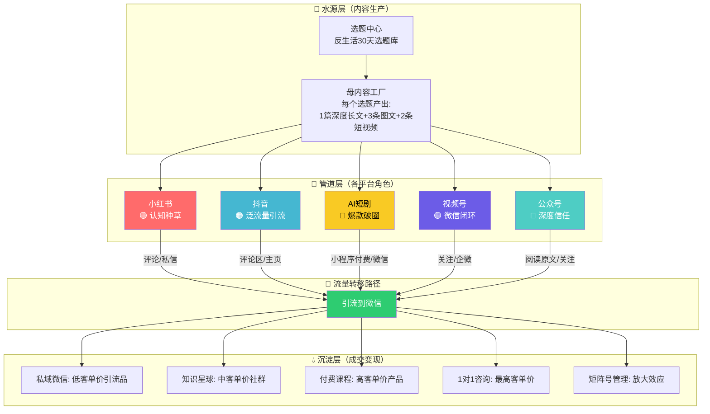
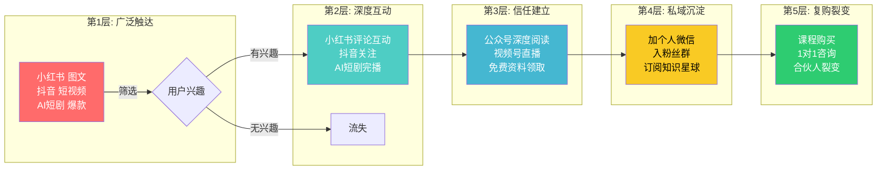
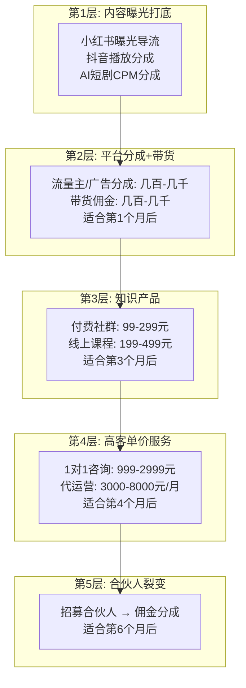

# 📕 Day27: 多平台变现矩阵

> **核心：多平台变现矩阵不是「到处撒网」，而是「自来水系统」——在每个平台上做的所有事，最终都流向一个蓄水池（私域/付费产品）。前面26天学完了小红书、公众号、抖音、AI短剧的单平台玩法，今天把所有这些串起来：怎么让每个平台各司其职、互相导流、1+1+1+1>100。反生活不是「只做一个平台」的创作者，而是「用矩阵思维管理多平台资产」的内容创业者。**
> 来源：头部多平台创作者案例拆解 + 新榜/卡思数据行业报告 + 微信/抖音/小红书官方政策白皮书 + AI短剧头部账号运营复盘

---

## 一、一句话总结

**多平台变现矩阵 = 每个平台承担不同角色（1个主变现平台 + 2个导流平台 + N个复用地盘），用「内容管道」把流量从一个平台螺旋式推向下一个平台，最终在私域/高客单价产品中完成成交。** 反生活不需要在每个平台都做到万粉，而是需要让4个平台组成变现闭环——小红书做认知种草→公众号做深度信任→抖音做泛流量引流→私域做高毛利成交。

> 💡 **老黄的变现模型**：一个读者/粉丝在任何一个平台看到你，最终都会被你引到同一个「成交漏斗」里。平台只是不同的「捕鱼工具」，池塘（你的流量池）只有一桶水。

本章和[[Day1-小红书变现全攻略]]（变现起点）、[[Day2-公众号运营与变现]]（信任中间站）、[[Day3-抖音短视频运营]]（流量放大器）、[[Day23-多平台内容复用]]（内容效率）、[[Day22-视频号生态]]（微信闭环）、[[Day26-AI短剧分发与变现]]（变现终点）、[[Day14-私域引流转化]]（成交闭环）、[[Day15-小红书矩阵号运营]]（矩阵思维）紧密关联。

---

## 二、核心框架

### 2.1 多平台变现矩阵全景：「自来水管道系统」



### 2.2 五平台「变现定位坐标」

每个平台在反生活的变现矩阵中扮演不同角色，不能混为一谈。

| 平台 | 角色 | 核心指标 | 投入精力 | 变现贡献预估 |
|:----:|:----:|---------|:--------:|:----------:|
| **小红书** | 🧲 认知种草 | 曝光量/互动率 | 30% | 20% → 导流私域 |
| **公众号** | 🏠 深度信任 | 完读率/关注率 | 20% | 25% → 流量主+广告+卖课 |
| **抖音** | 🚀 泛流量引流 | 播放量/涨粉 | 20% | 15% → 导流+带货佣金 |
| **AI短剧** | 💥 爆款破圈 | 播放量/付费率 | 20% | 30% → 小程序付费+广告分成 |
| **视频号** | 🔗 微信闭环 | 转发率/私域转化 | 10% | 10% → 广告分成+导流私域 |

> **关键认知**：分配精力不是按「当前收入」决定的，而是按「这个平台在未来矩阵中扮演的角色」决定的。小红书目前可能是反生活收入最低的，但它承担着「让新用户认识反生活」的任务——不在小红书种草，后续所有平台都没人看。

### 2.3 变现矩阵的「漏斗递进模型」



**转化漏斗预期数据（反生活参考）**：

```
100,000 曝光（小红书+抖音+AI短剧）
  → 5,000 互动（点赞/评论/关注） → 5%
  → 500 公众号关注/免费资料下载 → 0.5%
  → 100 加私域微信 → 0.1%
  → 20 付费用户（客单价200元） → 0.02%
  → 4,000元收入
```

按这个漏斗，反生活只要每月做到100万总曝光，就能稳定月入4000元左右。**核心杠杆不是提升转化率，而是放大曝光量**——每多1万曝光 ≈ 40元收入增量。

---

## 三、可落地的方法

### 3.1 五个平台「串起来流量的」具体操作

#### 小红书→公众号 导流链路

```
小红书笔记 → 文末引导「完整版在公众号」
文案示例：
  "篇幅有限，完整的[主题]避坑清单已经整理好了
  去公众号「反生活」回复「xxx」免费领取👆"
```

**关键点**：
- 小红书评论区不放微信号（会被限流），而是引导到公众号
- 公众号设置自动回复，用户回复关键词自动弹出资料
- 这个动作完成「泛粉→真粉」的转化——愿意去公众号回复关键词的人，是高质量用户

#### 抖音→私域 导流链路

```
抖音短视频 → 评论区置顶「领资料加微信xxx」
或者：抖音主页 → 简介写「加微信领完整版」
```

**关键点**：
- 抖音对微信的限流比小红书松很多，可以直接写微信号
- 但不要每一条视频都引流——每5-10条引流1次
- 引流视频的内容要「信息密度高但有悬念」，让人想继续看完整版

#### AI短剧→收费 导流链路

```
AI短剧第一集 → 免费观看
AI短剧第二集 → 引导关注/点赞
AI短剧第三集 → 「完整版在微信小程序/xiaohongshu」
```

**关键点**：
- AI短剧天然适合做「前几集免费+后面付费」的模式
- 短剧的评论区是黄金导流位——每条短剧评论区置顶小程序链接
- 短剧爆了之后，把观众导流到公众号→再看深度内容→最后到私域成交

#### 视频号→公众号 导流链路

```
视频号口播 → 引导关注公众号
文案示例：「我是反生活，更多干货在公众号搜我名字」
公众号文章插入视频号卡片 → 用户看完文章直接刷视频
```

**关键点**：
- 视频号和公众号是微信生态内互导效率最高的组合
- 公众号文章插入视频号卡片后，用户在公众号也能刷到视频内容

### 3.2 变现矩阵「三明治策略」

```
┌─────────────────────────────────────────┐
│         🥪 三明治变现策略               │
├─────────────────────────────────────────┤
│  上层（引流品）：免费教程/避坑指南PDF   │
│  小红书/抖音/公众号0元领取              │
│  → 获取用户微信                         │
├─────────────────────────────────────────┤
│  中层（利润品）：付费社群/课程          │
│  99-199元/人                             │
│  → 主要利润来源                         │
├─────────────────────────────────────────┤
│  下层（高客单价）：1对1咨询/陪跑        │
│  999-2999元/单                           │
│  → 高利润，但量小                       │
└─────────────────────────────────────────┘
```

**三明治策略的核心**：用免费内容（小红书/抖音/公众号/AI短剧四条腿）获取大量流量 → 用低价引流品筛选出「愿意花钱」的用户 → 用中高价产品实现核心利润。

### 3.3 「一鱼四吃」内容生产模型

每个选题产出4种形态，分别发到4个平台：

| 形态 | 平台 | 内容特点 | 生产时间 |
|:----:|:----:|---------|:--------:|
| 3000字深度长文 | 公众号 | 完整的干货、数据、案例 | 2小时 |
| 3-5条图文笔记 | 小红书 | 精华摘取、干货碎点 | 30分钟 |
| 2条60秒短视频 | 抖音 | 最吸引人的金句/反差 | 30分钟 |
| 1条AI短剧脚本 | AI短剧 | 讲故事的形式呈现 | 40分钟 |
| **总计** | | | **3.5小时** |

> **效率公式**：1个选题 × 4个形态 × 3个平台（微信系可复用） ≈ 3.5小时产出 → 覆盖5个平台，效率比单平台高300%

### 3.4 反生活专项适配建议

反生活目前的情况分析：
- **已有**：小红书账号（避坑指南类内容）、公众号（深度长文）、闲鱼矩阵
- **待拓展**：抖音短视频、AI短剧、视频号、私域成交体系

**建议的冷启动顺序**：

```
第1个月：抖音起号（复用小红书素材拍口播版本）
第2个月：AI短剧试水（用Day24-26的流程出5集短剧）
第3个月：视频号联动（抖音内容投到视频号，打通微信闭环）
第4个月：私域成交收网（设计引流品+利润品体系）
```

---

## 四、变现路径

### 4.1 五层变现模型（从低到高）



### 4.2 月入各阶段的矩阵配比

| 阶段 | 月收入 | 小红书面公众号 | 抖音 | AI短剧 | 私域/产品 | 核心策略 |
|:----:|:-----:|:------------:|:----:|:------:|:---------:|---------|
| **起步期** | 0-3000元 | 60% | 20% | 10% | 10% | 堆内容，积累矩阵基础 |
| **成长期** | 3000-1万 | 30% | 20% | 30% | 20% | AI短剧做爆款破圈，私域开始出单 |
| **稳定期** | 1万-3万 | 20% | 15% | 25% | 40% | 产品体系成熟，私域是主力 |
| **爆发期** | 3万-10万+ | 10% | 20% | 30% | 40% | 矩阵放大+合伙人裂变 |

**反生活目标**：6个月内从起步期进入成长期，月稳定收入5000-10000元。

### 4.3 具体收入拆解

```
【保守方案 — 月入5000元】

1️⃣ 公众号流量主 + 广告接单     → 1000元/月
   5000阅读量×30天×0.2元CPM ≈ 30元/天 × 30天 = 900元
   接1条公众号广告 = 500元（每月接1次）
   
2️⃣ 小红书蒲公英接单             → 500元/月
   5000粉账号，月接2条，250元/条

3️⃣ 抖音播放分成 + 带货         → 800元/月
   日均1万播放，CPM 2元，日收20元
   偶尔挂车出单，月收200元

4️⃣ AI短剧小程序付费             → 1500元/月
   1条爆款短剧带来500人付费，3元/人
   或多个短剧每天稳定100元

5️⃣ 私域社群/卖课               → 1200元/月
   社群199元/人，月入5人 = 995元
   课程49-99元，月卖10份 = 500元

━━━━━━━━━━━━━━━━━━━━━━━
      合计：约5000元/月
```

```
【进取方案 — 月入2万】

1️⃣ AI短剧爆发（抖音小程序）     → 8000元/月
   2条爆款短剧，每条吸引2000人付费，3元/人
   或1条超级爆款，抖音推流500万播放，付费率2%

2️⃣ 私域社群+课程               → 6000元/月
   社群199元/人，月入15人 = 2985元
   课程399元/人，月卖8份 = 3192元

3️⃣ 公众号+小红书品牌合作       → 3000元/月
   小红书5000粉接4条广告 = 2000元
   公众号1万粉接2条广告 = 1000元

4️⃣ 1对1咨询+代运营             → 3000元/月
   咨询999元/次，月接2次 = 1998元
   代运营3000元/月，月接1家

━━━━━━━━━━━━━━━━━━━━━━━
      合计：约2万元/月
```

---

## 五、行动清单

### 🎯 本周能做的3件事

**第1件事：绘制自己的「变现矩阵地图」**

打开一个空文档，画三列：

| 平台 | 当前做什么 | 在矩阵中扮演什么角色 |
|:----:|:---------:|:-----------------:|
| 小红书 | 避坑指南图文 | 认知种草，导流私域 |
| 公众号 | 深度文章 | 信任建立，卖课 |
| 抖音 | [待定] | 泛流量引流 |
| AI短剧 | [待定] | 爆款破圈 |
| 视频号 | [待定] | 微信闭环导流 |

**然后把每个平台的动作写清楚：一周发几条？什么内容？引导到哪里？**

> ⏱ 预计30分钟

---

**第2件事：设计「从第一个平台到私域」的完整转化路径**

从反生活目前在做的小红书开始，画一个完整路径图：

```
用户看到一篇「买房避坑指南」小红书笔记
  → 点赞收藏
  → 评论区留言「求完整版」
  → 自动回复引导到公众号回复关键词
  → 公众号弹出PDF下载 + 微信号二维码
  → 用户加微信
  → 微信发PDF + 推荐付费社群
```

**检查当前路径上是否有断点**：
- 小红书笔记有没有引导到公众号？✅/❌
- 公众号有没有设置自动回复关键词？✅/❌
- 添加微信后有没有自动发送欢迎语+引流品？✅/❌

> ⏱ 预计20分钟

---

**第3件事：选定「第一个跨平台复用的选题」并执行**

从反生活已有的内容中选一个最佳复用选题，用「一鱼四吃」模式改造：

**推荐选题**：「买房看户型图的5个秘密」
- **小红书** → 3条图文：「户型图的3种假象」「朝南≠好户型」「这5个字出现在户型图说明有问题」
- **公众号** → 原文全面改写成3000字深度版
- **抖音** → 真人出镜60秒：「千万别相信户型图！这3个暗语开发商不会告诉你」
- **AI短剧** → 做一个「户型图背后的秘密」微短剧（1分钟，角色扮演形式）

> ⏱ 预计3.5小时（但这是未来一个月所有平台的素材来源）

---

### 📌 本周复盘问题

1. ✅ 我已经知道5个平台各自的价值，不需要每个都做到极致
2. ✅ 我明确了反生活在矩阵中的「主变现平台」是什么
3. ✅ 我设计了至少1条从平台流量到私域成交的转化路径
4. ✅ 我选好了本周复用选题并开始执行
5. 🔄 我计划了下一周的跨平台发布日历

---

## 关于「反生活」的特别说明

反生活的情况和大多数泛知识类账号不太一样：

1. **已有多平台内容资产**：小红书几十篇+公众号几十篇，是不需要重新发明的宝库
2. **内容是「避坑指南」类型**：天然适合所有平台——小红书图文、公众号深度、抖音口播、AI短剧
3. **变现模式已经被验证**：知识付费（社群/课程）是反生活最适合的方向
4. **最大的短板是「没有抖音」**：抖音是反生活内容最容易被算法推荐的平台，当前最大的增长点
5. **AI短剧是「降维打击」**：反生活的避坑内容做AI短剧，比纯虚构的AI短剧更有说服力

> **老黄的最后建议**：不要试图同时运营5个平台。选「小红书（现有）+ 抖音（新增）」作为这两个月的双核心，公众号保持更新但不追量，AI短剧每周试1-2条看反馈，视频号等到公众号+抖音跑通后再接入。**3个月后，你的矩阵就能自动运转了。**

---

> **下一章预告**：[[Day28-30天总复盘]] → 学完30天，我们回头看——反生活到底应该走哪条路？下一步的3个月作战计划是什么？
