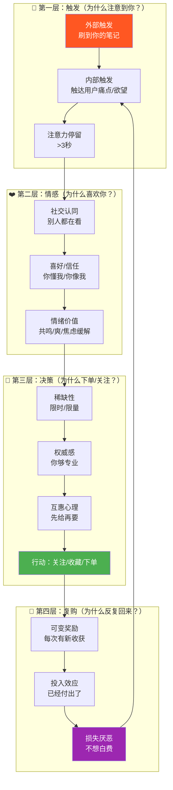
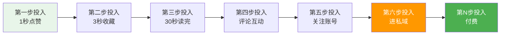
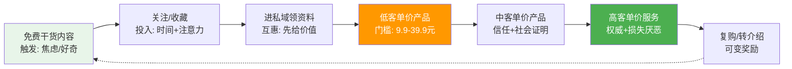

# 📕 Day28: 用户心理与行为设计

> **核心：用户心理与行为设计不是「操纵用户」，而是「顺应人性做内容」——当你理解了用户为什么会点赞、关注、收藏、下单、转发，你就不再靠运气做内容，而是靠「行为设计」系统化地提高每一个环节的转化率。反生活的每条内容、每个钩子、每句文案，都应该建立在「用户心理触发机制」之上。**
> 来源：《Hook模型》Nir Eyal、《疯传》Jonah Berger、《影响力》Robert Cialdini、《上瘾》模型、福格行为模型(B=MAT)、行为设计学(BJ Fogg)、消费者心理学经典理论

---

## 一、一句话总结

**自媒体赚钱 = 用内容触发用户心理开关 → 驱动用户完成特定行为（关注/点赞/购买/分享）。** 用户不是理性决策者，而是「心理捷径」的奴隶。掌握了**福格行为模型（B=MAT）** + **影响力6原则** + **上瘾Hook模型**，你就掌握了让用户「自动完成」你设计的每一个动作的底层密码。

> 💡 **老黄的关键认知**：内容做不好，99%不是文案的问题，而是「你没有设计用户行为」。发一条笔记前，先问自己：我想让用户做什么？我设计什么触发了他做这件事？——如果没想清楚，用户只会划走。

本章和[[Day19-个人IP打造]]（信任建立）、[[Day14-私域引流转化]]（转化设计）、[[Day5-知识付费变现模型]]（定价心理）、[[Day23-多平台内容复用]]（内容心理学）、[[Day13-小红书爆款复制方法论]]（传播心理）紧密关联。

---

## 二、核心框架

### 2.1 行为设计金字塔：从看到到付费的完整心理链路



### 2.2 福格行为模型：行为的3个必要条件

```
B = M · A · T
行为 = 动机 · 能力 · 触发

M (动机)：用户想不想做？
  - 趋利（省钱/赚钱/省时间）
  - 避害（避坑/防骗/防亏）
  - 社交归属（融入圈子/获得认可）

A (能力)：用户能不能轻松做到？
  - 时间成本（3秒内能否完成？）
  - 金钱成本（免费 vs 付费门槛）
  - 认知成本（一看就懂 vs 需要思考）
  - 操作成本（点击 vs 填写表单）

T (触发)：用户现在做不做？
  - 外部触发：推送/通知/标题党
  - 内部触发：焦虑/无聊/好奇
```

**💡 反生活实战公式**：
```
用户付费 = 高动机（想赚钱/想避坑） × 低能力门槛（9.9元/扫码即看） × 强触发（限时/限量/正好刷到）
缺任何一个 = 转化失败
```

### 2.3 影响力6原则：自媒体场景化对照

| 原则 | 含义 | 小红书/公众号/抖音实战应用 |
|------|------|--------------------------|
| **互惠** | 先给价值，再要回报 | 免费资料包/工具包→关注→后续变现 |
| **承诺一致** | 小承诺→大行动 | 点赞→收藏→关注→购买，逐步升级 |
| **社会认同** | 别人都这么做 | 销量截图/好评/XX人在看/爆款标签 |
| **喜好** | 喜欢像自己的人 | 反生活「普通人逆袭」人设、真实经历 |
| **权威** | 专家说了算 | 行业数据背书/专业认证/大V站台 |
| **稀缺** | 怕错过(FOMO) | 仅限前50名/今晚12点截止/名额告急 |

---

## 三、可落地方法

### 3.1 行为设计5步法（反生活的每条内容都能直接用）

#### 第1步：定义目标行为
不要模糊地说「提高转化率」，要具体到：
- ✅ **本周目标**：这篇笔记发出后，让100个人点击评论区链接
- ✅ **本日目标**：今天的公众号文章，让20个人加微信
- ✅ **本条内容**：这条视频，让50人关注

#### 第2步：降低能力门槛（最容易优化）
用户不行动，99%是因为「太麻烦」：

```
❌ 高门槛（不会做）：
  "扫码进群，回复关键词获取资料包，然后添加客服微信"
  
✅ 低门槛（3秒完成）：
  "评论区扣1，我私信发你链接"
  "点个关注，今晚8点准时开播"
  "长按点赞，收藏这条笔记"
```

**反生活操盘**：
- 资料包领取：不要「加微信回复XX」，改成「置顶评论区点链接自取」
- 社群引流：不要「扫码+验证消息」，改成「点击即加入」
- 付费转化：不要「填写表单+等待审核」，改成「扫码直接付款」

#### 第3步：设计触发时机
触发必须在「动机最高 + 能力最低」的时刻出现：

| 场景 | 用户心理状态 | 最佳触发动作 |
|------|------------|------------|
| 刚刷到优质内容 | 好奇/有获得感 | 现在关注，持续看更多 |
| 读完干货帖 | 感谢/觉得有用 | 收藏/点赞（互惠触发） |
| 评论区看完讨论 | 认同/想参与 | 评论区互动（社会认同） |
| 看到别人案例 | 羡慕/我也要 | 私信咨询/下单（从众心理） |
| 限时优惠倒计时 | 焦虑/怕错过 | 立即下单（稀缺触发） |

#### 第4步：制造可变奖励（让用户上瘾的关键）
固定奖励→用户习惯后不再关注。
**可变奖励→用户反复来刷**（像刷抖音停不下来）。

```
❌ 固定模式（用户失去兴趣）：
  每次发文都是同一种干货

✅ 可变模式（用户每次都好奇）：
  这周发「月入3万的3个方法」
  下周发「我踩过的5个坑」
  再下周发「行业内部数据报告」
  → 用户不知道下次会看到什么，但知道「肯定有用」
```

**反生活可变奖励设计**：
- 账号内容：反生活笔记 × 辟谣知识 × 赚钱案例 × 工具评测（混合发布）
- 福利发放：随机抽送资料包/不固定的限时福利
- 人设内容：偶尔发生活日常+思考（增加不确定性，增强连接感）

#### 第5步：利用投入效应（让用户舍不得走）
用户为某事投入越多，越不愿意放弃：



**每条内容都要设计「投入阶梯」**：
1. 🟢 第一级：0成本投入——标题吸引点击
2. 🟢 第二级：1秒投入——看第一屏觉得有用
3. 🟡 第三级：3秒投入——点赞/收藏
4. 🟡 第四级：30秒投入——读完全文
5. 🟠 第五级：1分钟投入——留言互动
6. 🔴 第六级：3分钟投入——关注/加微信
7. 💰 终极：付费下单

### 3.2 5种高转化内容心理公式

#### 公式1：**互惠钩子法**
```
# 标题：送你一份【XX资料包】（互惠承诺）
# 正文：先给大量干货（兑现互惠）
# 结尾：关注我，持续更新（互惠心理驱动关注）
# 评论：扣1领取更多（二次互惠→引流）
```

**反生活案例**：
> 「整理了30个赚钱辟谣×反常识案例，评论区扣**工具包**，我私信发你完整版」
> → 用户收到资料后，会下意识觉得「欠你人情」→ 后续更容易成交

#### 公式2：**社会证明法**
```
# 标题：XX人都在用这个方法...
# 正文：截图展示其他人如何成功的
# 关键点：用数字说话（不是「很多人」，而是「5000人已验证」）
```

**反生活案例**：
> 「上周有300+人领了这份《小红书变现清单》，其中23人已经开始出单了」
> → 「别人都拿到了，我也不能错过」+「别人做到了，我也可以」

#### 公式3：**损失恐惧法**
```
# 标题：这3个坑，90%的人都在踩
# 正文：描述踩坑的后果（损失）
# 结尾：关注我，下期教你避坑
```

**反生活案例**：
> 「做小红书第1个月，我犯了这5个错，浪费了3000块投流费」
> → 用户不想浪费钱→自动关注

#### 公式4：**稀缺紧迫法**
```
# 核心：不是随时都有，现在不行动就没了
# 话术结构：仅限XX名/今晚截止/名额告急
# 关键：稀缺要和用户利益挂钩（不是「限量版」而是「仅限前50名送资料」）
```

#### 公式5：**权威背书法**
```
# 没有权威就创造「过程权威」
# 公式：我做了XX（数据/案例/测试），得出这个结论
# 替代方案：引用行业数据/大V观点/书籍观点
```

### 3.3 内容心理学：每篇笔记的「用户心理检查清单」

发内容前，逐项核对：

```mermaid
graph TD
    Q1[标题有没有触发<br/>好奇心/痛点/欲望？] -->|是| Q2
    Q1 -->|否| 改标题
    Q2[前三段有没有<br/>给够价值？] -->|是| Q3
    Q2 -->|否| 补干货
    Q3[有没有降低用户<br/>行动门槛？] -->|是| Q4
    Q3 -->|否| 简化操作
    Q4[有没有制造<br/>社会认同？] -->|是| Q5
    Q4 -->|否| 加案例/数据
    Q5[结尾有没有<br/>明确的行动号召？] -->|是| ✅ 发布
    Q5 -->|否| 加CTA

    style ✅ fill:#4CAF50,color:#fff
    style 改标题 fill:#FF5722,color:#fff
    style 补干货 fill:#FF5722,color:#fff
    style 简化操作 fill:#FF5722,color:#fff
    style 加案例/数据 fill:#FF5722,color:#fff
    style 加CTA fill:#FF5722,color:#fff
```

---

## 四、变现路径

### 4.1 用户心理在变现各环节的应用

| 变现环节 | 用户心理 | 反生活操作 | 预期效果 |
|---------|---------|-----------|---------|
| **引流品（9.9元）** | 互惠+低门槛 | 设置「成本≈价值」的引流品 | 转化率30%+ |
| **利润品（99元）** | 社会认同+损失厌恶 | 展示XX人已购买/限时恢复原价 | 转化率15-20% |
| **高客单价（999元+）** | 权威+喜好+承诺一致 | 先免费咨询→展示案例→稀缺优惠 | 转化率5-10% |
| **复购** | 可变奖励+投入效应 | 会员制/积分/专属福利/神秘礼物 | 复购率40%+ |

### 4.2 行为设计驱动的「反生活」变现飞轮



### 4.3 收入预期（行为设计优化后）

> 在已有内容基础上，优化「用户心理设计」后，各环节转化率提升估算：

| 环节 | 优化前 | 优化后 | 收入倍增效应 |
|------|-------|-------|------------|
| 笔记→关注率 | 2% | 5% | ×2.5倍粉丝增长 |
| 关注→私域 | 5% | 15% | ×3倍私域沉淀 |
| 私域→付费 | 8% | 20% | ×2.5倍付费转化 |
| 付费→复购 | 20% | 45% | ×2.25倍LTV |
| **综合效应** | - | - | **×14倍收入可能** |

> ⚠️ 注意：以上是理论最大值，实际需要逐环节测试优化。但即使每个环节只提升20%，综合效应也极其可观。

---

## 五、行动清单（今天就能做的3件事）

### ✅ 行动1：给「反生活」最近3篇笔记做「行为设计审计」

打开反生活最近发的3条内容，逐项检查：

```
□ 标题触发了什么心理？（好奇心/痛点/欲望/恐惧）
□ 前三段给了足够价值吗？
□ 用户看完知道该做什么吗？（点赞/收藏/关注/评论）
□ 行动门槛够低吗？
□ 有没有社会认同元素？（数据/案例/截图）
□ 结尾有没有清晰的行动号召（CTA）？

→ 把发现的问题，每个笔记改一个优化点
```

**优先级**：先改小红书笔记的「结尾CTA」——这是大多数内容缺失的环节。

### ✅ 行动2：设计一个「互惠钩子」引流品

```
[ ] 选一个你擅长的领域（辟谣知识/赚钱认知/AI工具）
[ ] 整理成一份「一看就能用」的资料包（PDF/表格/清单）
[ ] 设计领取方式：评论区扣关键词
[ ] 预计效果：每篇笔记多引流20-50人到私域
```

🔗 与[[Day14-私域引流转化]]中的「钩子设计」配合使用。

### ✅ 行动3：写一条「社会证明型」内容

```
按照以下结构写一条笔记：

标题：[数字]+[人群]+[结果] —— 「5000人验证的XX方法」
开头：抛出问题/痛点（触发动机）
中间：展示真实案例+数据截图（社会认同）
结尾：关注我，获取更多XX（低门槛行动号召）
评论区：引导互动，放大社会效应

→ 发到反生活账号，72小时后看数据
```

🔗 参考[[Day13-小红书爆款复制方法论]]中的「数据验证」流程。

---

> **核心心法**：用户不是被你说服的，而是被自己的「心理机制」推动的。你的工作不是「说服」，而是「设计一个环境，让用户自己说服自己」。反生活账号的每一条内容，都应该回答同一个问题：**用户看完这篇文章，会做什么？如果他不做，是因为动机不够、能力门槛太高、还是缺少触发？**

> 关联笔记：[[Day19-个人IP打造]] | [[Day14-私域引流转化]] | [[Day13-小红书爆款复制方法论]] | [[Day5-知识付费变现模型]] | [[Day23-多平台内容复用]]
