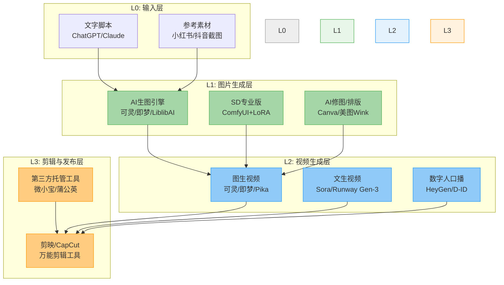
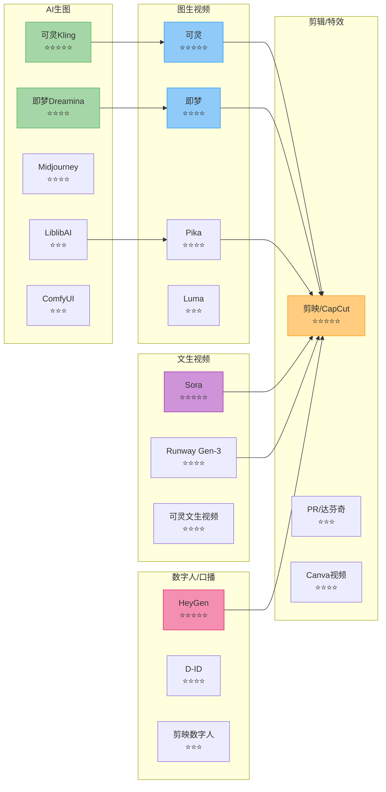

# 📕 Day29: AI生图与视频工具

> **核心：AI生图与视频工具不是「设计师的玩具」，而是自媒体人的「内容生产线」——把「写好的文字」0-1变成「可直接发布的视觉内容」。反生活缺的不是内容，而是把图文批量转化为视频/配图/封面的工业化能力。今天这篇笔记，就是补齐这块「工具链」的操作手册。**
> 来源：可灵(Kling)官方教程、即梦(Dreamina)官方文档、Pika/Luma/Stable Diffusion实操经验、剪映/CapCut官方功能详解、Runway Gen-3评测报告、头部AI短剧团队工具链拆解、2026年AI视频工具格局分析

---

## 一、一句话总结

**AI生图与视频工具 = 自媒体人的「视觉生产引擎」。** 2026年，AI生图和视频工具已经进化到「非设计师也能做出专业级内容」的程度。核心问题不再是「要不要用AI」，而是「用什么工具、怎么用、怎么组合出最高效的流水线」。反生活只需要掌握 **3个生图工具 + 2个视频工具 + 1个剪辑工具**，就能覆盖从「封面配图」到「完整视频」的所有视觉需求，把每天的内容产量提升3-5倍。

> 💡 **老黄的铁律**：工具没有「最好的」，只有「最适合你当前阶段和内容类型的」。反生活现在的核心需求是：**生图质量足够发小红书 + 视频质量足够发抖音 + 操作要快**。按这个标准去选工具，不要被「专业级的复杂工具」忽悠。

本章和 [[Day4-AI短剧制作入门]]（AI短剧工具链）、[[Day25-AI短剧制作全流程]]（完整制作SOP）、[[Day23-多平台内容复用]]（一图多吃/一鱼多吃模型）、[[Day24-AI短剧脚本创作]]（脚本创作工具化）紧密关联。

---

## 二、核心框架

### 2.1 AI视觉内容生产「三层工具栈」



**关键认知**：这不是「三个独立的工具层」，而是一条**流水线**——L0文字通过L1生图、L2生成视频、L3剪辑发布。每一层的输出就是下一层的输入。反生活现在卡在「写完内容后，配图靠网上搜、视频完全没碰」的阶段。装上这套工具链后：**写一篇内容 → AI生3-5张配图 → AI生成1条60秒视频 → 剪映合成发布 → 同时出图文+视频两份内容**。

### 2.2 2026年AI生图/视频工具「全景地图」



### 2.3 反生活工具选择「三板斧」

反生活的核心内容类型是「知识揭秘/辟谣类」，对工具的核心要求是：

| 维度 | 要求 | 首选工具 | 备选 |
|------|------|---------|------|
| **生图质量** | 稳定的信息图表/扁平插画风格 | **可灵Kling** | 即梦Dreamina |
| **图生视频** | 把静态图变成可用的动态画面 | **可灵** | 剪映关键帧（免费方案） |
| **数字人口播** | 不需要真人出镜的口播视频 | **HeyGen**（付费） | 剪映数字人（免费但效果一般） |
| **图文排版** | 小红书封面/配图标准化出图 | **Canva** | 美图秀秀 |
| **剪辑合成** | 把素材拼成完整视频 | **剪映** | CapCut（海外版剪映） |
| **短剧/剧情** | 角色一致性+多镜头叙事 | **LiblibAI + LoRA** | 可灵参考图 |

---

## 三、可落地的方法

### 3.1 ⭐ 生图工具深度拆解

#### 工具1：可灵Kling（反生活首选生图工具）

**为什么选可灵？**
- 快手出品，中文理解力强（生图中的中文文字基本不崩）
- 免费额度够用（每天免费15-30张，反生活一周内容足够）
- 支持「图生视频」一键动图（两步完成，减少一个工具切换）
- 风格稳定，知识类/科普类内容友好

**可灵生图4步法**：

```mermaid
graph TD
    subgraph "可灵生图SOP"
        S1[Step 1: 输入画面描述<br/>写你想看到的画面]
        S1 --> S2[Step 2: 选择风格<br/>扁平插画/写实/漫画/<br/>根据内容类型选]
        S2 --> S3[Step 3: 调节参数<br/>比例9:16/1:1<br/>参考图(可选)]
        S3 --> S4[Step 4: 生成+筛选<br/>每次4张<br/>保留最合适的]
        S4 --> S5{符合预期?}
        S5 -->|是| S6[下载使用]
        S5 -->|否| S1
    end

    style S1 fill:#e8f5e9,stroke:#4caf50
    style S2 fill:#e8f5e9,stroke:#4caf50
    style S3 fill:#e8f5e9,stroke:#4caf50
    style S4 fill:#e8f5e9,stroke:#4caf50
    style S6 fill:#a5d6a7,stroke:#4caf50
```

**反生活配图提示词模板**：

反生活的配图场景有5种，每种对应一套提示词模板：

```
【场景1】标题封面图
模板: "{内容关键词}，扁平插画风格，橙色和深蓝色配色方案，
居中构图，大号标题占位空间，信息清晰，干净背景，9:16比例"

【场景2】知识展示图
模板: "{知识点}，信息图表风格，数据可视化，
橙色高亮，简洁构图，白色背景，1:1比例"

【场景3】对比图
模板: "左右分屏对比，左侧{错误做法}、右侧{正确做法}，
扁平插画风格，橙色和深蓝色，文字说明，16:9比例"

【场景4】人物概念图
模板: "年轻亚洲女性，短发，卡其休闲装，
自信表情，{场景描述}，扁平插画风格，
干净背景，9:16比例"

【场景5】悬念结尾图
模板: "暗色调背景，中心留白区域，微光照明，
悬念氛围，黑色渐变从底部升起到上方留光，
扁平设计风格，文字占位，9:16比例"
```

**老黄实操示例**（以「超市避坑」为例）：

```
【封面图】
"超市购物场景，各种商品，需要被检查的配料表特写，
扁平插画风格，橙色和深蓝色配色方案，居中构图，
大号标题占位空间，干净背景，9:16比例"
→ 可灵生图4张 → 选最合适的

【知识展示】
"配料表信息卡，重点标注'糖'和'反式脂肪酸'，
数据高亮，简洁信息图表风格，1:1比例"
→ 可灵生图4张 → 选信息最清晰的一张

【对比图】
"左侧:包装写着'零添加'的果粒酸奶
右侧:其实含果葡糖浆、明胶等添加剂的配料表
左右分屏对比，扁平插画风格，9:16比例"
→ 可灵生图4张 → 选对比最明显的一张
```

---

#### 工具2：即梦Dreamina（字节跳动出品，抖音联动利器）

**为什么需要即梦？**
- 字节系工具，和抖音生态完全打通
- 中文风格偏好更贴合国内审美
- 对「小红书风」的设计风格表现优异
- 图片中的中文文字渲染比可灵还准

**即梦的独特优势**：

| 功能 | 说明 | 反生活用途 |
|------|------|-----------|
| **智能抠图** | 一键去背景 | 把人物/产品抠出来做封面 |
| **AI消除** | 去掉不需要的元素 | 批量修图，不用PS |
| **图生图** | 上传参考图改风格 | 统一所有配图的画风 |
| **画面扩展** | 把横图变成竖图 | 同一张图做小红书+抖音两版 |

**即梦生图提示词模板（反生活风格）**：

```
"小红书种草笔记风格，{内容主题}插画，
柔光滤镜，暖色调（橙色主调），干净留白，
文字区域预留，扁平矢量风格，9:16比例，
字号大、可读性强、适合微信截图传播"
```

---

#### 工具3：LiblibAI（需要角色一致性时的选择）

**什么时候用LiblibAI？**
- 反生活未来要做「短剧」或「系列IP」时
- 需要一个固定的「主角形象」贯穿所有内容
- 需要训练自己的LoRA模型（让AI学反生活的专属画风）

**LoRA是什么？**
```
LoRA = 一个轻量级的「画风/角色/物体的特征文件」
- 文件大小约20-80MB（比AI模型小100倍）
- 训练成本：10-15张图 + 30分钟训练时间
- 效果：让任何AI生图工具都认识「反生活风格」

反生活LoRA训练方案：
① 收集15-20张反生活现有的配图/封面
② 上传到LiblibAI的LoRA训练功能
③ 命名"反生活辟谣风_v1"
④ 训练30分钟后下载LoRA文件
⑤ 以后生图时加载这个LoRA → 所有图都是同一风格
```

---

### 3.2 ⭐ 视频生成工具深度拆解

#### 工具1：可灵图生视频（反生活主力视频工具）

**从图片到视频，3分钟搞定**：

```
Step 1: 在可灵选择「图生视频」
Step 2: 上传你已经生好的配图
Step 3: 输入运动描述（Motion Prompt）：
  
  知识类运动提示词模板（直接复制用）：
  - "camera slowly zooms in on the center element"
    （镜头慢慢推进到中心元素——适合信息图表）
  - "gentle camera pan from left to right"
    （镜头从左到右慢慢平移——适合对比图）
  - "subtle floating animation on floating elements"
    （元素微浮动动画——适合多元素构图）
  - "static camera with minimal motion, just slight breathing effect"
    （静止镜头+轻微呼吸效果——最适合知识类内容）
  
Step 4: 运动幅度选「Low」（保守模式，成功率最高）
Step 5: 等待30-60秒 → 生成3-5秒视频片段
Step 6: 下载 → 放入剪映
```

**关键参数参考**：

| 内容类型 | 推荐运动幅度 | 推荐时长 | 成功率 |
|---------|------------|---------|-------|
| 信息图表/知识展示 | Low | 3秒 | 90% |
| 人物特写 | Low | 4秒 | 85% |
| 对比画面 | Low-Medium | 4秒 | 70% |
| 产品展示 | Medium | 5秒 | 60% |
| 场景过渡 | Low | 3秒 | 95% |

> ⚠️ **血泪教训**：运动幅度选「High」的失败率高达60%+。知识类内容不需要剧烈运动，Low的「轻微缩放/呼吸效果」就足够让人感觉「这是视频不是PPT」了。

---

#### 工具2：剪映关键帧（0成本替代方案）

**什么情况下用剪映关键帧，不用AI视频生成？**
- 不需要角色运动的画面（纯信息图、数据对比）
- 预算紧张不想花AI视频生成的费用
- 批量制作时（剪映关键帧比AI视频生成快3倍）

**剪映关键帧3步操作**：

```
【第一步】导入静态图片到剪映
【第二步】选中图片 → 在「动画」tab中选：
  - 「放大」效果：从100%到115%（模拟镜头推进）
  - 时长：2-4秒
  - 缓出：30%（让动作结束时更自然）
【第三步】添加「画中画」图层：
  - 叠加文字或图标（让画面更丰富）
  - 关键帧动画：从下往上移动（模拟信息出现）
```

**反生活推荐：剪映关键帧「懒人模板」**：

```
模板1：信息图展示（适合配料表/数据对比）
  图片放大动画（2秒内从100%→110%）
  + 画中画重点标注（橙色高亮，小字号从下往上移入）

模板2：场景介绍（适合超市/厨房等场景）
  图片横向平移（2秒内从左→右移动场景的20%）
  + 覆盖一层半透明白色文字（标注关键信息）

模板3：人物讲解（适合需要主角出镜的）
  图片缩放+轻微上移（2秒内从100%→108%，上移5%）
  + 模拟「主角在说话」的效果
```

---

### 3.3 ⭐ 剪辑与发布工具拆解

#### 工具：剪映（反生活唯一需要的剪辑工具）

**为什么只用一个剪映就够了？**
- 免费（99%的功能免费）
- 自动字幕（语音识别准、速度快）
- 剪映模板（做一次模板，以后套用就行）
- 抖音生态打通（一键发布到抖音）
- 内置BGM和音效库（免费商用）

**反生活「剪映视频生产线」预设**：

```mermaid
graph TD
    subgraph "剪映时间轴结构"
        T1[0-3秒: 钩子] --> T2[3-15秒: 问题升级]
        T2 --> T3[15-30秒: 核心揭秘]
        T3 --> T4[30-45秒: 解决方案]
        T4 --> T5[45-55秒: 总结+CTA]
        T5 --> T6[55-60秒: 悬念]
    end

    subgraph "素材层"
        S1[配图1/可灵视频1] --> T1
        S2[配图2+关键帧动画] --> T2
        S3[信息图表+高亮标注] --> T3
        S4[对比图+放大效果] --> T4
        S5[金句文字+橙色标注] --> T5
        S6[黑屏+悬念文字] --> T6
    end

    subgraph "音频层"
        A1[悬疑BGM<br/>音量-20dB] --> T1
        A2[BGM渐强<br/>音量-15dB] --> T2
        A3[BGM暂停→爆发<br/>节奏变化] --> T3
        A4[轻快BGM<br/>音量-15dB] --> T4
        A5[BGM渐弱→停] --> T5
        A6[弦乐拖长<br/>音量-10dB] --> T6

        A1 --> A2 --> A3 --> A4 --> A5 --> A6
    end

    subgraph "字幕层"
        N1[主文字80pt<br/>白色描边] --> T1
        N2[重点词100pt<br/>橙色字体] --> T2
        N3[信息点+橙色高亮] --> T3
        N4[对比文字<br/>左灰右橙] --> T4
        N5[大字号金句<br/>占屏幕60%] --> T5
        N6[小字号<br/>"下集更精彩"] --> T6
    end

    style T1 fill:#ff6b6b,color:#fff
    style T2 fill:#feca57,color:#000
    style T3 fill:#48dbfb,color:#fff
    style T4 fill:#ff9ff3,color:#fff
    style T5 fill:#54a0ff,color:#fff
    style T6 fill:#5f27cd,color:#fff
```

---

### 3.4 ⭐ AI工具「组合拳」：5个高频场景的完整SOP

#### 场景1：小红书笔记配图（日更）

```
输入：写好的一篇小红书文案（500字）

工具链：ChatGPT → 可灵 → Canva

流程：
① ChatGPT提取3-5个「适合配图的场景/知识点」
② 每个场景用可灵生成1张图（9:16竖版）
③ 把图导入Canva，添加标题文字/品牌色
④ 导出3-5张配图 + 1张封面

总耗时：15分钟
输出：1张封面图 + 3-5张配图
```

#### 场景2：小红书图文→抖音视频（一鱼多吃）

```
输入：已发布的小红书图文笔记

工具链：可灵 → 剪映 → 抖音

流程：
① 小红书笔记提取3-5个「关键画面」描述词
② 可灵生图（已有的配图直接用，没有的新生）
③ 可灵「图生视频」：每张图生成3-5秒视频片段
④ 剪映导入：视频片段 + AI配音(剪映) + BGM
⑤ 自动字幕 → 调整时间轴 → 导出
⑥ 发布到抖音

总耗时：30分钟
输出：60秒竖屏视频
```

#### 场景3：批量制作知识卡片（周更）

```
输入：本周要发的5篇内容的「核心观点」

工具链：可灵 → Canva → 微信/小红书

流程：
① 按反生活知识卡片的固定格式（标题+核心结论+数据出处）
② 用可灵批量生图（统一风格、统一配色）
③ Canva套模板（提前做好模板）
④ 5张卡片一次性导出
⑤ 每天发1张到朋友圈/小红书

总耗时：20分钟（做5张）
输出：5张标准知识卡片
```

#### 场景4：AI数字人口播（不用真人出镜）

```
输入：写好的口播文案（300字，60秒）

工具链：ChatGPT → HeyGen/剪映数字人 → 剪映

流程：
① ChatGPT把文案优化为「口语化」
② HeyGen选择AI数字人形象（建议选"知性女高管"风格）
③ 输入文案 → AI数字人生成口播视频
④ 剪映加字幕、BGM、背景板（可选）
⑤ 导出发布

总耗时：10分钟
输出：60秒数字人口播视频
成本：HeyGen付费（约¥200/月）或剪映免费版
```

#### 场景5：AI短剧批量制作（周更5集）

```
输入：5个AI短剧脚本（来自Day24方法）

工具链：ChatGPT → LiblibAI/LoRA → 可灵 → 剪映

周一流水线：
① 周日上午：ChatGPT批量写5集脚本（30分钟）
② 周日下午：用反生活LoRA批量生50-80张素材图（2小时）
③ 周一白天：可灵图生视频（每集5个镜头×3秒=15秒素材）（1小时）
④ 周一晚上：剪映套模板，5集一次性剪完（2小时）
⑤ 周二-周六：每天发1集+回复评论

单集成本：约¥2（可灵+LoRA算力费）
单集制作时间：约3小时（5集流水线分摊后每集约1小时）
```

---

## 四、变现路径

### 4.1 反生活「AI工具」的直接变现模式

| 变现路径 | 说明 | 月收入预估 | 难度 |
|---------|------|-----------|:----:|
| **配图提效→内容产量翻倍** | 以前1天1篇，用AI工具后1天3篇，内容更多=流量更多=变现更多 | 间接（涨粉快20-30%） | ⭐ |
| **图文转视频→吃抖音流量池** | 小红书内容转抖音视频，多平台分发的流量叠加 | 每万播放≈10-30元 | ⭐⭐ |
| **AI数字人代运营** | 帮本地商家做数字人视频（探店/产品介绍） | 3000-8000元/月 | ⭐⭐⭐ |
| **AI工具教程/社群** | 把「反生活这套AI工具链」做成付费教程 | 5000-20000元/月 | ⭐⭐⭐ |
| **AI短剧CPS分成** | 用AI工具批量做短剧，放抖音小程序 | 1000-50000元/月 | ⭐⭐⭐⭐ |

### 4.2 AI工具带来的「效率倍增效应」

```
不用AI工具：
写1篇内容 + 网上找配图 + 不做视频
= 1天产出1篇图文

用AI工具后：
写1篇内容 + AI生3-5张配图 + AI转60秒视频
= 1天产出1篇图文 + 1条视频（可发2个平台）

更进一步（熟练后）：
写5篇内容 + 批量AI生图 + 批量AI视频 + 每天发1篇
= 1周准备，每天发布 → 日更压力清零
```

### 4.3 反生活「AI工具投入产出比」分析

| 工具 | 月费 | 反生活用途 | 投入产出 |
|------|:----:|-----------|:--------:|
| 可灵Kling | 免费/¥69 | 生图+图生视频 | ✅ 免费版够用 |
| 即梦Dreamina | 免费 | 小红书配图 | ✅ 免费版够用 |
| 剪映 | 免费/¥199 | 剪辑+字幕+BGM | ✅ 免费版够用 |
| Canva | 免费/¥68 | 封面排版 | ✅ 免费版够用 |
| HeyGen | ¥200+/月 | 数字人口播 | ❌ 现阶段不需要 |
| LiblibAI+LoRA | 免费 | 角色一致性 | ✅ 免费版够用 |

**结论**：反生活现阶段AI工具投入 = **¥0/月**（全部用免费版），就可以实现「日更3倍产能」。

---

## 五、行动清单

### 今天就能做的3件事

#### ✅ 第1件事：注册+试用工具（30分钟）

```
☐ 下载「可灵」App或打开web版（kling.kuaishou.com）
  → 用微信登录 → 领取每日免费额度（约15-30张）
  → 试着生成3张「反生活」风格配图（用上面的提示词模板）
  → 感受一下：输入20个字→4张图→选最合适的
  
☐ 打开「剪映」App
  → 导入刚才生成的其中1张图
  → 添加「放大」关键帧动画（2秒从100%→110%）
  → 添加自动字幕（随便录一句语音）
  → 导出 → 看看你的第一条AI辅助视频
  
☐ 打开「Canva」
  → 搜索模板"小红书封面"
  → 选择「知识类」模板 → 替换文字和图片
  → 导出你的第一张AI辅助封面图
```

#### ✅ 第2件事：建立反生活「工具库」文件夹（15分钟）

```
在你的项目目录中创建：
~/Desktop/Projects/h-social.github.io/assets/ai-tools/
  ├── 提示词库/         （存放各类提示词模板）
  │   ├── 封面图提示词.md
  │   ├── 知识图提示词.md
  │   └── 对比图提示词.md
  ├── 素材库/           （存放已生成的好图）
  │   ├── 可灵素材/
  │   └── 即梦素材/
  └── 剪映模板说明.md    （记录你设置的模板参数）
```

#### ✅ 第3件事：本周内容「AI化」改造（1小时内）

```
【本周要发的3篇内容，用AI工具改造流程】

篇1（今天已写完的）：
① 复制文案到ChatGPT → 让它提取3个「可配图」场景
② 可灵生3张图 → Canva做封面
③ → 发布小红书的时候，配图从「网图」换成「AI图」
    对比一下互动数据

篇2（明天要写的）：
① 写的时候就直接考虑「哪些场景可以用AI配图」
② 写完后一次生成所有配图
③ 同时：用这些图做一条30秒「图文转视频」
    发到抖音看看效果

篇3（大后天要改的）：
① 用剪映模板批量输出
② 标题+标签按 Day3-抖音运营 的优化方案
③ A/B测试：AI配图 vs 网图，哪个互动更高
```

---

## ⭐ 反生活可以直接用的

### 1. 反生活AI配图「一图多吃」模型

```
同一张AI生成的知识图，可以：

→ 小红书：作为笔记配图（9:16竖版）
→ 抖音：作为视频封面（9:16，加文字标题）
→ 朋友圈：作为知识卡片（1:1，裁剪后发）
→ 公众号：作为文章配图（16:9如果是横图）
→ 闲鱼：作为商品展示图（修剪边缘）
→ 剪映：作为视频素材（加关键帧动画）

一张图 = 6个平台的内容素材
```

### 2. 反生活「免学版」AI工具快速上手表

| 想做什么 | 用哪个工具 | 第1步做什么 | 多久出结果 |
|---------|-----------|------------|:--------:|
| 给笔记配图 | 可灵 | 打开App → 输入"超市配料表" | 3分钟 |
| 做封面 | Canva | 选模板 → 改文字 | 5分钟 |
| 图文转视频 | 可灵+剪映 | 可灵图生视频 → 剪映拼起来 | 15分钟 |
| 做知识卡片 | 可灵+Canva | 可灵生图 → Canva加文字 | 5分钟/张 |
| 数字人说话 | 剪映 | 文字→语音→数字人 | 10分钟 |
| 批量出图 | 可灵 | 用同一提示词换关键词 | 30分钟/5张 |

### 3. 避坑指南

```
❌ 不要做的：
1. 不要同时用5个工具 → 选1-2个主力工具，其他的备用
2. 不要追求「完美画质」→ 小红书用户更在意内容，不是画质
3. 不要花时间学PS → Canva+剪映解决90%需求
4. 不要用AI生成「复杂人物互动」→ 成功率低，浪费时间
5. 不要在AI生图上花太多时间 → 内容第一，配图辅助

✅ 应该做的：
1. 从「最急需」的环节开始（反生活：配图 > 视频 > 数字人）
2. 建立提示词库（记录所有好用的提示词，下次直接用）
3. 每次生成都保留「最佳版本」（建素材库，避免重复生成）
4. 做剪映模板（一次设置，永久复用）
5. A/B测试配图效果（AI配图 vs 网图，哪个数据好就用哪个）
```

---

> **关联笔记**：[[Day4-AI短剧制作入门]] · [[Day25-AI短剧制作全流程]] · [[Day24-AI短剧脚本创作]] · [[Day23-多平台内容复用]] · [[Day3-抖音短视频运营]]

> **下一步**：Day30: 小红书官方创作者学院内容
