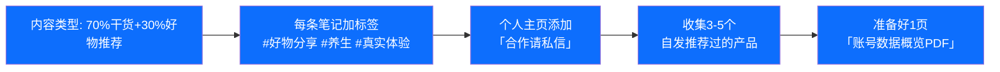
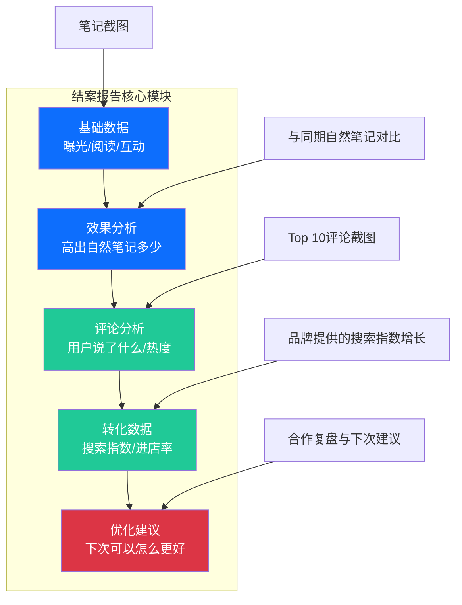
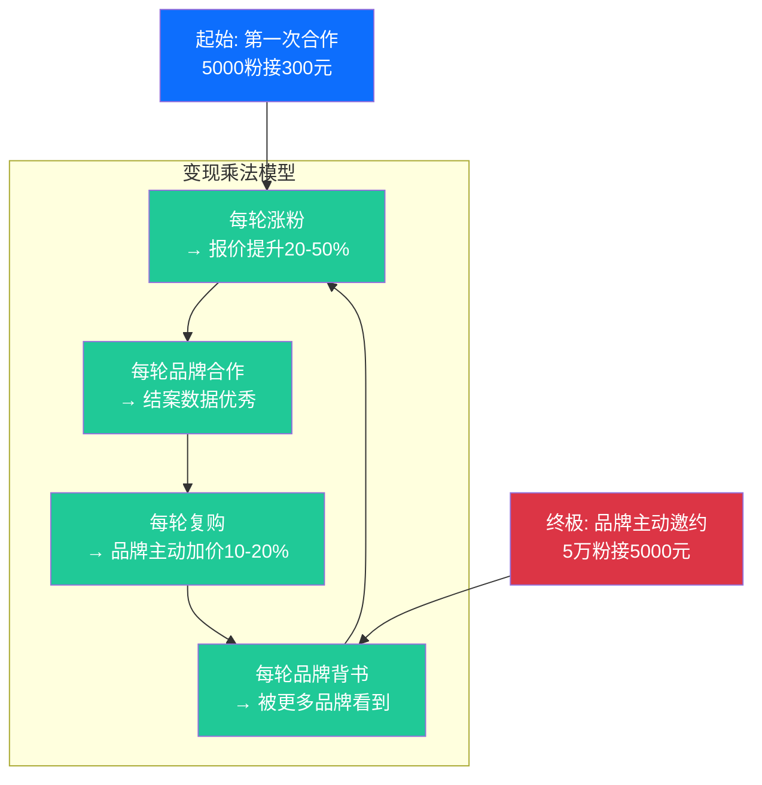

# Day29: 小红书蒲公英平台与品牌合作变现——从接单到年入百万的全链路拆解

> 📅 学习日期：2026-07-23
> 🔗 关联笔记：[[00-目录]] | 上一篇：[[Day28-自媒体内容工业化生产]] | 下一篇：Day30
> 🎯 适用场景：反生活好物养生账号的品牌合作接单、蒲公英平台操作、报价策略、商业笔记合规操作
> 📚 学习来源：小红书官方蒲公英创作者学院 × 小红书品牌合作手册 × 多位头部博主品牌合作复盘（年入20-200万区间） × MCN商务对接SOP × 小红书官方商业变现政策 × 多位万粉博主的品牌合作踩坑实录 × 小红书蒲公英平台2025-2026最新政策

---

## 1. 一句话总结

**小红书蒲公英平台品牌合作变现 = 把「账号影响力」变成「现金流」的最直接路径——不是靠运气等品牌来找你，而是通过系统化的账号建设、报价策略、谈判技巧和复购体系，把品牌合作从一个「偶尔的收入」升级为「稳定可预期的月收入」。对老黄的「反生活」好物养生账号来说，品牌合作不是要等到10万粉才能开始——5000粉就能接置换合作，1万粉就能接付费推广，关键不是你粉丝多少，而是你的「种草力」有多强。**

**核心认知转变：** 99%的新人博主搞反了品牌合作的逻辑——以为「粉丝多了自然有品牌来找」，结果陷入「涨粉焦虑」，天天想的是怎么搞爆款、怎么蹭热点，内容越做越偏，等品牌真的来了又不知道怎么报价、怎么走流程、怎么保证效果。而真正靠品牌合作年入50万+的博主，做法恰恰相反——他们从起号第一天就以「品牌合作」为终点倒推内容方向。你的内容本身就是「产品」，品牌买的是你帮他们「种草」的能力，不是你粉丝数的数字。**一个1万粉的垂直养生号，报价可能比一个10万粉的泛娱乐号还高——因为养生号的粉丝购买决策力更强、品牌转化率更高。**

**底层逻辑：** 小红书是目前所有内容平台里品牌合作生态最成熟、最能赚钱的。2026年小红书品牌合作市场规模预计突破1000亿，蒲公英平台入驻品牌超50万。为什么？因为小红书的「种草—决策—购买」链路最短——用户在别的平台看内容是为了娱乐，在小红书看内容是为了「买什么好」。这种「购物心智」使得小红书的商业笔记转化率是抖音的3-5倍、公众号的2-3倍。**品牌不是来找你发广告的，品牌是来借你的「信任杠杆」撬动用户的购买决策的。**

---

## 2. 核心框架

### 2.1 品牌合作变现的「五层漏斗」

```mermaid
graph TD
    subgraph 第一层 · 基础层<br/>账号商业价值建设
        A1[垂直定位<br/>好物养生] --> A2[内容调性<br/>统一视觉/语气]
        A2 --> A3[粉丝画像<br/>购买力/决策力]
        A3 --> A4[数据锚点<br/>互动率>5%]
    end

    subgraph 第二层 · 接单层<br/>品牌合作获取
        B1[蒲公英平台<br/>官方接单通道] --> B2[品牌邀约<br/>PR私信/邮件]
        B2 --> B3[MCN代理<br/>商务谈判]
        B3 --> B4[PR主动开发<br/>自己找品牌]
    end

    subgraph 第三层 · 执行层<br/>商业笔记生产
        C1[Brief解读<br/>品牌需求拆解] --> C2[创意融合<br/>品牌不违和]
        C2 --> C3[合规审核<br/>报备/敏感词]
        C3 --> C4[发布排期<br/>黄金时段]
    end

    subgraph 第四层 · 数据层<br/>效果追踪与复盘
        D1[曝光量<br/>小眼睛] --> D2[互动数据<br/>点赞/收藏/评论]
        D2 --> D3[转化数据<br/>搜索/进店/加购]
        D3 --> D4[ROI报告<br/>结案报告]
    end

    subgraph 第五层 · 增长层<br/>复购与提价
        E1[品牌复购<br/>一次合作→长期] --> E2[报价提升<br/>每3个月调价]
        E2 --> E3[粉丝增长→<br/>更高客单价]
        E3 --> E4[多渠道变现<br/>带货/课程/咨询]
    end

    A4 --> B1
    B4 --> C1
    C4 --> D1
    D4 --> E1
    E4 --> A1

    style A1 fill:#0d6efd,color:#fff
    style A2 fill:#0d6efd,color:#fff
    style A3 fill:#0d6efd,color:#fff
    style A4 fill:#0d6efd,color:#fff
    style B1 fill:#20c997,color:#fff
    style B2 fill:#20c997,color:#fff
    style B3 fill:#20c997,color:#fff
    style B4 fill:#20c997,color:#fff
    style C1 fill:#dc3545,color:#fff
    style C2 fill:#dc3545,color:#fff
    style C3 fill:#dc3545,color:#fff
    style C4 fill:#dc3545,color:#fff
    style D1 fill:#fd7e14,color:#fff
    style D2 fill:#fd7e14,color:#fff
    style D3 fill:#fd7e14,color:#fff
    style D4 fill:#fd7e14,color:#fff
    style E1 fill:#6f42c1,color:#fff
    style E2 fill:#6f42c1,color:#fff
    style E3 fill:#6f42c1,color:#fff
    style E4 fill:#6f42c1,color:#fff
```

### 2.2 蒲公英平台的底层规则

| 维度 | 详情 |
|------|------|
| **入驻门槛** | 粉丝≥5000，过去30天有至少2篇原创笔记（2026年最新政策，之前是1000粉，门槛提高后品牌合作质量提升明显） |
| **合作模式** | 图文笔记、视频笔记、直播推广、商品笔记挂链 |
| **平台抽成** | 10%（品牌方付）对个人博主不抽成，对MCN机构博主抽1-5% |
| **报价区间** | 5000-1万粉：200-800元/篇；1万-5万粉：800-4000元/篇；5万-20万粉：4000-15000元/篇；20万+粉：15000-50000+元/篇 |
| **审核机制** | 系统+人工双重审核，敏感词、竞品对比、夸大宣传、未报备推广都会被限流或禁止 |
| **结算周期** | 笔记发布后7天自动结算（品牌确认没问题后） |
| **违规处罚** | 未报备商业笔记：首次警告，二次限流7天，三次永久封禁品牌合作权限 |

> ⚠️ **关键警示：** 2026年小红书对未报备商业笔记的打击力度前所未有。算法现在可以识别「非报备但明显是推广」的内容，识别率据说超过90%。别想着省那10%的抽成偷偷发推广——被检测到后限流7天，损失的是几十倍于抽成的自然流量。**对于反生活账号，任何时候都要走蒲公英平台报备，这是底线不能碰。**

### 2.3 品牌合作的核心公式

```
单篇合作收入 = (粉丝数 × 互动率权重) × 垂直领域溢价 × 内容形式系数

其中：
- 互动率权重 = (点赞+收藏+评论)/粉丝数 × 100。>5%为A级（溢价30%），3-5%为B级，<3%为C级（折价20%）
- 垂直领域溢价：养生/好物=1.5-2.0x，美妆=1.2-1.5x，穿搭=1.0x，泛娱乐=0.5x
- 内容形式系数：视频=1.3x，图文=1.0x，纯图片=0.7x
```

**举个例子：** 老黄的「反生活」账号如果做到5000粉、互动率6%（养生号常见高互动）、好物养生领域溢价1.8x、视频笔记系数1.3x，那么一个视频合作报价 = 5000 × 1.6（6%互动率A级）× 1.8 × 1.3 = **18720元/篇**？这个数字看起来偏高了，因为粉丝数基础太低时公式需要调整。更实际的估算：

- 5000-1万粉好物养生号：**实际行情300-800元/篇**（含置换，即品牌送产品替代部分现金）
- 1万-5万粉好物养生号：**实际行情800-3000元/篇**
- 5万-10万粉好物养生号：**实际行情3000-8000元/篇**（此时溢价开始显现）
- 10万+粉好物养生号：**实际行情8000-25000元/篇**

**反生活的目标：** 半年内做到1万粉 → 每月接4-6篇品牌合作 → 月收入3000-15000元 → 年收入5-15万。这不是做梦，是养生赛道确实有这么多品牌预算。

---

## 3. 可落地方法

### 3.1 品牌方喜欢的「反生活」账号画像

不是所有账号都能接到品牌合作。品牌方挑选合作博主时，90%的决策权在以下5个指标。按照「反生活」的定位，我们逐一拆解：

| 指标 | 品牌方关注点 | 反生活的优势策略 |
|------|------------|-----------------|
| **粉丝精准度** | 粉丝是否是真粉？是否与产品目标人群匹配？ | 养生好物号天然精准——粉丝都是25-45岁有消费力的女性，正是养生品牌的目标人群 |
| **互动质量** | 评论有没有真实交流？还是只有「好的」「666」？ | 养生内容天然有互动点——「这个真的有用吗」「在哪里买」「我爸也需要」，每条都值得认真回复 |
| **内容调性** | 视觉统一吗？排版舒服吗？有生活气息吗？ | 反生活的深色高级风、真诚吐槽人设恰恰是品牌想要的「不土不low的养生号」 |
| **历史数据** | 过去10篇平均小眼睛多少？稳定吗？ | 保持日更 + 流量稳定，品牌看到的是「稳定产出能力」而非「单篇爆款」 |
| **商业素养** | 回复及时吗？能理解brief吗？会提交数据报告吗？ | 老黄做了20多天学习笔记 + 本身有商业理解力 → 这反而是核心竞争力 |

### 3.2 从0到1的接单实操流程

#### 第一步：打好商业基础（5000粉之前就做）



**具体动作：**
1. **内容中自然植入好物推荐**——不是等品牌来找你才推荐，而是你本来就一直在推荐真正好用的养生品。这样当你说「这个品牌找我合作了，我真的在用」时，粉丝完全信服。
2. **每条笔记都打上#好物分享 #养生 #真实体验**——品牌方的商务会在蒲公英后台根据标签搜索博主，这些标签就是你的「被搜索入口」。
3. **主页置顶一条「关于我」+「合作须知」**——写清楚你的粉丝画像、内容方向、合作方式。品牌PR看到直接知道合不合适。
4. **准备好「账号数据概览」**——一页PDF，包含：粉丝数、近30天平均小眼睛、互动率、粉丝年龄性别分布、过往数据最好的5篇笔记标题+数据。品牌PR每天看几十个博主，你给她这个PDF，她直接省掉自己扒数据的时间 → 她更愿意选你。

#### 第二步：粉丝5000+ → 入驻蒲公英平台

1. 打开小红书APP → 创作者中心 → 蒲公英平台
2. 申请入驻（审核一般1-3个工作日）
3. 设置合作模式：开启「品牌合作」和「商品合作」
4. 设置报价（建议先定市场价的80%，早期以积累案例和数据为主）
5. 完善个人资料：标签设为「养生」「好物推荐」「生活方式」

#### 第三步：接单与谈判

当品牌PR通过私信或蒲公英平台联系你时：

**品牌合作私信回复SOP：**

```
你好！感谢关注～ 简单介绍一下我这边：<br>
✓ 账号定位：养生好物真实测评分享，粉丝主要是25-45岁注重健康的女性<br>
✓ 近期数据：近30天平均小眼睛XX，互动率XX%<br>
✓ 合作案例：此前与XX品牌合作过（如有）<br>
✓ 合作流程：走蒲公英平台报备，我可以先了解下brief吗？方便发我看看～
```

**这封回复的妙处：**
- 既展示了专业度又没直接报价（留了谈判空间）
- 主动提出走蒲公英报备（让品牌放心你不是黑户）
- 要brief而不是直接问「多少钱」（显得你有合作经验）

**报价谈判技巧：**

| 场景 | 策略 | 话术 |
|------|------|------|
| 品牌先问报价 | 报市场价中上水平，留10-20%砍价空间 | 「我们这边图文合作是XX元，视频是XX元。不过具体可以看brief再谈～」 |
| 品牌出价低于预期 | 不直接拒绝，争取附加权益 | 「价格方面我们可以再沟通，不过能不能在品牌官号转发我的笔记？或者长期合作价格可以更优惠～」 |
| 品牌要置换非付费 | 根据产品价值判断 | 产品价值<200元且品牌不够知名 → 婉拒/要部分付费；产品价值500+ → 置换+低付费组合 |
| 多品牌同时找你 | 别透露，但可适度提高预期 | 「最近确实有好几个养生品牌在聊，不过我对你们的产品很感兴趣～」 |

#### 第四步：商业笔记创作（黄金法则）

**反生活养生号商业笔记的「3+3」结构：**

```
第一部分（前3秒定生死）—— 痛点共鸣
- 不要直接说产品，先说用户痛点
- 例：「熬夜到2点，早上起来脸黄得像煎饼果子——中医朋友推荐了这个」

第二部分（中间3段讲价值）—— 产品体验
- 产品为什么好 ≠ 抄品牌卖点
- = 你有这个痛点 + 试了这个产品 + 效果怎么样 + 是不是真的值
- 例：「本来以为是智商税，用了两周……早上一照镜子，气色真的不一样了」

第三部分（结尾3句促行动）—— 自然引导
- 不要说「快来买」，要说「如果也有这个困扰，可以试试看」
- 附上品牌官方信息，方便粉丝自己搜索
- 例：「需要的姐妹直接搜XX旗舰店就行，官方最近还有活动～」
```

**关键避坑点：**
- ❌ 不要出现「最好」「第一」「绝对有效」——蒲公英审核直接不过
- ❌ 不要竞品对比（说XX比XX好）——违规
- ❌ 不要直接放购买链接（除非是小红书商城挂链）——默认违规
- ✅ 用「我用了一个月」「朋友推荐的」「回购第二次」——真实感拉满
- ✅ 每条商业笔记至少发2-3条真实评论互动 → 带动自然流量
- ✅ 品牌合作笔记发布后24小时内不要删除或隐藏——触发平台风控

#### 第五步：结案报告（决定了品牌会不会再找你）



一份好的结案报告 = 下次品牌直接找你复购 + 主动加价20%。一份差的结案报告 = 品牌觉得你没用心 → 一次性合作。

**结案报告模板（发给品牌PR的）：**

```
【XX品牌合作结案报告】
合作博主：反生活（@账号名）
合作形式：图文/视频笔记
发布时间：XXXX年X月X日 XX:XX

一、基础数据
- 笔记曝光量：XXXX（高出自然笔记平均 X%）
- 阅读量：XXXX
- 互动量：点赞XX 收藏XX 评论XX
- 互动率：XX%（高出近30天平均 X%）

二、评论分析
- 正向评论 X条，中性 X条，负面 X条
- 高热度评论摘录：X条截图

三、效果总结
- 品牌词搜索热度提升：XX%（品牌方提供）
- 笔记收藏率：XX% → 说明用户真的在认真看内容

四、优化建议
- 下次可以尝试XX角度/XX时间发布/XX形式（体现你的专业度）

感谢合作！希望能长期合作～ 下次如果有新品发布或活动，记得找我哦😊
```

**为什么要做结案报告？** 99%的博主合作完就不管了。你做结案报告 → 品牌记住你 → 下次主动找你。而且品牌PR换工作或者推荐你，一份专业的结案报告就是你的「口碑传播素材」。

### 3.3 反生活账号的「品牌开发计划」（PR主动出击）

不是等品牌来找你——反生活这个账号足够垂直，你可以主动出击开发品牌合作。以下是开发SOP：

**第一步：锁定目标品牌清单（小红书搜「养生品牌」「好物品牌」）**

列出20个符合反生活调性的品牌。举例方向：
- 养生茶饮：茶里、Chali、立顿养生系列、同仁堂茶饮
- 保健食品：Swisse、汤臣倍健、健康元、养生堂
- 中医养生：东阿阿胶、方回春堂、胡庆余堂
- 家居好物：MUJI、网易严选养生线、小米有品好物
- 养生器械：倍轻松、SKG、攀高

**第二步：主动建立联系**

渠道1：在品牌官方笔记下高质量评论 → 引起品牌官方号注意
渠道2：直接私信品牌官方号 → 附账号数据概览PDF
渠道3：在蒲公英平台主动搜索品牌 → 参与品牌的「招募」活动

**第三步：创作「样品笔记」主动展示**

选一个你真正想合作但还没合作的品牌，自己买他们的产品，拍一条真实测评笔记 → 发出后@品牌官方号 → 数据好的话品牌PR一定会来找你。

**这是一招「阳谋」：** 品牌看到你自发测评而且数据不错，等于你已经帮他们证明了「这条内容挂上品牌logo是有效果的」。这时候他们来找你合作，报价主动权在你手里。

---

## 4. 变现路径

### 4.1 反生活养生号的收入模型（分阶段）

| 阶段 | 粉丝量级 | 月接单量 | 单篇收入 | 月收入 | 月变现方式组合 |
|:----:|:--------:|:--------:|:--------:|:------:|:-------------:|
| 起步期 | 0-5000 | 0-1篇置换 | 0-500元（实物价值） | 0-500元 | 内容积累为主，偶尔置换合作 |
| 成长期 | 5000-1万 | 2-3篇 | 300-800元 | 600-2400元 | 品牌合作+少量置换 |
| 加速期 | 1万-3万 | 4-6篇 | 800-2000元 | 3200-12000元 | 品牌合作为主+蒲公英商单 |
| 爆发期 | 3万-10万 | 6-10篇 | 2000-8000元 | 12000-80000元 | 品牌合作+直播带货+知识付费 |
| 成熟期 | 10万+ | 8-15篇 | 8000-25000元 | 64000-375000元 | 全渠道变现+自有品牌 |

> **核心策略：** 不要一口气追求最高收入，而是「稳扎稳打」。在成长期（5000-1万粉），每月接2-3篇商单就够了——接太多商业笔记会影响自然流量和粉丝信任。**商业笔记占比建议控制在20%以内**，即每发10篇笔记，最多2篇是品牌合作。

### 4.2 不同阶段的收入天花板

**只看广告合作收入（保守估算）：**

| 阶段 | 月上限 | 年上限 | 关键瓶颈 |
|:----:|:------:|:------:|:--------:|
| 5000-1万粉 | 2,400元 | 28,800元 | 粉丝数限制报价 |
| 1万-5万粉 | 12,000元 | 144,000元 | 接单频率限制（不能超过20%） |
| 5万-10万粉 | 80,000元 | 960,000元 | 需要构建团队辅助生产和商务 |
| 10万-30万粉 | 375,000元 | 4,500,000元 | 需要专业商务谈大合作 |

**反生活6个月目标：** 粉丝1万 → 月稳定收入5000-15000元 → 年入6-18万（副业完全够了）。

### 4.3 品牌合作之外的「隐藏」变现方式

品牌合作不是唯一变现手段，但它是一个「放大镜」——有了品牌合作经验后，以下变现渠道会变得更容易：

1. **小红书商品笔记带货**：开了蒲公英之后可以开通商品分享，笔记直接挂商品链接。单篇爆款笔记可以带来3000-10000元佣金收入。这个不需要等品牌合作，现在就能做！
2. **品牌置换实物变现**：拿到品牌寄送的养生品 → 自己用不完可以二手出/送粉丝 → 也是隐形收入（每月价值500-2000元）
3. **品牌PR转介绍费**：合作的品牌PR觉得你靠谱 → 把你推荐给其他品牌 → 介绍成功收10%介绍费
4. **知识付费（进阶）**：做得好了可以开「养生好物博主从0到1」课程 → 把自己的经验教给别人 → 定价199-999元（参考[[Day09-个人IP打造]]）
5. **品牌顾问（高阶）**：变成养生领域的意见领袖 → 品牌的「产品体验官」「品牌顾问」→ 月费3000-10000元

### 4.4 品牌合作收入的「乘法效应」



这个「乘法效应」的关键是：**每一次品牌合作都不是终点，而是下一次的起点。** 很多博主把品牌合作当「一锤子买卖」——拿了钱、发了笔记、不管了。而真正赚钱的博主，每一次合作都在积累下一轮的筹码：
- 这次数据好 → 下次报价可以加20%
- 这次品牌PR满意 → 下次新品首发优先找你
- 这次结案报告专业 → 品牌PR把你推荐给同行

**这就是为什么同样的粉丝量，有人月入2000，有人月入2万——差的不是粉丝数，是「把一次合作变成长期关系」的能力。**

---

## 5. 行动清单

### 🚀 今天就做的3件事

**✅ 动作1：开通蒲公英平台准备（20分钟）**

即使现在粉丝还没到5000，先把准备工作做好：
- 检查账号是否为「个人号」而非「企业号」——企业号不能接个人品牌合作
- 开始收集3-5款你真正用过且觉得好的养生品（产品照片+使用感受草稿）
- 更新小红书个人简介，加上「好物测评分享|合作私信」
- 在Obsidian中新建「品牌合作跟踪表」，列以下字段：品牌名、联系方式、报价、合作状态、合作日期、收益

**✅ 动作2：建立「养生品牌重点关注清单」（30分钟）**

- 在小红书搜索「养生」「好物」「养生茶」「中医养生」「保健品」
- 找出20个你愿意合作、且符合反生活调性的品牌
- 关注这些品牌的官方号
- 把清单存入Obsidian，每次看到品牌发布新品 → 第一时间互动

> 💡 **选品原则：** 优先选你「发自内心想推荐」的品牌。如果一款产品你对它没信心，写出来的内容品牌和粉丝都能感觉到。反生活的核心人设是「真诚的大实话」——这条底线不能因为品牌合作就破了。

**✅ 动作3：反生活账号做「品牌合作自查」**

拿出一条历史笔记，模拟品牌合作审核标准：
- 内容是否有「推荐」属性？（产品名、使用感受、推荐理由）
- 如果这是品牌付费内容，粉丝会觉得「太假了还是微信推广」？
- 你的内容风格是否适合承载品牌信息？
- **关键测试：** 找一款你愿意免费推荐给朋友的产品 → 写一条60秒的语音推荐 → 这就是商业笔记应有的「诚意感」。如果连朋友都不好意思推荐，就说明这个产品不适合接。

**⚠️ 最终警醒：** 品牌合作的终极法则只有一条——

> **「如果这款产品不能免费推荐给朋友，那收了钱也不要推荐。」**

这不是鸡汤，这关乎反生活账号的核心资产——**信任**。一条收了钱但内容违心的商业笔记，赚了200块，但可能永远失去100个真正信任你的粉丝。这笔账怎么算都不划算。

---

> 📌 **核心记忆点：**
>
> 1. **品牌合作不是等来的，是「准备」来的**——5000粉之前就开始做准备（标签、数据PDF、产品清单），等到了5000粉直接开干。不准备=到了1万粉也接不到单。
> 2. **垂直领域的溢价远超你的想象**——反生活是养生好物号，粉丝购买决策力强，同样1万粉报价是同量级泛娱乐号的3-5倍。不要羡慕别人的粉丝数，做好自己的「垂直度」。
> 3. **20%商业笔记上限是铁律**——商业笔记占比超过20% → 自然流量断崖下跌 → 粉丝信任崩塌。每发一篇商单，至少用4篇纯干货内容「养活」账号。
> 4. **结案报告让你变成「品牌最想复购的博主」**——99%的博主不做结案报告，你做了就是那1%。每次合作后给品牌一份专业结案报告，下次报价直接加20%都不带犹豫的。
> 5. **信任是反生活最大的商业资产**——你的每次推荐都在消耗粉丝的信任。推荐一次假货，之前积累的所有信任可能瞬间清零。**真实推荐、坦诚体验、用心创作——这不是道德标准，这是商业策略。**
>
> 📖 关联阅读：[[Day09-个人IP打造]] | [[Day01-小红书电商闭环]] | [[Day05-小红书矩阵号运营]] | [[Day27-自媒体转化文案写作]] | [[Day02-小红书投放与投流]] | [[Day18-多平台变现矩阵]] | [[Day19-用户心理与行为设计]]
