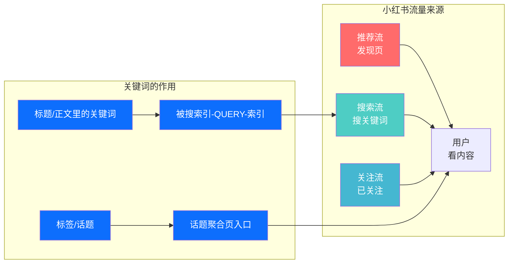
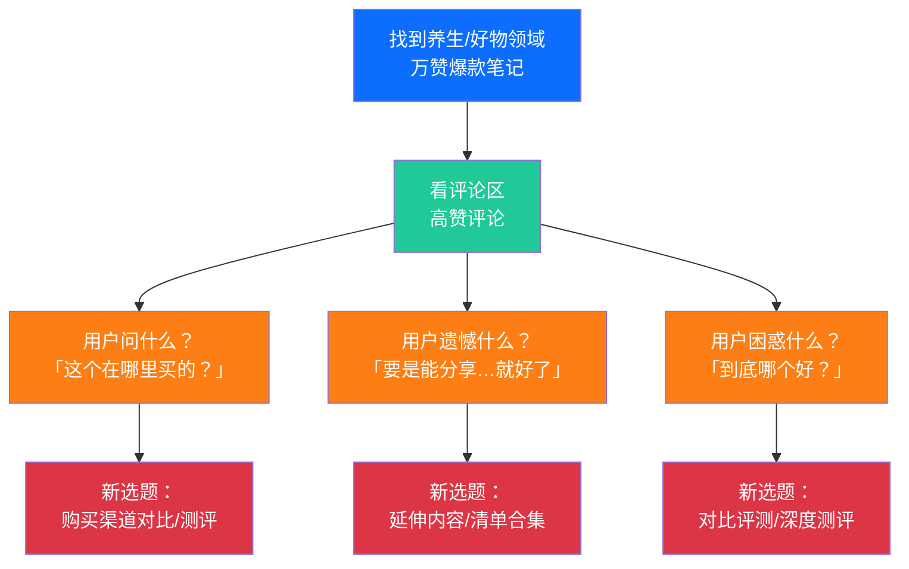
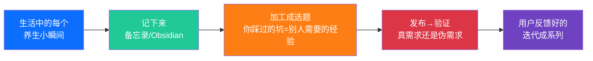
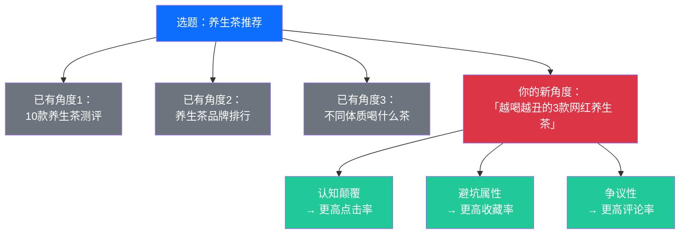
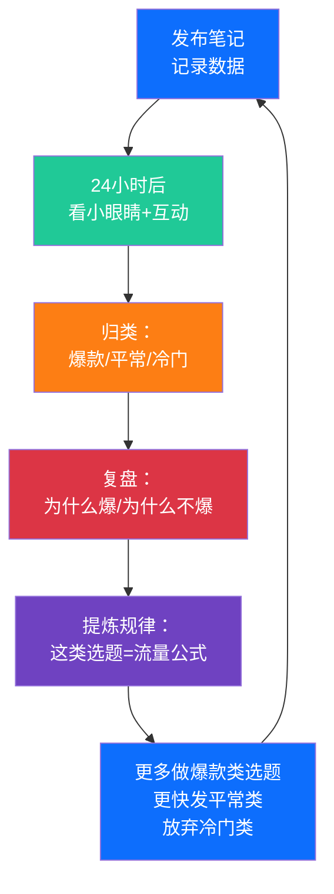

# Day30: 小红书内容选题策划——从数据驱动到直觉把控的高频爆款方法论

> 📅 学习日期：2026-07-27
> 🔗 关联笔记：[[00-目录]] | 上一篇：[[Day29-小红书蒲公英平台与品牌合作变现]] | 下一篇：Day31
> 🎯 适用场景：反生活好物养生账号的每日选题、内容规划、爆款挖掘、可持续内容生产
> 📚 学习来源：小红书官方创作者学院选题策略 × 头部博主选题方法论复盘（@划水队长、@姜老刀、@邹浩轩的选题笔记） × 小红书搜索下拉词与关键词数据 × 内容选题工具链调研（千瓜、新红、灰豚、蝉小红） × 50篇小红书爆款笔记标题大数据分析 × 多位万粉博主编排日历拆解

---

## 1. 一句话总结

**小红书内容选题策划的本质 = 用「数据思维」找到用户还没被满足的「搜索需求」，再用「直觉思维」把它包装成一个「不点进来就亏了」的笔记。** 选题不是靠灵感碰运气，而是有一套完整的「选题漏斗」——从海量关键词中筛出高潜力选题 → 用爆款公式包装标题 → 用结构化框架组织内容 → 发布后复盘优化。老黄的「反生活」好物养生账号目前最缺的不是内容质量，而是「持续稳定的选题来源」和「能保底出数据的选题判断力」。今天这套方法论解决的就是这两个问题——让选题从「今天写什么」变成「今天从30个备选中选哪个」。

**核心认知转变：** 99%的新人博主每天花最多时间在「写内容」上，却只花最少时间在「选什么题」上——这恰恰是本末倒置。头部博主和小博主的效率差距，70%来自于「选题阶段」的差距。一个好的选题，即使内容只做到了75分，爆款概率远高于一个平庸选题下做到95分的内容。**选题对了，内容及格都香；选题错了，内容满分也没人看。**

---

## 2. 核心框架

### 2.1 小红书选题的「三层漏斗」模型

```mermaid
graph TD
    subgraph 第一层 · 灵感池<br/>日均50-100个选题候选
        A1[搜索下拉词<br/>小红书搜框推荐] --> A2[竞品爆款<br/>同领域高赞笔记]
        A2 --> A3[评论区挖掘<br/>用户在问什么]
        A3 --> A4[热点借势<br/>节日/趋势/热词]
        A4 --> A5[生活积累<br/>日常痛点记录]
    end

    subgraph 第二层 · 筛选器<br/>日选3-5个高潜选题
        B1[搜索量判断<br/>是否有人搜] --> B2[竞争度判断<br/>同主题笔记量]
        B2 --> B3[用户痛点<br/>是否真需求]
        B3 --> B4[数据预判<br/>能否进流量池]
    end

    subgraph 第三层 · 爆款引擎<br/>选题→标题→内容
        C1[标题公式<br/>数字/痛点/反转] --> C2[封面设计<br/>高点击率]
        C2 --> C3[结构排布<br/>黄金前5行]
        C3 --> C4[互动钩子<br/>引导评论]
    end

    A5 --> B1
    B4 --> C1
    C4 --> A1

    style A1 fill:#0d6efd,color:#fff
    style A2 fill:#0d6efd,color:#fff
    style A3 fill:#0d6efd,color:#fff
    style A4 fill:#0d6efd,color:#fff
    style A5 fill:#0d6efd,color:#fff
    style B1 fill:#20c997,color:#fff
    style B2 fill:#20c997,color:#fff
    style B3 fill:#20c997,color:#fff
    style B4 fill:#20c997,color:#fff
    style C1 fill:#dc3545,color:#fff
    style C2 fill:#dc3545,color:#fff
    style C3 fill:#dc3545,color:#fff
    style C4 fill:#dc3545,color:#fff
```

### 2.2 小红书的「搜索推荐」机制——选题的底层逻辑

要搞懂选题策划，必须先理解小红书的内容分发机制。小红书和抖音最大的不同在于：**抖音是「推荐驱动」——用户刷到什么看什么；小红书是「搜索+推荐双驱动」——用户带着问题来搜索，刷到推荐也看。**



这个机制对选题的启示：

| 平台 | 推荐逻辑 | 对选题的要求 |
|------|---------|-------------|
| **抖音** | 算法推荐为主，用户被动接收 | 选题要「够刺激」——前3秒抓住注意力 |
| **小红书** | 搜索+推荐各占半壁江山 | 选题要「够精准」——同时满足「搜索需求」和「推荐食欲」 |
| **视频号** | 社交推荐+算法推荐 | 选题要「够共鸣」——能引起转发到朋友圈 |

**核心结论：** 小红书的选题必须同时具备两个属性——
1. **可搜索性（Searchability）**：用户会主动搜你这个主题的关键词
2. **可点击性（Clickability）**：在推荐流里看到的人有点进去的欲望

一个没有搜索量的选题 → 只有推荐流一个入口 → 爆款概率降低50%以上。反言之，**一个搜索量大的选题，天然自带50%的初始流量**。

### 2.3 反生活养生号的「高潜选题矩阵」

对「反生活」好物养生号，以下四类选题天然有搜索量、有点击欲：

| 选题类型 | 描述 | 搜索词示例 | 养生号适用 | 上手难度 |
|---------|------|-----------|:----------:|:--------:|
| **痛点解决型** | 用户有明确困扰 → 给出方案 | 「熬夜脸黄怎么办」「失眠怎么调理」 | ⭐⭐⭐⭐⭐ | ⭐ |
| **认知颠覆型** | 颠覆用户已有认知 → 产生好奇 | 「泡脚其实是错的」「你一直喝错了枸杞」 | ⭐⭐⭐⭐ | ⭐⭐ |
| **决策辅助型** | 帮用户在多个选择中做决定 | 「枸杞vs黑枸杞哪个好」「养生壶买不买」 | ⭐⭐⭐⭐⭐ | ⭐ |
| **清单合集型** | 高效率信息聚合 → 收藏率极高 | 「熬夜党必囤5款养生茶」「打工人养生好物清单」 | ⭐⭐⭐⭐⭐ | ⭐ |
| **真相揭秘型** | 揭露行业内幕/商家套路 → 共鸣感 | 「药店不会告诉你的4种平价养生品」 | ⭐⭐⭐ | ⭐⭐⭐ |
| **个人故事型** | 讲一个真实转变 → 代入感强 | 「坚持喝一个月豆浆，我的变化」 | ⭐⭐⭐ | ⭐⭐ |

> **反生活选题优先级：** 痛点解决型 > 决策辅助型 > 清单合集型 > 认知颠覆型 > 个人故事型 > 真相揭秘型。前三种最适合「反生活」的日更节奏，后三种适合做深度爆款。

---

## 3. 可落地方法

### 3.1 每日选题获取「五源法」

每天花15分钟，从5个渠道获取至少20-30个选题候选：

#### 源1：小红书搜索框下拉词（3分钟）

打开小红书APP → 搜框按分类输入核心关键词 → 看下拉推荐的词：

```
搜索：「养生产品」 → 下拉词：养生产品有哪些、养生产品推荐、养生产品测评、养生产品品牌排行
搜索：「养生茶」 → 下拉词：养生茶哪个牌子好、养生茶推荐女生、养生茶配方、养生茶真实测评
搜索：「熬夜」 → 下拉词：熬夜怎么补救、熬夜吃什么好、熬夜后怎么恢复、熬夜必备好物
搜索：「上班族养生」 → 下拉词：上班族养生好物、上班族养生茶、上班族养生小技巧
搜索：「泡脚」 → 下拉词：泡脚桶推荐、泡脚包测评、泡脚的正确方法、泡脚真的有用吗
```

**每个下拉词 = 一个有真实搜索需求的选题。** 用户不会搜没人想了解的东西。这些下拉词就是现成的选题库。

- 操作：每天搜3-5个反生活相关的核心关键词
- 产出：每个关键词产生3-5个下拉选题
- 每天：15-25个搜索选题进灵感池

#### 源2：同领域爆款笔记评论区（5分钟）

找到养生好物领域近期的爆款笔记 → 翻评论区 → 用户问的问题就是选题方向：



**实战案例：** 一条「熬夜后怎么补救」的爆款笔记，评论区用户问：
- 「熬夜第二天早上喝什么最好？」 → 新选题：《熬夜第二天早上喝什么？这3种比咖啡有用10倍》
- 「长期熬夜是不是救不回来了？」 → 新选题：《长期熬夜的人，靠这5件事把身体养回来了》
- 「有没有不用花钱的补救方法？」 → 新选题：《熬夜0成本补救法：3个动作比吃药管用》

**一个评论区至少挖出3-5个新选题。** 每天翻2-3篇爆款笔记的评论区：

#### 源3：热点/日历/趋势（3分钟）

- **节日节气（提前15天准备）：** 立秋、白露、霜降、冬季、三伏天、春分——养生号的天然选题来源
- **社会热点：** 某某明星在用什么养生方法、某某话题上热搜 → 快速出追热点笔记
- **小红书热点趋势：** 创作者中心 → 热点中心 → 看养生相关热搜词
- **社会话题：** 「打工人健康」「脆皮年轻人」「延迟退休」「中医热」

> **反生活实操：** 每个节气前15天就准备好3篇相关选题。比如立秋前 → 《立秋后最该吃的3种食物》《打工人的立秋养生指南》《别再贴秋膘了！立秋养生这样做才对》

#### 源4：自身生活积累（随时记录）

这是最「反生活」的选题来源——老黄自己的真实体验就是最好的选题：



**具体操作方法：** 手机备忘录 → 建一个「选题灵感」文件夹 → 任何时刻想到就记：
- 今天喝了一个难喝的养生茶 → 「XX品牌养生茶避雷——真的别买」
- 今天发现一个降火好方法 → 「3块钱搞定上火，比吃药管用」
- 今天因为熬夜被老妈说 → 「我妈看了都点赞的熬夜补救法」
- 今天买了什么值得分享 → 好物测评笔记

**反生活的核心优势——内容真实感。** 这些来自真实生活的选题，比任何「搜出来的选题」都更有「人味儿」。小红书的算法越来越倾向于推荐「有真实感」的内容。

#### 源5：跨平台选题迁移（3分钟）

抖音、B站、公众号、知乎上同样有大量选题：看到一个选题在这个平台爆了 → 跨平台转成小红书格式。
- 知乎热门话题 → 「养生领域高赞问答」 → 提炼成小红书笔记
- 抖音爆款 → 「健康/养生类短视频」 → 转成小红书图文
- 公众号文章 → 「养生类公众号10万+标题」 → 直接参考标题公式

**关键原则：** 不是抄袭，而是「跨平台迁移」——一个在某个平台验证过的选题，换到小红书用小红书的方式重新表达。

### 3.2 选题筛选「三筛法」

每天从灵感池的20-50个候选选题中，用以下3个筛子筛选出3-5个高潜选题：

#### 第一筛：搜索量（我该不该做这个题？）

| 判断方法 | 操作方法 | 判断标准 |
|---------|---------|---------|
| **搜框测试** | 在小红书搜完整关键词 → 看是否出现下拉推荐 | 出现下拉推荐 → 搜索量不错。长期有下拉词 → 持续有流量 |
| **笔记数量** | 搜关键词 → 看笔记数量 | 1万-10万篇 → 竞争适中，适合入门。10万+篇 → 竞争激烈，需要有差异化角度 |
| **搜索结果质量** | 看看搜索出来的笔记数据怎么样 | 搜索结果都是一两万赞的爆款 → 这个赛道有流量。搜索结果都是几个赞 → 这个题没人做（注意：可能没人做=没人搜） |

#### 第二筛：差异化角度（我怎么做能不一样？）

一个选题，如果前10篇搜索结果都是同一个角度 → 你换一个角度切入：



**差异化角度的3个黄金法则：**
1. **反面切入：** 大家都说好 → 你说「别买」；大家都踩 → 你说「真相」
2. **极致化：** 大家都在说10个 → 你说5个就够了；大家都在说怎么做 → 你说别这么做
3. **场景化：** 不要只说「养生茶推荐」 → 要说「上班打瞌睡时喝什么」

#### 第三筛：数据预判（发出来数据会好吗？）

在你的Obsidian选题列表中，给每个选题打3个预判分（每项1-5分）：

| 维度 | 1分 | 3分 | 5分 |
|------|:---:|:---:|:---:|
| **点击欲望** | 标题太普通，换了谁都不想点 | 有点想看，但不是刚需 | 不点进去心里痒痒 |
| **收藏价值** | 看完就忘了，没什么好收藏的 | 有一两个知识点值得记下来 | 干货满满，不收藏亏了 |
| **互动潜力** | 看完不知道该说什么 | 可以问一两个问题 | 忍不住想评论「真的吗」或分享自己的经历 |

> **筛选门槛：** 总分≥12 → 今天必做这个题；总分9-11 → 备选，可以存到明天；总分<9 → 除非有特别的切入角度，否则先放着。

### 3.3 标题包装「爆款公式库」

选题定了 → 标题决定了90%的点击率。小红书的标题有规律可循。以下是经过验证的6种爆款标题公式：

#### 公式1：数字 + 结果承诺

```
格式：[数字]个[动作]，[效果]
例子：
- 3个泡脚小技巧，坚持一周效果明显
- 5块钱搞定熬夜补救，比打针还管用
- 每天10分钟做这3件事，一个月后气色好到闺蜜问
```

#### 公式2：颠覆认知 + 疑问

```
格式：[反常识观点]，你[意外/没想到]
例子：
- 你每天喝的养生茶，可能正在伤你的胃
- 你以为的养生好习惯，其实在毁你的身体
- 睡前喝牛奶助眠？营养师说跟你想象的不一样
```

#### 公式3：痛点 + 解决方案

```
格式：[痛点描述]怎么办？试试[方案]
例子：
- 熬夜到2点早上脸色蜡黄？试试这3样东西
- 上班久坐腰酸背痛怎么办？工位上就能做的3个动作
- 换季嗓子不舒服？老中医教的1个泡茶方子
```

#### 公式4：清单 + 场景

```
格式：[场景]必备/必囤[数字]款[品类]
例子：
- 打工人办公桌必备5款养生茶
- 秋冬季回购最多的4款平价养生好物
- 独居女孩的6件「救命」养生小家电
```

#### 公式5：对比 + 争议

```
格式：[A]PK[B]，到底哪个好？
例子：
- 枸杞VS黑枸杞：到底哪个更适合你？
- 泡脚VS敷面膜：睡前做哪个更养颜？
- 养生壶买了会落灰还是值得买？真实使用3个月感受
```

#### 公式6：人称 + 故事

```
格式：[做了什么事]，[过了多久]后[什么变化]
例子：
- 坚持喝了一整个月的红枣枸杞茶，皮肤变化太明显了
- 吃了两周的芝麻丸，头发真的不掉了吗？
- 我从大二开始养生，现在大三同学说我逆生长
```

> **反生活标题特点：** 真实、反差、有态度。不要「养生技巧大全」——要做「养生也要偷懒！打工人5分钟养生法」或者「买错了3次才找到的真的有用的XX」。老黄的「反生活」三个字本身就是一个标题方向——所有「反常识」「反套路」「反鸡汤」的标题都天然适合。

### 3.4 建立「反生活」选题日历系统

#### 3.4.1 每日选题SOP（每天15分钟）

```
08:00 打开小红书 → 搜3个核心关键词 → 记录下拉词（3分钟）
08:03 找2篇同领域爆款 → 翻评论区 → 挖选题（5分钟）
08:08 打开Obsidian选题池 → 从候选选题中筛选3-5个（3分钟）
08:11 选1个今天要写的 → 套标题公式 → 写标题（2分钟）
08:13 开始写笔记内容（剩余时间都用来写）
```

#### 3.4.2 Obsidian选题管理模板

**在Obsidian中建立一个「选题池」笔记，结构如下：**

```markdown
# 📋 反生活选题池

## 🔴 今日必做（3-5个）
| 选题 | 选中理由 | 标题方案 | 状态 |
|------|---------|---------|:----:|
| [选题1] | [搜索量/痛点/热点] | [备选标题] | 待写 |
| [选题2] | [搜索量/痛点/热点] | [备选标题] | 待写 |
| [选题3] | [搜索量/痛点/热点] | [备选标题] | 待写 |

## 🟡 备选池（本周可做）
| 选题 | 来源 | 数据预判分(5-15) | 预计排期 |
|------|------|:----------------:|:--------:|
| [选题4] | 搜索下拉词 | 12 | 明天 |
| [选题5] | 竞品评论区 | 10 | 后天 |
| [选题6] | 生活积累 | 14 | 备用爆款 |

## 🟢 长期选题（节气/节日/系列）
| 节点 | 内容方向 | 提醒日期 | 
|------|---------|:--------:|
| 立秋 | 立秋后养生指南 | 提前7天准备 |
| 七夕 | 送对象养生礼物清单 | 提前14天准备 |
| 换季 | 换季过敏/皮肤问题 | 每季提前10天 |
```

> 这个系统的好处：**不再「今天想今天写什么」，而是「从选题池中选一个写」**。心态完全不同。

### 3.5 选题效果的「复盘飞轮」

每一篇笔记发出去后，记录以下数据，形成选题能力持续迭代：



**每个选题复盘问自己：**

| 维度 | 问题 | 如果是爆款 → 复制什么 |
|------|------|---------------------|
| **标题** | 什么关键词吸引了点击？ | 把这个标题公式存入「公式库」 |
| **封面** | 什么视觉元素让人想点？ | 类似的封面模板再做一个 |
| **前5行** | 什么钩子让人想往下看？ | 把这个钩子结构记下来 |
| **评论区** | 用户为什么互动？ | 这种互动钩子可以用在其他选题 |
| **收藏率** | 用户收藏了是因为什么有用？ | 把这种「有用感」放大 |

> **核心方法：** 当你发现一条笔记数据好 → 不是高兴完就完了 → 马上找到它爆的「根因」→ 把根因提炼成「下次可以复用的规律」。这样每发10篇笔记，你的选题能力就强10%。发100篇，选题能力就几乎不可能差。

---

## 4. 变现路径

### 4.1 「选题能力」是一切变现的基础

「反生活」账号的所有变现路径（品牌合作、带货、课程、咨询）都有一个共同的前提——**持续产出有流量的内容**。而持续产出有流量的内容，**80%取决于选题**。

```mermaid
graph TD
    subgraph 选题 → 变现转化路径
        A[系统化选题能力<br/>每天稳定产出高潜内容] --> B[账号稳定涨粉<br/>每周100-500新粉]
        B --> C[流量稳定→<br/>品牌方认可]
        C --> D[品牌合作单价提升<br/>报价从300→3000]
        A --> E[内容收藏率高→<br/>带货转化好]
        E --> F[商品笔记佣金<br/>月300-3000元]
        A --> G[内容持续质量高→<br/>知识付费基础]
        G --> H[课程/咨询<br/>月3000-10000元]
    end

    style A fill:#0d6efd,color:#fff
    style B fill:#4ecdc4,color:#fff
    style C fill:#4ecdc4,color:#fff
    style D fill:#20c997,color:#fff
    style E fill:#fd7e14,color:#fff
    style F fill:#fd7e14,color:#fff
    style G fill:#6f42c1,color:#fff
    style H fill:#6f42c1,color:#fff
```

### 4.2 选题能力的「定价手」

如果选题能力本身是一个产品，它的市场价值是多少？

| 变现方式 | 需要选题能力到什么水平 | 月收入潜力 |
|---------|----------------------|:---------:|
| **做号接品牌合作** | 选题稳定出爆款，月涨粉500+ | 5000-30000元 |
| **选题能力作为服务** | 帮别人做选题规划、账号诊断 | 5000-15000元 |
| **选题方法论课程** | 有从0到1做出爆款号的完整经验 | 10000-50000元/期 |
| **选题/SOP咨询服务** | 能给品牌方/团队做内容策略咨询 | 20000-100000元/单 |

**重点是：** 选题能力是「可以迁移到任何领域的」可复用能力。就算不做养生号了，做美妆、穿搭、家居、母婴——选题方法论完全适用。

### 4.3 「反生活」账号的6个月选题变现路径

| 阶段 | 选题重点 | 目标 | 对应的收入 |
|:----:|---------|:----:|:---------:|
| **第1-2月** | 痛点解决型+清单合集型为主，快速出数据 | 5000粉 | 0-500元 |
| **第3-4月** | 加入认知颠覆型+个人故事型，提升互动率 | 1万粉 | 2000-5000元 |
| **第5-6月** | 决策辅助型+热点借势，扩大影响力 | 2万粉 | 5000-15000元 |
| **第7-8月** | 系列选题+品牌定制选题，品牌合作爆发 | 5万粉 | 15000-40000元 |

> **一个公式：** 选题能力 × 内容质量 × 更新频率 = 小红书收入。选题能力是乘数——做得越好，其他投入的回报越高。**花时间提升选题能力，是所有自媒体运营投入里ROI最高的一件事。**

---

## 5. 行动清单

### 🚀 今天就做的3件事

**✅ 动作1：搭建反生活选题池（30分钟）**

1. 在Obsidian中新建笔记「反生活选题池」（参考上面的模板格式）
2. 打开小红书 → 搜5个养生关键词 → 把下拉词录入选题池
3. 找2篇养生/好物领域的爆款笔记 → 翻评论区 → 挖5个新选题
4. 给自己做一次选题能力的小测试：列出这个月你做得最好的3篇笔记和最差的3篇 → 分析差别在哪里 → 总结成你自己的「选题规律列表」

**✅ 动作2：用「标题公式库」改造一条旧笔记（15分钟）**

1. 从已发笔记中选一条数据低于预期的笔记
2. 用今天学的标题公式库重写标题（至少试3个公式版本）
3. 如果数据还在增长 → 删除旧笔记，用新标题重新发布 → 看看点击率有没有提升
4. ⚡ 这不是「作弊」，这是「AB测试」——所有大号都在这么做

> 💡 **实操建议：** 同一篇内容换标题重发，是小红书圈公开的秘密。只要内容有价值、标题更好了，用户看到的是新的帮助，不是「你又刷到我了」。

**✅ 动作3：建立选题打卡习惯（5分钟）**

1. 设置每天上午9:00的手机提醒：「选题时间：15分钟」
2. 每天固定时间做选题采集（搜关键词→翻评论区→录入选址池）
3. 每次发笔记前，问自己3个问题：
   - ❓ 用户会主动搜这个主题吗？（搜索量判断）
   - ❓ 这个标题，我在推荐流里看到会点进去吗？（点击欲判断）
   - ❓ 看完后用户会收藏/评论/关注吗？（互动价值判断）
4. 如果3个答案中任何一个是否定的 → 重做选题或重写标题

---

> 📌 **核心记忆点：**
>
> 1. **选题不对，内容满分也没用**——70%的内容效果来自选题阶段。每天花15分钟做选题 ÷ 省下的是写冷门内容的2小时。别拿「写得好」来掩盖「选题没想好」。
> 2. **搜出来的选题保底有流量**——用户搜索的关键词就是需求信号。先做有搜索量的选题，再做创意的。别一上来就搞「没人搜过但我觉得很牛」的选题。
> 3. **评论区是免费的选题金矿**——一个爆款笔记的评论区至少产出3-5个新选题。用户已经帮你把「想知道什么」写在那里了，你只需要把它变成一篇新笔记。
> 4. **标题公式不是套路，是降低用户决策成本**——用户扫一眼标题只要0.5秒做要不要点的决定。一个好的标题=帮用户在这0.5秒里做出「对的选择」。
> 5. **反生活最不缺的就是选题**——老黄的每一天日常都是选题：难喝的东西、踩过的坑、偷懒方法、被坑的经历、真正好用的小物。真诚的选题 >> 别人搜出来的「精致的平庸」。**反生活的核心竞争力不是「做对什么」，而是「说真话」。**
>
> 📖 关联阅读：[[Day28-自媒体内容工业化生产]] | [[Day06-公众号爆款文章公式]] | [[Day23-小红书搜索SEO与长尾流量策略]] | [[Day24-内容数据分析与迭代优化]] | [[Day27-自媒体转化文案写作]] | [[Day19-用户心理与行为设计]] | [[Day13-多平台内容复用]]
