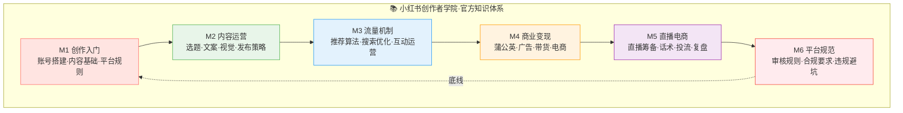
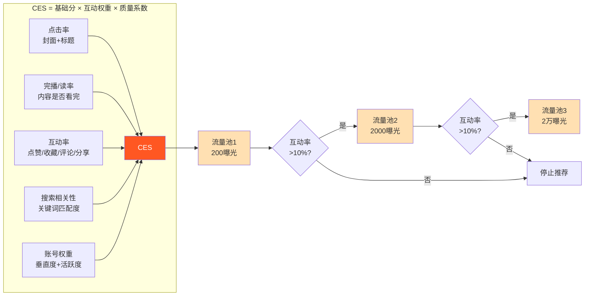
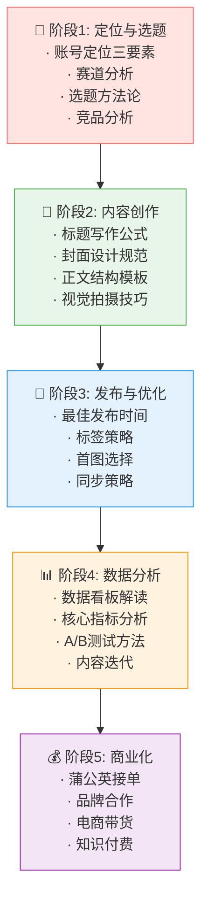
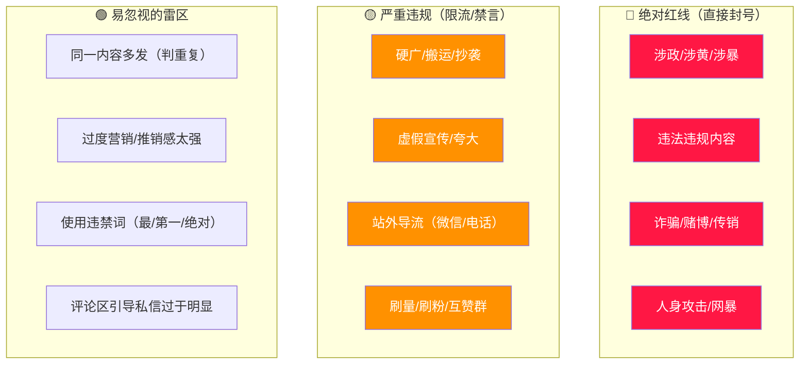
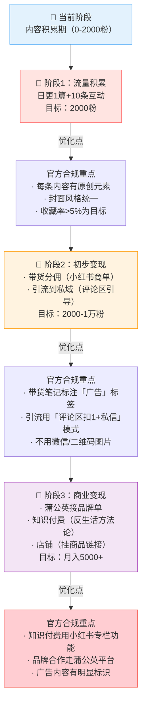
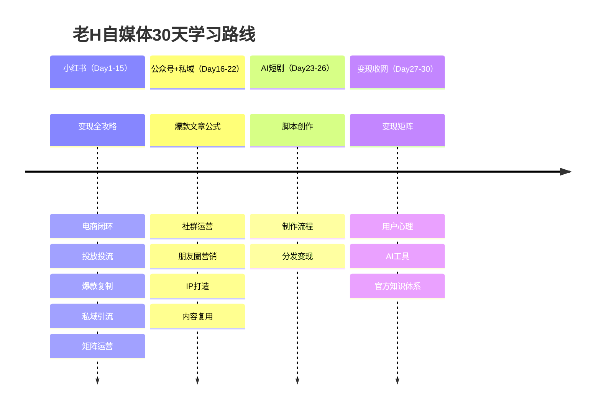

# 📕 Day30: 小红书创作者学院官方知识体系

> **核心：小红书创作者学院不是「又一个教程合集」，而是平台官方的「游戏规则说明书」——所有算法规则、流量分配逻辑、商业化工具、内容审核标准都在这里公开。反生活不需要「猜平台怎么想的」，直接看官方怎么说、怎么做。把30天学到的所有方法论拿官方体系过一遍筛子，留下真正合规、长期有效的东西。**
> 来源：小红书创作者学院(creator.xiaohongshu.com)官方课程体系、小红书帮助中心、小红书官方流量白皮书、小红书蒲公英平台规则、小红书薯条/聚光官方文档、小红书社区公约

---

## 一、一句话总结

**小红书创作者学院 = 平台的「官方操作手册」+「商业化驾照」+「流量密码公开课」。** 做自媒体最怕的不是「不会做内容」，而是「用错方法还被限流」。官方的每一条规则、每一个工具说明、每一节免费课程，都是平台用真金白银（历年流量运营经验）总结出来的最佳实践。反生活要做的事很简单：**不再「猜算法」，直接看官方文档；不再「自己试错」，直接用官方方法论做内容；不再「担心限流」，按照官方规则合法合规做商业化。**

> 💡 **老黄的关键认知**：30天学完了29个赚钱主题，但缺少最关键的一环——**平台官方自己说的运营规则**。之前学的所有方法论（爆款复制、矩阵运营、投流策略、私域引流）必须经过官方知识体系的验证才安全有效。今天就是「收网日」——用官方标准检查反生活的每一步操作。

本章与 [[Day1-小红书变现全攻略]]（变现框架验证）、[[Day13-小红书爆款复制方法论]]（官方爆款逻辑）、[[Day15-小红书矩阵号运营]]（合规运营）、[[Day11-小红书电商闭环]]（电商规范）、[[Day12-小红书投放与投流]]（官方工具）、[[Day14-私域引流转化]]（合规引流）、[[Day22-多平台变现矩阵]]（跨平台合规）、[[Day28-用户心理与行为设计]]（官方内容心理学的印证）紧密关联。

---

## 二、核心框架

### 2.1 小红书创作者学院六大模块全景



### 2.2 官方内容推荐算法「CES评分模型」

小红书的流量分配不是「随机的」，而是基于 **CES (Community Engagement Score)** 评分模型。这是官方公开过的核心算法逻辑：



**官方透露的核心要点：**
- **前1小时是黄金检验期** — 发布后1小时内的互动率决定是否进入下一级流量池
- **「收藏」权重最高** — 官方明确收藏行为代表「内容有长期价值」，比点赞权重高3-5倍
- **搜索流量占总流量30%+** — 标题和正文中的关键词直接影响搜索排名
- **同质化内容降权** — 官方算法会检测「跟爆款一模一样」的内容，直接低质降权
- **点击率 < 5% 直接停推** — 封面和标题决定生死

> 💡 **反生活用法**：每条笔记设计一个「收藏钩子」（如「建议收藏的XXX清单」），收藏率比点赞率更能拉动第二波流量。

### 2.3 小红书「好内容」的官方标准

官方在创作者学院中明确给出了「好内容」的四个标准——**真实、有用、审美、独特**：

```
┌──────────────────────────────────────────────────┐
│              小红书好内容四维标准                    │
├────────────┬─────────────┬──────────┬────────────┤
│  真实       │   有用       │  审美     │  独特      │
│ (Trust)    │ (Value)     │ (Aesthetic)│(Originality)│
├────────────┼─────────────┼──────────┼────────────┤
│ 真人出镜   │ 干货教程     │ 画面好看  │ 个人观点   │
│ 真实体验   │ 解决方案    │ 排版整洁  │ 不同视角   │
│ 不夸大     │ 可执行      │ 滤镜统一  │ 原创内容   │
│ 不标题党   │ 省时间/省钱 │ 色调舒适  │ 不抄不搬   │
└────────────┴─────────────┴──────────┴────────────┘
```

### 2.4 官方内容创作全流程

创作者学院将内容创作分为 **5个阶段**，每个阶段都有官方课程：



---

## 三、可落地方法

### 3.1 官方认证的「爆款笔记公式」

根据创作者学院课程，一篇官方认可的「优质笔记」必须满足以下公式：

**爆款笔记 = 好标题(30%) + 好封面(30%) + 好内容(30%) + 好时机(10%)**

#### 标题官方指南

| 要素 | 官方建议 | 反面教材 |
|------|---------|---------|
| 长度 | 18字以内（移动端最多显示一行） | 30字长标题被截断 |
| 数字 | 用阿拉伯数字，用户更容易注意 | 用汉字「三十天」不如「30天」 |
| 情绪词 | 勾起好奇/共鸣/焦虑 | 纯陈述句无情绪 |
| 关键词 | 包含搜索高频词 | 自造词/生僻词 |
| 承诺 | 给用户明确收益 | 模糊不清 |
| 不要 | ❌标题党、❌夸大、❌与内容不符 | 点击高但内容差→负反馈 |

**官方推荐标题模板（创作者学院课上公开的）：**
1. 「数字+结果」：30天从小白到月入过万，我做对了什么
2. 「痛点+解决方案」：做了3年自媒体还是不会起标题？这一篇够了
3. 「反常识+好奇心」：小红书官方说：越「笨」的笔记越容易火
4. 「人群+场景」：给25岁女生：不要等30岁才懂这些
5. 「对比+冲击」：同一篇笔记，换个标题流量差10倍

#### 封面官方规范

```
━━━━━━━━━━━━━━━━━━━━━━━━━━━━
  官方封面制作标准
━━━━━━━━━━━━━━━━━━━━━━━━━━━━
✅ 清晰度：1080×1440px（3:4比例，小红书的黄金比例）
✅ 文字：不超过15个字，字体清晰可读
✅ 配色：同账号保持统一色调（建立品牌感）
✅ 信息：封面就要让用户「知道这篇讲什么」
✅ 风格：封面风格一致（用户一眼认得出是反生活）
❌ 禁止：白底红字的「营销感」封面
❌ 禁止：与正文内容无关的「骗点击」封面
❌ 禁止：过于暴露/低俗/违规图片
━━━━━━━━━━━━━━━━━━━━━━━━━━━━
```

### 3.2 官方流量工具使用指南

#### 薯条（内容加热）

| 项目 | 官方说明 |
|------|---------|
| 作用 | 给自然流量好的笔记「加一把火」 |
| 最佳时机 | 发布后1小时，自然互动率≥10%后再投 |
| 投放方式 | 智能推荐（系统优化）vs 自定义（定向人群） |
| 预算建议 | 新手从100元/天开始测试 |
| 核心指标 | 关注「互动成本」而非曝光量 |
| 禁忌 | ❌不要给数据差的笔记投流 ❌不要长期依赖 |

#### 聚光（商业流量）

| 项目 | 官方说明 |
|------|---------|
| 定位 | 小红书官方竞价广告系统 |
| 适用场景 | 电商带货/品牌曝光/私域引流 |
| 起步门槛 | 企业号+营业执照，最低5000元预存 |
| 关键指标 | ROI > 3 才开始有意义 |
| 反生活建议 | 前期不用碰，等变现模型跑通后再考虑 |

#### 蒲公英（品牌合作）

| 项目 | 官方说明 |
|------|---------|
| 功能 | 品牌方找博主合作的中介平台 |
| 门槛 | 1000粉丝可入驻 |
| 接单模式 | 一口价/纯佣/坑位费+佣金 |
| 平台抽佣 | 10% |
| 反生活建议 | 5000粉后入驻，作为额外收入渠道 |

### 3.3 官方社区规范「红线清单」（反生活必存）

以下行为是小红书官方 **明确禁止** 的，一旦触碰直接限流/禁言/封号：



**反生活最需要关注的3条官方「潜规则」：**

1. **🚫 私域引流「正确姿势」**
   - ❌ 错误：笔记正文直接写「加微信xxx」「私信我领资料」
   - ✅ 正确：写「想要完整版清单的评论区扣1」→ 私信自动回复 → 引导到企业微信
   - 官方逻辑：**小红书不允许「让用户离开平台」的明显引导，但允许「在平台内完成互动」后再私信。**

2. **🚫 「反生活」账号特别注意**
   - 表情包配图类内容：官方要求**必须有「原创」元素**。纯搬运表情包长图会被判低质。
   - 解决方案：每次发布前用AI工具重绘/改图，加上反生活水印和排版设计。
   - 金句/语录类：必须标注来源（「摘自XXX」），否则判搬运。
   - 直接截屏小红书其他笔记发在自己账号：❌明确禁止。

3. **🚫 违禁词清单（反生活自查用）**
   - 违禁词：最、第一、全网、绝对、唯一、100%、永久、国家级
   - 限流词：赚钱、加微信、扫码、付款、价格、免费领取（系统检测）
   - 替代词：推荐、优选、很多人用、超高性价比、送福利、限时活动
   - 工具推荐：用「零克查词」(lingke.cn) 发布前检测文案

---

## 四、变现路径

### 4.1 官方许可的6大变现方式

小红书官方创作者学院明确认可的变现方式：

| # | 变现方式 | 门槛 | 收入预期 | 反生活适用性 |
|:-:|---------|:---:|:-------:|:-----------:|
| 1 | **蒲公英广告** | 1000粉 | 500-5000元/条 | ⭐⭐（等粉丝起来） |
| 2 | **带货分佣** | 0粉 | 月入500-5000元 | ⭐⭐⭐（可先做） |
| 3 | **店铺自营** | 0粉+开店 | 月入1000-10000元 | ⭐（先做流量） |
| 4 | **直播带货** | 1000粉 | 月入3000-30000元 | ⭐（先做内容） |
| 5 | **知识付费** | 1000粉 | 月入2000-20000元 | ⭐⭐⭐（反生活强项） |
| 6 | **引流到私域成交** | 0粉 | 看外部转化 | ⭐⭐⭐⭐（反生活核心） |

### 4.2 反生活官方合规的变现路线图（修订版）

结合官方知识体系，重新梳理反生活的变现路径：



### 4.3 官方数据看板 → 指导变现决策

创作者学院强调：**「用数据说话，别凭感觉做内容。」**

| 指标 | 含义 | 及格线 | 优秀线 | 反生活应该怎么做 |
|:----|:----|:-----:|:-----:|:----------------|
| 点击率 | 封面吸引程度 | 8% | 15%+ | <5%立即换封面重发 |
| 互动率 | 内容有价值程度 | 5% | 10%+ | <3%说明内容不够干货 |
| 收藏率 | 内容长期价值 | 3% | 8%+ | 每篇设计「收藏钩子」 |
| 涨粉率 | 账号吸引力 | 1% | 3%+ | 说明内容是不是「关注后值得看」 |
| 搜索流量 | 关键词匹配度 | 20% | 40%+ | 标题+正文要有搜索关键词 |
| 粉丝触达 | 粉丝看到比例 | 10% | 20%+ | 粉丝互动越好→推送给更多粉丝 |

### 4.4 官方创作者成长路径与激励机制

小红书的创作者成长体系（根据创作者学院公开信息）：

```
┌─────────────────────────────────────────────────────┐
│              小红书创作者成长通道                      │
├─────────────┬───────────────────┬──────────────────┤
│  等级       │  门槛条件          │  权益             │
├─────────────┼───────────────────┼──────────────────┤
│  新星       │ 注册7天内          │ 基础流量扶持      │
│  潜力       │ 100粉丝            │ 薯条体验金        │
│  创作达人   │ 500粉丝·有原创能力  │ 话题活动优先参与   │
│  优质博主   │ 2000粉·内容稳定产出 │ 品牌合作机会     │
│  头部创作者 │ 5万粉·有影响力     │ 官方1对1支持      │
│  超级博主   │ 50万粉+            │ 年度大会·深度合作  │
└─────────────┴───────────────────┴──────────────────┘
```

**官方重点推荐的活动（反生活可优先参与）：**
- **每月话题挑战** — 参与官方话题可获得额外流量扶持
- **创作者训练营** — 官方定期举办免费线上课程
- **新品试用** — 500粉以上可参与，白嫖产品+产出内容
- **线下创作者沙龙** — 一二线城市不定期举办，拓展人脉

---

## 五、行动清单

### 📋 今天就能做的3件事

#### ✅ 行动1：用官方标准检查反生活账号（30分钟）

**「反生活」账号合规体检表：**

| 检查项 | 结果 | 整改 |
|-------|:---:|:----|
| 账号是个人号还是企业号？ | | 建议不做企业号 |
| 有没有填完整个人简介？ | ☐ | 简介要写「做什么+有什么价值」 |
| 简介里有微信号/二维码/联系方式？ | ☐ 有的话立刻删 | 官方会检测 |  
| 最近3篇笔记有没有「搬运」内容？ | ☐ 有的话删掉 | 改为AI重绘 |
| 最近3篇标题有没有违禁词？ | ☐ | 用零克查词检测 |
| 最近3张封面风格统一吗？ | ☐ | 建立封面模板 |
| 有没有被限流/违规通知？ | ☐ 有的话暂停反省 | 申诉+等7天 |

#### ✅ 行动2：建立「反生活内容SOP」官方合规版（1小时）

基于创作者学院官方标准，写一份反生活的**内容发布前检查清单**：

```
━━━━━━━━━━━━━━━━━━━━━━━━━━━━━━━━
【反生活·内容发布前检测清单】
━━━━━━━━━━━━━━━━━━━━━━━━━━━━━━━━
□ 标题≤18字，无违禁词
□ 封面1080×1440，文字≤15字
□ 正文有原创内容（不是纯搬运）
□ 有「收藏钩子」（清单/攻略/模板）
□ 关键词包含搜索高频词
□ 标签用了3-5个相关标签
□ 内容无明显营销感
□ 没有站外导流词汇
□ 图片无第三方水印
□ 1小时内监测互动率（<5%考虑删改）
━━━━━━━━━━━━━━━━━━━━━━━━━━━━━━━━
```

把这个清单打印出来，贴在电脑前。**每发一条笔记之前，过一遍清单，不打勾不发。**

#### ✅ 行动3：30天总结 + 制定下阶段计划（30分钟）

这是30天计划的最后一天。做三件事：

**3.1 30天学习全景图**


**3.2 写下你的「差异化赚钱策略」**

30天下来，反生活的赚钱策略应该清晰了。填空：

```
我的核心平台：________（建议：小红书为主阵地）
我的内容赛道：________（建议：反生活内容/极简生活/情绪价值）
我的变现方式：________（建议：引流到私域卖产品/知识付费）
我的内容频率：________（建议：日更1篇+每日互动20条）
我的月入目标：________（建议：第1个月0元，第2个月1000元，第3个月3000元）
```

**3.3 开启「执行模式」**

学习够了，接下来是执行期。不再每天学新主题了，而是：
- **每天花的时间**：1小时内容生产 + 30分钟互动运营
- **每周复盘**：看数据→调方向→继续发
- **每月迭代**：优化内容方向/变现方式
- **3个月后评估**：能不能到月入5000？不行就换赛道

> 💡 **老黄的终极心法**：**学习是为了少走弯路，但不能替代走路。30天计划结束了，真正的「赚钱计划」从今天开始。把学到的每一条方法论，用到反生活的每一天内容里。3个月后回头看，你一定会感谢今天开始执行的自己。**

---

## 六、30天学习总结（特别版）

### 6.1 学到的核心武器

| 维度 | 核心武器 | 对应Day |
|:----|:--------|:------:|
| **变现认知** | 小红书6大变现模式、反生活专属变现路线图 | 1 |
| **内容生产** | 爆款复制5步法、标题公式、封面模板 | 13 |
| **流量获取** | 薯条/聚光投放策略、矩阵号运营、关键词SEO | 12, 15 |
| **用户心理** | 福格行为模型B=MAT、影响力6原则、Hook模型 | 28 |
| **AI工具** | 可灵/即梦/LiblibAI、图生视频、剪映模板 | 29 |
| **平台规则** | 创作者学院官方体系、合规红线、数据看板 | 30 |

### 6.2 反生活「一键启动」的赚钱公式

```
反生活赚钱 = 
  反生活内容（情绪价值/犀利观点/反常识金句）
  × 小红书平台（最适合图文+情绪性内容）
  × 爆款公式（好标题+好封面+收藏钩子+关键词）
  × 合规引流（评论区扣1+私信→企业微信）
  × 后端成交（产品/社群/咨询/知识付费）
  × 持续迭代（数据分析→优化→放大）
```

### 6.3 推荐继续学习的资源

**书籍**（之前学过的可以直接精读）：
- 《爆款小红书》→ 重读第3章「爆款公式」
- 《疯传》→ 重读「STEPPS原则」做内容检查
- 《文案训练手册》→ 重读「滑梯效应」

**官方渠道**（长期关注）：
- 小红书创作者学院（creator.xiaohongshu.com）— 定期更新课程
- 小红书商业动态（小红书官方公众号）— 新功能新政策早知道
- 小红书帮助中心（help.xiaohongshu.com）— 遇问题先查官方

**反生活专属**：
- 每天刷小红书时，从「创作者」视角看每一条爆款——它为什么火？
- 建立「反生活素材库」文件夹，分类存截图、金句、封面模板
- 每周找1条同赛道爆款做深度拆解（标题·封面·正文结构·互动策略）

---

> **三十天，三十篇笔记。这不是结束，是真正的开始。**
>
> 从今天起，老H不再是一个「自媒体的学习者」，而是一个「自媒体的践行者」。
>
> 每一条发出去的内容，都是在验证你学到的知识。
> 每一个涨的粉丝，都是对你方法的投票。
> 每一分赚到的钱，都是对你认知的奖励。
>
> **现在，关掉笔记，打开小红书，开始干。**
