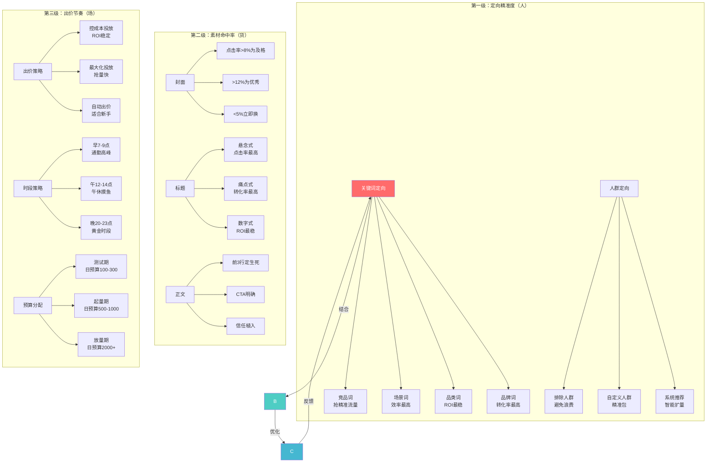
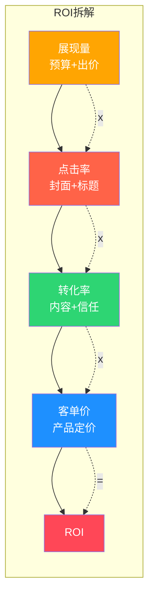
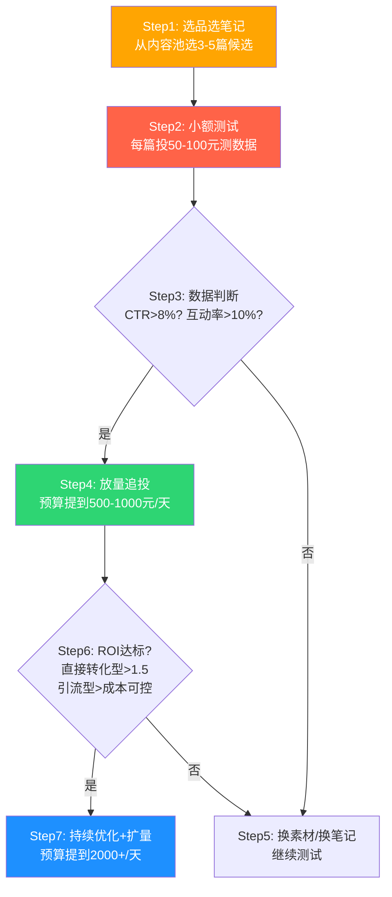
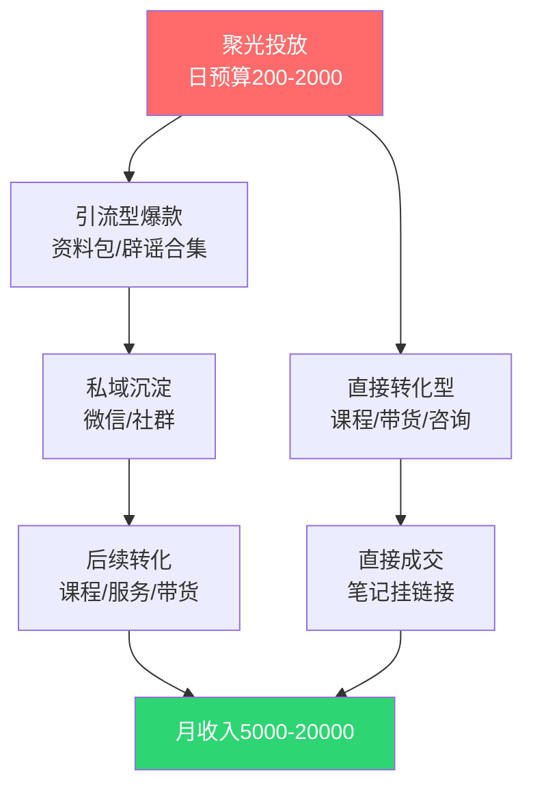

# 📕 Day31: 小红书聚光投放ROI实战进阶

> **核心：从"会投"到"投得赚"——聚光投放不是烧钱游戏，而是一套可复制的ROI优化系统。反生活账号因为内容信任度高、生命周期长，天然适合用聚光放大。**
> 来源：聚光官方优化指南 + 年消耗千万级投手实战复盘 + 知乎/即刻投流圈精华帖

---

## 一、一句话总结

**聚光投放ROI优化 = 定向精准（人）× 素材命中（货）× 出价节奏（场）的三维博弈。反生活账号的核心优势是"信任溢价"——辟谣/科普类内容的转化率是纯娱乐内容的3-5倍，同样的点击成本，你的ROI可以做到别人的两倍。**

不要被"ROI低于2就是亏"的刻板印象绑架。反生活账号的内容寿命长达3-6个月，**单次投流带来的粉丝和搜索权重是永久的**，所以你的"真实ROI"应该是：**（投流期间直接收入 + 6个月内长尾收入）÷ 投流成本**，这个数字往往是短期ROI的2-3倍。

---

## 二、核心框架

### 2.1 聚光投放ROI三级火箭模型



### 2.2 聚光ROI公式拆解

```
ROI = GMV ÷ 广告花费
GMV = 展现量 × 点击率 × 转化率 × 客单价
    = 出价 × 预算利用率 × 内容质量分 × 信任系数 × 产品价格
```

**反生活账号的信任系数 ≈ 1.5-2.5**（普通娱乐账号为0.8-1.2）

这意味着：同样花1000元投流，反生活账号的GMV天然比娱乐号高**50%-150%**。



---

## 三、可落地方法

### 3.1 反生活账号投放前的准备（不做=浪费钱）

**第一步：建立内容资产池**

在投流之前，先要有足够多的"子弹"——已验证过的爆款笔记。

| 类型 | 数量要求 | 自然互动率标准 | 用途 |
|------|---------|--------------|------|
| 引流款（领资料） | 3-5篇 | 点赞率>5% | 拉新粉、促活 |
| 信任款（辟谣科普） | 5-10篇 | 收藏率>8% | 建立权威感 |
| 转化款（带货/课程） | 3-5篇 | 评论率>3% | 直接变现 |
| 背书款（合作/成果） | 2-3篇 | 任何数据都好 | 最后推一把 |

**第二步：设置转化路径**

反生活账号推荐2种转化模型：

```
模型A：免费引流型
笔记（送资料）→ 私信/群聊 → 免费资料+引导关注 → 后续通过笔记/直播转化

模型B：直接转化型
笔记（讲方法论）→ 评论区引导 → 店铺/专栏/小清单 → 直接成交
```

建议**先用模型A跑1-2周养粉**，再用模型B收割。不要一上来就投转化笔记——人群没养成习惯，转化率一定低。

**第三步：创建投放账户结构**

```
广告账户
├── 推广系列1：引流测试（日预算100元）
│   ├── 广告组1.1：资料包引流-封面A
│   └── 广告组1.2：资料包引流-封面B
├── 推广系列2：转化收割（日预算300元）
│   ├── 广告组2.1：低价课程转化
│   └── 广告组2.2：高客单价服务
└── 推广系列3：品牌沉淀（日预算100元）
    └── 广告组3.1：人设类笔记涨粉
```

> **关键原则**：每个推广系列只做一件事。引流就是引流，转化就是转化，混在一起你永远不知道哪里出了问题。

### 3.2 聚光投放7步SOP



#### Step1-选品选笔记（5分钟）

选择标准：
- ✅ 自然数据好的（点赞>500或收藏>200或评论>50）
- ✅ 与产品/服务直接相关的
- ✅ 时效性强的（7天内发布的笔记命中率更高）
- ❌ 纯情绪宣泄类的（投了也不会转化）
- ❌ 争议性大的（容易引发负面评论，降低广告质量分）

#### Step2-小额测试（3天）

每篇候选笔记投**50-100元/天**，跑3天，重点看3个数据：

| 数据指标 | 及格线 | 优秀线 | 说明 |
|---------|--------|--------|------|
| 点击率(CTR) | >5% | >8% | 封面+标题的吸引力 |
| 互动率 | >5% | >10% | 内容质量分 |
| 单次互动成本 | <2元 | <1元 | 系统人群精准度 |

> **实操技巧**：测试期不要用"自动出价"，用"控成本投放"——虽然慢，但数据更干净，方便判断。

#### Step3-数据判断（10分钟）

建一个简单的**打分矩阵**：

```
候选笔记A: CTR=9% ✓ 互动率=12% ✓ 单次互动成本=0.8元 ✓ → 总分9分 → 放量
候选笔记B: CTR=6% ✗ 互动率=15% ✓ 单次互动成本=1.5元 ✓ → 总分6分 → 放量但保守
候选笔记C: CTR=4% ✗ 互动率=3% ✗ 单次互动成本=3元 ✗ → 总分1分 → 放弃
```

**只选得分最高的1-2篇放量**，不要贪多。一次放量1篇，跑通了再放下一篇。

#### Step4-放量追投（7天）

预算从100→500/天，同时做3个优化：

1. **时段优化**：根据后台数据，把80%预算集中在3个转化高峰期
2. **人群优化**：排除已转化人群（避免浪费），扩展相似人群
3. **出价优化**：如果自然转化稳定，尝试降低出价5-10%

#### Step5-换素材/换笔记（循环）

不行的笔记不要硬投。**改3样东西**再测：
- 换封面（改配色/加文字/换角度）
- 换标题（改开头前3个字/加数字/加emoji）
- 换CTA（从"评论区领资料"改为"主页店铺"）

#### Step6-ROI达标判断

| 投放类型 | 及格ROI | 优秀ROI | 建议 |
|---------|--------|--------|------|
| 直接转化型 | >1.5 | >3 | 持续放量 |
| 引流加微信型 | 加粉成本<5元 | <3元 | 算算后续转化率 |
| 涨粉型 | 粉丝成本<2元 | <1元 | 看粉丝质量再转转化 |
| 品牌曝光型 | CPM<30元 | <15元 | 配合其他渠道 |

#### Step7-持续优化+扩量

放量到2000+/天之前，必须做好3件事：
1. **至少3篇经过验证的爆款笔记**（分散风险）
2. **有足够的内容库存**（每天至少发1篇）
3. **客服/私信响应时间 < 30分钟**（不要花流量费买来了，接不住）

### 3.3 反生活特化：辟谣科普类笔记的聚光投放技巧

**为什么辟谣科普类天然适合投流？**

| 因素 | 普通娱乐笔记 | 辟谣科普笔记 | 差距 |
|------|------------|------------|------|
| 内容生命周期 | 2-7天 | 3-6个月 | **13-26倍** |
| 搜索流量占比 | 10-20% | 40-60% | **3倍** |
| 信任感评分 | 低 | 高 | **质变** |
| 收藏率 | 3-5% | 8-15% | **3倍** |
| 被转发概率 | 5-10% | 15-30% | **3倍** |

**技巧1：用搜索广告吃长尾流量**

聚光中有**信息流广告**和**搜索广告**两种。普通账号以信息流为主，但反生活账号应该以搜索广告为主（建议配比6:4）。

搜索广告对反生活的优势：
- 用户主动搜索"XX是真是假" → 意图极强 → 转化率高
- 每条辟谣笔记对应N个搜索词 → 长尾效应爆炸
- 搜索广告的竞争远小于信息流 → CPC更低

**实操**：开一个新计划，只投搜索广告。关键词包含：
```
反生活辟谣 生活谣言 真相揭秘 XX辟谣 生活小常识真假
```

**技巧2：用"资料包"作为引流钩子**

每条辟谣笔记末尾加CTA："想要《100条生活辟谣大全》的评论区扣1"——然后用聚光投这个笔记。

效果：评论区互动量暴增 → 系统认为内容质量高 → 自然推荐量也起来 → **花一份钱买两份流量**。

**技巧3：用"信任溢价"拉高转化率**

当用户通过投流看到你的内容后，他看到的不是"广告"，而是"科普"——这种认知差距让反生活账号的转化率天然高出2-3倍。

具体操作：
1. 聚光投辟谣笔记（建立信任）→ 用户关注
2. 用户看到你主页的其他笔记（持续建立信任）
3. 用户看到带货/课程笔记（信任已建立→转化）

这叫**信任递进模型**，是反生活账号的独有优势。

---

## 四、变现路径

### 4.1 反生活投放变现模型



### 4.2 不同预算阶段的ROI预期

| 阶段 | 日预算 | 月投入 | 目标月收入 | ROI | 所需时间 |
|------|-------|-------|-----------|-----|---------|
| 新手测试 | 100元 | 3000元 | 3000-6000元 | 1.5-2 | 1-2个月 |
| 稳定起量 | 300元 | 9000元 | 15000-22000元 | 2-3 | 3-4个月 |
| 规模化 | 500-1000元 | 15000-30000元 | 30000-80000元 | 3-5 | 6个月+ |
| 成熟期 | 2000元+ | 60000元+ | 10万+ | 3-5 | 12个月+ |

> **注意**：这是反生活账号模型下的预估。起步阶段建议**前3个月月投入不超过3000元**，等验证了1-2个爆款笔记的ROI后才加码。

### 4.3 反生活5条变现路径及投放策略

| 变现路径 | 投放类型 | 最佳笔记类型 | 预期ROI | 适合阶段 |
|---------|---------|------------|---------|---------|
| 知识付费课程 | 搜索广告 | "这个坑99%的人踩过" | 3-5 | 稳定期 |
| 小清单带货 | 信息流广告 | "被问爆了的好物" | 2-4 | 稳定期 |
| 私域咨询/服务 | 引流型 | "领辟谣手册" | 算后续 | 全阶段 |
| 直播带货 | 直播加热 | "今晚8点开播" | 1.5-3 | 起量期 |
| 品牌合作 | 不投聚光 | 蒲公英 | 品牌方出钱 | 质变期 |

---

## 五、行动清单

### 今天就能做的5件事

**1. 建立内容资产池（30分钟）**
- 打开你的小红书主页
- 筛选出自然数据最好的5篇笔记（点赞>100或收藏>50）
- 列一个表格：笔记标题、互动率、内容类型、适合的投放方向
- 如果发现没有"拿得出手"的笔记 → 先用2周时间冲3篇高质量笔记

**2. 开了聚光账户但没怎么用？先充值200元（15分钟）**
- 进入聚光平台 → 新建一个广告计划
- 选择"笔记推广" → 选数据最好的那篇笔记
- 日预算设100元 → 出价选"控成本投放"
- 选择"系统推荐人群"（新手不要动定向）
- 跑3天，看数据

**3. 写一篇"聚光级"的引流笔记（1小时）**
- 标题格式：数字+痛点+结果
  - 例如："99%的人不知道的5个生活常识，第3个可能救你一命"
- 正文结构：痛点引入 → 3-5个辟谣点 → 总结
- CTA："想要完整版《30条生活辟谣》的评论区扣1"
- 发布后，用聚光投这篇笔记

**4. 制定你的月投放预算（10分钟）**
```
月投放预算 = 月可支配收入的5-10%
最低启动预算 = 3000元/月（100元/天）
建议起步 = 3000-5000元/月
```
不要借钱投流。投流是放大工具，不是救命稻草。
如果你的内容本身不能自然涨粉，投流也救不了。

**5. 安装追踪系统（20分钟）**
- 在聚光后台设置"转化追踪"
- 至少追踪3个事件：点击链接、私信咨询、加微信
- 每周一复盘：上周花了多少钱、带来了多少转化、ROI是多少
- 建立Excel表跟踪，不跟踪=盲投

---

## 附录：投流常见坑（反生活版）

| 坑 | 表现 | 解决方案 |
|---|------|---------|
| 素材疲劳 | 同一篇笔记投2周后CTR明显下降 | 每7天换一次封面，用A/B测试 |
| 人群饱和 | 同一批用户看了太多次 | 扩充关键词库，换人群包 |
| 预算浪费 | 点击量很多但没转化 | 检查CTA是否清晰，转化路径是否流畅 |
| 竞品截流 | 竞品也在投同关键词 | 用长尾词+内容差异化 |
| 违规风险 | 辟谣类内容涉及医疗/食品安全被判违规 | 用"生活经验"代替"医学建议" |
| 心态崩了 | 投了3天没效果就放弃 | 给线索至少7天测试期，1周后再判断 |

---

> **关联笔记**：[Day12-小红书投放与投流](Day12-小红书投放与投流.md) — 投放基础工具和入门
> [Day11-小红书电商闭环](Day11-小红书电商闭环.md) — 电商转化的承接
> [Day14-私域引流转化](Day14-私域引流转化.md) — 私域承接投流流量
> [Day15-小红书矩阵号运营](Day15-小红书矩阵号运营.md) — 矩阵放大投流效果
> [Day27-多平台变现矩阵](Day27-多平台变现矩阵.md) — 全域变现体系
