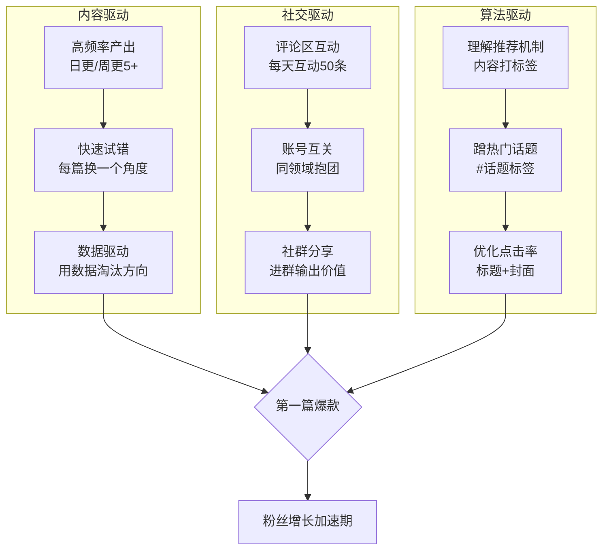
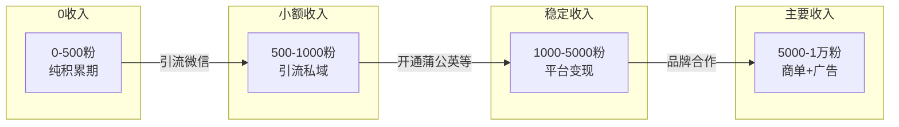

# Day31: 自媒体账号冷启动——从0到月入1万的实操路线图

> 📅 学习日期：2026-07-28
> 🔗 关联笔记：[[00-目录]] | 上一篇：[[Day30-小红书内容选题策划]] | 下一篇：Day32
> 🎯 适用场景：反生活好物养生账号从0起步、新号冷启动期破局、从零到稳定收入的完整路径
> 📚 学习来源：30天学习计划全部笔记精华整合 × 新号冷启动实战方法论 × 多个从0到万粉账号复盘 × 小红书/抖音/视频号冷启动期算法规则 × 多位年入百万自媒体主的第一桶金复盘 × 私域流量冷启动案例 × 多平台流量分发机制底层逻辑

---

## 1. 一句话总结

**自媒体账号冷启动 = 用「战略性亏损」心态度过前90天「死亡谷」——前3个月不赚钱是正常的，但每一步都必须为「第一个爆款」和「第一批铁粉」做积累。** 对老黄的「反生活」好物养生账号来说，最致命的问题不是做不起来，而是在「还没做起来」的时候就放弃了。冷启动的本质不是「快速爆红」，而是「快速试错、低成本验证、找到第一个正反馈循环」。

**核心认知转变：** 99%的新手自媒体人在冷启动期犯的最大错误是——「准备到完美再开始」。他们花两个月研究定位、设计头像、写简介、排内容日历……结果发了第一篇笔记没人看就心态崩了。而真正跑出来的人，其冷启动路径往往是反直觉的：**先发100篇垃圾稿（测试方向）→ 找到数据最好的3篇（确定方向）→ 在确定的方向上死磕100篇（建立壁垒）。** 冷启动不是「准备阶段」，而是「测试阶段」——你的第一个爆款一定不是计划出来的，而是试出来的。

---

## 2. 核心框架

### 2.1 冷启动「三阶段」模型

```mermaid
graph LR
    subgraph 第一阶段 · 破冰期<br/>Day1-30
        A1[确定细分赛道] --> A2[准备10篇基础内容]
        A2 --> A3[连续日更30天]
        A3 --> A4[找到数据最好的<br/>3-5个选题方向]
    end
    
    subgraph 第二阶段 · 爬坡期<br/>Day31-60
        B1[围绕最佳方向<br/>集中产出] --> B2[产出第一个<br/>千赞爆款]
        B2 --> B3[粉丝突破1000]
        B3 --> B4[开通变现功能]
    end
    
    subgraph 第三阶段 · 起飞期<br/>Day61-90
        C1[稳定周更5-7篇] --> C2[粉丝破5000]
        C2 --> C3[接第一条商单]
        C3 --> C4[月入3000-10000]
    end

    A4 -.-> B1
    B4 -.-> C1
```

### 2.2 冷启动期的「三驾马车」



### 2.3 冷启动阶段的「收入阶梯」



---

## 3. 可落地方法

### 3.1 冷启动前30天的「日更魔鬼计划」

#### Week 1：定位测试期（第1-7天）

**每天目标：** 发1篇笔记 + 换一个细分角度

| 天数 | 内容方向 | 角度示例 | 预期效果 |
|:----:|:---------|:---------|:--------:|
| D1 | 好物推荐 | 「30岁后必吃的3种超级食物」 | 测试养生方向 |
| D2 | 避坑指南 | 「智商税保健品清单——我花了3万买的教训」 | 测试避坑方向 |
| D3 | 方法教程 | 「早上5分钟养生法——程序员也能坚持」 | 测试教程方向 |
| D4 | 开箱测评 | 「拼多多19.9的艾灸贴 vs 99的——差在哪」 | 测试测评方向 |
| D5 | 干货清单 | 「办公室养生小物top10（全部不超过50元）」 | 测试清单方向 |
| D6 | 问答互动 | 「25-35岁最该养成的5个习惯」 | 测试互动方向 |
| D7 | 趋势分享 | 「2026下半年最火的养生方式」 | 测试趋势方向 |

**关键动作：**
- 每篇笔记的标题/封面/开头必须不同格式
- 记录每篇的：小眼睛数、赞藏比、评论数、涨粉数
- **D7晚上分析数据，找出数据最好的2-3个方向**

#### Week 2：方向聚焦期（第8-14天）

**每天目标：** 围绕Week 1选出的最佳方向，精耕细作

- 选定1-2个方向（比如「避坑指南」+「好物推荐」数据最好）
- 每天围绕这1-2个方向产出内容
- 开始建立「选题储备库」——每天花30分钟收集10个备选选题
- **关键指标：** 赞藏比 > 5% 的笔记数

**内容模板（已验证的高转化结构）：**
```
标题：痛点+数字+结果（例：「睡了8小时还是很累？这5种食物可能是元凶」）
封面：对比图/痛点图/结果图
开头：共情+引出问题（「你是不是也……」）
正文：3-5个要点，每个要点=痛点→原因→解决方案
结尾：引导互动+关注（「你中了几个？评论区告诉我」）
标签：3-5个精准标签+2-3个热门标签
```

#### Week 3-4：爆款冲刺期（第15-30天）

**每天目标：** 高质量日更 + 放大互动

- 复制Week 2验证的成功模板，用不同选题做「批量化生产」
- 每天30分钟评论区互动（同领域大V的评论区、自己的评论区）
- 每天推荐5篇同领域优质笔记（用收藏/点赞建立算法关联）
- **开始尝试12:00/18:00/21:00三个黄金时段发帖**
- **关键目标：** 月内产出1篇千赞以上笔记

### 3.2 冷启动核心工具箱

#### 工具一：选题挖掘四步法

```
① 搜索下拉词 → 在小红书搜「养生」「好物」「办公室」
   看搜框推荐（如：「养生茶推荐」「养生壶测评」）
   
② 爆款评论区 → 找同领域3-5个万粉账号
   看评论区：「求链接」「怎么做到的」「求教程」
   这些就是用户真实需求，直接用

③ 知乎问题库 → 搜「养生」「保健品」「健康」
   看高赞问题，就是天然选题（如：有哪些养生习惯你后悔没早点知道）

④ 淘宝评论 → 去好物/保健品评论区
   看看用户最在意的点、吐槽最多的问题
```

#### 工具二：标题公式库

| 公式 | 示例 | 适用场景 |
|:-----|:-----|:--------:|
| 数字+结果 | 「坚持这3个习惯30天，我的体检报告全绿了」 | 教程/方法类 |
| 对比+反转 | 「月薪3k和月薪3w的养生区别，差的不是钱」 | 认知类 |
| 避坑+警示 | 「这5种养生茶千万别乱喝（附正确搭配）」 | 科普类 |
| 悬念+好奇 | 「体检医生没告诉你的3个指标，最后一个很重要」 | 干货类 |
| 场景+共鸣 | 「996打工人的续命养生法——每天10分钟就够了」 | 人群类 |
| 清单+福利 | 「办公室抽屉必备的10样养生好物（全<100元）」 | 好物类 |

#### 工具三：冷启动期「数据看板」

| 指标 | 及格线 | 合格线 | 优秀线 |
|:-----|:------:|:------:|:------:|
| 单篇小眼睛 | >500 | >2000 | >10000 |
| 赞藏比 | >3% | >8% | >15% |
| 评论数/篇 | >5 | >20 | >50 |
| 日涨粉 | >5 | >30 | >100 |
| 30天累计涨粉 | >150 | >800 | >3000 |

> 如果发满30篇，数据仍全部低于及格线 → **说明赛道或定位有问题，需要重新评估**

### 3.3 反生活的冷启动实操方案

结合反生活好物养生账号的实际情况：

**阶段一：用「反常识」建立记忆点（第1-30天）**
- 人设核心：**「30岁程序员的叛逆养生——不花冤枉钱，不交智商税」**
- 内容差异化：不说「这个好」，说「这个被过度吹捧了」
- 每一篇都带一个「反常识」观点——比如「每天8杯水可能是错的」「养生茶喝不对等于喝毒药」「最好的保健品是晒太阳」
- **目的：不是做养生博主，是做「敢说真话」的养生博主**

**阶段二：用「实用性」建立信任（第31-60天）**
- 出干货合集：「办公室养生全套方案」「睡眠改善全攻略」
- 出可留存资料：养生清单、避坑指南、食材搭配表
- 引导用户收藏 → 提高笔记权重 → 触发二次推荐

**阶段三：用「人格化」建立粘性（第61-90天）**
- 开始出镜/语音/生活片段
- 建立固定栏目：#老黄养生日记 #反生活好物
- 开问答/投票 → 让粉丝参与内容共创

---

## 4. 变现路径

### 4.1 冷启动期变现时间线

```
第1-30天  →  0元收入（纯投入期）
第31-60天 →  0-500元（私域引流带来的咨询/带货）
第61-90天 →  500-3000元（平台变现功能开通 + 私域成交）
第91-180天 → 3000-10000元（稳定商单 + 私域复购）
第181-365天 → 1万-5万/月（多账号矩阵 + 课程/社群）
```

### 4.2 各阶段变现方式详解

#### 0-500粉阶段（第1-30天）

**变现方式：** 几乎为零，但可以为后续布局

**可做之事：**
1. **建立私域入口** → 简介/评论区引导加微信（内容中自然植入）
2. **知识付费预告** → 预告「后面会出一份xxx清单」
3. **产品试用积累** → 联系品牌方要试用装（积累产品库）

**变现预期：** 0-200元（主要来自私域零星成交）

> **核心原则：** 这个阶段不要追求变现，追求「积累筹码」。粉丝在500以内时，任何变现行为都会破坏账号权重。

#### 500-1000粉阶段（第31-60天）

**变现方式：** 私域成交为主

1. **好物推荐（私域）** → 在微信推自己用过的好物，佣金10-30%
2. **答疑问诊** → 1对1养生咨询/方案定制（99-299元/次）
3. **资料包变现** → 整理养生清单/食谱等PDF，9.9-19.9元/份

**变现预期：** 200-1000元/月

#### 1000-5000粉阶段（第61-90天）

**变现方式：** 平台+私域双轮驱动

1. **小红书蒲公英商单** → 1000粉可开通，200-500元/单图文，500-2000元/单视频
2. **好物带货（平台内）** → 开通好物推荐功能，挂商品链接，佣金5-20%
3. **私域持续运营** → 社群/咨询/资料包

**变现预期：** 1000-5000元/月

#### 5000粉以上阶段（第91-180天）

**变现方式：** 多元化收入

1. **稳定商单** → 500-5000元/条（品牌直投）
2. **社群变现** → 养生社群（99-299元/月/年）
3. **课程变现** → 录播课（99-499元）
4. **矩阵号扩展** → 复制成功模式到第二个号

**变现预期：** 5000-50000元/月

### 4.3 反生活号短期变现策略

**首选路径：好物带货（快速起步）**

```
核心逻辑：养生赛道天然适合带货
- 用户画像：25-35岁女性，有养生意识
- 决策门槛：养生好物决策成本低（几十到几百）
- 内容形式：图文/视频都能带

推荐好物品类（按转化率排序）：
1. 养生茶/花茶（客单价30-80，佣金20-30%）
2. 按摩/理疗小工具（客单价50-200，佣金10-20%）
3. 保健品/营养品（客单价100-500，佣金5-15%）
4. 养生书籍/课程（客单价20-100，佣金30-50%）
5. 助眠/香薰产品（客单价50-150，佣金15-25%）
```

**备选路径：私域成交（高利润）**

```
- 适合：粉丝量不大但信任度高的阶段
- 模式：引流到微信 → 朋友圈种草 → 1对1成交
- 利润率：50-80%（比平台带货高3-5倍）
- 关键动作：每天发3-5条朋友圈（1条产品种草+1条干货+1条生活片段）
```

---

## 5. 行动清单

### ✅ 今日就能做的3件事

**☐ 1. 做定位诊断——回答三个问题**
```
① 用一句话说清楚你的账号是做什么的？
  → 例：「我是反生活老黄，一个30岁程序员，分享不交智商税的办公室养生方案」
② 用户为什么要关注你而不是别人？
  → 例：「因为我敢说真话——不吹产品不卖焦虑」
③ 你能持续产出什么内容？
  → 例：「养生好物测评、避坑科普、打工人实用技巧」
```

**☐ 2. 准备10篇「冷启动弹药库」**
```
用上面「选题挖掘四步法」找到10个选题
每个选题写出：标题 + 核心观点 + 开头前3句
这10篇就是你未来10天的内容储备

示例弹药（反生活可用）：
1.「30岁程序员的体检报告——这3项指标亮了」
2.「办公室养生の5个极简习惯（一张桌子就够了）」
3.「网上爆火的养生好物，我实测了10个，只有这2个值得买」
4.「每天2点睡的程序员，怎么做到脸色比同事好」
5.「养生茶选购避坑指南——看配料表这3个字就够了」
```

**☐ 3. 建立「冷启动数据看板」**
```
创建一张表格（备忘录/Excel/飞书文档），每天记录：
📊 今日数据
- 新增粉丝：___
- 总粉丝：___
- 今日发布：___篇
- 最佳单篇小眼睛：___
- 最佳单篇赞藏：___

📝 本周累计
- 总发布数：___
- 千赞以上篇数：___
- 涨粉：___

🎯 当前阶段目标
- [ ] 发满30篇内容
- [ ] 找到最佳选题方向
- [ ] 月涨粉500+
- [ ] 获得第一篇千赞笔记

把这个表格放在桌面，每天打开就更新——数据不会骗人，数据会告诉你方向对不对。
```

---

## 附录：冷启动「避坑清单」

### ❌ 千万不要做的10件事

1. **❌ 准备到完美再开始** → 先发再说，完美是改出来的不是想出来的
2. **❌ 三天打鱼两天晒网** → 冷启动期断更=前功尽弃，日更是最低要求
3. **❌ 一个方向死磕到底** → 数据不好就换方向，不要和算法较劲
4. **❌ 关注涨粉更关注内容** → 把每篇内容做好，涨粉是水到渠成的事
5. **❌ 所有平台同时做** → 先在一个平台做起来，再做多平台分发
6. **❌ 一开始就想变现** → 500粉以前别想变现的事，想也是白想
7. **❌ 抄袭爆款不创新** → 模仿结构，不抄袭内容
8. **❌ 忽略数据和复盘** → 每天5分钟看数据，周末30分钟做复盘
9. **❌ 追热点追到精疲力尽** → 热点可以蹭，不要为了蹭热点放弃主线
10. **❌ 买了工具课再开始** → 先徒手做到1000粉再考虑付费工具

### ✅ 一定要做的10件事

1. **✅ 先发第一篇再优化定位** → 第一次发布就是最好的定位测试
2. **✅ 前30天保持日更** → 90%的竞争对手倒在日更这条路上
3. **✅ 记录每一篇的数据** → 冷启动的本质是数据驱动的试错
4. **✅ 找到3个同领域对标账号** → 模仿起号阶段，创新是在站稳之后
5. **✅ 每天互动50条** → 冷启动期的免费流量来源
6. **✅ 建立选题储备库** → 每天存10个选题，保持两周的余量
7. **✅ 每个方向发满5篇再决定去留** → 1篇的数据不足以判断方向
8. **✅ 关注赞藏比而非单篇小眼睛** → 赞藏比高说明内容质量好，迟早会被推荐
9. **✅ 1000粉之前不考虑变现** → 坚持到1000粉，很多机会自动出现
10. **✅ 先徒手做，再买工具** → 做到1000粉后再考虑千瓜/新红/蝉小红

---

> ### 📌 冷启动金句
> - **「前100篇都是炮灰，第101篇可能是爆款——但前提是你发完了前100篇。」**
> - **「自媒体不是短跑，是马拉松——但前3个月决定了你能不能跑完马拉松。」**
> - **「冷启动期最大的敌人不是算法，是你自己的怀疑和自我否定。」**
> - **「今天的数据比昨天的好一点就够了——不追求一夜爆红，只追求日拱一卒。」**
> - **「反生活最大的优势不是内容做得多好，而是『程序员做养生』这个反差本身就自带流量。」**

---

> 🔗 **双向链接**
> - [[Day01-小红书电商闭环]] — 冷启动后的第一个变现通道
> - [[Day05-小红书矩阵号运营]] — 冷启动成功后扩展矩阵
> - [[Day09-个人IP打造]] — 冷启动期的人设建立
> - [[Day13-多平台内容复用]] — 冷启动成功后多平台分发
> - [[Day28-自媒体内容工业化生产]] — 冷启动期的批量化生产方法
> - [[Day30-小红书内容选题策划]] — 冷启动期的选题方法论
