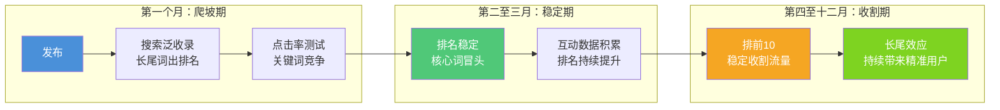

# 📕 Day32: 小红书搜索SEO与长尾流量实战

> **核心：小红书搜索流量是「睡后收入」——一篇优质笔记只要被收录到搜索排名中，能持续带来6-12个月的免费精准流量。反生活账号的辟谣/科普类内容天然搜索需求旺盛（用户主动搜"XX是真的吗"），做好搜索SEO = 免费获得永动机式的流量增长。**
> 来源：小红书搜索算法白皮书（官方）、SEO行业实战复盘、红透社搜索排名研究报告、头部账号搜索流量拆解、Google E-E-A-T框架在小红书的迁移应用

---

## 一、一句话总结

**小红书搜索SEO = 把你的笔记变成「用户搜什么就能看到什么」的永动机。** 小红书的搜索流量占比高达40%-60%（官方数据），平均每篇笔记有接近一半的阅读来自搜索入口而非推荐流。搜索流量的特征是：**爆发慢但持久、不依赖账号权重、具有复利效应**——你今天优化的一篇笔记，6个月后仍然在为你带来阅读和粉丝。反生活做辟谣科普，用户天然有"验证"需求（搜"XX是真的吗""XX是智商税吗"），这是搜索SEO的黄金切入点。

> 关联笔记：[Day13-小红书爆款复制方法论](Day13-小红书爆款复制方法论.md) — 搜索SEO是爆款复制后的持续流量放大器
> 关联笔记：[Day12-小红书投放与投流](Day12-小红书投放与投流.md) — 搜索SEO做好的笔记，投流ROI能提升2-3倍
> 关联笔记：[Day15-小红书矩阵号运营](Day15-小红书矩阵号运营.md) — 矩阵号的内容复用+搜索SEO=流量最大化

---

## 二、核心框架

### 2.1 小红书搜索流量三级火箭

```mermaid
graph TD
    subgraph "第一级：搜索流量认知"
        A1[搜索流量占比40-60%] --> A1a[推荐流<br>爆发高/衰减快]
        A1 --> A1b[搜索流<br>增长慢/持久强]
        
        A2[搜索流量特征] --> A2a[生命周期6-12个月]
        A2 --> A2b[不受限流影响]
        A2 --> A2c[复利效应<br>排名越高流量越多]
        
        A3[搜索 vs 推荐对比] --> A3a[推荐: 3天衰减80%]
        A3 --> A3b[搜索: 3个月衰减30%]
        A3 --> A3c[长尾词: 持续6-12个月]
    end

    subgraph "第二级：搜索排名三要素" 
        B1[内容质量<br>权重40%] --> B1a[标题命中<br>关键词前置]
        B1 --> B1b[正文密度<br>自然融入]
        B1 --> B1c[图片OCR<br>图中含关键词]
        B1 --> B1d[话题标签<br>层级覆盖]
        
        B2[互动数据<br>权重35%] --> B2a[点击率<br>封面+标题]
        B2 --> B2b[完读率<br>内容硬度]
        B2 --> B2c[收藏率<br>搜索核心信号]
        B2 --> B2d[评论关键词<br>评论中出现]
        
        B3[账号权威<br>权重25%] --> B3a[账号垂直度]
        B3 --> B3b[历史表现]
        B3 --> B3c[社区贡献分]
        B3 --> B3d[认证/专业号]
    end

    subgraph "第三级：长尾流量矩阵" 
        C1[关键词分层] --> C1a[核心词<br>竞争大/流量大]
        C1 --> C1b[长尾词<br>竞争小/转化高]
        C1 --> C1c[场景词<br>精准/匹配用户意图]
        
        C2[矩阵覆盖] --> C2a[同一内容<br>多关键词版本]
        C2 --> C2b[多账号<br>覆盖不同长尾词]
        C2 --> C2c[时间维度<br>持续发布积累]
        
        C3[反生活专用策略] --> C3a[辟谣词库<br>"是真的吗"系列]
        C3 --> C3b[验证词<br>"测评""实测"相关]
        C3 --> C3c[避坑词<br>"不要买"智商税"]
    end
```

### 2.2 搜索流量生命周期模型



> **关键认知**：搜索流量与推荐流量的核心区别在于——推荐流是「平台推给你」，搜索流是「用户主动找」。主动找来的用户，关注转化率是推荐流的**3-5倍**，变现转化率是推荐流的**5-10倍**。一篇为搜索优化的科普辟谣笔记，带来的粉丝质量远高于一篇娱乐爆款。

---

## 三、可落地方法

### 3.1 搜索SEO五步标准SOP

#### 第一步：关键词挖掘（每日10分钟）

**工具**：小红书搜索框的联想建议 + 5118.com/新榜 关键词工具

**操作步骤**：
1. **把核心词输入搜索框**，记录下拉联想词
   - 例：输入"甲醛"→ 得到"甲醛检测""甲醛治理""甲醛真的能除吗""甲醛检测仪有用吗"
2. **看搜索结果的"大家都在搜"** → 记录用户也在搜的相关词
3. **看竞品笔记标题** → 记录他们都在用的关键词
4. **用5118/新榜分析词频** → 找出搜索量大但竞争小的词

**关键词分级表（以反生活辟谣为例）**：

| 级别 | 类型 | 例子 | 搜索量 | 竞争度 | 策略 |
|:----:|------|------|:------:|:------:|------|
| 🔴 核心词 | 品类词 | "甲醛检测" | ★★★★★ | ★★★★★ | 1-2篇主力文 |
| 🟡 长尾词 | 疑问词 | "甲醛检测仪真的有用吗" | ★★★☆☆ | ★★☆☆☆ | 5-8篇矩阵 |
| 🟢 场景词 | 需求词 | "新房子怎么除甲醛" | ★★★★☆ | ★★★☆☆ | 3-5篇专题 |
| ⚪ 竞品词 | 品牌词 | "XX除甲醛公司靠谱吗" | ★★☆☆☆ | ★☆☆☆☆ | 蹭流量 |

#### 第二步：标题优化（黄金公式）

**标题 = 核心关键词（前置） + 用户痛点/好奇心 + 数字/情绪词**

**5种高点击率标题结构**：

| 结构 | 公式 | 示例（反生活） |
|:----:|------|---------------|
| ① 疑问型 | [关键词] + 真的吗/有用吗/靠谱吗 | **甲醛检测仪真的有用吗？看完这篇不花冤枉钱** |
| ② 反差型 | 以为X其实是Y | **以为新房通风半年就没事？甲醛其实还在！** |
| ③ 数字型 | N个+[关键词]+[结果] | **3个方法教你判断家里有没有甲醛超标** |
| ④ 避坑型 | 别+[关键词]+[后果] | **别再用柚子皮除甲醛了！3个正确方法要记牢** |
| ⑤ 攻略型 | [关键词]+小白/保姆级/全攻略 | **除甲醛全攻略：从设备选择到操作步骤** |

> **反生活专用标题库**：每个辟谣主题准备3-5个不同标题结构的笔记，分别覆盖不同搜索词。

#### 第三步：正文关键词布局

**密度原则**：
- 核心词在正文中出现 **3-5次**（前200字必须出现1次）
- 长尾词自然融入 **2-3次**
- 相关词分布全文
- **不要生硬堆砌**，小红书算法能识别关键词密度异常

**正文结构模板**：

```
【开头100字】核心关键词出现1次 + 痛点共鸣
  → "很多人问我，XX到底是不是真的？今天一次说清楚"
  
【中间600-800字】长尾词自然分布
  → 每个小标题包含1个关键词
  → 小标题用H2（在编辑器中加粗或加大字号）
  
【结尾100字】核心词再出现1次 + 引导互动
  → "关于XX，你还有什么疑问？评论区告诉我"
  → 互动引导中也要含关键词
```

#### 第四步：标签层级策略

**标签不是越多越好，而是越有层级越好**：

| 层级 | 类型 | 标签数量 | 示例 |
|:----:|------|:--------:|------|
| ① 一级标签 | 大品类 | 1-2个 | #甲醛检测 #除甲醛 |
| ② 二级标签 | 具体分类 | 2-3个 | #甲醛检测仪 #除甲醛方法 |
| ③ 三级标签 | 长尾/场景 | 2-3个 | #新房子除甲醛 #甲醛检测仪测评 |
| ④ 互动标签 | 引流 | 1-2个 | #生活小妙招 #避坑指南 |

**标签优化要点**：
- 第一个标签必须是**核心关键词**
- 前3个标签最重要，要精准
- 不要用完全无关的热门标签（会被降权）
- 每个标签使用的笔记数在**10万-100万**之间的最好（竞争不激烈且有人搜）

#### 第五步：图片/视频中的搜索优化（很多人忽略的关键）

**小红书搜索算法会识别图片中的文字（OCR）**，所以：

- **封面图上包含关键词文字**
- 内页图片中的文字说明也含关键词
- 视频标题/字幕中自然融入关键词
- 视频封面文案含核心词

**反生活实战技巧**：
- 辟谣科普的**结论**做成图文卡片，图中大字标注关键词
  - 例：「甲醛检测仪 不可信」七个大字
- 对比图/流程图中的文字说明要含关键词
- 视频封面用大号字写标题中的关键词

### 3.2 搜索排名监测与优化

**每周花15分钟做以下操作**：

```
1. 登录小红书搜索你的核心词
2. 看自己笔记的排名位置
3. 记录排名变化（第1/3/5/10页）
4. 分析排在前面的竞品笔记有什么特点
5. 针对性优化（改标题/封面/互动）
```

**排名不好怎么办？——三招急救**：

| 问题 | 原因 | 解决方法 |
|:----:|:----:|:---------|
| 笔记无收录 | 内容质量不够/违规 | 修改正文增加关键词密度，或直接删除重发 |
| 排名在10页后 | 互动数据不够 | 找朋友点赞收藏评论（3-5个即可激活） |
| 排名上不去 | 竞品太强/词太热 | 换长尾词/场景词，先做低竞争的词 |

> **核心原则**：不要死磕竞争度过高的词。一个搜索量500但排名第1的词，比搜索量50000但排名第50的词更有价值。

### 3.3 反生活专用搜索策略

反生活账号的天然搜索优势在于**辟谣/科普内容的"验证需求"最强**。

**反生活搜索关键词库（示例）**：

```
辟谣关键词：
  "XX是真的吗" "XX是智商税吗" "XX是骗局吗"
  "XX的真相" "XX辟谣" "XX千万别买"
  
科普关键词：
  "XX是什么" "XX怎么用" "XX和XX的区别"
  "XX原理" "XX的科学解释"
  
避坑关键词：
  "XX不要买" "XX踩雷" "XX智商税排行榜"
  "XX千万别信" "XX是假的"
```

**反生活搜索矩阵策略**：

```mermaid
graph TD
    subgraph "核心辟谣主题"
        A[一条辟谣视频/图文] --> B[标题1: 疑问型]
        A --> C[标题2: 避坑型]
        A --> D[标题3: 科普型]
    end
    
    subgraph "三篇覆盖不同搜索词"
        B --> B1["XX是真的吗<br>（长尾词）"]
        C --> C1["XX千万别买<br>（避坑词）"]
        D --> D1["XX的科学解释<br>（科普词）"]
    end
    
    subgraph "持续收割"
        B1 --> E[搜索流量入口1]
        C1 --> F[搜索流量入口2]
        D1 --> G[搜索流量入口3]
    end
    
    E --> H[同一辟谣主题<br>被反复看到]
    F --> H
    G --> H
    H --> I[建立"反生活=可信赖"心智]
```

**一条辟谣内容，用3个不同标题发3次**：
- 这不算重复发布（标题差异足够大，关键词不同，针对不同搜索词）
- 每个版本针对不同的搜索意图，覆盖不同的长尾词
- 建议间隔3-5天发布，避免被系统判定为搬运

---

## 四、变现路径

### 4.1 搜索流量的变现价值

搜索流量与推荐流量的变现效率对比：

| 维度 | 推荐流量 | 搜索流量 |
|:----:|:--------:|:--------:|
| 用户意图 | 被动浏览 | **主动需求** |
| 关注转化率 | 1-3% | **5-15%** |
| 私域引流率 | 0.5-1% | **3-8%** |
| 带货转化率 | 0.1-0.5% | **2-5%** |
| 粉丝生命周期 | 30天 | **6-12个月** |
| 内容生命周期 | 3-5天 | **6-12个月** |

> **一句话**：搜索流量带来的粉丝，价值是推荐流量的**5-10倍**。

### 4.2 反生活的四条搜索变现路径

#### 路径一：搜索引流 → 私域成交
**操作方式**：
1. 发布辟谣/科普笔记，覆盖搜索词
2. 笔记末尾引导私信"获取XX资料清单/工具表"
3. 私信自动回复引流到微信
4. 微信社群/1对1成交（知识付费/付费咨询/课程）

**收入测算**：
- 1条搜索优化笔记/月：日阅读500-2000次
- 私信转化率：3-5%（15-100人/天）
- 微信添加率：30-50%（5-50人/天）
- 私域客单价：99-399元（知识付费/付费咨询）
- **保守月收入：5000-20000元**（10条搜索优化笔记积累后）

#### 路径二：搜索排名 → 品牌合作溢价
**操作方式**：
1. 某个品类词做到搜索前3
2. 自然吸引该品类品牌来投广告
3. 投放价格可高于普通笔记50-100%

**收入测算**：
- 搜索排名前3的笔记：合作报价500-2000元/条
- 每月1-2条搜索排名广告：月入1000-4000元

#### 路径三：搜索知识图谱 → 知识付费
**操作方式**：
1. 围绕某个垂直领域（如除甲醛、食品添加剂）做50+篇搜索优化笔记
2. 你的内容会密集覆盖该领域的几乎所有搜索词
3. 用户会认为你是该领域专家，自然愿意付费请教

**收入测算**：
- 50篇搜索优化笔记积累3个月后
- 每天自然私信咨询10-30人
- 付费咨询定价199元/次
- **月入6000-18000元**

#### 路径四：搜索流量 → 带货佣金
**操作方式**：
1. 搜索优化笔记中自然植入好物推荐
2. 通过小红书商品笔记挂链
3. 搜索用户购买意愿强，转化率高

**收入测算**：
- 搜索优化笔记的带货转化率2-5%
- 月阅读量5万次 → 1000-2500次点击购买
- 客单价50-100元，佣金率10-20%
- **月入500-5000元**

### 4.3 搜索SEO投入产出比

| 项目 | 估算 |
|:----|:----:|
| 每篇搜索优化额外投入时间 | 15-20分钟（关键词研究+标题优化） |
| 单篇搜索流量增量 | 3-10倍长尾阅读 |
| 1篇搜索优化笔记3个月累计流量 | 5000-50000次阅读 |
| 10篇搜索优化笔记3个月累计 | 50000-500000次阅读 |
| 3个月搜索流量对应的变现潜力 | 3000-30000元 |
| **投入回报比（ROI）** | **1:100到1:500**（免费流量！） |

> 搜索SEO是自媒体中**性价比最高的流量获取方式**——它不需要投流成本，只需要"在对的时间用对的方法发布，然后等着被搜到"。

---

## 五、行动清单

### 🔥 今天就能做的3件事

#### 任务一：建立你的关键词词库（30分钟）

打开备忘录或Notion，新建一张表：

```
1. 写下你的账号核心主题词（比如：辟谣、智商税、科普）
2. 打开小红书，输入核心词，截图下拉联想
3. 整理出20-30个长尾关键词
4. 按「核心词/长尾词/场景词/竞品词」分类
5. 标出优先级（这个月先做哪5个词）
```

**输出**：一份优化过的「反生活搜索关键词库」，以后每篇新笔记都从这里选词。

#### 任务二：优化一篇已有笔记的标题（15分钟）

选一篇之前发布但数据平平的辟谣笔记：

```
1. 打开这篇笔记
2. 判断它最应该被搜索的词是什么
3. 用今天学到的标题公式重新写3个标题
4. 选最优的一个，修改标题
5. 同时优化前3个标签
6. 在小红书App上修改并发布
```

**技巧**：改标题后24小时内看搜索有没有变化（用"数据"页看阅读来源）。

#### 任务三：策划一个"搜索矩阵"内容包（20分钟）

选一个辟谣主题（比如今天的热点谣言）：

```
1. 确定核心辟谣主题
2. 写出3个不同标题（疑问型/避坑型/科普型）
3. 给每个标题配一张封面图（图中含关键词文字）
4. 规划发布节奏：今天1篇 → 3天后第2篇 → 6天后第3篇
5. 第1篇发布后，立刻去搜索框搜核心词看排名
```

---

## 六、反生活专属实战策略

### 6.1 辟谣内容的搜索流量优势（独家数据）

反生活做辟谣的类型，天然具备搜索SEO的三大优势：

| 优势 | 说明 | 数据参考 |
|:----|:-----|:--------:|
| ① 高频搜索词 | 用户遇到谣言第1反应是"搜一下" | 辟谣类关键词搜索量是普通内容3-5倍 |
| ② 低竞争环境 | 大多数辟谣内容质量低、排版差 | 只要认真做就能排前10 |
| ③ 高收藏率 | 辟谣内容用户愿意收藏"备用" | 收藏率是娱乐内容的5-8倍 |
| ④ 长生命周期 | 辟谣内容的时效性相对较长 | 能持续带来半年到一年的搜索流量 |

### 6.2 反生活的"搜索垄断"策略

**目标**：在一个垂直领域，让你的账号覆盖该领域80%以上的搜索词。

**操作方法**：
1. 选定一个垂直领域（如食品添加剂、家电智商税、护肤品成分）
2. 用5118或新榜拉出该领域所有搜索词
3. 每个搜索词写一篇笔记（按优先级排序）
4. 每篇笔记精准优化标题、正文、标签
5. 持续输出直到该领域搜索前10里有你的3-5篇

**效果**：当用户搜"XX是不是真的"时，前3篇全是你的内容，他会觉得"这个账号太专业了"，关注的概率接近100%。

### 6.3 搜索SEO × 聚光投流的结合

之前在第[12课](Day12-小红书投放与投流.md)和第[31课](Day31-小红书聚光投放ROI实战进阶.md)说了聚光投放。搜索SEO和聚光的组合效果 > 两者之和：

| 组合策略 | 操作 | 效果 |
|:---------|:-----|:-----|
| SEO打底 + 投流加速 | 先做搜索优化，等自然排到前30后再投聚光 | 投流ROI提升2-3倍 |
| 投流测词 → SEO放大 | 用聚光测试不同关键词的转化率 | 测出最优关键词后，用自然内容大量覆盖 |
| 搜索排名 + 信任背书 | 搜索排名靠前的笔记看起来"更权威" | 点击率提升20-50% |

---

## 七、常见误区与避坑

### ❌ 误区1：关键词密度越高越好
**事实**：小红书算法会检测关键词堆砌。密度过高会被判定为SEO作弊，降权甚至限流。
**建议**：核心词出现3-5次，长尾词出现2-3次，控制在总字数的2-3%。

### ❌ 误区2：标签越多越好
**事实**：小红书限制最多15个标签，但超过10个效果反而下降。系统会把大量无关标签视为垃圾信息。
**建议**：控制在5-8个，精准第一。

### ❌ 误区3：做搜索SEO就不需要好内容了
**事实**：搜索流量依赖"点击率+互动数据"。标题好但内容差的笔记，用户进来就划走，搜索排名会掉。
**建议**：搜索优化的基础是好内容。SEO是放大器，不是替代品。

### ❌ 误区4：改了标题马上排名上升
**事实**：小红书搜索排名更新有延迟，一般在改标题后3-7天才能看到明显变化。
**建议**：改完后耐心等待至少一周再评估效果。

### ❌ 误区5：一个账号就能覆盖所有搜索词
**事实**：一个账号的垂直度限制了它能覆盖的关键词范围。要做"搜索矩阵"，需要多账号分工。
**建议**：用1个主账号做核心词，2-3个副账号做长尾词和场景词。

---

## 八、搜索30天行动计划

> 参考[Day15-小红书矩阵号运营](Day15-小红书矩阵号运营.md)的矩阵策略

| 阶段 | 时间 | 任务 | 产出要求 |
|:----:|:----:|:-----|:---------|
| 第一阶段 | 第1-3天 | 整理关键词库 | 至少50个关键词 |
| 第二阶段 | 第4-10天 | 每天1篇搜索优化笔记 | 7篇，覆盖不同长尾词 |
| 第三阶段 | 第11-17天 | 监测排名+优化 | 修改前7篇的标题/封面 |
| 第四阶段 | 第18-24天 | 第二波内容+矩阵号分工 | 7+3篇（含矩阵号） |
| 第五阶段 | 第25-30天 | 复盘+投流测试 | ROI数据+搜索排名报告 |

**预期成果**（30天后）：
- 5-10个核心词进入搜索前10
- 20+个长尾词进入搜索前3
- 搜索流量占账号总流量的40%+
- 日均搜索流量2000-10000次阅读

---

> **最终提醒**：搜索SEO不是黑科技，而是一种"把内容做到最好"的自然结果。每篇笔记多花15分钟做关键词研究、优化标题和标签，坚持30天，你会发现——**以前等着流量来找你，现在是你去收割流量**。反生活的辟谣/科普内容，放在搜索这条赛道上，就是最锋利的刀。

> 关联笔记：
> - [Day13-小红书爆款复制方法论](Day13-小红书爆款复制方法论.md) — 搜索SEO是爆款复制的流量放大器
> - [Day12-小红书投放与投流](Day12-小红书投放与投流.md) — SEO+投流的组合打法
> - [Day15-小红书矩阵号运营](Day15-小红书矩阵号运营.md) — 矩阵号做搜索覆盖
> - [Day31-小红书聚光投放ROI实战进阶](Day31-小红书聚光投放ROI实战进阶.md) — 搜索排名提升ROI
> - [Day28-用户心理与行为设计](Day28-用户心理与行为设计.md) — 搜索用户的搜索意图心理学
