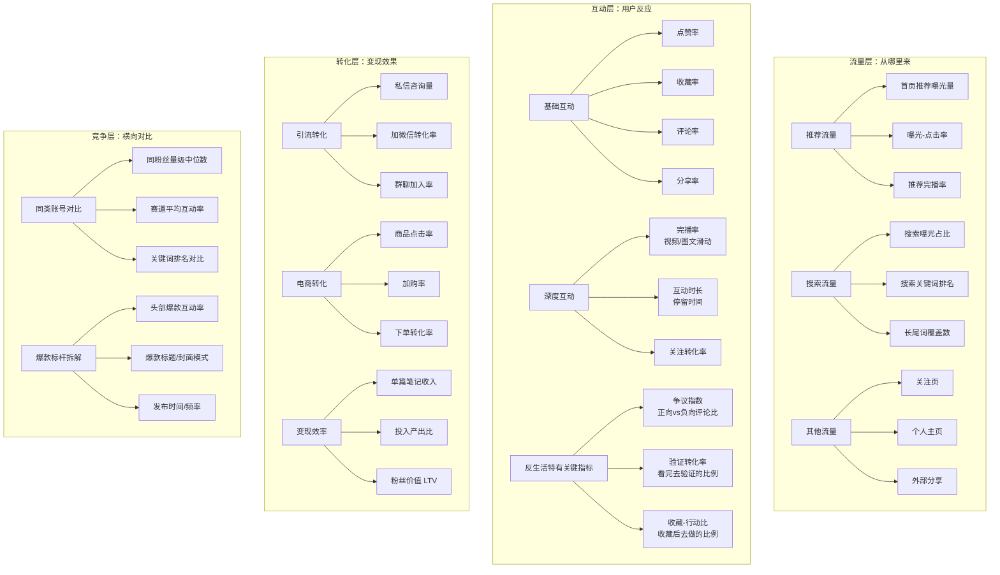
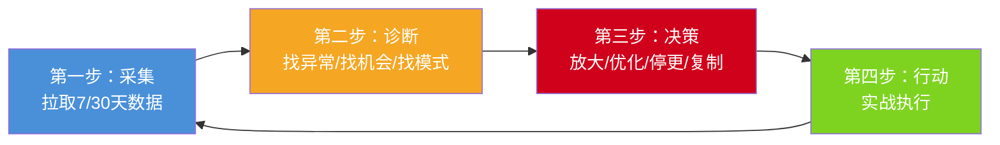
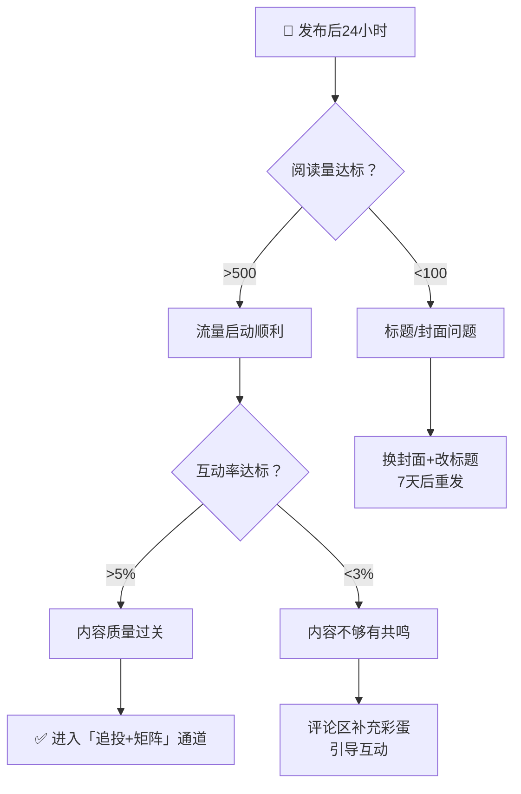
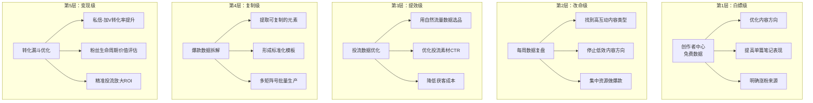

# 📕 Day33: 小红书数据分析与内容复盘体系

> **核心：不做分析的内容运营是「盲打」——数据复盘是把好内容放大、把差内容停损的系统化能力。反生活账号要把数据思维嵌入到每篇笔记的「发布→观察→优化→复制」全流程中，用数据驱动而不是凭感觉做内容。**
> 来源：小红书创作者学院数据分析课程、红书数据/千瓜/灰豚数据工具实操、头部账号数据分析方法论、Google Analytics在小红书的迁移应用、电商Page Analytics实战

---

## 一、一句话总结

**小红书数据分析 = 给你的每篇笔记装一个「雷达探测仪」，实时告诉你哪些内容值得大力投入、哪些应该及时止损、哪些隐藏着爆款基因。**

大多数自媒体人犯的错误是：凭感觉选题→凭感觉做内容→凭感觉判断好与差。而真正的高手会：**用数据验证选题→用数据指导优化→用数据决定放大策略**。反生活账号因为做的是辟谣科普类内容，数据维度比纯娱乐号更丰富——除了点赞收藏，还有「互动深度」「争议指数」「搜索转化率」等特有指标。

> 关联笔记：[Day13-小红书爆款复制方法论](Day13-小红书爆款复制方法论.md) — 数据复盘是爆款复制的核心引擎
> 关联笔记：[Day32-小红书搜索SEO与长尾流量实战](Day32-小红书搜索SEO与长尾流量实战.md) — 搜索流量分析是数据复盘的子模块
> 关联笔记：[Day15-小红书矩阵号运营](Day15-小红书矩阵号运营.md) — 多账号数据需要统一复盘框架

---

## 二、核心框架

### 2.1 小红书数据复盘五大维度



### 2.2 数据复盘四步循环



### 2.3 关键指标体系全景

| 指标层级 | 指标名称 | 计算公式 | 合格线 | 优秀线 | 反生活特殊解读 |
|---------|---------|---------|:-----:|:-----:|--------------|
| **流量** | 曝光-点击率(CTR) | 点击量/曝光量 | 8% | 15%+ | 辟谣类标题自带高CTR（"被骗了XX年"） |
| **流量** | 搜索曝光占比 | 搜索来源曝光/总曝光 | 20% | 40%+ | 科普类搜索需求天然旺盛 |
| **互动** | 互动率 | (点赞+收藏+评论)/阅读量 | 3% | 8%+ | 辟谣类评论多但收藏少——正常 |
| **互动** | 收藏/阅读比 | 收藏量/阅读量 | 1% | 3%+ | 高收藏=内容有保存价值 |
| **互动** | 评论/阅读比 | 评论量/阅读量 | 0.5% | 2%+ | 争议性内容评论率更高 |
| **转化** | 私信转化率 | 私信数/阅读量 | 0.1% | 0.5%+ | 高=用户信任度强 |
| **转化** | 关注转化率 | 新增关注/阅读量 | 1% | 3%+ | 反生活涨粉较慢，重在精准粉丝 |
| **效率** | 单篇产出NPS | (互动量+转化数)/制作时间(h) | — | — | 帮你决定哪些内容值得继续做 |

---

## 三、可落地方法

### 3.1 反生活账号必备的数据仪表盘

**无需花钱买工具**，用小红书创作者服务中心+Excel即可搭建：

**每日3分钟检查清单（发布后24小时）:**



**每周数据复盘模板（30分钟）:**

| 笔记标题 | 阅读量 | 点赞 | 收藏 | 评论 | 互动率 | 搜索% | 诊断 | 行动 |
|---------|:-----:|:----:|:----:|:----:|:-----:|:----:|------|:----:|
| 例：XX真相 | 8500 | 320 | 180 | 95 | 7% | 45% | 搜索流量占比高 | 做长尾词版本 |
| 例：XX误区 | 1200 | 45 | 12 | 8 | 5.4% | 20% | 整体流量低 | 优化封面CTR |
| ... | | | | | | | | |

### 3.2 小红书创作者服务中心实操

**进入路径：** 小红书App → 我 → 左上角三条杠 → 创作者中心 → 数据中心

**核心数据看板说明：**

1. **笔记数据** → 单篇数据的详细表现
   - 看：点击率、完播率、平均停留时长
   - 重点关注：**搜索来源占比**——这是你的SEO效果指标
   - 反生活专看：**笔记分享次数**——辟谣内容的高分享=病毒传播

2. **粉丝数据** → 粉丝画像与行为
   - 看：粉丝活跃时间、粉丝偏好类目
   - 反生活专看：**粉丝的地域分布**——如果你的粉丝集中在特定城市，说明你的内容在本地有传播潜力

3. **视频数据** → 视频专属指标
   - 看：完播率曲线（重点看前3秒流失率）
   - 反生活专看：**重播率**——如果用户重复看某一段，说明那段信息密度高或值得验证

### 3.3 数据驱动的内容优化SOP

**第1步：采集（5分钟）**
- 打开创作者中心 → 导出近7天数据（或手动记录Top 10笔记）
- 记录：阅读量、点赞、收藏、评论、分享、搜索来源%、关注转化

**第2步：诊断（10分钟）**
- 用上方模板逐一诊断
- **找异常值**：互动率突然暴涨/暴跌？搜索占比突变？
- **找模式**：什么类型的标题CTR高？什么时间段发布效果好？
- **找机会**：哪篇笔记搜索流量高但互动低？→ 那是内容不错但引导不足

**第3步：决策（5分钟）**
- **四分法决策矩阵：**

| | 流量高 | 流量低 |
|---|------|------|
| **互动高** | 追投+矩阵 + 做系列 | 优化封面/标题 |
| **互动低** | 加引导+互动钩子 或 内容太水 | 放弃/修改后重发 |

**第4步：行动（10分钟）**
- 根据决策结果，制定本周的3条内容方向
- 对高流量高互动的笔记：做系列续集、做同名短视频
- 对高搜索低转化的笔记：在正文加更多引导（关注、收藏、私信）

### 3.4 反生活特制：辟谣类内容数据分析指南

**辟谣科普类内容的数据解读要特别注意**：

1. **评论很多 ≠ 内容很好** —— 辟谣内容天然引发争议，正反方辩论会导致评论数虚高。要看「正向评论占比」而不是总评论数。

2. **收藏少 ≠ 不实用** —— 辟谣类内容的收藏行为发生在「用户需要引用」时（转发给朋友、发到家庭群），而不是像教程类那样为了以后查阅。所以在评估收藏时要看「分享率」>「收藏率」。

3. **搜索占比高是常态** —— 反生活的内容50%+的流量来自搜索是正常的，因为用户是带着问题来的（"XX是真的吗"）。如果搜索占比低于30%，说明你的标题没有命中用户的关键搜索词。

4. **关注转化偏低不用慌** —— 辟谣类内容涨粉慢是普遍现象，因为用户看完就走了。解决方案是在每篇笔记结尾加一个「关注钩子」——"下期揭露更大骗局"。

**反生活专属诊断公式：**

```
内容健康度 = (正向评论率 × 0.3) + (分享率 × 0.3) + (搜索占比 × 0.2) + (收藏率 × 0.2)
```

- 健康度 > 70%：优质内容，值得追投
- 健康度 40-70%：中等，需要优化某一方面
- 健康度 < 40%：底层问题（选题、标题、内容质量）

---

## 四、变现路径

### 4.1 数据分析驱动变现的5层策略



### 4.2 数据驱动的变现决策树

```
一篇新笔记 → 观察48小时 → 看互动率

互动率 > 8% →
  判断：内容是爆款潜力股
  行动：
    1️⃣ 花50-200元追投薯条，测试更大流量池
    2️⃣ 记录爆款元素（标题、封面、结构、话题）
    3️⃣ 立刻做同系列第二篇（趁热打铁）
    4️⃣ 如果内容有商品关联 → 添加商品链接

互动率 3-8% →
  判断：内容合格，有优化空间
  行动：
    1️⃣ 检查搜索占比 → 如果搜索占比>30%，优化关键词密度
    2️⃣ 检查完播率 → 如果前3秒流失 > 50%，改开头
    3️⃣ 检查评论内容 → 用户问什么？下次补上
    4️⃣ 设置为「备用爆款模板」的参考

互动率 < 3% →
  判断：内容有根本问题
  行动：
    1️⃣ 如果阅读量高但互动低 → 标题党，内容不匹配
    2️⃣ 如果阅读量低 → 封面/标题吸引力不足
    3️⃣ 如果是视频 → 前3秒锚点缺失
    4️⃣ 7天后没起色 → 放弃，分析原因避免再次踩坑
```

### 4.3 用数据计算你的「真实时薪」

很多自媒体人只关注粉丝数和点赞数，却不知道自己的时间投入产出比。反生活应该算这笔账：

```
单篇笔记收益 = 直接变现收入（商单/引流/带货）+ 间接价值（涨粉 × 粉丝均价）
单篇笔记成本 = 选题时间 + 制作时间 + 发布+互动时间
真实时薪 = 单篇笔记收益 / 总耗时(小时)
```

**反生活实测估算：**
- 辟谣科普笔记：制作约60分钟（含找资料30min+做图文20min+发布互动10min）
- 如果平均单篇带来50元收益（引流到私域成交分摊），时薪=50元
- 如果优化后单篇带来200元收益（爆款+矩阵复用），时薪=200元
- **数据复盘能让你的时薪从50元提升到200元**——这就是复盘的直接变现价值

### 4.4 数据驱动的「反生活」变现倍增策略

| 策略 | 做什么 | 数据指标 | 预期收入增长 |
|------|-------|---------|:----------:|
| 识别高价值内容 | 找收藏率高但变现差的笔记→加商品链接 | 收藏率>3%的文章 | +20% |
| 精准投流 | 用自然流量的高CTR笔记做投流素材 | CTR>12%+互动率>5% | +50% |
| 矩阵复用 | 把高互动笔记改标题后发到矩阵号 | 原笔记互动率>8% | +30% |
| 系列化 | 高搜索占比内容做系列 | 搜索占比>40% | +40% |
| 时机优化 | 根据粉丝活跃时间调整发布时间 | 粉丝活跃时间分布 | +15% |

---

## 五、行动清单

### 🎯 今天就能做的3件事

#### 1️⃣ 构建你的第一份「数据仪表盘Excel」
**耗时：20分钟 | 工具：腾讯文档/Excel**

打开Excel或腾讯文档，创建以下表格：

| 日期 | 笔记标题 | 阅读量 | 点赞 | 收藏 | 评论 | 分享 | 搜索占比 | 互动率 | 行动决策 |
|:---:|---------|:-----:|:----:|:----:|:----:|:----:|:------:|:-----:|---------|
| 28/5 | | | | | | | | | |
| 28/5 | | | | | | | | | |
| ... | | | | | | | | | |

**公式：** 互动率 = (点赞+收藏+评论) / 阅读量 × 100%，直接在Excel里自动计算

然后拉取最近7天发布的所有笔记数据（创作者中心可以看到），填进去。看看哪篇数据最好、哪篇最差，形成第一个数据印象。

#### 2️⃣ 找出你最近最差的1篇笔记，做「数据诊断」 
**耗时：15分钟 | 工具：创作者中心**

选一篇数据最差的笔记，按这个诊断清单过一遍：

- [ ] 阅读量 < 500？ → 封面和标题问题，CTR太低
- [ ] 阅读量 > 500但互动率 < 3%？ → 内容本身的问题
- [ ] 搜索占比 < 20%？ → 关键词优化不够
- [ ] 前3秒/前三行流失率高？ → 开头缺乏钩子
- [ ] 评论里有人问「怎么做的？」→ 内容缺失实操步骤
- [ ] 1小时内没有互动？ → 发布时间不对或互动引导不足

**诊断完成后，做一件事：**
- 如果是封面标题问题 → 换一个更吸引人的封面，修改标题，7天后重新发布
- 如果是内容问题 → 提炼这个教训，写入「内容避免清单」

#### 3️⃣ 建立一个「反生活爆款数据银行」
**耗时：10分钟 | 工具：笔记App/飞书文档**

新建一个文档叫「反生活数据银行」，记录你见过的爆款数据参考：

```
🔵 赛道基准数据（从创作者中心/行业报告获取）：
  同粉丝量级（1000-5000粉）：
    平均互动率：___%
    平均CTR：___%
    平均搜索占比：___%
    爆款门槛（互动率）：___%

🟢 你自身的最佳数据（从你的笔记中提取）：
  最佳CTR：___%（哪篇）
  最佳互动率：___%（哪篇）  
  最佳搜索占比：___%（哪篇）
  最佳关注转化率：___%（哪篇）

🟡 反生活账号特有基准：
  辟谣类平均收藏率：___%
  辟谣类平均分享率：___%
  辟谣类评论正向率：___%
```

先填空，每周更新一次，你就会对自己的账号表现有「数据直觉」，不再凭感觉做判断。

---

## 六、反生活专属：你该关注哪些数据？

反生活账号的数据逻辑和普通内容号不同，这里单独列出来：

### 反生活数据优先顺序

| 优先级 | 指标 | 为什么重要 | 合格线 |
|:-----:|------|----------|:-----:|
| ⭐⭐⭐ | 分享率 | 辟谣内容的核心传播力 | >5% |
| ⭐⭐⭐ | 搜索占比 | 用户主动验证需求的匹配度 | >40% |
| ⭐⭐ | 评论正向率 | 内容可信度的风向标 | >60% |
| ⭐⭐ | 关注转化率 | 长期信任资产积累 | >1.5% |
| ⭐ | 收藏率 | 内容保存价值 | >1% |
| ⭐ | 点赞率 | 平台算法主流信号（但辟谣类型点赞偏低也正常） | >2% |

### 反生活月度数据健康检查表

| 检查项 | 当前值 | 上月值 | 目标值 | 状态 |
|-------|:-----:|:-----:|:-----:|:----:|
| 月总阅读量 | | | 增长20% | 🔴🟡🟢 |
| 搜索流量占比 | | | >40% | 🔴🟡🟢 |
| 平均互动率 | | | >5% | 🔴🟡🟢 |
| 粉丝增长量 | | | 500+/月 | 🔴🟡🟢 |
| 私信咨询数 | | | 30+/月 | 🔴🟡🟢 |
| 变现转化数 | | | 5+/月 | 🔴🟡🟢 |
| 发表笔记数 | | | 15+/月 | 🔴🟡🟢 |
| 爆款笔记数(互动率>8%) | | | 3+/月 | 🔴🟡🟢 |

---

> **复盘的本质：不是看数据本身，而是看数据告诉你的「下一步」是什么。**
>
> 每个数据点都是用户的投票——点赞是「值得一看」、收藏是「值得保存」、评论是「值得讨论」、分享是「值得扩散」。数据复盘就是统计这些投票，然后把资源倾斜到得票最多的内容类型上。
>
> 反生活的终极数据指标：**「一条辟谣内容的分享数 = 被拯救的潜在受害者数」**——每50次分享约等于1个人因为你避免了损失。数据越高，你的社会价值越大，变现只是顺带的结果。

---

*学习日期：2026-05-28*
*下期预告：Day34 - 小红书私域与群聊运营实战*
