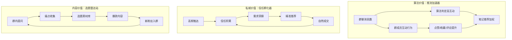
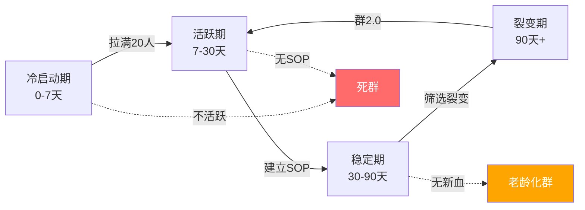
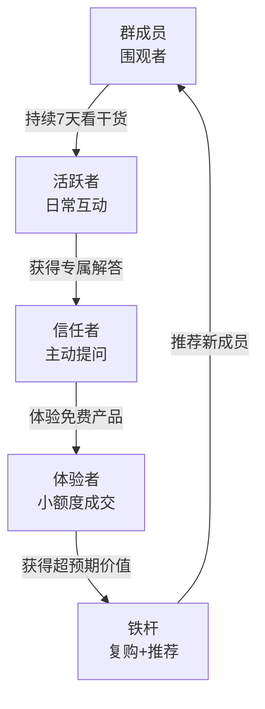
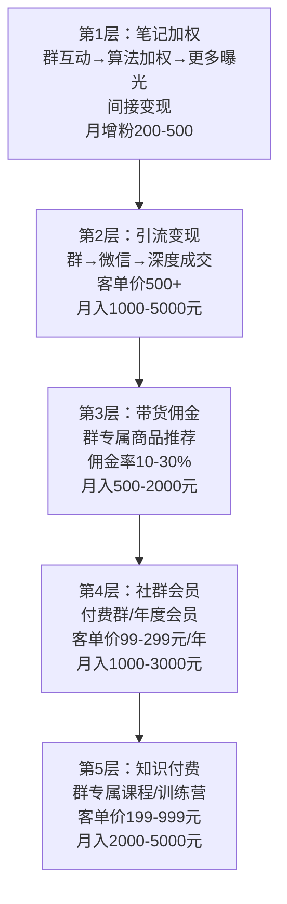

# 📕 Day34: 小红书私域与群聊运营实战

> **核心：小红书群聊是被99%创作者忽略的「隐形金矿」——它既是算法推流的加速器，又是私域成交的孵化器，更是内容选题的民意调查站。反生活账号要把群聊从「闲聊水群」升级为「辟谣作战指挥部」，让每一个群成员都成为你的内容共创者和信任背书者。**
> 来源：小红书官方群聊功能指南、小红书创作者学院社群课程、私域运营实战案例、群聊SOP运营方法论、反生活账号群聊实操

---

## 一、一句话总结

**小红书群聊 = 在平台内部建一个「高信任度微型社区」，把散装粉丝变成铁杆盟友，让算法看到你的互动密度，让用户感受到你的真实温度，让变现自然发生而不是硬推。**

小红书群聊和微信群有本质区别：群聊在平台内，算法能看到互动数据（群消息数、群活跃度），高活跃群聊会反哺笔记的推荐权重。这是微信做不到的——微信群再活跃，小红书算法也看不到。所以群聊不仅是私域，更是**公域-私域的桥梁**。

> 关联笔记：[Day14-私域引流转化](Day14-私域引流转化.md) — 群聊是私域转化的核心场景
> 关联笔记：[Day17-私域社群运营](Day17-私域社群运营.md) — 社群运营通用方法论，本篇聚焦小红书群聊
> 关联笔记：[Day18-朋友圈营销](Day18-朋友圈营销.md) — 群聊+朋友圈=私域双引擎
> 关联笔记：[Day33-小红书数据分析与内容复盘体系](Day33-小红书数据分析与内容复盘体系.md) — 群聊数据是复盘的重要维度

---

## 二、核心框架

### 2.1 小红书群聊的三重价值模型



**核心洞察**：小红书群聊是唯一一个同时服务算法、用户、内容三个维度的运营工具。

### 2.2 小红书群聊 vs 微信群 对比

| 维度 | 小红书群聊 | 微信群 |
|------|----------|--------|
| 算法感知 | ✅ 群互动数据影响推荐 | ❌ 平台无法感知 |
| 入群门槛 | 笔记/主页引导，一键加入 | 需加微信，多一步流失 |
| 内容关联 | 群聊可关联笔记，形成闭环 | 脱离平台，内容断裂 |
| 变现路径 | 群内挂商品、引导到店、知识付费 | 需第三方工具 |
| 粉丝信任 | 平台背书，信任成本低 | 陌生人加微，信任成本高 |
| 用户上限 | 200人/群 | 500人/群 |
| 消息留存 | 7天可见 | 永久可见 |
| 缺点 | 消息7天消失、人数限制 | 脱离平台生态、算法盲区 |

**结论**：小红书群聊做「培育+成交」，微信群做「深度运营+长期服务」。双群并行是最佳策略。

### 2.3 群聊生命周期管理



---

## 三、可落地方法

### 3.1 群聊冷启动四步法

**第一步：设钩子（笔记里埋入群入口）**

不是在笔记末尾写"加群吧"——这种转化率不到2%。正确做法是：

- **资源钩子**：笔记讲完方法论，群里有「完整版PDF/模板/清单」
- **答疑钩子**：笔记结尾「评论区问题太多回复不过来，进群一对一答疑」
- **限时钩子**：「前50名进群送XXX」
- **反生活专属钩子**：「进群领《50个常见生活骗局自查清单》」

**反生活实操**：每篇辟谣笔记末尾加一句——「这篇只说了结论，进群看完整证据链+避坑方法」。

**第二步：首批20人种子用户**

- 从已有粉丝中筛选：评论3次以上的铁粉
- 私信邀请：不要群发，逐个私信说明群的价值
- 邀请话术：「你之前在XXX笔记下的评论特别好，我建了个反生活内部群，专门讨论生活真相，邀请你来做种子成员」

**第三步：前7天高密度互动**

| 天数 | 运营动作 | 目的 |
|------|---------|------|
| Day1 | 自我介绍+群规则+破冰问题 | 建立秩序和氛围 |
| Day2 | 分享独家内容（群内首发） | 让人觉得「来对了」 |
| Day3 | 发起讨论话题 | 培养互动习惯 |
| Day4 | 回答3个常见问题 | 建立专业权威 |
| Day5 | 群内投票选题 | 让用户参与内容创作 |
| Day6 | 分享幕后故事 | 建立情感连接 |
| Day7 | 发布群专属福利 | 强化留存理由 |

**第四步：建立每日SOP**

```
08:00 早安+每日一问（轻互动）
12:00 干货分享/辟谣卡片（价值输出）
18:00 话题讨论/投票（深度互动）
21:00 总结+预告明日内容（闭环）
```

### 3.2 反生活群聊运营三板斧

**第一板斧：辟谣日历**

每天在群里发一个「今日辟谣」，形成用户期待：

| 周几 | 辟谣主题 | 互动方式 |
|------|---------|---------|
| 周一 | 食品辟谣 | 「你被骗了吗？」投票 |
| 周二 | 健康辟谣 | 案例分享+讨论 |
| 周三 | 家居辟谣 | 对比图猜真假 |
| 周四 | 美妆辟谣 | 成分党科普 |
| 周五 | 消费辟谣 | 买家秀vs卖家秀 |
| 周六 | 群友投稿 | 用户UGC辟谣 |
| 周日 | 一周辟谣精华 | 知识卡片合集 |

**第二板斧：群内选题会**

每周日在群里开「选题会」：
1. 发3个备选话题
2. 群友投票选择
3. 群友补充角度和素材
4. 产出笔记后群里首发
5. 笔记数据回传群里

效果：**群友有参与感 → 主动转发分享 → 笔记互动率飙升 → 算法加大推荐**

**第三板斧：信任阶梯成交**



不要在群里直接卖货。正确节奏：
1. **第1-2周**：纯价值输出，零推销
2. **第3周**：自然提及产品（「有人问XXX，我用的是这个」）
3. **第4周**：限时群专属优惠
4. **持续**：老带新奖励机制

### 3.3 群聊内容生产模板

**每日辟谣卡片模板**：
```
🚨 反生活·每日辟谣 Day{N}

❌ 谣言：{常见错误认知}
✅ 真相：{科学事实，一句话}
📊 证据：{数据/来源，一句话}
💡 行动：{今天就能做的1件事}

💬 今日讨论：你身边有人信这个吗？他们怎么说？
```

**群内问答模板**：
```
🔍 群友问：{问题}
🧪 反生活答：{专业回答}
📎 参考：{来源链接}
🎯 一句话版：{可转发给朋友的简版答案}

👉 想深挖？我明天出一篇完整笔记
```

### 3.4 群聊活跃度提升技巧

**技巧1：定时炸弹法**
「3分钟后在群里发一个限时福利/独家内容，先到先得」——制造紧迫感，提升在线率

**技巧2：@全体成员的正确姿势**
不要滥用@全体。每周最多2次：
- 一次是周三干货分享
- 一次是周日选题会

**技巧3：群聊红包运营**
- 新人入群：发1元红包欢迎
- 话题讨论：最佳评论奖0.5元
- 每周辟谣王：发3元红包
- 注意：红包是「仪式感」，不是「贿赂」

**技巧4：制造群内KOC**
找出3-5个活跃成员，给予「群助手」「辟谣达人」等称号，让他们帮忙回答问题、活跃气氛。这是**免费运营团队**。

**技巧5：跨群联动**
如果你有多个群（反生活主群、美食辟谣群、消费避坑群），定期做跨群话题联动，制造「大事件感」。

---

## 四、变现路径

### 4.1 群聊变现五层金字塔



### 4.2 反生活群聊变现路线图

| 阶段 | 时间 | 动作 | 预期收入 |
|------|------|------|---------|
| 冷启动 | 1-4周 | 建1个群，拉满200人，纯价值输出 | 0元（投资期） |
| 信任期 | 5-8周 | SOP跑通，群活跃度>30%，首次软性推荐 | 200-500元/月 |
| 变现期 | 9-12周 | 群专属商品、付费内容、引流到微信 | 1000-3000元/月 |
| 放大期 | 13周+ | 开2群、3群，群矩阵运营 | 3000-8000元/月 |

### 4.3 三种群聊变现模式详解

**模式1：群专属电商**
- 在群内推荐与辟谣主题相关的商品
- 例：辟谣了「假蜂蜜」→ 群内推荐真蜂蜜
- 关键：推荐的商品必须是辟谣内容的「正确答案」
- 转化率：3-8%（远高于普通带货1-2%）
- 佣金：10-30%

**模式2：付费社群**
- 免费群做流量入口 → 付费群做深度服务
- 付费群定价：99-299元/年
- 付费群权益：每周1次深度辟谣报告、每月1次直播答疑、专属避坑清单更新
- 反生活优势：辟谣内容天然有「信息差价值」，用户愿意为「不被骗」付费

**模式3：引流到私域深成交**
- 群聊 → 微信 → 一对一咨询 / 小额付费产品
- 适合：知识付费、咨询服务、高端课程
- 客单价：500-5000元
- 反生活方向：消费维权咨询、产品真伪鉴定服务

### 4.4 收入测算

以1个200人群为例（保守估计）：

| 变现方式 | 转化率 | 客单价 | 月收入 |
|---------|:-----:|:-----:|:-----:|
| 群专属带货 | 5%×200=10人 | 50元佣金 | 500元 |
| 付费群升级 | 10%×200=20人 | 99元/年 | 165元/月 |
| 引流微信成交 | 3%×200=6人 | 500元 | 500元 |
| **合计** | | | **1165元/月** |

开3个群（矩阵运营）→ **3495元/月**

---

## 五、行动清单

### ✅ 今天就能做的3件事

**1. 创建你的第一个小红书群聊**
- 打开小红书 → 消息 → 右上角+ → 创建群聊
- 群名公式：「反生活·{垂直领域}辟谣局」（例：反生活·食品安全辟谣局）
- 群简介：写明群的3个价值（每日辟谣+选题参与+专属福利）
- 设置入群问题：「你最想辟谣哪个生活常识？」

**2. 在最新一篇笔记末尾加群入口**
- 不要只写"加群"
- 用钩子话术：「完整版《XXX避坑清单》在群文件里，评论区扣1我拉你」
- 观察48小时内入群人数，测试哪种钩子最有效

**3. 写第一周的群聊SOP**
- 按上面的每日SOP模板，填入你的内容
- 准备7天的「每日辟谣」素材
- 准备3个破冰问题

### 📋 本周行动路线图

| 天 | 任务 | 产出 |
|---|------|------|
| Day1 | 建群+拉20人+自我介绍 | 群聊上线 |
| Day2 | 发第一条群内专属内容 | 群价值感 |
| Day3 | 发起第一个讨论话题 | 互动数据 |
| Day4 | 笔记末尾加群入口 | 入群流量 |
| Day5 | 找出3个活跃成员做KOC | 群助手团队 |
| Day6 | 在群里开第一次选题会 | 下周选题 |
| Day7 | 做第一周群数据复盘 | 优化方向 |

### 🔑 反生活群聊核心心法

1. **群不是广告位，是社区**——发广告的群3天就死，发价值的群3个月还活着
2. **群互动=算法信号**——每条群消息都在告诉小红书「这个创作者有粉丝在互动」
3. **群友=内容共创者**——最好的选题永远来自群友的真实问题
4. **辟谣群天然有凝聚力**——「我们是一群不被骗的人」这种身份认同是极强的粘性
5. **7天消息消失是优势**——降低信息过载，每天都是新内容，打开率更高

---

## 附录：反生活群聊SOP模板

### 每日运营SOP

| 时间 | 动作 | 话术模板 |
|------|------|---------|
| 08:00 | 早安+每日一问 | 「早安☀️ 今天问个扎心的：你买过最后悔的东西是什么？」 |
| 12:00 | 辟谣卡片 | 「🚨 今日辟谣：{谣言}→真相是{真相}」 |
| 18:00 | 话题讨论 | 「💬 今天聊聊：{话题}，你怎么看？」 |
| 21:00 | 总结+预告 | 「📝 今日精华：{3条要点}。明天聊{预告}」 |

### 每周运营SOP

| 时间 | 动作 | 目的 |
|------|------|------|
| 周一 | 本周辟谣日历发布 | 建立期待 |
| 周三 | 群专属福利/内容 | 强化价值 |
| 周五 | 群友投稿征集 | UGC内容 |
| 周日 | 选题会+周总结 | 参与感+闭环 |

### 群聊数据监控表

| 指标 | 日目标 | 周目标 | 月目标 |
|------|:-----:|:-----:|:-----:|
| 日均消息数 | >20条 | >140条 | >600条 |
| 日活跃人数 | >30人 | — | — |
| 周活跃率 | — | >40% | — |
| 月入群人数 | — | — | >30人 |
| 月退群率 | — | — | <10% |
| 群内成交转化率 | — | — | >3% |

---

> **群聊的本质：不是把人圈起来卖东西，而是把志同道合的人聚在一起，让价值流动，让信任生长，让变现成为自然而然的结果。**
>
> 反生活群聊的终极形态：**一个200人的「反骗局联盟」**——每个人都是辟谣的火种，分享一条辟谣内容就可能在朋友圈拯救一个差点被骗的人。群聊的200人不是你的客户，而是你的200个「真相传播合伙人」。
>
> 当群友主动说「我昨天用你教的方法帮我妈避开了XXX骗局」的那一刻，你的群聊运营就真正成功了——变现只是这种成功的副产品。

---

*学习日期：2026-06-02*
*下期预告：Day35 - 小红书笔记封面设计与视觉爆款*
