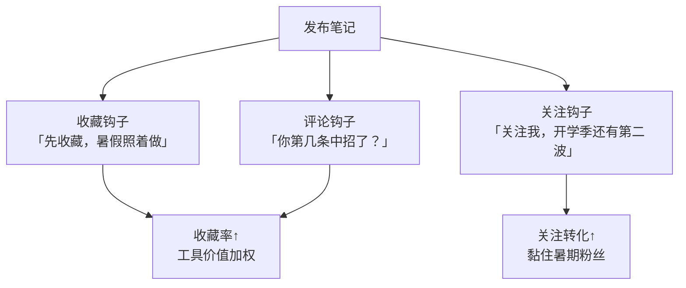

# Day34: 暑期流量暴涨期运营策略——7-8月小红书养生赛道的流量红利与内容规划

> 📅 学习日期：2026-08-01
> 🔗 关联笔记：[[00-目录]] | 上一篇：[[Day33-视觉体系设计]] | 下一篇：[[Day35-暑期内容排期与开学季衔接]]
> 🎯 适用场景：「反生活」好物养生账号在7-8月暑假流量高峰期的选题、排期、人群运营与变现
> 📚 学习来源：小红书历年暑期流量大盘数据 × 双人群（学生/职场）内容偏好洞察 × 季节性与人群体感需求分析 × 中小账号暑期爆发案例复盘 × 平台暑期运营活动规则

---

## 1. 一句话总结

**暑期（7-8月）是小红书全年流量最宽松、用户活跃度最高、中小账号最容易「捡漏」起号的窗口期——因为平台流量池暴涨、竞争相对被稀释，同样质量的内容在暑期能获得平时2-3倍的曝光，而「反生活」号此刻还处于冷启动期，正赶上这波「流量顺风车」。** 抓住暑假的关键不是「发更多」，而是「发对人群、发对场景、发对节奏」——把流量红利最大程度转化为粉丝和信任。

**核心认知：** 暑期用户行为和平时完全不同——学生放假全天在线、职场人群进入「年中疲惫期开始重视养生」、天气炎热催生「消暑/提神/减负」的刚需场景。谁能在7月底前把内容选题和排期对齐这波需求，谁就能在开学季前积累第一批铁杆粉丝，为9月开学季的第二次流量高峰蓄力。

---

## 2. 核心框架

### 2.1 暑期流量红利「三层漏斗」引擎

```mermaid
graph TB
    subgraph 第一层 · 流量入口<br/>暑期平台大盘
        A1[用户日均时长↑<br/>学生全天在线] --> A2[流量池扩容<br/>新笔记更容易进池]
        A2 --> A3[中小账号<br/>竞争稀释顺风车]
    end

    subgraph 第二层 · 内容引擎<br/>场景化选题
        B1[消暑养生<br/>绿豆汤/酸梅汤] --> B2[学生党养生<br/>熬夜/护眼/提神]
        B1 --> B3[职场减负<br/>久坐/肩颈/下午茶]
        B1 --> B4[假期计划<br/>居家/旅行/清爽]
    end

    subgraph 第三层 · 转化沉淀<br/>粉丝资产
        C1[收藏笔记<br/>形成工具价值] --> C2[关注账号<br/>建立持续信任]
        C2 --> C3[开学季复购<br/>形成第二波流量]
    end

    A3 --> B1
    B1 & B2 & B3 & B4 --> C1
    C3 --> D[冷启动破500粉<br/>冲刺爬坡期]

    style D fill:#fff9c4,stroke:#ffc107
```

### 2.2 暑期双人群「需求地图」矩阵

```mermaid
flowchart LR
    subgraph 人群A<br/>学生党
        P1[熬夜补作业<br/>护眼/提神] --> P2[暴饮暴食<br/>消食/养胃]
        P2 --> P3[假期变美<br/>祛湿/美白/轻体]
    end

    subgraph 人群B<br/>职场人
        Q1[久坐空调房<br/>肩颈/祛湿/防寒] --> Q2[年中疲惫<br/>补气血/睡眠]
        Q2 --> Q3[下午茶替代<br/>健康饮品/轻食]
    end

    P3 & Q3 --> R[夏季养生刚需<br/>消暑+减负+提神]

    style R fill:#e8f5e9,stroke:#4caf50
```

### 2.3 暑期「内容节奏」五阶段规划

| 时间段 | 阶段 | 内容重点 | 「反生活」动作 |
|:------:|:----:|---------|--------------|
| 6月底-7月初 | 预热期 | 暑期养生总攻略、避坑清单 | 布局搜索长尾词（暑期/三伏天/熬夜党） |
| 7月中旬 | 主力期① | 三伏天养生、消暑神器好物 | 追三伏节点，连发5-7篇强场景笔记 |
| 7月底-8月初 | 主力期② | 学生党/职场人暑期自救 | **今天（8月1日）正当时，主力冲量** |
| 8月中旬 | 收割期 | 好物合集、测评、收藏型内容 | 沉淀收藏，引导关注私域引导 |
| 8月底 | 开学季衔接 | 开学季养生好物、宿舍/办公室装备 | 预告下一篇「开学季突围策略」 |

---

## 3. 可落地方法

### 3.1 【反生活可直接用】8月上半月「火力全开」排期表

**核心原则：8月是暑假流量最后的高峰，必须用「密集+场景化」打法把粉丝基数顶上去。** 建议每天1-2篇，密集发布7月31日-8月15日。

| 日期 | 选题方向 | 人群 | 场景关键词 | 封面模板 |
|:----:|---------|:----:|:---------:|:--------:|
| 8/1 | 三伏天办公室「续命」好物清单 | 职场 | 空调房/久坐/提神 | 合集封面 |
| 8/2 | 学生党通宵复习自救指南 | 学生 | 熬夜/护眼/轻食 | 大字标题 |
| 8/3 | 消暑养生茶实测：连喝一周的变化 | 通用 | 消暑/亲测 | Before/After |
| 8/4 | 假期在家躺平也能养生的5件事 | 学生 | 居家/仪式感 | 生活场景 |
| 8/5 | 久坐上班族的肩颈救星好物 | 职场 | 肩颈/久坐 | 产品实拍 |
| 8/6 | 夏天祛湿排毒的正确打开方式 | 女性 | 祛湿/轻体 | 大字标题 |
| 8/7 | 我试过最「解压」的三伏天下午茶 | 职场 | 下午茶/健康 | 生活场景 |
| 8/8 | 暑期旅行必备的便携养生好物 | 通用 | 旅行/便携 | 合集封面 |
| 8/9 | 空调房「受寒」自救，别再贪凉 | 职场 | 受寒/防寒 | 大字标题 |
| 8/10 | 学生党如何低成本养生（附清单） | 学生 | 省钱/清单 | 合集封面 |
| 8/11 | 立秋养生第一课：润燥滋补如何选 | 通用 | 立秋/润燥 | 大字标题（节点） |
| 8/12 | 三伏天最该喝的消暑汤合集 | 通用 | 汤饮/消暑 | 合集封面 |
| 8/13 | 职场下午茶健康替代清单 | 职场 | 轻食/替代 | 产品实拍 |
| 8/14 | 暑期复盘：这30天我涨粉了多少 | 通用 | 复盘/成长 | 生活场景 |
| 8/15 | 开学季养生装备提前囤（预告） | 学生 | 开学/装备 | 大字标题 |

> **8月11日立秋** 是重要的养生节点，一定要提前排上「润燥滋补」主题——养生类目对节气敏感，蹭节气流量精准且成本低。

### 3.2 【反生活可直接用】暑期「场景化」标题公式

暑期用户刷到笔记的一瞬间，心里想的是「这和我现在的处境有关吗？」。标题必须**直击暑期困境**：

| 公式 | 示例 |
|------|------|
| **人群+痛点+暑期场景** | 「学生党熬夜赶作业，靠这3样撑过三伏天」 |
| **消暑刚需+亲测结果** | 「连喝一周绿豆汤，三伏天居然不烦躁了」 |
| **Office自救+好物** | 「空调房久坐必备，这5样救了我的老腰」 |
| **假期低成本+清单** | 「在家躺平也能养生，10元内好物清单」 |
| **节气+改变** | 「立秋第一碗润燥汤，喝出好气色」 |

**暑期标题关键词Top清单**（可直接复用）：`三伏天` `消暑` `祛湿` `熬夜党` `学生党` `打工人的命` `暑假` `空调房` `补水` `提神` `润燥` `立秋`

### 3.3 【反生活可直接用】搜索长尾词布局（承接[[Day23-小红书搜索SEO与长尾流量策略]]）

暑期用户大量使用搜索找答案，提前布局这些词能在流量期吃到搜索红利：

| 长尾搜索词 | 布局方式 | 竞争度 |
|-----------|---------|:-----:|
| 三伏天喝什么好 | 标题+内容自然植入 | 中 |
| 学生党养生好物推荐 | 标题、标签 | 低（红利） |
| 空调房受寒怎么办 | 标题（问句式） | 低 |
| 暑期旅游便携好物 | 标题+标签 | 中 |
| 立秋润燥吃什么 | 节点前3天布局 | 低（时效） |
| 久坐上班族肩颈好物 | 标题+测评内容 | 中 |

### 3.4 暑期「互动钩子」设置

暑期平台对「有效互动」权重更高（点赞/收藏/评论/关注），给每篇笔记配一个钩子：



---

## 4. 变现路径

### 4.1 暑期变现的「时间窗口」逻辑

暑期对「反生活」这类养生好物号有一个独特优势：**用户的「健康意识」在暑期被高温、熬夜、空调病激活，购买决策周期缩短**——这是全年少有的「既是流量高峰、又是需求高峰」的窗口。

| 变现方式 | 暑期适配度 | 说明 |
|---------|:---------:|------|
| 好物佣金/带货 | ⭐⭐⭐⭐⭐ | 消暑养生好物（绿豆、酸梅、茶饮、养生壶）暑期天然好卖 |
| 品牌合作（置换/小额） | ⭐⭐⭐⭐ | 暑期品牌投放预算加大，养生垂类更吃香 |
| 私域引流复购 | ⭐⭐⭐ | 暑期沉淀粉丝 → 开学季/双11复购 |
| 直播带货 | ⭐⭐⭐ | 暑期全天空闲人群多，即使冷启动也可试水 |

### 4.2 暑期 vs 平时的收入预估对比

| 阶段 | 暑期前（6月）月收入 | 暑期（7-8月）月收入 | 增长幅度 | 关键驱动 |
|:----:|:------------------:|:------------------:|:-------:|---------|
| 冷启动（0-500粉） | ¥0 | ¥0-500 | 起步 | 先攒粉，好物佣金门槛(1000粉)未到 |
| 爬坡期（500-2000粉） | ¥500-1500 | ¥1500-4000 | +100~150% | 消暑好物旺季+流量红利 |
| 成长期（2000-5000粉） | ¥2000-4000 | ¥5000-10000 | +150% | 品牌投放预算+带货双轮 |

> **给「反生活」的诚实提醒**：如果还没到1000粉，暑期主目标不是赚钱，而是**用最快的速度冲过1000粉的好物佣金门槛**，这样能在开学季（9月）和双11（10-11月）接住真正的变现潮。暑期赚的是「粉丝和信任」，变现的兑现期在秋季。

### 4.3 暑期「冲粉-变现」组合路径

```
暑期流量红利
   ↓
用场景化内容密集冲粉（0 → 1000+粉）
   ↓
过好物佣金门槛 → 开通带货功能
   ↓
9月开学季接住第二波流量 → 开始稳定接单变现
   ↓
双11大促迎来变现高峰（月入万级目标）
```

---

## 5. 行动清单

### ✅ 行动①：今天（8月1日）就发布「三伏天办公室续命好物清单」（1-1.5小时）

**步骤1（10分钟）：** 用[[Day33-视觉体系设计]]的「合集封面型」模板，做一张封面——标题「三伏天办公室续命好物清单」，配色用薄荷绿+暖白，制造清凉感。

**步骤2（30分钟）：** 整理3-5个手里已有的消暑/提神好物（养生茶包、薄荷、花茶、便携随行杯、肩颈贴等）。如果不够，用「#亲测 #自用」措辞把体验过的产品写进去。

**步骤3（15分钟）：** 写正文——开头用暑期困境带入（「三伏天办公室空调房待一天，整个人蔫了」），中间分点介绍好物+用法+价格，结尾加收藏钩子。

**步骤4（10分钟）：** 标题选「空调房久坐必备，这5样救了我的老腰」，标签加满`#三伏天 #上班族的命 #养生好物 #办公室养生 #消暑`。

**步骤5（5分钟）：** 发布并置顶到账号第一屏，开启评论引导。

> **产出：** ✅ 1篇踩中暑期消暑+职场人群的主力笔记，抢占8月第一天流量。

### ✅ 行动②：排好「8月上半月15篇排期表」（20分钟）

**步骤1（5分钟）：** 打开手机备忘录/表格，把上面3.1节的15篇排期表抄进去，替换成你自己手头实际有的好物和选题。

**步骤2（10分钟）：** 检查每篇是否覆盖到两个人群（学生党+职场人）和节气节点（8/11立秋），缺的补上。

**步骤3（5分钟）：** 给每篇标注「封面模板类型」和「搜索长尾词」，保证视觉统一、SEO到位（承接[[Day28-自媒体内容工业化生产]]的流水线思维）。

> **产出：** ✅ 一份可执行的15天内容作战地图，未来两周打开就有选题，不再临时「今天写什么」。

### ✅ 行动③：盘点「暑期应季好物」并提交选品清单（30分钟）

**步骤1（10分钟）：** 把手里现有的养生好物按「消暑类/提神类/补气血类/祛湿类/护眼类」分类，标出哪些最贴合暑期场景。

**步骤2（10分钟）：** 从淘宝/拼多多/1688找2-3个暑期应季的性价比好物（如便携随行杯、酸梅汤原料、三伏贴、花茶组合）作为选品补充，记录价格和佣金率。

**步骤3（10分钟）：** 整理成一份「暑期选品清单」表格（产品/价格/佣金率/适配场景/能否亲测），为后面带货和品牌合作打底。

> **产出：** ✅ 一份暑期应季选品清单，为冲粉后接单和暑期带货提前备好弹药。

---

## 📊 今日学习总结

| 维度 | 内容 |
|:----:|------|
| 核心认知 | 暑期（7-8月）流量池暴涨+竞争稀释，中小账号获2-3倍曝光的「流量顺风车」机会 |
| 核心框架 | 三层漏斗引擎（流量入口→内容引擎→转化沉淀）+ 双人群需求地图 + 五阶段节奏 |
| 关键技能 | 8月15篇场景化排期、暑期标题公式、搜索长尾词布局、三伏天/立秋节气蹭点 |
| 变现路径 | 暑期主目标是冲粉过1000粉佣金门槛，秋季（开学季+双11）才是兑现期 |
| 今日行动 | ① 发布三伏天职场好物清单 ② 排好15篇作战地图 ③ 交暑期应季选品清单 |

> 下一篇预告：**Day35: 暑期内容排期与开学季衔接——把暑期粉丝平稳过渡到9月开学季第二波流量**，承接今日的排期表，帮「反生活」在暑期尾声接住秋季增长。
