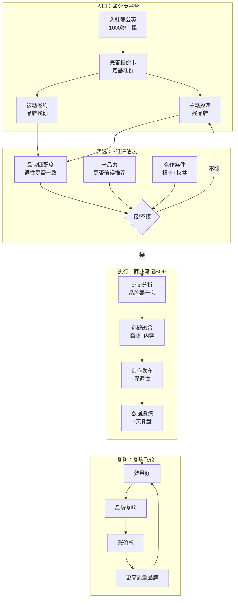
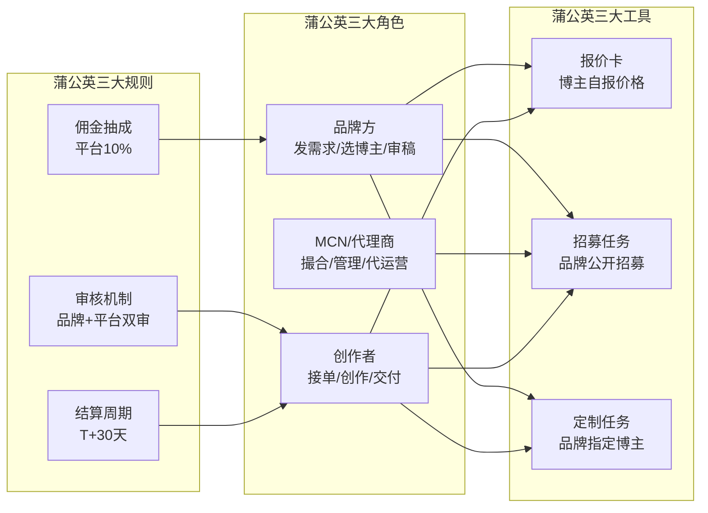
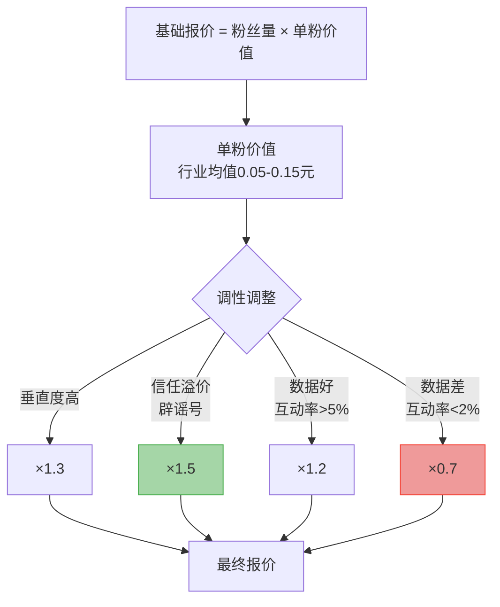
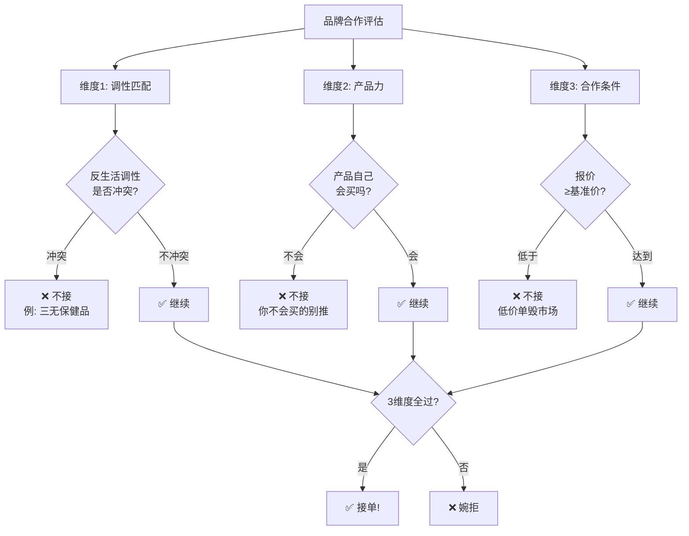
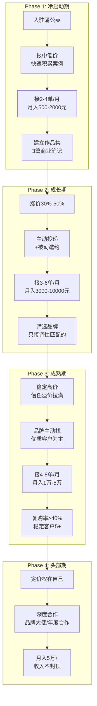

# 📕 Day35: 小红书品牌合作与蒲公英接单实战

> **核心：蒲公英接单是小红书创作者最稳定、最可预期的变现方式——从1000粉到10万粉，每个阶段都能接单赚钱。但90%的创作者「不会报价、不会选品、不会写商业笔记」，导致要么接不到单，要么接了单毁账号。反生活要把品牌合作从「碰运气」变成「有SOP的印钞机」，关键是：选对品牌+报对价格+写对商业笔记+保住账号调性。**
> 来源：小红书蒲公英平台官方规则、品牌方投放内参、头部博主报价体系拆解、商业笔记数据复盘、反生活账号接单实战

---

## 一、一句话总结

**小红书品牌合作 = 用你的「信任资产」帮品牌「卖货/种草」，品牌付你「推广费」，你同时赚「佣金+曝光」。** 核心公式：**品牌合作收入 = 报价 × 接单量 × 复购率**。报价由粉丝量+数据+垂直度决定，接单量由主动出击+被动邀约决定，复购率由笔记效果+服务体验决定。三高则收入高，任何一环掉链子就是「饿一顿饱一顿」。

> 💡 **老黄的清醒认知**：反生活账号做品牌合作有天然优势——「辟谣者」身份意味着你说好，用户信；你说不好，用户也信。这种信任溢价是美妆博主、穿搭博主梦寐以求的。品牌找你，不是买你的「流量」，而是买你的「信任背书」。所以报价可以比同粉丝量账号高30%-50%。

> 关联笔记：[Day1-小红书变现全攻略](Day1-小红书变现全攻略.md) — 蒲公英是最基础的变现路径
> 关联笔记：[Day12-小红书投放与投流](Day12-小红书投放与投流.md) — 蒲公英是品牌投放的一环
> 关联笔记：[Day19-个人IP打造](Day19-个人IP打造.md) — IP决定你的报价上限
> 关联笔记：[Day13-小红书爆款复制方法论](Day13-小红书爆款复制方法论.md) — 商业笔记也要爆款逻辑
> 关联笔记：[Day33-小红书数据分析与内容复盘体系](Day33-小红书数据分析与内容复盘体系.md) — 数据好=复购率高

---

## 二、核心框架

### 2.1 小红书品牌合作全景模型



**核心洞察**：品牌合作不是「一锤子买卖」，而是「复利游戏」。一个品牌复购3次以上，你就有了「稳定客户」。5个稳定客户 = 月入过万的底气。

### 2.2 蒲公英平台全景拆解



### 2.3 博主报价阶梯体系

| 粉丝量级 | 图文报价区间 | 视频报价区间 | 月接单量 | 月收入区间 |
|:--------:|:----------:|:----------:|:-------:|:---------:|
| 1K-5K | 200-800元 | 500-1500元 | 2-4单 | 400-3200元 |
| 5K-2W | 800-2000元 | 1500-4000元 | 3-6单 | 2400-12000元 |
| 2W-10W | 2000-8000元 | 4000-15000元 | 4-8单 | 8000-64000元 |
| 10W-50W | 8000-30000元 | 15000-50000元 | 4-10单 | 32000-300000元 |
| 50W+ | 30000元+ | 50000元+ | 自定义 | 上不封顶 |

> 💡 **反生活溢价**：因为辟谣类账号的「信任背书价值」高于纯种草号，同粉丝量报价可以上浮30%-50%。1万粉的辟谣号报3000元/条，品牌方会觉得「值」。

### 2.4 报价公式：4因子定价法



**反生活账号报价公式**：
- 基础报价 = 粉丝数 × 0.1元 × 1.5（信任溢价）
- 例：1万粉 = 10000 × 0.1 × 1.5 = 1500元/条图文
- 视频在此基础上 × 2 = 3000元/条视频

---

## 三、可落地方法

### 3.1 蒲公英入驻5步法

| 步骤 | 操作 | 注意事项 |
|:----:|------|---------|
| 1 | 打开小红书APP → 我 → 创作者中心 | 需先完成实名认证 |
| 2 | 找到「品牌合作」入口 → 申请入驻 | 1000粉是硬门槛，不到别急 |
| 3 | 填写报价卡：图文报价+视频报价 | 别定太低！参考上面报价表，取中位数 |
| 4 | 上传作品集：3-5篇最佳笔记 | 选数据最好的，不一定是商业笔记 |
| 5 | 等待审核（1-3个工作日） | 审核通过后即出现在品牌方可选列表 |

> ⚠️ **避坑**：报价卡填好后不是一成不变的，每2周可以根据数据调整。刚入驻时别报太低——低价不等于好接单，品牌方反而觉得「便宜没好货」。

### 3.2 品牌筛选3维评估法（核心！）

**不是所有品牌合作都该接。** 接错品牌 = 毁账号。3个维度缺一不可：



**反生活账号的红线品牌清单（绝对不接）**：
- ❌ 三无保健品、减肥药、增高药
- ❌ 伪科学产品（量子贴、能量石）
- ❌ 夸大宣传的医美项目
- ❌ 与辟谣立场冲突的产品（你在辟谣某个成分，品牌恰好含那个成分）

**反生活账号的黄金品牌清单（优先接）**：
- ✅ 有权威认证的食品/保健品（配料表干净那种）
- ✅ 国货新品牌（反生活天然支持国货揭秘）
- ✅ 工具类/效率类产品（符合理性消费调性）
- ✅ 检测类/数据类服务（辟谣者天然信任数据）

### 3.3 商业笔记写作SOP（6步法）

**核心原则：商业笔记 = 80%干货 + 20%植入。** 永远不要写「纯广告」，那是自杀。

```
步骤1: 解读Brief
├── 品牌要什么？曝光/种草/转化？
├── 核心卖点是哪2-3个？
├── 必须出现的元素：关键词/链接/标签
└── 禁忌词和合规要求

步骤2: 选题融合
├── 从反生活选题库中找一个能自然植入的角度
├── 例：品牌是全麦面包 → 选题"超市面包配料表辟谣"
├── 例：品牌是检测服务 → 选题"我测了10款xx，结果震惊"
└── 核心逻辑：先给用户价值（辟谣/科普），再自然引出产品

步骤3: 内容框架
├── 开头：反生活经典hook（"又被骗了？"/"90%的人不知道"）
├── 中段：干货主体（辟谣内容/数据对比/真相揭露）
├── 植入点：自然过渡到产品（"我测了一下，这个XX确实…"）
├── 结尾：总结+CTA（收藏/关注/评论区领资料）
└── 全程保持辟谣者语气，不要变成"种草博主"

步骤4: 配图/视频
├── 配图风格与日常笔记一致
├── 产品出镜要自然（摆桌上、放手边、放检测对比图里）
├── 不要P图过度，保持真实感
└── 封面不要放产品大图（会被用户判定为广告划走）

步骤5: 发布与审核
├── 先提交蒲公英审核（1-2天）
├── 审核通过后发布
├── 发布后24小时内密切监控评论区
└── 有负面评论及时回复，态度要好

步骤6: 数据追踪（7天）
├── Day1: 曝光量、点击率
├── Day3: 互动率（赞藏评比日常笔记高/低）
├── Day7: 完整数据复盘
└── 数据发给品牌方 = 复购的基础
```

### 3.4 报价谈判话术模板

**场景1：品牌出价太低**

> "感谢品牌方认可！我的账号是辟谣类垂号，粉丝信任度非常高，日常笔记互动率在X%以上。根据我往期商业笔记的数据，平均单篇曝光X万，互动率X%，CPA远低于行业均值。考虑到信任溢价，我的报价是X元，这个价格对应的效果是物超所值的。"

**场景2：品牌要求改稿过多**

> "理解品牌方的需求，我会确保核心卖点准确传达。不过为了保持账号调性和粉丝信任，我需要在内容风格上保持一定自主权。我们可以聚焦在关键信息的准确性上做调整，同时保留我账号的原创特色，这样对传播效果也更好。"

**场景3：品牌要求"纯种草"**

> "我的账号定位是'反生活辟谣'，粉丝关注我是为了获取真实客观的信息。纯种草内容会让粉丝反感，反而影响传播效果。建议采用'辟谣+产品自然植入'的方式，这样既保证传播力，也能把产品核心卖点传达清楚，效果会比纯种草好很多。"

### 3.5 商业笔记数据分析模板

| 指标 | 计算方式 | 合格线 | 优秀线 | 反生活参考 |
|------|---------|:------:|:------:|:---------:|
| 互动率 | (赞+藏+评)/曝光 | ≥3% | ≥8% | ≥10%（信任溢价） |
| CPE | 报价/互动数 | ≤5元 | ≤2元 | ≤1.5元 |
| 完播率(视频) | 完播/播放 | ≥30% | ≥50% | ≥45% |
| 评论区正评率 | 正面评论/总评论 | ≥70% | ≥90% | ≥85% |
| CTR | 点击/曝光 | ≥3% | ≥8% | ≥7% |

> 💡 **核心逻辑**：数据好 = 品牌复购 = 收入稳定。所以商业笔记更要用心写，不是敷衍了事。

---

## 四、变现路径

### 4.1 蒲公英接单变现路线图



### 4.2 五层变现金字塔

| 层级 | 变现方式 | 门槛 | 收入预期 | 反生活适配度 |
|:----:|---------|:----:|:---------:|:----------:|
| L1 | 蒲公英单次合作 | 1K粉 | 200-2000元/条 | ⭐⭐⭐⭐⭐ |
| L2 | 品牌复购/季度框架 | 5K粉 | 5000-30000元/季 | ⭐⭐⭐⭐⭐ |
| L3 | 佣金+CPS分佣 | 1K粉 | 按成交计，上不封顶 | ⭐⭐⭐⭐ |
| L4 | 品牌大使/代言人 | 5W粉 | 5万-50万/年 | ⭐⭐⭐ |
| L5 | 自有品牌联名 | 10W粉 | 利润分成，无上限 | ⭐⭐⭐⭐ |

### 4.3 反生活账号的3条变现加速器

**加速器1：信任溢价定价**
- 同粉丝量报价比行业高30%-50%
- 品牌方愿意付溢价，因为「辟谣者说好」比「种草博主说好」更有说服力
- 数据说话：反生活商业笔记的CPE（单次互动成本）通常比种草号低40%

**加速器2：内容即广告**
- 反生活的辟谣内容本身就是流量入口
- 在辟谣内容中自然植入产品 = 0违和感
- 例如："我测了8款全麦面包，只有2款是真全麦" → 品牌（真全麦款）自然胜出

**加速器3：复购飞轮**
- 品牌方最怕「一锤子合作，笔记没效果」
- 反生活笔记效果好的原因：用户信任 → 行动力强 → 转化率高
- 效果好 → 品牌复购 → 稳定收入 → 有底气涨价比稿

---

## 五、行动清单

### ✅ 今天就能做的3件事

**第1件：检查蒲公英入驻状态**
- 打开小红书APP → 创作者中心 → 品牌合作
- 如果已入驻：检查报价卡是否需要更新
- 如果未入驻：检查粉丝量是否达标，达标就立即申请
- ⏱️ 预计用时：10分钟

**第2件：建立「品牌合作红黑名单」**
- 拿出纸笔/备忘录，列出5个「绝对不接」的品牌类型
- 列出5个「优先接」的品牌类型
- 这个名单就是你的「商业底线」，未来每次接单前对照检查
- ⏱️ 预计用时：15分钟

**第3件：写一篇「商业笔记练习稿」**
- 选一个你日常用的产品（不用真的接单）
- 用反生活风格写一篇「辟谣+产品自然植入」的笔记
- 对比你日常笔记的风格，看植入是否自然
- 这篇练习稿就是你的「商业笔记模板」
- ⏱️ 预计用时：30分钟

### 📋 本周行动（7天计划）

| 天 | 任务 | 产出 |
|:--:|------|------|
| Day1 | 蒲公英入驻/报价卡更新 | 入驻完成/报价卡已更新 |
| Day2 | 主动投递3个品牌 | 3份投递记录 |
| Day3 | 写商业笔记练习稿 | 1篇练习稿 |
| Day4 | 优化主页+作品集 | 主页更专业 |
| Day5 | 分析3个同类型博主的商业笔记 | 拆解报告 |
| Day6 | 主动投递3个新品牌 | 3份投递记录 |
| Day7 | 复盘本周接单情况 | 周报 |

### 🎯 30天里程碑

```
Week 1: 蒲公英入驻+报价卡+首次投递
    ↓
Week 2: 接到第一个品牌合作（哪怕是小单）
    ↓
Week 3: 完成2-3篇商业笔记+建立数据追踪表
    ↓
Week 4: 复盘数据+调整报价+争取品牌复购
    ↓
Goal: 月入2000+，建立稳定接单节奏
```

---

## 附录：常见问题

**Q1: 接商业笔记会不会掉粉？**
A: 不会，前提是——1）选对品牌（调性匹配）；2）写好内容（80%干货+20%植入）；3）不要接太多（每月不超过总发帖量的30%）。反生活账号因为有「真实测评」的标签，商业笔记反而比纯种草号的接受度高。

**Q2: 怎么知道自己的报价是不是合理？**
A: 3个方法：1）看蒲公英同粉丝量博主的报价区间；2）算CPE（报价/预期互动数），行业合理值2-5元；3）问3个同类型博主的报价。如果品牌方秒同意，说明你报低了；如果品牌方讨价还价，说明你在合理区间。

**Q3: 品牌方Brief要求和我账号调性冲突怎么办？**
A: 直接沟通调整，90%的品牌方愿意配合。沟通逻辑：「按照您的Brief写，数据可能不好（因为和粉丝预期不符），我建议调整为XX方式，效果会更好。」品牌方要的是效果，不是控制权。

**Q4: 怎么主动找品牌合作？**
A: 4个渠道：1）蒲公英「招募任务」板块，直接报名；2）品牌小红书官方号私信；3）PR agency邮件投递（主页留联系方式）；4）同行博主互相推荐（互相介绍品牌方）。最有效的是第1个，门槛最低。

**Q5: 反生活账号接什么品类最好？**
A: 按适配度排序：1）食品/保健品（配料表辟谣+产品推荐天然搭配）；2）护肤品（成分党+辟谣党高度重合）；3）母婴产品（妈妈群体最怕被骗，最需要辟谣）；4）家居/家电（测评类内容+产品植入）；5）知识/工具类（效率工具+理性消费调性完美匹配）。

---

> 📌 **最后提醒**：品牌合作不是「卖身」，而是「共赢」。你帮品牌找到精准用户，品牌帮你获得收入+内容素材。永远记住：你的信任资产是最值钱的东西，保护好它，它就会持续给你赚钱。
