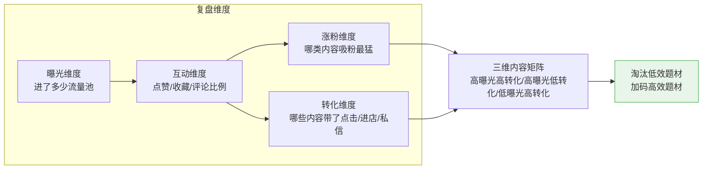
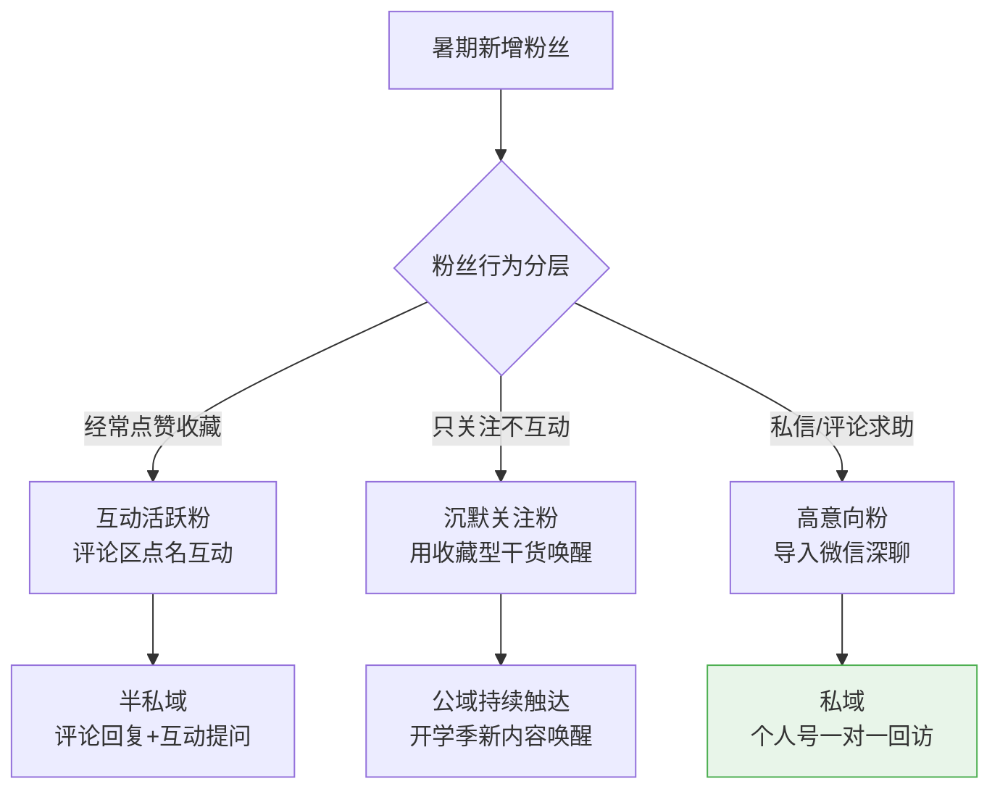
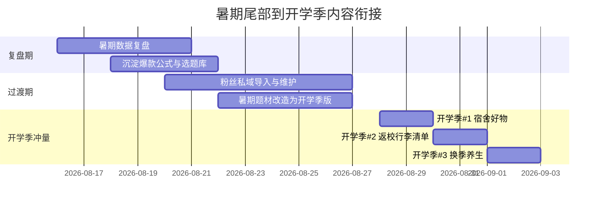
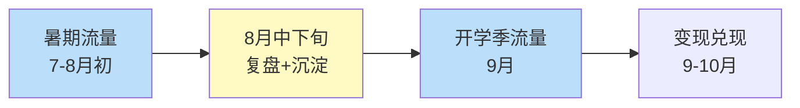

# Day35: 暑期复盘与开学季衔接——把暑期粉丝资产平稳迁移到9月第二波流量高峰

> 📅 学习日期：2026-08-02
> 🔗 关联笔记：[[00-目录]] | 上一篇：[[Day34-暑期流量暴涨期运营策略]] | 下一篇：[[Day36-开学季选题库与内容排期]]
> 🎯 适用场景：「反生活」好物养生账号在8月中下旬（暑期尾声）做内容复盘、粉丝沉淀，并为9月开学季第二波流量提前铺路
> 📚 学习来源：Day34暑期运营复盘方法论 × 内容数据分析框架（承接Day24） × 粉丝生命周期沉淀模型 × 开学季（9月）人群与场景迁移洞察 × 中小账号「流量→粉丝→复购」资产化路径

---

## 1. 一句话总结

**暑期流量是「快钱」，开学季流量是「资产」——如果只想靠暑期涨粉而不做复盘、不建粉丝沉淀机制、不提前布局开学季选题，暑假结束就是流量的一夜「清零」；反之，把暑期粉丝逐步沉淀为「可调用、可触达、可复购」的私域资产，并把内容平滑迁移到开学季场景，就能把9月这第二波流量高峰真正接住、变现、滚雪球。**

**核心认知：** 大多数养生好物账号死就死在「流量—粉丝—信任」这条链的断层上——暑期发了一堆爆款，粉丝也涨了，但既没有复盘出「什么内容有效」，也没有把粉丝导入一个可长期触达的池子，更没有为下一波场景准备好弹药。结果9月一开学，学生党回学校、职场人忙起来，账号数据断崖式下跌。**提前做「暑期复盘 + 粉丝资产沉淀 + 开学季内容迁移」三件事，才能让流量从「一阵风」变成「一份资产」。**

---

## 2. 核心框架

### 2.1 暑期流量「三重资产化」漏斗

```mermaid
graph TB
    subgraph 第一层 · 内容资产<br/>把爆款变成方法论
        A1[复盘暑期全部笔记数据<br/>曝光/互动/收藏/涨粉] --> A2[提炼爆款公式<br/>什么题材/封面/标题有效]
        A2 --> A3[沉淀选题库<br/>暑期有效题材 + 开学季题材]
    end

    subgraph 第二层 · 粉丝资产<br/>把流量变成私域
        B1[引导粉丝关注<br/>建立持续信任] --> B2[私域导入<br/>评论区/主页/置顶钩子]
        B2 --> B3[分层维护<br/>新粉/活跃粉/沉默粉]
    end

    subgraph 第三层 · 场景资产<br/>把粉丝迁移到下一波
        C1[开学季人群画像<br/>学生宿舍/职场新学期] --> C2[内容场景迁移<br/>暑期→开学季选题过渡]
        C2 --> C3[开学季排期表<br/>9月前两周冲量]
    end

    A3 --> B1
    B3 --> C1
    C3 --> D[开学季破千粉<br/>接住变现潮]

    style D fill:#fff9c4,stroke:#ffc107
```

### 2.2 内容复盘「四维诊断」框架（承接[[Day24-内容数据分析与迭代优化]]）



### 2.3 粉丝资产「三层沉淀」路径

| 层级 | 载体 | 「反生活」动作 | 目的 |
|:----:|------|--------------|------|
| 第一层 · 公域粉丝 | 小红书关注 | 保证每篇都是同一个垂直人设（养生好物） | 建立可预期的内容心智 |
| 第二层 · 半私域 | 评论区互动+私信 | 置顶引导「有问题扣1/私我」，主动回评 | 从「围观」变「有联系」 |
| 第三层 · 私域 | 微信个人号/社群 | 用「领干货/报课/进群领清单」做钩子导入 | 可长期触达、可反复变现 |

---

## 3. 可落地方法

### 3.1 【反生活可直接用】8月第三周「暑期复盘」操作清单

**核心原则：8/15之后暑期流量开始退潮，必须在15-20号做一次全面复盘，不能拖到9月。** 数据说话，别凭感觉。

| 步骤 | 动作 | 工具/方法 | 时间 |
|:----:|------|----------|:----:|
| 1 | 导出暑期（7/1-8/15）发布的全部笔记 | 小红书创作中心→数据中心 | 10min |
| 2 | 按「曝光/互动帖/收藏帖/涨粉」四列排序 | Excel/表格 | 20min |
| 3 | 标记「爆款」(曝光>均值的2倍) 和「扑街」(曝光<均值的0.5倍) | 用颜色标注 | 10min |
| 4 | 逐个拆解爆款共性：题材/封面/标题/标签/场景 | 记录共性字段 | 30min |
| 5 | 产出「暑期爆款公式」和「淘汰清单」 | 沉淀成文档 | 20min |

> **产出：** ✅ 一份明确的「暑期内容家底」，知道什么该复制、什么该丢。这是全月最有价值的一次30分钟。

### 3.2 【反生活可直接用】粉丝资产「三层沉淀」落地

**针对不同粉丝状态用不同钩子，别用一个钩子打所有人：**



**私域导入的3个「反生活」可直接复用的钩子：**
1. **清单钩子**：「关注我，私信『清单』免费领《开学季养生好物清单》」——用收藏价值换私域触点。
2. **答疑钩子**：「你宿舍/办公室有哪些养生困扰？评论区告诉我，我出专篇」——用内容定制换互动。
3. **会员钩子**（进阶）：「回复『养生』进我的养生好物分享群，每周好物+避坑」——用社群身份换长期触达。

### 3.3 【反生活可直接用】暑期→开学季「内容场景迁移表」

**开学季（9月）人群画像是：学生返校回到宿舍（收纳/护眼/熬夜/便携），职场人进入Q4冲刺（补气血/压力/久坐）。** 提前把暑期题材改造成开学季版本：

| 暑期题材 | 开学季迁移版本 | 人群 | 关键词 |
|---------|-------------|:----:|--------|
| 三伏天消暑茶 | 换季润燥养生茶 | 通用 | 换季/润燥 |
| 学生党暑期自救 | 开学季宿舍幸福好物 | 学生 | 宿舍/开学 |
| 职场下午茶替代 | 打工人Q4提神方案 | 职场 | 压力/加班 |
| 便携旅行养生好物 | 返校行李箱必带好物 | 学生 | 返校/行李 |
| 空调房受寒自救 | 换季感冒预防指南 | 通用 | 换季/免疫 |

> **关键动作：** 8月下旬开始，把标题里的「暑期/三伏天」逐步替换为「开学季/换季/返校」，让账号内容自然「过度」而不突兀——深耕[[Day23-小红书搜索SEO与长尾流量策略]]的搜索词也可以提前换。

### 3.4 【反生活可直接用】开学季「提前蓄水」排期时间轴



---

## 4. 变现路径

### 4.1 「暑期→开学季」二次流量叠变逻辑

**暑期和开学季是养生好物号一年里两次相邻的流量高峰，中间只隔一个短暂的8月中下旬「青黄不接」期。** 谁在这段间歇期做对三件事（复盘/沉淀/迁移），谁就能实现「暑期涨粉→开学季变现」的无缝衔接：



### 4.2 各阶段收入预估（延续Day34的爬坡模型）

| 阶段 | 时间 | 粉丝区间 | 月收入预估 | 关键变现动作 |
|:----:|:----:|:--------:|:----------:|------------|
| 暑期冲粉期 | 7-8月 | 0→1000 | ¥0-500 | 冲到1000粉过好物佣金门槛 |
| 过渡沉淀期 | 8月中下旬 | 1000-1500 | ¥500-1000 | 私域导入+好物测评开始带佣金 |
| 开学季爆发期 | 9月 | 1500-3000 | ¥2000-5000 | 宿舍/返校/换季好物带货+品牌小额合作 |
| 秋季收割期 | 10月 | 3000-5000 | ¥5000-10000 | 双11大促+品牌投放为主力 |

> **给「反生活」的核心提示：** 暑期粉丝如果不沉淀到私域，开学季你就「联系不到」他们了——但平台算法仍会给他们推你的笔记。所以**暑期攒的每一份粉丝，都是开学季内容的「种子流量」**，开学季发内容会优先推给关注过你的老粉，这也是为什么暑期一定要「做垂直、立人设」，让老粉一看标题就知道是你。

### 4.3 私域复购的「开学季首单」打法

```
暑期粉丝沉淀到微信
   ↓
开学季发「老粉专属」开学季好物清单/团购
   ↓
用群+朋友圈触达（承接Day08朋友圈营销）
   ↓
老粉信任度高 → 直接下单
   ↓
开学季首单 → 进入复购周期（Q4继续复购）
```

---

## 5. 行动清单

### ✅ 行动①：做一次「暑期内容复盘」（30-40分钟）

**步骤1（10分钟）：** 打开小红书创作中心→数据中心，导出暑期（7/1-8/15）发布的全部笔记的曝光量、点赞、收藏、评论、涨粉数据。

**步骤2（20分钟）：** 按3.1节方法排序，标出爆款（曝光>平均2倍）和扑街（曝光<平均0.5倍），逐个拆解共性——题材、封面类型、标题公式、标签、封面配色。

**步骤3（10分钟）：** 写下两张「单子」：`暑期爆款公式（照抄）` 和 `淘汰清单（不碰）`，保存到你的选题库。

> **产出：** ✅ 一份「暑期内容家底复盘」，从此每篇笔记都有据可依，不靠猜。

### ✅ 行动②：埋好「粉丝沉淀」钩子并逐个执行（20分钟）

**步骤1（10分钟）：** 打开账号主页，编辑「置顶笔记」或「个人简介」，加上一个私域钩子——比如「私信『清单』免费领《开学季养生好物清单》」。

**步骤2（5分钟）：** 把近期暑期笔记的评论区扫一遍，给每一位认真提问/求助的粉丝回复并引导私信。

**步骤3（5分钟）：** 把已通过私信/评论联系上的高意向粉丝，主动用真诚的口吻邀请进「养生好物」群（或加微信），为开学季复购埋点。

> **产出：** ✅ 从「平台流量」到「可触达私域」的桥梁开始运转，粉丝从此「常联系」。

### ✅ 行动③：提前生成「开学季选题库」10条（30分钟）

**步骤1（10分钟）：** 按3.3节迁移表，把暑期有效题材改造成开学季版本，结合宿舍/返校/换季/职场Q4场景，列出10条候选选题。

**步骤2（15分钟）：** 给每条选题配好标题公式（人群+痛点+场景）、封面模板（沿用[[Day33-视觉体系设计]]）、搜索长尾词（承接[[Day23-小红书搜索SEO与长尾流量策略]]）。

**步骤3（5分钟）：** 按「竞争力/时效性/可复制性」排序，选出开学季前两周（8/28-9/6）的主打5条，排进日历。

> **产出：** ✅ 一份可直接执行的「开学季选题库」，等流量一到就能立刻发布，不用临场抓瞎。

---

## 📊 今日学习总结

| 维度 | 内容 |
|:----:|------|
| 核心认知 | 暑期流量是「快钱」，开学季流量是「资产」——靠复盘+沉淀+迁移三件事把流量变成可长期变现的资产 |
| 核心框架 | 三重资产化漏斗（内容/粉丝/场景）+ 四维复盘诊断 + 粉丝三层沉淀路径 |
| 关键技能 | 暑期数据复盘、爆款公式提炼、私域导入钩子、暑期→开学季题材迁移、开学季蓄水时间轴 |
| 变现路径 | 暑期冲粉→沉淀私域→开学季变现→Q4复购收割，实现两次相邻流量高峰的无缝衔接 |
| 今日行动 | ① 暑期内容复盘 ② 埋私域沉淀钩子 ③ 搭开学季选题库 |

> 下一篇预告：**Day36: 开学季选题库与内容排期——把暑期沉淀的爆款方法论落地成9月的高频选题与发布节奏**，接住「反生活」开学季第二波流量。
