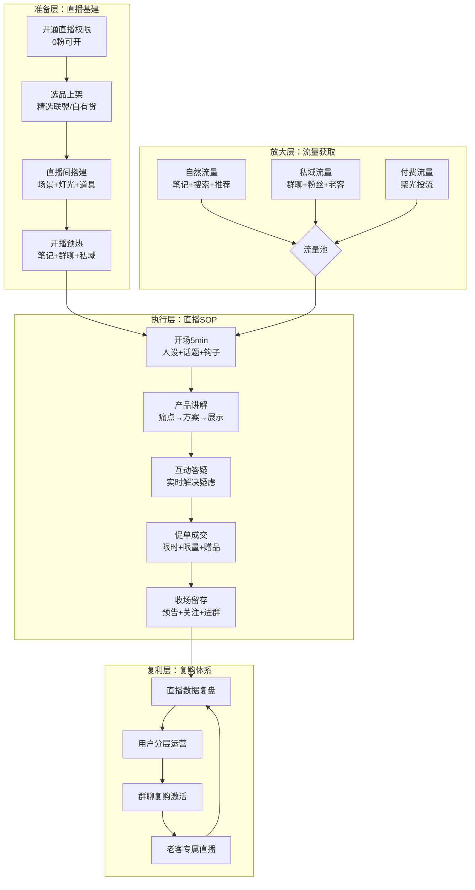
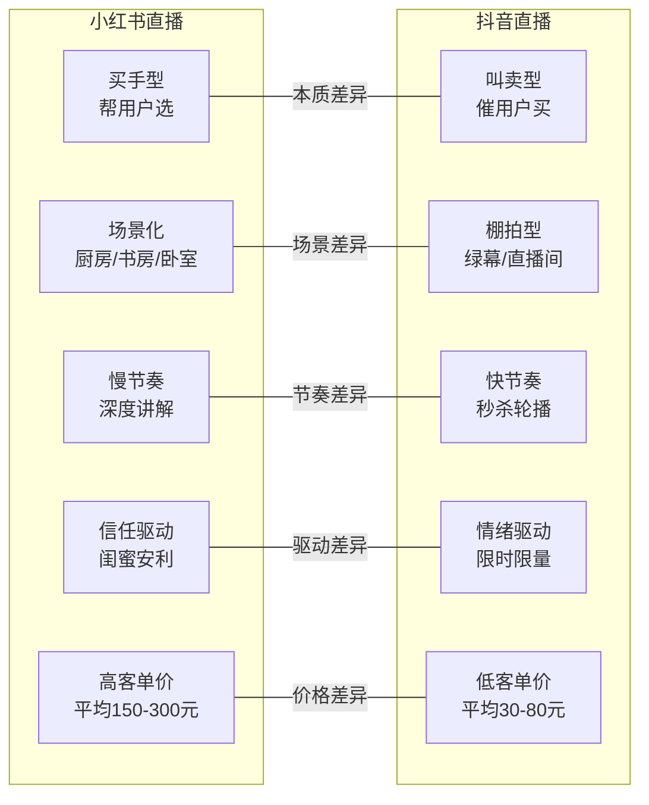
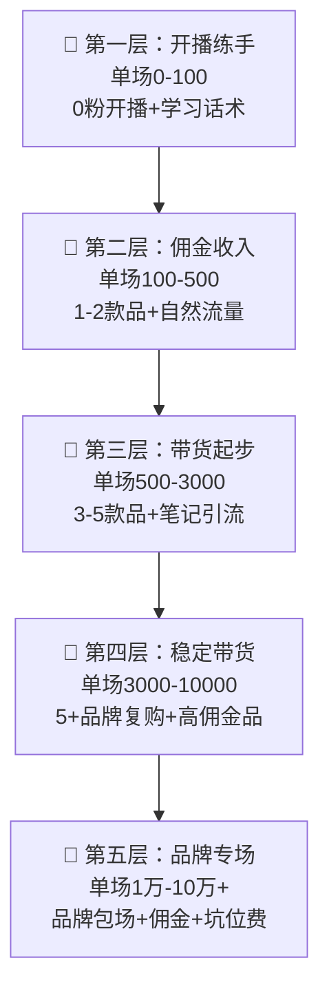

# 📕 Day36: 小红书直播带货实战

> **核心：小红书直播不是「叫卖」，是「闺蜜安利」——用信任+场景+专业度让用户自己下单，0粉也能开播，但1000粉后才开始真正赚钱。反生活账号做直播有降维优势：辟谣者天然自带权威感，你推荐的东西用户信，你揭穿的东西用户服。**
> 来源：小红书直播官方规则 + 头部买手直播拆解 + 2025-2026小红书电商直播白皮书 + 反生活账号直播实战推演

---

## 一、一句话总结

**小红书直播带货 = 买手型直播（选品+讲解+场景）× 笔记引流（开播前预热）× 私域沉淀（开播后复购）。** 和抖音的「叫卖式」直播完全不同，小红书直播的核心是「分享感」——你不是在卖货，你在帮朋友挑好东西。2025-2026年小红书直播GMV增速超200%，平台大力扶持「买手直播」，普通人0粉即可开播，但真正赚钱需要：垂直内容打底 + 精准选品 + 场景化讲解 + 复购体系。

> 💡 **老黄的清醒认知**：反生活账号做直播不是「转型做主播」，而是「把辟谣延伸到直播」。你平时写笔记揭穿智商税，直播时帮用户选真正值得买的东西——逻辑一脉相承，信任无缝衔接。这就是「信任溢价」的直播版：同款产品，用户更愿意从你这里买，因为你是那个「不说谎的人」。

> 关联笔记：[Day11-小红书电商闭环](Day11-小红书电商闭环.md) — 直播是电商闭环的核心成交场
> 关联笔记：[Day20-抖音带货与橱窗](Day20-抖音带货与橱窗.md) — 抖音直播对比参考
> 关联笔记：[Day12-小红书投放与投流](Day12-小红书投放与投流.md) — 直播投流放大
> 关联笔记：[Day35-小红书品牌合作与蒲公英接单实战](Day35-小红书品牌合作与蒲公英接单实战.md) — 品牌合作+直播双重变现
> 关联笔记：[Day19-个人IP打造](Day19-个人IP打造.md) — IP决定直播信任度

---

## 二、核心框架

### 2.1 小红书直播带货全景模型



**核心洞察**：小红书直播的GMV公式 = **场观人数 × 转化率 × 客单价 × 复购率**。新手最容易犯的错是只盯着「场观人数」，但真正决定赚钱的是后三个指标。100人在线、10%转化、200元客单价 = 2000元/场。1000人在线、2%转化、100元客单价 = 也是2000元/场，但前者的复购率远高于后者。

### 2.2 小红书直播 vs 抖音直播 核心差异



**关键结论**：反生活账号做小红书直播 > 做抖音直播。因为反生活的核心竞争力是「信任+专业」，这和小红书直播的「买手型」基因完全匹配。在抖音叫卖反而会破坏人设。

---

## 三、可落地方法

### 3.1 从0开始开播的7天SOP

| 天 | 任务 | 具体动作 | 产出 |
|:--:|------|---------|------|
| Day1 | 开通权限 | 专业号→开通直播→绑定小商店/选品联盟 | 直播间可用 |
| Day2 | 选品上架 | 选3-5个和账号定位相关的品 → 上架到小商店 | 橱窗有货 |
| Day3 | 场景搭建 | 选直播场景（书房/厨房/桌面） → 布置灯光+背景+产品展示区 | 场景就绪 |
| Day4 | 话术准备 | 写3个产品的讲解话术（痛点→方案→展示→促单） | 话术脚本 |
| Day5 | 试播 | 15分钟试播 → 检查画面/声音/网络/互动功能 | 技术OK |
| Day6 | 预热 | 发1条预热笔记 + 群聊预告 + 朋友圈预告 | 预热到位 |
| Day7 | 正式开播 | 30-60分钟首播 → 复盘数据 → 优化下一次 | 首播完成 |

### 3.2 反生活账号直播选品策略

**选品3原则**：

1. **辟谣相关品类优先**：食品/保健品/家居/母婴——这些是反生活辟谣的高发区，用户天然信任你的推荐
2. **自己用过的才推**：反生活人设的核心是「真实」，没用的东西绝对不推，一旦翻车就是信任崩塌
3. **高佣金+高复购**：选佣金率≥30%的品，复购周期≤3个月的品（如食品/日用品/护肤品）

**反生活专属选品表**：

| 品类 | 产品举例 | 佣金率 | 客单价 | 推荐理由 |
|------|---------|:------:|:------:|---------|
| 食品 | 无添加零食/有机调味品 | 30-50% | 50-150 | 「避坑后推荐」，用户信 |
| 保健品 | 维生素/鱼油/益生菌 | 40-60% | 100-300 | 「不交智商税版」，精准定位 |
| 家居 | 检测合格的厨具/收纳 | 25-40% | 80-200 | 「实测推荐」，信任背书 |
| 母婴 | 安全辅食/无添加洗护 | 30-50% | 60-200 | 「避坑指南延伸」，宝妈信任 |
| 知识产品 | 辟谣手册/避坑清单 | 80-100% | 9.9-99 | 零成本，纯利润 |

### 3.3 直播话术框架（反生活专属版）

**开场话术（前5分钟）**：
> "大家好，我是[反生活]，平时帮大家揭穿智商税、避坑防骗。今天直播不是卖货，是帮大家选真正值得买的东西。我选的每一款，都是我自己用过的、查过成分的、确认安全的。你们知道我的风格——不好的一定说，好的才推荐。"

**产品讲解话术（每个产品5-8分钟）**：

```
第1步：抛痛点（1min）
"你们有没有买过XX？市面上90%的XX都有[具体问题]，我之前专门出过笔记揭穿这个坑。"

第2步：给方案（2min）
"今天推荐的这款，我查了[成分表/检测报告/参数]，它[具体优势]。我自己用了[X个月]，[真实体验]。"

第3步：做展示（2min）
现场展示产品 → 对比劣质品 → 展示检测报告/成分表

第4步：促下单（1-2min）
"这款日常价XX元，今天直播间专属价XX元，还额外送[赠品]。下单的宝宝截图给我，我拉进[专属群]后续跟进。"
```

**互动话术（穿插进行）**：
- "有宝宝买过类似产品的，弹幕扣1，我帮你看是不是坑"
- "这个成分表你们看，[具体指标]，这就是区别"
- "不确定要不要买的，先加群，我慢慢帮你分析"

### 3.4 直播间场景搭建指南

| 场景类型 | 适合品类 | 搭建要点 | 成本 |
|---------|---------|---------|:----:|
| **书房场景** | 知识产品/保健品/食品 | 书架背景+台灯+产品展示台 | 0-200元 |
| **厨房场景** | 食品/厨具/调味品 | 干净台面+产品排列+对比区 | 0-300元 |
| **桌面场景** | 全品类通用 | 纯色背景+补光灯+产品支架 | 100-500元 |

**最低成本开播方案**：手机后置摄像头 + 自然光/台灯 + 干净背景 + 产品实物。不需要绿幕，不需要专业灯光，小红书用户更喜欢「真实感」。

### 3.5 预热笔记公式

开播前24小时发预热笔记，公式：

**标题**：`明天[时间]直播！帮你们选[品类]，避坑[数量]款智商税`

**正文**：
1. 抛钩子："最近好多宝宝私信问XX怎么选，我研究了[数量]款，发现[惊人结论]"
2. 预告选品："明天直播我会推荐[数量]款真正好用的，都是从[数量]款里筛出来的"
3. 设置期待："前[数量]名下单的，我额外[福利]"
4. 引导预约："点关注+预约直播，明天准时来"

---

## 四、变现路径

### 4.1 小红书直播变现五层金字塔



### 4.2 各阶段变现详解

| 阶段 | 粉丝量 | 场观 | 单场GMV | 月收入 | 关键动作 |
|:----:|:------:|:----:|:-------:|:------:|---------|
| 练手期 | 0-500 | 10-50 | 0-100 | 0-500 | 每周2播，练话术+测试选品 |
| 起步期 | 500-3000 | 50-200 | 100-500 | 500-2000 | 笔记引流+群聊预热+3-5款品 |
| 增长期 | 3000-1万 | 200-1000 | 500-3000 | 2000-8000 | 投流放大+品牌合作+高佣金品 |
| 稳定期 | 1万-5万 | 1000-5000 | 3000-10000 | 8000-3万 | 品牌专场+私域复购+矩阵号 |
| 头部期 | 5万+ | 5000+ | 1万+ | 3万+ | 品牌包场+自创品牌+直播IP |

### 4.3 反生活账号专属变现路线图

**Phase 1（0-3个月）：信任基建期**
- 目标：开播20场+，场观从10做到100+
- 变现：佣金收入为主，月入500-2000
- 关键：每场直播都录屏，剪辑成短视频二次分发（→关联 [Day23-多平台内容复用](Day23-多平台内容复用.md)）

**Phase 2（3-6个月）：带货增长期**
- 目标：场观100-500，转化率5%+
- 变现：佣金+品牌合作（→关联 [Day35-小红书品牌合作与蒲公英接单实战](Day35-小红书品牌合作与蒲公英接单实战.md)），月入2000-8000
- 关键：建立3-5个品牌复购关系，形成稳定收入

**Phase 3（6-12个月）：稳定盈利期**
- 目标：场观500+，月播8-12场
- 变现：佣金+品牌合作+知识产品，月入8000-3万
- 关键：私域群聊复购+老客专属直播，不依赖新流量也能赚钱

### 4.4 收入计算器

**保守估算（3个月后）**：
- 每周2场直播，场均场观100人
- 转化率5% = 5单/场
- 平均客单价150元，佣金率35%
- 单场佣金 = 5 × 150 × 35% = 262.5元
- 月佣金 = 262.5 × 8场 = 2100元
- 加上品牌合作（月2单×500元）= 3100元/月

**理想估算（6个月后）**：
- 每周3场直播，场均场观300人
- 转化率8% = 24单/场
- 平均客单价200元，佣金率40%
- 单场佣金 = 24 × 200 × 40% = 1920元
- 月佣金 = 1920 × 12场 = 23040元
- 加上品牌合作（月4单×1500元）+ 知识产品 = 3万+/月

---

## 五、行动清单

### ✅ 今天就能做的3件事

**1. 开通直播权限（15分钟）**
- 打开小红书APP → 我 → 设置 → 开通直播
- 如果没有专业号，先升级专业号（免费）
- 绑定小商店或精选联盟，上架1-3个产品

**2. 写一份「反生活直播选品清单」（30分钟）**
- 列出你辟谣过的5个品类
- 在精选联盟搜索对应品类，筛选佣金≥30%的产品
- 每个品类选出1-2个「辟谣后推荐」款
- 记录：产品名/佣金率/客单价/推荐理由

**3. 准备你的第一场直播话术（30分钟）**
- 用3.3的话术框架，写1个产品的完整讲解话术
- 重点打磨「痛点→方案→展示→促单」四个环节
- 对着镜子/手机录屏试讲1遍，计时5-8分钟

### 📋 本周行动计划

| 优先级 | 行动 | 时间 | 预期结果 |
|:------:|------|:----:|---------|
| P0 | 完成直播权限+选品+场景搭建 | Day1-2 | 可以开播 |
| P0 | 写3个产品的直播话术 | Day3-4 | 话术就绪 |
| P1 | 15分钟试播（不公开/仅群聊） | Day5 | 技术验证 |
| P1 | 发预热笔记+群聊预告 | Day6 | 预热到位 |
| P2 | 第一场正式直播30分钟 | Day7 | 首播完成+复盘 |

### 🎯 反生活直播避坑清单

| 坑 | 为什么不能踩 | 正确做法 |
|----|-----------|---------|
| ❌ 叫卖式直播 | 破坏「辟谣者」人设 | 用「帮选」代替「叫卖」 |
| ❌ 推没用的产品 | 一次翻车=信任崩塌 | 只推自己用过+查过成分的 |
| ❌ 一上来就播2小时 | 新手话术不熟+互动弱=冷场 | 从30分钟开始，逐步加长 |
| ❌ 不做预热笔记 | 没人来看=白播 | 每场直播前24小时发预热 |
| ❌ 忽视复盘 | 不复盘=永远不进步 | 每场直播后记录数据+优化 |
| ❌ 只靠自然流量 | 新手场观个位数 | 群聊+私域+笔记三管齐下 |
| ❌ 选低佣金品 | 赚不到钱=坚持不下去 | 选佣金≥30%+复购率高的品 |

---

## 六、进阶技巧

### 6.1 直播数据复盘5维度

| 维度 | 核心指标 | 健康值 | 优化方向 |
|------|---------|:------:|---------|
| 流量 | 场观/最高在线/平均在线 | 逐场增长 | 预热笔记+投流+私域引流 |
| 互动 | 评论数/点赞数/分享数 | 场观×10% | 增加互动话术+提问环节 |
| 转化 | 下单人数/转化率 | ≥3% | 优化话术+选品+促单策略 |
| 收益 | GMV/佣金/客单价 | 逐场增长 | 提升客单价+佣金率 |
| 留存 | 新增关注/群聊加入 | 场观×5% | 关注引导+进群福利 |

### 6.2 投流放大策略（→关联 [Day12-小红书投放与投流](Day12-小红书投放与投流.md)）

- **聚光投流**：场观稳定100+后开始投流，ROI≥1:3才加大
- **投流目标**：首投「直播间观看」，数据稳定后投「直播间下单」
- **预算控制**：首投100元/场测试，ROI达标后逐步加到500元/场
- **投流人群**：选「相似达人粉丝」+「搜索关键词人群」

### 6.3 直播+笔记联动公式

```
1条预热笔记（开播前24h）
    ↓ 引流到直播间
1场直播（30-90min）
    ↓ 录屏剪辑
2-3条直播切片短视频（直播后24h发）
    ↓ 引流到下一场
循环 → 流量飞轮
```

每场直播不是「一次性消耗」，而是「内容矿藏」——1场直播可以产出2-3条二次分发的短视频，这些视频又为下一场直播引流。这就是反生活的「直播内容复利」。

---

## 七、总结

小红书直播带货是反生活账号变现的「加速器」——你有信任，直播有转化率，两者结合就是降维打击。但记住3个核心原则：

1. **信任是命**：推错一次产品，比写错十条笔记后果更严重。直播带货的信任成本远高于笔记。
2. **慢就是快**：从30分钟开始，从1个产品开始，从10个观众开始。不要和头部比场观，和昨天的自己比转化率。
3. **复购是金**：一场直播的新客成交只是开始，把买家变成群聊用户、变成复购老客，才是持续赚钱的关键。

> 🔑 **反生活的直播定位**：不是主播，是「帮用户避坑选好物的朋友」。你的直播间不是卖场，是「避坑诊所」——用户来问诊，你开处方（推荐产品），用户信任你的处方，自然下单。这个逻辑，只有在小红书的「买手型直播」生态里才能跑通。

---

*📅 学习日期：2025-06-05*
*🏷️ 标签：#小红书直播 #直播带货 #买手直播 #变现 #反生活*
