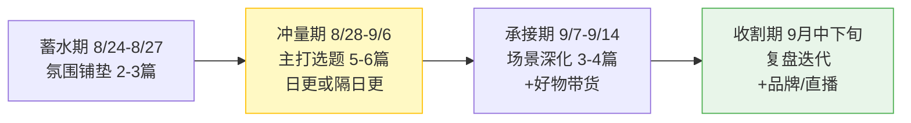
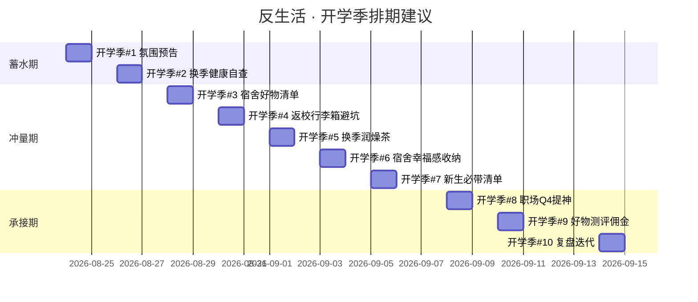
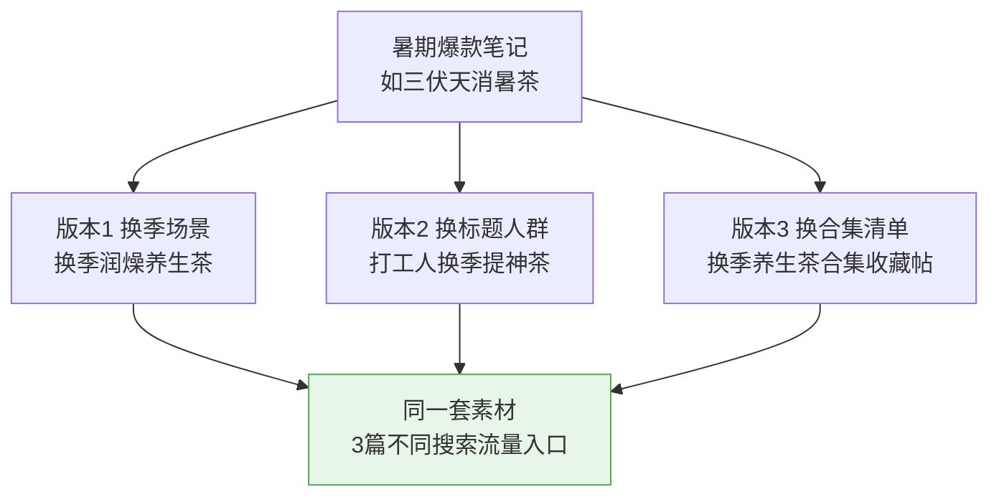
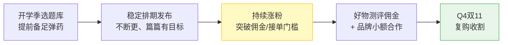

# Day36: 开学季选题库与内容排期——把暑期沉淀的爆款方法论落地成9月的高频选题与发布节奏

> 📅 学习日期：2026-08-03
> 🔗 关联笔记：[[00-目录]] | 上一篇：[[Day35-暑期复盘与开学季衔接]] | 下一篇：[[Day37-开学季直播带货实战]]
> 🎯 适用场景：「反生活」好物养生账号完成暑期复盘后，在8月下旬提前搭建9月开学季的选题库与排期，让第二波流量高峰「内容不断档、节奏不乱套」
> 📚 学习来源：Day35复盘方法论 × 内容选题策划（承接[[Day30-小红书内容选题策划]]） × 搜索SEO长尾词库（承接[[Day23-小红书搜索SEO与长尾流量策略]]） × 视觉体系模板（承接[[Day33-视觉体系设计]]） × 内容工业化生产（承接[[Day28-自媒体内容工业化生产]]） × 冷启动排期节奏（承接[[Day31-自媒体账号冷启动]]）

---

## 1. 一句话总结

**选题库是把「灵感」变成「存货」，内容排期是把「存货」变成「节奏」——开学季真正拉开差距的，不是谁的内容更爆，而是谁能把提前备好的一批高命中率选题，用稳定的发布节奏持续砸向流量窗口，让账号从「偶尔爆一篇」升级成「持续有产出、篇篇有目标」。**

**核心认知：** 大多数账号在开学季翻车，不是因为懒，而是因为临场才想选题、当天才做图、发了三篇就断更。流量高峰来得又快又猛，一旦断更，好不容易冲上去的账号权重和粉丝热度立刻「凉」下来。**「开学季选题库 + 内容排期表」这两件兵器，就是让「反生活」在9月第二波流量里不掉队、不断档、篇篇都打在痛点上的护城河。** 选题库解决「发什么」，排期表解决「什么时候发、发多密、怎么衔接」，两者合起来，把暑期复盘出的一套方法论，变成开学季的一台稳定的「内容引擎」。

---

## 2. 核心框架

### 2.1 开学季「三级选题漏斗」

选题不是拍脑袋，而是从「人群痛点到最终成稿」的三级收敛：

```mermaid
graph TB
    subgraph 第一级 · 海选池<br/>人群×场景×痛点 交叉
        A1[开学季人群<br/>学生/返校/职场新人] --> A2[核心场景<br/>宿舍/行李箱/换季]
        A2 --> A3[高频痛点<br/>熬夜/护眼/久坐/收纳]
        A3 --> A4[海选出 30-50 条<br/>粗选题]
    end

    subgraph 第二级 · 优选池<br/>评分排序
        B1[竞争力评分<br/>同行做得少?] --> B2[时效性评分<br/>契合9月窗口?]
        B2 --> B3[可复制性评分<br/>能系列化?]
        B1 & B2 & B3 --> B4[筛出 15-20 条<br/>待验证选题]
    end

    subgraph 第三级 · 排期池<br/>定稿上线
        C1[配标题公式] --> C2[配封面模板]
        C2 --> C3[配搜索长尾词]
        C3 --> C4[确定 5-10 条<br/>两周主打选题]
    end

    A4 --> B1
    B4 --> C1
    C4 --> D[开学季两周高频发布<br/>篇篇有目标]

    style D fill:#fff9c4,stroke:#ffc107
```

### 2.2 开学季「四场景」内容矩阵

把开学季人群拆成四个可被单篇内容精准命中的场景，每个场景下挂选题：

| 场景 | 核心人群 | 核心痛点 | 「反生活」选题示例 | 主打关键词 |
|:----:|:--------:|:--------|-------------------|:----------:|
| 返校/宿舍 | 大学生 | 宿舍收纳、宿舍环境差、熬夜 | 《开学季宿舍幸福好物清单》 | 宿舍/返校 |
| 换季养生 | 通用+职场 | 换季易感冒、润燥、免疫差 | 《换季润燥养生茶怎么喝》 | 换季/润燥 |
| 职场Q4 | 上班族 | 加班久坐、压力、补气血 | 《打工人Q4提神养生方案》 | 加班/久坐 |
| 学生党消费 | 准大学生/新生 | 开学预算、必备好物、防踩坑 | 《新生行李箱必带好物避坑》 | 新生开学 |

> **四场景的逻辑**：同一批好物，换一个场景和标题，就能「一鱼多吃」——这是[[Day28-自媒体内容工业化生产]]里「一套素材多场景复用」的落地。

### 2.3 开学季「内容排期节奏」框架



---

## 3. 可落地方法

### 3.1 【反生活可直接用】30分钟搭出「开学季选题库」流水线

**核心原则：一次性建好库，后面只需「填坑式」更新，不用每次临场想。**

| 步骤 | 动作 | 工具/方法 | 时间 |
|:----:|------|----------|:----:|
| 1 | 打开四场景表格，每个场景各列 8-10 条粗选题 | 用自己的生活痛点 + 评论区高频问题 + 同行爆款反推 | 20min |
| 2 | 每条选题填「人群/痛点/场景/标题公式/封面模板/搜索词」六字段 | Excel 或 Notion 表格 | 复用上一步 |
| 3 | 按「竞争力×时效性×可复制性」给每条打分排序 | 1-5 分制 | 10min |
| 4 | 选出开学季前两周（8/28-9/6）的主打 5-6 条，划「必做」 | 高亮标记 | 5min |

> **产出：** ✅ 一份 30-40 条的「开学季选题库」，够用一个月，不用临场抓瞎。

### 3.2 【反生活可直接用】选题「六字段」模板（填一次记一劳永逸）

每个选题都按这六格填，方便排期、做图、发搜索：

```
选题：开学季宿舍幸福好物清单
─────────────────────────────
① 人群     ：大学生（尤其大一新生）
② 痛点     ：宿舍破旧/想花小钱提升幸福感
③ 场景     ：开学季·宿舍
④ 标题公式 ：人群+痛点+清单 →《大一新生宿舍幸福感好物清单》
⑤ 封面模板 ：沿用[Day33 视觉体系]「橙色清单卡」版式
⑥ 搜索词   ：宿舍好物 / 大一新生开学必备 / 宿舍幸福感
```

> **关键**：⑥搜索词一定要填，直接喂给[[Day23-小红书搜索SEO与长尾流量策略]]里的流量词——开学季就是一堆「宿舍/返校/换季」长尾词的井喷期，提前占坑等于白捡流量。

### 3.3 【反生活可直接用】开学季排期表（8/24-9/14）



> **节奏心法**：冲量期保持日更或隔日更，让算法在流量窗口持续给你曝光；同时段每篇挂上一步的评论区/私域钩子，让流量沉淀（承接[[Day35-暑期复盘与开学季衔接]]的三层沉淀）。

### 3.4 【反生活可直接用】「一鱼多吃」选题改造法

一条已被验证的暑期爆款，开学季至少能改出 3 种版本，不用重拍重做：



---

## 4. 变现路径

### 4.1 开学季「选题库 + 排期」如何变成钱

选题库和排期本身不赚钱，但它们是让「变现动作」不断档的前提：**稳定内容产出 → 持续涨粉过门槛 → 好物佣金 + 品牌合作持续到账**。



### 4.2 开学季变现收入预估（延续Day31/Day34的爬坡模型）

| 阶段 | 时间 | 粉丝区间 | 月收入预估 | 关键动作 |
|:----:|:----:|:--------:|:----------:|----------|
| 蓄水+冲量期 | 8月底-9月上旬 | 1500-2500 | ¥1000-3000 | 宿舍/返校/换季好物带佣金 |
| 承接期 | 9月上旬-中旬 | 2500-4000 | ¥3000-6000 | 合集佣金帖 + 首批品牌询价 |
| 收割期 | 9月下旬 | 4000-6000 | ¥6000-12000 | 品牌投放 + 为Q4双11蓄势 |

> **给「反生活」的核心提示**：开学季的账号权重和粉丝热度是全年少数几个「能靠稳定更新换翻倍曝光」的窗口。**选题库是让这一切可持续运转的地基——你不需要每天「灵光一现」，只需要每天「从库里取一条、做好它」。**

### 4.3 「带清单的分类帖」是开学季佣金主引擎

开学季用户购物意愿强、决策偏「求助清单式」，所以**「XX清单/合集帖」天然是高佣金点击位**：

```
一篇《宿舍幸福好物清单》
  ↓ 挂上小红书好物佣金链接（承接Day10带货）
  ↓ 每点击一个商品 = 一次佣金机会
  ↓ 开学季购物潮 → 转化率高
  ↓ 合集形成「常青帖」→ 9-11月持续带货
```

---

## 5. 行动清单

### ✅ 行动①：30分钟建好「开学季选题库」（今天做）

**步骤1（10分钟）：** 打开四场景表格，每个场景各列 8-10 条粗选题（宿舍/返校/换季/职场Q4），把自己当过学生的痛点和评论区高频求助都填进去。

**步骤2（10分钟）：** 给每一条填「人群/痛点/场景/标题公式/封面模板/搜索词」六字段——搜索词一定填满，喂给[[Day23-小红书搜索SEO与长尾流量策略]]。

**步骤3（10分钟）：** 按「竞争力×时效性×可复制性」打分，挑出开学季前两周（8/28-9/6）的主打 5-6 条，标成「必做」。

> **产出：** ✅ 一份 30-40 条的「开学季选题库」，往后一个月每天从库里「取菜」，不再临场想题。

### ✅ 行动②：排好开学季前两周排期表（今天做）

**步骤1（5分钟）：** 把 8/28-9/6 排成日更或隔日更，每条安排到具体日期（对齐 3.3 节甘特图）。

**步骤2（10分钟）：** 每条配上标题公式 + 封面模板（沿用[[Day33-视觉体系设计]]）+ 评论区/私域钩子（承接[[Day35-暑期复盘与开学季衔接]]）。

**步骤3（5分钟）：** 把「必做」的 5-6 条里的第 1 条，今天就在草稿箱里做出成稿，明天先发蓄水期预告。

> **产出：** ✅ 一张 9 月开学季「内容作战地图」，谁在什么时候发、发什么，一目了然。

### ✅ 行动③：找 3 个暑期爆款做「一鱼多吃」改造（今天做）

**步骤1（10分钟）：** 从暑期复盘（Day35）标的爆款里挑 3 条。

**步骤2（10分钟）：** 每 1 条按「换场景/换人群/换合集」改造出 3 个开学季版本选题。

**步骤3（5分钟）：** 把这 9 条版本题并入今天的选题库，标上「复用」标签，优先排期发布——不用重拍、省时高效。

> **产出：** ✅ 至少 9 条「一鱼多吃」选题进库，用最低成本把暑期资产搬进开学季。

---

## 📊 今日学习总结

| 维度 | 内容 |
|:----:|------|
| 核心认知 | 选题库解决「发什么」，排期表解决「什么时候发」——两者合起来把暑期方法论变成一台持续运转的内容引擎 |
| 核心框架 | 三级选题漏斗 + 四场景内容矩阵 + 蓄水/冲量/承接/收割四段排期节奏 |
| 关键技能 | 60分钟搭选题库流水线、选题六字段模板、一鱼多吃选题改造法、开学季排期甘特图 |
| 变现路径 | 稳定更新→持续涨粉→好物佣金+品牌合作→Q4双11复购，用选题库让变现不断档 |
| 今日行动 | ① 搭开学季选题库 ② 排前两周排期表 ③ 3个爆款一鱼多吃改造 |

> 下一篇预告：**Day37: 开学季直播带货实战——把9月第二波流量当着用户的面变现**，接住「反生活」开学季的带货转化高峰。
