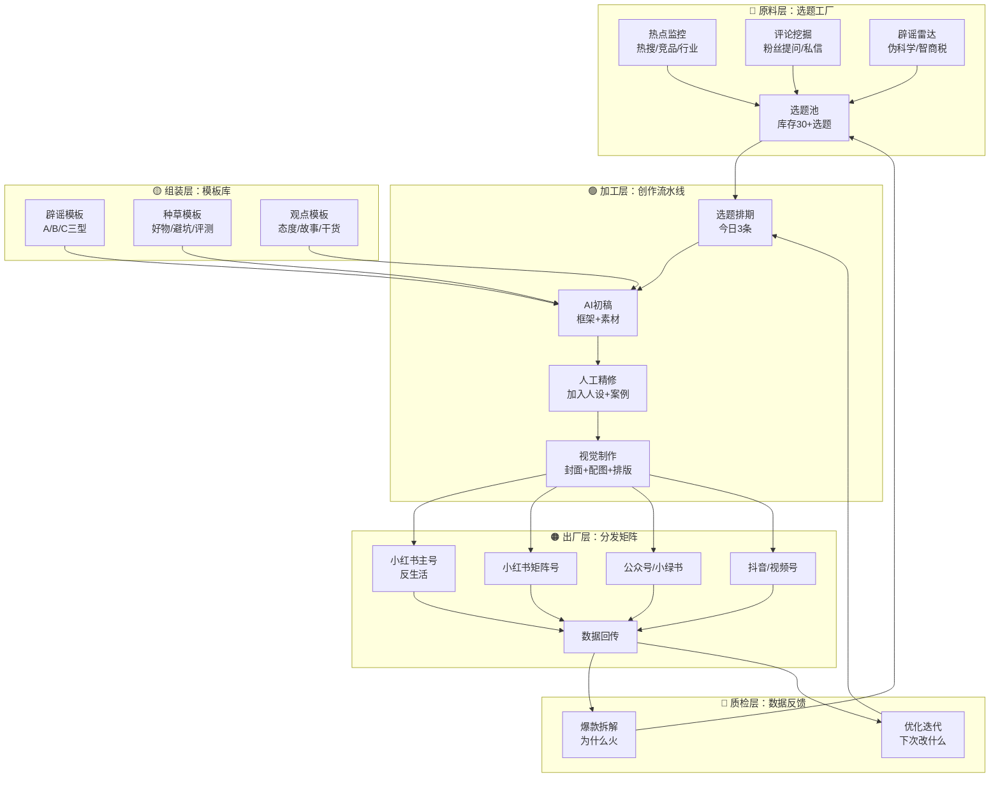
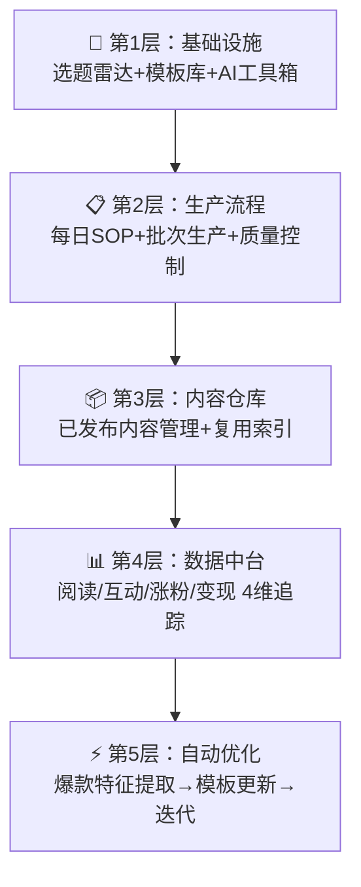
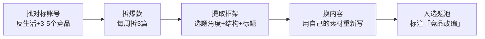
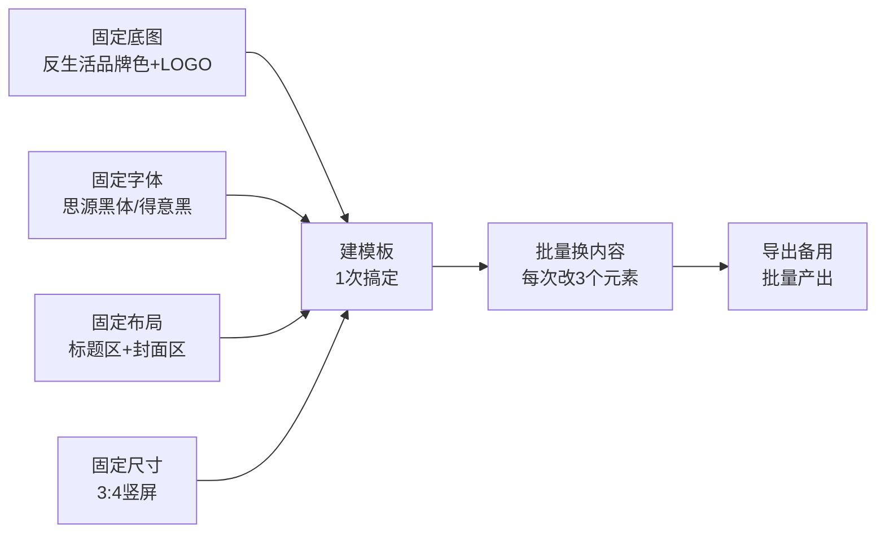
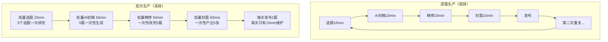
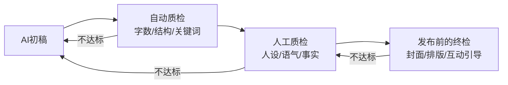
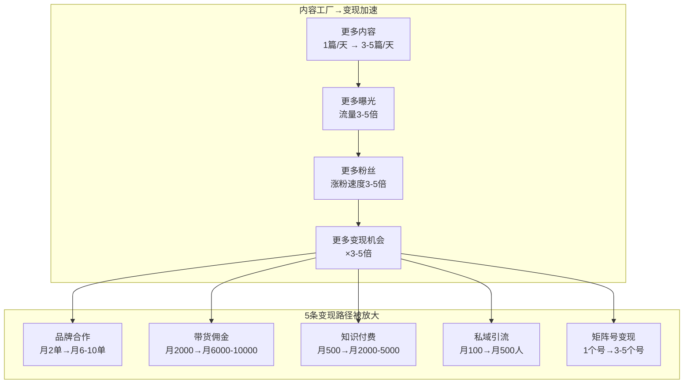
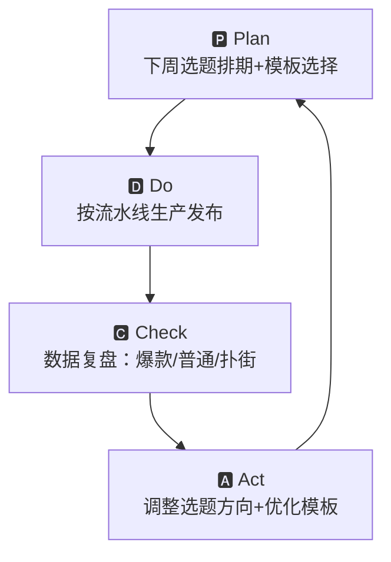

# 📕 Day37: 内容工业化生产流水线

> **核心：自媒体不是「靠灵感创作」，是「靠系统生产」——模块化拆解内容流程，用AI提效，用模板固化，用批次放大，每天稳定输出3-5条高质量内容，像工厂一样高效。反生活账号的核心优势是「选题库天然丰富」：辟谣素材永不枯竭，缺的是把选题快速变成笔记的系统。**
> 来源：内容营销工业化方法论 + AI辅助创作实战 + 反生活账号内容生产体系推演 + 硅谷内容工厂模式本土化

---

## 一、一句话总结

**内容工业化生产 = 选题池（原料）→ AI辅助创作（加工）→ 模板组装（装配）→ 多平台分发（出厂）→ 数据反馈迭代（质检）。** 自媒体做不大的人，99%的问题不是「没才华」，而是「没系统」——今天想一个选题写一篇，明天灵感枯竭又断更。真正的解法是建立一条内容流水线：用系统替代意志力，用模板替代创造力，用批量替代单篇。反生活账号尤其适合工业化生产，因为辟谣选题天然具有「可量化、可重复、可模板化」的特性。

> 💡 **老黄的清醒认知**：你不需要每天绞尽脑汁想「今天写什么」——你只需要维护好选题池，每天从池子里捞3个选题，走流水线加工成笔记。辟谣这个方向最不怕缺素材：每天都有新的伪科学、新的智商税产品、新的营销话术出现，你的选题库天然是活的。

> 关联笔记：[Day29-AI生图与视频工具](Day29-AI生图与视频工具.md) — AI工具是关键加工模块
> 关联笔记：[Day23-多平台内容复用](Day23-多平台内容复用.md) — 一鱼多吃是分发环节的核心
> 关联笔记：[Day19-个人IP打造](Day19-个人IP打造.md) — IP定位决定了选题筛选标准
> 关联笔记：[Day33-小红书数据分析与内容复盘体系](Day33-小红书数据分析与内容复盘体系.md) — 数据反馈是质检环节
> 关联笔记：[Day11-小红书电商闭环](Day11-小红书电商闭环.md) — 流水线的最终产品是「能变现的内容」
> 关联笔记：[Day1-小红书变现全攻略](Day1-小红书变现全攻略.md) — 内容变现的底层逻辑

---

## 二、核心框架

### 2.1 内容工业化生产全景模型



**核心公式**：日产出量 = 选题池存量 × 生产效率 × 模板复用率。当选题池≥30个、AI参与度≥70%、模板复用率≥80%时，每天稳定输出3-5条内容成为「确定性」而非「碰运气」。

### 2.2 传统创作 vs 工业化生产 对比

| 维度 | 传统创作（散户模式） | 工业化生产（工厂模式） |
|------|-------------------|---------------------|
| **选题** | 今天想今天写，没有库存 | 提前1周排好选题，库存30+ |
| **创作** | 从0开始写，每篇耗时2-3h | AI生成初稿，人工精修30min |
| **排版** | 每次重新排版 | 固定模板，粘贴即可 |
| **图片** | 临时找图/拍摄 | 批量制作，封面风格统一 |
| **发布** | 写一篇发一篇 | 批量生产，定时发布 |
| **复盘** | 感觉流，不复盘 | 数据驱动，每篇优化 |
| **可持续性** | 靠灵感→容易断更 | 靠系统→可以日更 |
| **单人产能** | 1篇/天 | 3-5篇/天 |

### 2.3 反生活内容工厂五层体系



**落地顺序**：先用1周搭建基础设施（选题雷达+3个模板+AI工具），再用1周跑通每日SOP，之后每周优化10%的效率提升。

---

## 三、可落地方法

### 3.1 选题工厂：每天自动产生10+选题

**核心逻辑**：不要等灵感，要建管道。4个固定选题来源，每天早上一键刷新。

#### 选题来源1：热点雷达（每天5分钟）

| 监控渠道 | 具体操作 | 频率 |
|---------|---------|:----:|
| 小红书热搜 | 每天早上看笔记灵感→热门话题，记录前10 | 日 |
| 微博热搜 | 关注#生活#健康#消费 分类，记下相关话题 | 日 |
| 抖音热点 | 看同领域达人评论区，用户问什么就是选题 | 日 |
| 百度指数 | 搜索「辟谣/智商税/养生」等核心词，看关联上升词 | 周 |
| 新榜/飞瓜 | 看同领域爆款，记下标题和形式 | 周 |

#### 选题来源2：评论挖掘（金矿在后院）

**反生活账号的评论区就是选题金矿**——每一条评论都是一个潜在选题：

```
评论：「我奶奶每天都在喝这个，说能排毒」
→ 选题：辟谣「排毒养生」——XX产品根本不能排毒
→ 预计流量：中老年人关心的内容，评论区必定引爆

评论：「作者你说不用买XX，那用什么替代？」
→ 选题：盘点5个XX的平价替代品
→ 预计流量：种草+避坑结合，收藏率极高

评论：「真的假的？我用了好几年了」
→ 选题：XX产品的真相，一条视频说清楚
→ 预计流量：争议性内容，互动率高
```

**操作SOP**：每天10分钟，翻看上一条爆款笔记的评论区 → 提取3-5条高赞评论 → 转化为选题 → 入选题池。

#### 选题来源3：竞品分析（拆解爆款模板）



**如何找对标账号**：
- 搜索「辟谣」「智商税」「避坑」「测评」等关键词，找5个万粉以上账号
- 关注他们的每篇爆款，记录数据（点赞/收藏/评论）
- 重点拆解：标题怎么写？第一个画面是什么？结尾怎么引导互动？

#### 选题来源4：辟谣雷达（反生活独有）

反生活账号拥有其他赛道没有的优势——**辟谣素材永远不缺**：

| 来源 | 频率 | 操作 |
|-----|:----:|------|
| 家庭群谣言 | 每天都有 | 爸妈/家族群转发的文章 = 绝佳选题 |
| 朋友圈谣言 | 每天都有 | 「这些食物相克」「这个动作能救命」→ 辟谣 |
| 短视频谣言 | 每天都有 | 某音/某手上「养生产法」「偏方」→ 打假 |
| 商品虚假宣传 | 每天都有 | XX产品宣传的功效 > 实际的功效 |
| 新兴骗局 | 每周都有 | AI换脸诈骗/新型传销/资金盘 |

**操作**：看到谣言直接丢进选题池，标注「辟谣来源+紧急程度」。辟谣类笔记有时效性，当天爆款谣言当天出，流量最高。

#### 选题池管理表（模板）

用飞书/Excel/Airtable维护一个选题池，字段如下：

| 字段 | 说明 | 示例 |
|------|------|------|
| 选题名称 | 简洁的一句话 | 「XX排毒产品是真的吗？」 |
| 来源 | 热点/评论/竞品/辟谣 | 家庭群 |
| 紧急程度 | P0-P3 | P0（今天发）/P1（3天内发） |
| 预计体量 | 短文/长文/视频 | 长文+配图 |
| 关联标签 | 反生活品类 | #健康辟谣 #智商税 |
| 状态 | 待写/写作中/已发 | 待写 |
| 备注 | 关键素材/参考链接 | 家族群截图+专家采访 |

### 3.2 创作流水线：30分钟一篇笔记的SOP

**核心原则**：AI做80%的脏活累活，人做20%的差异化——人设、语气、案例、情绪。

#### Step 1：AI初稿生成（10分钟）

用AI工具（ChatGPT/Claude/DeepSeek等）生成初稿，Prompt模板：

```
你是一个小红书辟谣博主，账号名称「反生活」，人设是「不说假话的辟谣者」。
你的内容风格：口语化、有理有据、有质问精神、结尾有总结和建议。

请你写一篇关于【选题名称】的辟谣笔记，要求：
1. 开头用一句话制造悬念或共鸣
2. 中间用3-4个论点拆解真相，每个论点有数据或事实支撑
3. 用「😱」「🤔」「💡」等emoji增加可读性
4. 结尾给出「行动建议」并引导互动
5. 全文600-800字
6. 标题3个备选，要求有「好奇心缺口」
```

**反生活专属Prompt变体**：
- **辟谣型**：重点在「揭穿逻辑+事实依据+替代方案」
- **观点型**：重点在「态度鲜明+情感共鸣+互动引导」
- **评测型**：重点在「客观对比+真实体验+购买建议」

#### Step 2：人工精修（10分钟）

AI生成的初稿需要你「加上灵魂」：

| 精修项 | 为什么重要 | 怎么做 |
|--------|-----------|--------|
| 🔴 **人设语气** | AI写的太「正」，不像「你」 | 加入你的口头禅、习惯表达方式 |
| 🟡 **个人经历** | 增加真实感，提高信任 | 「我之前也以为……直到我查了……」 |
| 🟢 **本地化案例** | 更有代入感 | 用家人/朋友的真实故事 |
| 🔵 **情绪落点** | 决定互动率 | 结尾加一句「你中招了吗？」「评论区告诉我」 |

**精修检查清单**：
- [ ] 读一遍，像不像你说话的语气？
- [ ] 有没有至少1个你自己的经历/案例？
- [ ] 结尾有引导互动吗？
- [ ] 语气够「人」够「真实」吗？

#### Step 3：视觉制作（10分钟）

视觉是三件套：封面图 + 内文配图 + 排版

**封面图批量制作SOP**（用Canva/醒图/稿定设计）：



**反生活封面模板**（3个通用版）：

| 模板 | 适合内容 | 排版 | 示例文案 |
|------|---------|------|---------|
| **揭穿型** | 辟谣/打假 | 大字标题+震惊表情+对比色 | 「XX排毒，纯属扯淡」 |
| **盘点型** | 清单/推荐 | 数字编号+简约排版 | 「10个你一直在交的智商税」 |
| **提问型** | 观点/故事 | 居中提问+留白 | 「你还信这个？医院早辟谣了」 |

**内文配图**：
- 截图类：谣言原文截图（增强真实感）
- 证据类：检测报告/专家截图/研究数据（增强权威感）
- 对比类：好vs坏的对比图（增强视觉冲击）

### 3.3 批次生产模式：一次产出一周的货

**这是工业化生产的核心**——不是每天写一篇，而是一次性写5篇，分散在5天发。

#### 批次生产日程表

```
周一·上午（2小时）：选题排期
  → 从选题池取5个选题
  → 确定本周发布顺序
  → 收集每个选题的素材（截图/数据/案例）

周一·下午（2小时）：AI初稿
  → 5个选题×10分钟 = 50分钟
  → 精修5篇×10分钟 = 50分钟
  → 视觉制作5篇×15分钟 = 75分钟
  → 总计：~3小时产出下周5天内容

周二至周六（每天15分钟）：
  → 打开当天的笔记，再读一遍修改（定稿）
  → 设置定时发布
  → 回复前一天笔记的评论

周日（1小时）：
  → 数据复盘本周发布的5篇
  → 补充选题池（热点+评论+竞品）
  → 更新模板库
```

#### 为什么批次生产比逐篇生产高效？



**效率对比**：
- 逐篇生产：5篇 × 35分钟 = 约3小时（每天切换状态有损耗）
- 批次生产：3小时一次性产出5篇 = 效率提升300%
- 每周省下：逐篇每天2.5小时 vs 批次每周3小时 = **每周省9.5小时**

### 3.4 反生活专属内容模板库

#### 模板A：辟谣型（反生活核心品类）

```
标题：【震惊/警惕】XX是假的？历年研究发现...
        别再信XX了，医院早就辟谣了
        XX骗了多少人？今天一次性说清楚

正文：
😱 开头（1段）
「你可能每天都在做/吃/用XX，但你不知道的是……」
→ 制造好奇心和紧迫感

🤔 拆解（3-4段）
「为什么XX是错的？我从3个方面给你分析」
① 逻辑漏洞：XX的论证逻辑哪里出了问题？
② 事实打脸：权威数据/研究证明XX不成立
③ 利益动机：谁在传播这个谣言？为什么？
→ 每段150-200字，配合emoji和换行

💡 替代方案（1段）
「那正确的做法是什么？XX才是科学的」
→ 给出可操作的建议，增加收藏价值

💬 结尾（1段）
「你身边还有人信这个吗？转发给TA看看」
→ 引导分享+评论互动
```

#### 模板B：种草型（反生活带货延伸）

```
标题：这XX我用了3个月，终于可以放心推荐了
        测评20款后，只有这款值得买
        和XX说再见，这个替代品太香了

正文：
🤷 痛点引入（1段）
「之前我也踩过XXX的坑，直到我发现了……」
→ 建立共鸣

📊 对比（2-3段）
「我用了3个月，给你说3个最真实的感受」
① 优点1（数据+体验）
② 优点2（对比+差异）
③ 注意点（不忽悠，客观）
→ 真实体验，不夸张

🛒 购买建议（1段）
「哪里买划算？怎么选不吃亏？」
→ 降低决策门槛

💬 互动引导（1段）
「你有用过什么踩雷的东西？评论区说说」
→ 增加评论区互动
```

#### 模板C：观点型（反生活人设强化）

```
标题：关于XX，我想说几句实话
        今天必须说清楚：XX到底该不该做
        20年经验总结：XX是最大的骗局

正文：
🔥 态度开场（1段）
「最近看到好多人说XX，我实在忍不住了……」
→ 态度鲜明，激发同频用户

📖 故事/论据（3-4段）
「我给你讲个真事……」、「我查了一周的资料……」
① 核心观点1 + 支撑案例
② 核心观点2 + 数据/事实
③ 常见误区 + 纠偏
→ 有理有据，不是情绪宣泄

✅ 行动建议（1段）
「所以，我的建议很简单：XX」
→ 简化建议，便于记忆和转发

🗣️ 开放性结尾（1段）
「你觉得呢？同意/不同意都说说你的想法」
→ 引导讨论，提高互动率
```

### 3.5 质量把控：工业化≠粗制滥造

工业化生产最大的担忧是「质量下降」。解决办法是设置**3道质检关卡**：



**自动质检清单**：
- [ ] 字数是否在600-1200字内？
- [ ] 是否有3-4分段结构？
- [ ] 是否有2-3个emoji？
- [ ] 结尾是否有互动引导？
- [ ] 标题是否有「好奇心缺口」？

**人工质检清单**：
- [ ] 语气像「你」吗？不像改到像
- [ ] 有个人经历/案例吗？
- [ ] 事实和数据准确吗？
- [ ] 观点有争议性吗？（没争议=没流量）
- [ ] 用户看完会想点赞/收藏/评论吗？

**终检清单**：
- [ ] 封面图是否用模板3:4竖屏？
- [ ] 标题是否足够吸引人？
- [ ] 配图是否清晰且相关？
- [ ] 是否添加了相关标签？
- [ ] 定时发布是否设置正确？

---

## 四、变现路径

### 4.1 工业化生产如何放大变现



**核心逻辑**：内容量×3 → 总曝光×3 → 涨粉×3 → 变现×3。这不是线性增长，而是复利——更多内容→更多数据→更精准的选题→更高的爆款率→更快的涨粉→更高的议价能力。

### 4.2 各阶段变现预期

| 阶段 | 内容产出 | 粉丝量 | 月收入 | 关键指标 |
|:----:|:--------:|:------:|:------:|---------|
| **搭建期（第1-2周）** | 日更1-2篇 | 现有 | 不变 | 跑通流水线，建立模板 |
| **测试期（第3-4周）** | 日更2-3篇 | +2000-5000 | 暂时不变 | 测试模板效果，优化选题 |
| **稳定期（第2个月）** | 日更3篇 | +5000-10000 | 3000-5000 | 品牌合作+带货启动 |
| **放大期（第3-4个月）** | 日更3-5篇 | +10000-30000 | 5000-15000 | 矩阵号+投流放大 |
| **成熟期（第5-6个月）** | 持续稳定 | 5万+ | 15000-30000+ | 团队化/可复制 |

### 4.3 反生活工业化变现计算器

**保守估算（2个月后）**：
- 日更3篇，月发90篇
- 爆款率10%（即9篇爆款+81篇普通）
- 9篇爆款 × 5万阅读 = 45万阅读
- 81篇普通 × 3000阅读 = 24.3万阅读
- 月总曝光 ≈ 70万阅读
- 新粉获取 ≈ 70万 × 2%转化 = 14000新粉
- 品牌合作 × 月5单 × 1000元 = 5000元
- 带货佣金 × 20单/天 × 30天 × 10元佣金 = 6000元
- **月收入 ≈ 11000元**

**理想估算（4个月后）**：
- 日更5篇（主号3篇+矩阵号2篇），月发150篇
- 爆款率15%（22篇爆款+128篇普通）
- 22篇爆款 × 10万阅读 = 220万阅读
- 128篇普通 × 5000阅读 = 64万阅读
- 月总曝光 ≈ 284万阅读
- 新粉获取 ≈ 284万 × 2% = 5.6万新粉
- 品牌合作 × 月10单 × 1500元 = 15000元
- 带货佣金 × 50单/天 × 30天 × 12元佣金 = 18000元
- 知识付费 × 月50份 × 99元 = 4950元
- **月收入 ≈ 37950元**

### 4.4 工业化生产降低「时间成本」

**隐性收益**：工业化最大的优势不是「多赚钱」，而是「省时间」。

| 模式 | 日产5篇耗时 | 月时长 | 时间价值 |
|:----:|:----------:|:------:|:--------:|
| 逐篇生产 | 5篇×2.5h=12.5h/天 | 375h/月 | 时间全填满 |
| 批次生产 | 3h/周+15min×5天=4.25h/周 | 17h/月 | 省出358h/月 |

省下的358小时/月可以用来：
- 学习新技能（AI工具、数据分析）→ 提升内容质量
- 探索新平台（视频号、抖音）→ 扩大流量入口
- 建立私域体系 → 提高复购率
- 接更多品牌合作 → 直接增加收入

**这就是工业化的复利**——不仅让产出×3，还让时间×0.1。

---

## 五、行动清单

### ✅ 今天就能做的3件事

**1. 建立选题池（30分钟）**
   - 打开飞书/Airtable/Excel，按3.1的表头建一个选题池表格
   - 立刻从以下3个来源捞10个选题：
     - 翻看反生活账号最近的5条评论，提取3条高赞评论 → 转化为选题
     - 打开小红书热搜/微博热搜，提取3个相关热点
     - 家庭群/朋友圈翻一遍，提取4个谣言/伪科学素材
   - 标注每个选题的紧急程度

**2. 制作3个内容模板（30分钟）**
   - 用3.4的模板A/B/C做框架
   - 每个模板填入反生活账号的固定开头、结尾、互动引导
   - 保存到备忘录/Notion/飞书，以后每次写笔记直接套用
   - 重点：把「反生活」的口头禅和固定表达方式写进模板

**3. 做一个封面模板并批量测试（20分钟）**
   - 用Canva/醒图做一个3:4竖屏封面模板
   - 固定底图+字体+排版
   - 用本周的5个选题，批量制作5张封面导出备用
   - ⚡ 关键：一个模板改改文字就能用，不要每张重新做

### 📋 本周工业化落地计划

| 天 | 任务 | 具体动作 | 产出 |
|:--:|------|---------|------|
| **Day1** | 搭建选题池 | 建表格+捞10个选题+排优先序 | 选题池启动 |
| **Day1** | 建模板库 | 制作3个内容模板(A/B/C)+封面模板 | 模板就绪 |
| **Day2** | 批次生产试跑 | 选3个P0选题→AI初稿→精修→封面→定稿 | 3篇笔记待发 |
| **Day3-5** | 每日发布 | 每天发1篇+回复评论+记录数据 | 3篇笔记发布 |
| **Day6** | 数据复盘 | 分析3篇笔记数据（阅读/互动/涨粉） | 优化方向 |
| **Day7** | 优化迭代 | 根据数据调整模板+选题池补货→下批次5篇 | 下周一准备好 |

### 🎯 反生活工业化避坑清单

| 坑 | 为什么不能踩 | 正确做法 |
|----|-----------|---------|
| ❌ 过度依赖AI | 全是AI味=没人味=没关注 | AI出框架+人工加灵魂，人机比例2:8 |
| ❌ 为了数量牺牲质量 | 烂内容越多负资产越大 | 每篇过3道质检，宁少毋滥 |
| ❌ 只看数量不看数据 | 发100篇没人看=白干 | 每篇记录数据，爆款特征提取到模板 |
| ❌ 模板僵化 | 每个笔记都长得一样→用户审美疲劳 | 同模板不同角度，定期更新模板库 |
| ❌ 忽视评论区互动 | 发完就走=放弃最大流量池 | 发后30分钟内+第二天各回复一次 |
| ❌ 选题池不维护 | 选题池枯竭=又回到「今天写什么」 | 每天补3-5个新选题，保持30+库存 |
| ❌ 不分发到多平台 | 一篇内容只发一个平台=浪费 | 按Day23的方法，一鱼多吃到3-5个平台 |

---

## 六、进阶：自动化与迭代

### 6.1 自动化提效（高阶玩法）

当手动跑通流水线后，可以逐步自动化：

| 自动化环节 | 工具 | 效果 |
|-----------|------|------|
| 热点监控 | RSS + 飞书机器人 | 自动推送热点到选题池 |
| 评论收集 | 小红书API/手动 | 定时导出评论 → AI提取选题 |
| AI初稿 | Hermes脚本 / Python自动化 | 一键生成5篇初稿 |
| 定时发布 | 小红书创作者后台 | 提前排好一周的定时发布 |
| 数据复盘 | 飞书多维表格+公式 | 自动计算爆款率/转化率 |
| 封面制作 | Canva批量版 | 一次输入5个标题→批量输出5张封面 |

### 6.2 迭代机制：每周一个PDCA循环



**每周数据复盘表**：

| 维度 | 指标 | 本周数据 | 上周数据 | 变化 | 改进方向 |
|------|------|:--------:|:--------:|:----:|---------|
| 产量 | 发布篇数 | 5 | 3 | +67% | 目标日更3篇 |
| 质量 | 爆款率(点赞>1000) | 20% | 33% | -13% | 优化标题+封面 |
| 流量 | 总阅读 | 50000 | 30000 | +67% | 扩大分发渠道 |
| 增长 | 新增关注 | 500 | 300 | +67% | 优化互动引导 |
| 变现 | 品牌合作/带货收入 | 0 | 500 | — | 满1万粉后开通品牌合作 |

### 6.3 反生活内容工厂年度路线图

| 时间 | 目标 | 关键动作 | 预期成果 |
|:----:|------|---------|---------|
| **第1-2月** | 跑通流水线 | 建选题池+3个模板+批次生产 | 日更3篇，月发90篇 |
| **第3-4月** | 扩大产量 | 建矩阵号+封面批量制作+多平台分发 | 日更5篇，月发150篇 |
| **第5-6月** | 自动化提效 | 热点监控+AI初稿+定时发布+自动复盘 | 效率再提升50% |
| **第7-12月** | 团队化 | 找1-2个助理接力生产 | 日更10篇，矩阵号5个 |

---

## 七、总结

内容工业化不是「把内容变low」，而是用系统思维解决自媒体最核心的难题——**持续稳定地输出高质量内容**。反生活账号做工业化有天然优势：选题永不枯竭（每天都有新谣言新骗局）、模板极度适配（辟谣结构固定）、用户需求稳定（人人都想避坑）。

**记住3个核心原则**：

1. **系统 > 灵感**：灵感给你第一篇爆款，系统给你1000篇爆款。把精力从「想选题」转移到「建系统」上。
2. **模板 > 原创**：90%的内容可以用模板解决，只有10%需要真正的「创作」。模板不是抄袭，是「最佳实践的固化」。
3. **批次 > 逐篇**：一次做5篇的效率是逐篇的3倍以上。你的大脑不适合「每天切换创作模式」，适合「一次沉浸式批量生产」。

> 🔑 **反生活的工业化定位**：你不是自媒体创作者，你是「内容工厂的厂长」。你的工作不是写每一篇笔记，而是设计一条「能把选题变成爆款的生产线」。当你从「创作者」转型为「系统设计师」，你的内容量和变现能力就会指数级增长——这就是工业化生产的终极复利。

---

*📅 学习日期：2025-06-06*
*🏷️ 标签：#内容工业化 #SOP #AI辅助创作 #效率提升 #批量生产 #反生活*